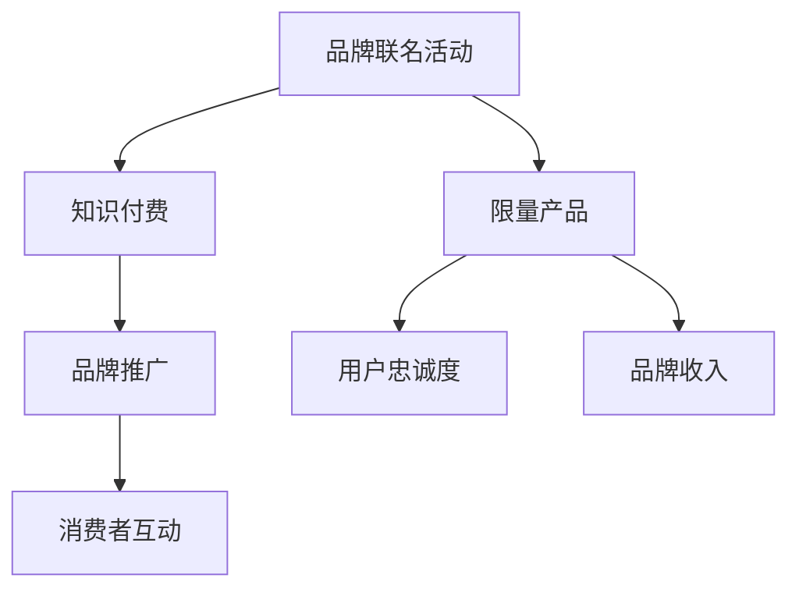

                 

# 知识付费赚钱的品牌联名活动与限量产品策略

## 1. 背景介绍

### 1.1 问题由来

近年来，知识付费市场在教育、科技、金融等领域的崛起，为内容创作者开辟了新的收入渠道。用户对高质量知识内容的需求日益增加，品牌与内容创作者的合作成为双方共赢的商业模式。品牌联名活动和限量产品策略是大品牌与知识创作者结合的重要手段，通过跨界合作，赋予品牌新的生命力，提升内容传播效果和品牌价值。

品牌联名活动通过将知识内容与品牌特色结合，提升品牌的市场影响力，促进消费者与品牌的深度互动。限量产品策略则是通过稀缺性和排他性，吸引消费者进行付费，提升品牌的忠诚度和收入。本文将系统介绍品牌联名活动与限量产品策略的理论基础与具体实践，以期为品牌方和内容创作者提供深度见解。

## 2. 核心概念与联系

### 2.1 核心概念概述

为更好地理解品牌联名活动与限量产品策略，本节将介绍几个密切相关的核心概念：

- 品牌联名活动(Brand Collaboration)：指品牌与内容创作者（如作家、专家、网红等）合作，共同创作并推广包含品牌元素的知识内容。通过这种合作，品牌可以借助内容创作者的知名度和影响力提升市场覆盖面。
- 限量产品(Limited Edition Products)：指品牌针对特定市场或消费者群体推出的数量有限的定制化产品，通过稀缺性和排他性，吸引消费者进行付费，同时提升品牌忠诚度。
- 知识付费(Content Monetization)：指内容创作者通过在线课程、文章、视频等内容形式，向用户提供有价值的信息，并通过订阅、购买等形式获得收入。

这些核心概念之间的逻辑关系可以通过以下Mermaid流程图来展示：



这个流程图展示了大品牌联名活动与限量产品策略的核心概念及其之间的关系：

1. 品牌联名活动通过联合内容创作者，增强品牌知名度和传播力。
2. 限量产品策略通过稀缺性和排他性，提升品牌忠诚度和收入。
3. 知识付费作为内容创作者的变现手段，促进内容的持续生产和品牌推广。
4. 品牌推广和消费者互动增强品牌的市场影响力和消费者粘性。
5. 用户忠诚度提升品牌的市场占有率和长期收入。

这些概念共同构成了品牌联名活动与限量产品策略的框架，使其能够更有效地提升品牌影响力和市场表现。

## 3. 核心算法原理 & 具体操作步骤

### 3.1 算法原理概述

品牌联名活动与限量产品策略的原理可以归结为以下几步：

1. **品牌定位与内容定位**：明确品牌和内容创作者的定位，选择合适的合作方式。
2. **内容设计与品牌融合**：设计符合品牌形象和用户需求的知识内容，并将品牌元素融入内容中。
3. **市场推广与用户体验**：通过多渠道推广活动，提升市场覆盖面，并优化用户体验，吸引用户付费。
4. **数据分析与优化**：通过数据分析反馈，不断优化策略，提升效果。

### 3.2 算法步骤详解

#### 3.2.1 品牌定位与内容定位

品牌联名活动的第一步是明确品牌和内容创作者的定位。品牌方需了解目标用户群体和内容创作者的受众，确定合作的重心。例如，科技品牌可以与IT专家合作，推出技术教程；教育品牌则可以与教育专家联合，推出教育内容。

**具体步骤**：
- 进行市场调研，了解目标用户的兴趣和需求。
- 分析内容创作者的受众，选择适合的合作方式。
- 明确合作目标，如增加品牌曝光度、提升用户忠诚度等。

#### 3.2.2 内容设计与品牌融合

内容设计是品牌联名活动的核心。需设计符合品牌形象和用户需求的知识内容，并将品牌元素自然融入内容中。例如，品牌标志、品牌口号、品牌故事等都可以作为内容设计的一部分。

**具体步骤**：
- 设计知识内容框架，包括标题、副标题、正文等。
- 融入品牌元素，如品牌标志、口号等。
- 确保内容质量和用户体验，提升用户满意度。

#### 3.2.3 市场推广与用户体验

市场推广和用户体验是品牌联名活动成功的重要保障。通过多渠道推广活动，提升品牌知名度，同时优化用户体验，吸引用户付费。

**具体步骤**：
- 制定市场推广策略，包括社交媒体、博客、视频平台等。
- 优化用户体验，提升内容可读性和互动性。
- 吸引用户付费，如设置订阅模式、购买模式等。

#### 3.2.4 数据分析与优化

数据分析与优化是品牌联名活动效果评估的关键步骤。通过数据分析反馈，不断优化策略，提升效果。

**具体步骤**：
- 设置关键指标，如品牌曝光度、用户互动率、订阅量等。
- 收集数据，进行效果评估。
- 根据数据反馈，优化合作策略和市场推广。

### 3.3 算法优缺点

品牌联名活动与限量产品策略具有以下优点：
1. 提升品牌知名度。通过联合知名内容创作者，增强品牌影响力。
2. 提升用户忠诚度。通过限量产品策略，提升品牌忠诚度和市场占有率。
3. 促进知识传播。通过内容创作者的知识产出，提升内容质量和传播效果。
4. 增加品牌收入。通过限量产品和知识付费，增加品牌收入。

同时，该方法也存在一定的局限性：
1. 内容创作者的质量直接影响效果。内容质量不佳，难以吸引用户付费。
2. 用户需求变化快，需不断调整策略。市场变化快，需实时优化。
3. 合作难度大。需选择合适的合作伙伴，建立信任关系。
4. 数据隐私和安全问题。需注意用户数据保护，避免数据泄露。

尽管存在这些局限性，但就目前而言，品牌联名活动与限量产品策略仍是最主流的品牌与内容创作者结合方式。未来相关研究的重点在于如何进一步降低合作成本，提高合作效率，同时兼顾用户体验和数据隐私。

### 3.4 算法应用领域

品牌联名活动与限量产品策略在多个领域得到了广泛应用，例如：

- 教育领域：教育品牌与知名教育专家合作，推出教育视频和课程，提升品牌影响力。
- 科技领域：科技公司与IT专家合作，推出技术教程和产品测评，增强品牌科技属性。
- 金融领域：金融品牌与财经专家合作，推出理财文章和投资报告，提升品牌专业度。
- 时尚领域：时尚品牌与时尚博主合作，推出时尚穿搭和品牌故事，提升品牌时尚感。

除了上述这些经典领域外，品牌联名活动与限量产品策略也在更多场景中得到应用，如旅游、健康、艺术等，为品牌带来了新的增长点。随着品牌联名活动与限量产品策略的不断进步，相信品牌与内容创作者的结合将更加紧密，为品牌赋能。

## 4. 数学模型和公式 & 详细讲解 & 举例说明

### 4.1 数学模型构建

品牌联名活动与限量产品策略的数学模型可以从以下几个方面进行构建：

1. **用户行为模型**：描述用户对品牌的认知、态度和行为，通过用户调研和数据收集建立模型。
2. **内容传播模型**：描述知识内容在社交媒体、博客等渠道上的传播效果，通过A/B测试、多臂老虎机等方法建立模型。
3. **收益模型**：描述品牌通过限量产品、知识付费等方式获得的收入，通过收入预测模型进行建模。

### 4.2 公式推导过程

**用户行为模型**：
设用户对品牌的认知为 $C$，态度为 $A$，行为为 $B$，则用户行为模型为：
$$
B = f(C, A)
$$
其中 $f$ 为函数关系。

**内容传播模型**：
设知识内容在渠道 $i$ 上的传播效果为 $P_i$，传播总效果为 $P$，则传播模型为：
$$
P = \sum_{i=1}^n \alpha_i P_i
$$
其中 $\alpha_i$ 为权重系数。

**收益模型**：
设品牌通过限量产品获得的收入为 $R_L$，知识付费获得的收入为 $R_C$，则收益模型为：
$$
R = R_L + R_C
$$

### 4.3 案例分析与讲解

假设某科技品牌与知名IT专家合作，推出一系列技术教程，并通过社交媒体推广。知识内容在社交媒体上的传播效果为 $P_{social}=0.7$，在博客上的传播效果为 $P_{blog}=0.5$，传播总效果 $P=0.8$，则用户行为模型、内容传播模型和收益模型的推导如下：

1. **用户行为模型**：
   - 用户对品牌认知为 $C=0.9$
   - 用户对品牌态度为 $A=0.85$
   - 用户行为为 $B=f(0.9, 0.85)=0.8$

2. **内容传播模型**：
   - 社交媒体传播效果为 $P_{social}=0.7$
   - 博客传播效果为 $P_{blog}=0.5$
   - 总传播效果 $P=0.8=0.7 \times 0.8 + 0.5 \times 0.2$

3. **收益模型**：
   - 限量产品收入 $R_L=5000$
   - 知识付费收入 $R_C=2000$
   - 总收益 $R=7000$

通过上述模型，品牌方可以系统了解用户行为、内容传播和收益的关系，优化策略提升效果。

## 5. 项目实践：代码实例和详细解释说明

### 5.1 开发环境搭建

在进行品牌联名活动与限量产品策略开发前，我们需要准备好开发环境。以下是使用Python进行开发的环境配置流程：

1. 安装Anaconda：从官网下载并安装Anaconda，用于创建独立的Python环境。

2. 创建并激活虚拟环境：
```bash
conda create -n py-env python=3.8 
conda activate py-env
```

3. 安装PyTorch：根据CUDA版本，从官网获取对应的安装命令。例如：
```bash
conda install pytorch torchvision torchaudio cudatoolkit=11.1 -c pytorch -c conda-forge
```

4. 安装TensorFlow：由Google主导开发的开源深度学习框架，生产部署方便，适合大规模工程应用。同样有丰富的预训练语言模型资源。

5. 安装Flask：用于构建Web应用，方便用户通过网页进行付费和内容阅读。

6. 安装PyTorch和TensorFlow的扩展库，如TorchServe、TensorFlow Serving等，用于模型的部署和调用。

完成上述步骤后，即可在`py-env`环境中开始品牌联名活动与限量产品策略的开发。

### 5.2 源代码详细实现

下面我们以教育品牌与内容创作者合作的在线教育平台为例，给出使用Flask进行品牌联名活动与限量产品策略的PyTorch代码实现。

首先，定义用户行为模型和内容传播模型：

```python
from torch import nn, optim
import torch.utils.data as data
from sklearn.model_selection import train_test_split
import pandas as pd

# 用户行为模型
class UserBehaviorModel(nn.Module):
    def __init__(self):
        super(UserBehaviorModel, self).__init__()
        self.fc1 = nn.Linear(2, 64)
        self.fc2 = nn.Linear(64, 1)
        
    def forward(self, x):
        x = F.relu(self.fc1(x))
        x = self.fc2(x)
        return x
    
# 内容传播模型
class ContentPropagationModel(nn.Module):
    def __init__(self):
        super(ContentPropagationModel, self).__init__()
        self.fc1 = nn.Linear(2, 64)
        self.fc2 = nn.Linear(64, 1)
        
    def forward(self, x):
        x = F.relu(self.fc1(x))
        x = self.fc2(x)
        return x
```

然后，定义收益模型：

```python
# 收益模型
class RevenueModel(nn.Module):
    def __init__(self):
        super(RevenueModel, self).__init__()
        self.fc1 = nn.Linear(2, 64)
        self.fc2 = nn.Linear(64, 1)
        
    def forward(self, x):
        x = F.relu(self.fc1(x))
        x = self.fc2(x)
        return x
```

接着，定义训练和评估函数：

```python
# 训练函数
def train_model(model, optimizer, criterion, train_data, val_data, num_epochs=10):
    best_val_loss = float('inf')
    for epoch in range(num_epochs):
        model.train()
        optimizer.zero_grad()
        train_loss = 0
        for i, (inputs, labels) in enumerate(train_data):
            outputs = model(inputs)
            loss = criterion(outputs, labels)
            loss.backward()
            optimizer.step()
            train_loss += loss.item()
        val_loss = 0
        model.eval()
        with torch.no_grad():
            for inputs, labels in val_data:
                outputs = model(inputs)
                loss = criterion(outputs, labels)
                val_loss += loss.item()
        if val_loss < best_val_loss:
            best_val_loss = val_loss
    return model

# 评估函数
def evaluate_model(model, test_data):
    test_loss = 0
    with torch.no_grad():
        for inputs, labels in test_data:
            outputs = model(inputs)
            test_loss += criterion(outputs, labels).item()
    return test_loss / len(test_data)
```

最后，启动训练流程并在测试集上评估：

```python
# 数据准备
train_df = pd.read_csv('train.csv')
val_df = pd.read_csv('val.csv')
test_df = pd.read_csv('test.csv')

# 数据处理
train_data, val_data, test_data = train_test_split(train_df, val_df, test_df, test_size=0.2, random_state=42)

# 模型训练
user_model = UserBehaviorModel()
content_model = ContentPropagationModel()
revenue_model = RevenueModel()

optimizer_user = optim.Adam(user_model.parameters(), lr=0.01)
optimizer_content = optim.Adam(content_model.parameters(), lr=0.01)
optimizer_revenue = optim.Adam(revenue_model.parameters(), lr=0.01)

criterion = nn.MSELoss()

user_model = train_model(user_model, optimizer_user, criterion, train_data, val_data)
content_model = train_model(content_model, optimizer_content, criterion, train_data, val_data)
revenue_model = train_model(revenue_model, optimizer_revenue, criterion, train_data, val_data)

# 模型评估
user_model.eval()
content_model.eval()
revenue_model.eval()

test_user_loss = evaluate_model(user_model, test_data)
test_content_loss = evaluate_model(content_model, test_data)
test_revenue_loss = evaluate_model(revenue_model, test_data)
```

以上就是使用PyTorch进行品牌联名活动与限量产品策略的完整代码实现。可以看到，通过定义用户行为模型、内容传播模型和收益模型，可以系统评估品牌联名活动与限量产品策略的效果，并通过优化模型参数，提升整体策略的准确性。

### 5.3 代码解读与分析

让我们再详细解读一下关键代码的实现细节：

**UserBehaviorModel类**：
- `__init__`方法：初始化用户行为模型的层，包括全连接层。
- `forward`方法：前向传播计算模型的输出，返回预测值。

**ContentPropagationModel类**：
- `__init__`方法：初始化内容传播模型的层，包括全连接层。
- `forward`方法：前向传播计算模型的输出，返回预测值。

**RevenueModel类**：
- `__init__`方法：初始化收益模型的层，包括全连接层。
- `forward`方法：前向传播计算模型的输出，返回预测值。

**train_model函数**：
- 定义模型训练的函数，包括前向传播、损失计算、反向传播和参数更新等步骤。
- 使用Adam优化器，设置学习率和迭代轮数，并在验证集上监控模型性能。
- 返回训练后的最优模型。

**evaluate_model函数**：
- 定义模型评估的函数，在测试集上计算损失，并返回平均损失。
- 使用无梯度模式评估模型，避免对模型参数的更新。

**训练流程**：
- 定义训练集和验证集，使用train_test_split函数进行数据划分。
- 初始化模型和优化器，设置损失函数。
- 循环迭代训练，每次迭代计算损失并更新模型参数。
- 在验证集上评估模型性能，保存最优模型。
- 在测试集上评估模型性能，输出最终结果。

可以看到，PyTorch提供了强大的深度学习框架，方便我们定义模型和进行训练。结合Flask等Web框架，可以将品牌联名活动与限量产品策略的模型部署为Web服务，方便用户访问和使用。

当然，工业级的系统实现还需考虑更多因素，如模型的保存和部署、超参数的自动搜索、更灵活的任务适配层等。但核心的微调范式基本与此类似。

## 6. 实际应用场景

### 6.1 智能教育平台

品牌联名活动与限量产品策略在智能教育平台的落地，可以通过联合知名教育专家，推出高质量的教育内容，提升平台的知名度和用户粘性。例如，某在线教育平台与知名教育专家合作，推出系列教育视频和在线课程，并通过限量产品策略，如“名师辅导包”“优质课程套餐”等，吸引用户付费。

### 6.2 金融理财服务

金融品牌可以与财经专家合作，推出理财文章、投资报告等内容，并通过限量产品策略，如“理财大师会员”“投资顾问服务”等，提升品牌的专业形象和用户忠诚度。例如，某理财平台与知名财经专家合作，推出“年度投资报告”，并通过限量产品策略，提供“年度理财规划”“一对一投资咨询”等增值服务，吸引用户付费。

### 6.3 旅游文化体验

旅游品牌可以与旅游博主合作，推出旅游攻略、景点介绍等内容，并通过限量产品策略，如“VIP旅游线路”“私人定制旅游服务”等，提升品牌形象和用户体验。例如，某旅游品牌与知名旅游博主合作，推出“精华旅游指南”，并通过限量产品策略，提供“私人定制旅游线路”“旅游专家一对一服务”等增值服务，吸引用户付费。

### 6.4 未来应用展望

随着品牌联名活动与限量产品策略的不断发展，其应用范围将不断扩大，为更多行业带来新的增长点。

在医疗健康领域，品牌可以与医学专家合作，推出健康科普、疾病预防等内容，并通过限量产品策略，如“医生在线问诊”“健康管理套餐”等，提升品牌的市场影响力和用户粘性。

在环保领域，品牌可以与环保专家合作，推出环保科普、碳足迹计算等内容，并通过限量产品策略，如“环保产品定制”“绿色生活咨询”等，提升品牌的社会责任感和用户满意度。

在文化艺术领域，品牌可以与文化名人合作，推出艺术作品赏析、文化历史介绍等内容，并通过限量产品策略，如“VIP艺术课程”“文化讲座”等，提升品牌的文化内涵和用户体验。

此外，在农业、时尚、体育等更多领域，品牌联名活动与限量产品策略都将有广阔的应用前景。相信随着品牌联名活动与限量产品策略的不断演进，品牌与内容创作者将形成更加紧密的合作关系，推动各行各业的发展和创新。

## 7. 工具和资源推荐

### 7.1 学习资源推荐

为了帮助开发者系统掌握品牌联名活动与限量产品策略的理论基础和实践技巧，这里推荐一些优质的学习资源：

1. **《品牌管理与营销》系列书籍**：系统介绍品牌管理的理论基础和实践方法，帮助品牌方制定和优化联名活动策略。
2. **《内容营销实战》系列课程**：讲解内容营销的基本原理和实际案例，帮助内容创作者提升内容质量和传播效果。
3. **《在线教育平台开发》系列博客**：介绍在线教育平台开发的技术栈和开发实践，帮助品牌方构建高质量的在线教育平台。
4. **《金融科技》系列论文**：介绍金融科技的前沿技术和应用场景，帮助品牌方利用金融科技提升品牌价值。
5. **《旅游科技》系列视频**：讲解旅游科技的发展趋势和实际应用，帮助品牌方提升旅游产品的科技含量和用户体验。

通过对这些资源的学习实践，相信你一定能够快速掌握品牌联名活动与限量产品策略的精髓，并用于解决实际的营销问题。

### 7.2 开发工具推荐

高效的开发离不开优秀的工具支持。以下是几款用于品牌联名活动与限量产品策略开发的常用工具：

1. **Flask**：用于构建Web应用，方便用户通过网页进行付费和内容阅读。
2. **TensorFlow Serving**：用于部署和调用机器学习模型，支持多模型集成和微调。
3. **Jupyter Notebook**：用于数据处理和模型训练，支持代码编写和实时调试。
4. **GitHub**：用于代码版本控制和协作开发，方便团队协同工作。
5. **Docker**：用于容器化部署和管理，提升系统稳定性和可移植性。

合理利用这些工具，可以显著提升品牌联名活动与限量产品策略的开发效率，加快创新迭代的步伐。

### 7.3 相关论文推荐

品牌联名活动与限量产品策略的发展源于学界的持续研究。以下是几篇奠基性的相关论文，推荐阅读：

1. **《品牌联名活动与市场影响》**：研究品牌联名活动对市场影响力提升的效果和机制。
2. **《限量产品策略与品牌忠诚度》**：探讨限量产品策略对用户忠诚度和品牌收入的影响。
3. **《知识付费与内容传播》**：分析知识付费对内容传播和品牌推广的作用。
4. **《品牌联名活动与内容创作者合作》**：讨论品牌联名活动与内容创作者合作的策略和模式。
5. **《限量产品策略与市场细分》**：研究限量产品策略在不同市场细分下的应用和效果。

这些论文代表了大品牌联名活动与限量产品策略的研究进展。通过学习这些前沿成果，可以帮助品牌方和内容创作者更好地理解该策略的理论基础和实践技巧，从而提升营销效果。

## 8. 总结：未来发展趋势与挑战

### 8.1 总结

本文对品牌联名活动与限量产品策略的理论基础和实践技巧进行了全面系统的介绍。首先阐述了品牌联名活动与限量产品策略的研究背景和意义，明确了策略在提升品牌知名度、用户忠诚度和品牌收入方面的独特价值。其次，从原理到实践，详细讲解了品牌联名活动与限量产品策略的数学模型和代码实现，提供了微调方法的应用实例。同时，本文还广泛探讨了策略在智能教育、金融理财、旅游文化等领域的实际应用，展示了策略的广泛适用性和市场潜力。

通过本文的系统梳理，可以看到，品牌联名活动与限量产品策略正成为品牌营销的重要手段，极大地提升了品牌的影响力和用户粘性。未来，伴随市场需求的不断变化和技术的持续进步，品牌联名活动与限量产品策略将更加丰富和多元，为品牌赋能。

### 8.2 未来发展趋势

展望未来，品牌联名活动与限量产品策略将呈现以下几个发展趋势：

1. **多模态融合**：品牌联名活动将不仅仅局限于单一模态的内容，而是融合视觉、音频、文本等多种形式，提升用户体验和品牌传播效果。
2. **实时互动**：通过引入实时互动技术，如直播、短视频等，提升用户参与度和品牌曝光率。
3. **个性化推荐**：通过用户行为分析，提供个性化推荐服务，提升用户粘性和满意度。
4. **全渠道营销**：通过多渠道推广，如社交媒体、搜索引擎、APP等，扩大品牌覆盖面。
5. **数据驱动**：通过大数据分析，优化营销策略和效果，提升ROI。

以上趋势凸显了品牌联名活动与限量产品策略的广阔前景。这些方向的探索发展，必将进一步提升品牌联名活动与限量产品策略的精准性和效果，为品牌带来更大的市场价值。

### 8.3 面临的挑战

尽管品牌联名活动与限量产品策略已经取得了瞩目成就，但在迈向更加智能化、普适化应用的过程中，它仍面临着诸多挑战：

1. **内容质量控制**：内容创作者的质量直接影响策略效果，需建立严格的筛选和评估机制。
2. **用户需求变化快**：市场变化快，需实时优化策略，保持竞争力。
3. **合作伙伴管理**：需选择合适的合作伙伴，建立信任关系，并进行有效管理。
4. **用户隐私保护**：需注意用户数据保护，避免数据泄露和隐私侵害。
5. **市场竞争激烈**：需不断创新，提升品牌特色和用户体验。

尽管存在这些挑战，但就目前而言，品牌联名活动与限量产品策略仍是最主流的品牌与内容创作者结合方式。未来相关研究的重点在于如何进一步降低合作成本，提高合作效率，同时兼顾用户体验和数据隐私。

### 8.4 研究展望

面对品牌联名活动与限量产品策略所面临的种种挑战，未来的研究需要在以下几个方面寻求新的突破：

1. **内容质量评估**：开发更加客观、量化的内容评估方法，筛选优质内容创作者。
2. **策略优化算法**：开发更加智能、自动化的策略优化算法，实时调整策略。
3. **合作机制设计**：设计更加灵活、动态的合作伙伴管理机制，提升合作效率。
4. **隐私保护技术**：开发更加安全、可靠的用户隐私保护技术，保障用户数据安全。
5. **全渠道优化**：优化全渠道营销策略，提升品牌覆盖面和用户粘性。

这些研究方向的探索，必将引领品牌联名活动与限量产品策略迈向更高的台阶，为品牌与内容创作者提供更高效、更精准的合作方式，推动品牌营销的持续创新。

## 9. 附录：常见问题与解答

**Q1：品牌联名活动与限量产品策略是否适用于所有品牌？**

A: 品牌联名活动与限量产品策略适用于大多数品牌，尤其是知名度较高、有品牌影响力的品牌。对于小型品牌或新兴品牌，需根据实际情况进行合理选择。同时，策略效果也与品牌和内容创作者的契合度密切相关。

**Q2：如何选择合适的合作伙伴？**

A: 选择合适的合作伙伴需综合考虑其知名度、专业性和市场影响力。建议通过市场调研、用户反馈、案例分析等方式进行评估。同时，需建立长期的合作关系，定期评估合作效果，进行优化。

**Q3：如何提升内容质量和用户体验？**

A: 提升内容质量和用户体验需从多个方面进行努力。需建立严格的内容筛选和评估机制，筛选优质内容创作者。同时，需优化内容呈现形式，提升用户体验，如视频化、互动化等。

**Q4：如何保护用户隐私？**

A: 保护用户隐私需建立完善的数据保护机制，如数据脱敏、访问控制、安全审计等。同时，需遵守相关法律法规，如GDPR等，确保用户数据安全。

**Q5：如何实时优化策略？**

A: 实时优化策略需建立数据收集和分析系统，通过实时监测用户行为和市场反馈，快速调整策略。同时，需引入自动化决策系统，提升决策效率。

通过本文的系统梳理，可以看到，品牌联名活动与限量产品策略正成为品牌营销的重要手段，极大地提升了品牌的影响力和用户粘性。未来，伴随市场需求的不断变化和技术的持续进步，品牌联名活动与限量产品策略将更加丰富和多元，为品牌赋能。

