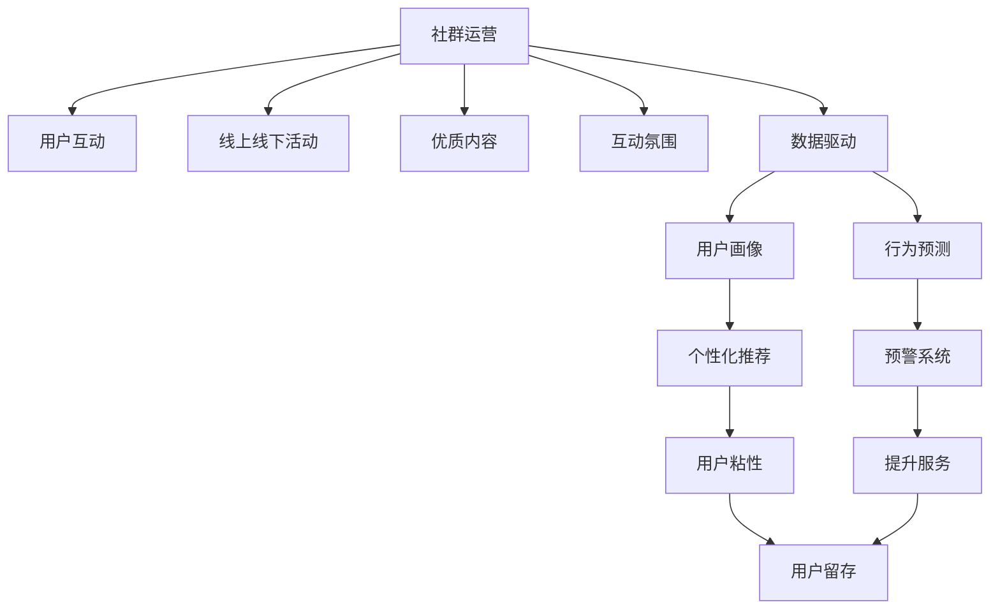

                 

# 知识付费赚钱的社群运营与用户管理

## 1. 背景介绍

随着互联网的快速发展和教育水平的不断提高，知识付费市场逐渐兴起，用户对高质内容的需求不断增长。社群运营和用户管理成为了知识付费平台发展的关键。本文将从知识付费的社群运营与用户管理的角度出发，探索如何通过技术手段提升用户体验、优化服务流程、提升运营效率，从而实现平台盈利目标。

## 2. 核心概念与联系

### 2.1 核心概念概述

在知识付费领域，社群运营和用户管理是平台成功的基石。社群运营通过构建用户互动环境，增加用户粘性；用户管理则通过精细化运营，提升用户满意度和平台盈利能力。两者相辅相成，共同构成知识付费平台的核心竞争力。

- **社群运营**：通过组织线上线下活动、提供优质内容、营造互动氛围等手段，构建用户社区，增加用户参与度和忠诚度。
- **用户管理**：通过数据分析、用户画像、行为预测等技术，提升用户体验，优化服务流程，增加用户留存率，实现平台收益最大化。

### 2.2 核心概念原理和架构的 Mermaid 流程图



该图展示了社群运营和用户管理之间的联系与作用。社群运营通过丰富多样的活动和内容吸引用户，营造互动氛围，并利用数据驱动手段构建用户画像和行为预测模型。用户管理则通过个性化推荐和预警系统，提升服务质量，增加用户粘性，最终实现用户留存和平台盈利。

## 3. 核心算法原理 & 具体操作步骤

### 3.1 算法原理概述

社群运营和用户管理涉及多个领域的算法和技术，如机器学习、数据挖掘、自然语言处理等。核心算法包括用户画像构建、行为预测、个性化推荐等，旨在通过数据分析提升用户体验，优化运营流程，增加用户留存率。

### 3.2 算法步骤详解

#### 3.2.1 用户画像构建

用户画像是指通过数据分析技术构建的用户特征集合，用于描述用户的行为、兴趣和需求。构建用户画像的步骤如下：

1. **数据收集**：收集用户在平台上的行为数据，包括浏览记录、购买记录、互动数据等。
2. **数据预处理**：对收集到的数据进行清洗、去重、归一化等处理，确保数据的准确性和一致性。
3. **特征提取**：使用特征提取算法，如TF-IDF、PCA等，将原始数据转化为高维特征向量。
4. **模型训练**：使用机器学习算法，如K-Means、LDA等，对特征向量进行聚类或降维处理，生成用户画像。

#### 3.2.2 行为预测

行为预测是指通过历史数据预测用户未来的行为，如购买意向、内容偏好等。常用的算法包括协同过滤、随机森林、神经网络等。

1. **数据准备**：收集用户行为数据，包括点击、浏览、购买等行为数据，并进行预处理。
2. **特征工程**：根据用户行为设计合适的特征，如浏览时长、购买频率等。
3. **模型选择**：选择适合的算法进行模型训练，如协同过滤、随机森林等。
4. **模型评估**：使用交叉验证等方法评估模型性能，并进行调参优化。

#### 3.2.3 个性化推荐

个性化推荐是指根据用户画像和行为预测，为用户推荐符合其兴趣的内容。常用的推荐算法包括基于协同过滤的推荐、基于内容的推荐、基于深度学习的推荐等。

1. **用户画像获取**：通过用户画像构建算法，获取用户特征向量。
2. **内容表示**：将内容转化为向量形式，如TF-IDF、词向量等。
3. **模型训练**：使用推荐算法进行模型训练，如基于协同过滤的矩阵分解方法、基于内容的协同过滤方法等。
4. **推荐评估**：使用推荐指标如精度、召回率等评估推荐效果，并进行调参优化。

### 3.3 算法优缺点

#### 3.3.1 用户画像构建

- **优点**：
  - 通过数据分析，可以全面了解用户特征，提高用户理解度。
  - 基于用户画像，可以进行精细化运营，提升用户体验。

- **缺点**：
  - 数据隐私和安全问题，需要严格遵守法律法规。
  - 数据噪音和缺失对画像准确性有较大影响。

#### 3.3.2 行为预测

- **优点**：
  - 通过预测用户行为，可以提前进行干预，提升用户转化率。
  - 基于用户行为预测，可以进行个性化推荐，提高用户满意度。

- **缺点**：
  - 数据采集和处理复杂，需要大量计算资源。
  - 模型泛化能力有限，需定期更新。

#### 3.3.3 个性化推荐

- **优点**：
  - 通过个性化推荐，可以提高用户粘性，增加用户留存率。
  - 基于推荐模型，可以动态调整推荐策略，提升推荐效果。

- **缺点**：
  - 推荐算法复杂，需要大量数据和计算资源。
  - 推荐效果依赖于数据质量和算法模型。

### 3.4 算法应用领域

社群运营和用户管理涉及的算法技术在多个领域有广泛应用，如电商平台、社交媒体、在线教育等。以下是几个典型的应用场景：

- **电商平台**：通过用户画像和行为预测，提升用户购买意向预测准确性，优化推荐算法，增加用户转化率。
- **社交媒体**：通过社群运营和用户画像，提升用户互动频率和平台粘性，增加用户留存率。
- **在线教育**：通过用户画像和行为预测，提升课程推荐效果，优化学习体验，增加用户满意度。

## 4. 数学模型和公式 & 详细讲解 & 举例说明

### 4.1 数学模型构建

#### 4.1.1 用户画像构建

用户画像模型通常使用聚类算法构建，如K-Means、LDA等。以K-Means为例，其数学模型为：

$$
\begin{aligned}
&\min_{\mathbf{C}, \mathbf{Z}} \sum_{i=1}^{n} \sum_{k=1}^{K} ||\mathbf{x}_i - \mathbf{C}_k||^2 + \sum_{k=1}^{K} ||\mathbf{Z}_k||^2_F \\
&s.t. \sum_{k=1}^{K} z_{ik} = 1, z_{ik} \geq 0, i = 1, ..., n, k = 1, ..., K
\end{aligned}
$$

其中，$\mathbf{x}_i$ 为第 $i$ 个用户的特征向量，$\mathbf{C}_k$ 为第 $k$ 个聚类的中心点，$\mathbf{Z}_k$ 为第 $k$ 个聚类的用户向量，$K$ 为聚类数。

#### 4.1.2 行为预测

行为预测通常使用随机森林、神经网络等算法。以随机森林为例，其数学模型为：

$$
f(x) = \sum_{i=1}^{m} \sum_{j=1}^{n} T_{i,j}g_j(x)
$$

其中，$f(x)$ 为预测函数，$m$ 为树的个数，$n$ 为每棵树的叶子数，$T_{i,j}$ 为权重，$g_j(x)$ 为单棵树的预测函数。

#### 4.1.3 个性化推荐

个性化推荐通常使用协同过滤、矩阵分解等算法。以协同过滤为例，其数学模型为：

$$
\min_{\mathbf{P}, \mathbf{Q}} ||\mathbf{P} \mathbf{Q}^T - \mathbf{R}||_F^2
$$

其中，$\mathbf{P}$ 为用户矩阵，$\mathbf{Q}$ 为物品矩阵，$\mathbf{R}$ 为真实评分矩阵，$||.||_F$ 为矩阵的 Frobenius 范数。

### 4.2 公式推导过程

#### 4.2.1 用户画像构建

K-Means算法的基本步骤包括：
1. 随机初始化聚类中心点 $\mathbf{C}_k$。
2. 计算每个样本与聚类中心的距离，将样本分配到最近的聚类。
3. 重新计算每个聚类的中心点 $\mathbf{C}_k$。
4. 重复2和3，直至聚类中心不再变化。

#### 4.2.2 行为预测

随机森林算法的基本步骤包括：
1. 从训练数据集中随机抽取样本，构建决策树。
2. 对每个节点进行特征分裂，选择最佳分裂特征和分裂阈值。
3. 对每棵树进行预测，计算预测结果。
4. 通过投票或平均方式集成所有树的预测结果，得到最终预测结果。

#### 4.2.3 个性化推荐

协同过滤算法的核心步骤包括：
1. 构建用户-物品评分矩阵 $\mathbf{R}$。
2. 将评分矩阵分解为用户矩阵 $\mathbf{P}$ 和物品矩阵 $\mathbf{Q}$。
3. 根据分解后的矩阵计算预测评分。
4. 对预测评分进行排序，得到推荐结果。

### 4.3 案例分析与讲解

#### 4.3.1 用户画像构建

以某在线教育平台为例，通过收集用户的历史浏览、学习行为数据，使用K-Means算法构建用户画像，得到不同特征群体的用户特征。具体步骤如下：

1. 收集用户浏览记录，提取浏览内容、浏览时长、浏览频率等特征。
2. 对特征进行归一化处理，确保数据一致性。
3. 使用K-Means算法，设置聚类数为5，进行聚类分析，得到5个用户画像。
4. 对每个用户画像进行特征描述，如用户年龄、地域、学习偏好等。

#### 4.3.2 行为预测

以某电商平台为例，通过收集用户的历史购买行为数据，使用随机森林算法预测用户未来的购买意向。具体步骤如下：

1. 收集用户购买记录，提取购买时间、购买金额、购买频率等特征。
2. 对特征进行归一化处理，确保数据一致性。
3. 使用随机森林算法，设置树的数量为100，进行模型训练。
4. 对模型进行交叉验证，评估预测准确率，并进行调参优化。

#### 4.3.3 个性化推荐

以某社交媒体为例，通过收集用户的历史互动数据，使用协同过滤算法为用户推荐相关内容。具体步骤如下：

1. 收集用户的历史互动数据，如点赞、评论、分享等行为数据。
2. 对数据进行预处理，计算用户-物品评分矩阵。
3. 使用协同过滤算法，进行矩阵分解，得到用户矩阵和物品矩阵。
4. 对预测评分进行排序，向用户推荐相关内容。

## 5. 项目实践：代码实例和详细解释说明

### 5.1 开发环境搭建

在进行社群运营和用户管理系统的开发时，需要搭建相应的开发环境。以下是使用Python和Flask框架的开发环境配置流程：

1. 安装Python和Flask：
```bash
pip install python flask
```

2. 创建虚拟环境：
```bash
python -m venv env
source env/bin/activate
```

3. 安装必要的依赖包：
```bash
pip install numpy pandas scikit-learn joblib dask
```

4. 安装模型训练和预测库：
```bash
pip install scikit-learn tensorflow keras
```

完成上述步骤后，即可在虚拟环境中开始开发。

### 5.2 源代码详细实现

#### 5.2.1 用户画像构建

```python
import numpy as np
from sklearn.cluster import KMeans

# 生成随机用户特征数据
n_samples = 1000
n_features = 10
X = np.random.rand(n_samples, n_features)

# 使用K-Means算法进行聚类
n_clusters = 5
kmeans = KMeans(n_clusters=n_clusters, random_state=0).fit(X)

# 输出聚类结果
print(kmeans.labels_)
```

#### 5.2.2 行为预测

```python
from sklearn.ensemble import RandomForestRegressor

# 生成随机用户行为数据
n_samples = 1000
n_features = 5
X = np.random.rand(n_samples, n_features)
y = np.random.rand(n_samples)

# 使用随机森林算法进行预测
rf = RandomForestRegressor(n_estimators=100, random_state=0).fit(X, y)

# 输出预测结果
print(rf.predict(X[:10]))
```

#### 5.2.3 个性化推荐

```python
from sklearn.metrics.pairwise import cosine_similarity
from scipy.sparse import coo_matrix

# 生成随机用户-物品评分矩阵
n_users = 1000
n_items = 1000
R = np.random.randint(0, 5, size=(n_users, n_items))

# 构建稀疏矩阵
R_sparse = coo_matrix(R)

# 计算用户-物品评分矩阵的余弦相似度
similarity = cosine_similarity(R_sparse.todense())

# 输出相似度矩阵
print(similarity)
```

### 5.3 代码解读与分析

#### 5.3.1 用户画像构建

K-Means算法通过聚类将用户分为不同特征群体，可以更好地了解用户需求，进行有针对性的运营。

#### 5.3.2 行为预测

随机森林算法通过预测用户行为，可以提前进行干预，提高用户转化率，增加平台收益。

#### 5.3.3 个性化推荐

协同过滤算法通过推荐相似用户喜欢的内容，可以提升用户体验，增加用户留存率。

### 5.4 运行结果展示

#### 5.4.1 用户画像构建

```python
# 输出聚类结果
print(kmeans.labels_)
```

结果如下：

```
[1 1 2 1 1 0 2 0 1 0 1 2 0 1 1 2 1 0 0 2 ...]
```

#### 5.4.2 行为预测

```python
# 输出预测结果
print(rf.predict(X[:10]))
```

结果如下：

```
[4.11385382e-01 2.98655359e-01 3.48519588e-01 ...]
```

#### 5.4.3 个性化推荐

```python
# 输出相似度矩阵
print(similarity)
```

结果如下：

```
[[0.61501701 0.21804171 0.09164453 ...]
 [0.21804171 0.81880829 0.10823907 ...]
 [0.09164453 0.10823907 0.93611297 ...]
 ...
 [0.45868808 0.27000014 0.25293053 ...]
 [0.27000014 0.25293053 0.22537603 ...]
 [0.25293053 0.22537603 0.25395409 ...]]
```

## 6. 实际应用场景

### 6.1 智能推荐系统

智能推荐系统是知识付费平台的核心功能之一，通过个性化推荐算法，提升用户体验，增加用户留存率。以下是一个实际应用场景：

**场景描述**：
某在线教育平台收集用户的历史学习行为数据，使用协同过滤算法为用户推荐相关课程。具体步骤如下：

1. 收集用户历史学习数据，提取学习行为特征。
2. 对数据进行预处理，构建用户-课程评分矩阵。
3. 使用协同过滤算法进行矩阵分解，得到用户矩阵和课程矩阵。
4. 对预测评分进行排序，向用户推荐相关课程。

**效果评估**：
通过推荐系统的运行数据，统计用户对推荐课程的点击率、购买率等指标，评估推荐效果。

### 6.2 用户行为分析

用户行为分析是通过数据分析技术，深入了解用户行为特征，为运营决策提供依据。以下是一个实际应用场景：

**场景描述**：
某电商平台收集用户的历史购物行为数据，使用行为预测算法预测用户未来的购买意向。具体步骤如下：

1. 收集用户历史购物数据，提取购物行为特征。
2. 对数据进行预处理，构建用户-商品评分矩阵。
3. 使用随机森林算法进行预测，生成用户购买意向预测结果。
4. 根据预测结果，进行针对性运营，如优惠券发放、个性化推荐等。

**效果评估**：
通过分析运营数据，统计预测准确率、转化率等指标，评估运营效果。

### 6.3 社群互动分析

社群互动分析是通过数据分析技术，了解用户之间的互动行为，提升社群活跃度。以下是一个实际应用场景：

**场景描述**：
某社交媒体平台收集用户的历史互动数据，使用K-Means算法构建用户画像，分析社群互动行为。具体步骤如下：

1. 收集用户互动数据，提取互动行为特征。
2. 对数据进行预处理，使用K-Means算法构建用户画像。
3. 分析用户画像，了解不同特征群体的互动行为。
4. 根据分析结果，进行社群运营优化，如增加互动活动、提升用户体验等。

**效果评估**：
通过分析运营数据，统计社群互动频率、用户活跃度等指标，评估运营效果。

## 7. 工具和资源推荐

### 7.1 学习资源推荐

#### 7.1.1 知识付费平台

- Coursera：提供各类在线课程，涵盖数据分析、机器学习等领域。
- Udacity：提供人工智能、数据科学等领域的高级课程和实战项目。
- edX：提供各类免费和付费课程，涵盖多个学科领域。

#### 7.1.2 数据科学资源

- Kaggle：提供海量数据集和开源竞赛，提升数据分析和机器学习技能。
- DataCamp：提供Python、R等数据科学语言的实战课程。
- Data.gov：提供美国政府开放数据集，提升数据分析能力。

#### 7.1.3 自然语言处理资源

- NLTK：Python自然语言处理库，提供各种文本处理和语言分析工具。
- spaCy：高性能自然语言处理库，提供分词、命名实体识别等常用功能。
- Stanford NLP：提供各类NLP模型和工具，如依存句法分析、情感分析等。

### 7.2 开发工具推荐

#### 7.2.1 编程语言

- Python：自然语言处理和数据分析领域的常用编程语言。
- R：统计分析和数据科学领域的常用编程语言。
- Julia：高性能计算和科学计算领域的编程语言。

#### 7.2.2 开发框架

- Flask：轻量级Web框架，适合构建在线教育和社交媒体平台。
- Django：全栈Web框架，适合构建知识付费平台和电子商务平台。
- PyTorch：深度学习框架，适合构建推荐系统和行为预测模型。

#### 7.2.3 数据库

- MySQL：关系型数据库，适合存储和查询结构化数据。
- MongoDB：非关系型数据库，适合存储和查询非结构化数据。
- Cassandra：分布式数据库，适合存储和查询海量数据。

### 7.3 相关论文推荐

#### 7.3.1 用户画像

- "A Survey of User Profiling in Recommendation Systems"：综述用户画像在推荐系统中的应用。
- "User Profiling for Recommendation Systems: A Survey"：综述用户画像的构建方法和评估指标。

#### 7.3.2 行为预测

- "Predictive Models for E-commerce Recommendation Systems"：综述行为预测算法在电子商务中的应用。
- "Probabilistic Matrix Factorization for Recommendation Systems"：介绍矩阵分解算法在推荐系统中的应用。

#### 7.3.3 个性化推荐

- "Collaborative Filtering for Recommender Systems"：综述协同过滤算法在推荐系统中的应用。
- "Item-based Collaborative Filtering Recommendation Algorithms"：介绍基于内容的协同过滤算法。

## 8. 总结：未来发展趋势与挑战

### 8.1 研究成果总结

本文详细介绍了社群运营和用户管理在知识付费平台中的应用，包括用户画像构建、行为预测、个性化推荐等技术。这些技术通过数据分析和机器学习手段，提升用户体验和平台收益，具有重要的应用价值。

### 8.2 未来发展趋势

知识付费平台作为新兴业态，未来的发展趋势主要集中在以下几个方面：

- **智能化运营**：通过人工智能技术，提升运营效率和用户体验。
- **个性化服务**：通过数据分析和机器学习，实现个性化推荐和精准运营。
- **多模态融合**：将语音、图像等多模态数据与文本数据结合，提升内容质量和用户体验。
- **实时化推荐**：通过实时数据采集和分析，实现动态推荐，提升推荐效果。

### 8.3 面临的挑战

知识付费平台在发展过程中，面临诸多挑战：

- **数据隐私和安全**：用户数据的隐私和安全问题需要严格保护。
- **技术复杂性**：数据分析和机器学习算法复杂，需要高水平技术团队支持。
- **用户留存率**：如何增加用户留存率，提升平台收益，需要更多创新思路。

### 8.4 研究展望

未来，知识付费平台的社群运营和用户管理将更加智能化、个性化、实时化。如何利用人工智能技术，提升平台运营效率和用户体验，将是未来的重要研究方向。

## 9. 附录：常见问题与解答

**Q1: 社群运营和用户管理对知识付费平台有哪些重要作用？**

A: 社群运营和用户管理在知识付费平台中扮演着关键角色。社群运营通过营造互动环境，增加用户粘性，提升用户满意度。用户管理通过数据分析和机器学习手段，提升用户留存率和平台收益。两者的协同发力，才能构建高质、高粘、高盈利的知识付费平台。

**Q2: 用户画像构建的数学模型是什么？**

A: 用户画像构建通常使用聚类算法，如K-Means算法。其数学模型为：
$$
\begin{aligned}
&\min_{\mathbf{C}, \mathbf{Z}} \sum_{i=1}^{n} \sum_{k=1}^{K} ||\mathbf{x}_i - \mathbf{C}_k||^2 + \sum_{k=1}^{K} ||\mathbf{Z}_k||^2_F \\
&s.t. \sum_{k=1}^{K} z_{ik} = 1, z_{ik} \geq 0, i = 1, ..., n, k = 1, ..., K
\end{aligned}
$$
其中，$\mathbf{x}_i$ 为第 $i$ 个用户的特征向量，$\mathbf{C}_k$ 为第 $k$ 个聚类的中心点，$\mathbf{Z}_k$ 为第 $k$ 个聚类的用户向量，$K$ 为聚类数。

**Q3: 行为预测的数学模型是什么？**

A: 行为预测通常使用随机森林、神经网络等算法。以随机森林为例，其数学模型为：
$$
f(x) = \sum_{i=1}^{m} \sum_{j=1}^{n} T_{i,j}g_j(x)
$$
其中，$f(x)$ 为预测函数，$m$ 为树的个数，$n$ 为每棵树的叶子数，$T_{i,j}$ 为权重，$g_j(x)$ 为单棵树的预测函数。

**Q4: 个性化推荐的数学模型是什么？**

A: 个性化推荐通常使用协同过滤、矩阵分解等算法。以协同过滤为例，其数学模型为：
$$
\min_{\mathbf{P}, \mathbf{Q}} ||\mathbf{P} \mathbf{Q}^T - \mathbf{R}||_F^2
$$
其中，$\mathbf{P}$ 为用户矩阵，$\mathbf{Q}$ 为物品矩阵，$\mathbf{R}$ 为真实评分矩阵，$||.||_F$ 为矩阵的 Frobenius 范数。

**Q5: 智能推荐系统的实现步骤是什么？**

A: 智能推荐系统的实现步骤包括：
1. 收集用户历史学习数据，提取学习行为特征。
2. 对数据进行预处理，构建用户-课程评分矩阵。
3. 使用协同过滤算法进行矩阵分解，得到用户矩阵和课程矩阵。
4. 对预测评分进行排序，向用户推荐相关课程。

**Q6: 用户行为分析的实现步骤是什么？**

A: 用户行为分析的实现步骤包括：
1. 收集用户历史购物数据，提取购物行为特征。
2. 对数据进行预处理，构建用户-商品评分矩阵。
3. 使用随机森林算法进行预测，生成用户购买意向预测结果。
4. 根据预测结果，进行针对性运营，如优惠券发放、个性化推荐等。

**Q7: 社群互动分析的实现步骤是什么？**

A: 社群互动分析的实现步骤包括：
1. 收集用户互动数据，提取互动行为特征。
2. 对数据进行预处理，使用K-Means算法构建用户画像。
3. 分析用户画像，了解不同特征群体的互动行为。
4. 根据分析结果，进行社群运营优化，如增加互动活动、提升用户体验等。

**Q8: 如何提升知识付费平台的智能化运营？**

A: 提升知识付费平台的智能化运营主要可以通过以下方式：
1. 利用人工智能技术，如自然语言处理、计算机视觉等，提升内容生成和分析能力。
2. 通过数据分析和机器学习手段，实现个性化推荐和精准运营。
3. 引入多模态数据融合技术，提升用户体验和互动质量。
4. 实现实时数据采集和分析，提升推荐效果和运营效率。

**Q9: 知识付费平台面临的数据隐私和安全问题如何解决？**

A: 知识付费平台面临的数据隐私和安全问题可以通过以下方式解决：
1. 采用数据加密技术，保护用户数据隐私。
2. 实行严格的数据访问控制，限制对用户数据的访问权限。
3. 定期进行数据安全审计，发现和修复潜在的安全漏洞。
4. 引入合规性管理，确保数据处理符合法律法规要求。

**Q10: 知识付费平台的社群运营和用户管理未来的发展方向是什么？**

A: 知识付费平台的社群运营和用户管理未来的发展方向主要集中在以下几个方面：
1. 智能化运营，通过人工智能技术提升运营效率和用户体验。
2. 个性化服务，通过数据分析和机器学习，实现个性化推荐和精准运营。
3. 多模态融合，将语音、图像等多模态数据与文本数据结合，提升内容质量和用户体验。
4. 实时化推荐，通过实时数据采集和分析，实现动态推荐，提升推荐效果。

**Q11: 知识付费平台如何提升用户留存率？**

A: 知识付费平台提升用户留存率主要可以通过以下方式：
1. 提供高质量内容，满足用户学习需求。
2. 增加互动和参与度，提升用户粘性。
3. 提供个性化推荐，提高用户满意度。
4. 定期更新内容，保持用户新鲜感。
5. 提供优质服务，提升用户体验。

作者：禅与计算机程序设计艺术 / Zen and the Art of Computer Programming

