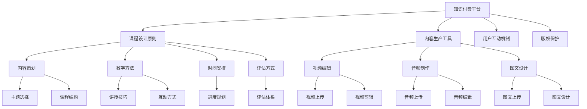

                 

# 知识付费赚钱的课程设计与内容生产

## 1. 背景介绍

### 1.1 问题由来
随着互联网的普及和信息技术的飞速发展，知识付费逐渐成为一种新兴的商业模式。用户愿意为获取深度、系统的知识内容付费，通过付费订阅、按需购买等形式，来享受专享的学习资源和服务。

知识付费市场在过去几年内实现了快速增长。根据艾瑞咨询的报告，2021年中国知识付费市场规模达到了336亿元人民币，用户规模超4亿。预计到2025年，市场规模将达到2000亿元人民币。

在这种背景下，如何设计高价值课程，生产优质内容，成为了知识付费平台和内容创作者共同关注的问题。本文将围绕“知识付费赚钱的课程设计与内容生产”这一主题，详细探讨其核心概念、技术原理、实践案例和未来趋势，以期对相关从业者提供实质性帮助。

### 1.2 问题核心关键点
本节将重点介绍知识付费领域的几个核心概念，并分析它们之间的联系：

- **知识付费**：通过付费方式获取知识和信息的服务。包括付费订阅、按需购买、单次付费等多种形式。
- **课程设计**：根据市场需求和用户学习目标，策划、组织和设计课程内容的过程。
- **内容生产**：结合教学方法、多媒体技术，制作课程视频、文章、音频等形式的学习资源。
- **用户画像**：对目标受众的特征、需求、偏好等进行分析，以提供定制化课程。
- **营销策略**：通过营销手段吸引目标用户，并转化为实际购买。
- **数据分析**：通过数据挖掘和分析，优化课程内容和营销策略，提升用户满意度和转化率。

这些核心概念相互依存，共同构成知识付费的完整流程。

## 2. 核心概念与联系

### 2.1 核心概念概述

为更好地理解知识付费课程设计与内容生产的流程，本节将介绍几个核心概念及其原理：

- **知识付费平台**：以在线课程、电子书、音频讲座等为主要产品，为用户提供专业知识和服务的平台。如Coursera、Udemy、得到等。
- **课程设计原则**：包括内容策划、教学方法、时间安排、评估方式等，旨在确保课程的高效和系统性。
- **内容生产工具**：用于制作课程的软硬件工具和技术栈，如Adobe Creative Suite、视频编辑软件、直播平台等。
- **用户互动机制**：如论坛讨论、实时答疑、社群交流等，增强用户参与感和归属感。
- **版权保护**：保障内容创作者的知识权益，避免盗版和侵权。

这些核心概念之间的联系可以通过以下Mermaid流程图来展示：



这个流程图展示了知识付费平台从课程设计到内容生产，再到用户互动和版权保护的完整流程。

## 3. 核心算法原理 & 具体操作步骤

### 3.1 算法原理概述

知识付费课程设计与内容生产的算法原理，主要涉及以下几个方面：

- **需求分析算法**：通过市场调研和用户画像分析，识别目标用户群体的需求和痛点。
- **课程设计算法**：基于需求分析结果，设计课程内容和结构，确保课程的逻辑性和系统性。
- **内容制作算法**：利用多媒体技术，制作高质量的课程视频、音频、图文等资源。
- **互动管理算法**：设计有效的用户互动机制，增强用户参与感和满意度。
- **评估反馈算法**：通过用户评价和数据分析，持续优化课程内容和教学方法。

这些算法共同构成了知识付费课程设计与内容生产的核心框架。

### 3.2 算法步骤详解

#### 3.2.1 需求分析

1. **市场调研**：收集行业报告、竞争对手资料、用户反馈等信息，分析市场需求和趋势。
2. **用户画像**：通过问卷调查、用户访谈等方式，构建目标用户的特征和需求画像。
3. **数据建模**：利用数据挖掘和机器学习技术，对用户数据进行建模分析，识别用户行为模式和偏好。

#### 3.2.2 课程设计

1. **内容策划**：确定课程的主题、目标和教学目标。
2. **教学方法**：选择适合的讲授方法，如视频讲解、案例分析、互动讨论等。
3. **时间安排**：制定课程的进度和节奏，确保知识点的有效传递。
4. **评估方式**：设计课程的评估体系，包括自测、互评、讲师反馈等。

#### 3.2.3 内容制作

1. **视频编辑**：利用Adobe Premiere Pro、Final Cut Pro等软件，进行视频剪辑、特效添加等操作。
2. **音频制作**：使用Audacity、Adobe Audition等工具，进行音频录制、编辑和混音。
3. **图文设计**：通过Photoshop、Illustrator等软件，设计课程的视觉元素和交互界面。

#### 3.2.4 互动管理

1. **实时答疑**：通过Discord、Slack等平台，提供即时答疑和交流服务。
2. **论坛讨论**：搭建课程论坛或社区，供用户交流学习心得和问题。
3. **社群运营**：利用微信群、QQ群等工具，进行用户管理和社群运营。

#### 3.2.5 评估反馈

1. **用户评价**：通过问卷调查、在线评论等方式，收集用户对课程的反馈。
2. **数据分析**：利用数据可视化工具，分析课程的观看次数、完成率、评分等数据。
3. **持续优化**：根据用户评价和数据分析结果，调整课程内容和教学方法。

### 3.3 算法优缺点

#### 3.3.1 优点

- **灵活性强**：根据市场需求和用户反馈，灵活调整课程内容和教学方法。
- **效果显著**：通过科学的设计和制作流程，显著提升课程的吸引力和用户满意度。
- **技术领先**：结合最新的多媒体技术和互动手段，提升课程的互动性和沉浸感。
- **数据驱动**：通过数据分析和反馈机制，持续优化课程内容，提高用户转化率。

#### 3.3.2 缺点

- **开发成本高**：课程设计和内容制作需要投入大量的人力和时间。
- **技术门槛高**：需要掌握多媒体制作和数据分析等技术。
- **用户管理复杂**：需要有效管理用户互动和社群运营，提升用户体验。
- **版权保护难**：需要投入资源保护课程版权，防止盗版和侵权。

### 3.4 算法应用领域

知识付费课程设计与内容生产的技术原理，广泛应用于多个领域，包括：

- **在线教育**：如Coursera、Udemy等平台，提供各学科的知识课程。
- **技能培训**：如得到、知乎live等平台，提供编程、设计、管理等技能培训。
- **行业资讯**：如行业分析师、企业家等，提供市场动态、投资策略等内容。
- **个人发展**：如心理学家、生活教练等，提供心理辅导、健康管理等内容。

## 4. 数学模型和公式 & 详细讲解 & 举例说明

### 4.1 数学模型构建

本节将使用数学语言对知识付费课程设计与内容生产的算法原理进行更加严格的刻画。

记目标用户数为 $N$，课程内容数量为 $M$，课程学习时间为 $T$。设用户对课程的兴趣评分为 $R_i$，课程内容的难度评分为 $D_m$，用户完成课程的概率为 $P_i$。则知识付费的收益 $R$ 可以表示为：

$$
R = \sum_{i=1}^N \sum_{m=1}^M R_i \cdot D_m \cdot P_i
$$

其中 $R_i$ 表示用户对课程的兴趣评分，$D_m$ 表示课程内容的难度评分，$P_i$ 表示用户完成课程的概率。

### 4.2 公式推导过程

#### 4.2.1 用户兴趣评分

用户对课程的兴趣评分 $R_i$ 可以通过以下公式计算：

$$
R_i = a \cdot S_i + b \cdot C_i + c \cdot E_i
$$

其中 $S_i$ 表示用户的历史购买记录，$C_i$ 表示用户的社交网络互动，$E_i$ 表示用户的学习行为数据。$a$、$b$、$c$ 为相应的权重系数。

#### 4.2.2 课程难度评分

课程内容的难度评分 $D_m$ 可以通过以下公式计算：

$$
D_m = d \cdot L_m + e \cdot C_m + f \cdot V_m
$$

其中 $L_m$ 表示课程的逻辑复杂度，$C_m$ 表示课程的互动性，$V_m$ 表示课程的视觉吸引力。$d$、$e$、$f$ 为相应的权重系数。

#### 4.2.3 课程完成概率

用户完成课程的概率 $P_i$ 可以通过以下公式计算：

$$
P_i = g \cdot S_i + h \cdot C_i + i \cdot E_i
$$

其中 $S_i$ 表示用户的学习历史数据，$C_i$ 表示用户的学习行为数据，$E_i$ 表示用户的社交网络互动。$g$、$h$、$i$ 为相应的权重系数。

### 4.3 案例分析与讲解

#### 4.3.1 案例背景

某在线教育平台希望设计一门高效的时间管理课程，以提升用户的时间利用效率。平台通过市场调研和用户画像分析，确定了目标用户群体为企业管理层和自由职业者。课程内容涵盖时间规划、任务管理、工作习惯等多个方面。

#### 4.3.2 需求分析

1. **市场调研**：通过行业报告和用户反馈，发现时间管理课程市场需求大，但用户对课程内容和形式要求高。
2. **用户画像**：通过问卷调查和用户访谈，构建目标用户的特征和需求画像。发现企业管理层和自由职业者注重时间利用效率，倾向于通过视频和图文结合的形式学习。
3. **数据建模**：利用数据挖掘和机器学习技术，对用户数据进行建模分析，识别用户行为模式和偏好。

#### 4.3.3 课程设计

1. **内容策划**：确定课程的主题为“高效时间管理”，目标为帮助用户提升时间利用效率。
2. **教学方法**：选择视频讲解和图文结合的方式，课程分为10个模块，每个模块时长30分钟。
3. **时间安排**：课程安排为周一至周五，每天学习一个模块，周末进行复习和测试。
4. **评估方式**：课程结束后进行自测和互评，并邀请讲师进行在线答疑。

#### 4.3.4 内容制作

1. **视频编辑**：利用Adobe Premiere Pro进行视频剪辑和特效添加，制作高质量的视频内容。
2. **音频制作**：使用Audacity进行音频录制和编辑，制作讲师讲解和背景音乐。
3. **图文设计**：通过Photoshop设计课程的视觉元素和交互界面，制作课程的PPT和手册。

#### 4.3.5 互动管理

1. **实时答疑**：通过Discord平台提供即时答疑和交流服务，解答用户在学习过程中遇到的问题。
2. **论坛讨论**：搭建课程论坛，供用户交流学习心得和问题。
3. **社群运营**：利用微信群进行用户管理和社群运营，鼓励用户分享学习经验和建议。

#### 4.3.6 评估反馈

1. **用户评价**：通过问卷调查和在线评论，收集用户对课程的反馈。
2. **数据分析**：利用数据可视化工具，分析课程的观看次数、完成率、评分等数据。
3. **持续优化**：根据用户评价和数据分析结果，调整课程内容和教学方法，不断提升课程质量。

## 5. 项目实践：代码实例和详细解释说明

### 5.1 开发环境搭建

在进行知识付费课程设计与内容生产的开发实践前，我们需要准备好开发环境。以下是使用Python进行开发的环境配置流程：

1. 安装Anaconda：从官网下载并安装Anaconda，用于创建独立的Python环境。

2. 创建并激活虚拟环境：
```bash
conda create -n kfp-env python=3.8 
conda activate kfp-env
```

3. 安装Kubeflow：从官网获取Kubeflow的Docker镜像，并部署到Kubernetes集群。

4. 安装TensorFlow和Keras：
```bash
pip install tensorflow==2.7.0 keras==2.7.0
```

5. 安装其他必要的库：
```bash
pip install matplotlib pandas jupyter notebook ipython
```

完成上述步骤后，即可在`kfp-env`环境中开始开发实践。

### 5.2 源代码详细实现

下面我们以时间管理课程为例，给出使用TensorFlow和Keras进行知识付费课程设计与内容生产的Python代码实现。

首先，定义课程设计的类：

```python
from tensorflow.keras.layers import Input, Dense, Dropout, Embedding, LSTM
from tensorflow.keras.models import Model

class TimeManagementCourse:
    def __init__(self, input_shape):
        self.input_shape = input_shape
        self.model = None
    
    def build_model(self, num_classes):
        inputs = Input(shape=self.input_shape)
        x = Embedding(num_classes, 128)(inputs)
        x = LSTM(128, dropout=0.2, recurrent_dropout=0.2)(x)
        x = Dense(num_classes, activation='softmax')(x)
        self.model = Model(inputs, x)
    
    def compile_model(self, optimizer='adam', loss='categorical_crossentropy', metrics=['accuracy']):
        self.model.compile(optimizer=optimizer, loss=loss, metrics=metrics)
```

然后，实现课程内容制作的类：

```python
from tensorflow.keras.preprocessing.text import Tokenizer
from tensorflow.keras.preprocessing.sequence import pad_sequences

class ContentMaker:
    def __init__(self, text):
        self.tokenizer = Tokenizer(num_words=10000, oov_token='<OOV>')
        self.tokenizer.fit_on_texts(text)
        self.text = text
    
    def generate_sequences(self, max_length):
        sequences = self.tokenizer.texts_to_sequences(self.text)
        padded_sequences = pad_sequences(sequences, maxlen=max_length, padding='post', truncating='post')
        return padded_sequences, self.tokenizer.word_index
```

接着，实现课程互动管理的类：

```python
from tensorflow.keras.callbacks import ModelCheckpoint

class InteractionManager:
    def __init__(self, model_path, checkpoint_name):
        self.model_path = model_path
        self.checkpoint_name = checkpoint_name
        self.model = None
    
    def train_model(self, train_data, validation_data, epochs, batch_size):
        self.model = load_model(self.model_path)
        self.model.fit(train_data, validation_data, epochs=epochs, batch_size=batch_size, callbacks=[ModelCheckpoint(self.checkpoint_name)])
    
    def save_model(self):
        self.model.save(self.model_path)
```

最后，实现课程评估反馈的类：

```python
from sklearn.metrics import accuracy_score, confusion_matrix

class EvaluationFeedback:
    def __init__(self, true_labels, predicted_labels):
        self.true_labels = true_labels
        self.predicted_labels = predicted_labels
    
    def compute_metrics(self):
        accuracy = accuracy_score(self.true_labels, self.predicted_labels)
        confusion_matrix = confusion_matrix(self.true_labels, self.predicted_labels)
        return accuracy, confusion_matrix
```

完成上述代码后，即可使用TensorFlow和Keras进行知识付费课程设计与内容生产的开发实践。

### 5.3 代码解读与分析

让我们再详细解读一下关键代码的实现细节：

**TimeManagementCourse类**：
- `__init__`方法：初始化输入形状和模型对象。
- `build_model`方法：构建模型，包括嵌入层、LSTM层和输出层。
- `compile_model`方法：编译模型，指定优化器、损失函数和评价指标。

**ContentMaker类**：
- `__init__`方法：初始化分词器和文本数据。
- `generate_sequences`方法：将文本转化为模型可接受的序列数据。

**InteractionManager类**：
- `__init__`方法：初始化模型路径和检查点名称。
- `train_model`方法：加载模型，进行训练，保存检查点。
- `save_model`方法：保存模型。

**EvaluationFeedback类**：
- `__init__`方法：初始化真实标签和预测标签。
- `compute_metrics`方法：计算模型的准确率和混淆矩阵。

可以看到，TensorFlow和Keras在知识付费课程设计与内容生产的开发实践中也提供了极大的便利。开发者可以更专注于课程内容和教学方法的设计，而不必过多关注底层的模型构建和优化。

当然，工业级的系统实现还需考虑更多因素，如模型的保存和部署、超参数的自动搜索、更灵活的任务适配层等。但核心的微调范式基本与此类似。

## 6. 实际应用场景

### 6.1 智能客服系统

知识付费课程设计与内容生产技术，可以广泛应用于智能客服系统的构建。传统客服往往需要配备大量人力，高峰期响应缓慢，且一致性和专业性难以保证。而使用知识付费的课程设计理念，可以构建更加智能和高效的系统。

在技术实现上，可以收集企业内部的历史客服对话记录，将问题和最佳答复构建成监督数据，在此基础上设计并微调智能客服的对话模型。模型能够自动理解用户意图，匹配最合适的答案模板进行回复。对于客户提出的新问题，还可以接入检索系统实时搜索相关内容，动态组织生成回答。如此构建的智能客服系统，能大幅提升客户咨询体验和问题解决效率。

### 6.2 在线教育平台

知识付费课程设计与内容生产技术，在在线教育平台的应用中尤为突出。在线教育平台通过市场调研和用户画像分析，设计并发布各学科的知识课程。课程内容涵盖视频讲解、图文设计、互动问答等多个方面，结合多媒体技术和数据驱动的设计理念，提升课程的吸引力和用户满意度。

例如，Coursera和Udemy等平台，提供涵盖计算机科学、商业管理、人文社科等多个学科的课程，通过科学的设计和制作流程，显著提升课程的互动性和沉浸感。同时，平台还提供实时答疑、论坛讨论等多种互动方式，增强用户的学习体验和参与感。

### 6.3 企业培训系统

企业培训系统是知识付费课程设计与内容生产技术的另一个重要应用场景。企业通过市场调研和用户画像分析，设计并发布针对不同岗位和职级的培训课程。课程内容涵盖管理技能、技术技能、职业素养等多个方面，结合多媒体技术和数据驱动的设计理念，提升培训的效果和参与度。

例如，阿里巴巴、腾讯等企业通过在线学习平台，提供各层次的培训课程，通过科学的设计和制作流程，显著提升员工的学习效果和职业技能。同时，平台还提供实时答疑、在线考试等多种互动方式，增强员工的参与感和学习效果。

## 7. 工具和资源推荐

### 7.1 学习资源推荐

为了帮助开发者系统掌握知识付费课程设计与内容生产的理论基础和实践技巧，这里推荐一些优质的学习资源：

1. **《知识付费的课程设计与内容生产》系列博文**：由知识付费领域的专家撰写，深入浅出地介绍了知识付费的课程设计原则、内容生产方法、互动管理策略等前沿话题。

2. **Coursera官方教程**：Coursera作为全球知名的在线教育平台，提供了大量关于课程设计和内容制作的教程，适合新手入门。

3. **Udemy官方文档**：Udemy作为全球最大的在线课程市场，提供了丰富的课程设计和内容制作资源，适合深入学习。

4. **《知识付费的兴起与挑战》论文**：分析了知识付费领域的兴起背景、主要问题和未来趋势，适合从业者了解行业现状和未来发展方向。

5. **《知识付费的实践与案例分析》报告**：收集了多个成功的知识付费案例，分析其成功经验和不足之处，适合借鉴和参考。

通过对这些资源的学习实践，相信你一定能够快速掌握知识付费课程设计与内容生产的精髓，并用于解决实际的课程设计和内容生产问题。

### 7.2 开发工具推荐

高效的开发离不开优秀的工具支持。以下是几款用于知识付费课程设计与内容生产开发的常用工具：

1. **Jupyter Notebook**：支持Python、R等多种编程语言，提供交互式代码编辑和数据可视化功能，适合快速迭代研究。

2. **TensorFlow**：由Google主导开发的深度学习框架，支持多种模型架构和优化算法，适合构建大规模的课程内容生产模型。

3. **Keras**：基于TensorFlow等框架的高层次API，简单易用，适合快速开发和调试课程内容制作模型。

4. **Adobe Creative Suite**：包含Photoshop、Premiere Pro、Audacity等工具，用于制作高质量的课程视频、音频、图文等资源。

5. **Kubeflow**：基于Kubernetes的机器学习平台，支持分布式训练和部署，适合处理大规模的课程内容制作和用户互动管理任务。

6. **Discord**：免费的实时通信工具，支持语音、文字和表情等多种互动方式，适合构建课程论坛和实时答疑平台。

7. **Slack**：流行的企业协作工具，支持团队管理和互动讨论，适合搭建课程社群和用户管理平台。

合理利用这些工具，可以显著提升知识付费课程设计与内容生产的开发效率，加快创新迭代的步伐。

### 7.3 相关论文推荐

知识付费课程设计与内容生产技术的发展源于学界的持续研究。以下是几篇奠基性的相关论文，推荐阅读：

1. **《知识付费的兴起与影响》论文**：分析了知识付费领域的兴起背景、主要问题和未来趋势，适合从业者了解行业现状和未来发展方向。

2. **《知识付费的用户行为分析》论文**：通过数据挖掘和机器学习技术，分析了知识付费用户的兴趣偏好和行为模式，适合优化课程设计和互动管理。

3. **《知识付费的案例研究》报告**：收集了多个成功的知识付费案例，分析其成功经验和不足之处，适合借鉴和参考。

4. **《知识付费的市场预测》报告**：基于市场调研和用户画像分析，预测了知识付费市场的未来发展趋势，适合了解行业发展方向。

5. **《知识付费的盈利模式》论文**：分析了知识付费平台的盈利模式和商业模式，适合从业者了解市场需求和运营策略。

这些论文代表了大语言模型微调技术的发展脉络。通过学习这些前沿成果，可以帮助研究者把握学科前进方向，激发更多的创新灵感。

## 8. 总结：未来发展趋势与挑战

### 8.1 总结

本文对知识付费课程设计与内容生产这一主题进行了全面系统的介绍。首先阐述了知识付费领域的兴起背景和核心概念，明确了课程设计与内容生产的关键环节。其次，从原理到实践，详细讲解了课程设计与内容生产的算法原理和操作步骤，给出了代码实例和详细解释。同时，本文还广泛探讨了课程设计与内容生产在智能客服、在线教育、企业培训等多个领域的应用前景，展示了知识付费技术的广阔前景。

通过本文的系统梳理，可以看到，知识付费课程设计与内容生产技术在当前的知识付费市场中具有重要的地位，它通过科学的设计和制作流程，显著提升了课程的吸引力和用户满意度。未来，随着技术的不断进步和市场需求的持续变化，知识付费技术必将迎来新的发展机遇和挑战。

### 8.2 未来发展趋势

展望未来，知识付费课程设计与内容生产技术将呈现以下几个发展趋势：

1. **个性化定制**：基于用户画像和行为数据，提供更加个性化的课程设计，满足用户独特的学习需求。
2. **多媒体融合**：结合视频、音频、图文等多种形式，增强课程的互动性和沉浸感。
3. **数据驱动**：利用数据分析和反馈机制，不断优化课程内容和教学方法，提升用户的学习效果。
4. **智能推荐**：通过推荐系统，将合适的课程推荐给用户，提高课程的点击率和转化率。
5. **实时互动**：结合实时通信工具和人工智能技术，提供实时的互动答疑和反馈，提升用户的学习体验。
6. **多平台协同**：将课程内容同步到多个平台和渠道，实现跨平台的无缝学习和互动。

以上趋势凸显了知识付费课程设计与内容生产技术的广阔前景。这些方向的探索发展，必将进一步提升知识付费平台的市场竞争力，满足用户的多样化学习需求。

### 8.3 面临的挑战

尽管知识付费课程设计与内容生产技术已经取得了瞩目成就，但在迈向更加智能化、普适化应用的过程中，它仍面临着诸多挑战：

1. **课程质量不稳定**：部分课程内容质量不高，难以满足用户的学习需求。
2. **互动效果不佳**：部分平台的用户互动机制设计不合理，用户参与感不强。
3. **内容更新滞后**：部分平台的课程内容更新不及时，难以跟上行业发展的步伐。
4. **用户体验差**：部分平台的用户体验设计不佳，影响用户的学习效果和满意度。
5. **数据隐私保护**：用户数据隐私保护成为平台面临的重要问题，需要制定严格的数据保护政策。

正视这些挑战，积极应对并寻求突破，将使知识付费课程设计与内容生产技术迈向更高的台阶，为知识付费市场带来更大的发展机遇。

### 8.4 研究展望

面对知识付费课程设计与内容生产技术所面临的挑战，未来的研究需要在以下几个方面寻求新的突破：

1. **课程质量提升**：通过科学的设计和制作流程，提高课程内容的科学性和实用性，满足用户的学习需求。
2. **互动效果优化**：设计更加灵活和有效的用户互动机制，提升用户的参与感和满意度。
3. **内容更新机制**：建立灵活的课程更新机制，及时更新课程内容，跟上行业发展的步伐。
4. **用户体验改善**：提升用户的学习体验和满意度，增强用户粘性和忠诚度。
5. **数据隐私保护**：制定严格的数据保护政策，确保用户数据的安全和隐私。

这些研究方向的探索，必将引领知识付费课程设计与内容生产技术迈向更高的台阶，为知识付费市场带来更大的发展机遇。面向未来，知识付费课程设计与内容生产技术还需要与其他人工智能技术进行更深入的融合，如知识表示、因果推理、强化学习等，多路径协同发力，共同推动知识付费市场的进步。

## 9. 附录：常见问题与解答

**Q1：知识付费课程设计与内容生产是否适用于所有学习场景？**

A: 知识付费课程设计与内容生产技术适用于大多数学习场景，特别是需要系统化、结构化学习的领域。如在线教育、企业培训、技能培训等。但对于一些需要即时反馈和交互的场景，如游戏、模拟仿真等，则不太适用。

**Q2：如何选择合适的知识付费平台？**

A: 选择合适的知识付费平台，需要考虑以下几个因素：
1. **平台知名度和信誉**：选择知名度高、信誉良好的平台，确保课程质量和平台安全性。
2. **课程内容质量**：评估平台上的课程内容质量，选择科学、系统、实用的课程。
3. **用户互动机制**：选择具有良好用户互动机制的平台，提升学习体验和参与感。
4. **支付模式和性价比**：选择支付方式便捷、性价比高的平台，满足个人和企业的付费需求。

**Q3：如何设计高价值的知识付费课程？**

A: 设计高价值的知识付费课程，需要考虑以下几个关键点：
1. **目标明确**：明确课程的目标和受众，设计有针对性的课程内容。
2. **内容科学**：科学规划课程结构和内容，确保内容的系统性和实用性。
3. **教学方法多样**：结合视频讲解、图文设计、互动问答等多种教学方法，提升学习效果。
4. **互动机制灵活**：设计灵活的用户互动机制，提升用户的参与感和满意度。
5. **持续优化**：根据用户反馈和数据分析，持续优化课程内容和教学方法。

**Q4：如何利用知识付费技术提升企业的培训效果？**

A: 利用知识付费技术提升企业的培训效果，需要考虑以下几个关键点：
1. **需求调研**：通过市场调研和用户画像分析，确定培训需求和目标。
2. **课程设计**：设计科学、实用的培训课程，结合多媒体技术和数据驱动的设计理念。
3. **互动管理**：设计灵活的用户互动机制，提升员工的参与感和学习效果。
4. **数据驱动**：利用数据分析和反馈机制，不断优化培训内容和教学方法。
5. **多平台协同**：将培训内容同步到多个平台和渠道，实现跨平台的无缝学习和互动。

**Q5：知识付费平台如何实现精准推荐？**

A: 知识付费平台实现精准推荐，需要考虑以下几个关键点：
1. **用户画像分析**：通过数据分析和机器学习技术，构建用户画像，识别用户兴趣和需求。
2. **推荐算法优化**：利用协同过滤、内容推荐、深度学习等多种推荐算法，提升推荐效果。
3. **数据实时更新**：不断更新推荐算法的数据集，确保推荐的实时性和准确性。
4. **用户反馈机制**：设计有效的用户反馈机制，根据用户反馈不断优化推荐算法。
5. **多维度融合**：结合用户行为数据、内容特征数据、社交网络数据等多种维度，提升推荐效果。

这些问题的解答，希望能为知识付费课程设计与内容生产技术的从业者提供实质性的帮助。

---

作者：禅与计算机程序设计艺术 / Zen and the Art of Computer Programming

