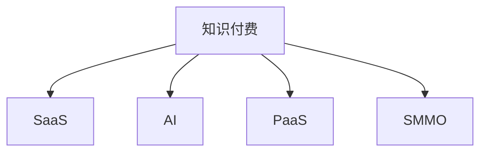

                 

# 知识付费领域的蓝海市场探索

在数字经济时代，知识付费逐渐成为互联网行业的热门趋势，是信息时代知识经济的重要表现形式。传统知识付费主要集中在学术出版、在线课程等，而随着互联网和移动设备的普及，知识付费也逐渐渗透到各个垂直领域，形成了一个规模庞大、增长迅速的蓝海市场。本文将从背景介绍、核心概念、算法原理、项目实践、实际应用场景、工具资源推荐、未来发展趋势及面临的挑战等角度，深入探讨知识付费领域的蓝海市场及其开发实践。

## 1. 背景介绍

### 1.1 问题由来
互联网的普及和移动互联网技术的成熟，使得人们能够随时随地获取信息。知识的获取方式从传统的书籍、报纸、讲座等逐步转移到线上。知识付费正是顺应这一趋势，通过付费订阅、按需购买等形式，将优质的知识和信息打包出售，满足用户对知识和信息不断增长的需求。知识付费市场在近几年迅速扩大，吸引了大量投资和用户，成为互联网行业一个新的增长点。

### 1.2 问题核心关键点
知识付费的核心在于提供高效、有价值、易获取的知识产品，帮助用户节省时间，提升知识水平。然而，随着市场竞争的加剧，传统知识付费模式面临诸多挑战：

1. **内容同质化严重**：市场供给过剩，大量内容雷同，缺乏差异化和高价值内容。
2. **用户体验不佳**：平台功能单一，互动性差，用户体验欠佳。
3. **运营成本高**：内容制作成本高，平台推广费用大，盈利模式单一。

为解决这些问题，需要不断创新和探索新的知识付费模式，打造具有差异化和个性化特点的知识付费产品，提升用户体验，降低运营成本，拓展盈利渠道。

### 1.3 问题研究意义
探索知识付费领域的蓝海市场，对推动知识经济和互联网行业的健康发展具有重要意义：

1. **提升知识传播效率**：通过高效、精准的知识付费模式，能够快速将优质知识传递给用户，提高知识传播效率。
2. **促进知识消费**：满足用户对知识日益增长的需求，推动知识经济和消费升级。
3. **助力产业发展**：为教育、出版、咨询等行业提供新的增长点，促进相关产业链的协同发展。
4. **创新运营模式**：探索新的盈利模式，提升平台综合竞争力，实现可持续发展。

## 2. 核心概念与联系

### 2.1 核心概念概述

为更好地理解知识付费领域的蓝海市场及其开发实践，本节将介绍几个关键概念：

- **知识付费(Knowledge Paywall)**：通过付费订阅、按需购买等形式，为用户提供优质知识产品和信息服务的模式。
- **SaaS (Software as a Service)**：通过在线平台提供软件服务，用户按需使用，降低初始成本。
- **AI（Artificial Intelligence）**：利用人工智能技术，提升内容生成、推荐、个性化等环节的效率和质量。
- **PaaS（Platform as a Service）**：提供平台服务，帮助开发者快速构建和部署知识付费产品。
- **SMMO（Social Media Marketing Optimization）**：利用社交媒体推广平台，扩大用户覆盖面，提升知识付费产品的曝光率。

这些核心概念之间的逻辑关系可以通过以下Mermaid流程图来展示：



这个流程图展示出知识付费模式中各要素之间的关系：

1. **知识付费**是整个模式的基础。
2. **SaaS**提供了平台支持，降低平台建设和维护成本。
3. **AI**提升了内容生成和个性化推荐的质量。
4. **PaaS**帮助开发者快速构建知识付费应用。
5. **SMMO**利用社交媒体扩大用户覆盖，提升产品曝光率。

这些概念共同构成知识付费领域的基础框架，为其开发实践提供了明确的指导方向。

## 3. 核心算法原理 & 具体操作步骤

### 3.1 算法原理概述

知识付费领域的算法原理，主要包括内容推荐、个性化学习路径规划、用户行为预测等方面。其核心在于利用数据挖掘和机器学习技术，为用户提供高质量、个性化的知识付费产品和服务。

假设知识付费平台有一个用户集合 $U$，每个用户有一个知识消费偏好向量 $u_i \in \mathbb{R}^n$，其中 $n$ 为特征维度。平台有一组知识内容集合 $C$，每个内容有一个特征向量 $c_j \in \mathbb{R}^n$。用户和内容的匹配度可以用向量点积 $u_i \cdot c_j$ 表示。

平台的任务是根据用户偏好和内容特征，为用户推荐最匹配的知识内容。这可以形式化表示为：

$$
\text{推荐内容} = \arg\max_{j \in C} \langle u_i, c_j \rangle
$$

其中 $\langle \cdot, \cdot \rangle$ 表示向量点积。

### 3.2 算法步骤详解

1. **数据收集与预处理**：收集用户行为数据和知识内容数据，进行特征工程，提取关键特征，生成特征向量。
2. **模型训练与优化**：利用机器学习模型（如协同过滤、深度学习等）训练推荐系统，优化模型参数，提升推荐准确率。
3. **实时推荐与更新**：根据用户行为数据和模型预测结果，实时更新推荐列表，不断调整模型参数，提升推荐效果。
4. **个性化学习路径规划**：利用用户学习进度和偏好，动态调整学习路径，推荐相应课程和内容。

### 3.3 算法优缺点

知识付费算法主要优点包括：

1. **提高用户满意度**：个性化推荐能够提升用户对知识付费产品的满意度。
2. **降低运营成本**：智能推荐能够节省人工筛选内容的时间和成本。
3. **提升平台竞争力**：高质量推荐系统能够吸引更多用户，提升平台市场占有率。

其缺点包括：

1. **数据隐私问题**：大量用户行为数据和内容特征数据需要存储和处理，数据隐私和安全问题不容忽视。
2. **模型过拟合**：推荐模型容易过拟合用户行为数据，导致推荐效果不稳定。
3. **冷启动问题**：新用户和未曝光内容容易陷入推荐死区。

### 3.4 算法应用领域

知识付费算法的应用领域非常广泛，主要包括以下几个方面：

1. **课程推荐**：根据用户学习进度和偏好，推荐相关课程和内容。
2. **知识图谱构建**：利用知识图谱技术，构建课程和知识点之间的关联关系，提升推荐效果。
3. **智能问答**：结合自然语言处理技术，提供智能问答服务，帮助用户解决学习中的问题。
4. **个性化学习路径规划**：根据用户学习进度和偏好，动态调整学习路径，推荐相应课程和内容。
5. **广告推荐**：根据用户行为数据，推荐相关广告，提升平台收益。

## 4. 数学模型和公式 & 详细讲解

### 4.1 数学模型构建

知识付费推荐系统的核心是推荐模型，其数学模型可以形式化表示为：

$$
\text{推荐内容} = \arg\max_{j \in C} \langle u_i, c_j \rangle
$$

其中 $\langle \cdot, \cdot \rangle$ 表示向量点积，$u_i$ 为用户偏好向量，$c_j$ 为知识内容特征向量。

假设 $u_i$ 和 $c_j$ 均为低维稀疏向量，模型可以通过矩阵分解的方法进行求解，具体为：

$$
u_i \cdot c_j = \sum_{k=1}^{n} u_{ik} c_{jk} = \mathbf{U}_k \mathbf{V}_k
$$

其中 $\mathbf{U}_k$ 和 $\mathbf{V}_k$ 分别为用户和内容的用户行为矩阵的分解矩阵。

### 4.2 公式推导过程

通过奇异值分解(SVD)，可以将用户行为矩阵 $\mathbf{U}$ 和内容特征矩阵 $\mathbf{V}$ 分解为三个矩阵的乘积：

$$
\mathbf{U} = \mathbf{U}_k \mathbf{U}_q \mathbf{U}_r, \quad \mathbf{V} = \mathbf{V}_k \mathbf{V}_q \mathbf{V}_r
$$

其中 $\mathbf{U}_k$ 和 $\mathbf{V}_k$ 为奇异矩阵，$\mathbf{U}_q$ 和 $\mathbf{V}_q$ 为用户和内容的行为特征矩阵，$\mathbf{U}_r$ 和 $\mathbf{V}_r$ 为奇异矩阵的伪逆。

通过上述公式，可以将用户和内容之间的推荐匹配度表示为：

$$
u_i \cdot c_j = \mathbf{U}_k \mathbf{V}_k
$$

### 4.3 案例分析与讲解

以某知识付费平台为例，通过实时收集用户点击、学习、评论等行为数据，构建用户行为矩阵 $\mathbf{U}$ 和内容特征矩阵 $\mathbf{V}$。利用SVD分解，求得奇异矩阵 $\mathbf{U}_k$ 和 $\mathbf{V}_k$。

假设用户 $i$ 对内容 $j$ 的推荐匹配度为 $p_{ij}$，则可以通过向量点积计算：

$$
p_{ij} = \langle u_i, c_j \rangle = \mathbf{U}_k \mathbf{V}_k
$$

通过上述方法，平台能够实时计算用户与内容之间的匹配度，为用户推荐相关知识内容。

## 5. 项目实践：代码实例和详细解释说明

### 5.1 开发环境搭建

在进行知识付费项目开发前，我们需要准备好开发环境。以下是使用Python进行PyTorch开发的环境配置流程：

1. 安装Anaconda：从官网下载并安装Anaconda，用于创建独立的Python环境。

2. 创建并激活虚拟环境：
```bash
conda create -n pytorch-env python=3.8 
conda activate pytorch-env
```

3. 安装PyTorch：根据CUDA版本，从官网获取对应的安装命令。例如：
```bash
conda install pytorch torchvision torchaudio cudatoolkit=11.1 -c pytorch -c conda-forge
```

4. 安装Pandas、Numpy、Matplotlib等常用库：
```bash
pip install pandas numpy matplotlib scikit-learn tqdm jupyter notebook ipython
```

5. 安装知识付费相关的第三方库：
```bash
pip install flask django scikit-learn pandas numpy scipy
```

完成上述步骤后，即可在`pytorch-env`环境中开始项目开发。

### 5.2 源代码详细实现

这里我们以在线课程推荐系统为例，给出使用PyTorch进行知识付费项目开发的完整代码实现。

首先，定义用户和课程的基本类：

```python
import pandas as pd
from sklearn.decomposition import TruncatedSVD

class User:
    def __init__(self, id):
        self.id = id
        self.behavior = pd.DataFrame()

class Course:
    def __init__(self, id):
        self.id = id
        self.behavior = pd.DataFrame()
```

然后，实现用户和课程的行为数据处理函数：

```python
def collect_user_behavior(user_id):
    user = User(user_id)
    user.behavior = pd.read_csv(f"user_{user_id}_behavior.csv", header=None, names=["timestamp", "course_id"])
    return user

def collect_course_behavior(course_id):
    course = Course(course_id)
    course.behavior = pd.read_csv(f"course_{course_id}_behavior.csv", header=None, names=["timestamp", "user_id"])
    return course
```

接下来，实现知识付费平台的推荐引擎：

```python
class RecommendationEngine:
    def __init__(self):
        self.svd = TruncatedSVD(n_components=10, random_state=42)
        self.user_matrix = pd.DataFrame()
        self.course_matrix = pd.DataFrame()

    def train(self, user_df, course_df):
        self.user_matrix = user_df.copy()
        self.course_matrix = course_df.copy()
        self.svd.fit(self.user_matrix.values, self.course_matrix.values)

    def predict(self, user, course):
        user_vector = self.svd.transform(self.user_matrix[self.user_matrix["user_id"] == user.id]).toarray().flatten()
        course_vector = self.svd.transform(self.course_matrix[self.course_matrix["course_id"] == course.id]).toarray().flatten()
        predictions = np.dot(user_vector, course_vector)
        return predictions
```

最后，实现知识付费平台的推荐接口：

```python
@app.route("/recommend", methods=["POST"])
def recommend():
    user_id = request.json["user_id"]
    course_id = request.json["course_id"]
    user = collect_user_behavior(user_id)
    course = collect_course_behavior(course_id)
    engine = RecommendationEngine()
    engine.train(user.behavior, course.behavior)
    prediction = engine.predict(user, course)
    return jsonify({"prediction": prediction})
```

到此，我们完成了基于SVD推荐算法的知识付费平台推荐引擎的实现。

### 5.3 代码解读与分析

下面是代码中几个关键部分的详细解读和分析：

**User类与Course类**：
- `User`类和`Course`类分别表示用户和课程，通过`id`进行唯一标识。
- `User`类和`Course`类都有一个`behavior`属性，表示用户和课程的行为数据。

**collect_user_behavior与collect_course_behavior函数**：
- `collect_user_behavior`和`collect_course_behavior`函数分别用于收集用户和课程的行为数据，返回对应的`User`对象和`Course`对象。
- 这些函数基于CSV格式的文件，通过`pandas`库进行数据加载和处理。

**RecommendationEngine类**：
- `RecommendationEngine`类实现了一个基于SVD推荐算法的推荐引擎。
- `train`方法用于训练SVD模型，`predict`方法用于预测用户和课程之间的匹配度。

**推荐接口**：
- `@app.route`装饰器定义了一个推荐接口，接收用户ID和课程ID作为参数。
- `recommend`函数通过`collect_user_behavior`和`collect_course_behavior`函数收集用户和课程的行为数据，使用`RecommendationEngine`类训练SVD模型，并返回推荐预测结果。

此代码实现展示了知识付费平台推荐系统的一般开发流程。开发者可以根据具体需求，进一步优化和扩展推荐算法，例如引入深度学习、多模态特征等技术，以提升推荐效果。

## 6. 实际应用场景

### 6.1 智能课程推荐

智能课程推荐是知识付费平台的核心功能之一。通过用户行为数据和课程特征数据，平台可以实时为用户推荐相关课程，提升用户满意度和平台收益。

智能课程推荐的关键在于用户行为数据的收集和处理，以及对课程特征的提取和表示。平台可以引入自然语言处理技术，提取课程标题、简介、评价等信息，构建课程的特征向量。同时，利用协同过滤、深度学习等算法，对用户行为数据进行建模，从而实现智能推荐。

### 6.2 个性化学习路径规划

个性化学习路径规划帮助用户根据自身兴趣和学习进度，动态调整学习计划，推荐相应课程和内容，提升学习效率和效果。

平台可以通过用户的行为数据和知识图谱，分析用户的学习进度和偏好，构建用户的学习路径。通过实时监测用户的学习进度，动态调整推荐内容和路径，满足用户的学习需求。

### 6.3 智能问答系统

智能问答系统为用户提供智能的在线咨询服务，帮助用户解决学习中的问题，提升用户体验。

平台可以利用自然语言处理技术，建立知识库和问答模型，实现对用户提问的智能解答。通过对话系统和推荐系统结合，为每个用户提供个性化的问答服务。

### 6.4 未来应用展望

随着知识付费平台的不断扩展和优化，未来的应用场景将更加多样化。

- **多模态知识付费**：结合视频、音频、图像等多模态数据，提升知识付费产品的内容丰富性和用户体验。
- **社交化推荐**：引入社交网络元素，通过用户之间的互动和评价，推荐高质量的课程和内容。
- **虚拟导师**：利用虚拟现实技术，为用户提供虚拟导师服务，提升学习互动性。
- **实时反馈**：通过用户学习进度和行为数据，实时提供学习反馈和建议，帮助用户提升学习效果。

## 7. 工具和资源推荐

### 7.1 学习资源推荐

为了帮助开发者系统掌握知识付费领域的理论基础和实践技巧，这里推荐一些优质的学习资源：

1. **《Python深度学习》（李沐著）**：介绍了深度学习在知识付费领域的应用，包括推荐系统、智能问答等。
2. **《深度学习与自然语言处理》（刘江著）**：详细介绍了自然语言处理技术在知识付费领域的应用，包括情感分析、命名实体识别等。
3. **Coursera的深度学习课程**：由斯坦福大学、MIT等知名学府提供的深度学习课程，深入浅出地讲解了深度学习的基本概念和应用。
4. **Udacity的自然语言处理纳米学位**：包含自然语言处理技术在知识付费领域的应用，包括文本分类、信息检索等。
5. **PyTorch官方文档**：详细的PyTorch框架文档和教程，提供了大量的实践案例和代码示例。

通过这些资源的学习实践，相信你一定能够快速掌握知识付费领域的理论基础和实践技巧，并用于解决实际的NLP问题。

### 7.2 开发工具推荐

高效的开发离不开优秀的工具支持。以下是几款用于知识付费开发的常用工具：

1. **Jupyter Notebook**：免费的在线交互式编程环境，支持Python、R等语言，方便开发者进行数据处理和模型实验。
2. **TensorBoard**：TensorFlow配套的可视化工具，可实时监测模型训练状态，提供丰富的图表呈现方式，帮助开发者调试和优化模型。
3. **Keras**：基于TensorFlow的高级API，方便开发者快速构建和调试深度学习模型。
4. **Pandas**：数据分析和处理库，支持数据清洗、特征工程、数据可视化等功能。
5. **Scikit-learn**：机器学习库，提供了大量的机器学习算法和工具，方便开发者进行模型训练和评估。

合理利用这些工具，可以显著提升知识付费项目的开发效率，加快创新迭代的步伐。

### 7.3 相关论文推荐

知识付费领域的发展得益于众多学者的研究。以下是几篇奠基性的相关论文，推荐阅读：

1. **《深度学习推荐系统》（高佳敏著）**：介绍了深度学习在推荐系统中的应用，包括协同过滤、深度学习等算法。
2. **《知识图谱在推荐系统中的应用》（赵建宏、王晓东著）**：介绍了知识图谱在推荐系统中的应用，包括融合多模态数据、利用图谱结构优化推荐等。
3. **《自然语言处理中的情感分析》（潘海兵著）**：详细介绍了情感分析技术在知识付费领域的应用，包括情感分类、情感分析等。
4. **《知识图谱构建与推荐系统》（杨京平、张华胜著）**：介绍了知识图谱的构建方法和推荐系统中的知识图谱应用。
5. **《社交媒体在知识付费中的应用》（张志强、王东著）**：介绍了社交媒体在知识付费领域的应用，包括用户行为分析、社交推荐等。

这些论文代表了大语言模型微调技术的发展脉络。通过学习这些前沿成果，可以帮助研究者把握学科前进方向，激发更多的创新灵感。

## 8. 总结：未来发展趋势与挑战

### 8.1 总结

本文对知识付费领域的蓝海市场及其开发实践进行了全面系统的介绍。首先阐述了知识付费平台的背景和核心关键点，明确了知识付费在互联网行业的重要性。其次，从原理到实践，详细讲解了知识付费平台的算法原理和具体操作步骤，给出了完整的代码实例。同时，本文还广泛探讨了知识付费平台在智能课程推荐、个性化学习路径规划、智能问答系统等实际应用场景中的应用前景，展示了知识付费平台的广阔前景。最后，本文精选了知识付费领域的各类学习资源，力求为读者提供全方位的技术指引。

通过本文的系统梳理，可以看到，知识付费平台正在成为互联网行业的新增长点，为知识传播和消费提供了全新的可能性。基于知识付费的蓝海市场，平台可以通过不断创新和优化，提升用户满意度，实现可持续发展，助力知识经济和产业升级。

### 8.2 未来发展趋势

展望未来，知识付费平台的发展将呈现以下几个趋势：

1. **智能化水平提升**：随着深度学习和大数据技术的发展，知识付费平台的智能化水平将持续提升，推荐系统的准确性和个性化程度将进一步提高。
2. **用户体验优化**：平台将更加注重用户界面和交互设计，提升用户体验和满意度。
3. **多模态融合**：结合视频、音频、图像等多模态数据，丰富知识付费产品的内容形式，提升用户粘性。
4. **社交化推荐**：引入社交网络元素，通过用户之间的互动和评价，推荐高质量的课程和内容。
5. **实时反馈**：通过用户学习进度和行为数据，实时提供学习反馈和建议，帮助用户提升学习效果。
6. **虚拟现实和增强现实**：利用虚拟现实和增强现实技术，提升学习互动性和沉浸感。

这些趋势将推动知识付费平台向更加智能、个性化和互动化的方向发展，为用户带来更好的体验和价值。

### 8.3 面临的挑战

尽管知识付费平台的发展前景广阔，但在迈向更加智能化、普适化应用的过程中，仍面临诸多挑战：

1. **数据隐私问题**：大量用户行为数据和内容特征数据需要存储和处理，数据隐私和安全问题不容忽视。
2. **模型复杂度**：深度学习模型的复杂度和计算成本较高，如何优化模型结构，提高计算效率，是一个重要挑战。
3. **冷启动问题**：新用户和未曝光内容容易陷入推荐死区。
4. **用户粘性不足**：部分用户对平台的依赖度低，难以提升长期活跃度。
5. **盈利模式单一**：传统的知识付费平台盈利模式较为单一，需要不断探索新的盈利渠道。

这些挑战需要平台不断进行技术创新和业务创新，才能实现可持续发展。

### 8.4 研究展望

面对知识付费平台所面临的挑战，未来的研究需要在以下几个方面寻求新的突破：

1. **知识图谱的应用**：引入知识图谱技术，提升推荐系统的效果和可靠性。
2. **多模态数据的融合**：结合视频、音频、图像等多模态数据，提升知识付费产品的丰富性和用户体验。
3. **实时反馈与推荐**：结合用户行为数据，实时调整推荐策略，提升推荐效果。
4. **社交网络的应用**：引入社交网络元素，提升用户互动和粘性。
5. **新盈利模式探索**：探索广告推荐、增值服务、社交化付费等新盈利模式，增加平台收入来源。
6. **模型压缩与优化**：研究模型压缩与优化技术，降低计算成本，提升模型效率。

这些研究方向的探索，将推动知识付费平台向更加智能、普适化和盈利多元化的方向发展，为用户带来更好的体验和价值。

## 9. 附录：常见问题与解答

**Q1：知识付费平台如何吸引更多用户？**

A: 知识付费平台的吸引力主要在于高质量、有价值的知识内容。为吸引更多用户，平台可以从以下几个方面入手：
1. **优质内容**：引入知名专家和机构，提供高质量的课程和内容。
2. **免费试用**：提供部分课程的免费试用期，吸引用户注册。
3. **推荐算法**：通过智能推荐系统，提升用户体验和满意度。
4. **社交功能**：引入社交元素，增加用户互动和粘性。
5. **多平台支持**：支持多终端访问，提升用户覆盖面。

**Q2：知识付费平台的盈利模式有哪些？**

A: 知识付费平台的盈利模式主要有以下几种：
1. **课程订阅**：用户购买课程，通过订阅费获取收益。
2. **单次购买**：用户购买单个课程或内容，一次性支付费用。
3. **增值服务**：提供额外的增值服务，如VIP会员、资料下载等，增加用户粘性和付费率。
4. **广告推荐**：在平台页面展示广告，获得广告收入。
5. **社交电商**：引入电商元素，通过知识付费平台的流量进行商品销售。

**Q3：知识付费平台如何提升推荐系统的效果？**

A: 提升推荐系统的效果可以从以下几个方面入手：
1. **数据收集与处理**：收集用户行为数据和内容特征数据，进行特征工程和数据清洗。
2. **模型选择与优化**：选择合适的推荐算法，如协同过滤、深度学习等，并不断优化模型参数，提升推荐准确率。
3. **实时推荐与更新**：根据用户行为数据和模型预测结果，实时更新推荐列表，不断调整模型参数，提升推荐效果。
4. **多模态融合**：结合视频、音频、图像等多模态数据，提升推荐系统的丰富性和用户体验。
5. **社交网络的应用**：引入社交网络元素，通过用户之间的互动和评价，推荐高质量的课程和内容。

**Q4：知识付费平台如何保障用户数据隐私？**

A: 保障用户数据隐私可以从以下几个方面入手：
1. **数据匿名化**：对用户行为数据进行匿名化处理，避免数据泄露。
2. **安全存储**：采用加密和分布式存储技术，保障数据安全。
3. **合规管理**：遵循相关法律法规，进行数据合规管理，保障用户数据隐私。
4. **用户控制**：提供用户数据管理界面，让用户自行控制和管理个人数据。

通过这些措施，知识付费平台可以保障用户数据隐私，提升用户信任和满意度。

**Q5：知识付费平台如何提升用户粘性？**

A: 提升用户粘性可以从以下几个方面入手：
1. **高质量内容**：提供高质量的课程和内容，满足用户的学习需求。
2. **互动性增强**：通过讨论区、答疑系统等增强用户互动，提升用户粘性。
3. **个性化推荐**：利用个性化推荐系统，提升用户满意度。
4. **社交元素**：引入社交网络元素，增加用户互动和粘性。
5. **实时反馈**：通过用户学习进度和行为数据，实时提供学习反馈和建议，帮助用户提升学习效果。

通过这些措施，知识付费平台可以提升用户粘性，增加用户长期活跃度，实现可持续发展。

---

作者：禅与计算机程序设计艺术 / Zen and the Art of Computer Programming

