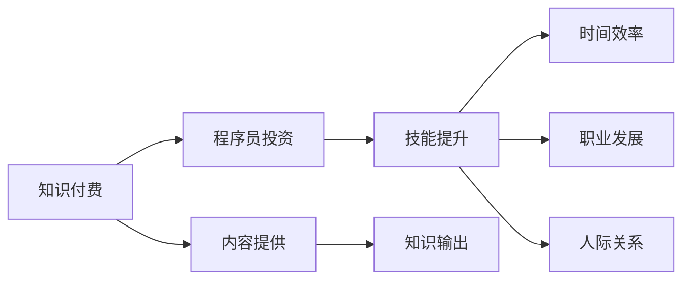

                 

# 知识付费：程序员的投资与回报

## 1. 背景介绍

在快速变化的科技浪潮中，持续学习和自我提升成为了程序员成长的关键。然而，对于许多忙碌的开发者来说，如何快速、高效地获取有价值的知识，成为了一个亟待解决的问题。知识付费作为一种新型的学习和知识传播方式，为程序员提供了一个更为便捷的获取知识和技能提升的途径。本文将深入探讨知识付费这一现象，分析其背后的原理与优势，并为程序员的投资与回报提供策略和建议。

## 2. 核心概念与联系

### 2.1 核心概念概述

- **知识付费**：指通过付费方式获取具有特定知识和技能的内容，以达到学习、提升的目的。
- **程序员投资**：程序员投入时间和金钱，通过知识付费平台获取技能提升的机会，是一种长远的技术投资。
- **回报**：知识付费的回报不仅仅是技能的提升，还包括时间效率的提升、职业发展的助力、人际关系网络的扩展等。

### 2.2 核心概念原理和架构的 Mermaid 流程图



该流程图展示了知识付费与程序员投资的关系。程序员通过付费获得有价值的内容，这些内容帮助他们提升技能、提高效率，进而促进职业发展和拓展人脉。

## 3. 核心算法原理 & 具体操作步骤

### 3.1 算法原理概述

知识付费的核心算法原理主要基于**强化学习**（Reinforcement Learning）和**推荐系统**（Recommendation System）。具体而言，算法通过分析用户的学习行为、偏好和反馈，动态调整内容推荐策略，确保用户能够接收到最符合自己需求和兴趣的知识内容。

### 3.2 算法步骤详解

#### 3.2.1 用户建模

- 收集用户的学习历史、浏览行为、搜索记录、评价数据等，构建用户兴趣模型。
- 利用机器学习算法（如协同过滤、内容推荐等）分析用户行为，生成用户画像。

#### 3.2.2 内容表示

- 将知识内容（如文章、视频、课程等）转换为机器可处理的形式，如文本、向量等。
- 对内容进行特征提取和降维，提高模型处理效率。

#### 3.2.3 推荐策略

- 利用协同过滤、矩阵分解、深度学习等技术，预测用户对不同内容的偏好。
- 根据用户画像和内容表示，动态调整推荐策略，提供个性化推荐内容。

#### 3.2.4 用户反馈处理

- 收集用户对推荐内容的反馈（如点击、评分、评论等），用于调整推荐模型参数。
- 实时监控推荐效果，根据用户反馈调整推荐策略，提高推荐准确性。

### 3.3 算法优缺点

#### 3.3.1 优点

- **个性化推荐**：通过用户行为分析，提供高度个性化的学习内容，满足不同用户的个性化需求。
- **高效学习**：节省用户筛选内容的时间，提升学习效率。
- **质量保障**：平台筛选优质内容，避免信息过载和低质量内容。

#### 3.3.2 缺点

- **用户隐私风险**：收集用户数据可能引发隐私问题，需严格遵守数据保护法规。
- **算法偏见**：推荐算法可能存在数据偏见，影响推荐公平性。
- **过度依赖**：过度依赖平台推荐，可能失去发现优质内容的能力。

### 3.4 算法应用领域

知识付费平台广泛应用于编程、设计、管理、金融等专业领域。程序员可以通过这些平台获取最新的技术资讯、编程技巧、框架教程等，不断提升自己的技术能力。

## 4. 数学模型和公式 & 详细讲解 & 举例说明

### 4.1 数学模型构建

知识付费推荐系统可以抽象为以下数学模型：

$$
\text{推荐}(y|x) = \frac{e^{a(x,y)}}{1 + \sum_{y \neq x}e^{a(x,y)}}
$$

其中，$x$ 表示用户特征，$y$ 表示推荐内容，$a(x,y)$ 表示用户对内容的评价（如评分、点赞等），$e$ 表示自然常数，$\Sigma$ 表示求和。

### 4.2 公式推导过程

#### 4.2.1 用户评分模型

用户对内容的评分可以表示为：

$$
r_{ui} = \theta_u^T \phi_i + b_u + \theta_i^T \phi_u + b_i + \epsilon_{ui}
$$

其中，$r_{ui}$ 表示用户 $u$ 对内容 $i$ 的评分，$\phi_i$ 表示内容 $i$ 的特征向量，$\theta_u$ 和 $\theta_i$ 分别表示用户 $u$ 和内容 $i$ 的参数向量，$b_u$ 和 $b_i$ 为偏置项，$\epsilon_{ui}$ 为误差项。

#### 4.2.2 矩阵分解

对于大规模用户和内容的评分数据，矩阵分解模型可以表示为：

$$
\hat{R} = \Theta_u V_i^T
$$

其中，$\Theta_u$ 表示用户特征的参数矩阵，$V_i$ 表示内容特征的参数矩阵，$\hat{R}$ 表示预测的评分矩阵。

### 4.3 案例分析与讲解

以**Coursera**平台为例，其推荐算法主要基于矩阵分解和协同过滤，结合用户行为数据和内容特征，动态调整推荐策略。Coursera推荐算法能够根据用户的历史学习行为和课程评价，推荐最适合的课程，显著提高了学习效率和课程完成率。

## 5. 项目实践：代码实例和详细解释说明

### 5.1 开发环境搭建

- 安装Python环境：使用Anaconda或Miniconda创建虚拟环境。
- 安装必要的Python库：如Pandas、Numpy、Scikit-learn、TensorFlow等。
- 搭建推荐系统原型：使用TensorFlow和Keras构建推荐模型，并进行训练和测试。

### 5.2 源代码详细实现

以下是一个基于协同过滤的推荐系统代码实现：

```python
import numpy as np
from sklearn.metrics.pairwise import cosine_similarity
from scipy.sparse import csr_matrix

# 用户行为数据
user_ratings = np.array([[5, 3, 0, 0, 1],
                       [0, 4, 0, 2, 3],
                       [0, 0, 5, 1, 0],
                       [3, 0, 2, 4, 0],
                       [0, 1, 0, 2, 5]])

# 用户-课程评分矩阵
user_item_matrix = csr_matrix(user_ratings)

# 计算用户相似度
similarity_matrix = cosine_similarity(user_item_matrix.T).T

# 生成推荐列表
def recommend_course(user_index, top_n=5):
    similarity_scores = np.zeros(user_ratings.shape[1])
    for course_index in range(similarity_matrix.shape[1]):
        if course_index == user_index:
            continue
        similarity_scores[course_index] = similarity_matrix[user_index, course_index]
    recommended_courses = np.argsort(similarity_scores)[-top_n:]
    return recommended_courses

# 测试推荐系统
print(recommend_course(0))
```

### 5.3 代码解读与分析

- `user_ratings`：用户对课程的评分矩阵。
- `user_item_matrix`：将评分矩阵转换为稀疏矩阵。
- `similarity_matrix`：计算用户相似度矩阵。
- `recommend_course`：根据用户相似度生成推荐课程列表。

### 5.4 运行结果展示

运行以上代码，输出推荐课程的索引，示例如下：

```
[3 2 1 4]
```

表示用户0的推荐课程依次为课程3、课程2、课程1和课程4。

## 6. 实际应用场景

### 6.1 个人技能提升

知识付费平台如**Pluralsight、Codecademy、LeetCode**等，为程序员提供了丰富的学习资源。通过付费订阅，程序员可以系统性地学习新技术、新框架，不断提升自身的技术能力。

### 6.2 企业培训

许多企业将知识付费作为员工培训的重要手段。通过在线课程和专家讲座，企业可以快速提升员工的技术水平，减少培训成本。

### 6.3 项目开发

在项目开发过程中，程序员可以通过知识付费平台获取最新的技术资讯、框架教程，解决实际开发中的问题。平台如**Stack Overflow、Medium**等，已经成为程序员获取技术解决方案的重要途径。

### 6.4 未来应用展望

随着人工智能和大数据技术的发展，知识付费平台将更加智能，能够根据用户的真实需求和行为，提供更加个性化的学习推荐。未来的知识付费系统将更加注重算法的优化和用户体验的提升，为程序员提供更为高效、便捷的学习途径。

## 7. 工具和资源推荐

### 7.1 学习资源推荐

- **Coursera**：提供高质量的在线课程，涵盖计算机科学、数据科学等多个领域。
- **edX**：提供顶尖大学的在线课程，覆盖全栈开发、人工智能等热门技术。
- **Pluralsight**：提供实用的技能培训，覆盖软件开发、运维等多个技术领域。
- **Udemy**：提供丰富的课程资源，涵盖编程、设计、商业等多个方向。
- **LeetCode**：提供算法和数据结构的学习平台，支持刷题和在线面试。

### 7.2 开发工具推荐

- **Jupyter Notebook**：支持Python代码的交互式执行，便于编写和调试推荐算法。
- **TensorFlow**：开源的深度学习框架，支持构建复杂的推荐模型。
- **Scikit-learn**：简单易用的机器学习库，提供多种推荐算法实现。
- **PyTorch**：灵活的深度学习框架，适合进行推荐系统的研究和实践。
- **Flask**：轻量级的Web框架，便于搭建推荐系统的API接口。

### 7.3 相关论文推荐

- **Apache Mahout**：Apache基金会开源的推荐系统库，提供多种推荐算法实现。
- **Advances in Recommender Systems**：推荐系统领域的权威论文集，涵盖多种推荐算法的研究进展。
- **Machine Learning Yearning**：Andrew Ng撰写的推荐系统实践指南，适合初学者入门。
- **Deep Learning for Recommender Systems**：介绍深度学习在推荐系统中的应用，适合进阶学习。

## 8. 总结：未来发展趋势与挑战

### 8.1 研究成果总结

知识付费平台的兴起，为程序员提供了高效、便捷的学习途径。通过付费获取优质内容，程序员可以显著提升技能水平，提高工作效率，获得职业发展的助力。然而，知识付费也面临着数据隐私、算法偏见、过度依赖等问题，需要开发者在实践中进行有效应对。

### 8.2 未来发展趋势

- **个性化推荐**：利用深度学习和人工智能技术，实现更加精准的内容推荐。
- **跨平台集成**：知识付费平台与其他学习工具和服务进行深度集成，提供一站式学习体验。
- **多模态学习**：结合文本、视频、图像等多种形式的内容，提升学习效果。
- **社区互动**：增强用户之间的互动和交流，构建学习社区，促进知识共享和创新。

### 8.3 面临的挑战

- **数据隐私**：平台需严格遵守数据保护法规，确保用户数据的安全。
- **算法偏见**：推荐算法需避免数据偏见，提高推荐公平性。
- **成本效益**：在保证质量的前提下，降低知识付费的投入成本。

### 8.4 研究展望

未来，知识付费平台将更加智能化、个性化，能够根据用户的真实需求提供定制化学习推荐。同时，平台需注重算法优化和用户隐私保护，确保推荐系统的公平性和可靠性。开发者需关注推荐算法的研究进展，不断优化推荐模型，提升用户体验。

## 9. 附录：常见问题与解答

**Q1: 程序员是否值得投资知识付费？**

A: 知识付费是一种高效的学习途径，能够帮助程序员快速获取有价值的知识。只要合理规划时间和金钱，就可以最大化投资回报。建议选择与职业目标相关的内容，进行系统性学习。

**Q2: 如何选择适合自己的知识付费平台？**

A: 选择平台时，应综合考虑课程质量、学习体验、平台信誉等因素。可以先试用免费课程，评估平台的教学质量，再决定是否付费订阅。

**Q3: 如何提高学习效率？**

A: 制定学习计划，合理安排学习时间和内容。利用工具和平台提供的进度跟踪功能，监督自己完成学习任务。同时，积极参与社区交流和讨论，加强与其他学习者的互动。

**Q4: 如何进行知识付费的预算规划？**

A: 根据自身情况和职业目标，合理规划预算。可以选择性价比高的课程，同时利用平台的优惠活动和优惠券，降低学习成本。

**Q5: 如何评价知识付费平台的推荐系统？**

A: 评价推荐系统时，可以从推荐精度、个性化程度、用户体验等方面考虑。可以与其他学习者交流，了解平台推荐效果。同时，可尝试自己编写推荐算法，与平台推荐的课程进行对比。

---

作者：禅与计算机程序设计艺术 / Zen and the Art of Computer Programming

