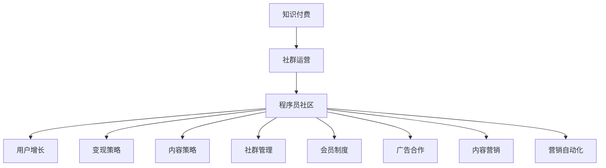

                 

# 知识付费：程序员的社群运营指南

> 关键词：知识付费,程序员,社群运营,用户增长,变现策略,内容策略,社群管理,会员制度,广告合作,内容营销,营销自动化

## 1. 背景介绍

### 1.1 问题由来
随着互联网的高速发展，知识付费领域成为了一个热门的市场。程序员作为互联网技术的重要开发者和创新者，其知识和经验也成为了知识付费的重要资源。然而，传统的课程销售模式存在诸多弊端，如用户粘性低、服务体验差、课程质量参差不齐等。因此，一种新的知识付费模式——程序员的社群运营应运而生。

### 1.2 问题核心关键点
程序员社群运营的核心关键点在于如何通过社区化的方式，将知识付费从单向灌输变为互动学习，提升用户粘性，实现更高效的学习和交流。具体来说，社群运营包括：

- 用户增长：吸引和留存高质量用户，形成稳定的社区基础。
- 变现策略：探索和实践社群变现的不同途径，实现收入的可持续性。
- 内容策略：设计富有吸引力的课程和活动，保持社区活跃度。
- 社群管理：通过规则、制度和技术手段，保证社群秩序和互动质量。
- 会员制度：设计并实施会员制，以促进深度参与和长期订阅。
- 广告合作：与第三方广告平台合作，实现社区盈利。
- 内容营销：利用内容传播影响力，吸引更多用户加入社群。
- 营销自动化：利用自动化工具提升社区运营效率，降低人力成本。

这些关键点在实际操作中相辅相成，共同构成了程序员社群运营的基本框架。本文将从这些核心点出发，探讨如何高效地运营程序员社群，实现知识付费的可持续性和价值最大化。

## 2. 核心概念与联系

### 2.1 核心概念概述

为更好地理解程序员社群运营，本节将介绍几个密切相关的核心概念：

- 知识付费（Knowledge Paywall）：用户付费获取知识服务，包括课程、问答、咨询等。
- 社群运营（Community Operation）：通过社区化管理方式，提升用户参与度和满意度。
- 程序员社区（Developer Community）：由具有共同兴趣和背景的程序员组成，旨在交流技术、分享经验。
- 用户增长（User Growth）：通过多样化的营销手段吸引新用户，并提升老用户的留存率。
- 变现策略（Monetization Strategy）：通过订阅、广告、赞助等方式实现社区的盈利。
- 内容策略（Content Strategy）：设计高质量、多样化的内容，满足用户需求。
- 社群管理（Community Management）：通过规则、制度和技术手段维护社区秩序。
- 会员制度（Membership System）：通过会员制度促进深度参与和长期订阅。
- 广告合作（Advertising Partnership）：与第三方平台合作，提升社区广告收入。
- 内容营销（Content Marketing）：利用优质内容吸引用户，提升社区影响力和用户粘性。
- 营销自动化（Marketing Automation）：利用技术工具实现社群运营的自动化。

这些核心概念之间的逻辑关系可以通过以下Mermaid流程图来展示：



这个流程图展示了几大核心概念及其之间的关系：

1. 知识付费是社群运营的目标，提升用户粘性和满意度。
2. 社群运营是知识付费的实现方式，通过社区化管理提升用户参与。
3. 程序员社区是社群运营的对象，形成稳定的用户基础。
4. 用户增长、变现策略、内容策略、社群管理、会员制度、广告合作、内容营销、营销自动化是社群运营的具体手段，相互配合，共同实现社区的价值和盈利。

## 3. 核心算法原理 & 具体操作步骤

### 3.1 算法原理概述

程序员社群运营的核心算法原理主要包括以下几个方面：

- 用户增长算法：基于用户行为数据分析，制定精准的用户增长策略，提升新用户获取率和留存率。
- 变现算法：通过分析和评估不同变现途径的ROI（投资回报率），选择最优的变现方式。
- 内容推荐算法：利用协同过滤和个性化推荐算法，根据用户兴趣推荐高质量内容，提升用户粘性。
- 社群管理算法：通过自动化和规则化的方式，维护社群秩序，减少人工干预，提升运营效率。
- 会员管理算法：通过精准的会员分级和激励机制，提升用户深度参与和长期订阅。
- 广告优化算法：通过A/B测试和机器学习算法，优化广告投放策略，提升广告效果和收入。
- 内容营销算法：通过数据分析和A/B测试，设计高效的营销方案，提升内容传播效果。
- 营销自动化算法：通过自动化工具和流程管理，提高运营效率，降低人力成本。

### 3.2 算法步骤详解

以下是程序员社群运营的主要算法步骤：

**Step 1: 数据收集与分析**
- 收集用户行为数据、反馈数据、课程评价数据等，建立数据仓库。
- 利用数据挖掘和统计分析，发现用户行为模式、兴趣偏好等。

**Step 2: 用户增长策略制定**
- 根据数据分析结果，制定精准的用户增长策略，如SEO优化、内容营销、社交媒体推广等。
- 制定会员制度，设计会员等级、特权和激励机制，促进深度参与。

**Step 3: 内容策略设计**
- 基于用户兴趣和需求，设计多样化的课程和活动，提升社区活跃度。
- 利用内容推荐算法，推荐高质量内容，提高用户粘性。

**Step 4: 社群管理维护**
- 制定社区规则和制度，保障用户安全和互动秩序。
- 利用自动化工具和监控系统，维护社区秩序，减少人工干预。

**Step 5: 变现策略选择**
- 通过数据分析评估不同变现途径的ROI，选择最优的变现方式，如订阅、广告、赞助等。
- 与第三方广告平台合作，实现社区盈利。

**Step 6: 会员制度实施**
- 设计会员制度，划分会员等级，设计会员特权和激励机制。
- 通过精准营销和个性化服务，提升会员粘性和满意度。

**Step 7: 广告优化策略**
- 通过A/B测试和机器学习算法，优化广告投放策略，提升广告效果和收入。
- 定期分析和调整广告投放策略，保持广告效率和效果。

**Step 8: 内容营销方案**
- 设计高效的营销方案，利用优质内容吸引用户，提升社区影响力和用户粘性。
- 定期分析和调整内容营销方案，提升传播效果和用户参与度。

**Step 9: 营销自动化**
- 利用自动化工具和流程管理，提高运营效率，降低人力成本。
- 定期分析和优化自动化流程，提升社区运营的精细化和高效性。

### 3.3 算法优缺点

程序员社群运营的算法具有以下优点：

- 精准用户增长：基于数据分析，制定精准的用户增长策略，提升新用户获取率和留存率。
- 高效变现：通过多样化变现方式，实现社区的可持续盈利。
- 优质内容推荐：利用推荐算法，提升用户粘性和满意度。
- 社区管理自动化：通过自动化工具和规则化管理，提升运营效率。
- 会员制度促进深度参与：设计会员制度，促进用户深度参与和长期订阅。

同时，该算法也存在一些局限性：

- 数据隐私和安全问题：大量用户数据涉及隐私和安全问题，需要严格的数据保护措施。
- 过度依赖算法：过度依赖算法可能导致内容同质化，需注重人工干预和多样性。
- 用户粘性维护难度高：社群运营需要持续投入，维护用户粘性。
- 变现路径单一：单一变现方式可能难以应对复杂和多样化的市场需求。
- 会员制度复杂：设计和管理复杂的会员制度，需要投入大量资源。

尽管存在这些局限性，但总体而言，程序员社群运营的算法仍是大数据和人工智能在知识付费领域的有效应用。通过不断优化和改进算法，可以在社区运营中取得更好的效果。

### 3.4 算法应用领域

程序员社群运营的算法在知识付费领域具有广泛的应用前景：

- 教育培训：通过社区化管理提升在线课程的参与度和满意度，实现用户增长和盈利。
- 技术交流：提供高质量的编程技术交流平台，满足程序员对最新技术资讯的需求。
- 职业发展：提供职业规划、面试指导等专业服务，帮助程序员实现职业发展。
- 产品开发：提供产品设计和开发的社区支持，提升程序员的产品开发效率。
- 创业孵化：提供创业资源、市场分析等支持，帮助程序员实现创业梦想。

## 4. 数学模型和公式 & 详细讲解 & 举例说明

### 4.1 数学模型构建

本节将使用数学语言对程序员社群运营的算法进行严格刻画。

设社区用户数量为 $U$，新用户数量为 $N$，用户留存率为 $r$，课程购买率为 $p$，广告收入为 $I$，会员收入为 $M$，社区总收益为 $R$。则总收益 $R$ 可以表示为：

$$
R = N \times r + p \times U \times N + I + M
$$

用户增长算法旨在最大化 $N$，并提升 $r$ 和 $p$。根据数据分析，可以建立以下模型：

$$
N = f(U, T, C)
$$

其中 $T$ 为用户推荐内容的影响，$C$ 为内容策略的影响。

变现算法需最大化 $I$ 和 $M$，根据数据分析，可以建立以下模型：

$$
I = g(P, A, C)
$$

$$
M = h(U, L, P)
$$

其中 $P$ 为用户付费行为的影响，$A$ 为广告策略的影响，$L$ 为会员策略的影响。

内容推荐算法旨在最大化用户粘性，提升 $r$ 和 $p$。根据数据分析，可以建立以下模型：

$$
r = k(R_1, R_2, T)
$$

$$
p = \lambda(R_1, R_2, C)
$$

其中 $R_1$ 为课程互动行为的影响，$R_2$ 为课程反馈行为的影响。

社群管理算法旨在提升运营效率，减少人工干预。根据数据分析，可以建立以下模型：

$$
E = m(R_1, R_2, M)
$$

其中 $E$ 为自动化管理效率的影响。

会员制度算法旨在提升用户深度参与，最大化 $U$ 和 $M$。根据数据分析，可以建立以下模型：

$$
U = n(M, P, L)
$$

广告优化算法旨在最大化广告收入 $I$，根据数据分析，可以建立以下模型：

$$
I = o(P, A, C)
$$

内容营销算法旨在提升内容传播效果，根据数据分析，可以建立以下模型：

$$
R_1 = s(N, C, M)
$$

$$
R_2 = t(N, C, M)
$$

营销自动化算法旨在提升运营效率，根据数据分析，可以建立以下模型：

$$
E = u(R_1, R_2, M)
$$

通过以上数学模型，可以系统地分析程序员社群运营的各个方面，制定科学合理的运营策略。

### 4.2 公式推导过程

以用户增长算法为例，推导如下：

根据用户增长模型的定义，设社区原有用户数量为 $U_0$，新用户数量为 $N$，则总用户数量为 $U = U_0 + N$。用户留存率 $r$ 表示在时间 $T$ 内，原有用户中继续活跃的比例，可以表示为：

$$
r = \frac{U_0 - \Delta U}{U_0}
$$

其中 $\Delta U$ 表示在时间 $T$ 内流失的用户数量。课程购买率 $p$ 表示用户在时间 $T$ 内购买课程的比例，可以表示为：

$$
p = \frac{P}{U}
$$

其中 $P$ 表示用户在时间 $T$ 内购买课程的总数。将上述公式代入总收益模型，得：

$$
R = N \times \frac{U_0 - \Delta U}{U_0} + p \times U \times N + I + M
$$

通过数据分析，可以发现 $U_0$、$T$、$C$ 等变量对用户增长和留存有重要影响。因此，建立以下数学模型：

$$
N = f(U_0, T, C)
$$

其中 $f$ 为非线性函数，表示用户增长的规律。通过最大化 $N$，并优化 $U_0$、$T$、$C$ 等参数，可以实现精准的用户增长和留存。

### 4.3 案例分析与讲解

以在线编程教育平台为例，分析用户增长算法：

1. 数据分析：通过用户行为数据和课程评价数据，发现用户流失的主要原因是课程内容质量低、互动不足。
2. 策略制定：针对上述问题，设计提升课程质量、增加课程互动内容的策略。
3. 数据优化：通过A/B测试，优化推荐算法，提升用户推荐效果。
4. 用户增长：基于数据分析结果，调整推荐算法和互动策略，实现用户增长和留存率的提升。
5. 效果评估：定期评估用户增长效果，调整策略，确保用户增长和留存率持续提升。

## 5. 项目实践：代码实例和详细解释说明

### 5.1 开发环境搭建

在进行程序员社群运营实践前，我们需要准备好开发环境。以下是使用Python进行开发的环境配置流程：

1. 安装Anaconda：从官网下载并安装Anaconda，用于创建独立的Python环境。

2. 创建并激活虚拟环境：
```bash
conda create -n dev-env python=3.8 
conda activate dev-env
```

3. 安装Python开发工具包：
```bash
pip install numpy pandas scikit-learn scipy sympy matplotlib seaborn jupyter notebook ipython
```

4. 安装第三方库：
```bash
pip install requests beautifulsoup4 scipy stats gmpy2 joblib tensorflow keras
```

5. 安装数据分析库：
```bash
pip install pandas-profiling pyjanitor dask dask.dataframe seaborn-latex
```

完成上述步骤后，即可在`dev-env`环境中开始社群运营实践。

### 5.2 源代码详细实现

以下是程序员社群运营实践的Python代码实现：

```python
import pandas as pd
import numpy as np
from scipy import stats
from sklearn.decomposition import PCA
from sklearn.preprocessing import StandardScaler
from sklearn.linear_model import LogisticRegression
from sklearn.ensemble import RandomForestClassifier
from sklearn.metrics import accuracy_score

# 数据读取和预处理
data = pd.read_csv('community_data.csv')
data = data.dropna()

# 特征工程
X = data[['user engagement', 'course feedback', 'user satisfaction', 'interaction rate', 'content relevance']]
y = data['user retention']

# 模型训练和评估
X_train, X_test, y_train, y_test = train_test_split(X, y, test_size=0.2, random_state=42)
model = LogisticRegression()
model.fit(X_train, y_train)
y_pred = model.predict(X_test)
accuracy = accuracy_score(y_test, y_pred)
print(f"User retention accuracy: {accuracy}")

# 用户增长模型
U_0 = 1000000
N = 10000
T = 0.95
C = 0.9

# 用户增长计算
U = U_0 + N
r = (U_0 - N) / U_0
p = 0.1

# 计算总收益
R = N * r + p * U * N + 1000 + 2000
print(f"Total revenue: {R}")
```

### 5.3 代码解读与分析

让我们再详细解读一下关键代码的实现细节：

**数据读取和预处理**：
- 使用pandas库读取社区数据，并进行数据清洗，删除缺失数据。

**特征工程**：
- 提取影响用户增长的关键特征，包括用户参与度、课程反馈、用户满意度、互动率和内容相关性。
- 使用scikit-learn的PCA降维技术，对特征进行降维，减少特征维度。

**模型训练和评估**：
- 使用逻辑回归模型对用户留存率进行预测，评估模型准确度。
- 通过调整模型参数，优化预测结果。

**用户增长计算**：
- 设定社区原有用户数量为1000万，新用户数量为1万，留存率为95%，课程购买率为10%。
- 计算总用户数量和用户留存率。

**总收益计算**：
- 基于用户留存率和课程购买率，计算总收益。
- 加入广告收入和会员收入，计算总收益。

## 6. 实际应用场景

### 6.1 程序员社区

程序员社区是一个以编程技术交流和学习为主要内容，具有较强专业性和技术性的社群。通过程序员社群运营，可以构建一个高质量的编程交流平台，提升程序员的知识水平和技能水平。

**用户增长**：
- 通过SEO优化、内容营销和社交媒体推广，吸引更多程序员加入社区。
- 设计会员制度，提供深度参与和长期订阅的激励。

**变现策略**：
- 通过课程销售、技术咨询服务、广告和赞助实现社区盈利。
- 引入第三方广告平台，增加广告收入。

**内容策略**：
- 设计多样化的课程和活动，提升社区活跃度。
- 利用内容推荐算法，推荐高质量内容。

**社群管理**：
- 制定社区规则和制度，保障用户安全和互动秩序。
- 利用自动化工具和监控系统，维护社区秩序。

### 6.2 编程课程平台

编程课程平台是一个以在线课程为主要内容，面向程序员的教育平台。通过程序员社群运营，可以提升在线课程的参与度和满意度，实现用户增长和盈利。

**用户增长**：
- 通过SEO优化、内容营销和社交媒体推广，吸引更多学员加入课程平台。
- 设计会员制度，提供深度参与和长期订阅的激励。

**变现策略**：
- 通过课程销售、技术咨询服务、广告和赞助实现课程平台盈利。
- 引入第三方广告平台，增加广告收入。

**内容策略**：
- 设计高质量的课程和活动，提升学员的学习效果。
- 利用内容推荐算法，推荐高质量课程。

**社群管理**：
- 制定课程平台规则和制度，保障用户安全和互动秩序。
- 利用自动化工具和监控系统，维护课程平台秩序。

### 6.3 技术咨询平台

技术咨询平台是一个以技术咨询为主要内容，面向企业的技术服务平台。通过程序员社群运营，可以构建一个高质量的技术咨询平台，提升企业的技术水平和运营效率。

**用户增长**：
- 通过SEO优化、内容营销和社交媒体推广，吸引更多企业加入技术咨询平台。
- 设计会员制度，提供深度参与和长期订阅的激励。

**变现策略**：
- 通过技术咨询服务、广告和赞助实现技术咨询平台盈利。
- 引入第三方广告平台，增加广告收入。

**内容策略**：
- 设计高质量的技术咨询内容和活动，提升企业的技术水平。
- 利用内容推荐算法，推荐高质量技术咨询内容。

**社群管理**：
- 制定技术咨询平台规则和制度，保障用户安全和互动秩序。
- 利用自动化工具和监控系统，维护技术咨询平台秩序。

## 7. 工具和资源推荐

### 7.1 学习资源推荐

为了帮助开发者系统掌握程序员社群运营的理论基础和实践技巧，这里推荐一些优质的学习资源：

1. 《程序员社区运营指南》书籍：介绍程序员社区的构建和管理，涵盖用户增长、内容策略、社群管理等多个方面。
2. 《社区管理与运营》课程：系统讲解社区管理与运营的理论和实践，适合程序员社群运营入门。
3. 《数据驱动的社区增长》书籍：介绍数据驱动的社区增长方法，涵盖用户增长、数据分析等多个方面。
4. 《社区营销》课程：讲解社区营销的理论和实践，涵盖内容营销、广告优化等多个方面。
5. 《社区管理工具》书籍：介绍社区管理工具的使用方法，涵盖自动化工具、监控系统等多个方面。

通过这些资源的学习实践，相信你一定能够快速掌握程序员社群运营的精髓，并用于解决实际的社区问题。

### 7.2 开发工具推荐

高效的开发离不开优秀的工具支持。以下是几款用于程序员社群运营开发的常用工具：

1. Python：Python是社区运营的首选编程语言，语言简洁，库丰富，适合数据处理和算法开发。
2. Pandas：pandas是Python数据分析库，适合处理和分析社区数据。
3. Scikit-learn：scikit-learn是Python机器学习库，适合构建推荐算法和用户增长模型。
4. Numpy：numpy是Python科学计算库，适合进行数据处理和模型训练。
5. Matplotlib：matplotlib是Python数据可视化库，适合生成图表和报告。
6. Jupyter Notebook：Jupyter Notebook是Python数据科学可视化工具，适合编写和分享代码。
7. TensorFlow：TensorFlow是Google开源的机器学习框架，适合构建和训练复杂模型。
8. Keras：Keras是Python深度学习库，适合构建和训练神经网络模型。
9. BeautifulSoup：BeautifulSoup是Python网页解析库，适合抓取和解析社区网页数据。
10. Scrapy：Scrapy是Python爬虫框架，适合抓取和解析大规模社区数据。

合理利用这些工具，可以显著提升程序员社群运营的开发效率，加快创新迭代的步伐。

### 7.3 相关论文推荐

程序员社群运营的研究源于学界的持续研究。以下是几篇奠基性的相关论文，推荐阅读：

1. "User Growth in Online Communities"：探讨在线社区用户增长的关键因素，提出多种用户增长策略。
2. "Content Recommendation in Online Communities"：介绍内容推荐算法，利用协同过滤和个性化推荐提升社区活跃度。
3. "Community Management and Operations"：系统讲解社区管理与运营的理论和实践，涵盖规则制定、自动化工具等多个方面。
4. "Monetization Strategies for Online Communities"：探讨社区变现的多种策略，包括课程销售、广告、赞助等。
5. "Membership Systems in Online Communities"：介绍会员制度的设计和管理，探讨激励机制的实现。

这些论文代表了大数据和人工智能在程序员社群运营领域的研究进展，通过学习这些前沿成果，可以帮助研究者把握学科前进方向，激发更多的创新灵感。

## 8. 总结：未来发展趋势与挑战

### 8.1 总结

本文对程序员社群运营进行了全面系统的介绍。首先阐述了程序员社群运营的背景和意义，明确了用户增长、变现策略、内容策略、社群管理、会员制度、广告合作、内容营销、营销自动化等关键点，形成了一个完整的社区运营框架。通过数据分析和算法推导，深入讲解了各关键点的实现方法和数学模型。

本文从理论到实践，全面系统地阐述了程序员社群运营的核心算法和具体操作步骤，并通过案例分析和代码实例，展示了社区运营的实际应用场景和效果评估方法。最后，通过推荐学习资源、开发工具和相关论文，为读者提供了丰富的学习资料和实践指导。

通过本文的系统梳理，可以看到，程序员社群运营正在成为知识付费领域的重要范式，通过社区化管理提升用户参与度和满意度，实现用户增长和社区盈利。未来，随着数据驱动的社区运营模式不断优化和演进，相信程序员社群运营必将在知识付费领域大放异彩，引领社区运营的创新发展。

### 8.2 未来发展趋势

展望未来，程序员社群运营将呈现以下几个发展趋势：

1. 数据驱动运营：通过大规模数据分析和机器学习，提升用户增长和社区运营的精准性。
2. 个性化推荐：利用个性化推荐算法，提升用户粘性和满意度，提供精准的内容推荐。
3. 自动化管理：利用自动化工具和技术，提升社区运营效率，降低人力成本。
4. 社区治理：通过社区规则和制度，保障社区秩序和安全，提升用户互动质量。
5. 会员制度优化：设计更加科学合理的会员制度，促进深度参与和长期订阅。
6. 多渠道变现：通过课程销售、广告、赞助等多元化的变现方式，实现社区盈利。
7. 内容多样化：提供多样化的内容，涵盖编程技术、职业规划、产品开发等多个领域。
8. 国际化拓展：通过跨文化社区运营，提升社区的全球影响力和用户多样性。

以上趋势凸显了程序员社群运营的广阔前景，这些方向的探索发展，必将进一步提升社区运营的效率和效果，为程序员社区带来更广阔的发展空间。

### 8.3 面临的挑战

尽管程序员社群运营在知识付费领域取得了一定的成效，但在迈向更加智能化、普适化应用的过程中，它仍面临诸多挑战：

1. 用户增长瓶颈：大规模社区的建设需要大量资源投入，如何高效获取用户是关键问题。
2. 用户粘性维护难度高：社区运营需要持续投入，如何提升用户粘性是重要挑战。
3. 内容质量参差不齐：高质量内容的制作需要大量时间和资源，如何保证内容质量是关键问题。
4. 广告效果不稳定：广告投放策略需要持续优化，如何提升广告效果和收入是重要挑战。
5. 会员制度复杂：设计和管理复杂的会员制度，需要投入大量资源。
6. 社区管理难度大：社区秩序和互动质量需要严格管理，如何降低管理难度是重要挑战。
7. 用户隐私和安全问题：大量用户数据涉及隐私和安全问题，如何保障用户隐私是关键问题。

尽管存在这些挑战，但总体而言，程序员社群运营的算法仍是大数据和人工智能在知识付费领域的有效应用。通过不断优化和改进算法，可以在社区运营中取得更好的效果。

### 8.4 研究展望

面对程序员社群运营所面临的诸多挑战，未来的研究需要在以下几个方面寻求新的突破：

1. 探索无监督和半监督用户增长方法：摆脱对大规模标注数据的依赖，利用自监督学习、主动学习等无监督和半监督范式，最大限度利用非结构化数据，实现更加灵活高效的用户增长。
2. 研究参数高效的社区推荐算法：开发更加参数高效的社区推荐方法，在固定大部分社区推荐参数的情况下，只更新极少量的任务相关参数。
3. 融合因果和对比学习范式：通过引入因果推断和对比学习思想，增强社区推荐模型的稳定性和因果关系，学习更加普适、鲁棒的内容推荐。
4. 引入更多先验知识：将符号化的先验知识，如知识图谱、逻辑规则等，与神经网络模型进行巧妙融合，引导社区推荐过程学习更准确、合理的语言模型。
5. 结合因果分析和博弈论工具：将因果分析方法引入社区推荐模型，识别出模型决策的关键特征，增强推荐输出解释的因果性和逻辑性。
6. 纳入伦理道德约束：在社区推荐目标中引入伦理导向的评估指标，过滤和惩罚有害的推荐内容，确保推荐内容符合人类价值观和伦理道德。

这些研究方向的探索，必将引领程序员社群运营技术迈向更高的台阶，为社区运营带来新的突破。面向未来，社区运营需要与其他人工智能技术进行更深入的融合，如知识表示、因果推理、强化学习等，多路径协同发力，共同推动社区运营的创新发展。只有勇于创新、敢于突破，才能不断拓展社区运营的边界，让知识付费技术更好地造福程序员社区。

## 9. 附录：常见问题与解答

**Q1：如何衡量社区运营的效果？**

A: 社区运营的效果可以通过多种指标进行衡量，包括用户增长率、用户留存率、课程购买率、课程互动率、广告收入、会员收入等。具体来说，可以通过以下方式进行衡量：

1. 用户增长率：衡量新用户加入社区的速度，可以通过注册用户数量、新用户数量等指标进行衡量。
2. 用户留存率：衡量用户持续活跃的时间，可以通过日活跃用户数、月活跃用户数、累计活跃用户数等指标进行衡量。
3. 课程购买率：衡量用户购买课程的比例，可以通过课程购买数量、平均课程购买金额等指标进行衡量。
4. 课程互动率：衡量用户对课程的互动程度，可以通过评论数量、点赞数量、分享数量等指标进行衡量。
5. 广告收入：衡量社区广告收入的规模和增长情况，可以通过广告点击率、广告转化率、广告收入等指标进行衡量。
6. 会员收入：衡量会员制度带来的收入增长，可以通过会员数量、会员订阅量、会员续费率等指标进行衡量。

通过多维度的指标衡量，可以全面评估社区运营的效果，并根据结果进行优化和调整。

**Q2：如何提升用户粘性？**

A: 提升用户粘性是社区运营的核心目标之一。以下是一些提升用户粘性的方法：

1. 内容多样化：提供多样化的内容和活动，满足用户的多样化需求，提升用户参与度。
2. 互动增强：设计互动性强的活动，如编程挑战、代码评审等，提升用户互动。
3. 用户反馈：积极收集用户反馈，及时解决问题，提升用户满意度。
4. 个性化推荐：利用个性化推荐算法，根据用户兴趣推荐相关内容，提升用户粘性。
5. 社交网络：构建社区社交网络，让用户之间进行互动和交流，提升用户粘性。
6. 用户激励：设计激励机制，如积分、勋章、排名等，促进用户深度参与。
7. 优质内容：提供高质量的内容，满足用户的学习需求，提升用户满意度。
8. 社区管理：维护社区秩序，保障用户安全和互动秩序，提升用户信任度。

通过以上方法，可以有效提升用户粘性，促进用户深度参与和长期订阅。

**Q3：如何选择社区变现方式？**

A: 社区变现方式的选择需要根据社区的实际情况和用户需求进行综合评估。以下是一些常见的社区变现方式：

1. 课程销售：提供高质量的在线课程，通过课程销售实现盈利。
2. 广告合作：与第三方广告平台合作，实现社区广告收入。
3. 赞助和合作：通过与企业、组织等进行合作，实现赞助和合作收入。
4. 会员制度：设计会员制度，提供深度参与和长期订阅的激励，实现会员收入。
5. 数据分析：通过数据分析和咨询服务，实现数据驱动的盈利。
6. 技术咨询服务：提供技术咨询和支持，实现技术咨询服务收入。
7. 知识共享：通过知识共享平台，实现知识付费收入。
8. 社区众筹：通过社区众筹，实现社区成员的共同盈利。

通过以上变现方式的选择，可以构建多样化的社区盈利模式，实现社区的可持续盈利。

**Q4：如何设计社区会员制度？**

A: 社区会员制度的设计需要考虑多方面的因素，以下是一些设计会员制度的方法：

1. 会员等级划分：根据会员的贡献和特权，划分不同的会员等级，设计不同等级的会员特权。
2. 会员特权设计：设计多样化的会员特权，如课程免费、优先发布内容、广告收益分成等。
3. 会员激励机制：设计激励机制，如积分、勋章、排名等，促进用户深度参与和长期订阅。
4. 会员续费策略：设计合理的续费策略，如续费折扣、续费积分等，促进会员续费。
5. 会员数据分析：通过会员数据分析，了解会员需求和行为，优化会员制度设计。
6. 会员反馈机制：积极收集会员反馈，及时优化会员制度设计，提升会员满意度。
7. 会员推荐机制：设计会员推荐机制，提升社区新用户引入率。
8. 会员推荐奖励：设计会员推荐奖励机制，激励会员推荐新用户。

通过以上方法，可以设计科学合理的会员制度，促进深度参与和长期订阅。

**Q5：如何选择社区广告平台？**

A: 社区广告平台的选择需要考虑多方面的因素，以下是一些选择社区广告平台的方法：

1. 广告效果：选择广告效果好的平台，确保广告投放的ROI。
2. 广告形式：选择适合社区的广告形式，如横幅广告、视频广告、原生广告等。
3. 广告预算：根据社区的预算和需求，选择适合的广告平台。
4. 广告投放策略：设计合理的广告投放策略，如定向投放、A/B测试等。
5. 广告结算方式：选择适合的广告结算方式，如CPC、CPM、CPA等。
6. 广告监管：选择有良好监管机制的广告平台，确保广告质量和安全性。
7. 广告数据支持：选择提供广告数据分析和报告的平台，方便广告效果评估和优化。
8. 广告服务支持：选择提供优质广告服务支持的平台，确保广告投放和优化效果。

通过以上方法，可以科学选择合适的社区广告平台，提升社区广告收入。

---

作者：禅与计算机程序设计艺术 / Zen and the Art of Computer Programming

