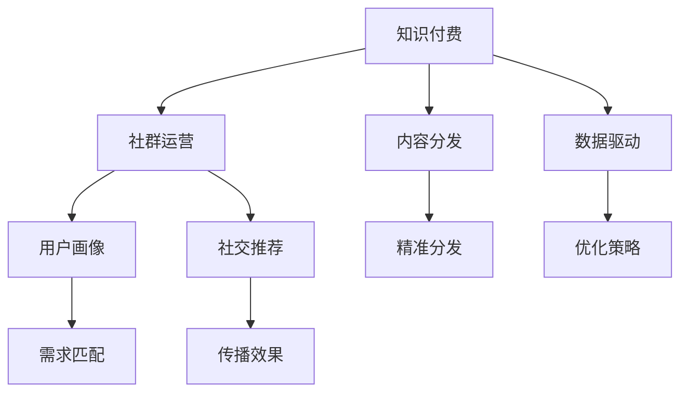

                 

# 知识付费：程序员的社群运营窍门

> 关键词：知识付费,程序员,社群运营,内容分发,数据驱动

## 1. 背景介绍

在互联网的浪潮中，知识付费已成为一种新兴的教育形式，而程序员作为知识生产和消费的重要群体，他们在社群运营中扮演着核心角色。如何有效地运营程序员社群，充分利用社区资源，推动知识的流动与付费转化，是本文探讨的主题。

### 1.1 知识付费的崛起

知识付费的兴起主要源于信息过载时代，高质量、有针对性的知识内容的稀缺。伴随着智能手机的普及和互联网的深度融合，知识的获取变得更加便捷，但用户也面临着海量信息的干扰，高质量的知识获取成本变高。知识付费的出现，为专业人士提供了一个能够高效生产与传播知识、获取合理回报的平台，同时也帮助消费者过滤无效信息，节省时间成本。

### 1.2 程序员社群的现状与挑战

程序员社群以技术交流为核心，聚集了大量的编程爱好者和专业人士。然而，尽管社群拥有巨大的潜力和活力，但目前仍存在一些问题：

- **内容泛泛而谈，缺乏深度**：许多程序员社群的内容多为初级技术讲解，深度和广度有限，难以满足技术高水平用户的需求。
- **用户互动不足，粘性低**：社群内的互动多为单向输出，缺乏有效的交流和反馈机制，导致用户流失率高。
- **商业模式单一，付费转化低**：知识付费收入主要来源于课程订阅、付费咨询等，模式较为单一，且难以转化为实际收益。
- **内容供给不足，质量不稳定**：优秀的技术内容产出者稀缺，内容质量不稳定，难以维持社群的活跃度。

## 2. 核心概念与联系

### 2.1 核心概念概述

为了深入理解程序员社群的运营窍门，需要掌握几个核心概念：

- **知识付费**：用户为获取高质量、有针对性的知识内容而支付费用的模式。
- **社群运营**：通过组织和管理社群，促进成员间的互动与协作，提高社群活跃度与粘性的过程。
- **内容分发**：将知识内容高效、精准地传播给目标用户的过程。
- **数据驱动**：利用数据分析和挖掘，优化社群运营策略，提升内容分发效果。
- **用户画像**：基于用户行为和属性的数据，构建用户群体特征模型，精准定位用户需求。
- **社交推荐**：利用社交关系网络，推荐与用户兴趣和需求匹配的内容和社群。

### 2.2 核心概念之间的联系

知识付费、社群运营、内容分发、数据驱动、用户画像和社交推荐这些概念之间存在密切的联系。通过构建用户画像，可以精准定位社群中的用户需求，从而指导内容分发策略。数据驱动则基于用户行为数据，优化内容分发的精准性和有效性。社交推荐则利用用户间的社交关系，提升内容传播和用户粘性。这些概念相互交织，共同构成程序员社群运营的核心框架。



## 3. 核心算法原理 & 具体操作步骤

### 3.1 算法原理概述

知识付费下的程序员社群运营，遵循以下核心算法原理：

1. **需求分析**：通过用户行为数据和社交网络分析，精准识别社群成员的需求和兴趣。
2. **内容推荐**：根据用户画像，推荐与用户需求相匹配的高质量内容。
3. **精准分发**：利用数据分析和算法模型，优化内容的传播路径，提高内容覆盖率和转化率。
4. **社群互动**：设计有效的互动机制，促进用户间的交流和协作，增强社群粘性。
5. **付费转化**：构建灵活的付费模型，引导用户付费获取深度知识内容。

### 3.2 算法步骤详解

1. **数据收集与处理**：
   - 收集社群内用户的互动数据（如评论、点赞、分享等）。
   - 通过API获取用户在外部平台（如GitHub、Stack Overflow）的行为数据。
   - 对数据进行清洗、去重和预处理，去除噪声，确保数据的准确性和完整性。

2. **用户画像构建**：
   - 使用机器学习算法（如K-means、LDA等）对用户行为数据进行分析，构建用户群体特征模型。
   - 根据不同群体的需求和兴趣，进行标签化（如初级开发者、高级开发者、架构师等）。
   - 利用社交网络分析技术，提取用户间的关联关系，构建社交网络图。

3. **内容推荐算法**：
   - 使用协同过滤算法（如基于用户的协同过滤、基于物品的协同过滤），推荐与用户画像相匹配的内容。
   - 引入深度学习模型（如CTR（点击率预测）模型），预测用户对内容的点击概率。
   - 通过A/B测试，不断优化推荐算法的效果，提升推荐准确性。

4. **内容精准分发**：
   - 使用优化算法（如梯度下降、随机梯度下降），调整内容传播路径，提高内容覆盖率和转化率。
   - 利用多臂老虎机算法，动态调整内容传播策略，提高传播效果。
   - 实施数据驱动的策略，如时间窗、地理位置等，优化内容分发的时机和地域。

5. **社群互动设计**：
   - 设计有效的互动机制，如话题讨论、代码评审、技术分享等。
   - 利用激励机制（如积分系统、勋章奖励），促进用户积极参与社群互动。
   - 定期举办线上和线下的技术交流活动，增强社群成员的凝聚力。

6. **付费转化策略**：
   - 提供多样化的付费模式，如课程订阅、咨询付费、会员制等。
   - 设置合理的付费门槛，引导用户逐步升级至更高层次的服务。
   - 实施个性化推荐策略，增加用户对付费内容的粘性。

### 3.3 算法优缺点

知识付费下的程序员社群运营算法，有以下优缺点：

**优点**：
- 精准定位用户需求，提高内容分发效果。
- 利用数据驱动优化运营策略，提升社群活跃度和转化率。
- 通过社交推荐，增强用户粘性，提升社群凝聚力。

**缺点**：
- 需要大量数据支持，数据收集和处理复杂。
- 算法模型的复杂性较高，需要较高的技术投入。
- 用户画像的准确性和内容推荐的准确性，受限于数据质量和算法效果。

### 3.4 算法应用领域

这些算法在程序员社群的运营中，可以应用于以下几个方面：

- **知识付费平台**：提供高质量的编程课程和咨询服务，并通过有效的推荐算法，提高用户付费转化率。
- **技术社区**：通过用户画像和内容推荐，丰富社区内容，提升用户活跃度和满意度。
- **开发者工具**：利用数据分析，优化代码编译、测试等工具的使用体验，提升开发效率。
- **招聘平台**：通过用户画像，精准匹配开发者和招聘方的需求，提升招聘效果。
- **在线学习平台**：利用社交推荐和互动机制，提升学习效果和用户粘性。

## 4. 数学模型和公式 & 详细讲解 & 举例说明

### 4.1 数学模型构建

知识付费下的程序员社群运营，涉及多个数学模型的构建。以下以协同过滤和深度学习模型为例，介绍其数学原理。

1. **协同过滤模型**：
   - 基于用户-物品评分矩阵$R$，构建用户兴趣表示$\hat{u}$和物品兴趣表示$\hat{v}$。
   - 使用余弦相似度计算用户之间的相似度$sim(u,v)$，并结合物品兴趣表示$\hat{v}$，预测用户对未评分物品的评分$pred(u,v)$。

   $$
   \hat{u} = R_{u1}^{-1/2} R_u
   $$

   $$
   \hat{v} = R_{1v}^{-1/2} R_v
   $$

   $$
   pred(u,v) = \frac{\hat{u}^T \hat{v}}{\|\hat{u}\| \|\hat{v}\|}
   $$

2. **深度学习模型**：
   - 使用多层感知器（MLP），将用户行为数据输入模型，预测用户对内容的点击概率。
   - 模型结构包括输入层、隐藏层和输出层，每层之间通过权重矩阵连接。
   - 通过反向传播算法，更新模型参数，最小化预测误差。

   $$
   y = f(W^1 x) = f(W^2 f(W^1 x))
   $$

   $$
   \text{Loss} = -\log \hat{y}
   $$

### 4.2 公式推导过程

1. **协同过滤模型推导**：
   - 构建用户兴趣表示$\hat{u}$和物品兴趣表示$\hat{v}$。
   - 利用余弦相似度计算用户相似度。
   - 使用加权矩阵求预测评分。

   具体推导过程，可以参考相关机器学习文献。

2. **深度学习模型推导**：
   - 定义多层感知器结构。
   - 将用户行为数据输入模型，经过隐藏层和输出层，得到预测结果。
   - 计算损失函数，并利用反向传播算法更新模型参数。

   具体推导过程，可以参考相关深度学习文献。

### 4.3 案例分析与讲解

1. **协同过滤案例**：
   - 假设社群中用户A和用户B分别对项目A和项目B进行了评分，分别为4和5。
   - 通过协同过滤模型，计算用户A和用户B的相似度为0.8。
   - 利用物品兴趣表示，预测用户A对项目B的评分约为4.8。

2. **深度学习案例**：
   - 使用Google Deep & Wide模型，训练预测点击率。
   - 输入包括用户行为数据、上下文特征等。
   - 输出为二分类概率，表示用户是否点击内容。
   - 通过A/B测试，优化模型参数和超参数。

## 5. 项目实践：代码实例和详细解释说明

### 5.1 开发环境搭建

1. **安装Python环境**：
   - 安装Anaconda或Miniconda，创建虚拟环境。
   - 安装Python相关依赖包，如pandas、numpy、scikit-learn等。

2. **配置数据源**：
   - 配置数据源连接，如MySQL、Hadoop等。
   - 导入数据集，并进行清洗、处理。

3. **搭建推荐系统框架**：
   - 搭建协同过滤推荐系统框架，如使用Python的scikit-learn库。
   - 使用TensorFlow等深度学习框架搭建深度学习推荐模型。

### 5.2 源代码详细实现

以下是协同过滤推荐系统的Python代码实现，利用scikit-learn库：

```python
import pandas as pd
from sklearn.metrics.pairwise import cosine_similarity
from sklearn.feature_extraction.text import CountVectorizer

# 读取数据
data = pd.read_csv('user_item_ratings.csv')

# 构建用户-物品评分矩阵
R = pd.pivot_table(data, index='user', columns='item', values='rating').fillna(0)

# 构建用户兴趣表示
u_vectorizer = CountVectorizer().fit_transform(data['user'])
u = u_vectorizer.toarray() * R.T.dot(u_vectorizer.toarray()) ** (-0.5)

# 构建物品兴趣表示
v_vectorizer = CountVectorizer().fit_transform(data['item'])
v = v_vectorizer.toarray() * R.dot(v_vectorizer.toarray()) ** (-0.5)

# 计算相似度
similarity_matrix = cosine_similarity(u, v)

# 预测评分
pred_scores = similarity_matrix.dot(v.T)

# 输出预测评分
print(pred_scores)
```

### 5.3 代码解读与分析

上述代码实现了协同过滤推荐系统的基本流程，通过用户行为数据构建用户和物品的兴趣表示，计算用户之间的相似度，并基于物品兴趣表示预测用户对未评分物品的评分。

关键代码如下：
- 数据读取和评分矩阵构建：通过`pandas`库读取数据，并构建用户-物品评分矩阵。
- 用户兴趣表示和物品兴趣表示：利用`CountVectorizer`构建用户和物品的词袋模型，计算兴趣表示。
- 相似度计算：使用`cosine_similarity`计算用户之间的相似度。
- 评分预测：通过相似度矩阵和物品兴趣表示，预测评分。

## 6. 实际应用场景

### 6.1 在线编程学习平台

在线编程学习平台可以通过知识付费和社群运营，为开发者提供高质量的编程课程和实战项目，促进编程技能的提升。例如，在平台内构建高质量的视频教程、在线编程挑战、技术社区等，通过数据驱动和社交推荐，提升用户粘性和付费转化。

### 6.2 开发者工具和框架

开发者工具和框架可以通过知识付费和社群运营，提升开发者开发效率和工具使用体验。例如，构建代码调试、版本管理、协作开发等工具，并通过数据分析和用户画像，推荐符合开发者需求的工具和框架，提升开发者工作效率。

### 6.3 招聘和人才市场

招聘和人才市场可以通过知识付费和社群运营，精准匹配开发者和招聘方的需求，提升招聘效果和人才质量。例如，通过社群内招聘信息发布和社交推荐，将招聘需求精准推送给目标开发者，并通过数据驱动和互动机制，提升招聘成功率。

## 7. 工具和资源推荐

### 7.1 学习资源推荐

1. **《知识付费的经济逻辑》**：探讨知识付费的经济学原理，理解知识付费的核心驱动力。
2. **《程序员社群运营指南》**：介绍程序员社群的运营策略和技巧，提升社群活跃度和粘性。
3. **《机器学习实战》**：通过实际案例，讲解机器学习算法的原理和应用，掌握数据驱动的思想。
4. **《数据驱动的推荐系统》**：介绍推荐系统的算法和实现，提升内容分发的精准性。
5. **《数据科学导论》**：系统介绍数据科学的基础知识和工具，提升数据处理和分析能力。

### 7.2 开发工具推荐

1. **Python**：Python是知识付费和社群运营的核心语言，拥有丰富的数据处理和推荐算法库。
2. **Anaconda**：Anaconda提供了Python环境管理和数据科学工具集，方便知识付费和社群运营的实现。
3. **TensorFlow**：TensorFlow是深度学习的主流框架，适合构建复杂推荐系统。
4. **Jupyter Notebook**：Jupyter Notebook提供了交互式数据处理和模型训练环境，方便实验和分析。
5. **GitHub**：GitHub是程序员协作和分享的平台，适合构建社区和发布项目。

### 7.3 相关论文推荐

1. **《知识付费模型与用户行为研究》**：探讨知识付费平台的运营策略和用户行为分析。
2. **《协同过滤推荐系统算法》**：介绍协同过滤算法的原理和应用，提升推荐系统的准确性。
3. **《深度学习推荐系统》**：介绍深度学习在推荐系统中的应用，提升内容的个性化推荐效果。
4. **《用户画像与社交推荐系统》**：探讨用户画像和社交推荐系统的构建方法，提升社群运营的精准性。
5. **《数据驱动的社群运营策略》**：探讨数据驱动的社群运营策略，提升社群的活跃度和粘性。

## 8. 总结：未来发展趋势与挑战

### 8.1 总结

本文系统介绍了知识付费下的程序员社群运营策略，从需求分析、内容推荐、精准分发、社群互动和付费转化等多个方面进行了详细探讨。通过理论结合实践，提供了知识付费和社群运营的全面指导。

通过本文的学习，可以深入理解知识付费和社群运营的核心算法和操作步骤，掌握数据驱动和用户画像的关键技术，提升社群运营的效果和效率。

### 8.2 未来发展趋势

未来知识付费和社群运营的发展趋势包括以下几个方面：

1. **智能化和自动化**：利用人工智能和大数据技术，实现智能化和自动化的知识付费和社群运营，提升效率和效果。
2. **个性化和定制化**：通过用户画像和推荐算法，提供个性化和定制化的内容和服务，提升用户体验。
3. **多渠道和多平台融合**：将知识付费和社群运营拓展到多个渠道和平台，实现全渠道覆盖。
4. **社交网络和社区互动**：通过社交网络和社区互动，增强用户粘性和社群凝聚力。
5. **实时化和动态化**：实现实时化和动态化的知识付费和社群运营，提升响应速度和灵活性。

### 8.3 面临的挑战

尽管知识付费和社群运营带来了诸多机遇，但也面临以下挑战：

1. **数据隐私和安全**：知识付费和社群运营需要大量的用户数据支持，数据隐私和安全问题需引起重视。
2. **技术复杂性**：知识付费和社群运营涉及复杂的技术实现，技术门槛较高，需持续投入和维护。
3. **用户需求多样性**：用户需求和兴趣千差万别，需要灵活的运营策略和内容推荐机制。
4. **内容质量控制**：内容质量的控制和提升，需持续投入人力和资源，保证高质量内容输出。
5. **市场竞争激烈**：知识付费和社群运营市场竞争激烈，需不断创新和优化，提升竞争力。

### 8.4 研究展望

面对知识付费和社群运营的挑战，未来的研究可以从以下几个方面进行探索：

1. **隐私保护技术**：研究隐私保护技术，确保用户数据的隐私和安全。
2. **自动化推荐系统**：构建自动化推荐系统，提高内容分发的效率和效果。
3. **社交网络分析**：研究社交网络分析方法，提升社群运营的精准性。
4. **实时化推荐系统**：构建实时化的推荐系统，提升内容分发的及时性和响应速度。
5. **跨平台协作**：研究跨平台协作方法，实现知识付费和社群运营的多渠道覆盖。

这些研究方向将推动知识付费和社群运营技术的进步，提升其应用效果，为程序员社群运营带来新的突破。

## 9. 附录：常见问题与解答

### Q1: 知识付费和社群运营的收益主要来源于哪些方面？

**A**: 知识付费和社群运营的收益主要来源于以下几个方面：
1. 课程订阅和咨询服务：通过高质量的课程和咨询服务，吸引用户付费。
2. 广告和推广：利用社群平台，推广第三方产品和服务。
3. 会员制和增值服务：提供会员制的增值服务，提升用户粘性。
4. 数据分析和咨询：利用社群平台的数据分析能力，提供咨询和解决方案。

### Q2: 如何在社群运营中提高用户粘性？

**A**: 提高用户粘性可以从以下几个方面入手：
1. 互动机制设计：设计有效的互动机制，如话题讨论、代码评审、技术分享等，促进用户积极参与。
2. 激励机制：利用激励机制（如积分系统、勋章奖励），促进用户积极参与社群互动。
3. 定期活动：定期举办线上和线下的技术交流活动，增强社群成员的凝聚力。
4. 社区氛围：构建友好、开放的社区氛围，让用户感受到归属感。
5. 用户反馈：及时收集用户反馈，改进社群运营策略，提升用户满意度。

### Q3: 如何构建高效的内容分发策略？

**A**: 构建高效的内容分发策略可以从以下几个方面入手：
1. 用户画像：通过用户行为数据和社交网络分析，精准识别社群成员的需求和兴趣。
2. 数据驱动：利用数据分析和挖掘，优化内容分发的精准性和有效性。
3. 社交推荐：利用社交关系网络，推荐与用户兴趣和需求匹配的内容。
4. 内容优化：优化内容质量和形式，提高用户对内容的满意度和粘性。
5. 实时调整：实时调整内容分发策略，根据用户反馈和行为数据，动态优化分发效果。

### Q4: 如何构建知识付费平台的用户画像？

**A**: 构建知识付费平台的用户画像可以从以下几个方面入手：
1. 行为数据收集：收集用户在平台内的行为数据，如课程浏览、课程购买、讨论互动等。
2. 社交网络分析：分析用户在社交平台上的活动和互动情况，构建社交网络图。
3. 标签化处理：对用户行为数据进行标签化处理，如初级开发者、高级开发者、架构师等。
4. 模型训练：使用机器学习算法（如K-means、LDA等）对用户行为数据进行分析，构建用户群体特征模型。
5. 定期更新：定期更新用户画像，根据新数据和新需求进行调整。

### Q5: 知识付费和社群运营的技术实现难点是什么？

**A**: 知识付费和社群运营的技术实现难点主要包括以下几个方面：
1. 数据隐私和安全：需要处理大量的用户数据，数据隐私和安全问题需引起重视。
2. 技术复杂性：知识付费和社群运营涉及复杂的技术实现，技术门槛较高，需持续投入和维护。
3. 用户需求多样性：用户需求和兴趣千差万别，需要灵活的运营策略和内容推荐机制。
4. 内容质量控制：内容质量的控制和提升，需持续投入人力和资源，保证高质量内容输出。
5. 市场竞争激烈：知识付费和社群运营市场竞争激烈，需不断创新和优化，提升竞争力。

**作者：禅与计算机程序设计艺术 / Zen and the Art of Computer Programming**

