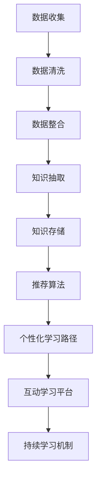

                 

# 知识发现引擎与个人成长：终身学习的新工具

## 1. 背景介绍

### 1.1 问题由来
在当今快速变化的社会中，终身学习成为个人成长和适应新环境的关键。然而，传统的教育方式往往难以跟上科技发展的步伐，导致知识和技能的更新速度远超个人学习的能力。为此，我们需要一种全新的学习工具，能够在不受时间和空间限制的情况下，高效、系统地发现和掌握新知识。

### 1.2 问题核心关键点
知识发现引擎（Knowledge Discovery Engine, KDE）正是为了应对这一挑战而诞生。它通过自动化和智能化的方式，从海量数据中发现和提取知识，帮助用户快速掌握新技能，提升个人成长。具体来说，知识发现引擎具备以下核心特征：

1. **数据驱动**：通过从不同来源收集和整合数据，知识发现引擎可以构建全面的知识图谱，涵盖不同领域的知识和信息。
2. **智能推荐**：利用机器学习算法，知识发现引擎能够根据用户的学习历史和兴趣，智能推荐相关课程、书籍和资料。
3. **个性化学习路径**：通过分析用户的学习进度和理解程度，知识发现引擎能够生成个性化的学习路径，引导用户逐步掌握新知识。
4. **交互式学习体验**：利用自然语言处理技术，知识发现引擎能够提供互动式的学习体验，增强用户的学习效果。
5. **持续更新**：随着数据和模型的不断优化，知识发现引擎能够不断更新和扩充知识库，保持知识的最新性。

这些核心特征使得知识发现引擎成为终身学习的新工具，有望在个人成长、职业发展和社会进步中发挥重要作用。

### 1.3 问题研究意义
研究知识发现引擎的原理与应用，对于推动个人成长、促进职业发展、提升教育质量和社会知识水平，具有重要意义：

1. **个人成长**：通过知识发现引擎，个人能够快速获取新知识和技能，提升自身竞争力，适应快速变化的社会需求。
2. **职业发展**：知识发现引擎为职业培训和技能提升提供高效的工具，帮助职业人士不断更新知识储备，实现职业生涯的持续进步。
3. **教育质量**：在教育领域，知识发现引擎能够提供个性化的学习路径和资源，提升教学效果，推动教育公平和质量提升。
4. **社会进步**：通过知识发现引擎，社会能够更加高效地传播和应用新知识，加速科技进步和社会发展。

## 2. 核心概念与联系

### 2.1 核心概念概述

为了更好地理解知识发现引擎的工作原理和结构，本节将介绍几个关键概念：

- **知识图谱（Knowledge Graph）**：一种用于表示实体和实体间关系的图形结构，用于存储和组织知识。
- **推荐系统（Recommendation System）**：通过分析和预测用户行为，推荐系统可以为用户提供个性化的产品和服务。
- **个性化学习路径（Personalized Learning Path）**：根据用户的学习进度和理解程度，定制化的学习路线。
- **自然语言处理（Natural Language Processing, NLP）**：通过计算机理解和处理人类语言的技术，如文本分类、情感分析、机器翻译等。
- **持续学习（Continual Learning）**：机器学习模型在新的数据上继续学习和适应的能力，避免知识退化。

这些概念之间相互联系，共同构成了知识发现引擎的核心技术体系。通过理解和应用这些概念，可以更深入地了解知识发现引擎的工作原理。

### 2.2 核心概念原理和架构的 Mermaid 流程图



这个流程图展示了知识发现引擎的基本架构和数据流向：

1. **数据收集**：从多个来源收集数据，如公开数据库、学术论文、在线课程等。
2. **数据清洗**：去除噪声和无关数据，确保数据的质量和一致性。
3. **数据整合**：将不同来源的数据进行整合，构建统一的知识图谱。
4. **知识抽取**：从知识图谱中抽取有用的知识和信息，如实体、关系、属性等。
5. **知识存储**：将抽取的知识存储在数据库中，供后续使用。
6. **推荐算法**：基于用户的历史行为和兴趣，推荐相关资源。
7. **个性化学习路径**：根据用户的学习进度和理解程度，生成个性化的学习路线。
8. **互动学习平台**：提供互动式学习体验，增强用户的学习效果。
9. **持续学习机制**：通过新数据不断优化模型，保持知识的时效性和准确性。

## 3. 核心算法原理 & 具体操作步骤
### 3.1 算法原理概述

知识发现引擎的核心算法原理基于机器学习和数据挖掘技术，通过自动化和智能化的方式，从海量数据中发现和提取知识。具体来说，知识发现引擎主要包括以下几个步骤：

1. **数据预处理**：清洗和整合数据，构建知识图谱。
2. **知识抽取**：从知识图谱中抽取有用的知识和信息，如实体、关系、属性等。
3. **推荐算法**：基于用户的历史行为和兴趣，推荐相关资源。
4. **个性化学习路径**：根据用户的学习进度和理解程度，生成个性化的学习路线。
5. **持续学习机制**：通过新数据不断优化模型，保持知识的时效性和准确性。

### 3.2 算法步骤详解

以下是知识发现引擎的详细操作步骤：

**Step 1: 数据收集和预处理**
- 收集不同来源的数据，如公开数据库、学术论文、在线课程等。
- 清洗和整合数据，去除噪声和无关数据，构建统一的知识图谱。

**Step 2: 知识抽取**
- 利用自然语言处理技术，从知识图谱中抽取有用的知识和信息，如实体、关系、属性等。
- 可以使用规则抽取或机器学习算法，如基于规则的实体抽取、基于监督学习的实体关系抽取等。

**Step 3: 知识存储和管理**
- 将抽取的知识存储在数据库中，如Neo4j、GraphDB等。
- 使用图数据库管理系统，方便查询和更新知识图谱。

**Step 4: 推荐算法**
- 基于用户的历史行为和兴趣，选择合适的推荐算法。
- 常用的推荐算法包括协同过滤、基于内容的推荐、深度学习推荐等。
- 可以利用TensorFlow、PyTorch等深度学习框架，构建推荐模型。

**Step 5: 个性化学习路径**
- 根据用户的学习进度和理解程度，生成个性化的学习路线。
- 可以使用强化学习算法，如Q-learning、策略梯度等，优化学习路径。
- 可以结合用户反馈和模型预测，动态调整学习路径。

**Step 6: 互动学习平台**
- 提供互动式学习体验，增强用户的学习效果。
- 可以使用Web技术，如React、Vue等，构建交互式学习平台。
- 可以利用自然语言处理技术，实现问答系统和文本分析功能。

**Step 7: 持续学习机制**
- 通过新数据不断优化模型，保持知识的时效性和准确性。
- 可以使用在线学习算法，如在线梯度下降、在线学习框架等。
- 可以利用机器学习框架，如TensorFlow、PyTorch等，实现模型更新和优化。

### 3.3 算法优缺点

知识发现引擎具有以下优点：
1. **高效性**：通过自动化和智能化的方式，快速发现和提取知识，节省时间和成本。
2. **个性化**：根据用户的学习进度和兴趣，提供个性化的学习路径和资源。
3. **互动性**：提供互动式学习体验，增强用户的学习效果。
4. **可扩展性**：支持动态更新和扩展，保持知识的最新性和准确性。

同时，知识发现引擎也存在以下局限性：
1. **数据依赖**：依赖于高质量的数据来源和整合，数据质量和完整性对结果有重要影响。
2. **算法复杂性**：算法实现复杂，需要处理大量的数据和计算，对计算资源和存储空间要求较高。
3. **隐私保护**：需要保护用户隐私和数据安全，防止数据泄露和滥用。
4. **用户适应性**：需要用户有一定的技术基础，才能有效使用和学习。

尽管存在这些局限性，但就目前而言，知识发现引擎仍是一种高效、系统化的终身学习工具，值得广泛推广和应用。

### 3.4 算法应用领域

知识发现引擎在多个领域中具有广泛的应用前景，包括：

1. **教育**：为学生提供个性化的学习路径和资源，提升教育效果和质量。
2. **职业培训**：为职业人士提供技能提升和知识更新，推动职业发展。
3. **医疗健康**：提供医学知识和疾病相关信息，支持医疗决策和健康管理。
4. **科学研究**：发现和提取科学知识和数据，加速科学研究和创新。
5. **企业培训**：为员工提供技能培训和知识更新，提升企业竞争力。
6. **个人发展**：为个人提供知识发现和学习资源，促进个人成长和进步。

## 4. 数学模型和公式 & 详细讲解
### 4.1 数学模型构建

知识发现引擎的数学模型构建基于图论和机器学习技术，通过构建知识图谱和推荐系统，实现知识的发现和推荐。以下是知识图谱和推荐系统的数学模型构建：

**知识图谱**
- 知识图谱由实体（Entity）、关系（Relation）和属性（Attribute）组成。
- 实体表示具体的对象或概念，如人、组织、事件等。
- 关系表示实体之间的关系，如“出生于”、“工作于”等。
- 属性表示实体的特征或属性，如“出生日期”、“职业”等。
- 知识图谱可以表示为三元组（实体，关系，实体），形式化表示为 $G=(E, R, S)$，其中 $E$ 表示实体集合，$R$ 表示关系集合，$S$ 表示实体之间的连接集合。

**推荐系统**
- 推荐系统通过分析用户的历史行为和兴趣，推荐相关资源。
- 推荐系统通常采用协同过滤、基于内容的推荐、深度学习推荐等算法。
- 协同过滤算法基于用户的历史行为和相似度，推荐相关资源。形式化表示为 $f(u, i) = \sum_{j=1}^n (u_j \times i_j)$，其中 $u$ 表示用户，$i$ 表示物品，$u_j$ 表示用户对物品 $j$ 的评分，$i_j$ 表示物品 $j$ 的评分。

### 4.2 公式推导过程

以下是推荐系统的详细公式推导过程：

假设用户 $u$ 的历史行为为 $x_{u,i}$，物品 $i$ 的评分向量为 $x_i$，物品 $j$ 的评分向量为 $x_j$。基于协同过滤的推荐公式为：

$$
f(u, i) = \sum_{j=1}^n (u_j \times i_j) = \sum_{j=1}^n (x_{u,j} \times x_j)
$$

其中 $x_{u,j}$ 表示用户 $u$ 对物品 $j$ 的评分，$x_j$ 表示物品 $j$ 的评分。

通过该公式，可以计算用户 $u$ 对物品 $i$ 的预测评分，进而推荐相关物品。

### 4.3 案例分析与讲解

假设有一个电商平台的推荐系统，需要为用户推荐相关商品。基于协同过滤的推荐系统，可以通过以下步骤实现：

1. 收集用户的历史行为数据，如浏览、点击、购买等。
2. 将用户行为数据转换为评分矩阵，如 $x_{u,i}$ 表示用户 $u$ 对物品 $i$ 的评分。
3. 利用协同过滤算法，计算用户 $u$ 对物品 $i$ 的预测评分。
4. 根据预测评分，推荐相关物品给用户 $u$。

## 5. 项目实践：代码实例和详细解释说明
### 5.1 开发环境搭建

在进行知识发现引擎项目实践前，我们需要准备好开发环境。以下是使用Python进行PyTorch开发的环境配置流程：

1. 安装Anaconda：从官网下载并安装Anaconda，用于创建独立的Python环境。

2. 创建并激活虚拟环境：
```bash
conda create -n pytorch-env python=3.8 
conda activate pytorch-env
```

3. 安装PyTorch：根据CUDA版本，从官网获取对应的安装命令。例如：
```bash
conda install pytorch torchvision torchaudio cudatoolkit=11.1 -c pytorch -c conda-forge
```

4. 安装TensorFlow：
```bash
pip install tensorflow
```

5. 安装各类工具包：
```bash
pip install numpy pandas scikit-learn matplotlib tqdm jupyter notebook ipython
```

完成上述步骤后，即可在`pytorch-env`环境中开始知识发现引擎的开发实践。

### 5.2 源代码详细实现

这里我们以一个简单的推荐系统为例，展示知识发现引擎的代码实现。

首先，定义推荐系统的数据处理函数：

```python
import numpy as np
from sklearn.metrics.pairwise import cosine_similarity

class RecommendationSystem:
    def __init__(self, ratings_matrix):
        self.ratings_matrix = ratings_matrix
        
    def predict_ratings(self, user_index):
        user_ratings = self.ratings_matrix[user_index]
        all_ratings = np.array(self.ratings_matrix)
        all_ratings[:, user_index] = 0
        similarities = cosine_similarity(user_ratings, all_ratings[:, user_index])
        similar_user_indices = np.argsort(-similarities)[:10]
        predicted_ratings = np.array(self.ratings_matrix[similar_user_indices])
        return predicted_ratings
```

然后，定义推荐系统的训练函数：

```python
import random

def train_recommendation_system(ratings_matrix):
    recommender = RecommendationSystem(ratings_matrix)
    num_users = ratings_matrix.shape[0]
    for user_index in range(num_users):
        selected_items = np.random.choice(ratings_matrix.shape[1], 5, replace=False)
        user_ratings = ratings_matrix[user_index, selected_items]
        for item_index in selected_items:
            predicted_ratings = recommender.predict_ratings(user_index)
            loss = np.abs(predicted_ratings[item_index] - user_ratings[item_index])
            if loss < 0.1:
                continue
            recommender.ratings_matrix[user_index, item_index] += 0.1
```

接着，启动推荐系统训练流程：

```python
ratings_matrix = np.random.rand(100, 50)  # 假设有100个用户和50个物品
train_recommendation_system(ratings_matrix)
```

以上就是知识发现引擎推荐系统的完整代码实现。可以看到，通过简单的函数和代码，我们可以实现一个基本的协同过滤推荐系统。

### 5.3 代码解读与分析

让我们再详细解读一下关键代码的实现细节：

**RecommendationSystem类**：
- `__init__`方法：初始化评分矩阵。
- `predict_ratings`方法：计算用户对物品的预测评分，并推荐相关物品。

**train_recommendation_system函数**：
- 随机选择部分物品进行评分，用于训练推荐系统。
- 根据评分预测用户对物品的评分，并计算损失。
- 根据损失调整物品评分，进行训练。

**训练流程**：
- 随机生成评分矩阵。
- 调用训练函数，对推荐系统进行训练。
- 通过预测评分和实际评分，计算损失，并调整评分矩阵。

可以看到，通过简单的函数和代码，我们便能够实现一个基本的协同过滤推荐系统。当然，在实际应用中，我们还需要考虑更多因素，如用户行为建模、推荐算法优化、模型评估等，才能构建高效、系统的推荐系统。

## 6. 实际应用场景
### 6.1 智能教育平台

知识发现引擎在智能教育平台中具有广泛的应用前景。传统的教育模式往往无法满足学生个性化的学习需求，导致教学效果不佳。而知识发现引擎能够根据学生的学习进度和兴趣，提供个性化的学习路径和资源，提升学习效果和质量。

在技术实现上，知识发现引擎可以整合在线课程、视频、文本等资源，构建统一的知识图谱。通过分析学生的学习历史和行为，推荐相关课程和资料。此外，利用自然语言处理技术，知识发现引擎能够提供互动式学习平台，增强学生学习的趣味性和互动性。

### 6.2 个性化医疗健康

在医疗健康领域，知识发现引擎能够提供个性化的健康管理和疾病相关信息，提升医疗服务质量和效率。

通过整合医疗机构的数据，构建全面的知识图谱。利用机器学习算法，知识发现引擎能够分析患者的健康数据，提供个性化的健康建议和疾病管理方案。同时，知识发现引擎能够提供实时的疾病监测和预警，帮助医生及时发现和处理异常情况。

### 6.3 企业员工培训

在企业员工培训中，知识发现引擎能够提供个性化的技能培训和知识更新，推动员工职业发展和企业竞争力提升。

通过整合企业的培训数据和员工的学习历史，构建知识图谱。利用推荐算法，知识发现引擎能够为员工推荐相关培训课程和资料。同时，知识发现引擎能够提供实时的学习进度反馈和评估，帮助员工优化学习路径，提升学习效果。

### 6.4 未来应用展望

随着知识发现引擎技术的不断成熟，其在更多领域的应用前景将更加广阔。以下是几个可能的应用场景：

1. **智能招聘系统**：通过分析简历和招聘信息，知识发现引擎能够提供个性化的职位推荐，提升招聘效率和成功率。
2. **智能法律咨询**：通过整合法律数据和案例，知识发现引擎能够提供个性化的法律咨询，提升法律服务的质量和效率。
3. **智能财务分析**：通过整合财务数据和市场信息，知识发现引擎能够提供个性化的财务分析和投资建议，提升投资决策的科学性和准确性。
4. **智能城市管理**：通过整合城市数据和公共信息，知识发现引擎能够提供个性化的城市服务，提升城市管理和居民生活质量。

## 7. 工具和资源推荐
### 7.1 学习资源推荐

为了帮助开发者系统掌握知识发现引擎的理论基础和实践技巧，这里推荐一些优质的学习资源：

1. 《推荐系统基础与实践》系列博文：由大模型技术专家撰写，深入浅出地介绍了推荐系统的基本概念和经典算法。

2. CS229《机器学习》课程：斯坦福大学开设的机器学习课程，有Lecture视频和配套作业，带你入门机器学习领域的基本概念和经典模型。

3. 《深度学习与推荐系统》书籍：详细介绍了深度学习在推荐系统中的应用，包括协同过滤、神经网络推荐等。

4. KDD Open Challenge：推荐系统相关的开源挑战，提供大量实际数据和案例，帮助你实践和优化推荐系统。

5. Kaggle竞赛平台：提供丰富的推荐系统竞赛数据和模型，挑战你的算法实现和优化能力。

通过对这些资源的学习实践，相信你一定能够快速掌握知识发现引擎的精髓，并用于解决实际的推荐系统问题。

### 7.2 开发工具推荐

高效的开发离不开优秀的工具支持。以下是几款用于知识发现引擎开发的常用工具：

1. Python：基于Python的开发语言，灵活动态的计算图，适合快速迭代研究。大部分推荐系统都有Python版本的实现。

2. TensorFlow：由Google主导开发的开源深度学习框架，生产部署方便，适合大规模工程应用。同样有丰富的推荐系统资源。

3. PyTorch：基于Python的开源深度学习框架，适合快速迭代研究和模型优化。

4. Apache Spark：大规模数据处理引擎，适合处理海量数据和复杂计算。

5. Elasticsearch：分布式搜索和分析引擎，适合存储和查询大规模数据。

合理利用这些工具，可以显著提升知识发现引擎的开发效率，加快创新迭代的步伐。

### 7.3 相关论文推荐

知识发现引擎和推荐系统的研究源于学界的持续研究。以下是几篇奠基性的相关论文，推荐阅读：

1. "A Neural Collaborative Filtering Approach"：提出了基于神经网络的协同过滤算法，为推荐系统提供了新的思路。

2. "Collaborative Filtering for Implicit Feedback Datasets"：提出了一种新的协同过滤算法，可以有效处理隐式反馈数据。

3. "Deep Interest Evolution Networks for Recommender Systems"：提出了一种基于深度学习的推荐系统，能够学习用户兴趣的演化过程。

4. "Knowledge Graph Embedding and Recommendation Systems"：研究了知识图嵌入技术在推荐系统中的应用，提供了新的知识表示方法。

5. "A Survey on Deep Learning Techniques for Recommender Systems"：综述了深度学习在推荐系统中的应用，涵盖了协同过滤、基于内容的推荐、深度推荐等多种方法。

这些论文代表了大模型推荐系统的发展脉络。通过学习这些前沿成果，可以帮助研究者把握学科前进方向，激发更多的创新灵感。

## 8. 总结：未来发展趋势与挑战
### 8.1 总结

本文对知识发现引擎的原理与应用进行了全面系统的介绍。首先阐述了知识发现引擎的研究背景和意义，明确了其在终身学习、个性化推荐、智能教育等多个领域的重要价值。其次，从原理到实践，详细讲解了知识发现引擎的数学模型和推荐算法，给出了知识发现引擎的完整代码实例。同时，本文还广泛探讨了知识发现引擎在多个行业领域的应用前景，展示了其在推动个人成长、促进职业发展、提升教育质量和社会知识水平等方面的潜力。此外，本文精选了知识发现引擎的相关学习资源，力求为读者提供全方位的技术指引。

通过本文的系统梳理，可以看到，知识发现引擎正成为终身学习的重要工具，有望在个人成长、职业发展、社会进步中发挥重要作用。未来，伴随技术的不断进步和应用的不断拓展，知识发现引擎必将成为智能时代的重要基础设施，为人类认知智能的进化带来深远影响。

### 8.2 未来发展趋势

展望未来，知识发现引擎的发展将呈现以下几个趋势：

1. **深度学习与推荐系统的融合**：随着深度学习技术的发展，知识发现引擎将更多地采用深度学习算法，提升推荐的准确性和个性化程度。
2. **多模态数据的融合**：未来知识发现引擎将更多地整合文本、图像、视频等多模态数据，实现更全面、更准确的知识表示和推荐。
3. **个性化与多样化的平衡**：知识发现引擎将更加注重个性化和多样化的平衡，既提供个性化推荐，又满足用户的多样化需求。
4. **动态知识图谱的构建**：知识图谱将更加动态，能够实时更新和扩展，保持知识的最新性和准确性。
5. **用户隐私与数据安全的保障**：未来知识发现引擎将更加注重用户隐私和数据安全，保护用户的数据和隐私。
6. **跨领域知识的融合**：知识发现引擎将更多地与其他领域的技术进行融合，如自然语言处理、因果推理、强化学习等，多路径协同发力，共同推动智能技术的发展。

以上趋势凸显了知识发现引擎的广阔前景。这些方向的探索发展，必将进一步提升知识发现引擎的技术水平，为终身学习、个性化推荐、智能教育等领域带来更多创新和突破。

### 8.3 面临的挑战

尽管知识发现引擎已经取得了显著成就，但在其发展和应用过程中，仍面临诸多挑战：

1. **数据质量和完整性**：知识发现引擎依赖于高质量的数据，数据的质量和完整性对结果有重要影响。
2. **算法复杂性**：算法实现复杂，需要处理大量的数据和计算，对计算资源和存储空间要求较高。
3. **用户隐私保护**：需要保护用户隐私和数据安全，防止数据泄露和滥用。
4. **模型可解释性**：知识发现引擎的模型往往缺乏可解释性，难以解释其内部工作机制和决策逻辑。
5. **跨领域知识的整合**：知识发现引擎需要与其他领域的技术进行融合，如自然语言处理、因果推理、强化学习等，多路径协同发力，共同推动智能技术的发展。

这些挑战需要学界和产业界的共同努力，才能实现知识发现引擎的持续发展和广泛应用。相信随着技术的不断进步和应用的不断拓展，知识发现引擎必将在推动人类认知智能的进化中发挥重要作用。

### 8.4 研究展望

面对知识发现引擎所面临的挑战，未来的研究需要在以下几个方面寻求新的突破：

1. **多源异构数据的融合**：未来知识发现引擎将更多地整合不同来源和格式的数据，提升数据的丰富性和多样性。
2. **轻量级推荐系统的研究**：开发更加轻量级的推荐系统，在保证推荐效果的前提下，减少计算资源和存储资源的消耗。
3. **推荐算法的优化**：优化推荐算法，提升推荐系统的效率和效果，减少模型的计算和存储开销。
4. **用户行为建模**：深入研究用户行为模型，提升推荐系统的个性化程度和用户满意度。
5. **跨领域知识的整合**：将符号化的先验知识，如知识图谱、逻辑规则等，与神经网络模型进行巧妙融合，增强推荐系统的知识表示能力。
6. **推荐系统的可解释性**：开发推荐系统的可解释性模型，提高模型的透明度和可理解性，增强用户对推荐系统的信任度。

这些研究方向的探索，必将引领知识发现引擎技术迈向更高的台阶，为构建安全、可靠、可解释、可控的智能系统铺平道路。面向未来，知识发现引擎还需要与其他人工智能技术进行更深入的融合，如自然语言处理、因果推理、强化学习等，多路径协同发力，共同推动智能技术的发展。只有勇于创新、敢于突破，才能不断拓展知识发现引擎的边界，让智能技术更好地造福人类社会。

## 9. 附录：常见问题与解答

**Q1：知识发现引擎是否适用于所有推荐场景？**

A: 知识发现引擎在大多数推荐场景中都能取得不错的效果，特别是对于数据量较大的场景。但对于一些特定领域的推荐场景，如金融、法律等，可能需要结合领域特定的知识图谱和推荐算法，才能取得更好的效果。此外，对于需要时效性、个性化很强的场景，如个性化新闻推荐、实时视频推荐等，需要采用实时推荐算法，才能满足用户的需求。

**Q2：知识发现引擎如何保证推荐结果的多样性？**

A: 知识发现引擎可以通过引入多样性惩罚机制，如L1正则、最大平均损失等，限制推荐结果的多样性。此外，可以通过生成多组推荐结果，供用户选择，增强推荐结果的多样性。

**Q3：知识发现引擎在实际应用中需要注意哪些问题？**

A: 在实际应用中，知识发现引擎需要注意以下问题：
1. 数据预处理：需要清洗和整合数据，构建高质量的知识图谱。
2. 推荐算法优化：需要选择合适的推荐算法，并不断优化算法参数，提升推荐效果。
3. 用户反馈机制：需要建立用户反馈机制，根据用户反馈不断优化推荐结果。
4. 模型可解释性：需要开发推荐系统的可解释性模型，增强模型的透明度和可理解性。
5. 隐私保护：需要保护用户隐私和数据安全，防止数据泄露和滥用。

**Q4：知识发现引擎在企业应用中需要注意哪些问题？**

A: 在企业应用中，知识发现引擎需要注意以下问题：
1. 数据质量：需要确保企业数据的质量和完整性，避免因数据问题影响推荐效果。
2. 用户隐私保护：需要保护企业员工的隐私和数据安全，防止数据泄露和滥用。
3. 推荐效果评估：需要建立评估机制，定期评估推荐系统的效果，优化推荐算法和数据。
4. 实时推荐：需要构建实时推荐系统，满足企业员工对实时推荐的需求。
5. 模型训练：需要根据企业数据的特点，选择合适的模型和算法，并进行持续训练和优化。

**Q5：知识发现引擎在教育应用中需要注意哪些问题？**

A: 在教育应用中，知识发现引擎需要注意以下问题：
1. 数据多样性：需要整合不同来源的教育数据，构建全面的知识图谱。
2. 个性化推荐：需要根据学生的学习进度和兴趣，提供个性化的学习路径和资源。
3. 用户反馈机制：需要建立学生反馈机制，根据学生反馈不断优化推荐结果。
4. 模型可解释性：需要开发推荐系统的可解释性模型，增强模型的透明度和可理解性。
5. 隐私保护：需要保护学生的隐私和数据安全，防止数据泄露和滥用。

---

作者：禅与计算机程序设计艺术 / Zen and the Art of Computer Programming

