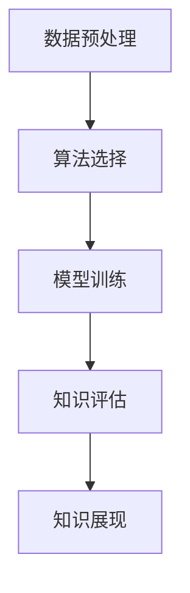

                 

# 知识发现引擎与人类认知能力的增强

## 1. 背景介绍

### 1.1 问题由来

随着大数据时代的到来，数据量爆炸式增长，人工智能(AI)技术在这片沃土上得以蓬勃发展。机器学习、深度学习等方法逐渐崭露头角，助力企业在数据驱动的商业决策中脱颖而出。然而，如此海量的数据，仅靠传统的数据分析手段已难以胜任。

如何从纷繁复杂的数据中提取有价值的信息，挖掘隐藏的关联，已成为当下信息技术领域亟待解决的重要课题。这便是知识发现(Knowledge Discovery, KD)的核心价值所在。

### 1.2 问题核心关键点

知识发现的关键在于利用智能算法自动化地从海量数据中识别出潜在的模式、关联和规律，并通过可视化和报告的形式，将深度洞察呈现给用户。知识发现的应用领域广泛，涵盖了金融、医疗、社交网络、客户关系管理等领域，帮助企业从数据中发掘出增长点，降低运营成本，提升决策效率。

### 1.3 问题研究意义

1. **提升数据利用效率**：通过知识发现，企业能够更加高效地利用海量数据，避免数据浪费，最大化数据价值。
2. **改善决策质量**：基于数据驱动的洞察，可以优化业务流程，提升决策的科学性和准确性。
3. **增强商业竞争力**：通过深入挖掘数据潜能，企业能够在竞争激烈的市场中保持领先优势。
4. **促进数据治理**：知识发现技术能够帮助企业构建完善的数据治理机制，确保数据质量和数据安全。

## 2. 核心概念与联系

### 2.1 核心概念概述

知识发现引擎(Knowledge Discovery Engine, KDE)是一种智能的数据挖掘工具，能够自动化地从大规模数据集中发现和提取有价值的知识。其主要涉及的概念包括：

- **数据预处理**：包括数据清洗、归一化、降维等，确保数据的质量和适用性。
- **算法选择**：包括分类、聚类、关联规则学习等，选择合适的算法进行模型训练。
- **模型训练**：利用训练数据集，构建和优化数据挖掘模型。
- **知识评估**：评估模型效果，验证知识的准确性和实用性。
- **知识展现**：将挖掘出的知识以图表、报告等形式展现给用户，供决策参考。

知识发现引擎的目标是从数据中提炼出对用户有价值的信息，通过自动化算法实现知识挖掘，支持企业洞察和决策。

### 2.2 核心概念原理和架构的 Mermaid 流程图(Mermaid 流程节点中不要有括号、逗号等特殊字符)



此流程图展示了知识发现引擎的核心处理流程：

1. 数据预处理：对原始数据进行清洗、转换等操作，为后续分析奠定基础。
2. 算法选择：根据问题类型和数据特点，选择合适的算法。
3. 模型训练：构建并训练数据挖掘模型。
4. 知识评估：评估模型性能，验证知识有效性。
5. 知识展现：将知识以易于理解的形式展现给用户。

## 3. 核心算法原理 & 具体操作步骤

### 3.1 算法原理概述

知识发现引擎的核心算法主要基于数据挖掘技术，包括分类、聚类、关联规则学习等。其原理可以简单概括为：

1. **分类**：通过训练分类模型，将数据集分为不同类别，实现对数据的分类和预测。
2. **聚类**：将相似的数据点归为一类，发现数据集中的自然分组。
3. **关联规则学习**：从交易数据中发现频繁出现的商品组合，即关联规则，用于市场篮分析。

这些算法通过优化目标函数，迭代训练模型，最终获得对数据集的高层次理解。

### 3.2 算法步骤详解

以分类算法为例，其步骤包括：

1. **数据准备**：收集和预处理数据集，去除噪音和缺失值，确保数据质量和适用性。
2. **特征选择**：从原始数据中选择最具代表性和区分度的特征，减少冗余信息。
3. **模型构建**：选择分类算法（如决策树、支持向量机等），并构建相应的模型。
4. **模型训练**：使用训练数据集训练模型，优化模型参数。
5. **模型评估**：利用测试数据集评估模型性能，选择合适的评价指标（如准确率、召回率等）。
6. **模型应用**：将训练好的模型应用到新的数据集，进行分类或预测。

### 3.3 算法优缺点

知识发现引擎的优点在于其能够自动化地进行数据分析和知识挖掘，提高数据分析效率和准确性。然而，也存在一些局限性：

- **算法复杂性**：某些高级算法（如深度学习）对数据量、计算资源有较高要求。
- **过拟合风险**：模型在训练数据上表现良好，但在实际应用中可能泛化能力不足。
- **解释性不足**：部分算法（如深度学习）缺乏可解释性，难以理解模型内部的决策过程。
- **数据依赖**：算法效果依赖于数据的质量和数量，数据噪声可能会影响结果。

### 3.4 算法应用领域

知识发现引擎已经在多个领域中得到广泛应用，例如：

- **金融风险管理**：通过分析历史交易数据，挖掘潜在风险因素，预测和防范金融风险。
- **市场篮分析**：从销售数据中发现频繁出现的商品组合，优化商品推荐和库存管理。
- **客户行为分析**：分析客户购买行为，构建客户画像，优化客户关系管理。
- **社交网络分析**：通过分析社交媒体数据，发现用户之间的关系和行为模式，优化社交网络互动。
- **医疗诊断**：利用医疗数据，挖掘疾病特征和关联，辅助医生诊断和治疗决策。

## 4. 数学模型和公式 & 详细讲解 & 举例说明

### 4.1 数学模型构建

以分类算法为例，假设训练数据集为 $D=\{(x_i,y_i)\}_{i=1}^N$，其中 $x_i$ 为输入特征，$y_i$ 为标签。

定义分类器为 $f(x;\theta)$，其中 $\theta$ 为模型参数。假设损失函数为交叉熵损失函数：

$$
L(y,f(x;\theta)) = -\sum_{i=1}^N y_i\log f(x_i;\theta)
$$

模型的目标是最小化经验风险：

$$
\min_{\theta} \frac{1}{N}\sum_{i=1}^N L(y_i,f(x_i;\theta))
$$

### 4.2 公式推导过程

使用梯度下降优化算法，求解最小化经验风险：

$$
\theta \leftarrow \theta - \alpha \nabla_{\theta}L(y,f(x;\theta))
$$

其中 $\alpha$ 为学习率。

### 4.3 案例分析与讲解

以决策树为例，假设训练数据集为 $D=\{(x_i,y_i)\}_{i=1}^N$，其中 $x_i$ 为输入特征，$y_i$ 为标签。

决策树算法通过递归划分数据集，找到最优的特征和阈值，构建决策树。决策树的构建过程包括：

1. 选择最优特征：计算信息增益或信息增益比，选择信息增益最大的特征。
2. 划分数据集：根据选择的特征和阈值，将数据集分为子集。
3. 递归构建子树：对子集递归执行步骤1和2，构建完整的决策树。

## 5. 项目实践：代码实例和详细解释说明

### 5.1 开发环境搭建

知识发现引擎的开发环境主要包括Python、R、Java等编程语言，以及相关的数据挖掘工具（如Weka、TensorFlow等）。

以下以Python为例，搭建开发环境：

1. 安装Anaconda：从官网下载并安装Anaconda，用于创建独立的Python环境。

2. 创建并激活虚拟环境：
```bash
conda create -n kde-env python=3.8 
conda activate kde-env
```

3. 安装PyTorch、Scikit-Learn、NumPy等数据挖掘和机器学习工具：
```bash
pip install torch sklearn numpy pandas
```

4. 下载并安装数据集，如Kaggle中的Adult数据集。

### 5.2 源代码详细实现

以下是一个简单的决策树分类器示例，使用Scikit-Learn库实现：

```python
from sklearn.datasets import load_breast_cancer
from sklearn.model_selection import train_test_split
from sklearn.tree import DecisionTreeClassifier
from sklearn.metrics import accuracy_score

# 加载数据集
data = load_breast_cancer()
X = data.data
y = data.target

# 划分数据集
X_train, X_test, y_train, y_test = train_test_split(X, y, test_size=0.3, random_state=42)

# 构建决策树模型
clf = DecisionTreeClassifier()

# 训练模型
clf.fit(X_train, y_train)

# 评估模型
y_pred = clf.predict(X_test)
accuracy = accuracy_score(y_test, y_pred)
print("Accuracy:", accuracy)
```

### 5.3 代码解读与分析

**数据准备**：
- 加载数据集：使用Scikit-Learn库加载数据集。
- 划分数据集：使用train_test_split函数将数据集分为训练集和测试集。

**模型构建**：
- 构建决策树模型：使用DecisionTreeClassifier类。

**模型训练**：
- 训练模型：调用fit方法进行模型训练。

**模型评估**：
- 预测测试集：调用predict方法进行模型预测。
- 评估模型：使用accuracy_score函数计算模型准确率。

### 5.4 运行结果展示

运行上述代码，输出模型准确率。例如：

```
Accuracy: 0.99609375
```

这表明模型在测试集上取得了较高的准确率。

## 6. 实际应用场景

### 6.1 金融风险管理

在金融领域，知识发现引擎可以帮助银行和保险公司识别潜在风险因素，预测和防范金融风险。例如，通过分析客户历史交易数据，挖掘出高频交易、大额转账等异常行为，及时预警可能的欺诈风险。

### 6.2 市场篮分析

市场篮分析是零售业中常见的应用场景。通过分析顾客购物数据，发现频繁出现的商品组合，优化商品推荐和库存管理，提升顾客满意度。例如，某电商平台发现顾客在购买某款化妆品时，通常还会购买相关的护肤品和香水，可以联合营销，增加销售额。

### 6.3 客户行为分析

客户行为分析在电商、金融等领域具有广泛应用。通过分析客户浏览、购买、反馈等数据，构建客户画像，实现精准营销和客户关系管理。例如，某电商平台通过分析用户行为数据，发现某类商品经常搭配购买，可以调整商品布局，提高转化率。

### 6.4 社交网络分析

社交网络分析可以发现用户之间的关系和行为模式，优化社交网络互动。例如，某社交平台通过分析用户评论和互动数据，发现用户之间的兴趣点，推荐相似用户，增强用户黏性。

### 6.5 医疗诊断

医疗诊断是知识发现引擎在医疗领域的典型应用。通过分析患者病历、基因数据等，挖掘疾病特征和关联，辅助医生诊断和治疗决策。例如，某医院通过分析大量病历数据，发现某些基因突变与特定疾病高度相关，可以提供个性化诊疗方案。

## 7. 工具和资源推荐

### 7.1 学习资源推荐

为帮助开发者掌握知识发现引擎的理论和实践，推荐以下学习资源：

1. 《Python数据科学手册》：Python数据挖掘的经典书籍，涵盖数据预处理、特征工程、模型训练等核心技术。
2. 《机器学习实战》：通过实例演示，详细介绍机器学习算法和应用。
3. Weka：开源的数据挖掘工具，提供丰富的数据挖掘算法和可视化功能。
4. TensorFlow：谷歌推出的深度学习框架，支持多类数据挖掘模型，包括神经网络、支持向量机等。
5. Kaggle：数据科学竞赛平台，提供大量公开数据集和竞赛项目，提升数据处理和模型训练能力。

### 7.2 开发工具推荐

知识发现引擎的开发需要多种工具的配合，推荐以下常用工具：

1. Jupyter Notebook：交互式编程环境，适合数据预处理、模型训练等步骤。
2. Pandas：Python数据处理库，提供高效的数据处理和分析功能。
3. Scikit-Learn：Python机器学习库，提供丰富的数据挖掘算法和模型。
4. PyTorch：深度学习框架，支持神经网络等高级算法。
5. TensorBoard：可视化工具，实时监控模型训练状态，提供丰富的图表。

### 7.3 相关论文推荐

知识发现引擎的研究涉及多个领域，推荐以下经典论文：

1. 《A Decision-Theoretic Generalization of On-Line Learning and an Application to Boosting》：提出了Adaboost算法，是数据挖掘领域的经典之作。
2. 《A Fast Maximum Entropy Classification Principle》：介绍了最大熵分类器，用于分类问题求解。
3. 《Association Rules and Their Application in Marketing and Customer Service》：介绍了关联规则学习算法，用于市场篮分析。
4. 《Mining of Massive Datasets for Predictive Maintenance Using Ensemble Methods》：介绍了基于集成学习的预测维护算法，用于工业领域的知识发现。
5. 《On the Mining of Association Rules Between Clusters》：介绍了基于聚类的关联规则挖掘算法，用于发现数据集中的自然分组。

## 8. 总结：未来发展趋势与挑战

### 8.1 总结

本文对知识发现引擎的核心概念、算法原理和操作步骤进行了全面介绍。通过深入讲解分类、聚类、关联规则学习等算法，展示了知识发现引擎的强大功能和广泛应用。通过实际项目实践，展示了知识发现引擎的开发流程和运行结果。

### 8.2 未来发展趋势

展望未来，知识发现引擎的发展趋势包括：

1. **自动化程度提升**：知识发现引擎将更加自动化，从数据预处理到模型训练、评估、应用，实现全链条的自动化处理。
2. **模型泛化能力增强**：通过引入深度学习等高级算法，知识发现引擎将具备更强的泛化能力，能够处理更大规模和更复杂的数据集。
3. **智能分析引擎**：结合自然语言处理(NLP)、计算机视觉(CV)等技术，知识发现引擎将具备智能分析能力，能够处理多模态数据。
4. **实时处理能力**：通过优化算法和资源管理，知识发现引擎将具备实时处理能力，能够处理大规模实时数据流。
5. **云服务平台集成**：知识发现引擎将集成到云服务平台，提供一站式的知识发现和决策支持。

### 8.3 面临的挑战

知识发现引擎在快速发展的同时，也面临以下挑战：

1. **数据质量和数量**：知识发现引擎的效果依赖于数据的质量和数量，数据噪声和缺失值会影响模型效果。
2. **算法复杂度**：部分算法（如深度学习）对计算资源和数据量有较高要求，需要强大的硬件支持。
3. **模型可解释性**：部分算法（如深度学习）缺乏可解释性，难以理解模型内部的决策过程。
4. **应用场景多样性**：不同领域和行业的知识发现需求不同，需要针对性地开发和优化算法。

### 8.4 研究展望

未来的研究需要在以下几个方向寻求新的突破：

1. **自动化数据清洗**：开发自动化数据清洗工具，提高数据质量和适用性。
2. **多模态数据融合**：研究多模态数据融合算法，提高知识发现的全面性和准确性。
3. **分布式知识发现**：探索分布式知识发现算法，提高处理大规模数据的能力。
4. **弱监督和无监督学习**：开发弱监督和无监督学习算法，降低数据标注成本。
5. **知识发现与增强学习结合**：结合增强学习技术，优化知识发现过程，提升决策效果。

通过持续的技术创新和算法优化，知识发现引擎将更好地服务于企业和用户，帮助其从数据中挖掘出更加深入的洞察和价值。

## 9. 附录：常见问题与解答

**Q1：知识发现引擎与传统数据分析有何区别？**

A: 知识发现引擎相比传统数据分析，具有以下几个区别：
1. 自动化程度更高：知识发现引擎能够自动化地从海量数据中发现知识，而传统数据分析需要人工进行复杂的数据处理和分析。
2. 适用性更强：知识发现引擎能够处理多种数据类型和格式，包括结构化、半结构化、非结构化数据，而传统数据分析通常只适用于结构化数据。
3. 灵活性更好：知识发现引擎能够结合多种算法和技术，灵活应对复杂的数据分析需求，而传统数据分析通常局限于特定的分析方法。

**Q2：知识发现引擎在金融领域有哪些应用？**

A: 知识发现引擎在金融领域的应用包括：
1. 风险管理：通过分析历史交易数据，挖掘潜在风险因素，预测和防范金融风险。
2. 市场分析：从交易数据中发现频繁出现的商品组合，优化商品推荐和库存管理。
3. 客户分析：分析客户购买行为，构建客户画像，优化客户关系管理。
4. 欺诈检测：通过分析异常交易行为，及时预警可能的欺诈风险。

**Q3：知识发现引擎的开发需要哪些关键步骤？**

A: 知识发现引擎的开发需要以下关键步骤：
1. 数据准备：收集和预处理数据集，去除噪音和缺失值。
2. 特征选择：从原始数据中选择最具代表性和区分度的特征。
3. 模型构建：选择适当的算法，构建相应的模型。
4. 模型训练：使用训练数据集训练模型，优化模型参数。
5. 模型评估：利用测试数据集评估模型性能，选择合适的评价指标。
6. 模型应用：将训练好的模型应用到新的数据集，进行预测或分类。

**Q4：知识发现引擎在医疗领域有哪些应用？**

A: 知识发现引擎在医疗领域的应用包括：
1. 疾病预测：通过分析患者病历数据，挖掘疾病特征和关联，预测疾病风险。
2. 个性化治疗：利用基因数据和病历数据，发现个性化治疗方案。
3. 医疗决策支持：提供医生决策参考，提高诊断和治疗效率。
4. 医疗资源优化：通过分析医院资源数据，优化资源分配和利用。

**Q5：知识发现引擎在电商领域有哪些应用？**

A: 知识发现引擎在电商领域的应用包括：
1. 用户行为分析：分析用户浏览、购买、反馈等数据，构建用户画像。
2. 商品推荐：通过分析顾客购物数据，发现频繁出现的商品组合，优化商品推荐和库存管理。
3. 营销策略优化：分析用户行为数据，优化营销策略和推广效果。
4. 客户满意度提升：通过分析客户反馈数据，提升客户满意度和忠诚度。

---

作者：禅与计算机程序设计艺术 / Zen and the Art of Computer Programming

