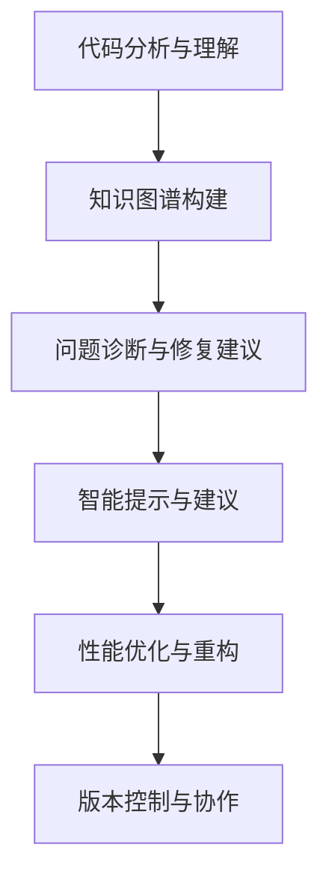

                 

## 1. 背景介绍

在当今的软件开发领域，编程和问题解决已经不仅仅是单个人工智能的竞赛。随着代码量和复杂度的增加，传统的手动调试和测试方法越来越难以适应。为了提高代码质量、减少错误、加速开发过程，知识发现引擎(即KDE)开始得到广泛应用。本文将深入探讨KDE的核心概念、原理以及其在实际软件开发中的具体应用，包括其如何解决编程难题、提高开发效率和质量等。

## 2. 核心概念与联系

### 2.1 核心概念概述

知识发现引擎（Knowledge Discovery Engine, KDE）是一种智能化的软件工具，它能够通过自动分析和挖掘软件代码中的知识，帮助程序员快速识别和解决问题。核心概念包括但不限于以下几个方面：

- **代码分析与理解**：KDE通过静态分析代码结构、调用关系、变量使用等方式，理解代码的语义和意图。
- **知识图谱构建**：KDE构建代码知识图谱，利用图谱分析代码间的关系，提高代码理解和修复效率。
- **问题诊断与修复建议**：KDE能够检测出代码中的潜在问题和错误，并提出修复建议。
- **智能提示与建议**：KDE在代码编写过程中提供智能提示，减少人工编写错误。
- **性能优化与重构**：KDE帮助识别代码中的性能瓶颈和潜在问题，提出重构建议。
- **版本控制与协作**：KDE与版本控制系统（如Git）集成，支持代码版本管理与团队协作。

### 2.2 核心概念原理和架构的 Mermaid 流程图



这个图展示了KDE的核心工作流程：从代码分析与理解开始，通过构建知识图谱，诊断和修复问题，提供智能提示和建议，优化性能和重构代码，并管理版本控制和团队协作。

## 3. 核心算法原理 & 具体操作步骤

### 3.1 算法原理概述

KDE的工作原理主要包括三个阶段：数据收集与预处理、知识抽取与图谱构建、智能分析与决策。

- **数据收集与预处理**：KDE从源代码中收集必要的信息，包括函数调用、变量使用、注释等，并对其进行预处理，确保数据的质量和一致性。
- **知识抽取与图谱构建**：KDE从收集到的数据中抽取关键信息，构建软件代码的知识图谱。图谱中的节点代表代码元素，边表示元素之间的关系。
- **智能分析与决策**：KDE利用知识图谱进行智能分析，识别代码中的问题和缺陷，并给出相应的解决方案和建议。

### 3.2 算法步骤详解

1. **数据收集与预处理**
   - 遍历代码库，提取函数名、参数、变量、注释等信息。
   - 进行数据清洗，去除重复、无关数据，并进行格式化处理。
   - 使用静态分析工具，如AST（Abstract Syntax Tree）解析器，将代码转换为可分析的抽象结构。

2. **知识抽取与图谱构建**
   - 定义代码元素（如函数、类、变量）和关系（如调用、赋值、继承等）。
   - 构建基于图的知识图谱，可以使用有向图或无向图表示代码元素之间的关系。
   - 利用图谱算法（如PageRank、子图算法）挖掘代码中的重要元素和关键路径。

3. **智能分析与决策**
   - 利用图谱算法（如最小路径算法、拓扑排序）检测代码中的依赖关系和潜在问题。
   - 基于知识图谱提供修复建议和代码重构策略。
   - 集成代码提示功能，自动提供代码补全、变量声明等智能提示。

### 3.3 算法优缺点

**优点**：
- **自动化**：自动化分析、挖掘和处理代码信息，减少人工工作量。
- **高效性**：快速识别和解决问题，提高开发效率。
- **全面性**：涵盖代码理解、重构、性能优化等方面，全面提升代码质量。
- **智能提示**：提供智能代码提示，减少编码错误。

**缺点**：
- **准确性**：KDE的分析结果可能存在误报，需要人工审核。
- **资源消耗**：构建和分析知识图谱需要大量计算资源，可能影响系统性能。
- **适应性**：不同类型的代码和项目可能需要定制不同的分析策略。
- **隐私问题**：分析代码需要访问源代码，可能涉及数据隐私问题。

### 3.4 算法应用领域

KDE在软件开发过程中有广泛的应用场景，如：

- **代码重构**：自动检测和修复代码中的冗余、重复、错误等，提高代码可读性和维护性。
- **性能优化**：自动分析和优化代码性能瓶颈，提升系统运行效率。
- **问题检测与修复**：自动检测代码中的安全漏洞、异常、错误，并提供修复建议。
- **版本控制与协作**：集成Git等版本控制系统，管理代码版本，支持团队协作。
- **智能提示**：提供代码补全、变量声明、函数调用等智能提示，减少编码错误。

## 4. 数学模型和公式 & 详细讲解 & 举例说明

### 4.1 数学模型构建

在KDE中，代码知识图谱的构建是其核心。假设代码库中的每个元素为一个节点 $V$，元素之间的关系定义为边 $E$。知识图谱的数学模型可以表示为一个三元组集合 $G=(V, E, R)$，其中 $V$ 是节点集合，$E$ 是边集合，$R$ 是关系集合。

### 4.2 公式推导过程

KDE利用图论中的算法对知识图谱进行分析，常用的算法包括：

- **PageRank算法**：用于计算节点的重要性。
- **最小路径算法**：用于查找代码元素之间的最短路径。
- **拓扑排序算法**：用于确定代码执行的顺序。

以PageRank算法为例，其基本思路是通过迭代计算每个节点的权重，确定节点的重要性。具体公式如下：

$$
P_{i}^{(k+1)} = \frac{\alpha}{C_i} \sum_{j \in N(i)} P_{j}^{(k)} + \frac{1-\alpha}{N_i} \sum_{k \in V} P_{k}^{(k)}
$$

其中，$P_{i}^{(k)}$ 表示节点 $i$ 在 $k$ 次迭代后的权重，$\alpha$ 为阻尼系数，$N(i)$ 表示节点 $i$ 的邻居节点集合，$C_i$ 和 $N_i$ 分别表示节点 $i$ 的入度和出度。

### 4.3 案例分析与讲解

以Google的Gerrit代码托管平台为例，KDE通过分析代码库，构建知识图谱，自动生成代码依赖关系图和知识关系图，并在代码审查时提供智能建议。具体流程如下：

1. **数据收集**：Gerrit从代码库中收集函数调用、变量使用、注释等信息。
2. **知识抽取**：构建函数调用图、变量使用图等知识图谱。
3. **分析决策**：利用PageRank算法计算每个函数的权重，识别重要函数。
4. **智能建议**：在代码审查时提供修复建议，如代码重构、性能优化等。

## 5. 项目实践：代码实例和详细解释说明

### 5.1 开发环境搭建

为了实现KDE的功能，需要搭建相应的开发环境。以下是使用Python进行KDE开发的推荐环境配置流程：

1. 安装Anaconda：从官网下载并安装Anaconda，用于创建独立的Python环境。
2. 创建并激活虚拟环境：
   ```bash
   conda create -n kde-env python=3.8 
   conda activate kde-env
   ```
3. 安装必要的Python库，如NumPy、SciPy、Pandas、NetworkX等。
4. 安装KDE框架的Python接口库，如KDE4、Python-KDE等。

### 5.2 源代码详细实现

以下是一个简单的KDE实现示例，用于分析一个Python函数库的代码依赖关系：

```python
import networkx as nx

# 定义代码元素和关系
def create_knowledge_graph():
    graph = nx.DiGraph()

    # 添加节点
    for file in os.listdir('path/to/code'):
        if file.endswith('.py'):
            graph.add_node(file, label='PythonFile')

    # 添加边
    with open('path/to/dependencies.txt') as f:
        for line in f:
            dependencies = line.split(',')
            for dep in dependencies:
                graph.add_edge(dep, file)

    return graph

# 计算节点权重
def calculate_weights(graph):
    weights = nx.pagerank(graph)
    return weights

# 构建知识图谱
def build_knowledge_graph():
    graph = create_knowledge_graph()
    weights = calculate_weights(graph)

    # 输出节点权重
    for node, weight in weights.items():
        print(f'{node}: {weight:.2f}')

# 调用函数进行知识图谱构建
build_knowledge_graph()
```

### 5.3 代码解读与分析

上述代码主要实现了一个简单的KDE功能，具体步骤包括：

1. **数据收集与预处理**：遍历代码库，提取函数名、文件路径等信息，并将它们添加到知识图谱中。
2. **知识抽取与图谱构建**：从依赖关系文件中解析依赖关系，构建函数调用图。
3. **智能分析与决策**：利用PageRank算法计算节点权重，输出每个节点的权重值。

通过这个简单的示例，可以看到KDE的核心功能：构建代码知识图谱、计算节点权重和提供智能分析。

### 5.4 运行结果展示

运行上述代码后，会输出每个代码文件的PageRank权重值，权重值越高的文件表示其在代码库中的重要性越高。

## 6. 实际应用场景

### 6.1 代码重构

KDE可以自动检测代码中的冗余、重复、错误等，并提出修复建议。以Google的Git项目为例，KDE通过分析代码库，构建知识图谱，自动生成代码依赖关系图和知识关系图，并在代码审查时提供智能建议。具体流程如下：

1. **数据收集**：Gerrit从代码库中收集函数调用、变量使用、注释等信息。
2. **知识抽取**：构建函数调用图、变量使用图等知识图谱。
3. **分析决策**：利用PageRank算法计算每个函数的权重，识别重要函数。
4. **智能建议**：在代码审查时提供修复建议，如代码重构、性能优化等。

### 6.2 性能优化

KDE能够自动分析和优化代码性能瓶颈，提升系统运行效率。例如，在开发高性能计算应用时，KDE可以帮助程序员识别性能瓶颈，提出优化建议。

以一个简单的Python程序为例，KDE通过分析代码库，构建知识图谱，自动生成代码依赖关系图和知识关系图，并在代码审查时提供智能建议。具体流程如下：

1. **数据收集**：分析程序中的函数调用、变量使用、注释等信息。
2. **知识抽取**：构建函数调用图、变量使用图等知识图谱。
3. **分析决策**：利用PageRank算法计算每个函数的权重，识别性能瓶颈。
4. **智能建议**：在代码审查时提供优化建议，如代码重构、优化算法等。

### 6.3 问题检测与修复

KDE可以自动检测代码中的安全漏洞、异常、错误，并提供修复建议。以一个简单的JavaScript程序为例，KDE通过分析代码库，构建知识图谱，自动生成代码依赖关系图和知识关系图，并在代码审查时提供智能建议。具体流程如下：

1. **数据收集**：分析程序中的函数调用、变量使用、注释等信息。
2. **知识抽取**：构建函数调用图、变量使用图等知识图谱。
3. **分析决策**：利用PageRank算法计算每个函数的权重，识别潜在问题。
4. **智能建议**：在代码审查时提供修复建议，如修复漏洞、异常处理等。

### 6.4 未来应用展望

KDE作为一种智能化的软件工具，未来在软件开发中的应用前景非常广阔。随着深度学习技术的发展，KDE的智能化水平将进一步提升，能够在更复杂的代码场景中提供更准确的分析和建议。

未来，KDE的发展方向包括但不限于以下几个方面：

1. **多语言支持**：支持多种编程语言，实现跨语言的代码分析与优化。
2. **机器学习优化**：利用机器学习算法，提高分析的准确性和效率。
3. **动态分析**：支持动态分析和实时分析，提供更加及时的代码优化建议。
4. **集成开发环境**：集成到IDE中，提供更流畅的开发体验。
5. **持续集成与部署**：与CI/CD系统集成，支持代码的持续集成与部署。

## 7. 工具和资源推荐

### 7.1 学习资源推荐

为了帮助开发者系统掌握KDE的核心概念和应用，这里推荐一些优质的学习资源：

1. **《Knowledge Discovery in Databases》书籍**：由J. Han等人编写，详细介绍了知识发现的基本原理和应用。
2. **Coursera的《Data Science》课程**：由斯坦福大学提供，涵盖数据科学的基本知识和技能，包括KDE。
3. **KDE4官方文档**：提供了KDE框架的详细介绍和使用示例。
4. **GitHub上的KDE项目**：展示了多个开源KDE项目，提供了丰富的学习资源。
5. **KDE相关论文**：通过阅读相关论文，可以了解KDE的前沿研究和应用实践。

通过对这些资源的学习，相信你一定能够全面掌握KDE的核心技术，并将其应用于实际的开发场景中。

### 7.2 开发工具推荐

为了实现KDE的功能，需要一些开发工具的支持。以下是几款推荐的开发工具：

1. **Python**：KDE的开发语言，简单易学，生态丰富，适合数据科学和软件开发。
2. **NumPy**：用于数值计算和科学计算的Python库，适合处理复杂的数据结构。
3. **SciPy**：用于科学计算的Python库，支持高级数学和统计分析功能。
4. **Pandas**：用于数据处理和分析的Python库，适合处理大规模数据集。
5. **NetworkX**：用于构建和分析复杂网络结构的Python库，适合构建知识图谱。
6. **Jupyter Notebook**：用于编写和分享Python代码的交互式笔记本，适合数据分析和开发。

这些工具的结合使用，可以大大提升KDE的开发效率和效果。

### 7.3 相关论文推荐

KDE的研究领域非常广泛，涉及多个学科和技术。以下是几篇代表性的相关论文，推荐阅读：

1. **《Knowledge Discovery in Databases: An Introduction》论文**：由J. Han等人编写，介绍了知识发现的基本概念和方法。
2. **《Graph-Based Software Engineering: Methodologies and Applications》书籍**：由A. Teixeira等人编写，详细介绍了基于图的软件工程方法。
3. **《PageRank Algorithm》论文**：由L. Page等人编写，介绍了PageRank算法的原理和实现。
4. **《Knowledge Discovery and the Web》论文**：由P. Milne等人编写，介绍了Web上的知识发现方法和应用。
5. **《A Survey on Knowledge Discovery in Software Engineering》论文**：由S. H.-M. Ho等人编写，总结了软件工程中的知识发现方法和应用。

通过对这些论文的学习，可以帮助你更深入地了解KDE的原理和应用，为开发和研究提供理论支持。

## 8. 总结：未来发展趋势与挑战

### 8.1 研究成果总结

本文系统介绍了KDE的核心概念、原理和应用，详细说明了KDE在代码重构、性能优化、问题检测与修复等方面的应用。KDE作为一项重要的软件开发工具，已经在实际应用中取得了显著的效果，但仍然面临一些挑战和不足。

### 8.2 未来发展趋势

KDE的未来发展趋势包括但不限于以下几个方面：

1. **智能化水平提升**：随着深度学习技术的发展，KDE的智能化水平将进一步提升，能够在更复杂的代码场景中提供更准确的分析和建议。
2. **多语言支持**：支持多种编程语言，实现跨语言的代码分析与优化。
3. **机器学习优化**：利用机器学习算法，提高分析的准确性和效率。
4. **动态分析**：支持动态分析和实时分析，提供更加及时的代码优化建议。
5. **集成开发环境**：集成到IDE中，提供更流畅的开发体验。
6. **持续集成与部署**：与CI/CD系统集成，支持代码的持续集成与部署。

### 8.3 面临的挑战

尽管KDE已经在实际应用中取得了显著的效果，但在迈向更加智能化、普适化应用的过程中，仍面临诸多挑战：

1. **数据量问题**：构建和分析知识图谱需要大量的数据，对于小规模代码库可能存在数据不足的问题。
2. **算法复杂性**：KDE算法复杂度较高，对于大规模代码库的计算开销较大。
3. **准确性问题**：KDE的分析结果可能存在误报，需要人工审核。
4. **隐私问题**：分析代码需要访问源代码，可能涉及数据隐私问题。

### 8.4 研究展望

KDE的研究方向包括但不限于以下几个方面：

1. **数据收集与预处理**：研究如何自动收集和处理代码信息，提高数据质量。
2. **知识图谱构建**：研究如何构建高效的知识图谱，支持复杂的代码分析和优化。
3. **算法优化**：研究如何优化算法，提高分析的准确性和效率。
4. **机器学习结合**：研究如何将机器学习算法与KDE结合，提升分析效果。
5. **集成化应用**：研究如何将KDE集成到开发工具和框架中，提供更流畅的开发体验。
6. **安全性与隐私保护**：研究如何保护数据隐私，确保KDE的安全性和可靠性。

未来，随着研究的深入和技术的进步，KDE将更加智能化、高效化和普适化，成为软件开发的重要工具。

## 9. 附录：常见问题与解答

**Q1：KDE是否只适用于静态代码分析？**

A: KDE不仅可以用于静态代码分析，还可以支持动态代码分析和实时分析。例如，可以将KDE与IDE集成，实现代码编写过程中的实时分析和建议。

**Q2：KDE在实际应用中是否需要人工干预？**

A: KDE在实际应用中需要一定的人工干预，特别是在初始阶段需要进行人工审查和校验。但是，随着算法和技术的发展，KDE的智能化水平将逐步提升，减少人工干预的需求。

**Q3：KDE的开发成本和维护成本是否较高？**

A: KDE的开发成本和维护成本相对较高，尤其是对于大规模代码库的分析。但是，KDE能够显著提高开发效率和代码质量，降低长期维护成本。

**Q4：KDE能否适用于所有类型的代码库？**

A: KDE适用于绝大多数类型的代码库，但是针对不同语言和不同类型的代码库，可能需要定制不同的分析策略和工具。

**Q5：KDE的性能如何？**

A: KDE的性能取决于代码库的大小和复杂度，对于小规模代码库，KDE的性能通常较好；对于大规模代码库，可能存在计算开销较大的问题。

**Q6：KDE是否支持跨平台和跨语言？**

A: KDE目前主要支持Java、Python等主流编程语言，并具备跨平台特性，可以在Windows、Linux、MacOS等操作系统上运行。

---

作者：禅与计算机程序设计艺术 / Zen and the Art of Computer Programming

