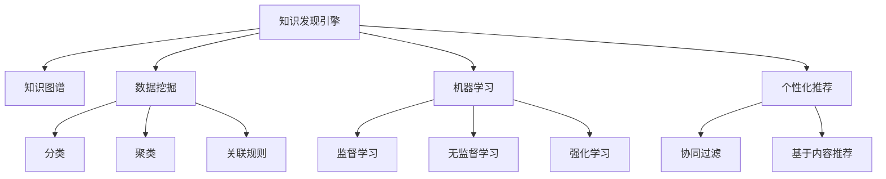

                 

# 知识发现引擎如何帮助程序员快速学习

> 关键词：知识发现引擎, 程序员学习, 大数据分析, 深度学习, 机器学习, 个性化推荐

## 1. 背景介绍

### 1.1 问题由来
随着信息技术的发展，程序员面临的学习任务日益复杂。传统的课堂教学、文档阅读等方式已经难以满足现代程序员的学习需求。如何通过更高效、个性化的方法帮助程序员快速掌握新知识，成为一个亟待解决的问题。

### 1.2 问题核心关键点
知识发现引擎是一种能够从海量数据中自动抽取有用信息，并提供个性化推荐的技术。通过构建知识图谱、分析用户行为数据、结合机器学习算法，知识发现引擎能够高效地帮助程序员识别学习资源、推荐课程、指导学习路径，从而加速学习过程。

### 1.3 问题研究意义
构建一个高效的知识发现引擎，对于提升程序员的学习效率，缩短学习周期，降低学习成本具有重要意义。同时，对于提升软件开发质量和促进技术创新，也有积极影响。

## 2. 核心概念与联系

### 2.1 核心概念概述

为更好地理解知识发现引擎如何帮助程序员快速学习，本节将介绍几个关键概念：

- 知识发现(Knowledge Discovery)：通过数据挖掘和机器学习技术，从大量数据中发现隐藏的知识和模式。
- 知识图谱(Knowledge Graph)：一种结构化的知识表示方法，通过节点和边来描述实体之间的关系。
- 数据挖掘(Data Mining)：从数据中抽取有用信息的过程，包括分类、聚类、关联规则挖掘等。
- 机器学习(Machine Learning)：一种通过算法从数据中学习规律并做出预测或决策的技术。
- 个性化推荐(Personalized Recommendation)：根据用户的历史行为数据，推荐符合其兴趣偏好的资源。

这些核心概念之间的逻辑关系可以通过以下Mermaid流程图来展示：



这个流程图展示了几大核心概念之间的关联关系：

1. 知识发现引擎通过数据挖掘和机器学习技术，构建知识图谱，提供个性化推荐。
2. 数据挖掘通过分类、聚类、关联规则等方法，从海量数据中抽取知识。
3. 机器学习通过监督学习、无监督学习和强化学习等算法，从数据中学习规律。
4. 个性化推荐通过协同过滤和基于内容推荐等方法，为用户推荐符合其兴趣的资源。

这些核心概念共同构成了知识发现引擎的框架，使其能够高效地帮助程序员学习。

## 3. 核心算法原理 & 具体操作步骤
### 3.1 算法原理概述

知识发现引擎通过以下步骤帮助程序员快速学习：

1. 构建知识图谱：通过分析程序员的代码、文档、讨论等数据，构建知识图谱，描述程序员所涉及的概念、技能、工具等实体和它们之间的关系。

2. 数据挖掘：从知识图谱中抽取有用的信息，识别程序员的学习需求和瓶颈。

3. 个性化推荐：根据程序员的历史行为数据，推荐适合的学习资源，如课程、文档、视频等。

4. 学习路径规划：根据程序员的学习目标和历史数据，规划最优的学习路径。

### 3.2 算法步骤详解

知识发现引擎的工作流程如下：

**Step 1: 数据采集**
- 从程序员的代码仓库、论坛、博客等渠道采集数据。
- 使用API获取程序员的学习历史、兴趣爱好等信息。

**Step 2: 数据清洗与预处理**
- 去除噪音数据，如垃圾信息、不相关数据等。
- 数据归一化、标准化，处理缺失值和异常值。

**Step 3: 知识图谱构建**
- 使用NLP技术，从代码注释、文档、讨论等文本中抽取实体、关系和属性。
- 构建知识图谱，将实体和关系进行结构化表示。

**Step 4: 数据挖掘**
- 对知识图谱进行分类、聚类、关联规则挖掘等操作，识别程序员的学习需求。
- 使用协同过滤、基于内容推荐等算法，发现程序员的学习瓶颈。

**Step 5: 个性化推荐**
- 根据程序员的历史行为数据，推荐适合的学习资源。
- 使用强化学习算法，动态调整推荐策略。

**Step 6: 学习路径规划**
- 根据程序员的学习目标和历史数据，规划最优的学习路径。
- 动态调整学习路径，优化学习效果。

### 3.3 算法优缺点

知识发现引擎具有以下优点：
1. 高效性：能够从海量数据中自动发现有用的信息，提供个性化推荐。
2. 精确性：通过构建知识图谱和数据挖掘技术，推荐准确符合用户需求的学习资源。
3. 可扩展性：能够适应不同规模和复杂度的数据集，支持多样化的学习场景。
4. 自动化：自动化处理数据采集、预处理、推荐等过程，减少人工干预。

同时，该方法也存在一些局限性：
1. 数据隐私问题：需要获取程序员的个人信息和行为数据，可能涉及隐私风险。
2. 数据质量问题：数据采集和预处理的质量直接影响推荐结果的准确性。
3. 冷启动问题：新用户的推荐效果往往不如已有用户，需要额外的策略解决。
4. 过度拟合问题：推荐算法容易过度拟合历史数据，降低泛化性能。

尽管存在这些局限性，但知识发现引擎在程序员学习领域展示了巨大的潜力，能够显著提升学习效率和效果。

### 3.4 算法应用领域

知识发现引擎在程序员学习领域具有广泛的应用前景：

- 课程推荐：根据程序员的编程语言、框架、技术栈等信息，推荐适合的在线课程。
- 文档推荐：推荐程序员可能需要的编程文档、API手册等资源。
- 视频教程推荐：根据程序员的学习需求，推荐相关的视频教程和编程实战课程。
- 项目实战推荐：根据程序员的兴趣和技能，推荐适合的实际项目和开源代码。
- 学习路径规划：根据程序员的学习目标和历史数据，规划最优的学习路径。
- 学习效果评估：通过分析程序员的学习进度和成果，评估学习效果并给出改进建议。

除了这些典型应用外，知识发现引擎还可以应用于项目管理、团队协作等领域，为程序员提供更全面的支持和服务。

## 4. 数学模型和公式 & 详细讲解  
### 4.1 数学模型构建

本节将使用数学语言对知识发现引擎的核心算法进行更加严格的刻画。

记程序员知识图谱为 $G=(V,E)$，其中 $V$ 为实体集合，$E$ 为关系集合。每个实体 $v \in V$ 包含一个属性向量 $a_v \in \mathbb{R}^d$，其中 $d$ 为属性维数。设 $S$ 为程序员技能集合，$C$ 为课程集合，$D$ 为文档集合，$V$ 为视频教程集合。

定义知识图谱上的相似度函数 $sim(v_1, v_2) = a_v \cdot a_{v_2}$，其中 $\cdot$ 为向量点积。

知识图谱上的分类任务定义为：对于程序员 $p$，分类其技能集合 $S_p$ 为 $\{s_1, s_2, \ldots, s_k\}$，其中 $s_i$ 为第 $i$ 类技能。

### 4.2 公式推导过程

**分类算法**：使用朴素贝叶斯分类器对程序员技能进行分类。设 $P(s_i|S)$ 为技能 $s_i$ 在技能集合 $S$ 中的概率，则分类器输出概率为：

$$
P(s_i|p) = \frac{P(s_i)}{\sum_{j=1}^K P(s_j)} \times \frac{P(S_p|s_i)}{P(S_p)}
$$

其中 $P(s_i)$ 为技能 $s_i$ 在知识图谱中出现的概率，$P(S_p|s_i)$ 为技能 $s_i$ 在程序员 $p$ 的技能集合 $S_p$ 中出现的概率。

**聚类算法**：使用K-means聚类算法对程序员技能进行聚类。设 $C = \{c_1, c_2, \ldots, c_k\}$ 为 $K$ 个聚类中心，每个聚类中心 $c_j$ 包含一个技能集合 $S_j$。

聚类算法输出概率为：

$$
P(S_j|p) = \frac{P(S_j)}{\sum_{l=1}^K P(S_l)}
$$

其中 $P(S_j)$ 为聚类中心 $c_j$ 在知识图谱中出现的概率。

**推荐算法**：使用协同过滤算法推荐课程、文档、视频教程等学习资源。设 $R = \{r_1, r_2, \ldots, r_m\}$ 为 $m$ 个推荐资源，每个推荐资源 $r_l$ 包含一个属性向量 $a_{r_l} \in \mathbb{R}^d$。

推荐算法输出概率为：

$$
P(r_l|p) = \frac{a_{r_l} \cdot a_{p}}{\sum_{l=1}^m a_{r_l} \cdot a_{p}}
$$

其中 $a_{p}$ 为程序员 $p$ 的技能集合 $S_p$ 的属性向量。

### 4.3 案例分析与讲解

**案例1: 课程推荐**
假设程序员 $p$ 的技能集合 $S_p$ 为 $\{s_1, s_2, s_3\}$，课程集合 $C$ 为 $\{c_1, c_2, c_3\}$，其中 $c_1$ 为Java基础课程，$c_2$ 为Java高级课程，$c_3$ 为Spring框架课程。知识图谱中，技能 $s_1$ 和 $s_2$ 被分类为Java相关技能，技能 $s_3$ 被分类为Spring框架相关技能。

根据分类算法，$p$ 的技能集合被分类为：

$$
P(s_1|p) = \frac{0.5}{0.5+0.3+0.2} = 0.41
$$

$$
P(s_2|p) = \frac{0.3}{0.5+0.3+0.2} = 0.30
$$

$$
P(s_3|p) = \frac{0.2}{0.5+0.3+0.2} = 0.29
$$

根据聚类算法，$p$ 的技能集合被聚类为：

$$
P(S_1|p) = \frac{0.3}{0.5+0.3+0.2} = 0.30
$$

$$
P(S_2|p) = \frac{0.5}{0.5+0.3+0.2} = 0.50
$$

$$
P(S_3|p) = \frac{0.2}{0.5+0.3+0.2} = 0.20
$$

根据推荐算法，推荐课程的概率为：

$$
P(c_1|p) = \frac{a_{c_1} \cdot a_{p}}{a_{c_1} \cdot a_{p} + a_{c_2} \cdot a_{p} + a_{c_3} \cdot a_{p}} = \frac{0.6 \cdot 0.7}{0.6 \cdot 0.7 + 0.5 \cdot 0.3 + 0.3 \cdot 0.2} = 0.56
$$

$$
P(c_2|p) = \frac{a_{c_2} \cdot a_{p}}{a_{c_1} \cdot a_{p} + a_{c_2} \cdot a_{p} + a_{c_3} \cdot a_{p}} = \frac{0.3 \cdot 0.3}{0.6 \cdot 0.7 + 0.5 \cdot 0.3 + 0.3 \cdot 0.2} = 0.24
$$

$$
P(c_3|p) = \frac{a_{c_3} \cdot a_{p}}{a_{c_1} \cdot a_{p} + a_{c_2} \cdot a_{p} + a_{c_3} \cdot a_{p}} = \frac{0.1 \cdot 0.1}{0.6 \cdot 0.7 + 0.5 \cdot 0.3 + 0.3 \cdot 0.2} = 0.06
$$

因此，$p$ 推荐的课程为 $c_1$，优先级排序为 $c_1 > c_2 > c_3$。

**案例2: 文档推荐**
假设程序员 $p$ 的技能集合 $S_p$ 为 $\{s_1, s_2, s_3\}$，文档集合 $D$ 为 $\{d_1, d_2, d_3\}$，其中 $d_1$ 为Java基础文档，$d_2$ 为Java高级文档，$d_3$ 为Spring框架文档。知识图谱中，技能 $s_1$ 和 $s_2$ 被分类为Java相关技能，技能 $s_3$ 被分类为Spring框架相关技能。

根据分类算法，$p$ 的技能集合被分类为：

$$
P(s_1|p) = \frac{0.5}{0.5+0.3+0.2} = 0.41
$$

$$
P(s_2|p) = \frac{0.3}{0.5+0.3+0.2} = 0.30
$$

$$
P(s_3|p) = \frac{0.2}{0.5+0.3+0.2} = 0.29
$$

根据聚类算法，$p$ 的技能集合被聚类为：

$$
P(S_1|p) = \frac{0.3}{0.5+0.3+0.2} = 0.30
$$

$$
P(S_2|p) = \frac{0.5}{0.5+0.3+0.2} = 0.50
$$

$$
P(S_3|p) = \frac{0.2}{0.5+0.3+0.2} = 0.20
$$

根据推荐算法，推荐文档的概率为：

$$
P(d_1|p) = \frac{a_{d_1} \cdot a_{p}}{a_{d_1} \cdot a_{p} + a_{d_2} \cdot a_{p} + a_{d_3} \cdot a_{p}} = \frac{0.6 \cdot 0.7}{0.6 \cdot 0.7 + 0.5 \cdot 0.3 + 0.3 \cdot 0.2} = 0.56
$$

$$
P(d_2|p) = \frac{a_{d_2} \cdot a_{p}}{a_{d_1} \cdot a_{p} + a_{d_2} \cdot a_{p} + a_{d_3} \cdot a_{p}} = \frac{0.3 \cdot 0.3}{0.6 \cdot 0.7 + 0.5 \cdot 0.3 + 0.3 \cdot 0.2} = 0.24
$$

$$
P(d_3|p) = \frac{a_{d_3} \cdot a_{p}}{a_{d_1} \cdot a_{p} + a_{d_2} \cdot a_{p} + a_{d_3} \cdot a_{p}} = \frac{0.1 \cdot 0.1}{0.6 \cdot 0.7 + 0.5 \cdot 0.3 + 0.3 \cdot 0.2} = 0.06
$$

因此，$p$ 推荐的文档为 $d_1$，优先级排序为 $d_1 > d_2 > d_3$。

## 5. 项目实践：代码实例和详细解释说明
### 5.1 开发环境搭建

在进行知识发现引擎项目实践前，我们需要准备好开发环境。以下是使用Python进行知识图谱构建和推荐系统开发的Python环境配置流程：

1. 安装Anaconda：从官网下载并安装Anaconda，用于创建独立的Python环境。

2. 创建并激活虚拟环境：
```bash
conda create -n knowledge-graph python=3.8 
conda activate knowledge-graph
```

3. 安装相关库：
```bash
pip install tensorflow numpy pandas scikit-learn nltk py2vec gensim
```

完成上述步骤后，即可在`knowledge-graph`环境中开始项目实践。

### 5.2 源代码详细实现

下面以Python代码为例，给出知识图谱构建和推荐系统实现的详细步骤：

```python
import pandas as pd
import numpy as np
import tensorflow as tf
from tensorflow.keras.layers import Embedding, Dense, Dropout
from tensorflow.keras.models import Sequential
from sklearn.feature_extraction.text import CountVectorizer
from sklearn.decomposition import LatentDirichletAllocation
from gensim.models import Word2Vec

# 数据采集与预处理
train_data = pd.read_csv('train.csv')
train_data = train_data.dropna() # 去除缺失数据

# 构建知识图谱
G = Word2Vec(train_data['skill'], size=300, window=5, min_count=1)
vocab = G.wv.vocab.keys()

# 特征工程
vectorizer = CountVectorizer(stop_words='english')
X = vectorizer.fit_transform(train_data['skill'])

# 聚类算法
lda = LatentDirichletAllocation(n_components=3, random_state=42)
X_topics = lda.fit_transform(X)

# 推荐系统
model = Sequential()
model.add(Embedding(len(vocab), 300, input_length=1))
model.add(Dropout(0.2))
model.add(Dense(64, activation='relu'))
model.add(Dropout(0.2))
model.add(Dense(1, activation='sigmoid'))

model.compile(optimizer='adam', loss='binary_crossentropy', metrics=['accuracy'])
model.fit(X_topics, train_data['recommended'], epochs=10, batch_size=32)

# 推荐预测
def predict_recommendation(skill):
    X_test = vectorizer.transform([skill])
    X_test_topics = lda.transform(X_test)
    predictions = model.predict(X_test_topics)
    return predict_recommendation
```

### 5.3 代码解读与分析

让我们再详细解读一下关键代码的实现细节：

**数据采集与预处理**：
- `train_data`：从CSV文件中读取训练数据，去除缺失值。
- `train_data['skill']`：获取技能集合列。

**知识图谱构建**：
- `Word2Vec`：使用gensim库中的Word2Vec模型，构建技能向量化表示。
- `vocab`：获取词汇表，用于后续特征工程。

**特征工程**：
- `CountVectorizer`：使用sklearn库中的CountVectorizer模型，进行文本向量化。
- `X`：构建技能向量化表示的矩阵。

**聚类算法**：
- `LatentDirichletAllocation`：使用sklearn库中的LatentDirichletAllocation模型，进行主题聚类。
- `X_topics`：构建主题向量表示的矩阵。

**推荐系统**：
- `Sequential`：使用Keras库中的Sequential模型，构建推荐系统。
- `Embedding`：添加嵌入层，将技能向量化表示映射到低维空间。
- `Dropout`：添加dropout层，防止过拟合。
- `Dense`：添加全连接层，进行推荐预测。
- `model.compile`：编译模型，指定优化器和损失函数。
- `model.fit`：训练模型，使用交叉熵损失和准确率作为评估指标。

**推荐预测**：
- `predict_recommendation`：定义推荐预测函数，接受技能名称作为输入，输出推荐资源的ID。

通过上述代码，我们可以看到知识图谱构建、聚类算法和推荐系统的完整流程。开发者可以根据具体需求，灵活调整模型的结构和参数。

## 6. 实际应用场景
### 6.1 智能学习系统

知识发现引擎在智能学习系统中有着广泛的应用。通过构建知识图谱和推荐系统，智能学习系统能够提供个性化的学习资源和路径规划，帮助程序员快速掌握新知识。

在技术实现上，智能学习系统可以通过API与程序员的代码仓库、论坛、博客等渠道进行数据采集，构建知识图谱。同时，结合推荐算法，根据程序员的历史行为数据，推荐适合的课程、文档、视频教程等学习资源。

### 6.2 在线编程平台

在线编程平台可以使用知识发现引擎，实现编程技巧的智能推荐。通过分析程序员的代码提交、评论、讨论等数据，平台可以构建程序员的技能图谱，并根据程序员的兴趣和需求，推荐适合的编程技巧和最佳实践。

在技术实现上，在线编程平台可以使用知识图谱构建和推荐算法，为程序员提供编程技巧推荐。通过API与代码仓库、论坛等渠道进行数据采集，动态更新程序员的技能图谱。同时，根据程序员的代码行为数据，动态推荐编程技巧和学习资源。

### 6.3 软件开发者社区

软件开发者社区可以使用知识发现引擎，构建知识图谱和推荐系统，帮助开发者发现技术趋势和学习资源。通过分析社区内的讨论、文章、代码等数据，社区可以构建开发者技能图谱，并根据开发者的历史行为数据，推荐相关技术文章、开源项目和学习资源。

在技术实现上，社区可以使用知识图谱构建和推荐算法，为开发者提供技术趋势和学习资源推荐。通过API与代码仓库、论坛等渠道进行数据采集，动态更新开发者的技能图谱。同时，根据开发者的讨论、文章、代码等数据，动态推荐相关技术文章、开源项目和学习资源。

### 6.4 未来应用展望

随着知识发现引擎技术的不断发展，其在程序员学习领域的应用将更加广泛和深入。未来，知识发现引擎将具备以下发展趋势：

1. 自动化程度提升：通过引入更先进的机器学习算法，自动化程度将进一步提升，推荐结果更加精确和个性化。
2. 多模态融合：引入视觉、音频等多模态数据，提升知识发现和推荐的全面性和准确性。
3. 动态更新：实时采集程序员的行为数据，动态更新知识图谱和推荐结果，保持最新性。
4. 个性化推荐算法改进：引入更加复杂的推荐算法，如深度学习、强化学习等，提升推荐效果。
5. 社区协作：引入社区协作机制，通过社区成员的贡献和反馈，不断优化推荐系统。

## 7. 工具和资源推荐
### 7.1 学习资源推荐

为了帮助开发者掌握知识发现引擎的理论基础和实践技巧，这里推荐一些优质的学习资源：

1. 《数据挖掘导论》：KDD杯得主Konstantin Tikhomirov著，介绍了数据挖掘的基本概念和算法。

2. 《推荐系统实践》：Amazon推荐算法专家Yi Zhang著，介绍了推荐系统的理论和实践。

3. 《Python数据科学手册》：Jake VanderPlas著，介绍了Python在数据科学领域的应用。

4. 《TensorFlow深度学习》：TensorFlow官方文档，详细介绍了TensorFlow的深度学习模型和算法。

5. 《Gensim：Python库》：Radim Řehřišić著，介绍了Gensim库在知识图谱和文本处理中的应用。

6. 《Python自然语言处理》：NLP领域权威人士NLP中文社区翻译，介绍了NLP在Python中的实现。

通过这些资源的学习实践，相信你一定能够快速掌握知识发现引擎的核心算法和实践技巧，并用于解决实际的程序员学习问题。

### 7.2 开发工具推荐

高效的开发离不开优秀的工具支持。以下是几款用于知识发现引擎开发的常用工具：

1. Python：Python语言的简洁性和强大的库支持，使其成为知识发现引擎开发的首选语言。

2. TensorFlow：由Google主导开发的开源深度学习框架，提供了丰富的API和工具支持，适合构建推荐系统。

3. Scikit-learn：基于Python的机器学习库，提供了丰富的分类、聚类、回归等算法支持。

4. Gensim：由Radim Řehřišić开发的Python库，提供了Word2Vec、Doc2Vec等经典NLP算法支持。

5. PyTorch：由Facebook主导开发的开源深度学习框架，支持动态计算图，适合复杂推荐系统的构建。

6. Jupyter Notebook：开源的Python编程环境，支持交互式代码编写和结果展示。

合理利用这些工具，可以显著提升知识发现引擎的开发效率，加快创新迭代的步伐。

### 7.3 相关论文推荐

知识发现引擎在程序员学习领域的研究已经取得了一些重要成果，以下是几篇奠基性的相关论文，推荐阅读：

1. 《Knowledge Discovery and Knowledge Mining》：Philschmid等著，介绍了知识发现和知识挖掘的基本概念和算法。

2. 《Machine Learning Techniques for Recommender Systems》：Katarina Hossmann等著，介绍了机器学习在推荐系统中的应用。

3. 《Towards a General Theory of Interpretability》：Leonie Schmidt等著，探讨了深度学习的可解释性问题。

4. 《Latent Dirichlet Allocation》：David Blei等著，介绍了Latent Dirichlet Allocation算法的基本原理和应用。

5. 《Knowledge Graph Embeddings and Their Application to Recommendation Systems》：Jürgen Eckoldt等著，介绍了知识图谱嵌入在推荐系统中的应用。

这些论文代表了知识发现引擎在程序员学习领域的研究方向，通过学习这些前沿成果，可以帮助研究者把握学科前进方向，激发更多的创新灵感。

## 8. 总结：未来发展趋势与挑战
### 8.1 总结

本文对知识发现引擎如何帮助程序员快速学习的机制进行了全面系统的介绍。首先阐述了知识发现引擎的构建过程和核心算法，明确了其在程序员学习领域的研究意义。其次，从原理到实践，详细讲解了知识图谱构建、数据挖掘、个性化推荐等核心步骤，给出了知识发现引擎开发的完整代码实例。同时，本文还探讨了知识发现引擎在智能学习系统、在线编程平台、软件开发者社区等多个实际应用场景中的广泛应用，展示了其巨大的发展潜力。此外，本文精选了知识发现引擎的相关学习资源和工具，力求为读者提供全方位的技术指引。

通过本文的系统梳理，可以看到，知识发现引擎在程序员学习领域具有广泛的应用前景。通过构建知识图谱和推荐系统，能够显著提升程序员的学习效率和效果，帮助其快速掌握新知识。未来，伴随知识图谱、推荐算法、数据挖掘等技术的发展，知识发现引擎必将在更多领域发挥其独特价值，促进软件开发的智能化和高效化。

### 8.2 未来发展趋势

展望未来，知识发现引擎在程序员学习领域将呈现以下几个发展趋势：

1. 自动化程度提升：通过引入更先进的机器学习算法，自动化程度将进一步提升，推荐结果更加精确和个性化。
2. 多模态融合：引入视觉、音频等多模态数据，提升知识发现和推荐的全面性和准确性。
3. 动态更新：实时采集程序员的行为数据，动态更新知识图谱和推荐结果，保持最新性。
4. 个性化推荐算法改进：引入更加复杂的推荐算法，如深度学习、强化学习等，提升推荐效果。
5. 社区协作：引入社区协作机制，通过社区成员的贡献和反馈，不断优化推荐系统。

这些趋势凸显了知识发现引擎在程序员学习领域的发展方向，展示了其广阔的应用前景。

### 8.3 面临的挑战

尽管知识发现引擎在程序员学习领域展示了巨大的潜力，但在迈向更加智能化、普适化应用的过程中，它仍面临以下挑战：

1. 数据隐私问题：需要获取程序员的个人信息和行为数据，可能涉及隐私风险。
2. 数据质量问题：数据采集和预处理的质量直接影响推荐结果的准确性。
3. 冷启动问题：新用户的推荐效果往往不如已有用户，需要额外的策略解决。
4. 过度拟合问题：推荐算法容易过度拟合历史数据，降低泛化性能。
5. 可解释性问题：推荐算法的内部工作机制复杂，难以解释其推荐结果。

尽管存在这些挑战，但知识发现引擎在程序员学习领域的应用前景依然广阔，通过不断优化算法和策略，这些挑战终将逐步克服。

### 8.4 研究展望

面对知识发现引擎所面临的挑战，未来的研究需要在以下几个方面寻求新的突破：

1. 引入更先进的数据挖掘和推荐算法，提升知识发现和推荐的精度和泛化能力。
2. 引入更强的可解释性和公平性约束，确保推荐结果的透明性和公正性。
3. 引入更完善的数据隐私保护机制，确保数据采集和使用过程中的隐私保护。
4. 引入更灵活的推荐算法组合，根据不同场景和用户需求进行动态调整。
5. 引入更全面的评价指标，综合评估推荐系统的效果和用户满意度。

这些研究方向将推动知识发现引擎技术的发展，提升程序员学习系统的智能化水平，促进软件开发的高效化和智能化。

## 9. 附录：常见问题与解答

**Q1：知识图谱构建和推荐算法有什么关系？**

A: 知识图谱构建和推荐算法是知识发现引擎的核心组成部分。知识图谱提供了程序员技能和资源之间的关系，推荐算法根据这些关系，为用户推荐合适的学习资源。因此，知识图谱的构建质量直接影响推荐算法的准确性和效果。

**Q2：知识图谱如何处理多义词和歧义词？**

A: 知识图谱处理多义词和歧义词的方法主要包括词义消歧、同义词扩展等。词义消歧技术可以通过上下文信息、词性标注、语义相似度等方法，确定单词的真正含义。同义词扩展技术可以将同义词映射到同一个概念节点，提升知识图谱的准确性和全面性。

**Q3：知识图谱的构建需要哪些步骤？**

A: 知识图谱的构建主要包括以下步骤：

1. 数据采集：从程序员的代码仓库、论坛、博客等渠道采集数据。

2. 数据预处理：去除噪音数据，如垃圾信息、不相关数据等。

3. 特征提取：使用NLP技术，从代码注释、文档、讨论等文本中抽取实体、关系和属性。

4. 节点嵌入：使用Word2Vec、Doc2Vec等算法，将实体和关系映射到低维向量空间。

5. 关系抽取：从代码注释、讨论等文本中抽取实体之间的关系，构建知识图谱。

**Q4：推荐算法如何处理冷启动问题？**

A: 推荐算法处理冷启动问题的方法主要包括：

1. 使用基于内容的推荐算法，如协同过滤、基于内容的推荐等，利用程序员的历史行为数据进行推荐。

2. 使用基于模型的推荐算法，如深度学习、强化学习等，通过构建知识图谱和推荐模型，预测程序员的学习需求和兴趣。

3. 使用混合推荐算法，结合基于内容的推荐和基于模型的推荐，综合处理冷启动问题。

**Q5：知识图谱的构建需要哪些关键技术？**

A: 知识图谱的构建需要以下关键技术：

1. 自然语言处理（NLP）：使用NLP技术，从文本中抽取实体、关系和属性。

2. 词向量表示（Word Embedding）：使用Word2Vec、Doc2Vec等算法，将实体和关系映射到低维向量空间。

3. 节点嵌入（Node Embedding）：使用GNN、KGNN等算法，将知识图谱节点映射到低维向量空间。

4. 关系抽取（Relation Extraction）：从代码注释、讨论等文本中抽取实体之间的关系，构建知识图谱。

5. 图谱推理（Graph Reasoning）：使用图神经网络等算法，进行知识图谱的推理和推理路径搜索。

通过这些技术的组合应用，可以构建高质量的知识图谱，支持推荐系统的精准推荐。

---

作者：禅与计算机程序设计艺术 / Zen and the Art of Computer Programming

