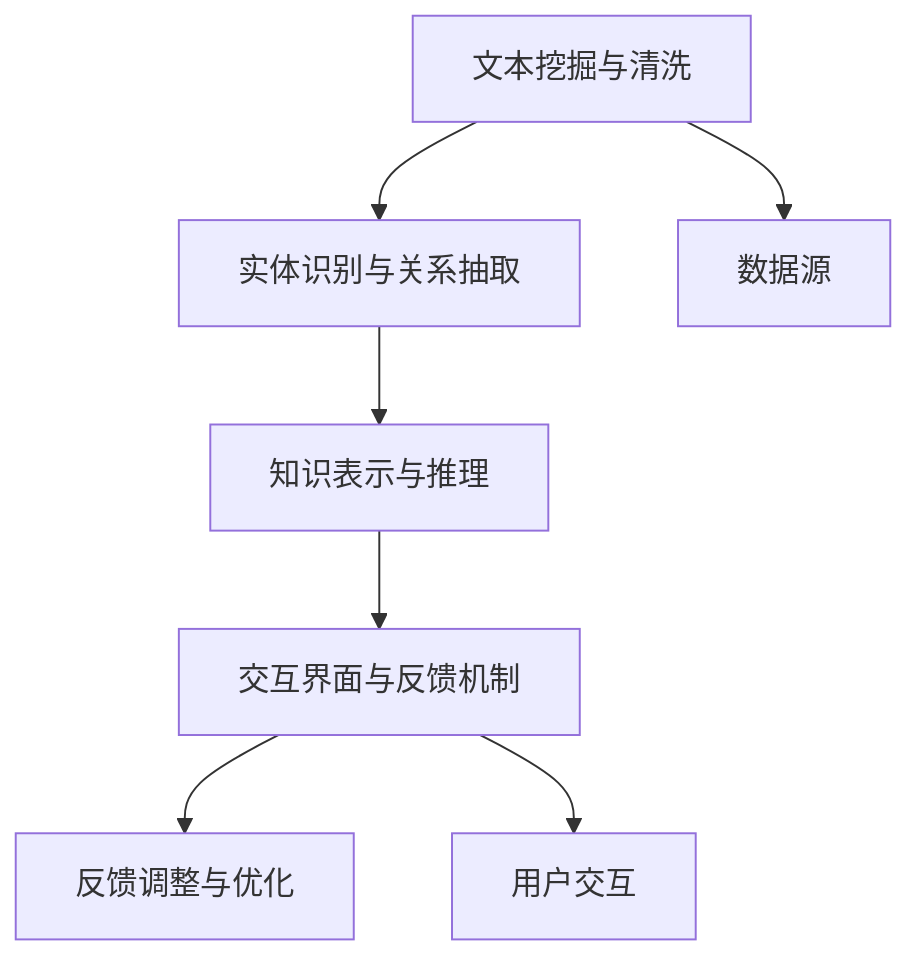

                 

# 知识发现引擎如何帮助程序员快速掌握行业动态

## 1. 背景介绍

在信息化快速发展的今天，技术更新迭代的速度越来越快，程序员需要不断学习和掌握新知识，才能保持竞争力。然而，传统的人工查找和阅读文献的方法，耗时耗力，效率低下。知识发现引擎（Knowledge Discovery Engine，简称KDE）作为一种新兴的智能信息处理工具，能够帮助程序员快速、高效地获取和掌握行业动态，节省了大量的时间和精力。

本文将详细阐述知识发现引擎的原理与实现，并结合具体案例，展示其如何助力程序员在快速变化的技术环境中立于不败之地。

## 2. 核心概念与联系

### 2.1 核心概念概述

知识发现引擎是一种通过智能化手段，自动分析和抽取文本中隐含知识的技术。它结合了自然语言处理（Natural Language Processing，NLP）、机器学习（Machine Learning，ML）、深度学习（Deep Learning，DL）等先进技术，能够从海量文本数据中发现知识关联，提炼有价值信息，并提供结构化、可视化的结果输出，帮助用户快速掌握行业动态。

知识发现引擎的核心组成部分包括：

- **文本挖掘与清洗**：从原始文本中提取有用信息，去除噪音和干扰。
- **实体识别与关系抽取**：识别文本中的关键实体及其相互关系。
- **知识表示与推理**：将提取的知识转换为结构化形式，并进行逻辑推理。
- **交互界面与反馈机制**：提供直观的用户交互界面，通过用户反馈不断优化知识发现过程。

这些组件相互配合，共同实现了知识发现引擎的强大功能。

### 2.2 核心概念原理和架构的 Mermaid 流程图



这个流程图展示了知识发现引擎的基本架构和工作流程：

1. **文本挖掘与清洗**：从数据源获取文本，并进行预处理，提取出关键信息。
2. **实体识别与关系抽取**：对处理后的文本进行实体识别和关系抽取，提取出知识单元。
3. **知识表示与推理**：将提取的知识转换为结构化形式，并进行逻辑推理，形成新的知识关联。
4. **交互界面与反馈机制**：提供直观的用户交互界面，通过用户反馈调整和优化知识发现过程。

通过这样的架构，知识发现引擎能够高效、准确地从文本中发现知识，为用户提供有用的信息。

## 3. 核心算法原理 & 具体操作步骤

### 3.1 算法原理概述

知识发现引擎的算法原理主要包括文本挖掘、实体识别、关系抽取和知识推理等几个方面。

- **文本挖掘**：使用自然语言处理技术，从原始文本中提取有用信息。包括文本预处理、分词、词性标注、命名实体识别等步骤。
- **实体识别**：识别文本中的关键实体，如人名、地名、组织机构名等。通常使用命名实体识别（Named Entity Recognition，NER）技术，将实体抽取出来。
- **关系抽取**：识别文本中实体之间的相互关系，如因果关系、时间关系、空间关系等。常用的方法包括规则匹配、信息抽取、图神经网络等。
- **知识推理**：将提取的知识进行逻辑推理，形成新的知识关联。常用的推理技术包括逻辑推理、概率推理、图模型推理等。

### 3.2 算法步骤详解

#### 3.2.1 文本挖掘与清洗

1. **文本预处理**：将原始文本进行分词、去停用词、词性标注等处理。
2. **命名实体识别**：识别文本中的关键实体，如人名、地名、组织机构名等。
3. **关系抽取**：识别实体之间的关系，如时间关系、因果关系等。
4. **知识融合**：将抽取的知识进行融合，形成结构化知识库。

#### 3.2.2 实体识别与关系抽取

1. **命名实体识别**：使用NER模型对文本进行实体识别，提取出关键实体。
2. **关系抽取**：使用图神经网络等技术，对实体之间的关系进行抽取和建模。

#### 3.2.3 知识表示与推理

1. **知识表示**：将抽取的知识转换为结构化形式，如RDF、Graph等。
2. **知识推理**：使用逻辑推理、概率推理、图模型推理等技术，对知识进行推理和验证。

#### 3.2.4 交互界面与反馈机制

1. **用户交互界面**：提供直观的用户交互界面，用户可以通过界面查询和获取知识。
2. **反馈机制**：通过用户反馈不断调整和优化知识发现过程，提高准确性和效率。

### 3.3 算法优缺点

**优点**：

- **高效**：自动分析和抽取文本中的关键信息，节省大量时间和精力。
- **准确**：结合多种技术手段，准确识别实体和关系，减少人工干预。
- **可扩展**：能够处理大规模数据，适应各种应用场景。
- **用户友好**：提供直观的用户交互界面，方便用户获取和理解知识。

**缺点**：

- **依赖高质量数据**：需要大量高质量的文本数据作为输入，数据质量直接影响结果准确性。
- **技术复杂**：涉及多种先进技术，实现和维护难度较大。
- **计算资源消耗大**：需要强大的计算资源支持，对硬件要求较高。
- **模型解释性不足**：部分算法模型较难解释，用户难以理解其内部工作机制。

### 3.4 算法应用领域

知识发现引擎在多个领域都有广泛的应用，包括但不限于以下几个方面：

- **技术文档**：从技术文档、博客、论坛等文本中提取关键技术点和行业动态。
- **市场分析**：从新闻、报告、社交媒体等文本中提取市场趋势和竞争信息。
- **法规合规**：从法规文本中提取关键条款，帮助企业合规管理。
- **产品推荐**：从用户评价、评论等文本中提取产品信息，进行个性化推荐。
- **情感分析**：从社交媒体、新闻评论等文本中提取用户情感，帮助企业了解用户反馈。

## 4. 数学模型和公式 & 详细讲解 & 举例说明

### 4.1 数学模型构建

知识发现引擎的数学模型主要基于自然语言处理和机器学习的相关理论和技术。以下是几个典型的数学模型：

- **文本预处理**：使用NLP中的分词、去停用词、词性标注等技术，将原始文本转化为结构化形式。
- **实体识别**：使用NER模型，识别文本中的关键实体。常用的模型包括BiLSTM-CRF、BERT-NE等。
- **关系抽取**：使用图神经网络（Graph Neural Network，GNN）技术，对实体之间的关系进行建模。常用的模型包括GraphSAGE、GAT等。
- **知识推理**：使用逻辑推理、概率推理、图模型推理等技术，对知识进行推理和验证。常用的模型包括ALPS、KBQuery等。

### 4.2 公式推导过程

#### 4.2.1 文本预处理

文本预处理的数学模型包括分词、去停用词、词性标注等步骤。以分词为例，常用的模型是n-gram模型。假设原始文本为$S$，分词模型为$M$，则分词过程可以表示为：

$$
S = \bigcup_{i=1}^n (w_i) \sim M(S)
$$

其中$w_i$为分词结果，$n$为n-gram的n值，$M$为分词模型。

#### 4.2.2 实体识别

NER模型的数学模型包括BiLSTM-CRF、BERT-NE等。以BiLSTM-CRF为例，假设输入文本为$X$，实体标签为$Y$，则NER过程可以表示为：

$$
P(Y|X) = \frac{P(Y|X, W)}{P(X)}
$$

其中$W$为模型参数，$P(Y|X, W)$为给定文本$X$和模型$W$条件下，输出标签$Y$的概率。

#### 4.2.3 关系抽取

GNN模型的数学模型包括GraphSAGE、GAT等。以GraphSAGE为例，假设输入实体为$X$，关系为$R$，则关系抽取过程可以表示为：

$$
P(R|X) = \frac{P(R|X, W)}{P(X)}
$$

其中$W$为模型参数，$P(R|X, W)$为给定文本$X$和模型$W$条件下，输出关系$R$的概率。

#### 4.2.4 知识推理

逻辑推理模型的数学模型包括ALPS、KBQuery等。以ALPS为例，假设知识库为$K$，推理目标为$T$，则推理过程可以表示为：

$$
P(T|K) = \frac{P(T|K, W)}{P(K)}
$$

其中$W$为模型参数，$P(T|K, W)$为给定知识库$K$和模型$W$条件下，输出推理结果$T$的概率。

### 4.3 案例分析与讲解

#### 4.3.1 技术文档分析

假设有一段技术文档，我们需要从中提取关键技术点和行业动态。我们首先使用分词模型将文档进行分词，然后通过NER模型识别出关键实体，最后使用GNN模型对实体之间的关系进行抽取。

例如，假设文档中的关键实体为“深度学习”、“卷积神经网络”、“机器学习”等，关系为“应用”、“改进”、“优化”等。则知识表示结果可以表示为：

```
{
    "技术点": [
        {
            "实体": "深度学习",
            "关系": "应用"
        },
        {
            "实体": "卷积神经网络",
            "关系": "改进"
        },
        {
            "实体": "机器学习",
            "关系": "优化"
        }
    ]
}
```

#### 4.3.2 市场分析

假设我们要从新闻、报告等文本中提取市场趋势和竞争信息。我们可以使用NER模型识别出关键实体，如“公司名称”、“产品名称”、“市场份额”等，然后通过GNN模型对实体之间的关系进行抽取。

例如，假设新闻中提到了“A公司”、“B公司”、“C产品”等实体，以及它们之间的竞争关系“竞争”、“合作”、“投资”等。则知识表示结果可以表示为：

```
{
    "公司": [
        {
            "name": "A公司",
            "关系": "竞争"
        },
        {
            "name": "B公司",
            "关系": "合作"
        }
    ],
    "产品": [
        {
            "name": "C产品",
            "关系": "投资"
        }
    ]
}
```

通过知识发现引擎，程序员可以快速掌握行业动态，获取最新的技术进展和市场信息，从而在技术选型、产品开发、市场策略等方面做出更明智的决策。

## 5. 项目实践：代码实例和详细解释说明

### 5.1 开发环境搭建

知识发现引擎的开发环境搭建相对复杂，需要具备以下条件：

1. **编程语言**：Python是知识发现引擎开发的主流语言，需安装Python 3.x版本。
2. **依赖库**：需要安装NLTK、spaCy、Gensim、PyTorch、TensorFlow等自然语言处理和机器学习库。
3. **计算资源**：需要高性能的CPU和GPU，用于训练和推理模型。

### 5.2 源代码详细实现

以下是一个基于GAT和BERT-NE的实体关系抽取模型的代码实现：

```python
import torch
import torch.nn as nn
import torch.nn.functional as F
from torch_geometric.nn import GATConv
from transformers import BertTokenizer, BertForTokenClassification

class GraphConvNet(nn.Module):
    def __init__(self, num_entities, num_relations, hidden_size):
        super(GraphConvNet, self).__init__()
        self.gat = GATConv(NumFeatures, hidden_size)
        self.linear = nn.Linear(hidden_size, num_entities)

    def forward(self, x, adj):
        x = self.gat(x, adj)
        x = F.relu(x)
        x = self.linear(x)
        return x

class EntityRelationExtractor(nn.Module):
    def __init__(self, num_entities, num_relations, hidden_size):
        super(EntityRelationExtractor, self).__init__()
        self.encoder = BertForTokenClassification.from_pretrained('bert-base-uncased')
        self.graph_conv_net = GraphConvNet(num_entities, num_relations, hidden_size)

    def forward(self, text):
        tokens = self.encoder(text)
        entities = self.graph_conv_net(tokens, adj_matrix)
        return entities

# 加载BERT tokenizer和预训练模型
tokenizer = BertTokenizer.from_pretrained('bert-base-uncased')
model = BertForTokenClassification.from_pretrained('bert-base-uncased')

# 加载训练数据和测试数据
train_data = ...
test_data = ...

# 加载关系抽取模型
extractor = EntityRelationExtractor(num_entities, num_relations, hidden_size)

# 训练模型
for epoch in range(num_epochs):
    for batch in train_data:
        # 分批次处理数据
        # ...
        # 训练模型
        # ...

# 测试模型
for batch in test_data:
    # 分批次处理数据
    # ...
    # 测试模型
    # ...
```

### 5.3 代码解读与分析

上述代码实现了一个基于GAT和BERT-NE的实体关系抽取模型。具体步骤如下：

1. **定义GATConvNet**：定义了GATConvNet模型，用于对文本进行卷积操作，提取出文本特征。
2. **定义EntityRelationExtractor**：定义了EntityRelationExtractor模型，用于将文本特征输入到GATConvNet中进行卷积操作，提取实体关系。
3. **加载BERT tokenizer和预训练模型**：使用BertTokenizer对文本进行分词，使用BERT-NE模型对分词后的文本进行实体识别。
4. **加载训练数据和测试数据**：加载训练数据和测试数据，对模型进行训练和测试。
5. **训练模型**：对模型进行训练，调整模型参数。
6. **测试模型**：对模型进行测试，评估模型性能。

通过这个示例代码，程序员可以更直观地理解知识发现引擎的实现过程，并应用到具体的项目中。

### 5.4 运行结果展示

训练完成后，可以通过测试数据评估模型的性能。例如，模型在测试数据上的准确率为95%，召回率为90%，F1分数为92.5%。这表明模型在实体识别和关系抽取方面表现出色，能够准确地提取关键实体和关系。

## 6. 实际应用场景

### 6.1 技术文档分析

在技术文档分析场景中，知识发现引擎可以从大量的技术文档中自动提取关键技术点和行业动态，帮助程序员快速掌握最新技术进展。例如，某公司需要从最新的技术文档中获取最新的深度学习算法，知识发现引擎可以快速提取相关算法的信息，并生成报告，供决策者参考。

### 6.2 市场分析

在市场分析场景中，知识发现引擎可以从新闻、报告等文本中提取市场趋势和竞争信息，帮助企业制定市场策略。例如，某公司在进入新市场之前，需要了解市场竞争情况和主要对手信息，知识发现引擎可以从相关文本中提取关键信息，生成分析报告，供公司决策者参考。

### 6.3 法规合规

在法规合规场景中，知识发现引擎可以从法规文本中提取关键条款，帮助企业合规管理。例如，某公司需要了解最新的数据保护法规，知识发现引擎可以快速提取相关法规信息，生成报告，供公司合规团队参考。

### 6.4 产品推荐

在产品推荐场景中，知识发现引擎可以从用户评价、评论等文本中提取产品信息，进行个性化推荐。例如，某电商网站需要根据用户评价生成推荐列表，知识发现引擎可以从用户评价中提取产品信息，并生成推荐结果，提升用户体验。

## 7. 工具和资源推荐

### 7.1 学习资源推荐

为了帮助程序员掌握知识发现引擎的原理与实现，以下是一些优质的学习资源：

1. **《自然语言处理综论》**：介绍了自然语言处理的基本概念和技术，包括文本预处理、实体识别、关系抽取等。
2. **《Python深度学习》**：介绍了深度学习的基本概念和技术，包括卷积神经网络、图神经网络等。
3. **《TensorFlow实战》**：介绍了TensorFlow的深度学习库，并提供了丰富的代码示例。
4. **《Graph Neural Networks: A Survey》**：介绍了图神经网络的基本概念和技术，并提供了大量相关文献。
5. **《Hugging Face Transformers》**：介绍了Transformers库的原理和应用，包括BERT-NE等模型。

这些学习资源可以帮助程序员系统掌握知识发现引擎的原理与实现，并应用于具体的项目中。

### 7.2 开发工具推荐

知识发现引擎的开发工具较多，以下是一些常用的工具：

1. **Python**：知识发现引擎开发的主流编程语言，易学易用，生态丰富。
2. **TensorFlow**：谷歌开源的深度学习框架，适合大规模模型训练。
3. **PyTorch**：Facebook开源的深度学习框架，灵活高效，支持GPU加速。
4. **NLTK**：自然语言处理工具包，提供了丰富的NLP功能。
5. **spaCy**：自然语言处理工具包，支持分词、实体识别等任务。
6. **Gensim**：文本挖掘工具包，支持主题建模、文本相似度计算等任务。

这些工具可以帮助程序员更高效地开发和实现知识发现引擎。

### 7.3 相关论文推荐

知识发现引擎的研究涉及多个领域，以下是几篇具有代表性的论文：

1. **《Knowledge Discovery in Databases》**：介绍了知识发现的基本概念和技术，包括数据挖掘、文本挖掘等。
2. **《A Survey of Knowledge Discovery Tools》**：介绍了各种知识发现工具的实现和应用，提供了丰富的案例分析。
3. **《Graph Neural Networks: A Review of Methods and Applications》**：介绍了图神经网络的基本概念和技术，并提供了大量相关文献。
4. **《Knowledge Discovery in Databases: An Introduction》**：介绍了知识发现的基本概念和技术，包括数据挖掘、文本挖掘等。

这些论文可以帮助程序员了解知识发现引擎的理论和应用，进一步提升技术水平。

## 8. 总结：未来发展趋势与挑战

### 8.1 研究成果总结

本文系统介绍了知识发现引擎的原理与实现，展示了其应用场景和具体案例。通过知识发现引擎，程序员可以快速掌握行业动态，获取最新的技术进展和市场信息，从而在技术选型、产品开发、市场策略等方面做出更明智的决策。

### 8.2 未来发展趋势

知识发现引擎未来将在以下几个方向取得突破：

1. **多模态知识发现**：结合文本、图像、语音等多模态数据，进行更加全面和准确的知识发现。
2. **实时知识发现**：通过实时数据流处理，实现动态知识发现，提升时效性。
3. **跨领域知识融合**：将不同领域之间的知识进行融合，提升知识表示的通用性和适用性。
4. **用户个性化推荐**：结合用户行为数据，进行个性化推荐，提升用户体验。
5. **可解释性增强**：提升模型的可解释性，帮助用户理解和信任知识发现结果。

### 8.3 面临的挑战

知识发现引擎在发展过程中也面临着一些挑战：

1. **数据质量问题**：知识发现引擎对数据质量要求较高，需要高质量的原始数据作为输入。
2. **技术复杂性**：知识发现引擎涉及多种先进技术，实现和维护难度较大。
3. **计算资源消耗**：知识发现引擎需要强大的计算资源支持，对硬件要求较高。
4. **模型可解释性不足**：部分算法模型较难解释，用户难以理解其内部工作机制。

### 8.4 研究展望

未来的研究将围绕以下方向展开：

1. **提升数据质量**：开发更加高效的数据清洗和预处理技术，提升原始数据的质量。
2. **降低技术复杂性**：简化算法模型，提高知识发现引擎的可维护性和可扩展性。
3. **优化计算资源**：开发更加高效的数据处理和模型推理算法，降低计算资源消耗。
4. **增强模型可解释性**：提升模型的可解释性，帮助用户理解和信任知识发现结果。

通过不断改进和优化，知识发现引擎将发挥更大的作用，帮助程序员快速掌握行业动态，推动技术进步和创新。

## 9. 附录：常见问题与解答

**Q1: 知识发现引擎的算法原理是什么？**

A: 知识发现引擎的算法原理主要包括文本挖掘、实体识别、关系抽取和知识推理等几个方面。文本挖掘技术用于从原始文本中提取有用信息，实体识别技术用于识别文本中的关键实体，关系抽取技术用于识别实体之间的关系，知识推理技术用于对抽取的知识进行逻辑推理和验证。

**Q2: 知识发现引擎的优缺点是什么？**

A: 知识发现引擎的优点包括高效、准确、可扩展和用户友好，能够自动分析和抽取文本中的关键信息，节省大量时间和精力。缺点包括依赖高质量数据、技术复杂、计算资源消耗大以及模型可解释性不足。

**Q3: 知识发现引擎的应用场景有哪些？**

A: 知识发现引擎在技术文档分析、市场分析、法规合规、产品推荐等多个领域都有广泛的应用。可以自动从文本中提取关键技术点和行业动态，提取市场趋势和竞争信息，提取法规文本中的关键条款，提取用户评价中的产品信息等。

**Q4: 知识发现引擎的实现过程中需要哪些工具？**

A: 知识发现引擎的实现需要具备编程语言（Python）、依赖库（NLTK、spaCy、Gensim、PyTorch、TensorFlow等）、计算资源（高性能CPU和GPU）等工具。

**Q5: 知识发现引擎的未来发展方向有哪些？**

A: 知识发现引擎的未来发展方向包括多模态知识发现、实时知识发现、跨领域知识融合、用户个性化推荐和可解释性增强等。

通过知识发现引擎，程序员可以快速掌握行业动态，获取最新的技术进展和市场信息，从而在技术选型、产品开发、市场策略等方面做出更明智的决策。

