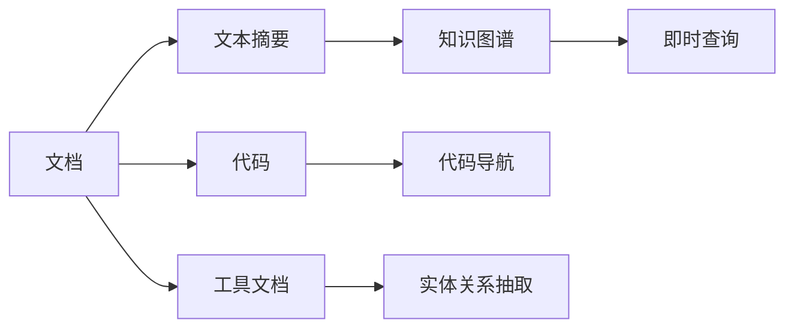

                 

## 1. 背景介绍

在当今快速变化的软件开发环境中，程序员需要不断适应新技术、新工具和新框架。然而，这种快速变化也带来了适应新技术所需的巨大压力，特别是当新环境涉及大量复杂和陌生领域时。知识发现引擎（Knowledge Discovery Engine, KDE）提供了一种创新方式，通过知识抽取和整合来加速程序员对新环境的适应。

### 1.1 问题由来
随着技术栈的不断演进，软件开发社区引入了一系列新的工具和框架，如微服务架构、容器化部署、云原生应用、分布式数据处理等。然而，这些新技术的出现不仅要求程序员掌握新的开发模式和编程技巧，还需要了解其背后的复杂概念和实现细节。因此，如何快速适应这些新技术成为业界共同面临的挑战。

### 1.2 问题核心关键点
KDE的核心思想是通过知识发现和整合来帮助程序员更快、更深入地理解新技术和新环境，从而减少学习曲线，提升工作效率。KDE的关键点包括：
- **知识抽取**：从各类资源（如文档、代码、博客等）中自动抽取关键信息，减少信息过载。
- **知识整合**：将抽取到的知识进行结构化整合，生成易于理解和操作的知识库。
- **知识查询和导航**：通过构建知识图谱，使程序员能够快速定位所需知识，并进行知识的关联查询和导航。

## 2. 核心概念与联系

### 2.1 核心概念概述

为了更好地理解KDE的工作原理和设计思路，本节将介绍几个核心概念及其关联性：

- **知识图谱**：一种以图形化形式展示实体和关系的知识库。通过构建知识图谱，程序员能够直观地了解新环境中的各种实体及其相互关系。
- **实体关系抽取**：从文本、代码和工具文档等非结构化数据中抽取实体及其关系，帮助程序员快速把握关键信息。
- **文本摘要**：将长篇文档自动生成简洁的摘要，便于程序员快速了解文档内容和关键信息。
- **代码导航**：通过代码分析和解析，提供代码结构、函数调用关系、变量引用等信息的展示，加速程序员对新代码的理解。
- **即时查询**：在开发过程中，通过即时查询工具快速获取所需知识，辅助决策和调试。

### 2.2 核心概念原理和架构的 Mermaid 流程图



通过上述流程图可以看出，KDE通过对不同类型的数据（文档、代码、工具文档等）进行抽取、整合和导航，帮助程序员快速掌握新环境中的关键知识。

## 3. 核心算法原理 & 具体操作步骤

### 3.1 算法原理概述

KDE的核心算法原理主要基于以下四个步骤：

1. **数据收集**：收集与新技术和新环境相关的各类文档、代码和工具文档等非结构化数据。
2. **知识抽取**：使用自然语言处理（NLP）、机器学习和数据挖掘等技术，从这些非结构化数据中抽取实体、关系和属性等信息。
3. **知识整合**：将抽取到的知识进行结构化处理，生成易于理解和操作的知识库。
4. **知识导航**：构建知识图谱和即时查询工具，提供快速定位和导航功能，辅助程序员理解和应用新知识。

### 3.2 算法步骤详解

#### 3.2.1 数据收集

在数据收集阶段，KDE需要从多个渠道获取与新环境相关的信息，包括：
- **代码库**：收集项目的源代码库，包含项目的结构、模块划分和依赖关系等信息。
- **文档库**：收集项目及其相关文档，如API文档、设计文档、用户手册等。
- **工具文档**：收集与新技术相关的工具和框架的文档，如Docker、Kubernetes、Git等。
- **社区资源**：收集社区论坛、博客、社交媒体等资源，获取关于新技术的讨论和使用案例。

#### 3.2.2 知识抽取

知识抽取是KDE的核心环节之一，其目标是自动从非结构化数据中抽取关键信息，生成结构化的知识库。主要步骤如下：

1. **文本预处理**：使用NLP技术进行文本清洗、分词、词性标注等预处理。
2. **实体识别**：识别文本中的命名实体，如类名、函数名、变量名等。
3. **关系抽取**：识别文本中的实体关系，如函数调用、变量引用、模块依赖等。
4. **属性抽取**：提取实体的属性信息，如函数参数、变量类型、方法签名等。

#### 3.2.3 知识整合

知识整合是将抽取到的知识进行结构化处理，生成易于理解和操作的知识库。主要步骤如下：

1. **实体关系建模**：将抽取到的实体和关系进行建模，构建知识图谱。
2. **知识分类和索引**：将知识进行分类和索引，方便程序员快速定位和导航。
3. **可视化展示**：使用图形化界面展示知识图谱，便于程序员直观理解。

#### 3.2.4 知识导航

知识导航是KDE的重要功能之一，通过构建知识图谱和即时查询工具，辅助程序员快速定位和理解新环境中的知识。主要步骤如下：

1. **知识图谱构建**：使用图算法构建知识图谱，展示实体和关系。
2. **即时查询引擎**：构建实时查询引擎，支持多方式（如关键字、路径、属性等）查询。
3. **导航功能**：提供导航功能，引导程序员从当前位置跳转到相关知识节点。

### 3.3 算法优缺点

#### 3.3.1 优点

1. **加速学习曲线**：通过自动抽取和整合知识，减少程序员的学习时间，快速掌握新环境。
2. **提升工作效率**：通过导航和查询功能，加速问题定位和调试，提升开发效率。
3. **跨领域适用**：适用于多种新环境和新技术，帮助程序员在不同领域快速适应。
4. **灵活扩展**：可以根据项目需求，灵活扩展和定制知识库。

#### 3.3.2 缺点

1. **数据质量依赖**：抽取和整合的知识质量高度依赖于源数据的质量。
2. **构建成本较高**：初始构建知识库需要大量时间和资源投入。
3. **动态更新困难**：需要持续更新和维护知识库，以适应新环境的变化。

### 3.4 算法应用领域

KDE技术广泛应用于软件开发中的多个环节，包括：

- **新环境适应**：帮助程序员快速适应新技术、新框架和新工具。
- **项目管理**：提供项目结构、模块划分和依赖关系等信息，辅助项目管理。
- **代码重构**：通过知识图谱和导航功能，辅助代码重构和优化。
- **持续集成和交付**：提供自动化测试和部署的知识库，加速持续集成和交付过程。
- **性能优化**：通过知识图谱和性能分析工具，辅助性能优化和调试。

## 4. 数学模型和公式 & 详细讲解 & 举例说明

### 4.1 数学模型构建

本节将使用数学语言对KDE的核心算法进行更加严格的刻画。

记新环境中的知识库为 $K=(E,R)$，其中 $E$ 表示实体集合，$R$ 表示实体关系集合。

KDE的数学模型构建包括以下几个步骤：

1. **实体抽取模型**：
   $$
   E = \{ e_1, e_2, \ldots, e_n \}
   $$
   其中 $e_i$ 表示第 $i$ 个实体，可以通过以下公式进行抽取：
   $$
   e_i = \text{NLP}(\text{doc}_i)
   $$
   其中 $\text{doc}_i$ 表示第 $i$ 个文档，$\text{NLP}$ 表示自然语言处理技术。

2. **关系抽取模型**：
   $$
   R = \{ r_{ij} \}
   $$
   其中 $r_{ij}$ 表示实体 $e_i$ 和 $e_j$ 之间的关系，可以通过以下公式进行抽取：
   $$
   r_{ij} = \text{Relation}(e_i, e_j, \text{doc}_{ij})
   $$
   其中 $\text{doc}_{ij}$ 表示实体 $e_i$ 和 $e_j$ 之间的文档，$\text{Relation}$ 表示关系抽取技术。

3. **知识图谱建模**：
   $$
   K = \{ (e_i, r_{ij}, e_j) \}
   $$
   其中 $(e_i, r_{ij}, e_j)$ 表示实体 $e_i$ 和 $e_j$ 之间的关系 $r_{ij}$，构成知识图谱的一条边。

4. **知识库更新和维护**：
   $$
   K^{t+1} = K^t \cup \{ (e_i^*, r_{ij}^*, e_j^*) \}
   $$
   其中 $K^{t+1}$ 表示更新后的知识库，$K^t$ 表示当前知识库，$(e_i^*, r_{ij}^*, e_j^*)$ 表示新增的实体和关系，$t$ 表示时间戳。

### 4.2 公式推导过程

以实体关系抽取为例，其数学推导过程如下：

设实体 $e_i$ 和 $e_j$ 之间的文档为 $\text{doc}_{ij}$，抽取关系 $r_{ij}$ 的算法步骤如下：

1. **文档预处理**：
   $$
   \text{preprocessed\_doc}_{ij} = \text{NLP}(\text{doc}_{ij})
   $$

2. **实体识别**：
   $$
   e_i = \text{NER}(\text{preprocessed\_doc}_{ij})
   $$
   $$
   e_j = \text{NER}(\text{preprocessed\_doc}_{ij})
   $$

3. **关系抽取**：
   $$
   r_{ij} = \text{Relation}(e_i, e_j, \text{preprocessed\_doc}_{ij})
   $$

其中，NER表示命名实体识别技术，Relation表示关系抽取技术。

### 4.3 案例分析与讲解

假设有一项目使用微服务架构，项目代码库包含多个模块，每个模块依赖其他模块。KDE通过代码分析和解析，抽取模块名、函数名、变量名等实体，并识别函数调用、变量引用等关系，构建知识图谱。

## 5. 项目实践：代码实例和详细解释说明

### 5.1 开发环境搭建

在进行KDE实践前，我们需要准备好开发环境。以下是使用Python进行PyTorch开发的环境配置流程：

1. 安装Anaconda：从官网下载并安装Anaconda，用于创建独立的Python环境。

2. 创建并激活虚拟环境：
```bash
conda create -n kde-env python=3.8 
conda activate kde-env
```

3. 安装PyTorch：根据CUDA版本，从官网获取对应的安装命令。例如：
```bash
conda install pytorch torchvision torchaudio cudatoolkit=11.1 -c pytorch -c conda-forge
```

4. 安装TensorFlow：由Google主导开发的开源深度学习框架，生产部署方便，适合大规模工程应用。同样有丰富的预训练语言模型资源。

5. 安装KDE相关的库：
```bash
pip install kde tools nlp data
```

完成上述步骤后，即可在`kde-env`环境中开始KDE实践。

### 5.2 源代码详细实现

下面我们以知识图谱构建为例，给出使用Python进行KDE开发和实现的代码示例。

首先，定义实体抽取和关系抽取函数：

```python
from transformers import pipeline

def extract_entities(doc):
    ner_pipeline = pipeline("ner", model="your_ner_model")
    return ner_pipeline(doc)

def extract_relations(e1, e2, doc):
    relation_pipeline = pipeline("relation", model="your_relation_model")
    return relation_pipeline((e1, e2, doc))
```

然后，定义知识图谱构建函数：

```python
def build_knowledge_graph(documents):
    graph = {}
    for doc in documents:
        entities = extract_entities(doc)
        for entity in entities:
            graph[entity] = {}
            for rel in extract_relations(entity, None, doc):
                graph[entity][rel] = None
    return graph
```

最后，通过构建知识图谱来辅助程序员理解新环境：

```python
documents = ["This is a module named 'my_module'"]
graph = build_knowledge_graph(documents)
print(graph)
```

以上就是使用Python进行KDE知识图谱构建的完整代码实现。可以看到，KDE的实现主要依赖于预训练的实体识别和关系抽取模型，能够从文本中自动抽取实体和关系，构建知识图谱。

### 5.3 代码解读与分析

让我们再详细解读一下关键代码的实现细节：

**NER和Relation函数**：
- `extract_entities`函数使用自然语言处理库进行命名实体识别，自动从文档抽取实体。
- `extract_relations`函数使用关系抽取技术，识别实体之间的关系。

**build_knowledge_graph函数**：
- 遍历所有文档，从每个文档中抽取实体和关系，构建知识图谱。
- 使用字典数据结构存储实体和关系，方便查询和导航。

**运行结果展示**：
- 打印构建的知识图谱，程序员可以直观地看到文档中的实体和关系。

## 6. 实际应用场景

### 6.1 智能代码助手

智能代码助手是KDE技术的重要应用场景之一。通过KDE技术，智能代码助手能够实时分析程序员的代码，提供代码建议、变量提示、函数调用等辅助信息，提升编程效率。

### 6.2 代码审查和重构

KDE技术可以辅助代码审查和重构过程，通过构建知识图谱和导航功能，快速定位代码中的问题，并提供修改建议，提升代码质量和重构效率。

### 6.3 持续集成和交付

在持续集成和交付过程中，KDE技术可以构建代码库的知识图谱，辅助自动化测试和部署，提升持续集成和交付的效率和准确性。

### 6.4 未来应用展望

随着KDE技术的不断发展，其在软件开发中的应用将更加广泛和深入。未来KDE技术可能会向以下几个方向发展：

1. **多模态知识抽取**：不仅限于文本信息，KDE技术可以扩展到音频、视频等多模态数据，提供更加全面和丰富的知识图谱。
2. **自适应学习**：KDE技术可以根据程序员的使用习惯和反馈，动态调整知识图谱的构建和展示，提供更加个性化的学习体验。
3. **协同开发支持**：KDE技术可以支持多人协同开发，提供代码协作、版本控制和版本回溯等功能，提升团队协作效率。
4. **跨语言和跨平台支持**：KDE技术可以支持多种编程语言和平台，为开发跨语言和跨平台应用提供支持。

## 7. 工具和资源推荐

### 7.1 学习资源推荐

为了帮助开发者系统掌握KDE的理论基础和实践技巧，这里推荐一些优质的学习资源：

1. **《知识发现与数据挖掘》**：经典教材，全面介绍了知识发现和数据挖掘的基本概念和算法。
2. **KDE官方文档**：KDE官方提供的详细文档，包含知识图谱构建、实体关系抽取、即时查询等技术的详细介绍。
3. **KDE案例研究**：社区分享的KDE应用案例，展示KDE技术在实际项目中的应用效果。
4. **KDE工具和库**：开源的KDE工具和库，如OntoGraph、Neo4j等，提供了构建和查询知识图谱的支持。

通过对这些资源的学习实践，相信你一定能够快速掌握KDE技术的精髓，并用于解决实际的开发问题。

### 7.2 开发工具推荐

高效的开发离不开优秀的工具支持。以下是几款用于KDE开发的常用工具：

1. **Jupyter Notebook**：交互式的开发环境，支持Python、R、SQL等多种语言。
2. **PyTorch**：基于Python的开源深度学习框架，适合快速迭代研究。
3. **TensorFlow**：由Google主导开发的开源深度学习框架，生产部署方便，适合大规模工程应用。
4. **NLTK**：自然语言处理库，提供了丰富的NLP工具和资源。
5. **Gephi**：可视化工具，支持构建和展示知识图谱。
6. **Spacy**：自然语言处理库，提供了实体识别、关系抽取等功能。

合理利用这些工具，可以显著提升KDE开发的效率，加快创新迭代的步伐。

### 7.3 相关论文推荐

KDE技术的发展源于学界的持续研究。以下是几篇奠基性的相关论文，推荐阅读：

1. **《知识抽取与表示》**：介绍知识抽取和表示的基本方法，包括命名实体识别、关系抽取等。
2. **《基于知识图谱的信息检索》**：介绍知识图谱在信息检索中的应用，通过知识图谱提高检索效果。
3. **《自然语言处理中的知识发现》**：介绍自然语言处理中的知识发现技术，涵盖命名实体识别、实体关系抽取等。
4. **《自适应知识抽取》**：介绍自适应知识抽取技术，能够根据领域特点动态调整抽取策略。
5. **《知识图谱的构建与查询》**：介绍知识图谱的构建和查询技术，涵盖实体关系建模、图谱可视化等。

这些论文代表了大数据知识发现技术的发展脉络。通过学习这些前沿成果，可以帮助研究者把握学科前进方向，激发更多的创新灵感。

## 8. 总结：未来发展趋势与挑战

### 8.1 总结

本文对KDE技术的背景、核心概念和具体实现进行了全面系统的介绍。首先阐述了KDE技术的背景和应用意义，明确了知识发现和整合在程序员快速适应新环境中的独特价值。其次，从原理到实践，详细讲解了KDE的核心算法和具体操作步骤，给出了KDE任务开发的完整代码实例。同时，本文还广泛探讨了KDE技术在软件开发中的应用场景，展示了KDE技术的广泛应用前景。此外，本文精选了KDE技术的各类学习资源，力求为读者提供全方位的技术指引。

通过本文的系统梳理，可以看到，KDE技术正在成为软件开发中的重要工具，帮助程序员快速适应新技术，提升开发效率。未来，伴随知识图谱和自然语言处理技术的不断进步，KDE技术必将在软件开发中发挥更大的作用，为构建智能、高效的软件开发环境提供有力支持。

### 8.2 未来发展趋势

展望未来，KDE技术将呈现以下几个发展趋势：

1. **多模态数据支持**：KDE技术将扩展到更多模态数据，如音频、视频、图像等，提供更全面的知识图谱和知识抽取能力。
2. **自适应学习**：KDE技术将根据程序员的使用习惯和反馈，动态调整知识图谱的构建和展示，提供更加个性化的学习体验。
3. **协同开发支持**：KDE技术将支持多人协同开发，提供代码协作、版本控制和版本回溯等功能，提升团队协作效率。
4. **跨平台支持**：KDE技术将支持多种编程语言和平台，为开发跨语言和跨平台应用提供支持。
5. **实时知识更新**：KDE技术将实时更新和维护知识图谱，确保知识的时效性和准确性。

以上趋势凸显了KDE技术的广阔前景。这些方向的探索发展，必将进一步提升KDE技术的实用性，为程序员提供更加全面和高效的工具支持。

### 8.3 面临的挑战

尽管KDE技术已经取得了一定的成就，但在迈向更加智能化、普适化应用的过程中，它仍面临着诸多挑战：

1. **数据质量依赖**：KDE技术依赖于高质量的数据，低质量的数据可能导致知识图谱不准确。
2. **构建成本较高**：初始构建知识图谱需要大量时间和资源投入。
3. **动态更新困难**：知识图谱需要持续更新和维护，以适应新环境的变化。
4. **跨领域适应性**：KDE技术在不同领域的应用效果可能不一致，需要针对特定领域进行优化。

### 8.4 研究展望

面对KDE技术面临的挑战，未来的研究需要在以下几个方面寻求新的突破：

1. **自动化构建**：开发更加自动化和智能化的知识图谱构建工具，降低人工干预。
2. **多语言支持**：支持多种编程语言和平台，提升KDE技术的跨语言和跨平台适应性。
3. **自适应学习**：研究自适应学习算法，提高KDE技术在不同领域和场景下的适应性。
4. **知识融合**：将其他领域的知识融合到知识图谱中，提升KDE技术的多领域应用能力。

这些研究方向将推动KDE技术向更加智能和普适化的方向发展，为程序员提供更加全面和高效的工具支持。

## 9. 附录：常见问题与解答

**Q1：KDE如何帮助程序员适应新技术？**

A: KDE通过抽取和整合知识图谱，帮助程序员快速掌握新环境中的关键信息，包括模块依赖、函数调用、变量引用等，从而降低学习曲线，提升适应速度。

**Q2：如何选择合适的知识抽取模型？**

A: 选择合适的知识抽取模型需要考虑数据特点、任务需求和模型性能。常用的知识抽取模型包括NLP模型（如BERT、GPT等）、关系抽取模型（如NEO等）等。

**Q3：KDE的开发成本高吗？**

A: KDE的开发成本较高，主要是因为初始构建知识图谱需要大量时间和资源投入。但一旦构建完成，后续的维护和更新成本将大大降低。

**Q4：KDE如何处理知识图谱的动态更新？**

A: KDE可以通过定期更新和增量更新来处理知识图谱的动态变化。同时，使用分布式存储和计算技术，提升知识图谱的更新效率。

**Q5：KDE与传统代码审查工具相比有何优势？**

A: KDE提供了更加全面和深入的知识图谱，能够辅助程序员进行更详细的代码审查和重构，提升代码质量和开发效率。

综上所述，KDE技术在程序员快速适应新环境、提升开发效率等方面具有重要意义。随着技术的发展和优化，KDE必将在软件开发中发挥更大的作用，成为程序员不可或缺的工具。

---

作者：禅与计算机程序设计艺术 / Zen and the Art of Computer Programming

