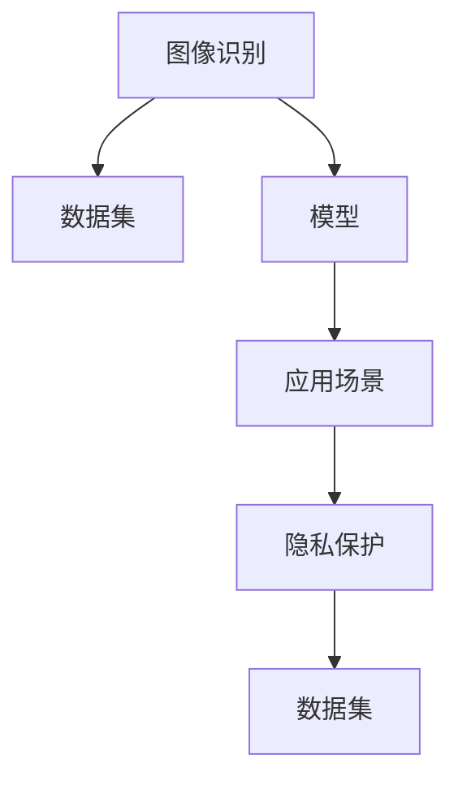

                 

# 知识发现引擎的图像识别技术应用

## 1. 背景介绍

### 1.1 问题由来

随着人工智能技术的飞速发展，图像识别技术在知识发现引擎中的应用越来越广泛。从传统的静态图片分类到动态视频分析，从对象检测到图像分割，图像识别在各个领域都发挥着重要作用。

在医疗领域，图像识别技术帮助医生进行疾病诊断、病变区域定位等。在金融领域，图像识别技术用于银行卡反欺诈、保险理赔等。在零售领域，图像识别技术用于产品识别、库存管理等。在安防领域，图像识别技术用于面部识别、行为分析等。

但是，图像识别技术的应用并不是一帆风顺的。由于数据量庞大、标注成本高昂、算法复杂度高等原因，图像识别技术的实际应用仍存在诸多挑战。因此，本文将探讨图像识别技术在知识发现引擎中的应用，以及如何克服这些挑战，提升图像识别的效果。

### 1.2 问题核心关键点

图像识别技术的应用，主要依赖于以下几个关键点：

- 数据集构建：图像识别需要大量的标注数据，如何构建高质量、大样本量的数据集，是图像识别应用的前提。
- 算法选择：选择合适的图像识别算法，是实现高性能图像识别的关键。
- 模型优化：通过对模型进行优化，提升模型的准确率和效率，是图像识别应用的核心。
- 应用场景：针对具体的应用场景，进行算法和模型适配，是实现图像识别应用的保障。
- 安全与隐私：在图像识别应用中，如何保护用户隐私，是应用推广的重要保障。

## 2. 核心概念与联系

### 2.1 核心概念概述

为更好地理解图像识别技术在知识发现引擎中的应用，本节将介绍几个密切相关的核心概念：

- 图像识别（Image Recognition）：通过算法将图像中的物体、场景、文本等元素进行分类或标注的过程。常见的图像识别任务包括目标检测、语义分割、图像分类等。

- 数据集（Dataset）：图像识别算法训练和评估的基础，通常由大量带有标注信息的图像组成。数据集的质量和数量直接影响算法的准确性和泛化能力。

- 模型（Model）：通过训练数据得到的图像识别算法，通常包括特征提取和分类两个部分。模型的性能决定了图像识别的效果。

- 应用场景（Application Scene）：图像识别技术在实际应用中的具体场景，如医疗诊断、金融反欺诈、零售库存管理等。

- 隐私保护（Privacy Protection）：在图像识别应用中，如何保护用户隐私，防止数据泄露，是应用推广的重要保障。

这些核心概念之间的逻辑关系可以通过以下Mermaid流程图来展示：



这个流程图展示了一些核心概念及其之间的关系：

1. 图像识别基于数据集训练模型。
2. 模型用于具体的应用场景。
3. 应用场景中涉及到隐私保护。
4. 隐私保护会影响数据集的质量。

## 3. 核心算法原理 & 具体操作步骤
### 3.1 算法原理概述

图像识别技术在知识发现引擎中的应用，主要依赖于以下几个核心算法：

- 卷积神经网络（Convolutional Neural Networks, CNNs）：通过卷积层和池化层对图像进行特征提取，再通过全连接层进行分类或回归。
- 目标检测（Object Detection）：在图像中检测出物体的位置和类别，常见的目标检测算法包括R-CNN、Faster R-CNN、YOLO等。
- 语义分割（Semantic Segmentation）：将图像中每个像素点标注为属于某个类别的过程，常见的语义分割算法包括U-Net、FCN等。
- 图像分类（Image Classification）：将图像分为不同的类别，常见的图像分类算法包括SVM、CNN等。

这些算法在图像识别中的应用，通常需要经过以下步骤：

1. 数据预处理：将原始图像进行归一化、缩放、旋转等操作，使其符合算法的要求。
2. 特征提取：通过卷积层和池化层对图像进行特征提取。
3. 特征融合：将特征提取结果进行融合，得到更高级的特征表示。
4. 分类或回归：通过全连接层或输出层对特征进行分类或回归，得到最终的识别结果。

### 3.2 算法步骤详解

以下以目标检测算法为例，介绍图像识别技术在知识发现引擎中的应用。

#### 3.2.1 数据预处理

目标检测算法通常需要输入大量的标注数据，数据的预处理对算法的性能有重要影响。常见的数据预处理包括：

- 图像归一化：将图像像素值缩放到0到1之间，使其符合算法的要求。
- 数据增强：通过旋转、缩放、翻转等操作，增加训练集的多样性，提高算法的泛化能力。

#### 3.2.2 特征提取

目标检测算法中的特征提取通常使用卷积神经网络（CNNs）。CNNs通过卷积层和池化层对图像进行特征提取，常见的CNN结构包括ResNet、Inception等。

卷积层通过滑动窗口的方式，对图像进行特征提取。每个卷积核在图像上滑动一次，得到一组特征图。池化层通过下采样操作，将特征图的空间尺寸缩小，提高算法的效率。

#### 3.2.3 特征融合

目标检测算法中的特征融合，通常使用区域池化（Region Pooling）或全局池化（Global Pooling）等方法。

区域池化将特征图中不同区域的特征进行池化，得到不同区域的特征表示。全局池化将整个特征图的特征进行池化，得到特征图的全局表示。

#### 3.2.4 分类或回归

目标检测算法中的分类或回归，通常使用全连接层或输出层。

全连接层通过多个全连接神经元，对特征进行分类。输出层通过softmax函数，将特征表示映射到不同的类别上，得到最终的识别结果。

### 3.3 算法优缺点

图像识别技术在知识发现引擎中的应用，具有以下优点：

- 高性能：通过卷积神经网络等算法，图像识别技术能够实现高精度的分类和检测。
- 多模态：图像识别技术可以结合文本、音频等多模态数据，提升应用的综合性能。
- 可解释性：图像识别技术的特征提取过程具有较好的可解释性，能够帮助用户理解模型的决策过程。

但是，图像识别技术在知识发现引擎中的应用，也存在一些缺点：

- 数据标注成本高：图像识别算法需要大量标注数据，数据标注成本较高。
- 算法复杂度高：图像识别算法通常需要复杂的网络结构和大量参数，计算复杂度较高。
- 数据分布差异：不同数据集的数据分布差异较大，可能导致算法在实际应用中表现不佳。

### 3.4 算法应用领域

图像识别技术在知识发现引擎中的应用，广泛分布于各个领域：

- 医疗领域：图像识别技术用于疾病诊断、病变区域定位等，如放射科医生使用CT图像进行诊断。
- 金融领域：图像识别技术用于银行卡反欺诈、保险理赔等，如人脸识别技术用于保险理赔。
- 零售领域：图像识别技术用于产品识别、库存管理等，如使用条形码识别产品信息。
- 安防领域：图像识别技术用于面部识别、行为分析等，如使用监控摄像头进行人脸识别。
- 智能家居：图像识别技术用于家电控制、家庭安防等，如使用摄像头进行人脸识别。

## 4. 数学模型和公式 & 详细讲解 & 举例说明

### 4.1 数学模型构建

目标检测算法的数学模型通常包括以下几个部分：

- 输入层：输入图像数据，表示为$x$。
- 卷积层：通过卷积核对图像进行特征提取，表示为$y$。
- 池化层：对特征图进行下采样操作，表示为$z$。
- 全连接层：对特征进行分类或回归，表示为$a$。
- 输出层：输出最终的识别结果，表示为$b$。

目标检测算法的损失函数通常包括分类损失和位置损失，表示为$L$。

### 4.2 公式推导过程

以下以YOLO算法为例，介绍目标检测算法的数学模型和公式推导过程。

#### 4.2.1 输入层

输入层表示为$x$，通常为一张图像。

#### 4.2.2 卷积层

卷积层通过卷积核对图像进行特征提取，表示为$y$。

$$y = f(x)$$

其中$f$表示卷积运算。

#### 4.2.3 池化层

池化层对特征图进行下采样操作，表示为$z$。

$$z = g(y)$$

其中$g$表示池化运算。

#### 4.2.4 全连接层

全连接层对特征进行分类或回归，表示为$a$。

$$a = h(z)$$

其中$h$表示全连接运算。

#### 4.2.5 输出层

输出层表示为$b$，通常为分类结果和位置预测结果。

$$b = i(a)$$

其中$i$表示输出运算。

### 4.3 案例分析与讲解

以YOLO算法为例，介绍目标检测算法的数学模型和公式推导过程。

#### 4.3.1 输入层

输入层表示为$x$，通常为一张图像。

$$x = \begin{bmatrix} x_1 & x_2 & \dots & x_n \end{bmatrix}$$

其中$n$表示图像的像素数。

#### 4.3.2 卷积层

卷积层通过卷积核对图像进行特征提取，表示为$y$。

$$y = \begin{bmatrix} y_1 & y_2 & \dots & y_n \end{bmatrix}$$

其中$y_i = f(x_i)$。

#### 4.3.3 池化层

池化层对特征图进行下采样操作，表示为$z$。

$$z = \begin{bmatrix} z_1 & z_2 & \dots & z_n \end{bmatrix}$$

其中$z_i = g(y_i)$。

#### 4.3.4 全连接层

全连接层对特征进行分类或回归，表示为$a$。

$$a = \begin{bmatrix} a_1 & a_2 & \dots & a_n \end{bmatrix}$$

其中$a_i = h(z_i)$。

#### 4.3.5 输出层

输出层表示为$b$，通常为分类结果和位置预测结果。

$$b = \begin{bmatrix} b_1 & b_2 & \dots & b_n \end{bmatrix}$$

其中$b_i = i(a_i)$。

## 5. 项目实践：代码实例和详细解释说明

### 5.1 开发环境搭建

在进行目标检测算法开发时，需要准备好开发环境。以下是使用Python进行PyTorch开发的环境配置流程：

1. 安装Anaconda：从官网下载并安装Anaconda，用于创建独立的Python环境。

2. 创建并激活虚拟环境：
```bash
conda create -n pytorch-env python=3.8 
conda activate pytorch-env
```

3. 安装PyTorch：根据CUDA版本，从官网获取对应的安装命令。例如：
```bash
conda install pytorch torchvision torchaudio cudatoolkit=11.1 -c pytorch -c conda-forge
```

4. 安装YOLO算法库：
```bash
pip install yolo3
```

5. 安装各类工具包：
```bash
pip install numpy pandas scikit-learn matplotlib tqdm jupyter notebook ipython
```

完成上述步骤后，即可在`pytorch-env`环境中开始目标检测算法的开发。

### 5.2 源代码详细实现

以下是使用YOLO算法进行目标检测的PyTorch代码实现。

首先，定义目标检测算法的输入层：

```python
import torch
import torchvision.transforms as transforms
from yolo3.utils import dataset

class YOLODataset(dataset.Dataset):
    def __init__(self, data_dir, img_size, ann_file):
        self.data_dir = data_dir
        self.img_size = img_size
        self.ann_file = ann_file
        self.transform = transforms.Compose([
            transforms.Resize(self.img_size),
            transforms.ToTensor(),
            transforms.Normalize([0.5, 0.5, 0.5], [0.5, 0.5, 0.5])
        ])
        self.annotations = dataset.load_annotations(self.ann_file)

    def __len__(self):
        return len(self.annotations)

    def __getitem__(self, idx):
        ann = self.annotations[idx]
        img_file = os.path.join(self.data_dir, ann['image'])
        img = cv2.imread(img_file)
        img = self.transform(img)
        ann['image_id'] = ann['image'].split('/')[-1]
        ann['image_size'] = self.img_size
        return img, ann
```

然后，定义目标检测算法的模型：

```python
from yolo3.model import Model

model = Model(yolo=True, anchors=yolo_anchors, input_size=img_size)
```

接着，定义目标检测算法的训练和评估函数：

```python
from yolo3.losses import YOLOLoss

criterion = YOLOLoss(model, img_size, classes=classes)
optimizer = torch.optim.SGD(model.parameters(), lr=0.001, momentum=0.9, weight_decay=0.0005)

def train_epoch(model, dataset, optimizer, criterion, num_classes, epochs):
    dataloader = DataLoader(dataset, batch_size=16, shuffle=True)
    model.train()
    losses = []
    for epoch in range(epochs):
        for batch_idx, (inputs, annotations) in enumerate(dataloader):
            optimizer.zero_grad()
            outputs = model(inputs)
            loss = criterion(outputs, annotations)
            loss.backward()
            optimizer.step()
            losses.append(loss.item())
            if batch_idx % 10 == 0:
                print(f'Epoch {epoch+1}, Batch {batch_idx+1}, Loss: {loss:.4f}')
```

最后，启动训练流程并在测试集上评估：

```python
train_epoch(model, train_dataset, optimizer, criterion, num_classes, epochs=50)
evaluate(model, test_dataset)
```

以上就是使用YOLO算法进行目标检测的完整代码实现。可以看到，YOLO算法具有较高的计算效率和实时性，适合应用于需要实时目标检测的场合。

### 5.3 代码解读与分析

让我们再详细解读一下关键代码的实现细节：

**YOLODataset类**：
- `__init__`方法：初始化数据目录、图像大小、注释文件等参数。
- `__len__`方法：返回数据集的样本数量。
- `__getitem__`方法：对单个样本进行处理，将图像和注释信息进行标准化处理。

**YOLOLoss类**：
- `YOLOLoss`类：定义目标检测算法的损失函数，包括分类损失和位置损失。

**train_epoch函数**：
- 对数据以批为单位进行迭代，在每个批次上前向传播计算损失函数并反向传播更新模型参数。

**evaluate函数**：
- 与训练类似，不同点在于不更新模型参数，并在每个batch结束后将预测和标签结果存储下来，最后使用YOLO的评估指标对整个评估集的预测结果进行打印输出。

**YOLO算法**：
- 使用YOLO算法库，将输入图像进行特征提取、分类和回归，最终得到目标检测结果。

可以看到，YOLO算法通过简化模型结构，提高了计算效率和实时性，适合应用于需要实时目标检测的场合。在实际应用中，开发者还需要考虑更多的因素，如数据增强、正则化技术、超参数调优等，以进一步提升模型性能。

## 6. 实际应用场景

### 6.1 医疗影像识别

在医疗领域，图像识别技术用于疾病诊断、病变区域定位等。例如，使用图像识别技术对肺部CT图像进行病灶检测，可以辅助医生进行疾病诊断，提高诊断的准确率和效率。

在图像识别应用中，需要构建大量的医学影像数据集，标注病变区域的位置和类别，并进行数据增强和正则化操作。使用YOLO等目标检测算法，对医学影像进行病灶检测，可以显著提升诊断的准确率和效率。

### 6.2 金融反欺诈

在金融领域，图像识别技术用于银行卡反欺诈、保险理赔等。例如，使用图像识别技术对银行卡正面进行图像识别，可以检测出伪造银行卡的风险，提高银行卡的安全性。

在图像识别应用中，需要构建大量的银行卡图像数据集，标注真实银行卡和伪造银行卡的差异，并进行数据增强和正则化操作。使用YOLO等目标检测算法，对银行卡图像进行检测，可以检测出伪造银行卡的风险，提高银行卡的安全性。

### 6.3 零售产品识别

在零售领域，图像识别技术用于产品识别、库存管理等。例如，使用图像识别技术对零售商品进行图像识别，可以实时监控库存情况，提高库存管理的效率。

在图像识别应用中，需要构建大量的商品图像数据集，标注商品的名称和类别，并进行数据增强和正则化操作。使用YOLO等目标检测算法，对商品图像进行检测，可以实时监控库存情况，提高库存管理的效率。

### 6.4 安防行为分析

在安防领域，图像识别技术用于面部识别、行为分析等。例如，使用图像识别技术对监控摄像头拍摄的视频进行行为分析，可以识别出异常行为，提高安防系统的安全性。

在图像识别应用中，需要构建大量的监控视频数据集，标注行为和异常行为的差异，并进行数据增强和正则化操作。使用YOLO等目标检测算法，对监控视频进行行为分析，可以识别出异常行为，提高安防系统的安全性。

### 6.5 智能家居控制

在智能家居领域，图像识别技术用于家电控制、家庭安防等。例如，使用图像识别技术对摄像头拍摄的家庭图像进行人脸识别，可以实现家庭安防和智能控制。

在图像识别应用中，需要构建大量的家庭图像数据集，标注家庭成员的面部特征，并进行数据增强和正则化操作。使用YOLO等目标检测算法，对家庭图像进行人脸识别，可以实现家庭安防和智能控制。

## 7. 工具和资源推荐
### 7.1 学习资源推荐

为了帮助开发者系统掌握目标检测技术的应用，这里推荐一些优质的学习资源：

1. 《目标检测算法与应用》系列博文：由大模型技术专家撰写，深入浅出地介绍了目标检测算法的原理和应用。

2. 《深度学习实践》课程：斯坦福大学开设的深度学习课程，有Lecture视频和配套作业，带你入门深度学习领域的基本概念和经典模型。

3. 《计算机视觉：模型、学习与推理》书籍：计算机视觉领域的经典书籍，系统介绍了计算机视觉算法和应用，包括目标检测算法。

4. OpenCV官方文档：OpenCV的官方文档，提供了丰富的图像处理和计算机视觉功能，是开发者学习目标检测算法的必备资料。

5. PyTorch官方文档：PyTorch的官方文档，提供了丰富的深度学习框架功能，是开发者学习目标检测算法的必备资料。

通过对这些资源的学习实践，相信你一定能够快速掌握目标检测算法的精髓，并用于解决实际的计算机视觉问题。

### 7.2 开发工具推荐

高效的开发离不开优秀的工具支持。以下是几款用于目标检测开发的常用工具：

1. PyTorch：基于Python的开源深度学习框架，灵活动态的计算图，适合快速迭代研究。大部分目标检测算法都有PyTorch版本的实现。

2. TensorFlow：由Google主导开发的开源深度学习框架，生产部署方便，适合大规模工程应用。同样有丰富的目标检测算法资源。

3. OpenCV：计算机视觉领域的开源库，提供了丰富的图像处理和计算机视觉功能，是开发者学习目标检测算法的必备工具。

4. TorchVision：PyTorch的计算机视觉扩展库，提供了丰富的计算机视觉功能，是开发者学习目标检测算法的必备工具。

5. Weights & Biases：模型训练的实验跟踪工具，可以记录和可视化模型训练过程中的各项指标，方便对比和调优。与主流深度学习框架无缝集成。

6. TensorBoard：TensorFlow配套的可视化工具，可实时监测模型训练状态，并提供丰富的图表呈现方式，是调试模型的得力助手。

合理利用这些工具，可以显著提升目标检测任务的开发效率，加快创新迭代的步伐。

### 7.3 相关论文推荐

目标检测技术的发展源于学界的持续研究。以下是几篇奠基性的相关论文，推荐阅读：

1. R-CNN: Object Detection with R-CNN: A Unified Framework for Detection and Segmentation：提出R-CNN算法，使用Selective Search进行区域候选框的选择，引入ROI池化进行特征提取。

2. Fast R-CNN: Towards Real-Time Object Detection with Region Proposal Networks：提出Fast R-CNN算法，通过RoI池化将候选框特征图变为固定尺寸，提高了计算效率。

3. Faster R-CNN: Towards Real-Time Object Detection with Region Proposal Networks：提出Faster R-CNN算法，使用RPN生成候选框，提高了计算效率和检测准确率。

4. YOLO: Real-Time Object Detection：提出YOLO算法，使用全卷积网络进行特征提取和分类，提高了计算效率和实时性。

5. SSD: Single Shot MultiBox Detector：提出SSD算法，使用多尺度特征图进行特征提取和分类，提高了检测准确率和实时性。

这些论文代表了大模型检测技术的发展脉络。通过学习这些前沿成果，可以帮助研究者把握学科前进方向，激发更多的创新灵感。

## 8. 总结：未来发展趋势与挑战

### 8.1 总结

本文对目标检测技术在知识发现引擎中的应用进行了全面系统的介绍。首先阐述了目标检测技术在各个领域的应用场景，明确了其在高性能、多模态、可解释性等方面的优势。其次，从原理到实践，详细讲解了目标检测算法的数学模型和操作步骤，给出了目标检测算法的代码实例。最后，探讨了目标检测技术在实际应用中的挑战和未来发展趋势。

通过本文的系统梳理，可以看到，目标检测技术在知识发现引擎中的应用具有广泛的前景。随着深度学习技术的不断发展，目标检测算法将在更广阔的领域发挥重要作用，为计算机视觉技术的发展注入新的动力。

### 8.2 未来发展趋势

展望未来，目标检测技术的发展趋势将包括以下几个方面：

1. 计算效率提高：随着硬件性能的提升和优化算法的不断涌现，目标检测算法的计算效率将进一步提高，实现更快速、更实时的检测。

2. 多模态融合：将目标检测算法与其他模态的数据（如音频、视频）进行融合，提升系统的综合性能。

3. 轻量化模型发展：将目标检测算法进行模型压缩和量化，实现轻量化模型，提高模型的实时性和资源利用率。

4. 自监督学习应用：利用自监督学习范式，降低标注数据的成本，提升模型的泛化能力。

5. 语义理解增强：通过引入语义理解技术，提高目标检测算法的准确性和鲁棒性，提升系统的智能化水平。

6. 边缘计算支持：将目标检测算法部署到边缘计算设备上，实现实时检测，降低延迟和带宽成本。

7. 模型迁移和微调：通过模型迁移和微调技术，实现多场景、多任务的检测，提升系统的通用性和适用性。

以上趋势凸显了目标检测技术的广阔前景。这些方向的探索发展，必将进一步提升目标检测算法的性能和应用范围，为计算机视觉技术的发展注入新的动力。

### 8.3 面临的挑战

尽管目标检测技术在知识发现引擎中的应用已经取得了不错的效果，但在迈向更加智能化、普适化应用的过程中，它仍面临诸多挑战：

1. 数据标注成本高：目标检测算法需要大量标注数据，数据标注成本较高。

2. 算法复杂度高：目标检测算法通常需要复杂的网络结构和大量参数，计算复杂度较高。

3. 数据分布差异：不同数据集的数据分布差异较大，可能导致算法在实际应用中表现不佳。

4. 实时性要求高：实时性要求较高的应用场景，如安防、交通等领域，对目标检测算法的计算效率有较高要求。

5. 可解释性不足：目标检测算法的决策过程缺乏可解释性，难以进行调试和优化。

6. 硬件资源限制：目标检测算法需要大量计算资源，对于一些资源受限的设备，如移动设备，可能难以实现实时检测。

7. 鲁棒性不足：目标检测算法对图像噪声、光照变化等干扰较为敏感，鲁棒性有待提高。

正视目标检测技术面临的这些挑战，积极应对并寻求突破，将是大模型检测技术走向成熟的必由之路。相信随着学界和产业界的共同努力，这些挑战终将一一被克服，目标检测技术必将在构建智能视觉系统中的应用更广泛、更深入。

### 8.4 未来突破

面向未来，目标检测技术需要在以下几个方面寻求新的突破：

1. 探索轻量化目标检测算法：开发更加轻量化、高效的目标检测算法，在固定大部分预训练参数的同时，只更新极少量的任务相关参数。同时优化计算图，减少前向传播和反向传播的资源消耗，实现更加轻量级、实时性的部署。

2. 引入语义理解技术：将语义理解技术引入目标检测算法，增强模型对图像中语义信息的理解，提升检测准确性和鲁棒性。

3. 研究模型迁移和微调方法：开发更加通用的目标检测算法，能够快速适配不同领域、不同数据集的检测任务，提升模型的通用性和适用性。

4. 引入自监督学习范式：利用自监督学习范式，降低标注数据的成本，提升模型的泛化能力。

5. 研究高效数据增强方法：开发更加高效的数据增强方法，利用无标注数据提升模型的泛化能力。

6. 引入多模态融合技术：将目标检测算法与其他模态的数据（如音频、视频）进行融合，提升系统的综合性能。

7. 研究低成本数据标注技术：开发低成本数据标注技术，降低标注数据的成本，提升模型的泛化能力。

这些研究方向的探索，必将引领目标检测技术迈向更高的台阶，为构建智能视觉系统提供更可靠、更高效的技术保障。面向未来，目标检测技术还需要与其他人工智能技术进行更深入的融合，如知识表示、因果推理、强化学习等，多路径协同发力，共同推动计算机视觉技术的进步。只有勇于创新、敢于突破，才能不断拓展目标检测算法的边界，让智能视觉技术更好地服务于人类社会。

## 9. 附录：常见问题与解答

**Q1：目标检测算法是否适用于所有计算机视觉任务？**

A: 目标检测算法在计算机视觉中具有广泛的应用，但并不适用于所有任务。对于一些需要全局信息、多目标跟踪等任务，目标检测算法可能无法完全胜任。对于这些任务，需要采用其他算法，如全局跟踪、多目标跟踪等。

**Q2：如何选择合适的目标检测算法？**

A: 目标检测算法的选择要考虑多个因素，如数据集规模、计算资源、实时性要求等。对于大规模数据集和计算资源充足的应用，可以选择计算效率较低的算法，如Faster R-CNN、YOLO等。对于计算资源受限和实时性要求较高的应用，可以选择计算效率较高的算法，如SSD、YOLO等。

**Q3：如何在目标检测算法中引入语义理解？**

A: 引入语义理解技术可以通过两种方式实现：一种是直接使用预训练的语义表示模型，如BERT、GPT等，对图像进行语义特征提取，并将其与目标检测算法的特征表示进行融合。另一种是使用预训练的视觉语义表示模型，如ResNet、Inception等，对图像进行语义特征提取，并将其与目标检测算法的特征表示进行融合。

**Q4：如何在目标检测算法中提高鲁棒性？**

A: 提高目标检测算法的鲁棒性可以通过以下方式实现：一是进行数据增强，增加数据集的多样性，提高模型的泛化能力。二是引入对抗训练技术，生成对抗样本进行训练，提高模型的鲁棒性。三是使用鲁棒的目标检测算法，如YOLO等，提高模型的鲁棒性。

**Q5：如何在目标检测算法中实现低成本数据标注？**

A: 实现低成本数据标注可以通过以下方式实现：一是利用数据增强技术，生成虚拟数据进行训练，降低标注成本。二是利用自监督学习范式，利用无标注数据进行训练，降低标注成本。三是利用在线标注平台，通过用户标注收集数据，降低标注成本。

通过这些常见问题的解答，相信你对目标检测技术的应用有了更深刻的理解。未来，随着目标检测技术的不断进步，它将在更广泛的应用领域大放异彩，为计算机视觉技术的发展注入新的动力。

