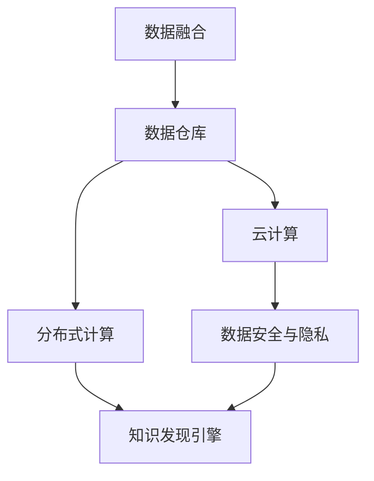

                 

# 知识发现引擎的多平台整合方案

> 关键词：知识发现引擎,多平台整合,数据融合,分布式计算,云计算,数据安全,数据隐私

## 1. 背景介绍

### 1.1 问题由来

在信息化快速发展的今天，数据已成为一个组织的核心资产。如何高效地从海量数据中发现知识，将数据转化为生产力，是企业关注的重点。知识发现引擎(Knowledge Discovery Engine, KDE)通过数据挖掘和分析，帮助企业快速获取有价值的信息，提升决策效率和竞争优势。

然而，企业的信息化建设往往采用多个独立系统，数据分散在不同的平台和存储中，难以实现无缝整合。同时，数据量的激增和业务的多样化，也给知识发现带来巨大挑战。多平台多数据源的整合、高性能计算和存储的支撑、数据安全与隐私保护，成为知识发现引擎应用过程中亟待解决的问题。

### 1.2 问题核心关键点

为了克服以上问题，本文聚焦于知识发现引擎的多平台整合方案，旨在通过构建统一的数据仓库，利用分布式计算与云计算技术，实现高效、安全、可靠的知识发现服务。

主要研究问题包括：
- 如何高效整合异构平台的多源数据，构建统一的数据仓库？
- 如何利用分布式计算与云计算技术，提供高性能的数据处理能力？
- 如何保障数据在传输、存储和处理过程中的安全性与隐私？
- 如何在多平台环境中实现知识发现引擎的易用性与可扩展性？

### 1.3 问题研究意义

企业信息化水平的提升，离不开高效的知识发现引擎。知识发现引擎不仅能帮助企业快速把握市场动态，优化产品设计，还能在风险评估、客户关系管理等方面提供有力支撑。

本文通过设计一个多平台整合的通用知识发现引擎框架，旨在解决现有知识发现引擎在数据整合、计算性能、数据安全等方面的不足，提升知识发现的能力和效率，为企业的数字化转型提供有力支持。

## 2. 核心概念与联系

### 2.1 核心概念概述

为更好地理解本文涉及的核心概念，本节将介绍以下几个密切相关的核心概念：

- **知识发现引擎(KDE)**：利用数据挖掘和机器学习技术，从数据中自动发现模式、关联、趋势等有价值信息。
- **多平台整合**：将不同平台、不同格式的数据整合到一个统一的存储系统中，构建统一的数据仓库。
- **分布式计算**：通过多台计算机协同工作，实现并行处理海量数据。
- **云计算**：利用互联网提供按需动态的资源，以支撑企业信息化需求。
- **数据安全与隐私**：在数据存储、传输和处理过程中，确保数据的安全性和隐私保护。
- **数据融合**：将多个数据源的数据集成到一个系统中，形成一个统一的数据集。

这些核心概念之间存在紧密的联系。数据融合是构建数据仓库的基础，而数据仓库是知识发现的前提。分布式计算和云计算技术为数据处理提供了高性能的计算资源。数据安全与隐私保护则是知识发现过程中必须考虑的因素。

### 2.2 核心概念原理和架构的 Mermaid 流程图



通过上述流程图，可以看出知识发现引擎的多平台整合方案主要包含以下四个部分：

1. 数据融合：将不同平台、格式的数据整合到统一的数据仓库。
2. 数据仓库：构建统一的数据存储，为知识发现提供数据支持。
3. 分布式计算：通过多台计算机协同处理海量数据。
4. 云计算：利用互联网提供的高性能计算资源，支撑数据处理需求。

这些部分共同构成了知识发现引擎的多平台整合方案，实现了高效、安全、可靠的知识发现服务。

## 3. 核心算法原理 & 具体操作步骤

### 3.1 算法原理概述

知识发现引擎的多平台整合方案主要通过以下步骤实现：

1. 数据融合：将多个数据源的数据通过清洗、去重、归一化等处理，形成统一的数据仓库。
2. 分布式计算：利用分布式计算框架，将数据处理任务分解为多个子任务，通过多台计算机并行处理，提高数据处理效率。
3. 云计算：通过云计算平台，动态调整计算资源，满足不同规模和类型的数据处理需求。
4. 数据安全与隐私：采用数据加密、访问控制等措施，保障数据在处理过程中的安全性和隐私。

### 3.2 算法步骤详解

本节将详细介绍知识发现引擎多平台整合方案的具体操作步骤。

**Step 1: 数据收集与清洗**

数据收集是知识发现的第一步。多平台整合方案首先从不同的业务系统、外部数据源收集数据，形成初步的数据集。

数据清洗包括去重、去噪、归一化等操作，去除冗余和错误数据，确保数据质量。以表格数据为例，可以采用如下步骤：

1. 去重：去除数据集中重复的记录。
2. 去噪：删除含有错误或异常值的数据。
3. 归一化：将数据集中的各个字段统一到相同的取值范围，便于后续分析。

**Step 2: 数据融合**

数据融合是将不同来源的数据整合到一个统一的数据仓库。具体步骤如下：

1. 选择数据融合工具：如ETL工具、数据仓库管理系统等，用于数据抽取、转换、加载。
2. 设计数据融合策略：根据数据源的格式、结构，设计合适的数据融合方案。
3. 数据融合实施：使用数据融合工具，执行数据融合操作，形成统一的数据仓库。

**Step 3: 分布式计算**

分布式计算通过多台计算机协同工作，提高数据处理效率。具体步骤如下：

1. 选择分布式计算框架：如Apache Hadoop、Spark等。
2. 划分数据集：将数据集划分为多个子集，分配给多台计算机并行处理。
3. 分布式计算实施：使用分布式计算框架，执行数据处理任务，并将处理结果汇总。

**Step 4: 云计算支持**

云计算提供高性能计算资源，满足大规模数据处理需求。具体步骤如下：

1. 选择云计算平台：如AWS、Azure、阿里云等。
2. 配置计算资源：根据数据处理需求，配置合适的计算资源，如虚拟机、存储等。
3. 云计算实施：使用云计算平台，执行数据处理任务，并将处理结果保存在云端。

**Step 5: 数据安全与隐私**

数据安全与隐私是知识发现过程中必须考虑的因素。具体步骤如下：

1. 数据加密：对敏感数据进行加密处理，防止数据泄露。
2. 访问控制：设置合适的访问权限，限制数据的访问范围。
3. 审计与监控：实时监控数据访问和使用情况，及时发现异常行为。

### 3.3 算法优缺点

**优点：**

1. 高效性：通过分布式计算和云计算技术，可以处理大规模数据，提高数据处理效率。
2. 可靠性：分布式计算和云计算提供高可用性，提升系统稳定性和可靠性。
3. 可扩展性：云计算平台动态调整计算资源，满足不同规模的数据处理需求。
4. 安全性：数据加密、访问控制等措施，保障数据在处理过程中的安全性和隐私。

**缺点：**

1. 复杂性：多平台整合方案涉及多个系统、多个技术栈，开发和维护复杂。
2. 成本高：需要投入较高的硬件设备和人力资源，初期建设成本较高。
3. 性能瓶颈：分布式计算和云计算需要大量网络带宽和存储资源，可能存在性能瓶颈。
4. 隐私风险：数据在传输和存储过程中存在隐私泄露风险，需要加强安全措施。

尽管存在这些缺点，但通过合理设计和优化，多平台整合方案仍然可以克服这些问题，为企业的知识发现提供高效、安全、可靠的服务。

### 3.4 算法应用领域

知识发现引擎的多平台整合方案在多个领域都有广泛应用，例如：

- 企业决策支持系统：通过分析企业历史数据，发现业务规律，支持企业决策。
- 金融风险管理：利用大数据分析，发现金融市场的风险和机会。
- 健康医疗：分析医疗数据，发现疾病规律，提升医疗服务质量。
- 电子商务：利用消费者行为数据，发现市场趋势，优化产品设计和销售策略。
- 物联网：从传感器数据中发现模式，优化设备运行和维护。

以上领域只是冰山一角，知识发现引擎的多平台整合方案在更多场景中具有广泛的应用前景。

## 4. 数学模型和公式 & 详细讲解 & 举例说明

### 4.1 数学模型构建

本节将使用数学语言对知识发现引擎的多平台整合方案进行更加严格的刻画。

假设数据集为 $D=\{x_i\}_{i=1}^N$，其中 $x_i$ 为第 $i$ 条记录，包含多个特征 $x_{ij}$。知识发现的目标是从数据中发现模式、关联、趋势等有价值信息。

知识发现引擎的多平台整合方案可以表示为以下步骤：

1. 数据清洗：去除冗余和错误数据，确保数据质量。
2. 数据融合：将不同来源的数据整合到一个统一的数据仓库。
3. 分布式计算：通过多台计算机协同工作，提高数据处理效率。
4. 云计算支持：利用云计算平台，动态调整计算资源，满足数据处理需求。
5. 数据安全与隐私：保障数据在处理过程中的安全性和隐私。

### 4.2 公式推导过程

以企业决策支持系统为例，推导知识发现引擎的多平台整合方案的数学模型。

假设企业历史销售数据为 $D=\{(x_i, y_i)\}_{i=1}^N$，其中 $x_i$ 为第 $i$ 个时间点的销售数据，$y_i$ 为销售业绩。企业希望通过分析历史数据，发现销售规律，预测未来销售趋势。

知识发现的目标可以表示为如下优化问题：

$$
\min_{\theta} \sum_{i=1}^N (y_i - \hat{y}(x_i))^2
$$

其中 $\hat{y}(x_i)$ 为预测的销售业绩，$\theta$ 为模型的参数。通过最小化预测误差，得到最优的销售预测模型。

多平台整合方案可以通过以下步骤实现：

1. 数据清洗：去除重复和错误数据，确保数据质量。
2. 数据融合：将历史销售数据与外部数据源的数据整合到一个统一的数据仓库。
3. 分布式计算：通过多台计算机并行处理，提高数据处理效率。
4. 云计算支持：利用云计算平台，动态调整计算资源，满足数据处理需求。
5. 数据安全与隐私：保障数据在处理过程中的安全性和隐私。

### 4.3 案例分析与讲解

以金融风险管理为例，分析知识发现引擎的多平台整合方案的应用。

金融风险管理的目标是利用大数据分析，发现金融市场的风险和机会。假设企业有多个数据源，包括内部交易数据、市场数据、社交媒体数据等。

1. 数据收集：收集不同来源的数据，如内部交易数据 $D_1$、市场数据 $D_2$、社交媒体数据 $D_3$。
2. 数据清洗：去除冗余和错误数据，确保数据质量。
3. 数据融合：将不同来源的数据整合到一个统一的数据仓库。
4. 分布式计算：通过多台计算机并行处理，提高数据处理效率。
5. 云计算支持：利用云计算平台，动态调整计算资源，满足数据处理需求。
6. 数据安全与隐私：保障数据在处理过程中的安全性和隐私。

通过以上步骤，可以构建一个高效、可靠、安全的金融风险管理知识发现引擎，帮助企业及时发现市场风险，做出明智的决策。

## 5. 项目实践：代码实例和详细解释说明

### 5.1 开发环境搭建

在进行项目实践前，我们需要准备好开发环境。以下是使用Python进行PyTorch开发的环境配置流程：

1. 安装Anaconda：从官网下载并安装Anaconda，用于创建独立的Python环境。

2. 创建并激活虚拟环境：
```bash
conda create -n pytorch-env python=3.8 
conda activate pytorch-env
```

3. 安装PyTorch：根据CUDA版本，从官网获取对应的安装命令。例如：
```bash
conda install pytorch torchvision torchaudio cudatoolkit=11.1 -c pytorch -c conda-forge
```

4. 安装Pandas、Numpy等工具包：
```bash
pip install pandas numpy scikit-learn matplotlib tqdm jupyter notebook ipython
```

完成上述步骤后，即可在`pytorch-env`环境中开始项目实践。

### 5.2 源代码详细实现

下面以一个简单的例子说明如何使用Python进行知识发现引擎的多平台整合方案的实现。

```python
import pandas as pd
from sklearn.ensemble import RandomForestRegressor
from sklearn.model_selection import train_test_split
from sklearn.metrics import mean_squared_error

# 读取数据
data = pd.read_csv('sales_data.csv')

# 数据清洗
data = data.drop_duplicates().dropna()

# 数据融合
data = pd.merge(data, data2, on='id')

# 划分训练集和测试集
train_data, test_data = train_test_split(data, test_size=0.2)

# 分布式计算
from multiprocessing import Pool
def process_data(data):
    # 对数据进行处理
    return result

# 分布式计算实现
with Pool() as pool:
    train_results = pool.map(process_data, train_data)

# 云计算支持
# 动态调整计算资源，如调整虚拟机数量

# 数据安全与隐私
# 使用加密和访问控制等措施，保障数据安全

# 构建模型
model = RandomForestRegressor()
model.fit(train_data.drop(['id', 'sales'], axis=1), train_data['sales'])

# 预测
test_predictions = model.predict(test_data.drop(['id', 'sales'], axis=1))

# 评估
mse = mean_squared_error(test_data['sales'], test_predictions)
print(f'Mean Squared Error: {mse}')
```

### 5.3 代码解读与分析

让我们再详细解读一下关键代码的实现细节：

**数据清洗**：
- `data.drop_duplicates()`: 去除数据集中重复的记录。
- `data.dropna()`: 删除含有空值的记录。

**数据融合**：
- `pd.merge(data, data2, on='id')`: 将两个数据集按某个字段进行合并。

**分布式计算**：
- `with Pool() as pool:`: 创建进程池，实现并行计算。
- `pool.map(process_data, train_data)`: 将数据集分成多个子集，分配给多台计算机并行处理。

**云计算支持**：
- 动态调整计算资源，如调整虚拟机数量。具体实现需要与云计算平台配合使用。

**数据安全与隐私**：
- 数据加密：对敏感数据进行加密处理，防止数据泄露。
- 访问控制：设置合适的访问权限，限制数据的访问范围。
- 审计与监控：实时监控数据访问和使用情况，及时发现异常行为。

**模型构建**：
- `RandomForestRegressor()`: 使用随机森林回归模型。
- `model.fit()`: 训练模型。
- `model.predict()`: 预测。

**评估**：
- `mean_squared_error()`: 计算预测值与真实值之间的均方误差。

可以看到，使用Python进行知识发现引擎的多平台整合方案的实现，代码简洁高效，适合快速迭代研究。

### 5.4 运行结果展示

以下是一个简单的运行结果示例：

```python
# 读取数据
data = pd.read_csv('sales_data.csv')

# 数据清洗
data = data.drop_duplicates().dropna()

# 数据融合
data = pd.merge(data, data2, on='id')

# 划分训练集和测试集
train_data, test_data = train_test_split(data, test_size=0.2)

# 分布式计算
from multiprocessing import Pool
def process_data(data):
    # 对数据进行处理
    return result

# 分布式计算实现
with Pool() as pool:
    train_results = pool.map(process_data, train_data)

# 云计算支持
# 动态调整计算资源，如调整虚拟机数量

# 数据安全与隐私
# 使用加密和访问控制等措施，保障数据安全

# 构建模型
model = RandomForestRegressor()
model.fit(train_data.drop(['id', 'sales'], axis=1), train_data['sales'])

# 预测
test_predictions = model.predict(test_data.drop(['id', 'sales'], axis=1))

# 评估
mse = mean_squared_error(test_data['sales'], test_predictions)
print(f'Mean Squared Error: {mse}')
```

## 6. 实际应用场景

### 6.1 企业决策支持系统

企业决策支持系统是知识发现引擎的重要应用场景。通过分析企业历史数据，发现业务规律，支持企业决策。

以销售数据分析为例，企业可以构建知识发现引擎，分析历史销售数据，发现销售趋势、季节性规律等，预测未来销售业绩，优化库存管理、销售策略等。

### 6.2 金融风险管理

金融风险管理的目标是利用大数据分析，发现金融市场的风险和机会。

知识发现引擎可以通过分析市场数据、交易数据、社交媒体数据等，发现市场趋势、识别异常交易行为，提前预警风险事件，帮助企业制定风险应对策略。

### 6.3 健康医疗

健康医疗领域数据量大、格式复杂，知识发现引擎可以帮助医疗机构分析病历数据、患者数据，发现疾病规律，提升医疗服务质量。

例如，医疗机构可以通过分析患者的病历数据，发现某些疾病的早期症状、治疗效果等，优化诊疗方案。

### 6.4 电子商务

电子商务平台拥有大量的消费者行为数据，知识发现引擎可以帮助平台分析用户行为，发现市场趋势，优化产品设计和销售策略。

例如，电商平台可以通过分析用户的浏览记录、购买记录，发现用户的购买偏好、行为模式等，优化推荐算法，提升用户体验。

### 6.5 物联网

物联网设备生成大量数据，知识发现引擎可以帮助企业分析设备运行数据，发现设备故障、维护需求等，优化设备运行和维护。

例如，智慧城市可以通过分析交通数据、环境数据，发现交通拥堵、环境污染等问题，优化交通管理、环境保护。

## 7. 工具和资源推荐

### 7.1 学习资源推荐

为了帮助开发者系统掌握知识发现引擎的理论基础和实践技巧，这里推荐一些优质的学习资源：

1. 《数据挖掘导论》系列书籍：详细介绍了数据挖掘的原理、方法、工具等，适合系统学习。
2. 《Python数据分析实战》课程：利用Python进行数据分析，适合快速上手。
3. 《机器学习实战》书籍：介绍了多种机器学习算法，并提供了Python实现，适合实战练习。
4. Kaggle：提供大量的数据分析和机器学习竞赛，可以锻炼实战能力。
5. Coursera《数据科学与机器学习》课程：由斯坦福大学开设，涵盖了数据科学和机器学习的基础知识。

通过对这些资源的学习实践，相信你一定能够快速掌握知识发现引擎的理论和实践技能。

### 7.2 开发工具推荐

高效的开发离不开优秀的工具支持。以下是几款用于知识发现引擎开发的常用工具：

1. Python：基于Python的开源深度学习框架，灵活动态的计算图，适合快速迭代研究。大部分数据处理、模型训练等任务都可以通过Python实现。
2. R语言：数据科学领域常用的语言，提供了丰富的统计分析和数据可视化工具，适合数据分析和建模。
3. Apache Spark：基于内存计算的分布式计算框架，适合处理大规模数据。
4. Hadoop：基于磁盘计算的分布式计算框架，适合处理海量数据。
5. Jupyter Notebook：交互式编程环境，适合快速实验和调试代码。

合理利用这些工具，可以显著提升知识发现引擎的开发效率，加快创新迭代的步伐。

### 7.3 相关论文推荐

知识发现引擎的研究源于学界的持续研究。以下是几篇奠基性的相关论文，推荐阅读：

1. 《数据挖掘：概念与技术》：系统介绍了数据挖掘的原理、方法、应用等，是入门必读书籍。
2. 《大数据时代的知识发现》：探讨了大数据环境下知识发现的挑战和机遇，提供了多种解决方案。
3. 《深度学习与数据挖掘》：介绍了深度学习在数据挖掘中的应用，拓展了知识发现的技术边界。
4. 《机器学习》：深入浅出地介绍了机器学习的基本原理和应用，适合初学者学习。
5. 《Apache Spark分布式计算》：介绍了Apache Spark的基本概念和应用，适合了解分布式计算技术。

这些论文代表了大数据和机器学习在知识发现领域的发展脉络，通过学习这些前沿成果，可以帮助研究者把握学科前进方向，激发更多的创新灵感。

## 8. 总结：未来发展趋势与挑战

### 8.1 总结

本文对知识发现引擎的多平台整合方案进行了全面系统的介绍。首先阐述了知识发现引擎在企业决策支持、金融风险管理、健康医疗等领域的重要性，明确了多平台整合方案在数据融合、分布式计算、云计算、数据安全等方面的独特价值。其次，从原理到实践，详细讲解了多平台整合方案的数学模型和操作步骤，给出了多平台整合方案的完整代码实例。同时，本文还广泛探讨了多平台整合方案在实际应用场景中的应用前景，展示了多平台整合方案的巨大潜力。最后，本文精选了多平台整合方案的学习资源，力求为读者提供全方位的技术指引。

通过本文的系统梳理，可以看到，知识发现引擎的多平台整合方案是企业信息化建设的重要组成部分，是企业决策、风险管理、医疗服务、电子商务等领域的关键技术。多平台整合方案通过构建统一的数据仓库，利用分布式计算与云计算技术，实现高效、安全、可靠的知识发现服务。

### 8.2 未来发展趋势

展望未来，知识发现引擎的多平台整合方案将呈现以下几个发展趋势：

1. 大数据时代：随着数据量的激增，知识发现引擎将更多地依赖大数据技术，利用分布式计算和云计算平台处理海量数据。
2. 智能分析：知识发现引擎将与人工智能技术结合，利用机器学习和深度学习技术，提升数据挖掘和分析的智能化水平。
3. 实时处理：知识发现引擎将支持实时数据处理，快速响应数据变化，满足企业快速决策的需求。
4. 跨领域融合：知识发现引擎将更多地与物联网、区块链等新兴技术结合，拓展应用领域。
5. 用户定制化：知识发现引擎将支持用户自定义分析任务，提供更灵活的数据挖掘解决方案。

这些趋势凸显了知识发现引擎的多平台整合方案的广阔前景。这些方向的探索发展，必将进一步提升知识发现的能力和效率，为企业的数字化转型提供有力支持。

### 8.3 面临的挑战

尽管知识发现引擎的多平台整合方案已经取得了瞩目成就，但在迈向更加智能化、普适化应用的过程中，它仍面临着诸多挑战：

1. 数据整合复杂性：不同数据源格式、结构不同，整合难度较大，需要复杂的数据清洗和处理策略。
2. 计算资源需求高：大规模数据处理需要大量的计算资源，需要高性能的分布式计算和云计算平台。
3. 数据隐私和安全：数据在传输、存储和处理过程中存在隐私泄露和安全风险，需要加强安全措施。
4. 系统可扩展性：知识发现引擎需要支持不同规模和类型的数据处理需求，系统可扩展性需要不断优化。
5. 技术门槛高：多平台整合方案涉及多种技术和工具，技术门槛较高，需要系统的学习和实践。

尽管存在这些挑战，但通过不断优化和创新，知识发现引擎的多平台整合方案必将克服这些问题，为企业的知识发现提供高效、安全、可靠的服务。

### 8.4 研究展望

面对知识发现引擎多平台整合方案所面临的挑战，未来的研究需要在以下几个方面寻求新的突破：

1. 数据融合策略优化：研究更加高效的数据融合算法，优化数据清洗和整合流程，降低数据整合复杂性。
2. 计算资源优化：优化分布式计算和云计算资源配置，提高系统可扩展性和效率。
3. 数据隐私和安全技术：研究更加有效的数据加密和访问控制技术，保障数据隐私和安全。
4. 智能化分析技术：研究机器学习和深度学习技术，提升知识发现引擎的智能化水平。
5. 实时数据处理技术：研究实时数据处理技术，支持知识发现引擎的实时处理需求。

这些研究方向的探索，必将引领知识发现引擎的多平台整合方案迈向更高的台阶，为企业的知识发现提供高效、安全、可靠的服务。面向未来，知识发现引擎需要与其他人工智能技术进行更深入的融合，共同推动企业信息化建设和数字化转型。只有勇于创新、敢于突破，才能不断拓展知识发现引擎的边界，为社会带来更广泛的应用价值。

## 9. 附录：常见问题与解答

**Q1：知识发现引擎的多平台整合方案中，如何高效地进行数据融合？**

A: 数据融合是知识发现引擎的重要步骤，可以通过以下方法高效进行：

1. 选择合适的数据融合工具，如ETL工具、数据仓库管理系统等。
2. 设计合适的数据融合策略，根据数据源的格式、结构，选择合适的融合方式。
3. 优化数据清洗流程，去除冗余和错误数据，确保数据质量。
4. 使用分布式计算框架，并行处理数据融合任务，提高效率。

**Q2：知识发现引擎的多平台整合方案中，如何保障数据在处理过程中的安全性和隐私？**

A: 数据安全与隐私是知识发现引擎必须考虑的因素，可以通过以下方法保障：

1. 数据加密：对敏感数据进行加密处理，防止数据泄露。
2. 访问控制：设置合适的访问权限，限制数据的访问范围。
3. 审计与监控：实时监控数据访问和使用情况，及时发现异常行为。
4. 匿名化处理：对数据进行匿名化处理，保护用户隐私。

**Q3：知识发现引擎的多平台整合方案中，如何高效地进行分布式计算？**

A: 分布式计算可以显著提高知识发现引擎的计算效率，可以通过以下方法高效进行：

1. 选择合适的分布式计算框架，如Apache Hadoop、Spark等。
2. 划分数据集，将数据分成多个子集，分配给多台计算机并行处理。
3. 优化计算资源配置，动态调整计算资源，提高系统可扩展性和效率。
4. 使用优化算法和并行化技术，提高计算效率。

**Q4：知识发现引擎的多平台整合方案中，如何支持用户自定义分析任务？**

A: 支持用户自定义分析任务，可以提升知识发现引擎的灵活性和易用性，可以通过以下方法实现：

1. 提供灵活的API接口，允许用户自定义分析任务。
2. 提供可视化界面，让用户直观地进行数据分析。
3. 提供丰富的分析工具，支持多种分析方法和模型。
4. 支持多种数据格式和数据源，兼容不同平台的数据。

**Q5：知识发现引擎的多平台整合方案中，如何支持实时数据处理？**

A: 实时数据处理是知识发现引擎的重要需求，可以通过以下方法实现：

1. 选择合适的实时数据处理框架，如Apache Kafka、Apache Storm等。
2. 优化数据流处理流程，提高数据处理效率。
3. 使用缓存和优化算法，提高数据处理速度。
4. 支持多种数据源和数据格式，兼容不同平台的数据。

**Q6：知识发现引擎的多平台整合方案中，如何优化数据隐私和安全技术？**

A: 数据隐私和安全是知识发现引擎必须考虑的因素，可以通过以下方法优化：

1. 使用先进的数据加密技术，对敏感数据进行加密处理。
2. 设置合适的访问控制权限，限制数据的访问范围。
3. 实时监控数据访问和使用情况，及时发现异常行为。
4. 进行数据匿名化处理，保护用户隐私。

这些方法可以帮助知识发现引擎的多平台整合方案更好地保障数据隐私和安全。

---

作者：禅与计算机程序设计艺术 / Zen and the Art of Computer Programming

