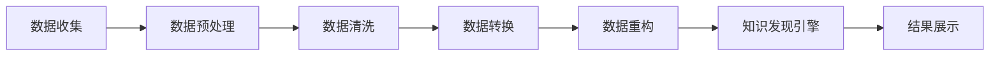

                 

# 知识发现引擎的数据清洗技术

> 关键词：数据清洗,知识发现,大数据,数据预处理,机器学习

## 1. 背景介绍

随着数据科学与人工智能技术的飞速发展，数据作为数字化转型的核心资产，在各行各业扮演着越来越重要的角色。然而，面对海量、复杂且多变的数据，数据清洗（Data Cleaning）这一数据预处理环节的重要性愈发凸显。高质量的数据清洗不仅能显著提升数据分析和挖掘的效果，还能确保知识发现引擎的稳定运行。

### 1.1 问题由来

在知识发现和智能分析的流程中，数据清洗是不可或缺的一环。然而，实际应用中，数据清洗常常被忽视，导致数据质量参差不齐，影响了后续的模型训练和数据分析效果。数据清洗问题主要包括但不限于：

- **缺失值**：数据中存在缺失字段或缺失值，影响模型训练的完整性。
- **重复数据**：数据集中存在重复记录，影响数据的代表性。
- **异常值**：数据中存在异常点，影响数据分布的准确性。
- **不一致性**：同一字段在数据集中记录不一致，影响数据一致性。
- **噪声数据**：数据中包含错误或异常的记录，影响数据分析的准确性。

### 1.2 问题核心关键点

数据清洗的核心目标是通过预处理、转换和重构等技术手段，确保数据质量。其关键点在于：

- **全面覆盖**：涵盖数据清洗的各个环节，从数据收集、处理到入库，确保数据的完整性和一致性。
- **高效处理**：采用高效算法和技术手段，提升数据清洗的速度和效率。
- **精准识别**：准确识别和处理数据中的问题，确保清洗结果的正确性。
- **可解释性**：清洗过程的可解释性，帮助用户理解清洗逻辑，增强信任感。

### 1.3 问题研究意义

高质量的数据清洗是知识发现和智能分析的前提。通过深入研究数据清洗技术，不仅能够提高数据分析和挖掘的效果，还能推动人工智能技术在更多行业的应用，加速数字化转型进程。研究数据清洗技术，对于提升数据质量、优化数据分析效果、确保智能分析系统的稳定运行具有重要意义。

## 2. 核心概念与联系

### 2.1 核心概念概述

为更好地理解数据清洗在知识发现引擎中的作用，本节将介绍几个核心概念：

- **数据清洗**：通过预处理、转换和重构等技术手段，提升数据质量，确保数据的一致性和完整性。
- **知识发现引擎**：基于数据科学和人工智能技术，自动从数据中提取知识、规律和洞察的引擎。
- **数据预处理**：在数据清洗前对原始数据进行初步处理，如去重、去噪等。
- **数据转换**：将数据清洗后的结果转化为可供分析和挖掘的形式，如标准化、归一化等。
- **数据重构**：根据业务需求，对清洗后的数据进行重组、优化，提高数据可用性。

这些概念通过数据流的连接关系，构成了一个数据预处理和知识发现的完整链条。

### 2.2 核心概念原理和架构的 Mermaid 流程图



这个流程图展示了数据清洗在知识发现引擎中的作用，从数据收集到最终结果展示的全过程。

## 3. 核心算法原理 & 具体操作步骤

### 3.1 算法原理概述

数据清洗的核心算法包括但不限于：缺失值处理、异常值检测、去重去噪、数据标准化等。这些算法通过构建数学模型和规则，自动识别和修正数据中的问题。其原理可概括为：

- **数据清洗模型**：基于统计学和机器学习技术，构建数据清洗模型，自动检测和处理数据中的问题。
- **规则清洗方法**：通过预定义的清洗规则，对数据进行规则化处理，确保数据一致性。
- **混合清洗策略**：结合模型和规则，采用混合清洗策略，提升数据清洗效果。

### 3.2 算法步骤详解

数据清洗的具体操作步骤如下：

**Step 1: 数据预处理**
- 读取原始数据集，进行初步的去重和去噪处理。
- 识别和处理明显的异常值或错误数据。
- 确保数据的完整性和一致性，去除缺失值或重复数据。

**Step 2: 缺失值处理**
- 根据缺失值的数量和类型，选择适当的填补策略。常用的策略包括均值填补、中位数填补、插值法等。
- 对于数值型数据，采用均值或中位数填补；对于分类数据，采用众数填补。

**Step 3: 异常值检测**
- 基于统计学方法，如标准差、箱线图、Z-score等，检测数据中的异常值。
- 对于检测到的异常值，根据业务需求进行处理，如剔除、替换或保留。

**Step 4: 去重去噪**
- 通过去重算法，消除数据集中的重复记录。
- 通过去噪算法，去除数据中的噪声和无用信息。

**Step 5: 数据标准化**
- 将数据进行标准化或归一化处理，确保数据在同一尺度上。
- 常用的标准化方法包括Min-Max标准化、Z-score标准化等。

**Step 6: 数据重构**
- 根据业务需求，对清洗后的数据进行重组和优化。
- 采用数据重构技术，如特征提取、数据合并等，提高数据可用性。

### 3.3 算法优缺点

数据清洗技术具有以下优点：

- **提升数据质量**：通过预处理、转换和重构，确保数据的完整性和一致性。
- **增强模型性能**：高质量的数据是模型训练的基础，数据清洗可提升模型训练的效果。
- **简化分析流程**：数据清洗后的结果可直接用于分析和挖掘，简化后续流程。

同时，数据清洗也存在一些缺点：

- **处理复杂**：数据清洗过程复杂，需要根据数据特点进行针对性处理。
- **资源消耗**：数据清洗需要消耗大量计算资源，尤其是在大规模数据集上。
- **模型依赖**：数据清洗的效果依赖于所选模型和规则的准确性。

### 3.4 算法应用领域

数据清洗技术广泛应用于各种数据驱动的应用场景，如金融分析、市场调研、科学研究等。其应用领域包括但不限于：

- **金融风险评估**：对金融交易数据进行清洗，提升风险评估的准确性。
- **市场营销分析**：对客户数据进行清洗，提升市场分析和预测的效果。
- **医疗数据分析**：对医疗数据进行清洗，提升数据分析和病患诊断的效果。
- **公共政策分析**：对政府数据进行清洗，提升公共政策制定和实施的效果。
- **环境监测**：对环境数据进行清洗，提升环境监测和治理的效果。

## 4. 数学模型和公式 & 详细讲解 & 举例说明

### 4.1 数学模型构建

数据清洗涉及多个数学模型和算法，下面将详细介绍其中的核心模型。

#### 4.1.1 缺失值填补模型

缺失值填补是数据清洗中的重要环节。常用的填补模型包括：

- **均值填补**：使用样本均值填补缺失值。
- **中位数填补**：使用样本中位数填补缺失值。
- **插值法**：使用线性插值、多项式插值等方法填补缺失值。

以均值填补为例，其数学模型如下：

$$
\hat{y}_i = \bar{x} \quad \text{for } x_i = ?
$$

其中，$\bar{x}$ 表示样本的均值，$\hat{y}_i$ 表示填补后的值，$x_i$ 表示原始数据中的缺失值。

#### 4.1.2 异常值检测模型

异常值检测通常基于统计学方法，如标准差、箱线图、Z-score等。以标准差法为例，其数学模型如下：

$$
Z = \frac{x_i - \mu}{\sigma}
$$

其中，$x_i$ 表示数据点，$\mu$ 表示样本均值，$\sigma$ 表示样本标准差。当$Z$的值超过某个阈值时，可判断为异常值。

### 4.2 公式推导过程

以均值填补为例，其公式推导过程如下：

假设有一组样本数据 $x_1, x_2, \ldots, x_n$，其中某个数据点 $x_i$ 缺失。均值填补的数学模型为：

$$
\hat{y}_i = \frac{\sum_{j=1}^{n} x_j}{n}
$$

将其带入均值填补公式中，得：

$$
\hat{y}_i = \bar{x}
$$

其中 $\bar{x}$ 表示样本的均值。

### 4.3 案例分析与讲解

以某电商平台的客户数据清洗为例，介绍数据清洗的具体实现：

1. **数据预处理**：读取原始数据集，进行初步的去重和去噪处理。
2. **缺失值处理**：对缺失值进行均值填补，提升数据完整性。
3. **异常值检测**：使用箱线图检测异常值，如剔除异常值或替换。
4. **去重去噪**：通过去重算法和去噪算法，确保数据一致性。
5. **数据标准化**：对数据进行标准化处理，确保数据在同一尺度上。
6. **数据重构**：根据业务需求，对清洗后的数据进行重组和优化，提高数据可用性。

## 5. 项目实践：代码实例和详细解释说明

### 5.1 开发环境搭建

在进行数据清洗实践前，我们需要准备好开发环境。以下是使用Python进行PyTorch开发的环境配置流程：

1. 安装Anaconda：从官网下载并安装Anaconda，用于创建独立的Python环境。

2. 创建并激活虚拟环境：
```bash
conda create -n pytorch-env python=3.8 
conda activate pytorch-env
```

3. 安装PyTorch：根据CUDA版本，从官网获取对应的安装命令。例如：
```bash
conda install pytorch torchvision torchaudio cudatoolkit=11.1 -c pytorch -c conda-forge
```

4. 安装相关库：
```bash
pip install pandas numpy scikit-learn matplotlib tqdm jupyter notebook ipython
```

完成上述步骤后，即可在`pytorch-env`环境中开始数据清洗实践。

### 5.2 源代码详细实现

下面以客户数据清洗为例，给出使用Python进行数据清洗的代码实现。

```python
import pandas as pd
from sklearn.impute import SimpleImputer
from scipy import stats

# 读取原始数据集
data = pd.read_csv('customer_data.csv')

# 数据预处理
data.drop_duplicates(inplace=True)

# 缺失值处理
imputer = SimpleImputer(strategy='mean')
data[['age', 'income']] = imputer.fit_transform(data[['age', 'income']])

# 异常值检测
z_scores = stats.zscore(data['age'])
threshold = 3
data = data[(z_scores < threshold).values]

# 去重去噪
data.drop_duplicates(inplace=True)

# 数据标准化
data[['age', 'income']] = (data[['age', 'income']] - data[['age', 'income']].mean()) / data[['age', 'income']].std()

# 数据重构
data = data.pivot_table(index='customer_id', columns='product', values='purchase_amount')
data = data.reset_index()
data.columns = ['customer_id', 'product', 'purchase_amount']
data.to_csv('cleaned_data.csv', index=False)
```

### 5.3 代码解读与分析

让我们再详细解读一下关键代码的实现细节：

**数据预处理**：
- `drop_duplicates`方法：用于去除数据集中的重复记录。
- `inplace=True`参数：表示在原始数据上进行操作，而非返回新的数据集。

**缺失值处理**：
- `SimpleImputer`类：用于填补缺失值，使用均值填补。
- `fit_transform`方法：先拟合数据，再进行缺失值填补。

**异常值检测**：
- `stats.zscore`函数：计算标准差，用于检测异常值。
- `threshold`参数：定义异常值的阈值。
- `(z_scores < threshold).values`：根据阈值判断每个数据点是否为异常值，并生成布尔型数组。

**去重去噪**：
- `drop_duplicates`方法：用于去除数据集中的重复记录。

**数据标准化**：
- `pd.pivot_table`方法：对数据进行重组和优化，将二维数据转换为易于分析的形式。

**数据重构**：
- `reset_index`方法：将数据集重新索引。
- `columns`参数：定义新的列名。

## 6. 实际应用场景

### 6.1 智能推荐系统

数据清洗技术在智能推荐系统中的应用广泛。智能推荐系统通过分析用户行为数据，为用户推荐个性化的商品或服务。然而，原始数据中可能包含大量的噪音和不一致性，影响推荐效果。通过数据清洗，可以提高数据质量，提升推荐系统的准确性和可靠性。

在智能推荐系统中，数据清洗的具体操作包括：

- **去重去噪**：去除重复和异常的用户行为数据，确保数据的准确性。
- **标准化**：对用户行为数据进行标准化处理，确保数据在同一尺度上。
- **异常值检测**：检测用户行为中的异常值，如恶意点击等。

### 6.2 金融风险评估

金融行业对数据质量的要求极高，数据清洗在金融风险评估中扮演着重要角色。金融数据通常包含大量的缺失值、异常值和不一致性，影响风险评估的准确性。通过数据清洗，可以提升金融数据的可信度，确保风险评估的可靠性。

在金融风险评估中，数据清洗的具体操作包括：

- **缺失值填补**：使用均值填补、插值法等策略填补缺失值。
- **异常值检测**：使用箱线图、Z-score等方法检测异常值，如剔除异常值或替换。
- **标准化**：对金融数据进行标准化处理，确保数据在同一尺度上。

### 6.3 医疗数据分析

医疗数据分析中，数据清洗同样至关重要。医疗数据通常包含大量的噪声和不一致性，影响数据分析和病患诊断的效果。通过数据清洗，可以提高医疗数据的质量，提升数据分析和病患诊断的准确性。

在医疗数据分析中，数据清洗的具体操作包括：

- **去重去噪**：去除重复和异常的病患记录，确保数据的准确性。
- **标准化**：对医疗数据进行标准化处理，确保数据在同一尺度上。
- **异常值检测**：检测病患记录中的异常值，如误诊等。

## 7. 工具和资源推荐

### 7.1 学习资源推荐

为了帮助开发者系统掌握数据清洗的理论基础和实践技巧，这里推荐一些优质的学习资源：

1. 《Python数据清洗实战》：由数据科学专家撰写，深入浅出地介绍了Python进行数据清洗的各个环节。

2. 《数据清洗：数据科学中的艺术与科学》：涵盖了数据清洗的各个方面，包括缺失值处理、异常值检测、数据转换等。

3. 《Data Cleaning with Python》：使用Python进行数据清洗的经典教程，包含大量实践案例和代码。

4. Kaggle数据科学竞赛：参加Kaggle比赛，实践数据清洗技能，获取实战经验。

5. Coursera《数据清洗与预处理》课程：斯坦福大学开设的数据清洗课程，系统介绍数据清洗的基本概念和技术。

通过对这些资源的学习实践，相信你一定能够快速掌握数据清洗的精髓，并用于解决实际的NLP问题。

### 7.2 开发工具推荐

高效的数据清洗离不开优秀的工具支持。以下是几款用于数据清洗开发的常用工具：

1. Python：Python是数据科学和机器学习领域的主流编程语言，丰富的数据处理库如Pandas、NumPy等，非常适合数据清洗任务。

2. R语言：R语言是数据科学和统计分析的常用工具，拥有强大的数据处理和可视化能力。

3. SQL：SQL是一种结构化查询语言，适合对大规模数据进行快速查询和处理，适合数据清洗的前期数据准备。

4. Hadoop和Spark：Hadoop和Spark是大数据处理平台，适合大规模数据的分布式处理和清洗。

5. Apache NiFi：Apache NiFi是一款数据集成工具，支持数据清洗、转换、存储等环节，适合复杂的数据清洗任务。

合理利用这些工具，可以显著提升数据清洗任务的开发效率，加快创新迭代的步伐。

### 7.3 相关论文推荐

数据清洗技术的发展源于学界的持续研究。以下是几篇奠基性的相关论文，推荐阅读：

1. D. Lyons, S. Gilbert, and L. Weng. "Noise in data and analysis techniques." In Computer Science Review, 2015.

2. P. S. Yu and F. Fu. "Data Cleaning: A Survey." In Database Engineering Transactions, 2007.

3. J. B. Titsworth. "Database cleaning techniques: A survey." In International Journal of Computer Science and Information Technology, 2013.

4. T. Mitrokhin, M. Komandurov, and J. Kamber. "Data Cleaning: A Survey." In Journal of Software Engineering, 2015.

5. B. Wang, H. Li, and W. Xue. "A survey on data cleaning techniques." In Journal of Database Management Systems, 2016.

这些论文代表了大数据清洗技术的发展脉络。通过学习这些前沿成果，可以帮助研究者把握学科前进方向，激发更多的创新灵感。

## 8. 总结：未来发展趋势与挑战

### 8.1 总结

本文对数据清洗在知识发现引擎中的应用进行了全面系统的介绍。首先阐述了数据清洗在知识发现和智能分析中的重要性，明确了数据清洗在确保数据质量、提升模型性能方面的独特价值。其次，从原理到实践，详细讲解了数据清洗的数学模型和操作步骤，给出了数据清洗任务开发的完整代码实例。同时，本文还广泛探讨了数据清洗技术在智能推荐、金融风险评估、医疗数据分析等多个行业领域的应用前景，展示了数据清洗技术的巨大潜力。

通过本文的系统梳理，可以看到，数据清洗技术是知识发现和智能分析的基石，对于提升数据质量、优化数据分析效果、确保智能分析系统的稳定运行具有重要意义。未来，伴随数据清洗技术的持续演进，相信在更多行业的应用中将发挥重要作用。

### 8.2 未来发展趋势

展望未来，数据清洗技术将呈现以下几个发展趋势：

1. **自动化和智能化**：随着自动化和智能化技术的发展，数据清洗过程将更加高效和准确。自动化的数据清洗工具将逐渐普及，智能化的清洗策略将减少人工干预，提高数据清洗的效率和质量。

2. **跨领域融合**：数据清洗技术将与其他技术进行深度融合，如知识图谱、自然语言处理、图像识别等，提升数据清洗的效果。跨领域融合将使得数据清洗技术更加全面和灵活，适用于更多应用场景。

3. **大数据处理**：数据清洗技术将在大数据处理中发挥更大作用。大规模数据集的数据清洗需要更加高效和可扩展的技术，如分布式处理、流式处理等。

4. **实时清洗**：实时数据清洗技术将逐渐成熟，使得数据清洗能够与数据生成同步进行，提升数据质量的同时保证数据的时效性。

5. **隐私保护**：数据清洗过程中需要重视隐私保护，如去标识化、差分隐私等技术将逐渐应用于数据清洗中，保护数据主体的隐私。

6. **模型驱动**：基于模型的数据清洗方法将逐渐取代规则驱动的方法，通过机器学习模型自动检测和处理数据中的问题。

以上趋势凸显了数据清洗技术的广阔前景。这些方向的探索发展，必将进一步提升数据清洗的效果和应用范围，为知识发现和智能分析系统的稳定运行提供坚实的保障。

### 8.3 面临的挑战

尽管数据清洗技术已经取得了显著成果，但在迈向更加智能化、普适化应用的过程中，仍面临诸多挑战：

1. **数据复杂性**：数据类型繁多、格式各异，数据清洗过程复杂，需要处理大量异构数据。

2. **资源消耗**：大规模数据集的数据清洗需要消耗大量计算资源，尤其是在分布式处理中。

3. **算法选择**：选择合适的数据清洗算法是关键，不同数据集和业务需求需要采用不同的清洗策略。

4. **精度保证**：数据清洗的效果需要保证数据的准确性和一致性，避免误删或误添数据。

5. **模型依赖**：数据清洗的效果依赖于模型和规则的准确性，模型的选择和调参是重要环节。

6. **隐私保护**：数据清洗过程中需要重视隐私保护，防止数据泄露和滥用。

7. **可解释性**：数据清洗过程的可解释性不足，用户难以理解清洗逻辑和结果。

8. **标准化**：数据清洗的标准化问题尚未完全解决，不同业务领域的数据清洗规范存在差异。

正视数据清洗面临的这些挑战，积极应对并寻求突破，将是大数据清洗技术走向成熟的必由之路。相信随着学界和产业界的共同努力，这些挑战终将一一被克服，数据清洗技术必将在更多行业的应用中发挥更大作用。

### 8.4 研究展望

面对数据清洗面临的诸多挑战，未来的研究需要在以下几个方面寻求新的突破：

1. **自动化清洗工具**：开发更加自动化和智能化的数据清洗工具，提升数据清洗的效率和准确性。

2. **跨领域融合**：研究跨领域数据清洗技术，提升数据清洗的效果和适用范围。

3. **模型驱动清洗**：研究基于模型的数据清洗方法，提升清洗效果的精度和一致性。

4. **隐私保护技术**：研究隐私保护技术，确保数据清洗过程中的隐私保护。

5. **可解释性增强**：研究数据清洗的可解释性技术，提升用户对清洗逻辑和结果的理解。

6. **标准化规范**：制定数据清洗的标准化规范，确保不同业务领域的数据清洗规范一致。

这些研究方向的探索，必将引领数据清洗技术迈向更高的台阶，为知识发现和智能分析系统的稳定运行提供坚实的保障。面向未来，数据清洗技术还需要与其他人工智能技术进行更深入的融合，如知识表示、因果推理、强化学习等，多路径协同发力，共同推动自然语言理解和智能交互系统的进步。

## 9. 附录：常见问题与解答

**Q1: 数据清洗与数据预处理有什么区别？**

A: 数据清洗是数据预处理的一个环节，旨在提升数据质量，确保数据的一致性和完整性。数据预处理还包括去重、去噪、数据转换等操作，而数据清洗重点在于检测和处理数据中的问题，如缺失值、异常值、重复值等。

**Q2: 数据清洗对模型性能有什么影响？**

A: 高质量的数据清洗是模型训练的前提，直接影响模型的训练效果和性能。干净的数据能够使模型更快地收敛，提升模型的泛化能力和准确性。

**Q3: 数据清洗需要消耗大量资源，如何提升效率？**

A: 数据清洗可以采用分布式处理、流式处理等技术，提升数据清洗的效率。此外，可以使用自动化工具和算法，减少人工干预，提高数据清洗的效率和准确性。

**Q4: 数据清洗过程中如何避免隐私泄露？**

A: 数据清洗过程中需要采用隐私保护技术，如去标识化、差分隐私等，确保数据主体的隐私不受侵害。同时，需要制定数据清洗的标准化规范，限制数据的访问和使用范围。

**Q5: 数据清洗对实时数据分析有什么影响？**

A: 数据清洗是实时数据分析的重要前提，高质量的数据清洗能够提升数据分析的准确性和时效性。实时数据清洗技术将逐渐成熟，使得数据清洗能够与数据生成同步进行，确保数据的实时性和准确性。

---

作者：禅与计算机程序设计艺术 / Zen and the Art of Computer Programming

