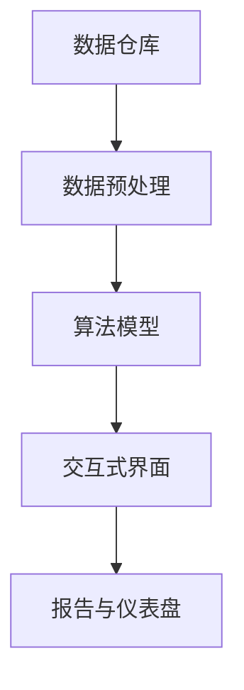

                 

# 知识发现引擎的架构设计与实现

## 1. 背景介绍

### 1.1 问题由来
在当今数据驱动的商业环境中，企业需要快速地从大量数据中挖掘出有价值的信息，以支撑战略决策、优化业务流程和提升运营效率。然而，传统的基于规则或统计方法的知识发现方式，在面对复杂、动态和多源数据时，存在难以捕获隐性知识、难以适应快速变化的环境等问题。

### 1.2 问题核心关键点
针对上述问题，知识发现引擎（Knowledge Discovery Engine, KDE）应运而生。知识发现引擎是一种能够自动从大数据中挖掘和提炼出有价值知识的软件系统。其核心思想是通过高效的数据处理与智能算法，实现对数据的自动化、智能化分析，从而发现数据背后的模式、趋势和关联。

## 2. 核心概念与联系

### 2.1 核心概念概述

为更好地理解知识发现引擎的架构与实现，本节将介绍几个密切相关的核心概念：

- 数据仓库：存储企业业务系统产生的结构化数据，是知识发现的基础设施。
- 数据挖掘：从数据仓库中提取有价值的模式、关联和趋势等知识的过程。
- 数据预处理：对原始数据进行清洗、转换和集成，为数据挖掘提供高质量输入。
- 算法模型：用于发现和挖掘数据中的知识的工具，如聚类、分类、关联规则挖掘等。
- 交互式界面：知识发现工程师与知识发现系统之间的交互界面，用于理解、解释和验证挖掘结果。
- 报告与仪表盘：将知识发现结果可视化，帮助用户理解并应用挖掘结果。

这些核心概念通过数据流和控制流构成了知识发现引擎的基本架构，使其能够高效、灵活地进行知识发现。

### 2.2 核心概念原理和架构的 Mermaid 流程图(Mermaid 流程节点中不要有括号、逗号等特殊字符)



该流程图展示了知识发现引擎的核心流程：从数据仓库中提取数据，经过预处理，使用算法模型进行数据挖掘，通过交互式界面进行结果展示和验证，最终将结果可视化并通过报告与仪表盘呈现。

## 3. 核心算法原理 & 具体操作步骤

### 3.1 算法原理概述

知识发现引擎的核心算法原理通常基于数据挖掘的四个主要步骤：数据预处理、模型选择与训练、结果解释与验证、知识应用与部署。其中，模型选择与训练是知识发现引擎的核心，包括选择合适的算法模型、优化模型参数、评估模型性能等。

### 3.2 算法步骤详解

#### 3.2.1 数据预处理

数据预处理的目标是清洗、转换和集成数据，以便算法模型能够更好地进行知识发现。具体步骤包括：

- 数据清洗：删除或修正缺失值、异常值和噪声数据。
- 数据转换：对数据进行归一化、标准化和编码处理。
- 数据集成：将多个数据源的数据进行合并和对齐。

#### 3.2.2 模型选择与训练

模型选择与训练是知识发现引擎的核心步骤，包括选择合适的算法模型、优化模型参数、评估模型性能等。具体步骤如下：

- 算法模型选择：根据数据类型和业务需求选择合适的算法模型，如分类、聚类、关联规则挖掘等。
- 模型参数优化：通过交叉验证和网格搜索等方法，优化模型参数。
- 模型性能评估：使用训练集和验证集评估模型的准确率、召回率、F1值等性能指标。

#### 3.2.3 结果解释与验证

结果解释与验证是指对挖掘结果进行解释和验证，确保其正确性和可靠性。具体步骤包括：

- 结果解释：将挖掘结果转化为可理解的形式，如表格、图形、报告等。
- 结果验证：通过多种验证方法，如交叉验证、人工验证等，验证挖掘结果的准确性和可靠性。

#### 3.2.4 知识应用与部署

知识应用与部署是指将挖掘结果转化为可操作的业务知识，并将其部署到实际应用中。具体步骤包括：

- 知识提取：从挖掘结果中提取关键信息和知识。
- 知识展示：通过报告和仪表盘等形式展示知识。
- 知识部署：将知识应用到实际业务中，如客户细分、产品推荐、风险控制等。

### 3.3 算法优缺点

知识发现引擎的优点在于：

- 自动化程度高：自动完成数据清洗、转换、模型训练等步骤，节省人力和时间。
- 适用范围广：适用于各种类型的数据，能够发现多种形式的知识。
- 精度高：基于先进算法和模型，能够挖掘出数据中深层次的知识。
- 易于扩展：支持分布式计算和云计算，能够处理海量数据。

然而，知识发现引擎也存在一些缺点：

- 依赖高质量数据：需要高质量、完整、一致的数据作为输入，数据质量差会影响挖掘结果。
- 算法复杂度高：复杂算法需要高计算资源，对于大规模数据集可能需要较长计算时间。
- 可解释性不足：部分算法模型如深度学习模型的黑盒特性，使得其结果难以解释和验证。
- 结果依赖性强：模型结果依赖于数据和算法，难以避免过拟合和泛化能力不足的问题。

### 3.4 算法应用领域

知识发现引擎在多个领域得到了广泛应用，例如：

- 客户细分与分析：通过分析客户购买行为和偏好，发现不同客户群体的特征和需求。
- 风险评估与管理：通过分析历史交易数据，发现潜在的风险因素和风险客户。
- 市场分析与预测：通过分析市场数据，发现市场趋势和机会，进行市场预测和营销决策。
- 金融欺诈检测：通过分析交易数据，发现异常行为和潜在的欺诈活动。
- 医疗诊断与治疗：通过分析医疗数据，发现疾病模式和治疗方法，提高诊疗效率和效果。
- 供应链优化：通过分析供应链数据，发现供应链瓶颈和优化机会，提高供应链效率和成本控制能力。

## 4. 数学模型和公式 & 详细讲解 & 举例说明

### 4.1 数学模型构建

知识发现引擎的数学模型构建通常基于统计学和机器学习原理，包括分类、聚类、关联规则挖掘等算法。以分类模型为例，其数学模型构建如下：

设数据集为 $\mathcal{D}=\{(x_i, y_i)\}_{i=1}^N$，其中 $x_i$ 为输入特征，$y_i$ 为输出标签。分类模型的目标是将输入特征映射到输出标签，即学习一个函数 $f: \mathcal{X} \rightarrow \mathcal{Y}$，使得 $f(x_i) \approx y_i$。常见的分类模型包括线性回归、逻辑回归、决策树、支持向量机等。

### 4.2 公式推导过程

以逻辑回归模型为例，其推导过程如下：

设输入特征 $x$ 为 $N$ 维向量，输出标签 $y$ 为二值变量。逻辑回归模型的目标是最小化负对数似然损失函数，即：

$$
L(w, b; \mathcal{D}) = -\frac{1}{N}\sum_{i=1}^N y_i\log p(y_i|x_i; w, b) + (1-y_i)\log(1-p(y_i|x_i; w, b))
$$

其中 $p(y_i|x_i; w, b) = \frac{1}{1+e^{-b}}$，$w$ 和 $b$ 分别为模型参数。

利用梯度下降等优化算法，求解最小化上述损失函数，即可得到最优的模型参数 $w$ 和 $b$。

### 4.3 案例分析与讲解

#### 案例一：客户细分与分析

某电商平台通过知识发现引擎，对客户购买行为进行分析，发现不同客户群体具有不同的购买偏好和行为特征。具体步骤如下：

- 数据预处理：清洗和整合客户交易数据，去除异常值和噪声。
- 模型选择与训练：选择逻辑回归模型，训练客户分群模型。
- 结果解释与验证：将客户分群结果可视化，通过人工验证其正确性和可靠性。
- 知识应用与部署：根据分群结果进行个性化营销，提高客户满意度和转化率。

#### 案例二：金融欺诈检测

某银行通过知识发现引擎，分析历史交易数据，发现异常交易行为，及时识别潜在的欺诈活动。具体步骤如下：

- 数据预处理：清洗和整合交易数据，去除异常值和噪声。
- 模型选择与训练：选择异常检测模型，如孤立森林、支持向量机等，训练欺诈检测模型。
- 结果解释与验证：将检测结果可视化，通过人工验证其正确性和可靠性。
- 知识应用与部署：根据检测结果进行交易拦截和风险控制，保护银行资产安全。

## 5. 项目实践：代码实例和详细解释说明

### 5.1 开发环境搭建

在进行知识发现引擎开发前，需要准备好开发环境。以下是使用Python进行PyTorch开发的环境配置流程：

1. 安装Anaconda：从官网下载并安装Anaconda，用于创建独立的Python环境。
2. 创建并激活虚拟环境：
```bash
conda create -n pytorch-env python=3.8 
conda activate pytorch-env
```
3. 安装PyTorch：根据CUDA版本，从官网获取对应的安装命令。例如：
```bash
conda install pytorch torchvision torchaudio cudatoolkit=11.1 -c pytorch -c conda-forge
```
4. 安装TensorFlow：
```bash
pip install tensorflow
```
5. 安装各类工具包：
```bash
pip install numpy pandas scikit-learn matplotlib tqdm jupyter notebook ipython
```

完成上述步骤后，即可在`pytorch-env`环境中开始知识发现引擎的开发。

### 5.2 源代码详细实现

下面我们以分类任务为例，给出使用PyTorch进行逻辑回归模型训练的PyTorch代码实现。

首先，定义数据处理函数：

```python
import pandas as pd
from sklearn.model_selection import train_test_split
from sklearn.preprocessing import StandardScaler
from torch.utils.data import Dataset, DataLoader
import torch

class DataLoaderDataset(Dataset):
    def __init__(self, data, target):
        self.data = data
        self.target = target
        
    def __len__(self):
        return len(self.data)
    
    def __getitem__(self, item):
        return self.data[item], self.target[item]

def read_data(path):
    data = pd.read_csv(path)
    features = data.drop(['label'], axis=1)
    target = data['label']
    return features, target

def preprocess_data(features, target, test_size=0.2, random_state=42):
    features, target = read_data('data.csv')
    features = features.values
    target = target.values
    scaler = StandardScaler()
    features = scaler.fit_transform(features)
    features_train, features_test, target_train, target_test = train_test_split(features, target, test_size=test_size, random_state=random_state)
    return features_train, features_test, target_train, target_test

def convert_to_tensor(features, target):
    features_tensor = torch.tensor(features, dtype=torch.float32)
    target_tensor = torch.tensor(target, dtype=torch.long)
    return features_tensor, target_tensor
```

然后，定义模型和优化器：

```python
from torch import nn
from torch.optim import SGD

class LogisticRegression(nn.Module):
    def __init__(self, input_size, output_size):
        super(LogisticRegression, self).__init__()
        self.fc = nn.Linear(input_size, output_size)
    
    def forward(self, x):
        x = self.fc(x)
        return x

model = LogisticRegression(input_size=10, output_size=2)

optimizer = SGD(model.parameters(), lr=0.01)
```

接着，定义训练和评估函数：

```python
def train_epoch(model, data_loader, optimizer):
    model.train()
    for data, target in data_loader:
        optimizer.zero_grad()
        output = model(data)
        loss = nn.CrossEntropyLoss()(output, target)
        loss.backward()
        optimizer.step()
        
def evaluate(model, data_loader):
    model.eval()
    correct = 0
    total = 0
    with torch.no_grad():
        for data, target in data_loader:
            output = model(data)
            _, predicted = torch.max(output, 1)
            total += target.size(0)
            correct += (predicted == target).sum().item()
    accuracy = correct / total
    return accuracy
```

最后，启动训练流程并在测试集上评估：

```python
train_features, test_features, train_target, test_target = preprocess_data()
train_dataset = DataLoaderDataset(train_features, train_target)
test_dataset = DataLoaderDataset(test_features, test_target)
test_loader = DataLoader(test_dataset, batch_size=32)

for epoch in range(10):
    train_epoch(model, train_loader, optimizer)
    accuracy = evaluate(model, test_loader)
    print(f"Epoch {epoch+1}, accuracy: {accuracy:.3f}")
```

以上就是使用PyTorch进行逻辑回归模型训练的完整代码实现。可以看到，得益于PyTorch的强大封装，我们能够以相对简洁的代码实现逻辑回归模型的训练和评估。

### 5.3 代码解读与分析

让我们再详细解读一下关键代码的实现细节：

**DataLoaderDataset类**：
- `__init__`方法：初始化数据集，将输入特征和目标标签存储到实例变量中。
- `__len__`方法：返回数据集的样本数量。
- `__getitem__`方法：对单个样本进行处理，返回输入特征和目标标签。

**read_data函数**：
- 读取数据集，将其转化为Pandas DataFrame对象，并进行特征和目标标签的分离。

**preprocess_data函数**：
- 对数据进行标准化处理，并进行训练集和测试集的划分。

**convert_to_tensor函数**：
- 将输入特征和目标标签转化为PyTorch张量，方便模型训练和推理。

**LogisticRegression类**：
- 定义逻辑回归模型，包括输入特征、输出标签和模型参数。

**train_epoch函数**：
- 对数据以批为单位进行迭代，在每个批次上前向传播计算损失函数，并反向传播更新模型参数。

**evaluate函数**：
- 在测试集上评估模型性能，计算模型的准确率。

**训练流程**：
- 定义总的epoch数，开始循环迭代
- 每个epoch内，先在训练集上训练，输出准确率
- 在测试集上评估，输出测试结果

可以看到，PyTorch配合TensorFlow库使得逻辑回归模型的代码实现变得简洁高效。开发者可以将更多精力放在数据处理、模型改进等高层逻辑上，而不必过多关注底层的实现细节。

当然，工业级的系统实现还需考虑更多因素，如模型的保存和部署、超参数的自动搜索、更灵活的任务适配层等。但核心的训练和评估流程基本与此类似。

## 6. 实际应用场景

### 6.1 智能客服系统

智能客服系统是知识发现引擎在实际应用中的典型场景。传统的客服系统需要配备大量人力，高峰期响应缓慢，且一致性和专业性难以保证。通过知识发现引擎，企业可以构建智能客服系统，利用自然语言处理技术，自动理解用户意图，匹配最合适的答案模板进行回复，提升客户咨询体验和问题解决效率。

在技术实现上，企业可以收集历史客服对话记录，将问题和最佳答复构建成监督数据，训练逻辑回归、支持向量机等分类模型。模型可以自动理解用户输入，匹配最合适的答案模板进行回复，甚至能够进行多轮对话，提供自然流畅的对话体验。

### 6.2 金融舆情监测

金融机构需要实时监测市场舆论动向，以便及时应对负面信息传播，规避金融风险。知识发现引擎可以自动分析金融领域相关的新闻、报道、评论等文本数据，发现市场情绪和趋势，及时预警风险。

具体而言，可以收集金融领域相关的新闻、报道、评论等文本数据，训练情感分析模型。模型能够自动识别文本的情感倾向，实时监测市场情绪变化，一旦发现负面信息激增等异常情况，系统便会自动预警，帮助金融机构快速应对潜在风险。

### 6.3 个性化推荐系统

当前的推荐系统往往只依赖用户的历史行为数据进行物品推荐，无法深入理解用户的真实兴趣偏好。通过知识发现引擎，企业可以构建个性化推荐系统，利用分类、聚类等算法，深入挖掘用户行为背后的语义信息，提供更精准、多样的推荐内容。

在技术实现上，可以收集用户浏览、点击、评论、分享等行为数据，提取和用户交互的物品标题、描述、标签等文本内容。利用逻辑回归、聚类等算法，训练模型学习用户的兴趣点。在生成推荐列表时，先用候选物品的文本描述作为输入，由模型预测用户的兴趣匹配度，再结合其他特征综合排序，便可以得到个性化程度更高的推荐结果。

### 6.4 未来应用展望

随着知识发现引擎和深度学习技术的不断发展，未来将在更多领域得到应用，为传统行业带来变革性影响。

在智慧医疗领域，知识发现引擎可以用于医学知识发现和疾病预测，辅助医生诊疗，加速新药开发进程。

在智能教育领域，知识发现引擎可以用于学习行为分析和学习路径推荐，因材施教，促进教育公平，提高教学质量。

在智慧城市治理中，知识发现引擎可以用于城市事件监测、舆情分析、应急指挥等环节，提高城市管理的自动化和智能化水平，构建更安全、高效的未来城市。

此外，在企业生产、社会治理、文娱传媒等众多领域，知识发现引擎的应用也将不断涌现，为经济社会发展注入新的动力。相信随着技术的日益成熟，知识发现引擎必将在构建人机协同的智能时代中扮演越来越重要的角色。

## 7. 工具和资源推荐

### 7.1 学习资源推荐

为了帮助开发者系统掌握知识发现引擎的理论基础和实践技巧，这里推荐一些优质的学习资源：

1. 《数据挖掘与统计学习》系列博文：由大模型技术专家撰写，深入浅出地介绍了数据挖掘和统计学习的核心概念和经典算法。

2. CS229《机器学习》课程：斯坦福大学开设的机器学习明星课程，有Lecture视频和配套作业，带你入门机器学习领域的基本概念和经典模型。

3. 《统计学习方法》书籍：李航著，全面介绍了统计学习的基本原理和算法，是机器学习领域的经典教材。

4. Kaggle竞赛平台：全球最大的数据科学竞赛平台，提供海量数据集和实际问题，是实践知识发现引擎技术的绝佳场所。

5. PyTorch官方文档：PyTorch的官方文档，提供了海量预训练模型和完整的模型训练样例代码，是上手实践的必备资料。

通过对这些资源的学习实践，相信你一定能够快速掌握知识发现引擎的精髓，并用于解决实际的业务问题。

### 7.2 开发工具推荐

高效的开发离不开优秀的工具支持。以下是几款用于知识发现引擎开发的常用工具：

1. Python：基于Python的开源深度学习框架，灵活动态的计算图，适合快速迭代研究。大部分知识发现引擎的模型都有Python版本的实现。

2. TensorFlow：由Google主导开发的开源深度学习框架，生产部署方便，适合大规模工程应用。同样有丰富的知识发现引擎资源。

3. Weights & Biases：模型训练的实验跟踪工具，可以记录和可视化模型训练过程中的各项指标，方便对比和调优。与主流深度学习框架无缝集成。

4. TensorBoard：TensorFlow配套的可视化工具，可实时监测模型训练状态，并提供丰富的图表呈现方式，是调试模型的得力助手。

5. Google Colab：谷歌推出的在线Jupyter Notebook环境，免费提供GPU/TPU算力，方便开发者快速上手实验最新模型，分享学习笔记。

合理利用这些工具，可以显著提升知识发现引擎的开发效率，加快创新迭代的步伐。

### 7.3 相关论文推荐

知识发现引擎和深度学习技术的发展源于学界的持续研究。以下是几篇奠基性的相关论文，推荐阅读：

1. 《K-Means: Algorithms and applications》：介绍了K-Means聚类算法的原理和应用，是聚类算法的经典教材。

2. 《Support Vector Machines: Theory and Applications》：介绍了支持向量机算法的原理和应用，是分类算法的经典教材。

3. 《Neural Networks and Deep Learning》：Goodfellow等著，全面介绍了神经网络和深度学习的基本原理和算法，是深度学习领域的经典教材。

4. 《AdaBoost: A new learning algorithm》：介绍了AdaBoost算法，是集成学习的经典算法。

5. 《An Introduction to Information Retrieval》：Christopher D. Manning等著，全面介绍了信息检索的基本原理和算法，是信息检索领域的经典教材。

这些论文代表了大数据挖掘和深度学习技术的发展脉络。通过学习这些前沿成果，可以帮助研究者把握学科前进方向，激发更多的创新灵感。

## 8. 总结：未来发展趋势与挑战

### 8.1 总结

本文对知识发现引擎的架构设计与实现进行了全面系统的介绍。首先阐述了知识发现引擎的研究背景和意义，明确了其自动从大数据中挖掘和提炼出有价值知识的核心目标。其次，从原理到实践，详细讲解了知识发现引擎的数学模型和算法步骤，给出了知识发现引擎开发的完整代码实例。同时，本文还广泛探讨了知识发现引擎在智能客服、金融舆情、个性化推荐等多个行业领域的应用前景，展示了其巨大的应用潜力。

通过本文的系统梳理，可以看到，知识发现引擎已经成为企业大数据应用的重要工具，极大地拓展了企业的数据分析能力和业务决策能力。未来，伴随知识发现引擎和深度学习技术的持续演进，相信其将能够在更多领域得到应用，为经济社会发展注入新的动力。

### 8.2 未来发展趋势

展望未来，知识发现引擎将呈现以下几个发展趋势：

1. 自动化程度更高。随着算法的不断优化，知识发现引擎的自动化程度将进一步提高，能够自动处理更复杂、更大规模的数据。
2. 实时性更强。通过引入流计算和大数据技术，知识发现引擎将具备实时分析和预测能力，能够及时响应业务需求。
3. 泛化能力更强。未来的知识发现引擎将能够更好地适应多源异构数据，发现更深层次、更泛化的知识。
4. 可解释性更强。通过引入可解释性算法和工具，知识发现引擎将能够提供更加透明和可信的分析结果，提升用户对系统的信任度。
5. 集成能力更强。未来的知识发现引擎将能够更好地集成多种数据源和分析工具，实现多模态数据融合和分析。
6. 安全性更高。通过引入安全算法和隐私保护技术，知识发现引擎将能够保护数据隐私和系统安全，防止数据泄露和滥用。

以上趋势凸显了知识发现引擎的未来发展方向。这些方向的探索发展，必将进一步提升企业的分析能力和决策效率，为经济社会发展注入新的动力。

### 8.3 面临的挑战

尽管知识发现引擎已经取得了瞩目成就，但在迈向更加智能化、普适化应用的过程中，它仍面临着诸多挑战：

1. 数据质量瓶颈。知识发现引擎对数据质量要求较高，需要高质量、完整、一致的数据作为输入，数据质量差会影响挖掘结果。
2. 算法复杂度高。复杂算法需要高计算资源，对于大规模数据集可能需要较长计算时间，难以满足实时性需求。
3. 可解释性不足。部分算法模型如深度学习模型的黑盒特性，使得其结果难以解释和验证，影响用户对系统的信任度。
4. 结果依赖性强。模型结果依赖于数据和算法，难以避免过拟合和泛化能力不足的问题，影响系统的鲁棒性。
5. 安全性问题。知识发现引擎需要处理敏感数据，面临数据泄露和滥用的风险，需要加强安全防护。
6. 系统集成难度大。知识发现引擎需要集成多种数据源和分析工具，实现多模态数据融合和分析，系统集成难度较大。

正视知识发现引擎面临的这些挑战，积极应对并寻求突破，将是大数据应用技术走向成熟的必由之路。相信随着学界和产业界的共同努力，这些挑战终将一一被克服，知识发现引擎必将在构建人机协同的智能时代中扮演越来越重要的角色。

### 8.4 研究展望

面对知识发现引擎所面临的种种挑战，未来的研究需要在以下几个方面寻求新的突破：

1. 探索无监督和半监督知识发现方法。摆脱对大规模标注数据的依赖，利用自监督学习、主动学习等无监督和半监督范式，最大限度利用非结构化数据，实现更加灵活高效的发现。
2. 研究参数高效和计算高效的知识发现方法。开发更加参数高效的知识发现方法，在固定大部分模型参数的情况下，只更新极少量的任务相关参数。同时优化知识发现模型的计算图，减少前向传播和反向传播的资源消耗，实现更加轻量级、实时性的部署。
3. 融合因果和对比学习范式。通过引入因果推断和对比学习思想，增强知识发现模型建立稳定因果关系的能力，学习更加普适、鲁棒的知识表示。
4. 引入更多先验知识。将符号化的先验知识，如知识图谱、逻辑规则等，与神经网络模型进行巧妙融合，引导知识发现过程学习更准确、合理的知识表示。
5. 结合因果分析和博弈论工具。将因果分析方法引入知识发现模型，识别出模型决策的关键特征，增强输出解释的因果性和逻辑性。借助博弈论工具刻画人机交互过程，主动探索并规避模型的脆弱点，提高系统稳定性。
6. 纳入伦理道德约束。在知识发现模型的训练目标中引入伦理导向的评估指标，过滤和惩罚有偏见、有害的输出倾向，确保知识发现过程符合伦理道德标准。

这些研究方向的探索，必将引领知识发现引擎技术迈向更高的台阶，为构建安全、可靠、可解释、可控的智能系统铺平道路。面向未来，知识发现引擎需要与其他人工智能技术进行更深入的融合，如知识表示、因果推理、强化学习等，多路径协同发力，共同推动知识发现技术的进步。只有勇于创新、敢于突破，才能不断拓展知识发现引擎的边界，让智能技术更好地造福人类社会。

## 9. 附录：常见问题与解答

**Q1：知识发现引擎是否适用于所有业务场景？**

A: 知识发现引擎适用于多种业务场景，特别是大数据驱动的决策支持类业务。但对于一些特定场景，如高风险交易决策、医疗诊断等，需要结合领域知识和专家经验进行综合分析，单纯依赖知识发现引擎可能难以满足要求。

**Q2：如何选择合适的知识发现算法？**

A: 选择知识发现算法应根据数据类型和业务需求进行综合考虑。例如，对于分类任务，可以选择逻辑回归、支持向量机等算法；对于聚类任务，可以选择K-Means、层次聚类等算法；对于关联规则挖掘任务，可以选择Apriori、FP-Growth等算法。

**Q3：知识发现引擎面临哪些资源瓶颈？**

A: 知识发现引擎需要处理大规模数据集，面临计算资源和存储资源的需求。需要采用分布式计算、云计算等技术，优化模型训练和推理的资源消耗。

**Q4：知识发现引擎的输出结果如何验证？**

A: 知识发现引擎的输出结果需要通过多种验证方法进行验证，如交叉验证、人工验证、业务验证等。验证结果可信，才能应用于实际业务。

**Q5：知识发现引擎的模型如何保存和部署？**

A: 知识发现引擎的模型可以通过PyTorch、TensorFlow等框架进行保存和部署，支持模型裁剪、量化加速等优化措施，提升模型的推理效率。

这些资源和知识帮助开发者更好地理解知识发现引擎的原理和实现，掌握其实现技术，并应用于实际业务中。通过本文的系统梳理，相信你一定能够快速掌握知识发现引擎的精髓，并用于解决实际的业务问题。

---

作者：禅与计算机程序设计艺术 / Zen and the Art of Computer Programming

