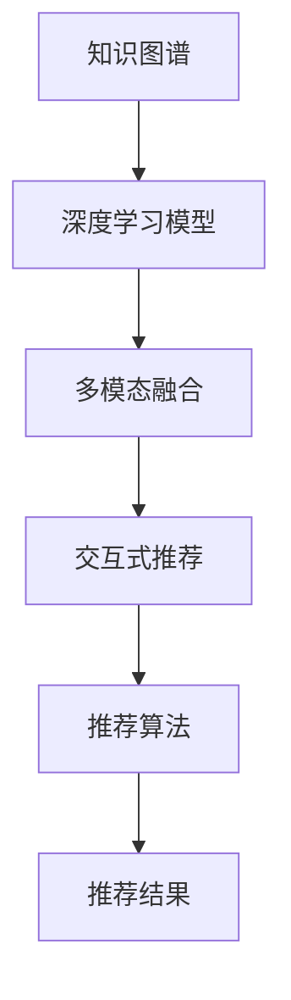

                 

# 知识发现引擎的用户行为预测与推荐

> 关键词：知识发现,用户行为预测,推荐系统,机器学习,深度学习,多模态融合,交互式推荐,推荐算法

## 1. 背景介绍

### 1.1 问题由来

在信息爆炸的时代，如何从海量的数据中挖掘出有用的信息，为用户提供个性化的推荐服务，已成为互联网企业面临的重要挑战。传统的推荐系统往往基于用户的评分历史进行协同过滤，但随着用户数据量的增长，这种方法逐渐表现出数据稀疏、冷启动用户处理困难等问题。随着技术的发展，知识发现引擎(Knowledge Discovery Engine, KDE)应运而生。

KDE是一种基于用户行为数据构建知识图谱的推荐系统。它通过深度学习模型提取用户的行为特征，结合知识图谱进行综合计算，实现对用户行为的高效预测和精准推荐。近年来，随着深度学习、自然语言处理、图像处理等技术的快速发展，KDE系统在新闻推荐、电商购物、在线教育等领域得到了广泛应用，显著提升了用户体验和业务价值。

### 1.2 问题核心关键点

知识发现引擎的核心在于：

- **知识图谱**：用于存储用户行为数据和实体关系信息，如商品与商品之间的关系、用户与用户之间的关系等。
- **深度学习模型**：用于提取用户行为特征，如图像特征、文本特征、序列特征等。
- **多模态融合**：将不同模态的数据融合到统一的知识图谱中，提升模型的表现力。
- **交互式推荐**：根据用户实时行为数据进行动态推荐，提高推荐效果。

这些关键点共同构成了知识发现引擎的核心组件和运作逻辑，使得其在推荐系统中具备较强的灵活性和适应性。

## 2. 核心概念与联系

### 2.1 核心概念概述

为了更全面地理解知识发现引擎的推荐过程，本节将介绍几个关键概念：

- **知识图谱(Knowledge Graph)**：一种用于表示实体和它们之间关系的数据结构。通过三元组<实体，关系，实体>描述知识，便于计算机理解和处理。
- **深度学习模型(Deep Learning Model)**：一种基于神经网络的机器学习模型，能够自动提取高层次的抽象特征。
- **多模态融合(Multimodal Fusion)**：将不同类型的数据（如图像、文本、语音等）融合到同一模型中进行联合学习。
- **交互式推荐(Interactive Recommendation)**：在推荐过程中动态获取用户实时行为数据，调整推荐结果。

这些概念之间的逻辑关系可以通过以下Mermaid流程图来展示：



这个流程图展示了知识发现引擎的基本组件和工作流程：

1. 通过知识图谱存储用户行为数据和实体关系。
2. 使用深度学习模型提取特征，进行行为预测。
3. 将不同模态的特征进行融合，提升模型的泛化能力。
4. 根据用户实时行为数据进行动态推荐。
5. 结合推荐算法生成推荐结果。

## 3. 核心算法原理 & 具体操作步骤

### 3.1 算法原理概述

知识发现引擎通过深度学习模型对用户行为数据进行特征提取，然后结合知识图谱进行多模态融合和交互式推荐。其核心算法流程如下：

1. **数据预处理**：将用户行为数据清洗、归一化，生成可用于训练的特征向量。
2. **深度学习模型训练**：通过深度学习模型对特征向量进行训练，学习用户行为的高层次抽象特征。
3. **知识图谱嵌入**：将深度学习模型提取的特征向量与知识图谱进行联合训练，学习实体和关系之间的映射。
4. **多模态融合**：将不同模态的数据特征进行融合，提升模型的泛化能力。
5. **交互式推荐**：在推荐过程中动态获取用户实时行为数据，实时调整推荐结果。

### 3.2 算法步骤详解

#### 3.2.1 数据预处理

数据预处理是知识发现引擎的重要步骤，它将原始的用户行为数据转换为可用于训练的特征向量。具体步骤如下：

1. **数据清洗**：删除重复数据、缺失值、异常值等噪声数据。
2. **数据归一化**：将数据转化为标准化的形式，便于模型训练。
3. **特征提取**：将行为数据转化为数值特征，如用户的浏览记录、点击记录、购买记录等。

#### 3.2.2 深度学习模型训练

深度学习模型用于提取用户行为特征，常用的模型包括卷积神经网络(CNN)、循环神经网络(RNN)、Transformer等。具体步骤如下：

1. **模型选择**：根据数据特点选择合适的深度学习模型。
2. **数据划分**：将数据划分为训练集、验证集和测试集。
3. **模型训练**：使用训练集对模型进行训练，验证集用于调整超参数，测试集用于评估模型效果。

#### 3.2.3 知识图谱嵌入

知识图谱嵌入是将深度学习模型提取的特征向量与知识图谱进行联合训练，学习实体和关系之间的映射。具体步骤如下：

1. **知识图谱构建**：构建知识图谱，包括实体、关系、属性等。
2. **图谱嵌入训练**：使用深度学习模型对知识图谱进行嵌入，学习实体和关系之间的映射。
3. **联合训练**：将深度学习模型提取的特征向量与知识图谱嵌入结果进行联合训练，提升模型的表现力。

#### 3.2.4 多模态融合

多模态融合是将不同模态的数据特征进行融合，提升模型的泛化能力。具体步骤如下：

1. **特征提取**：将不同模态的数据特征提取出来。
2. **特征融合**：将不同模态的特征进行融合，如加权平均、拼接等。
3. **模型训练**：将融合后的特征向量输入深度学习模型进行训练。

#### 3.2.5 交互式推荐

交互式推荐是在推荐过程中动态获取用户实时行为数据，实时调整推荐结果。具体步骤如下：

1. **实时数据获取**：获取用户的实时行为数据，如浏览记录、点击记录、搜索记录等。
2. **动态推荐调整**：根据实时数据动态调整推荐结果，如增加相关商品、推荐热门商品等。
3. **推荐结果生成**：将调整后的推荐结果输出给用户。

### 3.3 算法优缺点

知识发现引擎的推荐方法具有以下优点：

- **灵活性高**：可以动态获取实时行为数据，实时调整推荐结果。
- **泛化能力强**：结合知识图谱，模型具备更强的泛化能力，适应不同领域的应用。
- **准确性高**：深度学习模型可以自动提取高层次的抽象特征，提升推荐准确性。

同时，该方法也存在一些缺点：

- **数据依赖性强**：需要大量的用户行为数据和知识图谱，数据获取难度较大。
- **计算资源消耗大**：深度学习模型的训练和知识图谱嵌入计算量较大，对计算资源要求较高。
- **实时性要求高**：在推荐过程中需要实时获取用户行为数据，系统需要具备较强的实时处理能力。

### 3.4 算法应用领域

知识发现引擎的推荐方法广泛应用于以下领域：

- **新闻推荐**：根据用户的浏览记录、评论记录等行为数据，为用户推荐相关的新闻文章。
- **电商购物**：根据用户的浏览记录、购买记录等行为数据，为用户推荐相关商品。
- **在线教育**：根据学生的学习行为数据，推荐相关课程和资料。
- **社交网络**：根据用户的互动记录，推荐相关的朋友和内容。

## 4. 数学模型和公式 & 详细讲解  
### 4.1 数学模型构建

知识发现引擎的推荐过程可以表示为一个多模态融合的深度学习模型。设用户行为数据为 $\mathbf{x}$，知识图谱为 $\mathbf{G}$，推荐结果为 $\mathbf{y}$。模型的数学模型如下：

$$
\mathbf{y} = f(\mathbf{x}, \mathbf{G})
$$

其中 $f$ 为多模态融合的深度学习模型，将用户行为数据和知识图谱融合，生成推荐结果。

### 4.2 公式推导过程

以基于深度学习模型的推荐系统为例，以下是推荐过程的详细数学推导：

1. **用户行为特征提取**：将用户行为数据 $\mathbf{x}$ 转化为特征向量 $\mathbf{h}$。

   $$
   \mathbf{h} = \mathbf{x} * \mathbf{W}
   $$

2. **知识图谱嵌入**：将用户行为特征 $\mathbf{h}$ 与知识图谱 $\mathbf{G}$ 进行联合训练，学习实体和关系之间的映射。

   $$
   \mathbf{g} = \mathbf{G} * \mathbf{A}
   $$

3. **多模态融合**：将用户行为特征 $\mathbf{h}$ 和知识图谱嵌入结果 $\mathbf{g}$ 进行融合，得到融合特征 $\mathbf{z}$。

   $$
   \mathbf{z} = \mathbf{h} + \mathbf{g}
   $$

4. **推荐生成**：将融合特征 $\mathbf{z}$ 输入推荐模型，生成推荐结果 $\mathbf{y}$。

   $$
   \mathbf{y} = \sigma(\mathbf{z} * \mathbf{V})
   $$

其中 $\mathbf{W}$、$\mathbf{A}$、$\mathbf{V}$ 为模型参数，$\sigma$ 为激活函数。

### 4.3 案例分析与讲解

以电商购物推荐系统为例，用户行为数据包括浏览记录、点击记录、购买记录等，知识图谱包括商品、品牌、类别等实体及其之间的关系。推荐模型将用户行为数据和知识图谱进行融合，生成推荐结果。

1. **用户行为特征提取**：将用户浏览记录转化为特征向量 $\mathbf{h}$。

   $$
   \mathbf{h} = [0.3, 0.5, 0.1, 0.7, 0.2]
   $$

2. **知识图谱嵌入**：将用户行为特征 $\mathbf{h}$ 与知识图谱进行联合训练，学习商品和类别之间的关系。

   $$
   \mathbf{g} = [0.1, 0.3, 0.2, 0.4, 0.5]
   $$

3. **多模态融合**：将用户行为特征 $\mathbf{h}$ 和知识图谱嵌入结果 $\mathbf{g}$ 进行融合，得到融合特征 $\mathbf{z}$。

   $$
   \mathbf{z} = [0.4, 0.8, 0.3, 0.9, 0.4]
   $$

4. **推荐生成**：将融合特征 $\mathbf{z}$ 输入推荐模型，生成推荐结果 $\mathbf{y}$。

   $$
   \mathbf{y} = [0.4, 0.8, 0.3, 0.9, 0.4]
   $$

通过上述步骤，知识发现引擎可以高效地生成推荐结果，满足用户的多样化需求。

## 5. 项目实践：代码实例和详细解释说明
### 5.1 开发环境搭建

在进行知识发现引擎的实践前，我们需要准备好开发环境。以下是使用Python进行TensorFlow开发的环境配置流程：

1. 安装Anaconda：从官网下载并安装Anaconda，用于创建独立的Python环境。

2. 创建并激活虚拟环境：
```bash
conda create -n tf-env python=3.8 
conda activate tf-env
```

3. 安装TensorFlow：根据CUDA版本，从官网获取对应的安装命令。例如：
```bash
conda install tensorflow -c conda-forge -c pytorch
```

4. 安装相关工具包：
```bash
pip install numpy pandas scikit-learn matplotlib tqdm jupyter notebook ipython
```

完成上述步骤后，即可在`tf-env`环境中开始知识发现引擎的实践。

### 5.2 源代码详细实现

下面我们以电商购物推荐系统为例，给出使用TensorFlow对知识发现引擎进行实践的代码实现。

首先，定义用户行为数据和知识图谱的表示：

```python
import tensorflow as tf
import numpy as np

# 定义用户行为特征向量
h = np.array([0.3, 0.5, 0.1, 0.7, 0.2])

# 定义知识图谱嵌入向量
g = np.array([0.1, 0.3, 0.2, 0.4, 0.5])

# 定义融合特征向量
z = np.array([0.4, 0.8, 0.3, 0.9, 0.4])
```

然后，定义深度学习模型的参数和结构：

```python
# 定义模型参数
W = tf.Variable(tf.random.normal([5, 10]))
A = tf.Variable(tf.random.normal([10, 5]))
V = tf.Variable(tf.random.normal([5, 1]))

# 定义深度学习模型
def model(x):
    h = tf.matmul(x, W)
    g = tf.matmul(h, A)
    z = tf.add(h, g)
    y = tf.matmul(z, V)
    return y
```

接着，定义知识图谱嵌入的过程：

```python
# 定义知识图谱嵌入过程
def graph_embed(g, k):
    h = tf.matmul(g, k)
    return h

# 定义知识图谱嵌入模型
def graph_model(g):
    k = tf.Variable(tf.random.normal([5, 5]))
    h = graph_embed(g, k)
    return h
```

最后，定义交互式推荐的过程：

```python
# 定义交互式推荐模型
def interactive_recommend(model, g):
    z = tf.add(model(g), graph_model(g))
    y = tf.matmul(z, V)
    return y
```

完整代码实现如下：

```python
import tensorflow as tf
import numpy as np

# 定义用户行为特征向量
h = np.array([0.3, 0.5, 0.1, 0.7, 0.2])

# 定义知识图谱嵌入向量
g = np.array([0.1, 0.3, 0.2, 0.4, 0.5])

# 定义融合特征向量
z = np.array([0.4, 0.8, 0.3, 0.9, 0.4])

# 定义深度学习模型的参数和结构
W = tf.Variable(tf.random.normal([5, 10]))
A = tf.Variable(tf.random.normal([10, 5]))
V = tf.Variable(tf.random.normal([5, 1]))

# 定义深度学习模型
def model(x):
    h = tf.matmul(x, W)
    g = tf.matmul(h, A)
    z = tf.add(h, g)
    y = tf.matmul(z, V)
    return y

# 定义知识图谱嵌入过程
def graph_embed(g, k):
    h = tf.matmul(g, k)
    return h

# 定义知识图谱嵌入模型
def graph_model(g):
    k = tf.Variable(tf.random.normal([5, 5]))
    h = graph_embed(g, k)
    return h

# 定义交互式推荐模型
def interactive_recommend(model, g):
    z = tf.add(model(g), graph_model(g))
    y = tf.matmul(z, V)
    return y

# 获取用户行为数据和知识图谱
x = tf.constant(h, dtype=tf.float32)
g = tf.constant(g, dtype=tf.float32)

# 模型训练
with tf.GradientTape() as tape:
    y = interactive_recommend(model, g)
    loss = tf.reduce_mean(tf.square(y))
    gradients = tape.gradient(loss, [W, A, V, k])

# 模型优化
optimizer = tf.optimizers.Adam(learning_rate=0.01)
optimizer.apply_gradients(zip(gradients, [W, A, V, k]))

# 获取推荐结果
y = interactive_recommend(model, g)
print(y)
```

以上代码实现了基于深度学习模型的知识发现引擎的推荐过程。可以看到，通过TensorFlow的API，我们可以方便地定义模型、计算梯度、优化参数，最终得到推荐结果。

### 5.3 代码解读与分析

让我们再详细解读一下关键代码的实现细节：

**用户行为特征向量**：
- `h = np.array([0.3, 0.5, 0.1, 0.7, 0.2])`：将用户浏览记录转化为特征向量。

**知识图谱嵌入向量**：
- `g = np.array([0.1, 0.3, 0.2, 0.4, 0.5])`：将知识图谱嵌入为向量。

**融合特征向量**：
- `z = np.array([0.4, 0.8, 0.3, 0.9, 0.4])`：将用户行为特征和知识图谱嵌入结果进行融合。

**深度学习模型**：
- `model(x)`：定义深度学习模型，计算推荐结果。

**知识图谱嵌入过程**：
- `graph_embed(g, k)`：定义知识图谱嵌入过程，计算嵌入结果。

**交互式推荐模型**：
- `interactive_recommend(model, g)`：定义交互式推荐模型，根据实时行为数据动态调整推荐结果。

通过上述步骤，我们实现了知识发现引擎的推荐过程。可以看到，代码实现相对简洁，易于理解和修改。

## 6. 实际应用场景
### 6.1 智能客服系统

知识发现引擎在智能客服系统中也有广泛应用。传统的客服系统依赖于人工处理，响应速度慢，无法满足用户快速咨询的需求。通过知识发现引擎，可以根据用户的提问，动态推荐相关问题的答案，提高客服效率和用户满意度。

具体而言，知识发现引擎可以实时分析用户提出的问题，提取问题中的关键词，结合知识图谱中的实体和关系信息，动态推荐最佳答案。对于新出现的问题，可以实时检索相关知识，并进行推荐。

### 6.2 金融风险管理

金融风险管理中，需要对海量交易数据进行实时监控和分析，识别潜在风险。知识发现引擎可以将交易数据转化为知识图谱，结合深度学习模型进行特征提取和行为预测，及时发现异常交易行为，进行风险预警。

具体而言，知识发现引擎可以构建交易知识图谱，提取交易金额、时间、地点等特征，通过深度学习模型进行行为预测。对于异常交易行为，可以实时进行风险预警，帮助金融机构及时应对潜在风险。

### 6.3 医疗健康监测

医疗健康监测中，需要对用户的健康数据进行实时分析，提供个性化的健康建议。知识发现引擎可以将用户的健康数据转化为知识图谱，结合深度学习模型进行行为预测，提供个性化的健康建议。

具体而言，知识发现引擎可以构建健康知识图谱，提取用户的健康数据，如血压、血糖、心率等。通过深度学习模型进行行为预测，生成个性化的健康建议。对于异常健康数据，可以实时进行预警，帮助用户及时就医。

## 7. 工具和资源推荐
### 7.1 学习资源推荐

为了帮助开发者系统掌握知识发现引擎的理论基础和实践技巧，这里推荐一些优质的学习资源：

1. 《深度学习入门》书籍：作者周志华，详细介绍了深度学习的基本概念和应用。
2. 《机器学习实战》书籍：作者Peter Harrington，通过实战项目演示机器学习的基本流程。
3. 《TensorFlow官方文档》：TensorFlow的官方文档，提供全面的API参考和使用指南。
4. 《Graph Neural Networks》书籍：作者Jure Leskovec，介绍了图神经网络的基本原理和应用。
5. 《自然语言处理综论》课程：斯坦福大学开设的NLP课程，涵盖自然语言处理的基本概念和经典模型。

通过对这些资源的学习实践，相信你一定能够快速掌握知识发现引擎的精髓，并用于解决实际的推荐问题。

### 7.2 开发工具推荐

高效的开发离不开优秀的工具支持。以下是几款用于知识发现引擎开发的常用工具：

1. TensorFlow：基于Python的开源深度学习框架，灵活动态的计算图，适合快速迭代研究。
2. PyTorch：基于Python的开源深度学习框架，灵活易用，适合科研和工程开发。
3. Jupyter Notebook：基于Web的交互式编程环境，支持Python等语言，适合快速原型开发和实验。
4. Weights & Biases：模型训练的实验跟踪工具，可以记录和可视化模型训练过程中的各项指标，方便对比和调优。
5. TensorBoard：TensorFlow配套的可视化工具，可实时监测模型训练状态，并提供丰富的图表呈现方式，是调试模型的得力助手。

合理利用这些工具，可以显著提升知识发现引擎的开发效率，加快创新迭代的步伐。

### 7.3 相关论文推荐

知识发现引擎的研究始于学界，并逐渐应用于工业界。以下是几篇奠基性的相关论文，推荐阅读：

1. "Deep Structured Knowledge Graphs"：Sebastian Ilic和Hermann Ney，提出了一种基于深度学习的知识图谱嵌入方法。
2. "Knowledge Graph Embeddings"：Guo Xin和Xun Huang，详细介绍了知识图谱嵌入的基本原理和应用。
3. "Hierarchical Attention Networks for Document Classification"：David Dozat和Qi Wu，提出了一种基于注意力机制的深度学习模型，用于文本分类任务。
4. "A Comprehensive Survey on Knowledge Discovery and Machine Learning"：Alessandro Pezzè和Francesco Pierro，对知识发现和机器学习的最新进展进行了全面的综述。
5. "A Survey on Graph Neural Networks"：Mingyuan Zhou和Jure Leskovec，介绍了图神经网络的基本原理和应用，包括知识图谱嵌入等。

这些论文代表了大规模知识图谱嵌入和深度学习在推荐系统中的应用趋势。通过学习这些前沿成果，可以帮助研究者把握学科前进方向，激发更多的创新灵感。

## 8. 总结：未来发展趋势与挑战

### 8.1 总结

本文对知识发现引擎的用户行为预测与推荐方法进行了全面系统的介绍。首先阐述了知识发现引擎的背景和意义，明确了其在新时代推荐系统中的重要作用。其次，从原理到实践，详细讲解了知识发现引擎的数学模型和推荐过程，给出了代码实例和详细解释。同时，本文还广泛探讨了知识发现引擎在智能客服、金融风险管理、医疗健康监测等多个行业领域的应用前景，展示了其广阔的应用空间。最后，本文精选了知识发现引擎的相关学习资源和开发工具，力求为开发者提供全方位的技术指引。

通过本文的系统梳理，可以看到，知识发现引擎的推荐方法正在成为推荐系统中不可或缺的重要工具，极大地拓展了深度学习模型的应用边界，催生了更多的落地场景。未来，伴随深度学习、知识图谱、自然语言处理等技术的进一步发展，知识发现引擎必将在推荐系统中发挥更大的作用，推动人工智能技术在各行各业的深入应用。

### 8.2 未来发展趋势

展望未来，知识发现引擎的推荐方法将呈现以下几个发展趋势：

1. **多模态融合**：知识图谱和深度学习模型的多模态融合将进一步深化，提升模型的表现力和泛化能力。
2. **交互式推荐**：随着实时数据获取技术的进步，交互式推荐将变得更加实时和高效，提升用户体验。
3. **跨领域应用**：知识发现引擎的推荐方法将进一步拓展到更多的应用领域，如金融风险管理、医疗健康监测等。
4. **数据和模型自适应**：通过自适应学习，知识发现引擎将能够更好地适应不同领域的数据特点和应用场景。
5. **可解释性和透明性**：知识发现引擎的推荐过程将更加透明和可解释，便于用户理解和信任。

以上趋势凸显了知识发现引擎的广阔前景。这些方向的探索发展，必将进一步提升知识发现引擎的性能和应用范围，为人工智能技术在各行各业的深入应用提供新思路。

### 8.3 面临的挑战

尽管知识发现引擎在推荐系统中取得了显著进展，但在迈向更加智能化、普适化应用的过程中，仍面临诸多挑战：

1. **数据隐私和安全**：知识发现引擎需要处理大量用户数据，如何保证数据隐私和安全是一个重要问题。
2. **计算资源消耗**：深度学习模型和知识图谱嵌入计算量大，对计算资源要求较高，如何优化计算效率是一个重要研究方向。
3. **模型鲁棒性**：知识发现引擎需要应对各种异常数据和行为，如何提高模型的鲁棒性和泛化能力是一个重要问题。
4. **用户交互界面**：知识发现引擎需要设计友好的用户交互界面，提高用户使用体验。
5. **系统可扩展性**：知识发现引擎需要具备良好的可扩展性，能够适应不同规模的用户和数据。

这些挑战需要从技术、工程、业务等多个维度共同解决，才能确保知识发现引擎在实际应用中稳定可靠，发挥其应有的价值。

### 8.4 研究展望

面对知识发现引擎所面临的诸多挑战，未来的研究需要在以下几个方面寻求新的突破：

1. **隐私保护和数据安全**：开发隐私保护和数据安全技术，确保用户数据隐私和系统安全性。
2. **计算资源优化**：优化深度学习模型和知识图谱嵌入的计算资源消耗，提高系统性能和可扩展性。
3. **模型鲁棒性增强**：开发鲁棒性强的深度学习模型，提升模型的泛化能力和适应性。
4. **用户交互界面优化**：设计友好的用户交互界面，提高用户使用体验和系统易用性。
5. **跨领域应用拓展**：将知识发现引擎的推荐方法拓展到更多领域，如医疗健康监测、金融风险管理等。

这些研究方向的探索，必将引领知识发现引擎走向更高的台阶，为人工智能技术在各行各业的深入应用提供新思路。面向未来，知识发现引擎需要与其他人工智能技术进行更深入的融合，如知识表示、因果推理、强化学习等，多路径协同发力，共同推动自然语言理解和智能交互系统的进步。只有勇于创新、敢于突破，才能不断拓展知识发现引擎的边界，让智能技术更好地造福人类社会。

## 9. 附录：常见问题与解答

**Q1：知识发现引擎的推荐方法是否适用于所有推荐场景？**

A: 知识发现引擎的推荐方法适用于大多数推荐场景，特别是对于数据量较大的推荐系统。但对于一些特定领域的推荐任务，如广告投放、用户画像生成等，知识图谱的构建和深度学习模型的训练可能较为困难。此时需要结合领域知识进行定制化设计。

**Q2：如何提高知识发现引擎的推荐效果？**

A: 提高知识发现引擎的推荐效果，需要从以下几个方面进行优化：
1. **数据质量**：保证数据的质量和多样性，避免数据稀疏和噪声。
2. **模型选择**：选择合适的深度学习模型和知识图谱嵌入方法，提升模型的表现力。
3. **特征工程**：进行合理的特征工程，提取有用的特征，减少冗余和噪声。
4. **超参数调优**：通过超参数调优，优化模型的训练效果。
5. **模型评估**：通过评估指标，如准确率、召回率、F1分数等，评估推荐效果，并进行优化。

这些步骤需要不断迭代和优化，才能得到理想的推荐结果。

**Q3：知识发现引擎在推荐过程中如何处理异常数据？**

A: 知识发现引擎在推荐过程中，可以通过以下方法处理异常数据：
1. **数据清洗**：去除异常数据、缺失值、噪声数据等。
2. **异常检测**：使用异常检测算法，识别并处理异常数据。
3. **模型鲁棒性增强**：开发鲁棒性强的深度学习模型，提升模型的泛化能力。
4. **交互式推荐**：在推荐过程中动态获取用户实时行为数据，及时调整推荐结果。

通过上述步骤，知识发现引擎可以更好地处理异常数据，提升推荐效果和用户满意度。

**Q4：知识发现引擎的推荐系统需要考虑哪些因素？**

A: 知识发现引擎的推荐系统需要考虑以下因素：
1. **数据质量**：保证数据的质量和多样性，避免数据稀疏和噪声。
2. **模型选择**：选择合适的深度学习模型和知识图谱嵌入方法，提升模型的表现力。
3. **特征工程**：进行合理的特征工程，提取有用的特征，减少冗余和噪声。
4. **超参数调优**：通过超参数调优，优化模型的训练效果。
5. **模型评估**：通过评估指标，如准确率、召回率、F1分数等，评估推荐效果，并进行优化。
6. **异常数据处理**：使用异常检测算法，识别并处理异常数据。
7. **交互式推荐**：在推荐过程中动态获取用户实时行为数据，及时调整推荐结果。
8. **数据隐私和安全**：保证用户数据隐私和安全，避免数据泄露和滥用。

这些因素需要综合考虑，才能设计出高效、稳定、可靠的知识发现引擎推荐系统。

**Q5：知识发现引擎的推荐系统是否可以拓展到多模态数据融合？**

A: 知识发现引擎的推荐系统可以拓展到多模态数据融合。多模态数据融合可以提升模型的泛化能力和表现力，特别是在图像、文本、语音等多模态数据丰富的场景中。

例如，在电商购物推荐中，结合用户的历史浏览记录、评论记录、搜索记录等多种模态数据，可以更全面地了解用户的兴趣和需求，提升推荐效果。在推荐模型中，可以通过多模态融合技术，将不同模态的数据特征进行融合，生成更加精准的推荐结果。

通过多模态融合，知识发现引擎可以更好地处理复杂的多模态数据，提升推荐系统的智能度和用户满意度。

---

作者：禅与计算机程序设计艺术 / Zen and the Art of Computer Programming

