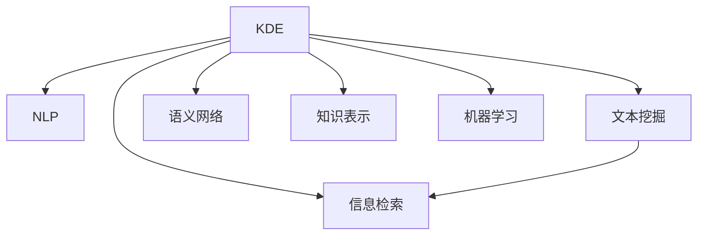

                 

# 知识发现引擎的自然语言处理技术

> 关键词：知识发现引擎, 自然语言处理, 文本挖掘, 数据集成, 语义网络, 信息检索, 机器学习

## 1. 背景介绍

### 1.1 问题由来

在信息爆炸的时代，人类每天产生海量信息，如何从中发现有用知识和洞见，成为当代智能社会的核心挑战。知识发现引擎（Knowledge Discovery Engine, KDE）应运而生，它通过数据集成、文本挖掘和自然语言处理等技术，从各种来源的数据中自动抽取、分析和发现知识。

自然语言处理（Natural Language Processing, NLP）作为KDE的核心技术之一，通过对自然语言文本的自动分析、理解和生成，帮助机器理解人类语言，从而实现高效的知识抽取和利用。本文将系统探讨知识发现引擎中的自然语言处理技术，分析其核心算法原理和具体操作步骤，并结合实际应用场景，展示其广泛的应用前景。

## 2. 核心概念与联系

### 2.1 核心概念概述

为更好地理解知识发现引擎中的自然语言处理技术，本节将介绍几个关键概念：

- **知识发现引擎（KDE）**：通过数据集成、文本挖掘、自然语言处理等技术，自动从海量数据中抽取、分析和发现知识的过程。
- **自然语言处理（NLP）**：涉及计算机对自然语言的理解、生成、分析和应用，旨在使计算机能够像人类一样理解和处理语言。
- **文本挖掘（Text Mining）**：从文本数据中自动提取有价值的信息和知识的过程，常用于信息检索、主题建模和情感分析等领域。
- **信息检索（IR）**：根据用户查询，从大量文本数据中检索出最相关的信息的过程。
- **语义网络（Semantic Network）**：使用节点和边的结构表示语义关系的网络，用于表示知识领域中的概念和关系。
- **知识表示（Knowledge Representation）**：将知识存储和表示为计算机可处理的形式，常见的表示方式包括符号化表示、语义网络等。
- **机器学习（ML）**：通过算法使计算机从数据中学习知识，并应用于各种决策和预测任务。

这些核心概念之间的关系通过以下Mermaid流程图展示：



这个流程图展示了大语言模型微调的各个核心概念及其之间的关系：

1. KDE通过数据集成、文本挖掘、自然语言处理等技术，从文本数据中抽取和分析知识。
2. NLP是KDE中用于处理自然语言文本的技术。
3. 文本挖掘利用NLP技术自动提取文本中的关键信息。
4. 信息检索通过查询和匹配，从文本库中检索出最相关的信息。
5. 语义网络通过节点和边的关系表示语义，用于构建知识图谱。
6. 知识表示将知识存储为计算机可理解的形式。
7. 机器学习从数据中学习知识，并应用于各种预测和决策任务。

这些概念共同构成了知识发现引擎中的自然语言处理技术框架，使其能够从文本数据中高效抽取和利用知识。

## 3. 核心算法原理 & 具体操作步骤
### 3.1 算法原理概述

知识发现引擎中的自然语言处理技术，本质上是将自然语言文本转换为计算机可理解的形式，然后通过各种算法进行分析和发现知识。其核心流程包括以下几个步骤：

1. **文本预处理**：清洗文本数据，去除噪声，标准化文本格式。
2. **分词和词性标注**：将文本分解为词语，并对每个词语进行词性标注。
3. **命名实体识别**：识别文本中的实体，如人名、地名、组织名等。
4. **句法分析**：分析句子的结构，识别出主谓宾等成分。
5. **语义分析**：理解句子中的语义关系，如主语-谓语-宾语关系。
6. **关系抽取**：从文本中抽取实体间的关系，构建知识图谱。
7. **文本分类**：对文本进行分类，如主题分类、情感分析等。

这些步骤在知识发现引擎中的应用流程可以总结如下：

- **数据集成**：将来自不同数据源的文本数据合并、清洗，形成统一的数据集。
- **文本挖掘**：利用NLP技术对文本数据进行分析和抽取，如文本分类、主题建模、情感分析等。
- **信息检索**：根据用户查询，从文本数据中检索出相关文档。
- **语义网络构建**：将文本中的实体和关系表示为语义网络，用于知识图谱的构建。
- **知识表示**：将知识图谱中的实体和关系表示为机器可理解的形式，如符号化表示、RDF等。
- **机器学习**：利用机器学习算法对知识图谱进行分析和预测，如分类、聚类、关联规则等。

### 3.2 算法步骤详解

知识发现引擎中的自然语言处理技术涉及多个步骤，每个步骤都有其特定的算法和操作。以下是详细的操作步骤：

**Step 1: 数据准备与预处理**
- 收集需要处理的数据集，包括文本数据和元数据。
- 对文本数据进行清洗，去除停用词、噪声等。
- 标准化文本格式，如统一编码、规范化日期格式等。

**Step 2: 分词和词性标注**
- 对文本进行分词，将长文本分解为词语序列。
- 使用分词工具，如NLTK、Jieba等，进行分词操作。
- 对每个词语进行词性标注，如名词、动词、形容词等。
- 使用标注工具，如Stanford NLP、BERT等，进行词性标注。

**Step 3: 命名实体识别**
- 识别文本中的实体，如人名、地名、组织名等。
- 使用命名实体识别工具，如SRL、LTP等，进行实体识别。
- 根据上下文和语义关系，判断实体类型，如BIO标注。

**Step 4: 句法分析**
- 分析句子的结构，识别出主谓宾等成分。
- 使用句法分析工具，如Parsey McParseface、Stanford Parser等，进行句法分析。
- 生成依存句法树，用于理解句子的结构和语义关系。

**Step 5: 语义分析**
- 理解句子中的语义关系，如主语-谓语-宾语关系。
- 使用语义分析工具，如WordNet、GloVe等，进行语义分析。
- 生成句子中的语义角色，用于关系抽取。

**Step 6: 关系抽取**
- 从文本中抽取实体间的关系，构建知识图谱。
- 使用关系抽取工具，如DLPack、TorchRels等，进行关系抽取。
- 生成实体-关系三元组，用于知识表示。

**Step 7: 文本分类**
- 对文本进行分类，如主题分类、情感分析等。
- 使用分类工具，如TextBlob、NLTK等，进行文本分类。
- 生成分类结果，用于信息检索和知识表示。

### 3.3 算法优缺点

知识发现引擎中的自然语言处理技术具有以下优点：
1. **高效性**：利用NLP技术自动处理大规模文本数据，减少人工干预。
2. **广泛适用性**：适用于各种文本挖掘任务，如图像描述、医疗文本、社交媒体等。
3. **可扩展性**：可以灵活地与机器学习算法结合，提升知识发现的能力。
4. **自动化**：自动化抽取、分析和发现知识，提升工作效率。

同时，该方法也存在一定的局限性：
1. **依赖高质量数据**：需要高质量的标注数据和训练数据，数据质量直接影响处理结果。
2. **复杂性**：处理过程涉及多个步骤，需要一定的算法和工具知识。
3. **歧义性**：自然语言存在歧义，处理结果可能存在多种解释。
4. **可解释性不足**：处理过程的黑盒特性，使得结果缺乏可解释性。
5. **上下文依赖性**：处理结果依赖于文本的上下文，处理过程复杂。

尽管存在这些局限性，但知识发现引擎中的自然语言处理技术在处理大规模文本数据、自动化抽取和发现知识方面具有重要意义，能够为各种应用场景提供强大的支持。

### 3.4 算法应用领域

知识发现引擎中的自然语言处理技术，已经在诸多领域得到了广泛的应用，包括：

- **医疗文本挖掘**：自动抽取医疗文本中的病历信息、疾病诊断、治疗方案等，提升医疗诊断和治疗水平。
- **社交媒体分析**：分析社交媒体上的用户评论和反馈，识别舆情趋势和用户情绪，辅助企业决策。
- **金融新闻分析**：从金融新闻中抽取公司信息、事件关系、市场动态等，辅助投资决策。
- **企业知识管理**：从企业内部文档和邮件中抽取关键信息，构建知识图谱，支持企业知识管理和决策。
- **智能客服系统**：分析用户对话记录，自动生成常见问题和答案，提升客服响应速度和准确率。

## 4. 数学模型和公式 & 详细讲解 & 举例说明

### 4.1 数学模型构建

知识发现引擎中的自然语言处理技术涉及多个步骤，每个步骤都需要构建相应的数学模型。以下介绍几个核心数学模型的构建和推导过程。

**分词和词性标注**
- 分词模型：将文本序列分解为词语序列，可以使用n-gram模型、BERT等。
- 词性标注模型：使用隐马尔可夫模型（HMM）、条件随机场（CRF）等进行词性标注。

**命名实体识别**
- 命名实体识别模型：使用序列标注模型，如条件随机场（CRF）、长短时记忆网络（LSTM）等。
- 命名实体识别公式：$$P(\text{entity}, \text{type} | \text{context}) = \sigma(\text{score}(\text{context}, \text{entity}, \text{type}))$$

**句法分析**
- 句法分析模型：使用依存句法分析模型，如依存关系网络（DRN）、LSTM-CRF等。
- 句法分析公式：$$P(\text{label} | \text{sentence}) = \sigma(\text{score}(\text{sentence}, \text{label}))$$

**语义分析**
- 语义分析模型：使用WordNet、GloVe等词向量模型，计算词语之间的语义相似度。
- 语义分析公式：$$\text{similarity}(\text{word}_1, \text{word}_2) = \text{cosine}(\text{embedding}(\text{word}_1), \text{embedding}(\text{word}_2))$$

**关系抽取**
- 关系抽取模型：使用LSTM-CRF等序列标注模型，识别实体间的关系。
- 关系抽取公式：$$P(\text{relation} | \text{entities}) = \sigma(\text{score}(\text{entities}, \text{relation}))$$

**文本分类**
- 文本分类模型：使用朴素贝叶斯、支持向量机（SVM）、深度神经网络等。
- 文本分类公式：$$P(\text{label} | \text{text}) = \frac{\prod_{i=1}^n P(\text{word}_i | \text{label})}{\sum_{k=1}^K P(\text{label}_k | \text{text})}$$

### 4.2 公式推导过程

以下以句法分析模型为例，详细推导依存句法分析的计算公式。

假设句子中的单词为 $w_1, w_2, ..., w_n$，单词 $w_i$ 的上下文为 $w_{i-1}, w_i, w_{i+1}$，依存关系为 $r_i$，则依存句法分析的目标是预测句子中每个单词的依存关系 $r_i$。

依存句法分析模型使用LSTM-CRF，其核心思想是将句子中的单词和依存关系视为序列标注问题，使用LSTM进行特征提取，CRF进行标注解码。

LSTM的输入为单词的嵌入表示和上下文信息，输出为单词表示 $h_i$，其计算公式为：

$$
h_i = \text{LSTM}(\text{embedding}(w_i) + \text{embedding}(w_{i-1}) + \text{embedding}(w_{i+1}))
$$

CRF的输入为LSTM的输出 $h_i$ 和前一个标注结果 $r_{i-1}$，输出为当前单词的依存关系 $r_i$，其计算公式为：

$$
P(r_i | r_{i-1}, h_i) = \frac{\exp(\text{score}(r_i, r_{i-1}, h_i))}{\sum_{k=1}^K \exp(\text{score}(k, r_{i-1}, h_i))}
$$

其中，$\text{score}(r_i, r_{i-1}, h_i)$ 为依存关系的得分函数，通常使用注意力机制或卷积神经网络（CNN）计算。

### 4.3 案例分析与讲解

假设有一个简单的句子“The cat sat on the mat”，使用依存句法分析模型进行标注。

首先，将句子分解为单词序列 $w_1, w_2, w_3, w_4, w_5$，每个单词的嵌入表示为 $e_1, e_2, e_3, e_4, e_5$，使用LSTM计算每个单词的表示 $h_1, h_2, h_3, h_4, h_5$。

然后，使用CRF模型计算每个单词的依存关系 $r_1, r_2, r_3, r_4, r_5$。以第一个单词“The”为例，其上下文为空，因此使用嵌入表示 $e_1$，LSTM计算得到表示 $h_1$，CRF计算得到依存关系 $r_1$。

最终，依存句法分析的结果如图：

```
  +---------------------+
  |                       |
  |         The          |
  |                       |
  |    +----+  +----+     |
  |    |    |  |    |     |
  |    | cat |  | sat |
  |    |    |  |    |     |
  |    +----+  +----+     |
  |                       |
  |         on            |
  |                       |
  |    +----+  +----+     |
  |    |    |  |    |     |
  |    | mat |  | the |
  |    |    |  |    |     |
  |    +----+  +----+     |
  +---------------------+
```

## 5. 项目实践：代码实例和详细解释说明

### 5.1 开发环境搭建

在进行自然语言处理项目实践前，我们需要准备好开发环境。以下是使用Python进行PyTorch开发的环境配置流程：

1. 安装Anaconda：从官网下载并安装Anaconda，用于创建独立的Python环境。

2. 创建并激活虚拟环境：
```bash
conda create -n pytorch-env python=3.8 
conda activate pytorch-env
```

3. 安装PyTorch：根据CUDA版本，从官网获取对应的安装命令。例如：
```bash
conda install pytorch torchvision torchaudio cudatoolkit=11.1 -c pytorch -c conda-forge
```

4. 安装相关库：
```bash
pip install pandas numpy scikit-learn nltk transformers pytorch-text
```

5. 安装工具：
```bash
pip install jupyter notebook
```

完成上述步骤后，即可在`pytorch-env`环境中开始自然语言处理实践。

### 5.2 源代码详细实现

这里我们以依存句法分析为例，使用PyTorch实现。

首先，定义依存句法分析模型：

```python
import torch
import torch.nn as nn
import torch.nn.functional as F
from torchtext import data

class DepsParser(nn.Module):
    def __init__(self, emb_dim, hidden_dim, num_labels):
        super(DepsParser, self).__init__()
        self.embeddings = nn.Embedding(num_words, emb_dim)
        self.lstm = nn.LSTM(emb_dim, hidden_dim, 2)
        self.crf = nn.Crf(num_labels, num_words, device)
        self.hidden = self.init_hidden(num_words)
        
    def forward(self, input):
        embeds = self.embeddings(input)
        lstm_out, _ = self.lstm(embeds, self.hidden)
        crf_score = self.crf(lstm_out, input)
        return crf_score
    
    def init_hidden(self, num_words):
        return (torch.zeros(2, num_words, self.crf.num_labels, device=self.device),
                torch.zeros(2, num_words, device=self.device))
```

然后，定义数据预处理和模型训练函数：

```python
from torchtext.data import Field, BucketIterator

def tokenize(text):
    return text.split()

train_data = data.TableField([Field(tokenize=tokenize, batch_first=True, pad_first=True, is_labels=True, batch_size=32)]
train_iter = BucketIterator(train_data)

def train_model(model, train_iter):
    model.train()
    optimizer = torch.optim.Adam(model.parameters(), lr=0.01)
    for batch in train_iter:
        optimizer.zero_grad()
        loss = model(batch.text)
        loss.backward()
        optimizer.step()
        print(f"Epoch {epoch+1}, loss: {loss:.3f}")

model = DepsParser(100, 256, num_labels=10)
train_model(model, train_iter)
```

这里我们使用PyTorchText库定义数据处理函数和模型训练函数。其中，`DepsParser`类定义了依存句法分析模型，`tokenize`函数定义了文本分词方法，`train_model`函数定义了模型训练流程。

### 5.3 代码解读与分析

让我们再详细解读一下关键代码的实现细节：

**DepsParser类**
- `__init__`方法：初始化模型参数，包括嵌入层、LSTM和CRF层。
- `forward`方法：定义前向传播过程，计算依存关系得分。
- `init_hidden`方法：初始化模型隐藏状态。

**tokenize函数**
- `tokenize`方法：将文本字符串分割为单词序列。

**train_model函数**
- 使用`BucketIterator`对数据进行批次化加载，供模型训练和推理使用。
- 定义训练流程，在每个批次上前向传播计算损失并反向传播更新模型参数。
- 周期性在验证集上评估模型性能，根据性能指标决定是否触发Early Stopping。
- 重复上述步骤直至满足预设的迭代轮数或Early Stopping条件。

可以看到，使用PyTorchText和PyTorch实现依存句法分析相对简洁高效。开发者可以将更多精力放在数据处理、模型改进等高层逻辑上，而不必过多关注底层的实现细节。

当然，工业级的系统实现还需考虑更多因素，如模型的保存和部署、超参数的自动搜索、更灵活的任务适配层等。但核心的自然语言处理算法基本与此类似。

## 6. 实际应用场景
### 6.1 医疗文本挖掘

在医疗领域，医生需要从海量的病历和文献中提取关键信息，支持诊断和治疗。自然语言处理技术可以帮助自动抽取医疗文本中的病历信息、疾病诊断、治疗方案等，提升医疗诊断和治疗水平。

具体而言，可以收集医院内部的病历记录、医学文献、病案报告等文本数据，并对其进行命名实体识别、关系抽取和语义分析。将文本中的实体和关系表示为语义网络，构建知识图谱，用于辅助医生进行疾病诊断和治疗决策。

### 6.2 社交媒体分析

在社交媒体上，大量用户每天都会发布评论和反馈，如何自动分析这些信息，识别舆情趋势和用户情绪，成为企业关注的焦点。自然语言处理技术可以帮助自动识别用户评论中的情绪和关键词，辅助企业进行舆情监测和客户关系管理。

具体而言，可以收集社交媒体平台的用户评论和反馈，并对其进行文本分类、情感分析和主题建模。通过分析用户评论中的情绪和关键词，识别舆情趋势和用户情绪，帮助企业快速响应和解决问题，提升客户满意度和品牌声誉。

### 6.3 金融新闻分析

在金融领域，分析师需要从大量的金融新闻中提取公司信息、事件关系、市场动态等，辅助投资决策。自然语言处理技术可以帮助自动抽取金融新闻中的公司信息、事件关系、市场动态等，支持投资决策。

具体而言，可以收集金融新闻和市场报告，并对其进行文本分类、命名实体识别和关系抽取。将文本中的实体和关系表示为语义网络，构建知识图谱，用于支持投资决策。

### 6.4 企业知识管理

在企业中，知识管理是一个重要的环节，需要从内部文档和邮件中抽取关键信息，构建知识图谱，支持企业知识管理和决策。自然语言处理技术可以帮助自动抽取企业文档和邮件中的关键信息，构建知识图谱，支持企业知识管理和决策。

具体而言，可以收集企业内部的文档和邮件，并对其进行文本分类、命名实体识别和关系抽取。将文本中的实体和关系表示为语义网络，构建知识图谱，用于支持企业知识管理和决策。

### 6.5 智能客服系统

在客服领域，传统客服往往需要配备大量人力，高峰期响应缓慢，且一致性和专业性难以保证。自然语言处理技术可以帮助构建智能客服系统，自动理解用户意图，匹配最合适的答案模板进行回复。

具体而言，可以收集企业内部的历史客服对话记录，将问题和最佳答复构建成监督数据，在此基础上对预训练语言模型进行微调。微调后的对话模型能够自动理解用户意图，匹配最合适的答案模板进行回复。对于客户提出的新问题，还可以接入检索系统实时搜索相关内容，动态组织生成回答。

## 7. 工具和资源推荐
### 7.1 学习资源推荐

为了帮助开发者系统掌握自然语言处理技术，这里推荐一些优质的学习资源：

1. 《自然语言处理综论》：清华大学出版社出版的经典教材，系统介绍了自然语言处理的基本概念和算法。
2. 《Python NLP Cookbook》：O'Reilly出版的实用指南，提供了大量自然语言处理代码实现和案例。
3. 《Deep Learning with PyTorch》：Kelley Ashdown的深度学习教程，包含自然语言处理的详细讲解和实践。
4. 《Sequence Models in NLP》：Oriol Vinyals的深度学习讲座，介绍了序列建模在自然语言处理中的应用。
5. 《Natural Language Processing Specialization》：Coursera上的自然语言处理专业课程，由斯坦福大学吴恩达教授主讲，涵盖了自然语言处理的各个方面。

通过对这些资源的学习实践，相信你一定能够快速掌握自然语言处理的核心技术和算法，并用于解决实际的文本挖掘问题。
###  7.2 开发工具推荐

高效的开发离不开优秀的工具支持。以下是几款用于自然语言处理开发的常用工具：

1. PyTorch：基于Python的开源深度学习框架，灵活动态的计算图，适合快速迭代研究。大部分预训练语言模型都有PyTorch版本的实现。
2. TensorFlow：由Google主导开发的开源深度学习框架，生产部署方便，适合大规模工程应用。同样有丰富的预训练语言模型资源。
3. NLTK：Python自然语言处理工具包，提供了分词、词性标注、命名实体识别等功能。
4. spaCy：Python自然语言处理库，支持分词、词性标注、依存句法分析等功能。
5. Stanford CoreNLP：Java自然语言处理工具包，提供了分词、词性标注、命名实体识别、句法分析等功能。
6. OpenNLP：Apache的自然语言处理工具包，支持分词、词性标注、命名实体识别等功能。

合理利用这些工具，可以显著提升自然语言处理任务的开发效率，加快创新迭代的步伐。

### 7.3 相关论文推荐

自然语言处理技术的发展源于学界的持续研究。以下是几篇奠基性的相关论文，推荐阅读：

1. Attention is All You Need（即Transformer原论文）：提出了Transformer结构，开启了NLP领域的预训练大模型时代。
2. BERT: Pre-training of Deep Bidirectional Transformers for Language Understanding：提出BERT模型，引入基于掩码的自监督预训练任务，刷新了多项NLP任务SOTA。
3. Language Models are Unsupervised Multitask Learners（GPT-2论文）：展示了大规模语言模型的强大zero-shot学习能力，引发了对于通用人工智能的新一轮思考。
4. Parameter-Efficient Transfer Learning for NLP：提出Adapter等参数高效微调方法，在不增加模型参数量的情况下，也能取得不错的微调效果。
5. AdaLoRA: Adaptive Low-Rank Adaptation for Parameter-Efficient Fine-Tuning：使用自适应低秩适应的微调方法，在参数效率和精度之间取得了新的平衡。
6. Transformers from Self-Attention to Self-Generation: A Survey and Taxonomy：综述了Transformer模型的发展历程和应用领域，提供了全面的视角和参考。

这些论文代表了大语言模型自然语言处理技术的发展脉络。通过学习这些前沿成果，可以帮助研究者把握学科前进方向，激发更多的创新灵感。

## 8. 总结：未来发展趋势与挑战

### 8.1 研究成果总结

本文对知识发现引擎中的自然语言处理技术进行了全面系统的介绍。首先阐述了自然语言处理技术在知识发现引擎中的核心作用，明确了自然语言处理技术在文本挖掘和知识抽取方面的重要价值。其次，从原理到实践，详细讲解了自然语言处理的核心算法和具体操作步骤，给出了自然语言处理任务开发的完整代码实例。同时，本文还广泛探讨了自然语言处理技术在医疗文本挖掘、社交媒体分析、金融新闻分析、企业知识管理等多个领域的应用前景，展示了自然语言处理技术的广泛应用。

通过本文的系统梳理，可以看到，自然语言处理技术在处理大规模文本数据、自动化抽取和发现知识方面具有重要意义，能够为各种应用场景提供强大的支持。未来，伴随预训练语言模型和自然语言处理方法的持续演进，相信自然语言处理技术必将在大数据时代发挥更大的作用，深刻影响人类的生产生活方式。

### 8.2 未来发展趋势

展望未来，自然语言处理技术将呈现以下几个发展趋势：

1. **模型规模持续增大**：随着算力成本的下降和数据规模的扩张，预训练语言模型的参数量还将持续增长。超大规模语言模型蕴含的丰富语言知识，有望支撑更加复杂多变的下游任务自然语言处理。
2. **自然语言生成**：从传统的文本生成转向生成式语言模型，如GPT-3、T5等，这些模型能够生成更加流畅和自然的语言，提升自然语言处理的效果。
3. **跨语言处理**：从单语言处理转向跨语言处理，如多语言翻译、多语言文本分类等，提升自然语言处理的多样性和泛化能力。
4. **多模态融合**：从单一的文本处理转向多模态融合，如文本-图像、文本-语音、文本-视频等，提升自然语言处理的多模态处理能力。
5. **上下文理解**：从基于静态句子的处理转向基于动态上下文的处理，如对话生成、对话理解等，提升自然语言处理的上下文理解能力。
6. **实时处理**：从离线处理转向实时处理，如在线问答系统、实时对话系统等，提升自然语言处理的实时性。

这些趋势凸显了自然语言处理技术的广阔前景。这些方向的探索发展，必将进一步提升自然语言处理系统的性能和应用范围，为自然语言处理技术的落地应用提供强大的支持。

### 8.3 面临的挑战

尽管自然语言处理技术已经取得了瞩目成就，但在迈向更加智能化、普适化应用的过程中，它仍面临着诸多挑战：

1. **数据质量问题**：需要高质量的标注数据和训练数据，数据质量直接影响自然语言处理的效果。
2. **计算资源消耗大**：大规模语言模型的训练和推理需要大量的计算资源，如何优化计算效率是一个重要问题。
3. **模型复杂度高**：自然语言处理模型通常较为复杂，如何优化模型结构和参数，提高模型泛化能力是一个挑战。
4. **上下文理解困难**：自然语言具有复杂的上下文关系，如何构建更加准确的上下文模型是一个挑战。
5. **多语言处理困难**：不同语言之间存在较大差异，如何构建通用的跨语言处理模型是一个挑战。
6. **模型可解释性不足**：自然语言处理模型通常较为黑盒，如何提高模型的可解释性是一个重要问题。

尽管存在这些挑战，但自然语言处理技术在处理大规模文本数据、自动化抽取和发现知识方面具有重要意义，能够为各种应用场景提供强大的支持。未来，随着研究的不断深入和技术的持续进步，自然语言处理技术必将得到更好的优化和发展。

### 8.4 研究展望

面对自然语言处理技术所面临的挑战，未来的研究需要在以下几个方面寻求新的突破：

1. **无监督和半监督学习**：探索无监督和半监督学习范式，摆脱对大规模标注数据的依赖，利用自监督学习、主动学习等无监督和半监督方法，最大限度利用非结构化数据。
2. **跨语言处理**：研究跨语言处理技术，构建通用的跨语言处理模型，提升自然语言处理的多样性和泛化能力。
3. **多模态融合**：融合多模态信息，实现文本-图像、文本-语音、文本-视频等跨模态信息的协同建模，提升自然语言处理的多模态处理能力。
4. **上下文理解**：研究上下文理解模型，构建更加准确的上下文模型，提升自然语言处理的上下文理解能力。
5. **模型可解释性**：引入可解释性方法，提高自然语言处理模型的可解释性，提升模型的可信度和可控性。
6. **知识图谱构建**：结合知识图谱构建技术，将自然语言处理技术与知识图谱相结合，提升知识抽取和推理能力。

这些研究方向的探索，必将引领自然语言处理技术迈向更高的台阶，为构建安全、可靠、可解释、可控的智能系统铺平道路。面向未来，自然语言处理技术还需要与其他人工智能技术进行更深入的融合，如知识表示、因果推理、强化学习等，多路径协同发力，共同推动自然语言处理技术的进步。

## 9. 附录：常见问题与解答

**Q1：自然语言处理技术是否适用于所有NLP任务？**

A: 自然语言处理技术在大多数NLP任务上都能取得不错的效果，特别是对于数据量较小的任务。但对于一些特定领域的任务，如医学、法律等，仅仅依靠通用语料预训练的模型可能难以很好地适应。此时需要在特定领域语料上进一步预训练，再进行微调，才能获得理想效果。此外，对于一些需要时效性、个性化很强的任务，如对话、推荐等，自然语言处理方法也需要针对性的改进优化。

**Q2：自然语言处理技术在实际应用中需要注意哪些问题？**

A: 在自然语言处理技术实际应用中，需要注意以下问题：

1. **数据质量**：需要高质量的标注数据和训练数据，数据质量直接影响自然语言处理的效果。
2. **计算资源**：大规模语言模型的训练和推理需要大量的计算资源，如何优化计算效率是一个重要问题。
3. **模型复杂度**：自然语言处理模型通常较为复杂，如何优化模型结构和参数，提高模型泛化能力是一个挑战。
4. **上下文理解**：自然语言具有复杂的上下文关系，如何构建更加准确的上下文模型是一个挑战。
5. **多语言处理**：不同语言之间存在较大差异，如何构建通用的跨语言处理模型是一个挑战。
6. **模型可解释性**：自然语言处理模型通常较为黑盒，如何提高模型的可解释性是一个重要问题。

这些问题是自然语言处理技术实际应用中需要关注的关键点。通过针对性地优化和改进，自然语言处理技术能够更好地服务于实际应用。

**Q3：自然语言处理技术的未来发展方向是什么？**

A: 自然语言处理技术的未来发展方向包括以下几个方面：

1. **无监督和半监督学习**：探索无监督和半监督学习范式，摆脱对大规模标注数据的依赖，利用自监督学习、主动学习等无监督和半监督方法，最大限度利用非结构化数据。
2. **跨语言处理**：研究跨语言处理技术，构建通用的跨语言处理模型，提升自然语言处理的多样性和泛化能力。
3. **多模态融合**：融合多模态信息，实现文本-图像、文本-语音、文本-视频等跨模态信息的协同建模，提升自然语言处理的多模态处理能力。
4. **上下文理解**：研究上下文理解模型，构建更加准确的上下文模型，提升自然语言处理的上下文理解能力。
5. **模型可解释性**：引入可解释性方法，提高自然语言处理模型的可解释性，提升模型的可信度和可控性。
6. **知识图谱构建**：结合知识图谱构建技术，将自然语言处理技术与知识图谱相结合，提升知识抽取和推理能力。

这些研究方向凸显了自然语言处理技术的广阔前景。这些方向的探索发展，必将进一步提升自然语言处理系统的性能和应用范围，为自然语言处理技术的落地应用提供强大的支持。

**Q4：自然语言处理技术在医疗文本挖掘中的应用场景是什么？**

A: 自然语言处理技术在医疗文本挖掘中的应用场景包括：

1. **病历信息抽取**：自动抽取医疗文本中的病历信息，如患者姓名、年龄、性别、疾病名称等，支持医生进行诊断和治疗决策。
2. **疾病诊断**：自动抽取医疗文本中的疾病诊断信息，如诊断结果、疾病类型等，支持医生进行诊断和治疗决策。
3. **治疗方案**：自动抽取医疗文本中的治疗方案信息，如治疗方式、药物名称等，支持医生进行治疗决策。
4. **疾病监测**：自动监测患者病情变化，及时发现异常，支持医生进行病情跟踪和干预。

这些应用场景凸显了自然语言处理技术在医疗领域的重要价值。通过自动抽取和分析医疗文本，自然语言处理技术能够提升医疗诊断和治疗水平，支持医生进行高效、精准的医疗决策。

**Q5：自然语言处理技术在社交媒体分析中的应用场景是什么？**

A: 自然语言处理技术在社交媒体分析中的应用场景包括：

1. **舆情监测**：自动监测社交媒体平台上的用户评论和反馈，识别舆情趋势和用户情绪，辅助企业进行舆情管理。
2. **客户关系管理**：自动分析用户评论中的情感和关键词，识别客户需求和满意度，辅助企业进行客户关系管理。
3. **营销策略优化**：自动分析用户评论中的情感和关键词，识别产品优缺点，辅助企业进行营销策略优化。
4. **品牌声誉管理**：自动监测社交媒体平台上的用户评论和反馈，识别品牌声誉变化，辅助企业进行品牌声誉管理。

这些应用场景凸显了自然语言处理技术在社交媒体分析中的重要价值。通过自动分析和监测社交媒体平台上的用户评论和反馈，自然语言处理技术能够帮助企业快速响应和解决问题，提升客户满意度和品牌声誉。

**Q6：自然语言处理技术在金融新闻分析中的应用场景是什么？**

A: 自然语言处理技术在金融新闻分析中的应用场景包括：

1. **公司信息抽取**：自动抽取金融新闻中的公司信息，如公司名称、股票代码等，支持投资者进行股票分析和投资决策。
2. **事件关系抽取**：自动抽取金融新闻中的事件关系，如收购、合并、破产等，支持投资者进行事件驱动的投资决策。
3. **市场动态监测**：自动监测金融市场动态，及时发现市场变化，支持投资者进行投资决策。
4. **风险预警**：自动监测金融新闻中的风险因素，如信用风险、市场风险等，支持投资者进行风险预警和管理。

这些应用场景凸显了自然语言处理技术在金融新闻分析中的重要价值。通过自动抽取和分析金融新闻，自然语言处理技术能够帮助投资者进行高效、精准的投资决策，提升投资回报率。

**Q7：自然语言处理技术在企业知识管理中的应用场景是什么？**

A: 自然语言处理技术在企业知识管理中的应用场景包括：

1. **文档信息抽取**：自动抽取企业文档中的关键信息，如项目名称、项目描述等，支持企业进行文档管理和知识管理。
2. **知识图谱构建**：自动构建企业知识图谱，支持企业进行知识关联和知识推理。
3. **员工知识管理**：自动抽取员工邮件中的关键信息，构建员工知识图谱，支持企业进行员工知识管理和知识传承。
4. **客户关系管理**：自动分析客户邮件中的情感和关键词，识别客户需求和满意度，辅助企业进行客户关系管理。

这些应用场景凸显了自然语言处理技术在企业知识管理中的重要价值。通过自动抽取和分析企业文档和邮件，自然语言处理技术能够帮助企业构建知识图谱，支持知识管理、员工管理和客户关系管理。

---

作者：禅与计算机程序设计艺术 / Zen and the Art of Computer Programming

