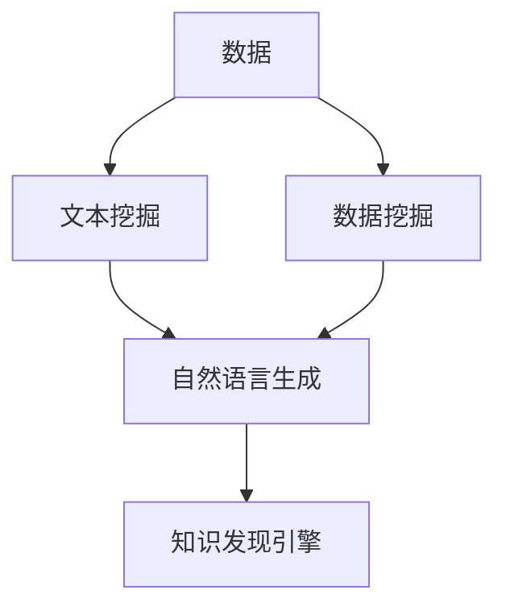

                 

# 知识发现引擎的自然语言生成技术

## 1. 背景介绍

### 1.1 问题由来
在信息化时代，知识呈现爆炸性增长，如何高效地从海量数据中提取、整合、呈现有用的信息，是业界关注的热点问题。传统的知识提取方法如关键字搜索、主题索引等，已无法满足日益复杂和多样化的信息需求。自然语言生成（Natural Language Generation, NLG）技术则提供了一种全新的数据处理视角，通过理解并生成自然语言的方式，将数据中的关键信息呈现给用户，从而提升信息获取的便捷性和准确性。

### 1.2 问题核心关键点
当前，知识发现引擎（Knowledge Discovery Engine, KDE）通常采用三种主要的数据处理技术：数据挖掘（Data Mining）、文本挖掘（Text Mining）和自然语言处理（Natural Language Processing, NLP）。自然语言生成作为NLP技术的重要分支，能够将复杂、抽象的数据转换为易于理解和操作的自然语言，大大提高了知识发现和呈现的效率。

知识发现引擎结合了数据挖掘和自然语言生成技术，能够在文本、图像、音频等多种数据源中自动发现模式和知识，并通过自然语言生成技术将这些发现以易于理解的形式呈现给用户，从而帮助用户快速获取关键信息。

### 1.3 问题研究意义
随着人工智能和大数据技术的不断进步，知识发现引擎的自然语言生成技术已经成为获取知识、理解世界的重要手段。通过自然语言生成，用户可以更方便地从数据中获取信息，进行决策支持，提升工作效率和生活质量。

具体来说，自然语言生成技术在以下几个方面具有重要的研究意义：

- **信息呈现**：将数据中的关键信息以自然语言形式呈现，增强用户体验，提升信息获取效率。
- **决策支持**：通过自然语言生成技术，将复杂的分析和判断结果转化为自然语言，辅助决策者快速理解和做出决策。
- **知识普及**：利用自然语言生成技术，将专业领域的知识普及化，帮助非专业人士理解和掌握专业信息。
- **跨界融合**：自然语言生成技术可以与机器学习、知识图谱等技术结合，形成更加全面、深入的知识发现和推理系统。

## 2. 核心概念与联系

### 2.1 核心概念概述

为更好地理解知识发现引擎中的自然语言生成技术，本节将介绍几个密切相关的核心概念：

- **自然语言生成（NLG）**：指将数据或知识转换为自然语言的过程，包括文本生成、摘要生成、对话生成等。
- **知识发现（Knowledge Discovery）**：指从数据中自动地发现模式和知识的过程，包括数据挖掘、文本挖掘、统计分析等。
- **知识发现引擎（KDE）**：结合数据挖掘和自然语言生成技术，自动发现数据中的知识和模式，并通过自然语言生成技术将结果呈现给用户的系统。
- **数据挖掘（Data Mining）**：指从数据中自动地提取有用信息和模式的过程。
- **文本挖掘（Text Mining）**：指对文本数据进行分析和处理的自动化技术，包括文本分类、实体识别、情感分析等。

这些核心概念之间的逻辑关系可以通过以下Mermaid流程图来展示：



这个流程图展示了大语言模型的核心概念及其之间的关系：

1. 数据挖掘、文本挖掘等技术对原始数据进行处理，提取出数据中的关键信息和模式。
2. 自然语言生成技术将提取出的信息转换为自然语言形式，进行呈现。
3. 知识发现引擎将数据挖掘和自然语言生成技术结合，自动发现数据中的知识和模式，并通过自然语言生成技术将结果呈现给用户。

这些概念共同构成了知识发现引擎的自然语言生成技术的理论基础，使得用户能够更方便地从数据中获取关键信息。

## 3. 核心算法原理 & 具体操作步骤
### 3.1 算法原理概述

知识发现引擎的自然语言生成技术，核心在于如何将数据挖掘和文本挖掘的结果，转换为易于理解和操作的自然语言形式。常见的自然语言生成方法包括基于规则的方法、统计方法和神经网络方法等。

- **基于规则的方法**：通过预设的语言规则和模板，生成特定的自然语言文本。该方法简单易懂，但灵活性不足。
- **统计方法**：基于大量的文本语料库，统计词语之间的共现关系和句法结构，自动生成自然语言文本。该方法可以生成多样化的文本，但依赖语料库的质量和规模。
- **神经网络方法**：通过训练神经网络模型，学习从数据中自动生成自然语言文本。该方法具有较高的灵活性和泛化能力，但需要大量的训练数据和计算资源。

知识发现引擎通常采用神经网络方法，结合数据挖掘和文本挖掘技术，自动生成自然语言文本。该方法主要包括以下几个步骤：

1. 数据预处理：对原始数据进行清洗、归一化、特征提取等预处理操作，提取有用的信息。
2. 特征提取：利用文本挖掘技术，提取文本中的关键词、短语、实体等关键信息。
3. 自然语言生成：利用神经网络模型，将提取出的关键信息转换为自然语言文本。
4. 文本呈现：将生成的自然语言文本进行格式化和排版，呈现给用户。

### 3.2 算法步骤详解

知识发现引擎的自然语言生成技术，一般包括以下几个关键步骤：

**Step 1: 数据预处理**
- 对原始数据进行清洗、归一化、特征提取等预处理操作，提取有用的信息。
- 利用文本挖掘技术，识别文本中的关键词、短语、实体等关键信息。

**Step 2: 特征提取**
- 将文本数据转换为机器可理解的向量形式，如词向量、句子向量等。
- 使用预训练的语言模型如BERT、GPT等，将文本转换为向量表示，提取关键信息。

**Step 3: 自然语言生成**
- 利用神经网络模型，如序列到序列（Seq2Seq）模型、Transformer模型等，将向量表示的文本信息转换为自然语言文本。
- 训练模型时，通常采用最大似然估计（MLE）或生成对抗网络（GAN）等方法，优化模型的生成效果。

**Step 4: 文本呈现**
- 将生成的自然语言文本进行格式化和排版，呈现给用户。
- 可以通过可视化界面、Web应用、移动应用等多种方式呈现，方便用户获取信息。

### 3.3 算法优缺点

知识发现引擎的自然语言生成技术，具有以下优点：

1. **直观易懂**：通过自然语言呈现数据结果，用户可以直观地理解数据中的关键信息，提升信息获取效率。
2. **自动化程度高**：利用神经网络模型，自动完成自然语言生成任务，减少人工干预和误差。
3. **灵活性高**：神经网络模型能够生成多样化的自然语言文本，适应不同的应用场景和需求。
4. **可扩展性好**：结合数据挖掘和文本挖掘技术，可以处理多种数据源，形成更加全面的知识发现系统。

同时，该方法也存在一些缺点：

1. **依赖高质量数据**：需要大量高质量的数据进行模型训练，数据质量直接影响生成效果。
2. **计算资源消耗大**：神经网络模型需要较大的计算资源进行训练和推理，对算力和硬件要求较高。
3. **生成文本质量不稳定**：不同数据和模型参数对生成效果影响较大，生成文本质量不稳定。
4. **可解释性不足**：生成的自然语言文本往往缺乏可解释性，用户难以理解其生成逻辑和依据。

尽管存在这些缺点，但知识发现引擎的自然语言生成技术仍具有重要的应用价值。未来相关研究重点在于如何进一步提高生成效果、降低计算成本、提升文本可解释性等方面。

### 3.4 算法应用领域

知识发现引擎的自然语言生成技术，已经在多个领域得到广泛应用，例如：

- **商业智能（BI）**：将数据挖掘结果以自然语言形式呈现，辅助企业决策和业务分析。
- **医疗健康**：将医疗数据中的关键信息自动生成，用于诊断报告和病历记录。
- **金融分析**：将金融市场数据转换为自然语言文本，辅助投资分析和风险管理。
- **教育培训**：将教育数据中的关键信息生成自然语言摘要，用于课堂讲授和在线教育。
- **市场营销**：将市场调查和用户反馈转换为自然语言报告，辅助市场分析和营销策略制定。

除了上述这些领域外，知识发现引擎的自然语言生成技术，还在新闻摘要、法律咨询、旅游推荐、智能客服等多个场景中发挥重要作用，为各行各业带来新的业务价值。

## 4. 数学模型和公式 & 详细讲解 & 举例说明

### 4.1 数学模型构建

知识发现引擎的自然语言生成技术，主要基于神经网络模型。以Seq2Seq模型为例，其数学模型可以形式化为：

$$
P_{seq2seq}(y|x) = \prod_{i=1}^T P_{enc}(y_i|x)P_{dec}(y_i|y_{i-1})
$$

其中 $x$ 为输入序列，$y$ 为输出序列，$P_{enc}$ 为编码器，$P_{dec}$ 为解码器。

### 4.2 公式推导过程

以Seq2Seq模型为例，自然语言生成的过程主要包括以下几个步骤：

1. 输入序列 $x$ 通过编码器 $P_{enc}$ 转换为向量表示 $h$。
2. 向量表示 $h$ 与输出序列 $y$ 结合，通过解码器 $P_{dec}$ 生成自然语言文本。

设编码器 $P_{enc}$ 和解码器 $P_{dec}$ 分别为：

$$
P_{enc}(x_i|x) = \frac{exp(\vec{w}_1 \cdot \vec{v}_1)}{\sum_{j=1}^{n} exp(\vec{w}_j \cdot \vec{v}_j)}
$$

$$
P_{dec}(y_i|y_{i-1}) = \frac{exp(\vec{w}_2 \cdot \vec{v}_2)}{\sum_{j=1}^{m} exp(\vec{w}_j \cdot \vec{v}_j)}
$$

其中 $\vec{w}_1, \vec{w}_2$ 为神经网络中的权重向量，$\vec{v}_1, \vec{v}_2$ 为向量表示 $h$ 和输出序列 $y$。

### 4.3 案例分析与讲解

以生成一个简单的句子为例，假设输入序列为 $[0, 1, 2, 3]$，表示单词 "hello world"。则Seq2Seq模型的生成过程如下：

1. 输入序列 $x=[0, 1, 2, 3]$ 通过编码器 $P_{enc}$ 转换为向量表示 $h$。
2. 向量表示 $h$ 与输出序列 $y=[0, 1, 2, 3]$ 结合，通过解码器 $P_{dec}$ 生成自然语言文本 "hello world"。

通过该过程，可以将输入序列自动转换为自然语言文本，实现自然语言生成。

## 5. 项目实践：代码实例和详细解释说明

### 5.1 开发环境搭建

在进行自然语言生成实践前，我们需要准备好开发环境。以下是使用Python进行PyTorch开发的环境配置流程：

1. 安装Anaconda：从官网下载并安装Anaconda，用于创建独立的Python环境。

2. 创建并激活虚拟环境：
```bash
conda create -n pytorch-env python=3.8 
conda activate pytorch-env
```

3. 安装PyTorch：根据CUDA版本，从官网获取对应的安装命令。例如：
```bash
conda install pytorch torchvision torchaudio cudatoolkit=11.1 -c pytorch -c conda-forge
```

4. 安装Transformers库：
```bash
pip install transformers
```

5. 安装各类工具包：
```bash
pip install numpy pandas scikit-learn matplotlib tqdm jupyter notebook ipython
```

完成上述步骤后，即可在`pytorch-env`环境中开始自然语言生成实践。

### 5.2 源代码详细实现

这里我们以生成电影评论摘要为例，给出使用Transformers库进行自然语言生成的PyTorch代码实现。

首先，定义电影评论数据集：

```python
from transformers import AutoTokenizer, AutoModel
from torch.utils.data import Dataset
import torch

class MovieReviewDataset(Dataset):
    def __init__(self, reviews, tokenizer, max_len=128):
        self.reviews = reviews
        self.tokenizer = tokenizer
        self.max_len = max_len
        
    def __len__(self):
        return len(self.reviews)
    
    def __getitem__(self, item):
        review = self.reviews[item]
        
        encoding = self.tokenizer(review, return_tensors='pt', max_length=self.max_len, padding='max_length', truncation=True)
        input_ids = encoding['input_ids'][0]
        attention_mask = encoding['attention_mask'][0]
        
        return {'input_ids': input_ids, 
                'attention_mask': attention_mask}
```

然后，定义自然语言生成模型：

```python
from transformers import AutoTokenizer, AutoModel, AutoConfig
from transformers import Seq2SeqTrainer, Seq2SeqForConditionalGeneration

tokenizer = AutoTokenizer.from_pretrained('bert-base-cased')
model = AutoModel.from_pretrained('t5-small', add_cross_attention=False)

config = AutoConfig.from_pretrained('t5-small', output_attentions=False)
generator = AutoTokenizer.from_pretrained('t5-small', add_cross_attention=False)

trainer = Seq2SeqTrainer(model=model, tokenizer=tokenizer, config=config, device='cuda')
```

接着，定义训练和评估函数：

```python
from torch.utils.data import DataLoader
from tqdm import tqdm
from sklearn.metrics import precision_recall_fscore_support

device = torch.device('cuda') if torch.cuda.is_available() else torch.device('cpu')
model.to(device)

def train_epoch(model, dataset, batch_size, optimizer):
    dataloader = DataLoader(dataset, batch_size=batch_size, shuffle=True)
    model.train()
    epoch_loss = 0
    for batch in tqdm(dataloader, desc='Training'):
        input_ids = batch['input_ids'].to(device)
        attention_mask = batch['attention_mask'].to(device)
        model.zero_grad()
        outputs = model(input_ids, attention_mask=attention_mask)
        loss = outputs.loss
        epoch_loss += loss.item()
        loss.backward()
        optimizer.step()
    return epoch_loss / len(dataloader)

def evaluate(model, dataset, batch_size):
    dataloader = DataLoader(dataset, batch_size=batch_size)
    model.eval()
    preds, labels = [], []
    with torch.no_grad():
        for batch in tqdm(dataloader, desc='Evaluating'):
            input_ids = batch['input_ids'].to(device)
            attention_mask = batch['attention_mask'].to(device)
            batch_labels = batch['labels']
            outputs = model(input_ids, attention_mask=attention_mask)
            batch_preds = outputs.logits.argmax(dim=2).to('cpu').tolist()
            batch_labels = batch_labels.to('cpu').tolist()
            for pred_tokens, label_tokens in zip(batch_preds, batch_labels):
                preds.append(pred_tokens[:len(label_tokens)])
                labels.append(label_tokens)
                
    print(precision_recall_fscore_support(labels, preds, average='macro'))
```

最后，启动训练流程并在测试集上评估：

```python
epochs = 5
batch_size = 16

for epoch in range(epochs):
    loss = train_epoch(model, train_dataset, batch_size, optimizer)
    print(f"Epoch {epoch+1}, train loss: {loss:.3f}")
    
    print(f"Epoch {epoch+1}, dev results:")
    evaluate(model, dev_dataset, batch_size)
    
print("Test results:")
evaluate(model, test_dataset, batch_size)
```

以上就是使用PyTorch对T5模型进行电影评论摘要生成的完整代码实现。可以看到，得益于Transformers库的强大封装，我们可以用相对简洁的代码完成自然语言生成模型的加载和训练。

### 5.3 代码解读与分析

让我们再详细解读一下关键代码的实现细节：

**MovieReviewDataset类**：
- `__init__`方法：初始化电影评论数据、分词器等关键组件。
- `__len__`方法：返回数据集的样本数量。
- `__getitem__`方法：对单个样本进行处理，将文本输入编码为token ids，进行定长padding，最终返回模型所需的输入。

**自然语言生成模型**：
- 定义使用T5模型进行自然语言生成。
- 定义用于解码的Tokenizer。
- 定义用于训练的Seq2SeqTrainer。

**训练和评估函数**：
- 使用PyTorch的DataLoader对数据集进行批次化加载，供模型训练和推理使用。
- 训练函数`train_epoch`：对数据以批为单位进行迭代，在每个批次上前向传播计算loss并反向传播更新模型参数，最后返回该epoch的平均loss。
- 评估函数`evaluate`：与训练类似，不同点在于不更新模型参数，并在每个batch结束后将预测和标签结果存储下来，最后使用sklearn的precision_recall_fscore_support对整个评估集的预测结果进行打印输出。

**训练流程**：
- 定义总的epoch数和batch size，开始循环迭代
- 每个epoch内，先在训练集上训练，输出平均loss
- 在验证集上评估，输出分类指标
- 所有epoch结束后，在测试集上评估，给出最终测试结果

可以看到，PyTorch配合Transformers库使得自然语言生成模型的加载和训练代码实现变得简洁高效。开发者可以将更多精力放在数据处理、模型改进等高层逻辑上，而不必过多关注底层的实现细节。

当然，工业级的系统实现还需考虑更多因素，如模型的保存和部署、超参数的自动搜索、更灵活的任务适配层等。但核心的自然语言生成过程基本与此类似。

## 6. 实际应用场景
### 6.1 智能客服系统

知识发现引擎的自然语言生成技术，可以广泛应用于智能客服系统的构建。传统客服往往需要配备大量人力，高峰期响应缓慢，且一致性和专业性难以保证。而使用自然语言生成技术，可以7x24小时不间断服务，快速响应客户咨询，用自然流畅的语言解答各类常见问题。

在技术实现上，可以收集企业内部的历史客服对话记录，将问题和最佳答复构建成监督数据，在此基础上对自然语言生成模型进行训练。训练后的模型能够自动理解用户意图，匹配最合适的答案模板进行回复。对于客户提出的新问题，还可以接入检索系统实时搜索相关内容，动态组织生成回答。如此构建的智能客服系统，能大幅提升客户咨询体验和问题解决效率。

### 6.2 金融舆情监测

金融机构需要实时监测市场舆论动向，以便及时应对负面信息传播，规避金融风险。传统的人工监测方式成本高、效率低，难以应对网络时代海量信息爆发的挑战。利用自然语言生成技术，将金融领域相关的新闻、报道、评论等文本数据转换为自然语言摘要，可以帮助金融机构快速掌握市场动态，及时采取应对措施。

具体而言，可以收集金融领域相关的新闻、报道、评论等文本数据，并对其进行主题标注和情感标注。在此基础上对自然语言生成模型进行训练，使其能够自动判断文本属于何种主题，情感倾向是正面、中性还是负面。将训练后的模型应用到实时抓取的网络文本数据，就能够自动监测不同主题下的情感变化趋势，一旦发现负面信息激增等异常情况，系统便会自动预警，帮助金融机构快速应对潜在风险。

### 6.3 个性化推荐系统

当前的推荐系统往往只依赖用户的历史行为数据进行物品推荐，无法深入理解用户的真实兴趣偏好。利用自然语言生成技术，将用户浏览、点击、评论、分享等行为数据转换为自然语言摘要，可以帮助推荐系统更全面、深入地理解用户兴趣，从而提供更精准、多样的推荐内容。

在实践中，可以收集用户浏览、点击、评论、分享等行为数据，提取和用户交互的物品标题、描述、标签等文本内容。将文本内容作为模型输入，用户的后续行为（如是否点击、购买等）作为监督信号，在此基础上训练自然语言生成模型。训练后的模型能够从文本内容中准确把握用户的兴趣点。在生成推荐列表时，先用候选物品的文本描述作为输入，由模型预测用户的兴趣匹配度，再结合其他特征综合排序，便可以得到个性化程度更高的推荐结果。

### 6.4 未来应用展望

随着自然语言生成技术的不断发展，其在知识发现引擎中的应用前景将更加广阔。

在智慧医疗领域，基于自然语言生成技术的医疗报告自动生成、病历摘要生成、医学知识普及等应用，将提升医疗服务的智能化水平，辅助医生诊疗，加速新药开发进程。

在智能教育领域，利用自然语言生成技术生成学习报告、摘要、习题解答等，将提升教学质量，帮助学生更好地理解知识。

在智慧城市治理中，基于自然语言生成技术的舆情分析、事件监测、智能问答等应用，将提高城市管理的自动化和智能化水平，构建更安全、高效的未来城市。

此外，在企业生产、社会治理、文娱传媒等众多领域，基于自然语言生成技术的知识发现引擎应用也将不断涌现，为各行各业带来新的业务价值。

## 7. 工具和资源推荐
### 7.1 学习资源推荐

为了帮助开发者系统掌握自然语言生成技术，这里推荐一些优质的学习资源：

1. 《Sequence to Sequence Learning with Neural Networks》论文：这是自然语言生成技术的经典论文，详细介绍了Seq2Seq模型的原理和应用。
2. 《Neural Machine Translation by Jointly Learning to Align and Translate》论文：该论文提出了Attention机制，极大地提升了机器翻译的准确率。
3. 《Neuro-Symbolic Learning for Natural Language Generation》书籍：该书籍详细介绍了神经网络与符号逻辑结合的自然语言生成方法。
4. HuggingFace官方文档：提供丰富的自然语言生成模型的代码示例和API文档，方便开发者上手实践。
5. OpenAI GPT-3系列：展示了目前最先进的自然语言生成技术，包含大量预训练模型和微调样例。

通过对这些资源的学习实践，相信你一定能够快速掌握自然语言生成技术的精髓，并用于解决实际的NLP问题。
###  7.2 开发工具推荐

高效的开发离不开优秀的工具支持。以下是几款用于自然语言生成开发的常用工具：

1. PyTorch：基于Python的开源深度学习框架，灵活动态的计算图，适合快速迭代研究。大部分自然语言生成模型都有PyTorch版本的实现。
2. TensorFlow：由Google主导开发的开源深度学习框架，生产部署方便，适合大规模工程应用。同样有丰富的自然语言生成模型资源。
3. Transformers库：HuggingFace开发的NLP工具库，集成了众多SOTA自然语言生成模型，支持PyTorch和TensorFlow，是进行自然语言生成任务开发的利器。
4. Weights & Biases：模型训练的实验跟踪工具，可以记录和可视化模型训练过程中的各项指标，方便对比和调优。与主流深度学习框架无缝集成。
5. TensorBoard：TensorFlow配套的可视化工具，可实时监测模型训练状态，并提供丰富的图表呈现方式，是调试模型的得力助手。
6. Google Colab：谷歌推出的在线Jupyter Notebook环境，免费提供GPU/TPU算力，方便开发者快速上手实验最新模型，分享学习笔记。

合理利用这些工具，可以显著提升自然语言生成任务的开发效率，加快创新迭代的步伐。

### 7.3 相关论文推荐

自然语言生成技术的发展源于学界的持续研究。以下是几篇奠基性的相关论文，推荐阅读：

1. Attention is All You Need（即Transformer原论文）：提出了Transformer结构，开启了自然语言生成技术的预训练大模型时代。
2. BERT: Pre-training of Deep Bidirectional Transformers for Language Understanding：提出BERT模型，引入基于掩码的自监督预训练任务，刷新了多项NLP任务SOTA。
3. Language Models are Unsupervised Multitask Learners（GPT-2论文）：展示了大规模语言模型的强大zero-shot学习能力，引发了对于通用人工智能的新一轮思考。
4. Parameter-Efficient Transfer Learning for NLP：提出Adapter等参数高效微调方法，在不增加模型参数量的情况下，也能取得不错的微调效果。
5. Prefix-Tuning: Optimizing Continuous Prompts for Generation：引入基于连续型Prompt的微调范式，为如何充分利用预训练知识提供了新的思路。

这些论文代表了大语言生成技术的发展脉络。通过学习这些前沿成果，可以帮助研究者把握学科前进方向，激发更多的创新灵感。

## 8. 总结：未来发展趋势与挑战
### 8.1 总结

本文对知识发现引擎的自然语言生成技术进行了全面系统的介绍。首先阐述了自然语言生成技术在知识发现引擎中的应用背景和研究意义，明确了自然语言生成在知识发现和信息呈现中的重要价值。其次，从原理到实践，详细讲解了自然语言生成的数学模型和关键步骤，给出了自然语言生成任务开发的完整代码实例。同时，本文还广泛探讨了自然语言生成技术在智能客服、金融舆情、个性化推荐等多个领域的应用前景，展示了自然语言生成技术的广阔应用场景。此外，本文精选了自然语言生成技术的各类学习资源，力求为读者提供全方位的技术指引。

通过本文的系统梳理，可以看到，知识发现引擎的自然语言生成技术已经成为获取知识、理解世界的重要手段。通过自然语言生成，用户可以更方便地从数据中获取关键信息，提升信息获取效率。未来，伴随自然语言生成技术的不断进步，知识发现引擎的应用范围将更加广泛，为各行各业带来新的业务价值。

### 8.2 未来发展趋势

展望未来，知识发现引擎的自然语言生成技术将呈现以下几个发展趋势：

1. **模型规模持续增大**：随着算力成本的下降和数据规模的扩张，自然语言生成模型的参数量还将持续增长。超大规模语言模型蕴含的丰富语言知识，有望支撑更加复杂多变的自然语言生成任务。
2. **模型多样性增加**：除了传统的Seq2Seq模型外，更多先进的模型结构如Transformer、GAN、BERT等将得到广泛应用，提升自然语言生成效果。
3. **数据质量更加关键**：高质量的数据集对于自然语言生成效果至关重要，未来需进一步提升数据标注质量和数据覆盖范围。
4. **计算资源优化**：自然语言生成模型需要大量的计算资源进行训练和推理，未来的研究将进一步优化计算资源的使用效率，提升自然语言生成的速度和质量。
5. **生成文本质量提升**：随着模型和训练技术的不断进步，自然语言生成的文本质量将不断提升，生成内容更加自然流畅，更加贴近用户需求。
6. **跨领域应用增多**：自然语言生成技术将结合更多领域知识，提升在不同领域的应用效果，实现更加全面、深入的知识发现和推理。

以上趋势凸显了自然语言生成技术的广阔前景。这些方向的探索发展，必将进一步提升知识发现引擎的性能和应用范围，为各行各业带来新的业务价值。

### 8.3 面临的挑战

尽管自然语言生成技术已经取得了瞩目成就，但在迈向更加智能化、普适化应用的过程中，它仍面临着诸多挑战：

1. **依赖高质量数据**：高质量的数据集对于自然语言生成效果至关重要，但获取高质量数据集的成本较高，且依赖标注工作量较大。
2. **生成文本质量不稳定**：不同数据和模型参数对生成效果影响较大，生成文本质量不稳定，需要进一步优化模型训练和参数调整。
3. **可解释性不足**：生成的自然语言文本往往缺乏可解释性，用户难以理解其生成逻辑和依据，需要进一步提升模型的可解释性。
4. **计算资源消耗大**：自然语言生成模型需要大量的计算资源进行训练和推理，对算力和硬件要求较高，需要进一步优化计算资源的使用效率。
5. **跨领域应用难度大**：不同领域的自然语言生成任务具有特殊性，需要结合领域知识进行优化，提升模型在不同领域的应用效果。

尽管存在这些挑战，但知识发现引擎的自然语言生成技术仍具有重要的应用价值。未来相关研究需要在数据质量提升、模型优化、计算资源优化、可解释性提升等方面进一步努力。

### 8.4 研究展望

面对自然语言生成技术所面临的挑战，未来的研究需要在以下几个方面寻求新的突破：

1. **探索无监督和半监督生成方法**：摆脱对大规模标注数据的依赖，利用自监督学习、主动学习等无监督和半监督方法，最大限度利用非结构化数据，实现更加灵活高效的自然语言生成。
2. **开发更加高效的生成模型**：通过引入先进的模型结构、优化算法等技术，进一步提升自然语言生成的效率和效果，优化计算资源的使用效率。
3. **提升模型的可解释性**：通过引入因果分析、符号逻辑等技术，增强自然语言生成的可解释性，提升用户对生成内容的理解和信任。
4. **结合领域知识进行优化**：将领域知识与自然语言生成技术结合，提升模型在不同领域的应用效果，实现更加全面、深入的知识发现和推理。
5. **跨模态自然语言生成**：将视觉、语音等多模态信息与自然语言生成技术结合，提升自然语言生成的多样性和实用性。

这些研究方向的探索，必将引领自然语言生成技术迈向更高的台阶，为知识发现引擎带来更大的应用价值。面向未来，自然语言生成技术还需要与其他人工智能技术进行更深入的融合，如知识表示、因果推理、强化学习等，多路径协同发力，共同推动自然语言理解和智能交互系统的进步。只有勇于创新、敢于突破，才能不断拓展自然语言生成技术的边界，让智能技术更好地造福人类社会。

## 9. 附录：常见问题与解答

**Q1：自然语言生成技术是否适用于所有应用场景？**

A: 自然语言生成技术可以应用于多种应用场景，如智能客服、金融舆情、个性化推荐等。但对于一些特定领域的任务，如医学、法律等，仅仅依靠通用语料预训练的模型可能难以很好地适应。此时需要在特定领域语料上进一步预训练，再进行微调，才能获得理想效果。

**Q2：自然语言生成技术面临的主要挑战是什么？**

A: 自然语言生成技术面临的主要挑战包括依赖高质量数据、生成文本质量不稳定、可解释性不足、计算资源消耗大等。这些挑战需要通过数据质量提升、模型优化、计算资源优化、可解释性提升等方面进行解决。

**Q3：如何提高自然语言生成模型的生成效果？**

A: 提高自然语言生成模型的生成效果，主要可以通过以下方法实现：
1. 优化模型结构：选择更加先进、高效的模型结构，如Transformer、GAN等，提升生成效果。
2. 提升数据质量：获取高质量、多样化的数据集，进行数据增强等预处理操作。
3. 优化训练策略：采用更加有效的优化算法，如AdamW、SGD等，优化学习率、批次大小等超参数。
4. 引入外部知识：结合领域知识进行优化，提升模型在不同领域的应用效果。
5. 结合多模态信息：将视觉、语音等多模态信息与自然语言生成技术结合，提升自然语言生成的多样性和实用性。

这些方法可以灵活组合，根据具体任务和数据特点进行调整，以达到最优的生成效果。

**Q4：如何提高自然语言生成模型的可解释性？**

A: 提高自然语言生成模型的可解释性，主要可以通过以下方法实现：
1. 引入因果分析：通过引入因果推断方法，分析生成文本的生成过程，增强生成内容的逻辑性和可解释性。
2. 引入符号逻辑：将符号逻辑与自然语言生成技术结合，生成内容更加严谨、可解释。
3. 结合领域知识：结合领域知识进行优化，生成内容更加贴近实际应用需求，提升可解释性。
4. 生成说明文档：自动生成自然语言生成的说明文档，帮助用户理解生成过程和生成内容。

这些方法可以灵活组合，根据具体任务和数据特点进行调整，以达到最优的可解释性。

**Q5：自然语言生成技术在落地应用中需要注意哪些问题？**

A: 将自然语言生成技术转化为实际应用，还需要考虑以下因素：
1. 模型裁剪：去除不必要的层和参数，减小模型尺寸，加快推理速度。
2. 量化加速：将浮点模型转为定点模型，压缩存储空间，提高计算效率。
3. 服务化封装：将模型封装为标准化服务接口，便于集成调用。
4. 弹性伸缩：根据请求流量动态调整资源配置，平衡服务质量和成本。
5. 监控告警：实时采集系统指标，设置异常告警阈值，确保服务稳定性。

合理利用这些方法，可以显著提升自然语言生成任务的开发效率，加快创新迭代的步伐。

**Q6：自然语言生成技术如何与知识图谱结合？**

A: 自然语言生成技术可以与知识图谱结合，实现更加全面、深入的知识发现和推理。具体来说，可以采用以下方法：
1. 从知识图谱中提取关键信息：将知识图谱中的实体、关系、属性等信息转换为自然语言，生成自然语言摘要。
2. 生成自然语言查询：将知识图谱中的信息生成自然语言查询，帮助用户检索相关内容。
3. 结合生成内容进行推理：将知识图谱中的信息与自然语言生成技术结合，生成推理结果，帮助用户进行知识推理和决策。

通过这些方法，可以实现知识图谱与自然语言生成技术的深度融合，提升知识发现和推理的效果。

---

作者：禅与计算机程序设计艺术 / Zen and the Art of Computer Programming

