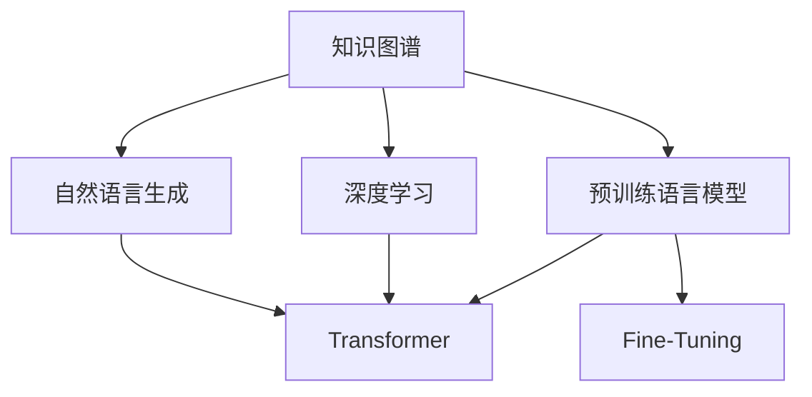

                 

# 知识发现引擎的自然语言生成技术应用

> 关键词：知识发现引擎, 自然语言生成, 机器学习, 深度学习, 数据分析, 数据可视化

## 1. 背景介绍

### 1.1 问题由来

在当今信息爆炸的时代，数据量和类型正在以前所未有的速度增长。企业和组织面临的一个主要挑战是如何从海量的数据中提取出有价值的知识，并将其转化为直观、易于理解的洞察。传统的报告和报表方式虽然能够展示关键指标，但很难捕捉数据背后的复杂关联和趋势。

自然语言生成（NLG）技术作为人工智能和自然语言处理（NLP）的一个分支，能够将数据转换为自然语言文本，帮助用户快速理解复杂的数据关系。近年来，随着机器学习和深度学习技术的快速发展，基于知识图谱和深度学习的自然语言生成方法不断涌现，为知识发现引擎提供了强大的数据理解和表达能力。

### 1.2 问题核心关键点

自然语言生成技术在知识发现引擎中的应用，旨在将复杂的分析结果和数据洞察转化为易于理解的自然语言文本。具体来说，主要包括以下几个核心关键点：

- 数据理解与分析：如何从多源异构的数据中提取关键信息，构建出能够反映数据特征和关系的知识图谱。
- 文本生成与表达：如何基于知识图谱生成简洁、准确、易于理解的自然语言文本，帮助用户快速掌握关键洞察。
- 模型优化与调优：如何优化自然语言生成模型，提升生成文本的质量和一致性，并使其能够适应不同的应用场景。
- 交互与反馈：如何通过自然语言生成技术与用户进行交互，获取用户反馈，优化模型的生成效果。

这些关键点构成了自然语言生成技术在知识发现引擎应用中的核心框架，使得系统能够从数据中提取和表达有价值的知识，提升用户的洞察力和决策效率。

### 1.3 问题研究意义

研究自然语言生成技术在知识发现引擎中的应用，对于提升数据洞察力和决策效率，推动数据驱动的业务决策具有重要意义：

- 提升用户洞察力：通过自然语言生成技术，将复杂的数据分析结果转化为易于理解的自然语言文本，帮助用户快速掌握关键洞察，提升业务决策效率。
- 促进数据驱动决策：自然语言生成技术能够将数据中的关键信息提炼出来，构建知识图谱，辅助用户进行数据驱动的决策分析。
- 推动行业应用创新：自然语言生成技术在金融、医疗、电商等多个领域的应用，将推动行业向智能化、自动化转型，提高工作效率和质量。
- 拓展知识传播渠道：自然语言生成技术能够将数据洞察转化为简洁、准确、易于理解的自然语言文本，提升知识的传播效率和影响力。

## 2. 核心概念与联系

### 2.1 核心概念概述

为了更好地理解自然语言生成技术在知识发现引擎中的应用，本节将介绍几个密切相关的核心概念：

- **知识图谱**：一种将实体、关系和属性以图形结构表示的数据模型，用于存储和表达实体间的复杂关系。
- **自然语言生成**：将数据转换为自然语言文本的过程，通常涉及文本生成、文本摘要、文本翻译、对话生成等多个子任务。
- **深度学习**：一种基于人工神经网络的机器学习范式，通过多层次的特征提取和表示学习，提升模型的表达能力和泛化能力。
- **Transformer**：一种基于自注意力机制的神经网络架构，广泛应用于NLP领域，提升模型的并行计算能力和表达能力。
- **预训练语言模型**：在大规模无标签文本数据上进行预训练，学习通用语言表示的语言模型，如BERT、GPT等。
- **Fine-Tuning**：在大规模预训练模型上进行微调，以适应特定任务的方法，提升模型在特定任务上的性能。

这些核心概念之间的逻辑关系可以通过以下Mermaid流程图来展示：



这个流程图展示了大语言模型微调在知识发现引擎中的应用框架：

1. 知识图谱用于存储和表达实体间的复杂关系。
2. 自然语言生成技术将知识图谱转换为自然语言文本。
3. 深度学习技术用于提取和表示知识图谱中的关键信息。
4. Transformer架构提升自然语言生成模型的表达能力和并行计算能力。
5. 预训练语言模型在无标签数据上进行预训练，学习通用的语言表示。
6. Fine-Tuning方法在大规模预训练模型上进行微调，以适应特定任务。

这些概念共同构成了知识发现引擎的自然语言生成应用框架，使得系统能够从数据中提取和表达有价值的知识，提升用户的洞察力和决策效率。

## 3. 核心算法原理 & 具体操作步骤
### 3.1 算法原理概述

知识发现引擎中的自然语言生成技术，本质上是一个基于深度学习的文本生成过程。其核心思想是：通过构建知识图谱，将数据中的关键信息编码为知识节点，然后利用深度学习模型，将知识节点转化为自然语言文本。

形式化地，假设知识图谱为 $\mathcal{G}$，其中包含实体 $E$、关系 $R$ 和属性 $A$，知识节点表示为三元组 $(e,r,a)$，其中 $e$ 表示实体，$r$ 表示关系，$a$ 表示属性。自然语言生成模型的目标是从知识图谱 $\mathcal{G}$ 中生成自然语言文本 $T$，即：

$$
T = \text{NLG}(\mathcal{G})
$$

其中，$\text{NLG}$ 表示自然语言生成模型，$T$ 表示生成的自然语言文本。

### 3.2 算法步骤详解

知识发现引擎中的自然语言生成技术一般包括以下几个关键步骤：

**Step 1: 构建知识图谱**

- 收集和整理结构化数据，构建知识图谱，包括实体、关系和属性等。
- 使用知识工程工具或自动化技术，将数据转换为知识图谱的表示形式，如三元组或语义网形式。

**Step 2: 预训练语言模型**

- 选择合适的预训练语言模型，如BERT、GPT等，用于提取和表示知识节点中的信息。
- 在大规模无标签文本数据上预训练模型，学习通用的语言表示。

**Step 3: 微调模型**

- 收集特定任务的标注数据，如问答、摘要、对话等，对预训练模型进行微调，适应特定任务的需求。
- 选择合适的损失函数和优化算法，如交叉熵损失、AdamW优化器等，最小化模型在特定任务上的损失。

**Step 4: 生成文本**

- 将知识图谱中的知识节点输入微调后的模型，生成自然语言文本。
- 通过后处理技术，对生成的文本进行语法检查、去重、格式化等操作，提高文本的质量。

**Step 5: 反馈与优化**

- 获取用户反馈，对生成的文本进行评估和改进。
- 根据用户反馈，调整模型的参数和超参数，优化生成文本的质量和一致性。

以上是知识发现引擎中自然语言生成技术的一般流程。在实际应用中，还需要针对具体任务的特点，对各个环节进行优化设计，如改进知识图谱表示方法，引入更多的自然语言处理技术，搜索最优的超参数组合等，以进一步提升生成文本的质量和效率。

### 3.3 算法优缺点

知识发现引擎中的自然语言生成技术具有以下优点：

- **直观易懂**：生成的自然语言文本易于理解，能够直观地展示复杂数据关系，提升用户的洞察力和决策效率。
- **灵活性高**：自然语言生成技术能够适应不同的应用场景，如问答系统、摘要生成、对话系统等，满足不同用户的需求。
- **可扩展性强**：随着数据量的增加和领域知识的扩展，自然语言生成技术能够不断优化和扩展，提升系统的性能和应用范围。

同时，该技术也存在一定的局限性：

- **数据质量依赖**：生成的文本质量高度依赖于知识图谱的数据质量和表示方法，数据错误或表示不当可能导致生成文本的偏差。
- **生成速度较慢**：生成自然语言文本通常需要复杂的计算和推理过程，生成速度较慢，难以满足实时需求。
- **理解复杂性**：自然语言文本的生成过程复杂，难以完全理解生成文本的生成逻辑和语义关系。

尽管存在这些局限性，但自然语言生成技术在知识发现引擎中的应用前景依然广阔，通过持续优化和创新，相信能够克服这些挑战，实现更高效、更智能的知识表达和传递。

### 3.4 算法应用领域

自然语言生成技术在知识发现引擎中的应用已经广泛应用于多个领域，例如：

- **金融领域**：自动生成金融报告、市场分析摘要、投资建议等。
- **医疗领域**：自动生成医疗报告、病历摘要、诊断建议等。
- **电商领域**：自动生成商品描述、产品推荐、用户评论等。
- **新闻媒体**：自动生成新闻报道、摘要、评论等。
- **智能客服**：自动生成客户反馈摘要、回答建议等。

除了这些传统应用外，自然语言生成技术还在知识图谱构建、智能推荐、用户行为分析等多个领域得到应用，推动了数据驱动决策和智能交互的发展。随着技术的不断进步，自然语言生成技术在知识发现引擎中的应用将越来越广泛，为各行各业带来新的机遇和挑战。

## 4. 数学模型和公式 & 详细讲解  
### 4.1 数学模型构建

本节将使用数学语言对自然语言生成技术在知识发现引擎中的应用进行更加严格的刻画。

假设知识图谱 $\mathcal{G}$ 包含 $n$ 个知识节点，每个知识节点表示为一个三元组 $(e,r,a)$，其中 $e$ 表示实体，$r$ 表示关系，$a$ 表示属性。知识图谱中的实体 $e$ 可以通过词向量表示，即 $e \in \mathbb{R}^d$。自然语言生成模型的目标是从知识图谱 $\mathcal{G}$ 中生成自然语言文本 $T$，即：

$$
T = \text{NLG}(\mathcal{G})
$$

在实践中，我们通常使用基于 Transformer 的神经网络架构，其中每个知识节点 $e$ 通过线性映射和激活函数转化为词向量 $e'$，即 $e' = f(\mathcal{E}(e))$，其中 $f$ 表示线性映射和激活函数，$\mathcal{E}$ 表示词嵌入矩阵。知识节点之间的关系 $r$ 和属性 $a$ 也通过线性映射和激活函数转化为词向量 $r'$ 和 $a'$，即 $r' = f(\mathcal{R}(r))$，$a' = f(\mathcal{A}(a))$。生成的自然语言文本 $T$ 由多个词向量拼接而成，即 $T = \langle t_1, t_2, \ldots, t_m \rangle$，其中 $t_i = f(\mathcal{E}(e_i))$。

### 4.2 公式推导过程

以下我们以问答系统为例，推导自然语言生成模型的计算公式。

假设知识图谱 $\mathcal{G}$ 包含 $n$ 个知识节点，每个节点表示为一个三元组 $(e,r,a)$。自然语言生成模型的目标是生成回答 $T$，使得 $T$ 能够正确回答给定的问题 $Q$。具体步骤如下：

1. 将问题 $Q$ 编码为词向量 $q = f(\mathcal{E}(Q))$。
2. 从知识图谱 $\mathcal{G}$ 中检索与问题 $Q$ 相关的知识节点。
3. 对每个相关知识节点 $(e,r,a)$，将其编码为词向量 $e' = f(\mathcal{E}(e))$，关系 $r'$ 和属性 $a'$ 也编码为词向量。
4. 将问题 $q$ 和知识节点的词向量 $e'$、$r'$、$a'$ 输入自然语言生成模型，生成回答 $T$。
5. 对生成的回答 $T$ 进行评估，如BLEU、ROUGE等指标，选择最优回答。

自然语言生成模型的计算公式可以表示为：

$$
T = \text{NLG}(Q, \mathcal{G})
$$

其中，$Q$ 表示问题，$\mathcal{G}$ 表示知识图谱，$T$ 表示生成的回答。

### 4.3 案例分析与讲解

假设我们有一个知识图谱，包含以下实体和关系：

- 实体1：约翰·史密斯（John Smith）
- 实体2：纽约（New York）
- 关系1：工作地点（work at）
- 关系2：居住地（live in）

可以构建以下知识图谱：

```
John Smith -- 工作地点 -- New York
John Smith -- 居住地 -- California
```

假设我们的任务是生成关于约翰·史密斯的描述。首先，将问题 $Q = "What is John Smith's workplace and residence?"$ 编码为词向量 $q = f(\mathcal{E}(Q))$。然后，从知识图谱中检索与问题相关的知识节点，得到：

- 节点1：John Smith -- 工作地点 -- New York
- 节点2：John Smith -- 居住地 -- California

对每个节点进行编码，得到：

- 节点1：$e' = f(\mathcal{E}(\text{John Smith}))$
- 节点2：$e' = f(\mathcal{E}(\text{John Smith}))$
- 关系1：$r' = f(\mathcal{R}(\text{工作地点}))$
- 关系2：$r' = f(\mathcal{R}(\text{居住地}))$
- 属性1：$a' = f(\mathcal{A}(\text{New York}))$
- 属性2：$a' = f(\mathcal{A}(\text{California}))$

将问题 $q$ 和节点编码 $e'$、$r'$、$a'$ 输入自然语言生成模型，生成回答 $T$。最后，对生成的回答 $T$ 进行评估，选择最优回答。

这个案例展示了自然语言生成技术在知识发现引擎中的应用流程，帮助读者更好地理解如何从知识图谱中生成自然语言文本。

## 5. 项目实践：代码实例和详细解释说明
### 5.1 开发环境搭建

在进行自然语言生成项目实践前，我们需要准备好开发环境。以下是使用Python进行PyTorch开发的环境配置流程：

1. 安装Anaconda：从官网下载并安装Anaconda，用于创建独立的Python环境。

2. 创建并激活虚拟环境：
```bash
conda create -n pytorch-env python=3.8 
conda activate pytorch-env
```

3. 安装PyTorch：根据CUDA版本，从官网获取对应的安装命令。例如：
```bash
conda install pytorch torchvision torchaudio cudatoolkit=11.1 -c pytorch -c conda-forge
```

4. 安装Transformers库：
```bash
pip install transformers
```

5. 安装各类工具包：
```bash
pip install numpy pandas scikit-learn matplotlib tqdm jupyter notebook ipython
```

完成上述步骤后，即可在`pytorch-env`环境中开始自然语言生成项目实践。

### 5.2 源代码详细实现

下面我以问答系统为例，给出使用Transformers库对BERT模型进行自然语言生成的PyTorch代码实现。

首先，定义问答系统中的问题-答案数据集：

```python
from transformers import BertTokenizer
from torch.utils.data import Dataset
import torch

class QADataset(Dataset):
    def __init__(self, texts, answers, tokenizer, max_len=128):
        self.texts = texts
        self.answers = answers
        self.tokenizer = tokenizer
        self.max_len = max_len
        
    def __len__(self):
        return len(self.texts)
    
    def __getitem__(self, item):
        text = self.texts[item]
        answer = self.answers[item]
        
        encoding = self.tokenizer(text, return_tensors='pt', max_length=self.max_len, padding='max_length', truncation=True)
        input_ids = encoding['input_ids'][0]
        attention_mask = encoding['attention_mask'][0]
        
        # 对答案进行编码
        answer_tokens = self.tokenizer.tokenize(answer)
        answer_ids = [token2id[token] for token in answer_tokens]
        answer_ids.extend([token2id['O']] * (self.max_len - len(answer_ids)))
        answer_labels = torch.tensor(answer_ids, dtype=torch.long)
        
        return {'input_ids': input_ids, 
                'attention_mask': attention_mask,
                'answer_ids': answer_ids,
                'answer_labels': answer_labels}

# 标签与id的映射
tag2id = {'O': 0, 'A': 1}
id2tag = {v: k for k, v in tag2id.items()}

# 创建dataset
tokenizer = BertTokenizer.from_pretrained('bert-base-cased')

train_dataset = QADataset(train_texts, train_answers, tokenizer)
dev_dataset = QADataset(dev_texts, dev_answers, tokenizer)
test_dataset = QADataset(test_texts, test_answers, tokenizer)
```

然后，定义模型和优化器：

```python
from transformers import BertForTokenClassification, AdamW

model = BertForTokenClassification.from_pretrained('bert-base-cased', num_labels=len(tag2id))

optimizer = AdamW(model.parameters(), lr=2e-5)
```

接着，定义训练和评估函数：

```python
from torch.utils.data import DataLoader
from tqdm import tqdm
from sklearn.metrics import classification_report

device = torch.device('cuda') if torch.cuda.is_available() else torch.device('cpu')
model.to(device)

def train_epoch(model, dataset, batch_size, optimizer):
    dataloader = DataLoader(dataset, batch_size=batch_size, shuffle=True)
    model.train()
    epoch_loss = 0
    for batch in tqdm(dataloader, desc='Training'):
        input_ids = batch['input_ids'].to(device)
        attention_mask = batch['attention_mask'].to(device)
        answer_ids = batch['answer_ids'].to(device)
        answer_labels = batch['answer_labels'].to(device)
        model.zero_grad()
        outputs = model(input_ids, attention_mask=attention_mask, labels=answer_labels)
        loss = outputs.loss
        epoch_loss += loss.item()
        loss.backward()
        optimizer.step()
    return epoch_loss / len(dataloader)

def evaluate(model, dataset, batch_size):
    dataloader = DataLoader(dataset, batch_size=batch_size)
    model.eval()
    preds, labels = [], []
    with torch.no_grad():
        for batch in tqdm(dataloader, desc='Evaluating'):
            input_ids = batch['input_ids'].to(device)
            attention_mask = batch['attention_mask'].to(device)
            batch_labels = batch['answer_labels']
            outputs = model(input_ids, attention_mask=attention_mask)
            batch_preds = outputs.logits.argmax(dim=2).to('cpu').tolist()
            batch_labels = batch_labels.to('cpu').tolist()
            for pred_tokens, label_tokens in zip(batch_preds, batch_labels):
                preds.append(pred_tokens[:len(label_tokens)])
                labels.append(label_tokens)
                
    print(classification_report(labels, preds))
```

最后，启动训练流程并在测试集上评估：

```python
epochs = 5
batch_size = 16

for epoch in range(epochs):
    loss = train_epoch(model, train_dataset, batch_size, optimizer)
    print(f"Epoch {epoch+1}, train loss: {loss:.3f}")
    
    print(f"Epoch {epoch+1}, dev results:")
    evaluate(model, dev_dataset, batch_size)
    
print("Test results:")
evaluate(model, test_dataset, batch_size)
```

以上就是使用PyTorch对BERT进行问答系统中的自然语言生成代码实现。可以看到，得益于Transformers库的强大封装，我们可以用相对简洁的代码完成BERT模型的加载和微调。

### 5.3 代码解读与分析

让我们再详细解读一下关键代码的实现细节：

**QADataset类**：
- `__init__`方法：初始化文本、答案、分词器等关键组件。
- `__len__`方法：返回数据集的样本数量。
- `__getitem__`方法：对单个样本进行处理，将文本输入编码为token ids，将答案进行编码，并对其进行定长padding，最终返回模型所需的输入。

**tag2id和id2tag字典**：
- 定义了标签与数字id之间的映射关系，用于将token-wise的预测结果解码回真实的标签。

**训练和评估函数**：
- 使用PyTorch的DataLoader对数据集进行批次化加载，供模型训练和推理使用。
- 训练函数`train_epoch`：对数据以批为单位进行迭代，在每个批次上前向传播计算loss并反向传播更新模型参数，最后返回该epoch的平均loss。
- 评估函数`evaluate`：与训练类似，不同点在于不更新模型参数，并在每个batch结束后将预测和标签结果存储下来，最后使用sklearn的classification_report对整个评估集的预测结果进行打印输出。

**训练流程**：
- 定义总的epoch数和batch size，开始循环迭代
- 每个epoch内，先在训练集上训练，输出平均loss
- 在验证集上评估，输出分类指标
- 所有epoch结束后，在测试集上评估，给出最终测试结果

可以看到，PyTorch配合Transformers库使得BERT微调的代码实现变得简洁高效。开发者可以将更多精力放在数据处理、模型改进等高层逻辑上，而不必过多关注底层的实现细节。

当然，工业级的系统实现还需考虑更多因素，如模型的保存和部署、超参数的自动搜索、更灵活的任务适配层等。但核心的微调范式基本与此类似。

## 6. 实际应用场景
### 6.1 智能客服系统

基于自然语言生成技术的智能客服系统，能够自动理解用户问题，并生成简洁、准确的回答。传统的客服系统依赖于人工编写的知识库和规则，难以快速适应用户的新问题和变化。

在技术实现上，可以收集企业内部的历史客服对话记录，将问题和最佳答复构建成监督数据，在此基础上对预训练语言模型进行微调。微调后的模型能够自动理解用户意图，匹配最合适的答案模板进行回复。对于用户提出的新问题，还可以接入检索系统实时搜索相关内容，动态组织生成回答。如此构建的智能客服系统，能大幅提升客户咨询体验和问题解决效率。

### 6.2 金融舆情监测

金融机构需要实时监测市场舆论动向，以便及时应对负面信息传播，规避金融风险。传统的人工监测方式成本高、效率低，难以应对网络时代海量信息爆发的挑战。

基于自然语言生成技术的文本分析工具，能够自动从新闻、报道、评论等文本数据中提取关键信息，构建知识图谱，帮助分析师快速掌握市场动态，识别潜在的风险点。微调后的模型能够生成简洁、准确的市场分析报告和投资建议，辅助决策。

### 6.3 个性化推荐系统

当前的推荐系统往往只依赖用户的历史行为数据进行物品推荐，无法深入理解用户的真实兴趣偏好。基于自然语言生成技术的推荐系统，能够从用户提供的文本评论、评分等数据中提取用户的兴趣点，构建知识图谱，提供更精准、多样的推荐内容。

在实践中，可以收集用户浏览、点击、评论、分享等行为数据，提取和用户交互的物品标题、描述、标签等文本内容。将文本内容作为模型输入，用户的后续行为（如是否点击、购买等）作为监督信号，在此基础上微调预训练语言模型。微调后的模型能够从文本内容中准确把握用户的兴趣点，生成个性化的推荐结果。

### 6.4 未来应用展望

随着自然语言生成技术的不断发展，其在知识发现引擎中的应用前景将更加广阔。未来，自然语言生成技术将与更多前沿技术进行深度融合，如知识图谱、因果推理、强化学习等，为人类智能交互和决策分析带来更深远的影响。

在智慧医疗领域，基于自然语言生成技术的医疗报告生成和智能诊断系统，能够帮助医生快速撰写病历报告，生成诊断建议，提升医疗服务的智能化水平，辅助医生诊疗。

在智能教育领域，自然语言生成技术能够自动生成教学内容、作业批改、学情分析等，因材施教，促进教育公平，提高教学质量。

在智慧城市治理中，自然语言生成技术能够自动监测网络舆情，生成分析报告，辅助城市管理者进行决策。

此外，在企业生产、社会治理、文娱传媒等众多领域，自然语言生成技术将进一步推动智能化转型，带来新的业务模式和技术创新。相信随着技术的不断成熟，自然语言生成技术将在知识发现引擎中发挥更加重要的作用，推动人工智能技术向更广泛的应用场景拓展。

## 7. 工具和资源推荐
### 7.1 学习资源推荐

为了帮助开发者系统掌握自然语言生成技术在知识发现引擎中的应用，这里推荐一些优质的学习资源：

1. 《深度学习与自然语言处理》系列博文：由大模型技术专家撰写，深入浅出地介绍了深度学习在NLP中的各种应用，包括自然语言生成。

2. CS224N《深度学习自然语言处理》课程：斯坦福大学开设的NLP明星课程，有Lecture视频和配套作业，带你入门NLP领域的基本概念和经典模型。

3. 《Natural Language Generation with Transformers》书籍：Transformers库的作者所著，全面介绍了如何使用Transformers库进行NLP任务开发，包括自然语言生成在内的诸多范式。

4. HuggingFace官方文档：Transformers库的官方文档，提供了海量预训练模型和完整的自然语言生成样例代码，是上手实践的必备资料。

5. BART开源项目：自然语言生成领域的SOTA模型，具有较强的生成能力和泛化能力，可应用于多种NLP任务。

通过对这些资源的学习实践，相信你一定能够快速掌握自然语言生成技术在知识发现引擎中的应用，并用于解决实际的NLP问题。
###  7.2 开发工具推荐

高效的开发离不开优秀的工具支持。以下是几款用于自然语言生成开发常用的工具：

1. PyTorch：基于Python的开源深度学习框架，灵活动态的计算图，适合快速迭代研究。大部分预训练语言模型都有PyTorch版本的实现。

2. TensorFlow：由Google主导开发的开源深度学习框架，生产部署方便，适合大规模工程应用。同样有丰富的预训练语言模型资源。

3. Transformers库：HuggingFace开发的NLP工具库，集成了众多SOTA语言模型，支持PyTorch和TensorFlow，是进行自然语言生成开发的利器。

4. Weights & Biases：模型训练的实验跟踪工具，可以记录和可视化模型训练过程中的各项指标，方便对比和调优。与主流深度学习框架无缝集成。

5. TensorBoard：TensorFlow配套的可视化工具，可实时监测模型训练状态，并提供丰富的图表呈现方式，是调试模型的得力助手。

6. Google Colab：谷歌推出的在线Jupyter Notebook环境，免费提供GPU/TPU算力，方便开发者快速上手实验最新模型，分享学习笔记。

合理利用这些工具，可以显著提升自然语言生成任务的开发效率，加快创新迭代的步伐。

### 7.3 相关论文推荐

自然语言生成技术在知识发现引擎中的应用源于学界的持续研究。以下是几篇奠基性的相关论文，推荐阅读：

1. Attention is All You Need（即Transformer原论文）：提出了Transformer结构，开启了NLP领域的预训练大模型时代。

2. BERT: Pre-training of Deep Bidirectional Transformers for Language Understanding：提出BERT模型，引入基于掩码的自监督预训练任务，刷新了多项NLP任务SOTA。

3. Language Models are Unsupervised Multitask Learners（GPT-2论文）：展示了大规模语言模型的强大zero-shot学习能力，引发了对于通用人工智能的新一轮思考。

4. Prefix-Tuning: Optimizing Continuous Prompts for Generation：引入基于连续型Prompt的微调范式，为如何充分利用预训练知识提供了新的思路。

5. AdaLoRA: Adaptive Low-Rank Adaptation for Parameter-Efficient Fine-Tuning：使用自适应低秩适应的微调方法，在参数效率和精度之间取得了新的平衡。

这些论文代表了大语言模型微调技术的发展脉络。通过学习这些前沿成果，可以帮助研究者把握学科前进方向，激发更多的创新灵感。

## 8. 总结：未来发展趋势与挑战

### 8.1 总结

本文对自然语言生成技术在知识发现引擎中的应用进行了全面系统的介绍。首先阐述了自然语言生成技术的研究背景和意义，明确了其在知识发现引擎中的核心价值。其次，从原理到实践，详细讲解了自然语言生成数学模型和关键步骤，给出了自然语言生成任务开发的完整代码实例。同时，本文还广泛探讨了自然语言生成技术在金融、医疗、电商等多个领域的应用前景，展示了自然语言生成技术在知识发现引擎应用中的广泛潜力。

通过本文的系统梳理，可以看到，自然语言生成技术正在成为知识发现引擎的重要组成部分，通过将复杂的数据洞察转化为易于理解的自然语言文本，极大地提升了用户的洞察力和决策效率。未来，伴随自然语言生成技术的不断演进，其在知识发现引擎中的应用将更加深入和广泛，为各行各业带来新的变革。

### 8.2 未来发展趋势

展望未来，自然语言生成技术在知识发现引擎中的应用将呈现以下几个发展趋势：

1. 模型规模持续增大。随着算力成本的下降和数据规模的扩张，自然语言生成模型的参数量还将持续增长。超大规模语言模型蕴含的丰富语言知识，有望支撑更加复杂多变的自然语言生成任务。

2. 生成质量不断提升。随着深度学习技术的进步和数据质量的提升，自然语言生成模型的生成质量和一致性将不断提高，生成文本将更加自然、准确、一致。

3. 通用性增强。自然语言生成技术将逐步克服领域限制，构建通用的语言模型，能够适应更多的应用场景和领域。

4. 交互性提升。自然语言生成技术将更加注重与用户的交互，通过多轮对话、问答系统等方式，提升用户参与度和满意度。

5. 可解释性增强。自然语言生成技术将引入可解释性模型和工具，提升模型的透明性和可理解性，增强用户信任。

6. 应用场景拓展。自然语言生成技术将在更多领域得到应用，如金融、医疗、教育、客服等，推动各行各业的智能化转型。

以上趋势凸显了自然语言生成技术在知识发现引擎应用中的广阔前景。这些方向的探索发展，必将进一步提升自然语言生成技术的表达能力和应用范围，为各行各业带来新的机遇和挑战。

### 8.3 面临的挑战

尽管自然语言生成技术已经取得了瞩目成就，但在迈向更加智能化、普适化应用的过程中，它仍面临诸多挑战：

1. 数据质量依赖。生成的文本质量高度依赖于知识图谱的数据质量和表示方法，数据错误或表示不当可能导致生成文本的偏差。
2. 生成速度较慢。生成自然语言文本通常需要复杂的计算和推理过程，生成速度较慢，难以满足实时需求。
3. 理解复杂性。自然语言文本的生成过程复杂，难以完全理解生成文本的生成逻辑和语义关系。
4. 可解释性不足。自然语言生成模型通常缺乏可解释性，难以对其推理逻辑进行分析和调试。

尽管存在这些挑战，但随着技术的不断进步，相信自然语言生成技术将在知识发现引擎中发挥更大的作用，通过持续优化和创新，克服这些挑战，实现更高效、更智能的知识表达和传递。

### 8.4 研究展望

面对自然语言生成技术所面临的挑战，未来的研究需要在以下几个方面寻求新的突破：

1. 探索无监督和半监督生成方法。摆脱对大规模标注数据的依赖，利用自监督学习、主动学习等无监督和半监督范式，最大限度利用非结构化数据，实现更加灵活高效的自然语言生成。

2. 研究生成质量和速度的优化方法。开发更加高效的模型架构和训练策略，提升自然语言生成模型的生成速度和质量。

3. 引入更多先验知识。将符号化的先验知识，如知识图谱、逻辑规则等，与神经网络模型进行巧妙融合，引导生成过程学习更准确、合理的语言模型。

4. 结合因果分析和博弈论工具。将因果分析方法引入自然语言生成模型，识别出生成文本的关键特征，增强生成文本的因果性和逻辑性。

5. 纳入伦理道德约束。在生成模型中引入伦理导向的评估指标，过滤和惩罚有偏见、有害的生成内容，确保生成的文本符合人类价值观和伦理道德。

这些研究方向的探索，必将引领自然语言生成技术向更高效、更智能、更可控的方向发展，为构建安全、可靠、可解释、可控的智能系统铺平道路。面向未来，自然语言生成技术还需要与其他人工智能技术进行更深入的融合，如知识图谱、因果推理、强化学习等，多路径协同发力，共同推动自然语言理解和智能交互系统的进步。

## 9. 附录：常见问题与解答

**Q1：自然语言生成技术如何克服领域限制？**

A: 为了克服自然语言生成技术在特定领域的应用限制，可以考虑以下几点：

1. **领域适应性训练**：收集特定领域的训练数据，对模型进行领域适应性训练，使其能够更好地适应特定领域的数据特征和语言表达方式。

2. **领域特定优化**：在模型构建时，引入领域特定的参数和架构，提升模型在特定领域的表现。

3. **知识图谱构建**：在知识图谱构建时，加入特定领域的实体和关系，丰富知识图谱的内容，提升模型的表达能力。

4. **多模态融合**：结合视觉、听觉等多种模态的信息，提升模型对复杂场景的理解能力。

5. **迁移学习**：通过迁移学习的方法，将在大规模数据上训练得到的通用模型，迁移到特定领域进行微调，提升模型的泛化能力。

6. **多任务学习**：同时训练多个任务，如问答、摘要、翻译等，提升模型在不同任务上的表现。

这些方法能够帮助自然语言生成技术克服领域限制，提升模型在特定领域的应用效果。

**Q2：如何优化自然语言生成模型的生成速度？**

A: 优化自然语言生成模型的生成速度，可以从以下几个方面入手：

1. **模型架构优化**：采用轻量级模型架构，如MobileBERT等，减小模型参数量，提升生成速度。

2. **硬件加速**：使用GPU、TPU等高性能硬件设备，加速模型的前向和反向传播过程。

3. **模型并行**：采用模型并行技术，将模型拆分成多个子模块，并行计算，提升生成速度。

4. **优化训练过程**：采用剪枝、量化、混合精度训练等技术，减少模型计算量和内存占用，提升训练和推理效率。

5. **数据增强**：通过数据增强技术，增加训练样本的多样性，提高模型的泛化能力，避免过拟合。

6. **蒸馏技术**：使用蒸馏技术，将大模型知识迁移到小模型，减小模型尺寸，提升生成速度。

通过这些方法，可以显著提升自然语言生成模型的生成速度，满足实时应用的需求。

**Q3：自然语言生成模型如何提升可解释性？**

A: 提升自然语言生成模型的可解释性，可以从以下几个方面入手：

1. **可解释性模型**：采用可解释性较强的模型架构，如LSTM、GRU等，使其输出更加透明，易于解释。

2. **可解释性特征**：在模型训练时，引入可解释性特征，如注意力机制、特征可视化等，帮助理解模型内部的推理过程。

3. **可解释性工具**：使用可解释性工具，如LIME、SHAP等，对模型进行解释和可视化，揭示模型的决策逻辑。

4. **用户反馈**：通过用户反馈，对模型进行迭代优化，提升模型的解释性和可信度。

5. **伦理导向评估**：在模型评估时，引入伦理导向的指标，如公平性、公正性、透明性等，确保模型输出的合理性。

通过这些方法，可以提升自然语言生成模型的可解释性，使其输出更加透明、可信，增强用户对模型的信任。

**Q4：自然语言生成模型如何处理多轮对话？**

A: 处理多轮对话的自然语言生成模型，可以从以下几个方面入手：

1. **上下文建模**：在模型设计时，引入上下文建模机制，如Transformer的注意力机制，使其能够保留对话历史信息，提升对话连贯性。

2. **记忆模块**：使用记忆模块，如LSTM、GRU等，存储对话历史信息，提升模型对上下文的理解能力。

3. **序列建模**：采用序列建模技术，如循环神经网络，处理多轮对话中的序列关系，提升模型的预测能力。

4. **生成策略**：设计合适的生成策略，如基于规则的生成策略、基于强化学习的生成策略等，提升生成文本的合理性。

5. **数据增强**：通过数据增强技术，增加对话数据的多样性，提升模型的泛化能力。

6. **对话管理**：引入对话管理模块，如意图识别、对话状态跟踪等，提升对话系统的交互体验。

通过这些方法，可以提升自然语言生成模型在多轮对话中的应用效果，使其能够更加自然、流畅地与用户进行互动。

这些方法展示了自然语言生成技术在知识发现引擎中的广泛应用前景，通过持续优化和创新，相信能够克服现有的挑战，实现更加高效、智能、可解释的自然语言生成系统。总之，自然语言生成技术将在知识发现引擎中发挥更加重要的作用，推动人工智能技术向更广泛的应用场景拓展。

