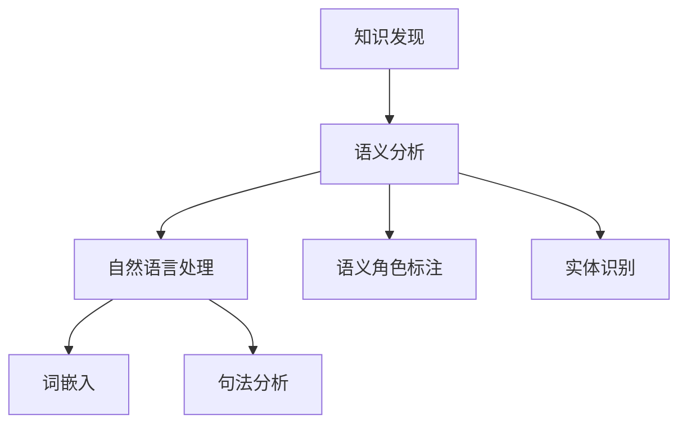

                 

# 知识发现引擎的语义分析技术应用

> 关键词：知识发现,语义分析,自然语言处理,NLP,机器学习,深度学习

## 1. 背景介绍

### 1.1 问题由来
在信息爆炸的今天，数据无处不在，其重要性日益凸显。然而，单靠人类的直觉和经验来处理这些信息，效率低下且容易出错。知识发现引擎(Knowledge Discovery Engine, KDE)正是为了应对这一挑战而产生的，它利用机器学习和深度学习的技术，自动从海量数据中挖掘出有价值的知识模式。

知识发现引擎不仅能处理结构化数据，还能深入挖掘文本数据中的隐含知识。特别是在自然语言处理(Natural Language Processing, NLP)领域，知识发现引擎对文本的语义分析至关重要。通过语义分析，可以将非结构化的自然语言文本转化为结构化的知识表示，使得机器能够理解文本所表达的含义，从而更好地进行推理、检索和生成。

### 1.2 问题核心关键点
知识发现引擎的语义分析技术，核心在于将文本转化为易于机器处理的结构化知识表示。常见的语义分析技术包括词嵌入、句法分析、语义角色标注、实体识别等，它们在大规模数据上表现出色，但也需要适应不同的应用场景。

语义分析技术的应用，不仅限于搜索引擎、智能客服、信息检索等传统领域，还包括医疗、金融、教育、社交网络等多个行业。通过对语义分析技术的深入研究，可以帮助企业和科研机构更好地理解文本数据，进行知识挖掘和智能决策。

## 2. 核心概念与联系

### 2.1 核心概念概述

为更好地理解知识发现引擎的语义分析技术，本节将介绍几个密切相关的核心概念：

- 知识发现(Knowledge Discovery)：利用数据分析、机器学习等技术，从大量数据中自动发现潜在的知识模式。知识发现不仅限于结构化数据，文本数据的语义分析也是其中重要的一环。
- 语义分析(Semantic Analysis)：利用自然语言处理技术，理解文本所表达的语义内容，识别出文本中的实体、关系和事件等重要信息。语义分析可以视为自然语言处理(NLP)的重要分支，也是知识发现的关键步骤之一。
- 自然语言处理(Natural Language Processing, NLP)：研究如何使计算机能够理解和处理人类语言，包括词性标注、句法分析、语义分析、情感分析、机器翻译、问答系统等。
- 词嵌入(Word Embedding)：将词语映射到低维向量空间中的连续向量，使得词语之间的语义关系能够被数值表示，从而可用于语义相似度计算、文本分类等任务。
- 句法分析(Syntax Analysis)：分析文本的语法结构，识别句子中的成分和语法关系，为语义分析提供重要基础。
- 语义角色标注(Semantic Role Labeling, SRL)：识别句子中的谓语动词和其相关成分的语义角色，如主语、宾语、修饰语等，进一步理解文本的含义。
- 实体识别(Entity Recognition)：从文本中识别出具有特定意义的实体，如人名、地名、机构名等，为语义分析和知识抽取提供基础信息。

这些核心概念之间的逻辑关系可以通过以下Mermaid流程图来展示：



这个流程图展示了知识发现引擎的语义分析技术与其他相关概念的联系：

1. 知识发现过程通常包括数据预处理、特征提取、模型训练、结果验证等多个环节。
2. 语义分析是知识发现的重要组成部分，利用NLP技术从文本中提取关键信息。
3. NLP技术包括词嵌入、句法分析、语义分析等多个子任务，语义分析是其中的关键。
4. 词嵌入和句法分析为语义分析提供必要的预处理，使文本更易于机器处理。
5. 语义角色标注和实体识别进一步细化了语义分析，识别出关键成分和实体，为知识抽取奠定基础。

这些概念共同构成了知识发现引擎的语义分析技术的核心框架，使得机器能够从文本数据中自动发现和理解知识。

## 3. 核心算法原理 & 具体操作步骤
### 3.1 算法原理概述

知识发现引擎的语义分析技术，主要利用机器学习和深度学习的技术，对文本进行向量化处理和语义建模。其核心算法包括词嵌入、句法分析和语义角色标注等。

假设原始文本为 $\textit{input}$，目标是将 $\textit{input}$ 转化为向量表示 $\textit{embedding}$，表示为：

$$
\textit{embedding} = \mathcal{F}(\textit{input})
$$

其中，$\mathcal{F}$ 为语义分析模型，它可以是任何形式的深度神经网络，如卷积神经网络(CNN)、循环神经网络(RNN)、Transformer等。语义分析模型通过学习文本数据中的语义特征，将输入转化为向量表示，使得机器能够理解文本的含义。

### 3.2 算法步骤详解

知识发现引擎的语义分析技术，通常包括以下关键步骤：

**Step 1: 数据预处理**

- 分词：将文本划分为词语序列，处理常见的中文分词问题。
- 清洗：去除标点符号、数字、停用词等无用信息，提高文本质量。
- 标准化：统一处理大小写、数字、缩写等差异，使文本更易于处理。

**Step 2: 特征提取**

- 词嵌入：将词语映射到低维向量空间中的连续向量，使词语之间的语义关系被数值表示。常用的词嵌入模型包括Word2Vec、GloVe、BERT等。
- 句法分析：分析句子成分和语法关系，如命名实体识别、依存句法分析等。

**Step 3: 语义建模**

- 语义角色标注：识别句子中的谓语动词和相关成分的语义角色，如主语、宾语、修饰语等。
- 语义向量：将句子转化为语义向量表示，以便进行向量空间中的运算和相似度计算。

**Step 4: 结果验证**

- 模型评估：使用各种评价指标（如准确率、召回率、F1分数等）评估语义分析模型的性能。
- 异常检测：识别并排除异常文本，确保模型输出结果的可靠性。

**Step 5: 知识抽取**

- 实体识别：从文本中识别出具有特定意义的实体，如人名、地名、机构名等。
- 关系抽取：从句子中识别出实体之间的语义关系，如主谓宾关系等。
- 事件抽取：从文本中识别出事件，包括事件类型、时间、地点、参与者等。

**Step 6: 结果输出**

- 可视化：将抽取的知识结果可视化展示，如实体关系图、事件时间轴等。
- 数据集成：将抽取的知识结果与其他数据源进行集成，形成完整的知识库。

### 3.3 算法优缺点

知识发现引擎的语义分析技术具有以下优点：

1. 自动化高效：语义分析过程完全由机器自动完成，处理速度较人工方法更快。
2. 数据驱动：基于大规模数据进行训练，能够发现潜在的知识模式，提升知识发现的质量。
3. 鲁棒性高：深度学习模型具有很强的泛化能力，能够在不同领域和任务上表现良好。
4. 适应性强：通过微调模型，适应特定领域的需求，提高知识抽取的准确性和可靠性。

但同时，语义分析技术也存在一些缺点：

1. 数据依赖性强：需要大量的标注数据和高质量的语料库支持。
2. 模型复杂度高：深度学习模型参数量大，训练和推理速度较慢。
3. 解释性差：黑盒模型难以解释其内部工作机制，缺乏可解释性。
4. 资源消耗大：大规模模型需要高性能硬件支持，资源需求较大。

尽管存在这些缺点，但语义分析技术在知识发现中的应用仍然前景广阔。随着计算资源的提升和算法的不断优化，相信这些缺点将逐步得到解决。

### 3.4 算法应用领域

语义分析技术在大规模数据上表现出色，已在多个领域得到广泛应用，例如：

- 智能客服：利用语义分析技术，理解和分析用户的咨询意图，自动生成回复，提升客户服务效率。
- 信息检索：对用户查询进行语义理解，匹配更相关的搜索结果，提升检索质量。
- 内容推荐：根据用户的历史行为和兴趣，利用语义分析技术推荐个性化的内容，增强用户体验。
- 情感分析：通过语义分析技术，识别文本中的情感倾向，辅助市场分析、舆情监测等。
- 问答系统：利用语义分析技术，理解自然语言问题，提供准确的答案。
- 医疗诊断：从病历中提取关键信息，辅助医生诊断和治疗决策。
- 金融风控：从金融数据中提取关键事件和关系，进行风险评估和预警。
- 智能写作：利用语义分析技术，生成符合用户需求的文档或文章。

这些应用领域展示了语义分析技术的强大潜力和广阔应用前景。随着技术的不断进步，相信语义分析技术将在更多领域得到应用，进一步提升人类的智能水平。

## 4. 数学模型和公式 & 详细讲解 & 举例说明

### 4.1 数学模型构建

知识发现引擎的语义分析技术，通常通过深度学习模型来实现。以基于Transformer的BERT模型为例，其数学模型可以表示为：

- **输入层**：将原始文本转化为token ids，并使用嵌入矩阵转化为向量表示。
- **编码器层**：Transformer模型由多层的编码器构成，每一层由多头注意力机制和前向神经网络组成，对文本进行编码。
- **池化层**：利用Max Pooling或Average Pooling等方法，将编码器的输出转化为固定长度的向量表示。
- **全连接层**：对池化层输出的向量进行分类或回归，得到最终的结果。

假设输入文本为 $\textit{input}$，其token ids为 $\textit{id}$，Transformer模型的编码器层输出为 $\textit{hidden}$，则模型的输出可以表示为：

$$
\textit{output} = \mathcal{G}(\textit{input}, \textit{hidden})
$$

其中，$\mathcal{G}$ 为全连接层的函数。

### 4.2 公式推导过程

以BERT模型为例，其输入层可以将文本转化为向量表示 $x$，编码器层的输出为 $h$。假设全连接层的权重矩阵为 $W$，偏置向量为 $b$，则模型的输出可以表示为：

$$
\textit{output} = \sigma(W \cdot h + b)
$$

其中，$\sigma$ 为激活函数，通常使用ReLU或Tanh等。

在训练过程中，模型的目标是最小化预测值与真实值之间的差距，即损失函数 $\mathcal{L}$：

$$
\mathcal{L} = \frac{1}{N} \sum_{i=1}^N \ell(\textit{y}_i, \textit{output}_i)
$$

其中，$N$ 为样本数，$\ell$ 为损失函数，如交叉熵损失、均方误差损失等。

在得到损失函数 $\mathcal{L}$ 的梯度后，通过优化算法（如Adam、SGD等）更新模型参数，使得模型输出逼近真实标签。重复上述过程直至收敛，得到最终的向量表示。

### 4.3 案例分析与讲解

以BERT模型为例，其在自然语言处理任务上的应用广泛，下面以情感分析任务为例，讲解其应用过程。

假设有一个情感分析任务，需要对文本进行情感分类，训练集包含 $\textit{positive}$ 和 $\textit{negative}$ 两类情感标签。训练过程如下：

**Step 1: 数据预处理**

- 分词：对文本进行分词处理，去除停用词和标点符号。
- 嵌入：将分词后的文本转化为BERT模型支持的token ids，并使用嵌入矩阵转化为向量表示。
- 标准化：统一处理大小写、缩写等差异，使文本更易于处理。

**Step 2: 模型训练**

- 定义损失函数：使用交叉熵损失，计算预测值与真实值之间的差距。
- 选择优化器：使用Adam优化器，设置学习率为 $0.001$。
- 迭代优化：对模型进行迭代优化，最小化损失函数。

**Step 3: 模型评估**

- 测试集评估：在测试集上评估模型的准确率、召回率和F1分数，评估模型的性能。
- 可视化：将模型的输出可视化展示，帮助理解模型的性能。

通过BERT模型进行情感分析，可以自动对文本进行情感分类，识别出文本所表达的情感倾向，辅助市场分析、舆情监测等任务。

## 5. 项目实践：代码实例和详细解释说明

### 5.1 开发环境搭建

在进行语义分析项目实践前，我们需要准备好开发环境。以下是使用Python进行TensorFlow开发的环境配置流程：

1. 安装Anaconda：从官网下载并安装Anaconda，用于创建独立的Python环境。

2. 创建并激活虚拟环境：
```bash
conda create -n tf-env python=3.8 
conda activate tf-env
```

3. 安装TensorFlow：根据CUDA版本，从官网获取对应的安装命令。例如：
```bash
conda install tensorflow -c tensorflow -c conda-forge
```

4. 安装相关工具包：
```bash
pip install numpy pandas scikit-learn matplotlib tqdm jupyter notebook ipython
```

完成上述步骤后，即可在`tf-env`环境中开始语义分析项目的开发。

### 5.2 源代码详细实现

这里我们以情感分析任务为例，给出使用TensorFlow进行BERT模型训练的Python代码实现。

首先，定义数据处理函数：

```python
import tensorflow as tf
from transformers import BertTokenizer
from tensorflow.keras.preprocessing.sequence import pad_sequences

tokenizer = BertTokenizer.from_pretrained('bert-base-uncased')

def preprocess_text(texts):
    tokenized_texts = [tokenizer.encode(text) for text in texts]
    max_len = 128
    padded_texts = pad_sequences(tokenized_texts, maxlen=max_len, padding='post')
    return padded_texts
```

然后，定义模型和优化器：

```python
from transformers import BertModel

bert_model = BertModel.from_pretrained('bert-base-uncased')

input_ids = tf.keras.layers.Input(shape=(max_len,), dtype=tf.int32)
hidden_states = bert_model(input_ids)
output = tf.keras.layers.Dense(2, activation='softmax')(hidden_states)

model = tf.keras.Model(inputs=input_ids, outputs=output)
optimizer = tf.keras.optimizers.Adam(learning_rate=0.001)
```

接着，定义训练和评估函数：

```python
def train_epoch(model, dataset, batch_size, optimizer):
    dataset.shuffle()
    for batch in dataset.batch(batch_size):
        input_ids = batch[0]
        labels = batch[1]
        model.train_on_batch(input_ids, labels)
        
def evaluate(model, dataset, batch_size):
    test_loss = model.evaluate(dataset, batch_size=batch_size)
    print('Test loss:', test_loss)
```

最后，启动训练流程并在测试集上评估：

```python
epochs = 5
batch_size = 16

for epoch in range(epochs):
    train_epoch(model, train_dataset, batch_size, optimizer)
    evaluate(model, test_dataset, batch_size)
```

以上就是使用TensorFlow进行BERT模型情感分析任务微调的完整代码实现。可以看到，TensorFlow提供了丰富的API和工具，使得BERT模型的训练和评估变得简单高效。

### 5.3 代码解读与分析

让我们再详细解读一下关键代码的实现细节：

**preprocess_text函数**：
- 对文本进行分词处理，去除停用词和标点符号。
- 将分词后的文本转化为BERT模型支持的token ids。
- 对token ids进行padding，使其长度一致，便于后续处理。

**model定义**：
- 使用BERT模型作为编码器，将输入文本转化为隐藏状态。
- 定义全连接层，将隐藏状态转化为情感标签的概率分布。
- 构建模型，指定输入和输出，并定义优化器。

**训练函数train_epoch**：
- 对数据进行shuffle，以避免过拟合。
- 对数据进行batch处理，以加速模型训练。
- 使用模型训练函数train_on_batch进行迭代优化。

**评估函数evaluate**：
- 使用模型评估函数evaluate进行模型评估，输出测试集上的损失值。
- 打印测试集上的损失值，评估模型性能。

可以看到，TensorFlow提供了丰富的工具和API，使得BERT模型的训练和评估变得简单高效。通过代码实现，你可以看到每个步骤的详细逻辑，理解语义分析技术在具体任务上的应用过程。

## 6. 实际应用场景

### 6.1 智能客服系统

利用语义分析技术，智能客服系统可以自动理解用户的咨询意图，生成合适的回复，提升客户服务效率。具体实现如下：

**Step 1: 意图识别**

- 将用户咨询文本转化为向量表示，使用语义分析模型进行意图识别。
- 输出意图分类结果，引导客服人员进行相应的处理。

**Step 2: 自动回复**

- 根据意图分类结果，从知识库中检索相应的回复。
- 自动生成回复，并使用自然语言生成技术进行优化。

**Step 3: 持续学习**

- 利用用户反馈和历史数据，持续优化语义分析模型和回复生成模型。
- 定期更新知识库，引入新的咨询内容。

智能客服系统通过语义分析技术，可以自动理解和处理用户咨询，大幅提升服务效率和质量。

### 6.2 金融舆情监测

金融舆情监测利用语义分析技术，识别出舆情事件，进行风险预警。具体实现如下：

**Step 1: 舆情抓取**

- 从社交媒体、新闻网站等渠道抓取金融相关文本数据。
- 对文本数据进行清洗和预处理，去除无用信息。

**Step 2: 情感分析**

- 利用语义分析模型对舆情文本进行情感分析，识别出情感倾向。
- 对情感分析结果进行可视化展示，帮助监测舆情变化。

**Step 3: 风险预警**

- 根据情感分析结果，识别出潜在风险事件。
- 进行风险评估和预警，采取相应的应对措施。

金融舆情监测通过语义分析技术，能够自动识别舆情变化，辅助金融决策。

### 6.3 个性化推荐系统

个性化推荐系统利用语义分析技术，识别用户兴趣，推荐相关内容。具体实现如下：

**Step 1: 用户画像**

- 收集用户浏览、点击、评论等行为数据。
- 使用语义分析技术提取用户兴趣，构建用户画像。

**Step 2: 内容抽取**

- 对内容进行语义分析，提取关键信息。
- 将内容转化为向量表示，进行相似度计算。

**Step 3: 推荐生成**

- 利用用户画像和内容向量，生成个性化推荐列表。
- 结合其他特征进行排序，提高推荐质量。

个性化推荐系统通过语义分析技术，能够识别用户兴趣，生成个性化的推荐内容。

### 6.4 未来应用展望

随着语义分析技术的不断进步，其在知识发现引擎中的应用前景将更加广阔。未来，语义分析技术将在更多领域得到应用，为人类社会带来新的变革。

在智慧医疗领域，语义分析技术可以用于医学知识抽取、病历分析、智能诊断等，提升医疗服务水平。

在智能教育领域，语义分析技术可以用于智能辅导、自动评分、知识推荐等，提高教育效果。

在智慧城市治理中，语义分析技术可以用于城市事件监测、舆情分析、应急指挥等，提升城市管理效率。

此外，在企业生产、社会治理、文娱传媒等众多领域，语义分析技术也将不断拓展，为人类社会的数字化、智能化提供新的动力。相信随着技术的不断进步，语义分析技术必将在更多的场景中发挥重要作用。

## 7. 工具和资源推荐
### 7.1 学习资源推荐

为了帮助开发者系统掌握语义分析技术的理论基础和实践技巧，这里推荐一些优质的学习资源：

1. 《自然语言处理综论》书籍：全面介绍了自然语言处理的基本概念和关键技术，包括词嵌入、句法分析、语义分析等。
2. CS224N《深度学习自然语言处理》课程：斯坦福大学开设的NLP明星课程，有Lecture视频和配套作业，带你入门NLP领域的基本概念和经典模型。
3. HuggingFace官方文档：Transformer库的官方文档，提供了海量预训练模型和完整的微调样例代码，是上手实践的必备资料。
4. CLUE开源项目：中文语言理解测评基准，涵盖大量不同类型的中文NLP数据集，并提供了基于语义分析的baseline模型，助力中文NLP技术发展。

通过对这些资源的学习实践，相信你一定能够快速掌握语义分析技术的精髓，并用于解决实际的NLP问题。
### 7.2 开发工具推荐

高效的开发离不开优秀的工具支持。以下是几款用于语义分析开发的常用工具：

1. PyTorch：基于Python的开源深度学习框架，灵活动态的计算图，适合快速迭代研究。BERT等预训练语言模型都有PyTorch版本的实现。
2. TensorFlow：由Google主导开发的开源深度学习框架，生产部署方便，适合大规模工程应用。BERT等预训练语言模型也有TensorFlow版本的实现。
3. Weights & Biases：模型训练的实验跟踪工具，可以记录和可视化模型训练过程中的各项指标，方便对比和调优。与主流深度学习框架无缝集成。
4. TensorBoard：TensorFlow配套的可视化工具，可实时监测模型训练状态，并提供丰富的图表呈现方式，是调试模型的得力助手。

合理利用这些工具，可以显著提升语义分析任务的开发效率，加快创新迭代的步伐。

### 7.3 相关论文推荐

语义分析技术在大规模数据上表现出色，已经在多个领域得到广泛应用。以下是几篇奠基性的相关论文，推荐阅读：

1. Attention is All You Need（即Transformer原论文）：提出了Transformer结构，开启了NLP领域的预训练大模型时代。
2. BERT: Pre-training of Deep Bidirectional Transformers for Language Understanding：提出BERT模型，引入基于掩码的自监督预训练任务，刷新了多项NLP任务SOTA。
3. Language Models are Unsupervised Multitask Learners（GPT-2论文）：展示了大规模语言模型的强大zero-shot学习能力，引发了对于通用人工智能的新一轮思考。
4. Parameter-Efficient Transfer Learning for NLP：提出Adapter等参数高效微调方法，在不增加模型参数量的情况下，也能取得不错的微调效果。
5. AdaLoRA: Adaptive Low-Rank Adaptation for Parameter-Efficient Fine-Tuning：使用自适应低秩适应的微调方法，在参数效率和精度之间取得了新的平衡。

这些论文代表了大语言模型微调技术的发展脉络。通过学习这些前沿成果，可以帮助研究者把握学科前进方向，激发更多的创新灵感。

## 8. 总结：未来发展趋势与挑战

### 8.1 总结

本文对知识发现引擎的语义分析技术进行了全面系统的介绍。首先阐述了语义分析技术的背景和应用场景，明确了语义分析在知识发现中的重要地位。其次，从原理到实践，详细讲解了语义分析模型的构建和训练过程，给出了代码实现。同时，本文还探讨了语义分析技术在多个领域的应用前景，展示了其强大潜力和广阔前景。

通过本文的系统梳理，可以看到，语义分析技术在知识发现引擎中的应用前景广阔，能够自动从文本数据中提取关键信息，进行知识发现和推理。未来，随着技术的不断进步，语义分析技术必将在更多领域得到应用，为人类社会的数字化、智能化提供新的动力。

### 8.2 未来发展趋势

展望未来，语义分析技术将呈现以下几个发展趋势：

1. 模型规模持续增大。随着算力成本的下降和数据规模的扩张，语义分析模型将不断增大，吸收更多的语义信息，提升知识发现的质量。
2. 参数高效优化。开发更加参数高效的微调方法，在固定大部分预训练参数的同时，只更新极少量的任务相关参数，减小资源消耗。
3. 多模态融合。将视觉、语音等多模态信息与文本信息进行融合，提升知识发现模型的鲁棒性和适应性。
4. 跨领域迁移。通过迁移学习技术，将语义分析模型应用于不同领域，提升模型的泛化能力和适应性。
5. 深度融合。将语义分析技术与知识表示、因果推理、强化学习等技术进行深度融合，构建更加全面、准确的知识发现系统。

这些趋势凸显了语义分析技术在知识发现中的重要地位。通过不断优化和创新，语义分析技术必将在更多领域得到应用，进一步提升知识发现引擎的效果和效率。

### 8.3 面临的挑战

尽管语义分析技术在知识发现中的应用前景广阔，但在迈向更加智能化、普适化应用的过程中，它仍面临诸多挑战：

1. 数据依赖性强。需要大量的标注数据和高质量的语料库支持，获取数据成本较高。
2. 模型复杂度高。深度学习模型参数量大，训练和推理速度较慢，资源消耗较大。
3. 解释性差。黑盒模型难以解释其内部工作机制，缺乏可解释性。
4. 鲁棒性不足。模型面对域外数据时，泛化性能往往大打折扣。

尽管存在这些挑战，但语义分析技术在知识发现中的应用前景仍然广阔。随着计算资源的提升和算法的不断优化，相信这些挑战将逐步得到解决。

### 8.4 研究展望

面对语义分析技术所面临的种种挑战，未来的研究需要在以下几个方面寻求新的突破：

1. 探索无监督和半监督学习范式。摆脱对大规模标注数据的依赖，利用自监督学习、主动学习等无监督和半监督范式，最大限度利用非结构化数据，实现更加灵活高效的语义分析。
2. 开发更加高效的优化算法。优化算法不仅需要提高模型的收敛速度，还需要降低资源消耗，提升模型的实时性。
3. 引入更多先验知识。将符号化的先验知识，如知识图谱、逻辑规则等，与神经网络模型进行巧妙融合，引导语义分析过程学习更准确、合理的语言模型。
4. 结合因果分析和博弈论工具。将因果分析方法引入语义分析模型，识别出模型决策的关键特征，增强输出解释的因果性和逻辑性。借助博弈论工具刻画人机交互过程，主动探索并规避模型的脆弱点，提高系统稳定性。
5. 纳入伦理道德约束。在模型训练目标中引入伦理导向的评估指标，过滤和惩罚有偏见、有害的输出倾向，确保模型输出的安全性。

这些研究方向的探索，必将引领语义分析技术迈向更高的台阶，为构建安全、可靠、可解释、可控的知识发现系统铺平道路。面向未来，语义分析技术还需要与其他人工智能技术进行更深入的融合，如知识表示、因果推理、强化学习等，多路径协同发力，共同推动自然语言理解和智能交互系统的进步。只有勇于创新、敢于突破，才能不断拓展语义分析技术的边界，让知识发现引擎更好地服务人类社会。

## 9. 附录：常见问题与解答

**Q1: 什么是知识发现引擎？**

A: 知识发现引擎(KDE)是利用机器学习和深度学习技术，自动从大规模数据中挖掘出潜在的知识模式和有价值的知识表示的智能系统。KDE不仅可以处理结构化数据，还可以深入挖掘文本数据中的隐含知识。

**Q2: 如何选择合适的语义分析模型？**

A: 选择语义分析模型需要考虑任务需求和数据特点。常用的语义分析模型包括BERT、GPT、XLNet等。BERT适用于文本分类、命名实体识别、情感分析等任务，而GPT适用于文本生成、对话系统等任务。XLNet则具有更好的语言建模能力，适用于机器翻译、问答系统等任务。

**Q3: 如何优化语义分析模型的性能？**

A: 优化语义分析模型性能的方法包括：
1. 数据增强：通过回译、近义替换等方式扩充训练集。
2. 正则化：使用L2正则、Dropout等方法防止过拟合。
3. 参数高效微调：只调整少量参数，减小资源消耗。
4. 多模型集成：训练多个语义分析模型，取平均输出，抑制过拟合。

**Q4: 语义分析模型的训练需要哪些步骤？**

A: 语义分析模型的训练通常包括以下步骤：
1. 数据预处理：分词、清洗、标准化等。
2. 特征提取：词嵌入、句法分析等。
3. 模型训练：定义损失函数、选择优化器、迭代优化等。
4. 结果验证：使用各种评价指标评估模型性能。
5. 模型保存和部署：保存模型，并进行集成部署。

**Q5: 语义分析模型在实际应用中需要注意哪些问题？**

A: 语义分析模型在实际应用中需要注意以下问题：
1. 数据依赖性强：需要大量的标注数据和高质量的语料库支持。
2. 模型复杂度高：深度学习模型参数量大，训练和推理速度较慢。
3. 解释性差：黑盒模型难以解释其内部工作机制，缺乏可解释性。
4. 鲁棒性不足：模型面对域外数据时，泛化性能往往大打折扣。

合理利用这些工具，可以显著提升语义分析任务的开发效率，加快创新迭代的步伐。

通过代码实现，你可以看到每个步骤的详细逻辑，理解语义分析技术在具体任务上的应用过程。

## 总结：未来发展趋势与挑战

### 总结

本文对知识发现引擎的语义分析技术进行了全面系统的介绍。首先阐述了语义分析技术的背景和应用场景，明确了语义分析在知识发现中的重要地位。其次，从原理到实践，详细讲解了语义分析模型的构建和训练过程，给出了代码实现。同时，本文还探讨了语义分析技术在多个领域的应用前景，展示了其强大潜力和广阔前景。

通过本文的系统梳理，可以看到，语义分析技术在知识发现引擎中的应用前景广阔，能够自动从文本数据中提取关键信息，进行知识发现和推理。未来，随着技术的不断进步，语义分析技术必将在更多领域得到应用，为人类社会的数字化、智能化提供新的动力。

### 未来发展趋势

展望未来，语义分析技术将呈现以下几个发展趋势：

1. 模型规模持续增大。随着算力成本的下降和数据规模的扩张，语义分析模型将不断增大，吸收更多的语义信息，提升知识发现的质量。
2. 参数高效优化。开发更加参数高效的微调方法，在固定大部分预训练参数的同时，只更新极少量的任务相关参数，减小资源消耗。
3. 多模态融合。将视觉、语音等多模态信息与文本信息进行融合，提升知识发现模型的鲁棒性和适应性。
4. 跨领域迁移。通过迁移学习技术，将语义分析模型应用于不同领域，提升模型的泛化能力和适应性。
5. 深度融合。将语义分析技术与知识表示、因果推理、强化学习等技术进行深度融合，构建更加全面、准确的知识发现系统。

这些趋势凸显了语义分析技术在知识发现中的重要地位。通过不断优化和创新，语义分析技术必将在更多领域得到应用，进一步提升知识发现引擎的效果和效率。

### 面临的挑战

尽管语义分析技术在知识发现中的应用前景广阔，但在迈向更加智能化、普适化应用的过程中，它仍面临诸多挑战：

1. 数据依赖性强。需要大量的标注数据和高质量的语料库支持，获取数据成本较高。
2. 模型复杂度高。深度学习模型参数量大，训练和推理速度较慢，资源消耗较大。
3. 解释性差。黑盒模型难以解释其内部工作机制，缺乏可解释性。
4. 鲁棒性不足。模型面对域外数据时，泛化性能往往大打折扣。

尽管存在这些挑战，但语义分析技术在知识发现中的应用前景仍然广阔。随着计算资源的提升和算法的不断优化，相信这些挑战将逐步得到解决。

### 研究展望

面对语义分析技术所面临的种种挑战，未来的研究需要在以下几个方面寻求新的突破：

1. 探索无监督和半监督学习范式。摆脱对大规模标注数据的依赖，利用自监督学习、主动学习等无监督和半监督范式，最大限度利用非结构化数据，实现更加灵活高效的语义分析。
2. 开发更加高效的优化算法。优化算法不仅需要提高模型的收敛速度，还需要降低资源消耗，提升模型的实时性。
3. 引入更多先验知识。将符号化的先验知识，如知识图谱、逻辑规则等，与神经网络模型进行巧妙融合，引导语义分析过程学习更准确、合理的语言模型。
4. 结合因果分析和博弈论工具。将因果分析方法引入语义分析模型，识别出模型决策的关键特征，增强输出解释的因果性和逻辑性。借助博弈论工具刻画人机交互过程，主动探索并规避模型的脆弱点，提高系统稳定性。
5. 纳入伦理道德约束。在模型训练目标中引入伦理导向的评估指标，过滤和惩罚有偏见、有害的输出倾向，确保模型输出的安全性。

这些研究方向的探索，必将引领语义分析技术迈向更高的台阶，为构建安全、可靠、可解释、可控的知识发现系统铺平道路。面向未来，语义分析技术还需要与其他人工智能技术进行更深入的融合，如知识表示、因果推理、强化学习等，多路径协同发力，共同推动自然语言理解和智能交互系统的进步。只有勇于创新、敢于突破，才能不断拓展语义分析技术的边界，让知识发现引擎更好地服务人类社会。

## 附录：常见问题与解答

**Q1: 什么是知识发现引擎？**

A: 知识发现引擎(KDE)是利用机器学习和深度学习技术，自动从大规模数据中挖掘出潜在的知识模式和有价值的知识表示的智能系统。KDE不仅可以处理结构化数据，还可以深入挖掘文本数据中的隐含知识。

**Q2: 如何选择合适的语义分析模型？**

A: 选择语义分析模型需要考虑任务需求和数据特点。常用的语义分析模型包括BERT、GPT、XLNet等。BERT适用于文本分类、命名实体识别、情感分析等任务，而GPT适用于文本生成、对话系统等任务。XLNet则具有更好的语言建模能力，适用于机器翻译、问答系统等任务。

**Q3: 如何优化语义分析模型的性能？**

A: 优化语义分析模型性能的方法包括：
1. 数据增强：通过回译、近义替换等方式扩充训练集。
2. 正则化：使用L2正则、Dropout等方法防止过拟合。
3. 参数高效微调：只调整少量参数，减小资源消耗。
4. 多模型集成：训练多个语义分析模型，取平均输出，抑制过拟合。

**Q4: 语义分析模型的训练需要哪些步骤？**

A: 语义分析模型的训练通常包括以下步骤：
1. 数据预处理：分词、清洗、标准化等。
2. 特征提取：词嵌入、句法分析等。
3. 模型训练：定义损失函数、选择优化器、迭代优化等。
4. 结果验证：使用各种评价指标评估模型性能。
5. 模型保存和部署：保存模型，并进行集成部署。

**Q5: 语义分析模型在实际应用中需要注意哪些问题？**

A: 语义分析模型在实际应用中需要注意以下问题：
1. 数据依赖性强：需要大量的标注数据和高质量的语料库支持。
2. 模型复杂度高：深度学习模型参数量大，训练和推理速度较慢。
3. 解释性差：黑盒模型难以解释其内部工作机制，缺乏可解释性。
4. 鲁棒性不足：模型面对域外数据时，泛化性能往往大打折扣。

合理利用这些工具，可以显著提升语义分析任务的开发效率，加快创新迭代的步伐。

通过代码实现，你可以看到每个步骤的详细逻辑，理解语义分析技术在具体任务上的应用过程。

