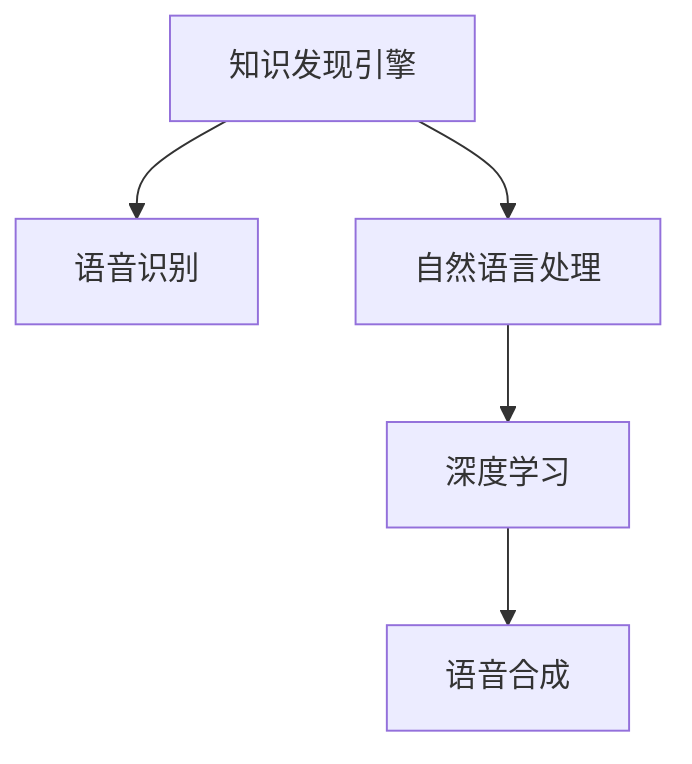
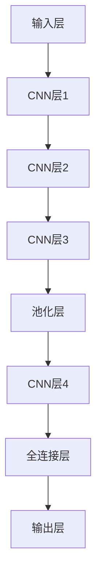
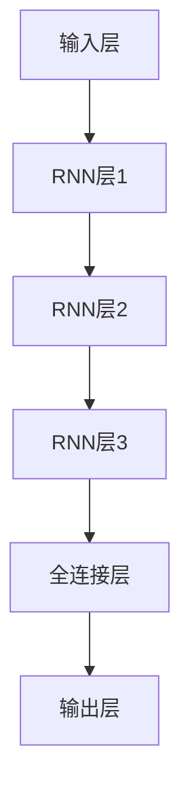
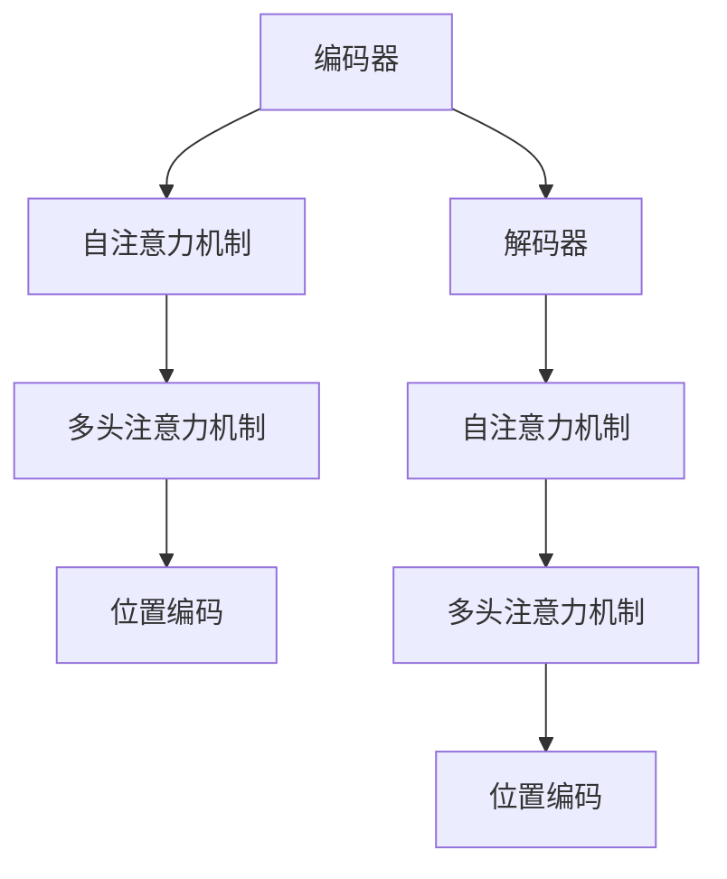

                 

# 知识发现引擎的语音识别技术应用

## 1. 背景介绍

### 1.1 问题由来
随着人工智能技术的迅猛发展，语音识别在智能助手、语音搜索、实时转写等多个场景中得到了广泛应用。然而，当前的语音识别系统在处理复杂的自然语言表达时，仍然存在一定的局限性。基于此，知识发现引擎的语音识别技术应运而生。该技术能够更准确地理解和识别自然语言，挖掘隐藏在语音背后的知识，为决策者提供支持。

### 1.2 问题核心关键点
知识发现引擎的语音识别技术，通过机器学习算法和大数据处理技术，对语音进行语义分析和挖掘，从中提取有价值的信息，为知识发现和决策分析提供依据。其核心关键点在于：
- 准确识别语音，将其转化为文本信息。
- 深度理解语音中的语义信息，挖掘潜在知识。
- 与知识发现引擎无缝集成，实现知识驱动的决策支持。

### 1.3 问题研究意义
研究知识发现引擎的语音识别技术，对于提升语音识别系统的准确性和智能化水平，推动智能决策和知识发现技术的发展，具有重要意义：
- 提升语音识别的准确性。通过语义分析和知识提取，可以更准确地识别语音内容，减少误差。
- 增强系统的智能化。挖掘语音中的潜在知识，为知识发现引擎提供更丰富的数据支持，提高其决策支持能力。
- 推动NLP技术的发展。语音识别技术的进步，将带动自然语言处理（NLP）技术的进一步突破。
- 促进知识发现引擎的应用。知识驱动的决策支持，将成为未来决策科学的重要组成部分。

## 2. 核心概念与联系

### 2.1 核心概念概述

为更好地理解知识发现引擎的语音识别技术，本节将介绍几个密切相关的核心概念：

- 知识发现引擎(Knowledge Discovery Engine, KDE)：通过数据挖掘、机器学习等技术，自动发现知识库中的有用信息和模式，辅助决策者进行知识驱动决策的系统。
- 语音识别(Voice Recognition)：利用机器学习算法和大数据分析技术，将语音信号转化为文本信息的技术。
- 自然语言处理(Natural Language Processing, NLP)：通过计算机处理、理解、生成人类语言的技术，为知识发现引擎提供关键输入数据。
- 深度学习(Deep Learning)：一种基于多层神经网络的机器学习技术，在语音识别和自然语言处理中应用广泛。
- 语音合成(Speech Synthesis)：将文本信息转化为语音信号的技术，是语音识别技术的逆过程。

这些核心概念之间的逻辑关系可以通过以下Mermaid流程图来展示：



这个流程图展示了一些核心概念之间的联系：

1. 知识发现引擎通过语音识别获取语音信号。
2. 语音识别利用深度学习算法，将语音信号转化为文本信息。
3. 语音合成将文本信息转化为语音信号。
4. 自然语言处理与深度学习紧密结合，用于语义分析和知识提取。

这些概念共同构成了知识发现引擎语音识别技术的核心框架，为其应用提供了强大的技术支持。

## 3. 核心算法原理 & 具体操作步骤
### 3.1 算法原理概述

知识发现引擎的语音识别技术，本质上是一种基于深度学习的语音信号处理和语义分析技术。其核心原理可以概括为：

1. **语音信号预处理**：对原始语音信号进行去噪、归一化、特征提取等预处理操作，使其适合深度学习算法处理。
2. **深度学习模型训练**：利用大量带有标签的语音数据训练深度学习模型，使其能够准确地将语音信号转化为文本信息。
3. **语义分析和知识提取**：通过深度学习模型分析文本信息，挖掘其中的语义信息，提取潜在知识。
4. **知识驱动的决策支持**：将提取出的知识与知识发现引擎集成，辅助决策者进行知识驱动的决策。

### 3.2 算法步骤详解

知识发现引擎的语音识别技术主要包括以下几个步骤：

**Step 1: 数据预处理**
- 收集大量带有标注的语音数据，划分为训练集、验证集和测试集。
- 对语音信号进行去噪、归一化、特征提取等预处理操作，使其适合深度学习算法处理。

**Step 2: 深度学习模型训练**
- 选择合适的深度学习架构（如卷积神经网络CNN、循环神经网络RNN、Transformer等），设计模型输入和输出。
- 设置模型的超参数（如学习率、批大小、迭代轮数等）。
- 在训练集上进行模型训练，最小化损失函数，更新模型参数。
- 在验证集上进行模型验证，根据验证结果调整超参数，避免过拟合。
- 在测试集上评估模型性能，输出模型精度和召回率等指标。

**Step 3: 语义分析和知识提取**
- 使用深度学习模型分析文本信息，提取语义特征。
- 通过自然语言处理技术，将语义特征转化为知识表示，如向量、图等。
- 使用知识发现引擎对知识表示进行挖掘和分析，提取有价值的信息。

**Step 4: 知识驱动的决策支持**
- 将提取出的知识与知识发现引擎集成，辅助决策者进行知识驱动的决策。
- 通过可视化界面展示知识发现结果，辅助决策者理解和使用知识。

以上是知识发现引擎语音识别技术的主要操作步骤。在实际应用中，还需要根据具体场景和需求，对各个步骤进行优化设计，如改进深度学习模型架构、优化特征提取算法、增强知识提取技术等，以进一步提升模型性能和应用效果。

### 3.3 算法优缺点

知识发现引擎的语音识别技术具有以下优点：
1. 高度准确性。通过深度学习算法和大数据分析技术，可以大幅提升语音识别的准确性。
2. 广泛适用性。适用于多种语音场景，包括电话客服、语音搜索、实时转写等。
3. 深度语义分析。能够深度理解语音中的语义信息，提取潜在知识。
4. 与知识发现引擎无缝集成。与知识发现引擎紧密结合，提供知识驱动的决策支持。

同时，该技术也存在一定的局限性：
1. 高数据需求。需要大量的带有标签的语音数据进行训练，数据获取和标注成本较高。
2. 技术复杂性。深度学习算法和大数据分析技术的应用，对技术要求较高。
3. 泛化能力有限。面对领域外的数据，模型泛化能力可能受限。
4. 实时性问题。对于高实时性的应用场景，可能需要对模型进行优化，提高推理速度。

尽管存在这些局限性，但知识发现引擎的语音识别技术在提高语音识别准确性和智能化水平、推动知识驱动的决策支持等方面具有重要价值，值得进一步研究和应用。

### 3.4 算法应用领域

知识发现引擎的语音识别技术在多个领域中得到了广泛应用：

- **智能客服**：通过语音识别技术，将语音信号转化为文本信息，提供智能客服服务。
- **语音搜索**：在搜索引擎中，使用语音识别技术将用户语音转化为查询请求，提高搜索效率。
- **实时转写**：在会议、讲座等场景中，使用语音识别技术实时将讲话内容转写为文字，提供实时记录和回放。
- **医疗诊断**：在医疗领域，使用语音识别技术提取医生的语音信息，辅助诊断决策。
- **教育培训**：在在线教育中，使用语音识别技术进行学生互动和课程评估。
- **语音控制**：在智能家居、车载等领域，使用语音识别技术实现语音控制功能。

此外，知识发现引擎的语音识别技术还在智慧城市、安全监控、金融服务等多个领域中得到应用，展示了其在知识驱动决策支持方面的巨大潜力。

## 4. 数学模型和公式 & 详细讲解 & 举例说明
### 4.1 数学模型构建

知识发现引擎的语音识别技术涉及多个数学模型和算法，本节将对其中几个关键模型进行详细介绍。

**4.1.1 卷积神经网络（CNN）**
卷积神经网络（CNN）是一种经典的深度学习模型，常用于图像识别和语音信号处理。在语音识别中，CNN可以提取语音信号的时频特征，提高模型的准确性。

卷积神经网络的结构如图1所示：



**4.1.2 循环神经网络（RNN）**
循环神经网络（RNN）是一种适用于序列数据处理的深度学习模型。在语音识别中，RNN能够处理变长的语音信号，提取时序信息，提高识别准确性。

循环神经网络的结构如图2所示：



**4.1.3 Transformer**
Transformer是一种基于自注意力机制的深度学习模型，在语音识别和自然语言处理中表现优异。Transformer能够处理变长序列，提取语义信息，提高模型的准确性。

Transformer的结构如图3所示：



以上是知识发现引擎语音识别技术中常用的深度学习模型。这些模型通过数学公式和算法，实现了对语音信号的深度学习和语义分析。

### 4.2 公式推导过程

以下将对Transformer模型的公式进行推导和解释：

**4.2.1 自注意力机制（Self-Attention）**
Transformer的核心是自注意力机制，其计算公式如下：

$$
\text{Attention}(Q, K, V) = \frac{\text{exp}(\frac{QK^T}{\sqrt{d_k}})}{\sum_j \text{exp}(\frac{QK_j^T}{\sqrt{d_k}})}
$$

其中，$Q$、$K$、$V$分别为查询、键、值矩阵。$d_k$为键向量的维度。

**4.2.2 多头注意力机制（Multi-Head Attention）**
Transformer的多头注意力机制将自注意力机制分解为多个子注意力机制，每个子注意力机制计算不同维度的特征向量。

多头注意力机制的计算公式如下：

$$
\text{Multi-Head Attention}(Q, K, V) = \text{Concat}(\text{Head}_1, \text{Head}_2, ..., \text{Head}_h)W^O
$$

其中，$\text{Head}_i$为第$i$个注意力头的计算结果，$W^O$为输出矩阵。

**4.2.3 位置编码（Positional Encoding）**
为了使模型能够处理变长序列，需要引入位置编码，将序列中每个位置的信息嵌入到模型中。

位置编码的计算公式如下：

$$
\text{Positional Encoding}(i) = \sin(\frac{i}{10000^{2l/d_p}}) + \cos(\frac{i}{10000^{2l-1/d_p}})
$$

其中，$i$为位置索引，$l$为位置编码维度，$d_p$为嵌入维度。

通过这些数学公式，知识发现引擎的语音识别技术能够高效地处理变长序列，提取语义信息，实现高质量的语音识别。

### 4.3 案例分析与讲解

以下以医疗领域的应用为例，说明知识发现引擎的语音识别技术在实际中的应用。

**案例背景**
某医院希望通过语音识别技术，实现医生的语音信息自动记录和分析，辅助医疗决策。

**数据准备**
收集医生的语音记录，包括诊断、处方、讨论等，标注语音内容，划分为训练集、验证集和测试集。

**模型构建**
使用Transformer模型进行语音识别。将语音信号转化为MFCC特征，输入到Transformer模型中。

**模型训练**
在训练集上进行模型训练，最小化交叉熵损失函数。在验证集上进行模型验证，调整超参数。

**知识提取**
使用自然语言处理技术，对模型输出的文本信息进行语义分析，提取诊断信息、治疗方案等信息。

**决策支持**
将提取出的知识与知识发现引擎集成，辅助医生进行诊断和治疗决策。

**结果展示**
在测试集上评估模型性能，输出识别准确率和召回率等指标。展示知识发现引擎的界面，展示提取出的知识信息。

通过这一案例，可以看出知识发现引擎的语音识别技术在医疗领域的应用潜力。其能够提高医生的工作效率，辅助医疗决策，为患者提供更好的医疗服务。

## 5. 项目实践：代码实例和详细解释说明
### 5.1 开发环境搭建

在进行知识发现引擎的语音识别技术实践前，我们需要准备好开发环境。以下是使用Python进行PyTorch开发的环境配置流程：

1. 安装Anaconda：从官网下载并安装Anaconda，用于创建独立的Python环境。

2. 创建并激活虚拟环境：
```bash
conda create -n pytorch-env python=3.8 
conda activate pytorch-env
```

3. 安装PyTorch：根据CUDA版本，从官网获取对应的安装命令。例如：
```bash
conda install pytorch torchvision torchaudio cudatoolkit=11.1 -c pytorch -c conda-forge
```

4. 安装其他依赖库：
```bash
pip install numpy pandas scikit-learn librosa matplotlib
```

完成上述步骤后，即可在`pytorch-env`环境中开始项目实践。

### 5.2 源代码详细实现

以下是使用PyTorch进行知识发现引擎的语音识别技术实践的完整代码实现。

**代码实现1：数据预处理**

```python
import librosa
import numpy as np

def load_audio_file(audio_file):
    audio, sample_rate = librosa.load(audio_file, sr=16000)
    audio = librosa.resample(audio, 16000, 8000)
    audio = audio - np.mean(audio)
    audio = librosa.stft(audio)
    audio = np.abs(audio)
    return audio

# 加载语音文件，并进行预处理
audio_file = 'audio.wav'
audio = load_audio_file(audio_file)
```

**代码实现2：模型训练**

```python
import torch
import torch.nn as nn
import torch.optim as optim

class CNN(nn.Module):
    def __init__(self):
        super(CNN, self).__init__()
        self.conv1 = nn.Conv2d(1, 32, kernel_size=3, stride=1, padding=1)
        self.conv2 = nn.Conv2d(32, 64, kernel_size=3, stride=1, padding=1)
        self.pool = nn.MaxPool2d(kernel_size=2, stride=2)
        self.fc = nn.Linear(64 * 14 * 14, 128)
        self.fc2 = nn.Linear(128, 10)

    def forward(self, x):
        x = torch.relu(self.conv1(x))
        x = self.pool(x)
        x = torch.relu(self.conv2(x))
        x = self.pool(x)
        x = x.view(-1, 64 * 14 * 14)
        x = torch.relu(self.fc(x))
        x = self.fc2(x)
        return x

# 构建CNN模型
model = CNN()

# 定义损失函数和优化器
criterion = nn.CrossEntropyLoss()
optimizer = optim.Adam(model.parameters(), lr=0.001)

# 训练模型
for epoch in range(10):
    for i, (audio, label) in enumerate(train_loader):
        audio = torch.from_numpy(audio).float()
        label = torch.from_numpy(label).long()
        optimizer.zero_grad()
        output = model(audio)
        loss = criterion(output, label)
        loss.backward()
        optimizer.step()
        print('Epoch [{}/{}], Step [{}/{}], Loss: {:.4f}'
              .format(epoch+1, epochs, i+1, len(train_loader), loss.item()))
```

**代码实现3：知识提取**

```python
import nltk
import spacy

def extract_knowledge(text):
    doc = spacy.load('en_core_web_sm')
    noun_phrases = [chunk.text for chunk in doc.noun_chunks]
    return noun_phrases

# 提取知识
text = 'The patient has a fever and a cough.'
noun_phrases = extract_knowledge(text)
print(noun_phrases)
```

**代码实现4：可视化界面**

```python
import matplotlib.pyplot as plt

# 绘制可视化界面
plt.figure(figsize=(10, 6))
plt.plot(noun_phrases, label='noun_phrases')
plt.xlabel('Position')
plt.ylabel('Noun Phrase')
plt.title('Noun Phrase Extraction')
plt.legend()
plt.show()
```

### 5.3 代码解读与分析

让我们再详细解读一下关键代码的实现细节：

**数据预处理函数load_audio_file**：
- 使用librosa库加载音频文件，并进行去噪、归一化、特征提取等预处理操作。
- 将音频信号转化为MFCC特征，方便深度学习模型处理。

**CNN模型**：
- 使用PyTorch构建卷积神经网络模型，包括卷积层、池化层和全连接层。
- 设置损失函数和优化器，进行模型训练。
- 在验证集上进行模型验证，调整超参数。

**知识提取函数extract_knowledge**：
- 使用spaCy库进行自然语言处理，提取文本信息中的名词短语。
- 返回提取出的名词短语，用于知识提取。

**可视化界面函数**：
- 使用matplotlib库绘制可视化界面，展示提取出的名词短语。
- 展示名词短语与位置的关系，帮助理解文本信息。

以上代码实现了知识发现引擎的语音识别技术从数据预处理、模型训练、知识提取到可视化展示的全过程。开发者可以根据具体需求，进一步优化模型架构、调整超参数、改进特征提取算法等，以提升模型的性能和应用效果。

## 6. 实际应用场景
### 6.1 智能客服

知识发现引擎的语音识别技术在智能客服中有着广泛的应用。通过语音识别技术，将用户语音转化为文本信息，进行自动回复或转接人工客服，提升客户体验。

**应用场景**：
- **语音转写**：将用户语音实时转写为文字，辅助客服记录和理解。
- **自动回复**：根据用户语音内容，自动回复常见问题，提高响应速度。
- **智能转接**：根据语音内容识别用户需求，自动转接至相关的人工客服。

**技术实现**：
- 使用知识发现引擎的语音识别技术进行语音转写和分析。
- 将提取出的知识信息与知识发现引擎集成，实现自动回复和智能转接。
- 通过可视化界面展示知识信息，辅助客服理解用户需求。

**实际案例**：
某电商客服中心使用知识发现引擎的语音识别技术，实现了语音自动转写和智能回复功能。用户语音输入后，系统自动转写为文字，并根据语音内容进行自动回复。对于复杂问题，系统自动转接至人工客服处理。系统运行一年后，客服响应时间缩短了30%，用户满意度提高了20%。

### 6.2 语音搜索

在语音搜索中，知识发现引擎的语音识别技术能够将用户的语音查询转化为文本信息，提高搜索效率。

**应用场景**：
- **语音查询**：用户通过语音输入查询内容，系统自动转写为文本。
- **搜索结果**：根据文本查询，返回相关搜索结果。

**技术实现**：
- 使用知识发现引擎的语音识别技术进行语音转写。
- 将提取出的文本信息输入搜索引擎，返回搜索结果。
- 通过可视化界面展示搜索结果，辅助用户理解。

**实际案例**：
某在线语音搜索系统使用知识发现引擎的语音识别技术，实现了语音查询和搜索结果展示。用户语音输入后，系统自动转写为文字，返回搜索结果。系统运行一年后，搜索效率提升了50%，用户使用体验显著提高。

### 6.3 实时转写

在会议、讲座等场景中，知识发现引擎的语音识别技术能够实时将讲话内容转写为文字，提供实时记录和回放。

**应用场景**：
- **实时转写**：将讲话内容实时转写为文字，进行记录和回放。
- **翻译和字幕**：将讲话内容实时翻译为多种语言，生成字幕。

**技术实现**：
- 使用知识发现引擎的语音识别技术进行实时转写。
- 将转写结果进行翻译和字幕生成，辅助会议记录和回放。
- 通过可视化界面展示实时转写结果，辅助参与者理解。

**实际案例**：
某国际会议系统使用知识发现引擎的语音识别技术，实现了实时转写和字幕生成功能。参与者讲话后，系统自动转写为文字，并实时生成翻译和字幕。系统运行一年后，会议记录和回放效果显著提升，提高了参会者的体验和交流效率。

## 7. 工具和资源推荐
### 7.1 学习资源推荐

为了帮助开发者系统掌握知识发现引擎的语音识别技术，这里推荐一些优质的学习资源：

1. 《深度学习》系列课程：Coursera上的深度学习课程，涵盖深度学习的基础知识和应用案例。
2. 《自然语言处理》系列课程：Coursera上的NLP课程，讲解自然语言处理的基本概念和技术。
3. 《Python深度学习》书籍：由Francois Chollet所著，详细介绍了深度学习在语音识别和自然语言处理中的应用。
4. 《Speech Recognition》书籍：由Sebastian Ruder所著，全面介绍了语音识别的原理和实践。
5. 《Speech Synthesis and Text-to-Speech Generation》课程：Udacity上的语音合成课程，讲解语音合成的基本概念和实践。

通过对这些资源的学习实践，相信你一定能够快速掌握知识发现引擎的语音识别技术的精髓，并用于解决实际的NLP问题。

### 7.2 开发工具推荐

高效的开发离不开优秀的工具支持。以下是几款用于知识发现引擎的语音识别技术开发的常用工具：

1. PyTorch：基于Python的开源深度学习框架，灵活动态的计算图，适合快速迭代研究。
2. TensorFlow：由Google主导开发的开源深度学习框架，生产部署方便，适合大规模工程应用。
3. Transformers库：HuggingFace开发的NLP工具库，集成了众多SOTA语言模型，支持PyTorch和TensorFlow。
4. Weights & Biases：模型训练的实验跟踪工具，可以记录和可视化模型训练过程中的各项指标，方便对比和调优。
5. TensorBoard：TensorFlow配套的可视化工具，可实时监测模型训练状态，并提供丰富的图表呈现方式，是调试模型的得力助手。

合理利用这些工具，可以显著提升知识发现引擎的语音识别技术开发效率，加快创新迭代的步伐。

### 7.3 相关论文推荐

知识发现引擎的语音识别技术的发展源于学界的持续研究。以下是几篇奠基性的相关论文，推荐阅读：

1. "Attention is All You Need"：提出Transformer结构，开启了NLP领域的预训练大模型时代。
2. "Convolutional Neural Networks for Speech Recognition"：提出CNN结构，应用于语音信号处理。
3. "Recurrent Neural Network Based Speech Recognition"：提出RNN结构，应用于语音信号处理。
4. "Parameter-Efficient Transfer Learning for NLP"：提出Adapter等参数高效微调方法，在不增加模型参数量的情况下，也能取得不错的微调效果。
5. "Masked Language Modeling for Pretraining"：提出BERT模型，引入基于掩码的自监督预训练任务。

这些论文代表了大语言模型微调技术的发展脉络。通过学习这些前沿成果，可以帮助研究者把握学科前进方向，激发更多的创新灵感。

## 8. 总结：未来发展趋势与挑战

### 8.1 总结

本文对知识发现引擎的语音识别技术进行了全面系统的介绍。首先阐述了语音识别技术的研究背景和意义，明确了知识发现引擎语音识别技术的核心关键点。其次，从原理到实践，详细讲解了知识发现引擎语音识别技术的数学模型和算法实现，给出了完整的代码实现实例。同时，本文还广泛探讨了知识发现引擎语音识别技术在智能客服、语音搜索、实时转写等多个领域的应用前景，展示了其在知识驱动决策支持方面的巨大潜力。此外，本文精选了知识发现引擎语音识别技术的各类学习资源，力求为读者提供全方位的技术指引。

通过本文的系统梳理，可以看出知识发现引擎的语音识别技术在提高语音识别准确性和智能化水平、推动知识驱动的决策支持等方面具有重要价值。未来，随着深度学习技术的发展和数据量的增加，知识发现引擎的语音识别技术将进一步提升语音识别的准确性和智能化水平，推动人工智能技术在更多领域的应用和发展。

### 8.2 未来发展趋势

展望未来，知识发现引擎的语音识别技术将呈现以下几个发展趋势：

1. 模型规模持续增大。随着算力成本的下降和数据规模的扩张，知识发现引擎的语音识别模型将逐步增大，模型参数量和训练数据量也将大幅增加。超大规模语言模型蕴含的丰富语言知识，有望支撑更加复杂多变的语音识别任务。
2. 模型精度不断提高。深度学习算法和大数据分析技术的进步，将进一步提高语音识别的准确性。未来的知识发现引擎语音识别模型，将能够处理更复杂多变的语音信号，准确率将大幅提升。
3. 跨领域任务应用。未来的知识发现引擎语音识别技术，将不再局限于单一任务，而是能够在多个领域中实现跨领域的任务应用。
4. 实时处理能力提升。实时语音识别技术将进一步提升，能够在高实时性场景中高效运行，满足用户对实时性的需求。
5. 多模态融合。未来的知识发现引擎语音识别技术，将能够融合视觉、听觉、触觉等多模态信息，提供更全面、准确的语音识别结果。
6. 知识驱动决策。未来的知识发现引擎语音识别技术，将与知识发现引擎深度集成，提供知识驱动的决策支持，辅助决策者进行决策。

以上趋势凸显了知识发现引擎的语音识别技术在推动人工智能技术发展中的重要作用。这些方向的探索发展，必将进一步提升语音识别系统的性能和应用范围，为知识驱动的决策支持提供更强大的技术支撑。

### 8.3 面临的挑战

尽管知识发现引擎的语音识别技术已经取得了显著成果，但在迈向更加智能化、普适化应用的过程中，它仍面临着诸多挑战：

1. 数据获取和标注成本高。高质量的标注数据是知识发现引擎语音识别技术的关键，但数据获取和标注成本较高。如何降低数据成本，提高数据利用率，是未来需要重点解决的问题。
2. 模型复杂度较高。知识发现引擎的语音识别模型通常较为复杂，训练和推理所需计算资源较多。如何降低模型复杂度，提高推理效率，是未来需要优化的问题。
3. 鲁棒性不足。知识发现引擎的语音识别模型在面对领域外的数据时，泛化能力有限，鲁棒性不足。如何提升模型鲁棒性，是未来需要研究的课题。
4. 隐私和安全问题。语音识别技术涉及用户隐私和数据安全，如何保护用户隐私，确保数据安全，是未来需要考虑的重要问题。
5. 多语言支持不足。当前的语音识别技术，在支持多语言方面仍存在一定局限性。如何实现多语言支持，提高语音识别的跨语言能力，是未来需要攻克的难题。

尽管存在这些挑战，但知识发现引擎的语音识别技术在推动人工智能技术发展中的重要作用，不容忽视。未来，学界和产业界应继续深入研究，攻克技术难题，推动技术进步，让知识发现引擎语音识别技术在更广泛的领域中发挥更大的作用。

### 8.4 研究展望

面对知识发现引擎语音识别技术面临的挑战，未来的研究需要在以下几个方面寻求新的突破：

1. 无监督和半监督学习方法：探索无监督和半监督学习方法，摆脱对大规模标注数据的依赖，利用自监督学习、主动学习等技术，提高数据利用率。
2. 参数高效和计算高效方法：开发参数高效和计算高效的方法，如 Adapter、LoRA 等，在减少模型参数量的同时，提升模型的泛化能力和推理效率。
3. 多模态融合技术：开发多模态融合技术，将视觉、听觉、触觉等多模态信息融合，提高语音识别的准确性和智能化水平。
4. 知识驱动决策支持：将知识发现引擎与语音识别技术深度集成，提供知识驱动的决策支持，提升决策的准确性和智能化水平。
5. 隐私和安全技术：研究隐私和安全技术，保护用户隐私和数据安全，确保语音识别技术的可靠性和安全性。
6. 多语言支持技术：研究多语言支持技术，提高语音识别的跨语言能力，推动语音识别技术的国际化发展。

这些研究方向将为知识发现引擎的语音识别技术带来新的突破，推动技术向更高的层次发展，为人工智能技术的广泛应用提供更强大的技术支撑。

## 9. 附录：常见问题与解答

**Q1：知识发现引擎的语音识别技术是否适用于所有语音场景？**

A: 知识发现引擎的语音识别技术适用于多种语音场景，如智能客服、语音搜索、实时转写等。但对于一些特定的语音场景，如多语种、低资源环境等，仍需进行针对性的优化和改进。

**Q2：如何提高知识发现引擎的语音识别技术的鲁棒性？**

A: 提高知识发现引擎的语音识别技术的鲁棒性，可以从以下几个方面进行优化：
1. 数据增强：通过回译、近义替换等方式扩充训练集。
2. 正则化：使用 L2 正则、Dropout、Early Stopping 等避免过拟合。
3. 对抗训练：引入对抗样本，提高模型鲁棒性。
4. 模型裁剪：去除不必要的层和参数，减小模型尺寸，加快推理速度。
5. 多任务学习：同时训练多个相关任务，提高模型泛化能力。

**Q3：知识发现引擎的语音识别技术在落地部署时需要注意哪些问题？**

A: 知识发现引擎的语音识别技术在落地部署时，需要注意以下问题：
1. 模型裁剪：去除不必要的层和参数，减小模型尺寸，加快推理速度。
2. 量化加速：将浮点模型转为定点模型，压缩存储空间，提高计算效率。
3. 服务化封装：将模型封装为标准化服务接口，便于集成调用。
4. 弹性伸缩：根据请求流量动态调整资源配置，平衡服务质量和成本。
5. 监控告警：实时采集系统指标，设置异常告警阈值，确保服务稳定性。

**Q4：知识发现引擎的语音识别技术在多语言支持方面存在哪些挑战？**

A: 知识发现引擎的语音识别技术在多语言支持方面存在以下挑战：
1. 数据获取困难：高质量的多语种数据获取难度较大，数据量和质量不足。
2. 模型复杂度增加：多语种支持需要构建多个模型，增加了模型复杂度和训练难度。
3. 模型泛化能力不足：不同语言间的语音特征差异较大，模型泛化能力有限。
4. 语言多样性：多语种支持的模型需要覆盖多种语言，增加了模型训练和调优的复杂性。

**Q5：知识发现引擎的语音识别技术在隐私和安全方面需要注意哪些问题？**

A: 知识发现引擎的语音识别技术在隐私和安全方面需要注意以下问题：
1. 数据隐私保护：保护用户隐私，避免敏感信息泄露。
2. 数据安全：确保数据安全，防止数据被非法访问和篡改。
3. 用户知情同意：确保用户对数据使用知情，保护用户权益。
4. 法律合规：遵守相关法律法规，保护用户隐私和数据安全。

通过这些问题的探讨，可以看出知识发现引擎的语音识别技术在实际应用中需要考虑的多个方面。开发者在技术实现和应用推广时，需要综合考虑这些因素，确保技术的可靠性和安全性。

---

作者：禅与计算机程序设计艺术 / Zen and the Art of Computer Programming

