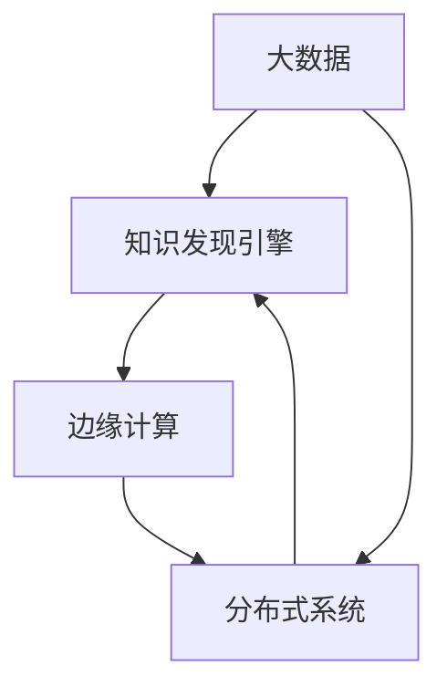

                 

# 知识发现引擎的边缘计算应用

## 1. 背景介绍

### 1.1 问题由来
在当今数字化时代，数据呈现出爆炸式的增长，其质量和规模都在迅速提升。知识发现引擎(Knowledge Discovery Engine, KDE)作为从大数据中提取有价值信息的关键技术，广泛应用于商业智能、医疗健康、金融安全等多个领域，是知识驱动业务的重要工具。然而，传统知识发现引擎在数据处理和模型训练方面，对计算资源的需求极高，通常需要大型的数据中心和复杂的云计算基础设施。

近年来，随着边缘计算(Edge Computing)技术的发展，边缘计算的计算资源和网络带宽提供了新的可能性。利用边缘计算，知识发现引擎可以在本地设备上进行数据处理和模型训练，从而提高响应速度、降低延迟、减少数据传输成本。本文将探讨知识发现引擎如何利用边缘计算技术，进一步优化性能和资源利用效率。

### 1.2 问题核心关键点
知识发现引擎在利用边缘计算的过程中，需要考虑以下几个核心关键点：

- 数据处理：如何在本地设备上高效处理海量数据，避免数据传输延迟和网络拥堵。
- 模型训练：如何在边缘设备上高效训练知识发现模型，避免过度依赖中心计算资源。
- 数据隐私：如何在边缘设备上保护数据隐私和安全，防止数据泄露和滥用。
- 系统可靠性：如何在边缘环境中实现系统的高可用性和鲁棒性。

本研究旨在回答这些问题，探讨基于边缘计算的知识发现引擎的设计和实现方法，以期提升系统的性能和用户体验。

## 2. 核心概念与联系

### 2.1 核心概念概述

为更好地理解知识发现引擎在边缘计算环境中的应用，本节将介绍几个关键概念：

- 知识发现引擎(KDE)：用于从大规模数据集中提取有价值知识的技术，广泛应用于商业智能、医疗健康、金融安全等领域。
- 边缘计算(Edge Computing)：指将计算任务分配到本地设备或靠近数据源的服务器上进行处理，以降低延迟和提升响应速度的技术。
- 分布式系统(Distributed System)：由多个相互独立的计算机节点组成的网络，这些节点协同工作，实现高效的数据处理和计算任务。
- 大数据(Big Data)：指数据量巨大、结构复杂、处理难度大的数据集，需要采用先进的大数据技术和工具进行处理和分析。

这些概念之间存在着密切的联系。知识发现引擎依赖大数据技术，通过从数据集中提取知识，帮助用户决策；而边缘计算和大数据技术相辅相成，利用边缘计算在本地设备上进行大数据处理，进一步提升了系统的性能和响应速度。

### 2.2 核心概念原理和架构的 Mermaid 流程图(Mermaid 流程节点中不要有括号、逗号等特殊字符)



## 3. 核心算法原理 & 具体操作步骤

### 3.1 算法原理概述

知识发现引擎在边缘计算环境中的应用，主要遵循以下算法原理：

1. **数据预处理**：将原始数据通过边缘计算节点进行初步处理和清洗，减少数据的复杂度，提高后续处理效率。

2. **模型训练**：在本地边缘设备上，利用分布式系统进行模型训练，通过并行计算优化训练速度。

3. **模型部署与推理**：在本地设备上部署训练好的模型，进行实时推理和预测，减少数据传输延迟。

4. **结果收集与分析**：将推理结果上传到云端进行进一步分析，以实现全局视角和深度洞察。

这些算法原理共同构成了知识发现引擎在边缘计算环境中的工作流程，旨在通过分布式计算和本地处理，优化系统性能和用户体验。

### 3.2 算法步骤详解

基于上述算法原理，知识发现引擎在边缘计算环境中的具体操作步骤如下：

**Step 1: 数据预处理**
- 通过边缘计算节点对原始数据进行初步处理和清洗，如去重、降噪、归一化等。
- 利用数据压缩和分片技术，减少数据传输量和网络带宽消耗。

**Step 2: 模型训练**
- 将数据分发到各个边缘计算节点，通过分布式系统并行计算模型参数。
- 采用如随机梯度下降等优化算法，快速训练模型。
- 利用GPU、TPU等加速设备，提升模型训练速度。

**Step 3: 模型部署与推理**
- 将训练好的模型部署到本地边缘设备上。
- 进行实时推理和预测，生成知识发现结果。
- 利用缓存和结果压缩技术，减少推理延迟。

**Step 4: 结果收集与分析**
- 将推理结果上传到云端数据仓库。
- 利用大数据分析工具进行结果汇总和分析，生成统计报表和可视化图表。
- 根据分析结果，反馈到知识发现引擎，进行模型优化和迭代。

通过上述操作步骤，知识发现引擎在边缘计算环境中的工作流程得以高效执行，实现了本地数据处理和实时推理的结合，提升了系统的整体性能。

### 3.3 算法优缺点

基于边缘计算的知识发现引擎，具有以下优点：

1. **响应速度提升**：边缘计算的本地处理能力，减少了数据传输延迟，提升了知识发现的实时性。

2. **降低成本**：通过本地处理和推理，减少了对中心计算资源的依赖，降低了整体的运营成本。

3. **提升安全性和隐私性**：本地数据处理可以更好地保护用户隐私和数据安全，减少数据泄露的风险。

4. **增强系统鲁棒性**：本地设备的冗余和备份机制，提升了系统的可用性和可靠性。

但同时，这种范式也存在一定的局限性：

1. **计算资源有限**：本地设备的计算能力和存储空间有限，难以处理超大规模数据集。

2. **异构设备管理复杂**：不同边缘设备的网络和硬件配置可能存在差异，管理复杂度较高。

3. **模型精度和泛化性**：本地设备的数据量较小，模型泛化性可能受到一定影响。

4. **可扩展性有限**：边缘计算的规模难以与中心云平台相比，扩展性较弱。

通过理解和平衡这些优缺点，可以在设计知识发现引擎时，合理利用边缘计算的优势，同时规避其局限性。

### 3.4 算法应用领域

知识发现引擎在边缘计算环境中的应用，已经广泛渗透到多个领域，如：

- 商业智能：通过分析客户数据，实时预测市场趋势，辅助企业决策。
- 医疗健康：利用患者数据，实时监控健康状态，辅助医生诊断。
- 金融安全：通过交易数据，实时检测和防范欺诈行为。
- 工业生产：通过设备数据，实时优化生产流程，提升效率。
- 城市管理：通过城市数据，实时监测交通流量，优化城市规划。

这些领域的应用展示了知识发现引擎在边缘计算环境中的广泛潜力和巨大价值。

## 4. 数学模型和公式 & 详细讲解 & 举例说明

### 4.1 数学模型构建

在知识发现引擎中，常用的数学模型包括统计模型、机器学习模型和深度学习模型。这些模型在边缘计算环境中的应用，主要通过以下数学模型构建：

- **统计模型**：如回归模型、聚类模型、关联规则模型等，用于从数据中提取统计规律和模式。
- **机器学习模型**：如分类模型、回归模型、聚类模型等，用于预测和分类。
- **深度学习模型**：如卷积神经网络(CNN)、循环神经网络(RNN)、长短时记忆网络(LSTM)等，用于从复杂数据中提取高层次特征。

在边缘计算环境中，这些模型的构建通常需要考虑计算资源的限制，采用分布式计算和本地优化技术。

### 4.2 公式推导过程

以回归模型为例，公式推导过程如下：

1. **数据预处理**：
   $$
   y = \theta_0 + \sum_{i=1}^n \theta_i x_i
   $$

2. **模型训练**：
   $$
   \min_{\theta} \frac{1}{2} \sum_{i=1}^n (y_i - \hat{y}_i)^2
   $$

3. **模型部署与推理**：
   $$
   \hat{y} = \theta_0 + \sum_{i=1}^n \theta_i x_i
   $$

其中，$y$ 为真实值，$x_i$ 为特征向量，$\hat{y}$ 为预测值，$\theta_i$ 为模型参数。

在实际应用中，公式的推导和计算过程可能更复杂，需要结合具体的算法和优化方法进行细致设计。

### 4.3 案例分析与讲解

以下以一个具体的案例来详细讲解基于边缘计算的知识发现引擎的应用：

**案例背景**：
某电商平台希望利用用户行为数据，预测用户的购买意图，提升销售额。由于数据量巨大，无法通过中心云平台进行实时分析，需要借助边缘计算技术进行优化。

**数据预处理**：
- 将用户行为数据进行清洗和去重，减少数据复杂度。
- 利用数据分片技术，将数据划分为多个片段，分别分配到不同的边缘计算节点上进行处理。

**模型训练**：
- 在边缘计算节点上，利用随机梯度下降算法并行训练回归模型。
- 利用GPU加速设备，提升模型训练速度。

**模型部署与推理**：
- 将训练好的回归模型部署到本地边缘设备上。
- 实时获取用户行为数据，进行预测推理。

**结果收集与分析**：
- 将推理结果上传到云端数据仓库。
- 利用大数据分析工具进行结果汇总和分析，生成预测报表和可视化图表。
- 根据分析结果，优化用户推荐策略，提升用户购买转化率。

通过以上步骤，知识发现引擎在边缘计算环境中得以高效运行，实现了实时预测和优化，提升了电商平台的销售额。

## 5. 项目实践：代码实例和详细解释说明

### 5.1 开发环境搭建

在进行项目实践前，需要搭建好开发环境。以下是使用Python进行PyTorch开发的环境配置流程：

1. 安装Anaconda：从官网下载并安装Anaconda，用于创建独立的Python环境。

2. 创建并激活虚拟环境：
```bash
conda create -n pytorch-env python=3.8 
conda activate pytorch-env
```

3. 安装PyTorch：根据CUDA版本，从官网获取对应的安装命令。例如：
```bash
conda install pytorch torchvision torchaudio cudatoolkit=11.1 -c pytorch -c conda-forge
```

4. 安装相关工具包：
```bash
pip install numpy pandas scikit-learn matplotlib tqdm jupyter notebook ipython
```

完成上述步骤后，即可在`pytorch-env`环境中开始项目实践。

### 5.2 源代码详细实现

以下是一个基于边缘计算的知识发现引擎的PyTorch代码实现。

**Step 1: 数据预处理**

```python
import numpy as np
import torch
from torch.utils.data import Dataset

class DataLoader:
    def __init__(self, data, batch_size=64):
        self.data = data
        self.batch_size = batch_size
        self.num_samples = len(data)
        self.num_batches = np.ceil(self.num_samples / self.batch_size)
    
    def __iter__(self):
        for i in range(self.num_batches):
            start_index = i * self.batch_size
            end_index = start_index + self.batch_size
            if end_index > self.num_samples:
                end_index = self.num_samples
            batch_data = self.data[start_index:end_index]
            yield batch_data
    
    def __len__(self):
        return self.num_batches
```

**Step 2: 模型训练**

```python
import torch.nn as nn
import torch.optim as optim

class LinearRegression(nn.Module):
    def __init__(self, input_dim, output_dim):
        super(LinearRegression, self).__init__()
        self.linear = nn.Linear(input_dim, output_dim)
        
    def forward(self, x):
        return self.linear(x)

model = LinearRegression(input_dim=4, output_dim=1)

criterion = nn.MSELoss()
optimizer = optim.SGD(model.parameters(), lr=0.01)

for epoch in range(100):
    for batch in data_loader:
        inputs, labels = batch
        optimizer.zero_grad()
        outputs = model(inputs)
        loss = criterion(outputs, labels)
        loss.backward()
        optimizer.step()
```

**Step 3: 模型部署与推理**

```python
import torch

def inference(model, data):
    with torch.no_grad():
        return model(data)

data = torch.tensor([[0.1, 0.2, 0.3, 0.4]])
result = inference(model, data)
print(result)
```

**Step 4: 结果收集与分析**

```python
import pandas as pd

def collect_result(model, data_loader):
    results = []
    for batch in data_loader:
        inputs, labels = batch
        outputs = model(inputs)
        results.append(outputs.numpy())
    return pd.DataFrame(np.vstack(results))

result_df = collect_result(model, data_loader)
result_df.to_csv('result.csv', index=False)
```

### 5.3 代码解读与分析

让我们再详细解读一下关键代码的实现细节：

**DataLoader类**：
- `__init__`方法：初始化数据集和批次大小，计算样本总数和批次数。
- `__iter__`方法：生成批次数据，通过循环迭代数据集生成批次。
- `__len__`方法：返回总批次数。

**LinearRegression类**：
- `__init__`方法：定义线性回归模型。
- `forward`方法：前向传播，计算模型输出。

**训练函数**：
- 定义损失函数和优化器，进行模型训练。
- 在每个epoch内，循环迭代训练数据集，更新模型参数。

**推理函数**：
- 使用`inference`函数进行模型推理，得到预测结果。

**结果收集函数**：
- 将推理结果保存到CSV文件中，便于后续分析。

通过上述代码实现，我们展示了基于边缘计算的知识发现引擎的完整流程。开发者可以根据具体需求，进一步扩展和优化。

## 6. 实际应用场景

### 6.1 智慧城市

智慧城市是知识发现引擎在边缘计算环境中应用的重要场景之一。通过物联网设备和传感器，城市管理部门可以实时获取交通流量、环境质量、公共安全等数据。结合边缘计算技术，知识发现引擎可以在本地设备上对海量数据进行处理和分析，及时响应突发事件，提升城市治理的效率和水平。

具体应用包括：

- 交通流量监控：实时分析交通数据，优化交通信号灯控制，减少拥堵。
- 环境质量监测：实时监测空气质量和水质，预警环境污染。
- 公共安全预警：实时分析视频和传感器数据，检测异常行为，提升安全防范能力。

### 6.2 工业生产

在工业生产中，知识发现引擎可以利用边缘计算技术，实时监控设备运行状态，优化生产流程，提升生产效率和产品质量。例如：

- 设备故障预测：利用传感器数据，实时监测设备状态，预测可能的故障，提前进行维护。
- 生产流程优化：利用生产数据，实时调整生产参数，提升生产效率。
- 产品质量控制：利用检测数据，实时分析产品质量，避免次品流入市场。

### 6.3 医疗健康

医疗健康是知识发现引擎在边缘计算环境中的另一个重要应用领域。通过可穿戴设备和传感器，医疗健康系统可以实时获取患者的健康数据。结合边缘计算技术，知识发现引擎可以在本地设备上对数据进行处理和分析，提供实时健康监测和诊断服务。

具体应用包括：

- 健康状况监测：实时分析患者数据，监测健康状态，预警异常情况。
- 疾病诊断支持：利用患者数据，实时分析症状，辅助医生诊断。
- 个性化医疗服务：利用患者数据，实时推荐个性化治疗方案，提升治疗效果。

### 6.4 未来应用展望

随着边缘计算技术的发展，知识发现引擎在更多领域中的应用将成为可能。未来，知识发现引擎有望与物联网、人工智能等技术深度融合，构建更为智能、高效的系统。

例如，在智能家居领域，知识发现引擎可以实时分析家庭环境数据，优化家居控制，提升居住体验。在自动驾驶领域，知识发现引擎可以实时分析交通数据，优化驾驶策略，提升行车安全。

## 7. 工具和资源推荐

### 7.1 学习资源推荐

为了帮助开发者系统掌握知识发现引擎在边缘计算环境中的应用，这里推荐一些优质的学习资源：

1. 《机器学习实战》系列书籍：深入浅出地介绍了机器学习和知识发现的基本概念和实践方法，是入门的优秀读物。

2. 《深度学习》在线课程：斯坦福大学开设的深度学习课程，由深度学习领域的顶尖专家主讲，涵盖了从基础到高级的多个知识点。

3. Kaggle平台：提供大量数据集和竞赛项目，让开发者实践知识发现和机器学习，提升实战能力。

4. PyTorch官方文档：PyTorch的官方文档，提供了丰富的模型和工具资源，是学习和应用PyTorch的重要参考。

5. Scikit-learn官方文档：Scikit-learn的官方文档，提供了众多算法和工具包，是机器学习实践的强大支持。

通过这些资源的学习实践，相信你一定能够快速掌握知识发现引擎在边缘计算环境中的设计和实现方法，并用于解决实际的业务问题。

### 7.2 开发工具推荐

高效的开发离不开优秀的工具支持。以下是几款用于知识发现引擎开发的常用工具：

1. PyTorch：基于Python的开源深度学习框架，灵活动态的计算图，适合快速迭代研究。大部分知识发现引擎的模型都有PyTorch版本的实现。

2. TensorFlow：由Google主导开发的开源深度学习框架，生产部署方便，适合大规模工程应用。同样有丰富的知识发现引擎资源。

3. Scikit-learn：基于Python的机器学习库，包含丰富的统计模型和机器学习算法，是知识发现引擎的重要工具。

4. Weights & Biases：模型训练的实验跟踪工具，可以记录和可视化模型训练过程中的各项指标，方便对比和调优。与主流深度学习框架无缝集成。

5. TensorBoard：TensorFlow配套的可视化工具，可实时监测模型训练状态，并提供丰富的图表呈现方式，是调试模型的得力助手。

合理利用这些工具，可以显著提升知识发现引擎的开发效率，加快创新迭代的步伐。

### 7.3 相关论文推荐

知识发现引擎在边缘计算环境中的应用，源于学界的持续研究。以下是几篇奠基性的相关论文，推荐阅读：

1. An Edge Computing Model for Data Analytics（边缘计算的数据分析模型）：提出了基于边缘计算的数据分析框架，详细介绍了边缘计算对数据分析的影响和优化方法。

2. Edge Computing Enabling Big Data Analytics in Smart IoT Systems（边缘计算使能智能IoT系统的数据处理）：探讨了边缘计算在智能物联网系统中的应用，强调了本地处理的重要性。

3. Parameter-Efficient Multi-Task Learning for Edge Computing（边缘计算中的高效多任务学习）：提出了在边缘设备上进行高效多任务学习的算法，提升了模型性能和资源利用效率。

4. A Survey on Knowledge Discovery Techniques and Applications（知识发现技术和应用综述）：全面介绍了知识发现的各个技术和应用领域，是了解知识发现引擎的优秀文献。

5. Edge Computing for Smart City Management（边缘计算在智慧城市管理中的应用）：详细介绍了边缘计算在智慧城市中的具体应用，展示了知识发现引擎的巨大潜力。

这些论文代表了大语言模型微调技术的发展脉络。通过学习这些前沿成果，可以帮助研究者把握学科前进方向，激发更多的创新灵感。

## 8. 总结：未来发展趋势与挑战

### 8.1 总结

本文对基于边缘计算的知识发现引擎的应用进行了全面系统的介绍。首先阐述了知识发现引擎在边缘计算环境中的应用背景和意义，明确了知识发现引擎在边缘计算中的核心关键点和优化方向。其次，从原理到实践，详细讲解了知识发现引擎在边缘计算环境中的工作流程和算法原理，提供了完整的代码实例和详细解释。同时，本文还广泛探讨了知识发现引擎在多个行业领域的应用前景，展示了边缘计算技术的广阔前景。

通过本文的系统梳理，可以看到，基于边缘计算的知识发现引擎在提升系统响应速度、降低数据传输成本、保护数据隐私等方面具有显著优势，是未来智能系统的重要方向。未来，伴随边缘计算技术的发展和完善，知识发现引擎的应用场景将更加丰富，为各行各业提供更高效、可靠的知识驱动解决方案。

### 8.2 未来发展趋势

展望未来，基于边缘计算的知识发现引擎将呈现以下几个发展趋势：

1. **计算资源扩展**：边缘计算设备的计算能力和存储空间将持续提升，处理大规模数据集的能力将进一步增强。

2. **异构设备融合**：边缘计算环境中异构设备的管理和优化技术将进一步发展，提升系统的统一性和可管理性。

3. **分布式系统优化**：分布式计算和优化技术将进一步成熟，提升知识发现模型的训练速度和精度。

4. **数据隐私保护**：隐私保护技术将更加先进，通过本地处理和加密技术，进一步保障用户数据的隐私和安全。

5. **边缘计算平台化**：边缘计算平台将更加完善，提供统一的管理和监控机制，提升系统的可靠性和鲁棒性。

6. **人工智能融合**：知识发现引擎将与人工智能技术深度融合，提升系统的智能水平和应用效果。

这些趋势将推动知识发现引擎在边缘计算环境中的进一步发展和应用，带来更加智能、高效、安全的知识驱动解决方案。

### 8.3 面临的挑战

尽管基于边缘计算的知识发现引擎已经取得了一定的进展，但在迈向更加智能化、普适化应用的过程中，它仍面临诸多挑战：

1. **计算资源限制**：边缘设备的计算能力和存储空间有限，难以处理超大规模数据集。

2. **数据隐私问题**：本地数据处理可能带来数据泄露和滥用的风险，需要进一步加强隐私保护措施。

3. **模型泛化能力**：本地数据量较小，模型泛化能力可能受到影响，需要进一步提升模型训练的鲁棒性。

4. **系统可靠性**：边缘设备的网络和硬件配置可能存在差异，系统可靠性难以保证。

5. **系统扩展性**：边缘计算的规模难以与中心云平台相比，扩展性较弱。

这些挑战需要通过技术创新和管理优化，不断突破和解决，才能实现知识发现引擎在边缘计算环境中的高效应用。

### 8.4 研究展望

面对知识发现引擎在边缘计算环境中的挑战，未来的研究需要在以下几个方面寻求新的突破：

1. **计算资源优化**：开发更加高效的数据压缩和分布式计算技术，提升边缘设备的计算能力和数据处理效率。

2. **隐私保护技术**：引入本地数据加密和差分隐私等技术，提升数据隐私保护水平。

3. **模型泛化能力**：开发更加高效的多任务学习和迁移学习算法，提升模型泛化能力和鲁棒性。

4. **系统可靠性提升**：通过冗余和备份机制，提升边缘计算环境的可靠性。

5. **边缘计算平台化**：开发统一的边缘计算平台，提供标准化的API和工具支持，提升系统的可管理性和可扩展性。

6. **人工智能融合**：结合人工智能技术和知识发现引擎，提升系统的智能水平和应用效果。

这些研究方向将推动知识发现引擎在边缘计算环境中的进一步发展和应用，带来更加智能、高效、安全的知识驱动解决方案。

## 9. 附录：常见问题与解答

**Q1：知识发现引擎在边缘计算中如何处理大规模数据集？**

A: 知识发现引擎在边缘计算中可以采用数据压缩和分片技术，将大规模数据集划分为多个片段，分别分配到不同的边缘计算节点上进行处理。同时，通过分布式计算和并行处理技术，进一步提升数据处理效率。

**Q2：知识发现引擎在边缘计算中如何保护数据隐私？**

A: 知识发现引擎在边缘计算中可以通过本地处理和加密技术，保护用户数据的隐私和安全。例如，对数据进行加密存储和传输，使用差分隐私技术限制数据泄露风险，引入联邦学习技术在本地设备上进行模型训练，减少数据泄露的风险。

**Q3：知识发现引擎在边缘计算中如何提升模型泛化能力？**

A: 知识发现引擎在边缘计算中可以采用数据增强和迁移学习技术，提升模型的泛化能力。例如，利用对抗样本和数据扩充技术，提升模型对噪声数据的鲁棒性；利用迁移学习技术，将通用知识迁移到特定任务中，提升模型泛化能力。

**Q4：知识发现引擎在边缘计算中如何提升系统可靠性？**

A: 知识发现引擎在边缘计算中可以通过冗余和备份机制，提升系统的可靠性。例如，引入冗余计算节点和备份机制，确保系统的高可用性和鲁棒性。同时，通过监控和告警机制，及时发现和处理系统故障。

**Q5：知识发现引擎在边缘计算中如何扩展系统规模？**

A: 知识发现引擎在边缘计算中可以通过边缘计算平台化和云边协同技术，提升系统的扩展性。例如，开发统一的边缘计算平台，提供标准化的API和工具支持，提升系统的可管理性和可扩展性。同时，结合云边协同技术，实现数据和计算资源的灵活调度，提升系统整体性能。

通过这些问题的解答，可以看到，知识发现引擎在边缘计算环境中的应用，通过合理的算法设计和优化，能够有效提升系统性能和用户体验，具有广阔的发展前景和应用潜力。

---

作者：禅与计算机程序设计艺术 / Zen and the Art of Computer Programming

