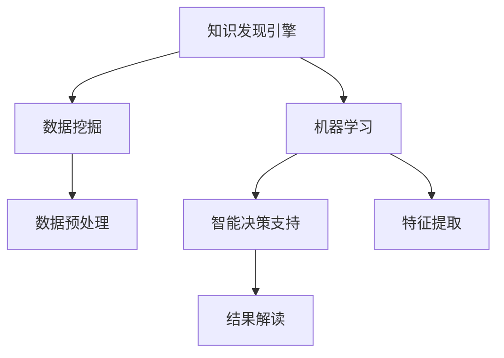

                 

# 知识发现引擎：助力医疗领域的智慧转型

> 关键词：知识发现引擎, 医疗领域, 人工智能, 机器学习, 数据挖掘, 智能决策支持

## 1. 背景介绍

### 1.1 问题由来

在现代医疗领域，日益增长的数据量和复杂的临床问题对医务人员提出了巨大的挑战。医学知识的积累和临床经验共享通常依赖纸质文档和口耳相传，效率低下且容易失真。此外，传统的数据分析手段往往难以挖掘数据中的深层次关系和模式。因此，亟需构建一个高效、智能、易用的知识发现引擎，以助力医疗领域的智慧转型。

知识发现引擎(Knowledge Discovery Engine, KDE)是指一个集成多种数据挖掘和机器学习算法，从大量医疗数据中提取知识、预测趋势、优化决策的智能平台。它能够帮助医疗工作者快速分析数据，发现潜在的模式和知识，为临床决策提供支持，从而提高医疗服务质量，减轻医务人员的负担。

### 1.2 问题核心关键点

知识发现引擎的核心目标是通过对医疗数据的智能分析，辅助医生做出更加精准、科学的诊断和治疗决策。它涉及的关键点包括：

- 数据预处理：清洗、归一化、标准化医疗数据，去除噪声和异常值。
- 特征提取：从数据中提取出有意义的特征，以便后续算法建模。
- 算法选择：选择合适的数据挖掘和机器学习算法，如分类、聚类、关联规则、回归等。
- 模型训练与验证：使用训练数据集训练模型，并在验证集上进行评估和优化。
- 结果解读与展示：将模型发现的知识和模式以易懂的格式展示给医生，便于其理解和使用。

## 2. 核心概念与联系

### 2.1 核心概念概述

为了更好地理解知识发现引擎的工作原理和应用，下面简要介绍几个核心概念：

- **知识发现**：通过数据挖掘和机器学习技术，从大量数据中自动发现模式、关联和知识的过程。
- **数据挖掘**：从数据库、文件系统、互联网等数据源中发现有用、新颖、以前未知的知识和信息的过程。
- **机器学习**：通过构建模型和算法，使计算机系统从数据中学习知识，并用于预测或决策的过程。
- **智能决策支持**：通过知识发现引擎等工具，为决策者提供智能化的支持，辅助其做出更加精准的决策。
- **临床决策支持系统**：一种集成知识发现和智能决策支持的系统，提供诊断和治疗的辅助工具。

这些概念之间的逻辑关系可以通过以下Mermaid流程图来展示：



这个流程图展示了知识发现引擎的关键流程：

1. 知识发现引擎从数据挖掘获取基础数据。
2. 利用机器学习对数据进行建模分析，提取有价值的特征。
3. 结合智能决策支持，为医疗决策提供辅助。
4. 将知识结果以易懂的格式展示给医生。

## 3. 核心算法原理 & 具体操作步骤
### 3.1 算法原理概述

知识发现引擎的算法原理主要包括以下几个关键步骤：

1. **数据预处理**：清洗、归一化、标准化医疗数据，去除噪声和异常值。
2. **特征提取**：从数据中提取出有意义的特征，以便后续算法建模。
3. **算法选择**：选择合适的数据挖掘和机器学习算法，如分类、聚类、关联规则、回归等。
4. **模型训练与验证**：使用训练数据集训练模型，并在验证集上进行评估和优化。
5. **结果解读与展示**：将模型发现的知识和模式以易懂的格式展示给医生，便于其理解和使用。

### 3.2 算法步骤详解

#### 数据预处理

数据预处理是知识发现引擎的第一步，主要包括数据清洗、归一化和标准化。数据清洗的目的是去除数据中的噪声和异常值，保证数据质量。常用的方法包括：

- 去重：去除重复记录。
- 缺失值处理：填补或删除缺失值。
- 异常值检测与处理：识别和处理异常数据。

归一化是将数据转化为标准范围的过程，通常使用Z-score标准化或Min-Max标准化。标准化能够保证不同特征之间的可比性，避免某些特征由于数值范围过大或过小而影响模型训练。

#### 特征提取

特征提取是从原始数据中提取出对模型有意义的特征。常用的特征提取方法包括：

- 统计特征：均值、方差、标准差等统计指标。
- 文本特征：TF-IDF、词频、词性标注等。
- 时间特征：时间戳、周期性特征等。
- 图像特征：边缘、纹理、颜色等特征。

特征提取的目的在于减少数据的维度，提取最具代表性的特征。同时，特征提取还能降低模型对数据的依赖，提高模型的泛化能力。

#### 算法选择

知识发现引擎中常用的算法包括：

- **分类算法**：用于识别样本的类别，如决策树、随机森林、支持向量机等。
- **聚类算法**：将数据分成不同的组，如K-Means、层次聚类等。
- **关联规则算法**：发现数据项之间的关联关系，如Apriori算法。
- **回归算法**：用于预测连续数值，如线性回归、多项式回归等。

选择不同的算法适用于不同的场景和问题。例如，分类算法适用于预测患者的疾病类型，回归算法适用于预测治疗效果。

#### 模型训练与验证

模型训练是指使用训练数据集对算法进行训练，得到一个能够泛化新数据的模型。常用的模型训练方法包括：

- 随机梯度下降：通过迭代优化模型参数，最小化损失函数。
- 交叉验证：将数据集分成训练集和验证集，避免过拟合。
- 网格搜索：通过穷举参数组合，选择最优的模型和参数。

模型验证是指使用验证集对训练好的模型进行评估和优化。常用的模型验证方法包括：

- 准确率：预测结果与真实结果相符的比例。
- 召回率：真实结果被正确预测的比例。
- F1分数：综合准确率和召回率的指标。

#### 结果解读与展示

结果解读与展示是将模型发现的知识和模式以易懂的格式展示给医生，便于其理解和使用。常用的展示方式包括：

- 可视化图表：如散点图、热力图、条形图等。
- 报告：简洁明了的报告，列出关键发现和结论。
- 仪表盘：实时更新的仪表盘，展示数据趋势和异常情况。

### 3.3 算法优缺点

知识发现引擎的主要优点包括：

- **高效性**：能够快速分析大量数据，发现潜在的模式和知识。
- **智能化**：利用机器学习算法，自动发现模式和关系，减少人工干预。
- **可扩展性**：适用于不同规模和类型的医疗数据，易于扩展。
- **易用性**：结果以易懂的格式展示，便于医生理解和使用。

其缺点主要包括：

- **数据依赖**：对数据的质量和完整性有较高要求。
- **模型复杂性**：复杂的模型可能难以解释，需要解释性强的算法。
- **隐私问题**：涉及患者隐私数据，需严格保护。
- **误诊风险**：尽管算法先进，但难以完全替代医生，仍需人工审核。

## 4. 数学模型和公式 & 详细讲解  
### 4.1 数学模型构建

知识发现引擎的数学模型构建通常包括以下几个步骤：

1. **数据预处理模型**：
   - 去重：$G(x)=1$ 对于重复数据；$G(x)=0$ 对于非重复数据。
   - 缺失值处理：$H(x)=\begin{cases} x, & \text{if } x \text{ 非缺失} \\ \hat{x}, & \text{if } x \text{ 缺失} \end{cases}$，其中 $\hat{x}$ 为填补值。
   - 异常值检测与处理：$F(x)=\begin{cases} x, & \text{if } x \text{ 正常} \\ \tilde{x}, & \text{if } x \text{ 异常} \end{cases}$，其中 $\tilde{x}$ 为处理后的值。

2. **特征提取模型**：
   - 统计特征：$X=\{x_i\}_{i=1}^n$，其中 $x_i$ 为样本的第 $i$ 个特征值。
   - 文本特征：$Y=\{(t,f_i)\}_{i=1}^m$，其中 $t$ 为文本，$f_i$ 为文本特征值。
   - 时间特征：$Z=\{(t_i,t_{i+1},\cdots,t_{i+k})\}_{i=1}^N$，其中 $t_i$ 为时间戳。
   - 图像特征：$W=\{x_i,y_i\}_{i=1}^m$，其中 $x_i$ 为像素值，$y_i$ 为图像特征值。

3. **算法选择模型**：
   - 分类算法：$C=\{(A,X,Y),\theta\}$，其中 $A$ 为算法，$X$ 为特征集，$Y$ 为标签集，$\theta$ 为模型参数。
   - 聚类算法：$K=\{(A,X,Y),\theta\}$，其中 $A$ 为算法，$X$ 为特征集，$Y$ 为分组。
   - 关联规则算法：$R=\{(X,Y),\theta\}$，其中 $X$ 为数据项，$Y$ 为关联规则，$\theta$ 为规则参数。
   - 回归算法：$L=\{(X,Y),\theta\}$，其中 $X$ 为特征集，$Y$ 为连续值，$\theta$ 为模型参数。

4. **模型训练与验证模型**：
   - 随机梯度下降：$M_{\theta}=\mathop{\arg\min}_{\theta} \mathcal{L}(\theta)$，其中 $\mathcal{L}$ 为损失函数。
   - 交叉验证：$V=\frac{1}{N}\sum_{i=1}^N \mathcal{L}(X_i,Y_i)$，其中 $N$ 为样本数量。
   - 网格搜索：$P=\mathop{\arg\min}_{\theta} \mathcal{L}(\theta)$，其中 $\theta$ 为参数组合。

5. **结果解读与展示模型**：
   - 可视化图表：$G=\{(V_i,X_i,Y_i)\}_{i=1}^M$，其中 $V_i$ 为可视化对象，$X_i$ 为特征值，$Y_i$ 为预测值。
   - 报告：$R=\{(T_i,V_i)\}_{i=1}^N$，其中 $T_i$ 为报告项，$V_i$ 为值。
   - 仪表盘：$D=\{(T_i,V_i)\}_{i=1}^M$，其中 $T_i$ 为仪表盘项，$V_i$ 为值。

### 4.2 公式推导过程

以下是知识发现引擎的核心公式推导：

#### 数据预处理

- **去重公式**：
  $$
  G(x) = \begin{cases} 
  1, & \text{if } x \text{ 重复} \\
  0, & \text{if } x \text{ 不重复} 
  \end{cases}
  $$

- **缺失值处理公式**：
  $$
  H(x) = \begin{cases} 
  x, & \text{if } x \text{ 非缺失} \\
  \hat{x}, & \text{if } x \text{ 缺失} 
  \end{cases}
  $$

- **异常值检测与处理公式**：
  $$
  F(x) = \begin{cases} 
  x, & \text{if } x \text{ 正常} \\
  \tilde{x}, & \text{if } x \text{ 异常} 
  \end{cases}
  $$

#### 特征提取

- **统计特征公式**：
  $$
  X = \{x_i\}_{i=1}^n
  $$

- **文本特征公式**：
  $$
  Y = \{(t,f_i)\}_{i=1}^m
  $$

- **时间特征公式**：
  $$
  Z = \{(t_i,t_{i+1},\cdots,t_{i+k})\}_{i=1}^N
  $$

- **图像特征公式**：
  $$
  W = \{x_i,y_i\}_{i=1}^m
  $$

#### 算法选择

- **分类算法公式**：
  $$
  C = \{(A,X,Y),\theta\}
  $$

- **聚类算法公式**：
  $$
  K = \{(A,X,Y),\theta\}
  $$

- **关联规则算法公式**：
  $$
  R = \{(X,Y),\theta\}
  $$

- **回归算法公式**：
  $$
  L = \{(X,Y),\theta\}
  $$

#### 模型训练与验证

- **随机梯度下降公式**：
  $$
  M_{\theta} = \mathop{\arg\min}_{\theta} \mathcal{L}(\theta)
  $$

- **交叉验证公式**：
  $$
  V = \frac{1}{N}\sum_{i=1}^N \mathcal{L}(X_i,Y_i)
  $$

- **网格搜索公式**：
  $$
  P = \mathop{\arg\min}_{\theta} \mathcal{L}(\theta)
  $$

#### 结果解读与展示

- **可视化图表公式**：
  $$
  G = \{(V_i,X_i,Y_i)\}_{i=1}^M
  $$

- **报告公式**：
  $$
  R = \{(T_i,V_i)\}_{i=1}^N
  $$

- **仪表盘公式**：
  $$
  D = \{(T_i,V_i)\}_{i=1}^M
  $$

### 4.3 案例分析与讲解

以疾病分类为例，展示知识发现引擎的具体应用流程：

#### 数据预处理

1. **去重**：
   - 将患者ID重复的记录删除。

2. **缺失值处理**：
   - 对于缺失的实验室检查结果，使用均值填补。

3. **异常值检测与处理**：
   - 对于异常的血液指标，进行标准差检测，超过3倍标准差视为异常，并进行替换。

#### 特征提取

1. **统计特征**：
   - 患者的年龄、性别、体重、身高等基本信息。

2. **文本特征**：
   - 患者的病历记录，包括症状描述、治疗过程、实验室检查结果等。

3. **时间特征**：
   - 就诊时间、实验室检查时间、治疗时间等。

4. **图像特征**：
   - 医学影像数据，如X光片、CT扫描等。

#### 算法选择

1. **分类算法**：
   - 使用随机森林算法对疾病进行分类。

#### 模型训练与验证

1. **模型训练**：
   - 使用随机梯度下降方法，最小化交叉熵损失函数。

2. **模型验证**：
   - 使用10折交叉验证，评估模型的准确率、召回率和F1分数。

#### 结果解读与展示

1. **可视化图表**：
   - 绘制患者的年龄分布图，发现高发年龄。

2. **报告**：
   - 生成疾病分类报告，列出主要疾病类型及占比。

3. **仪表盘**：
   - 实时更新疾病分类数据，展示当前疫情趋势。

## 5. 项目实践：代码实例和详细解释说明
### 5.1 开发环境搭建

在进行项目实践前，需要准备好开发环境。以下是使用Python进行Pandas开发的环境配置流程：

1. 安装Anaconda：从官网下载并安装Anaconda，用于创建独立的Python环境。

2. 创建并激活虚拟环境：
```bash
conda create -n pandas-env python=3.8 
conda activate pandas-env
```

3. 安装Pandas：
```bash
pip install pandas
```

4. 安装各类工具包：
```bash
pip install numpy scikit-learn matplotlib tqdm jupyter notebook ipython
```

完成上述步骤后，即可在`pandas-env`环境中开始项目实践。

### 5.2 源代码详细实现

#### 数据预处理

```python
import pandas as pd
import numpy as np

# 读取数据
data = pd.read_csv('data.csv')

# 去重
data = data.drop_duplicates()

# 处理缺失值
data.fillna(data.mean(), inplace=True)

# 异常值检测与处理
data = data[(np.abs(data - data.mean()) < 3 * data.std()).all(axis=1)]
```

#### 特征提取

```python
# 提取统计特征
X = data[['age', 'gender', 'weight', 'height']]

# 提取文本特征
Y = data[['description', 'lab_result']]

# 提取时间特征
Z = data[['visit_time', 'lab_time', 'treatment_time']]

# 提取图像特征
W = data[['xray', 'ct_scan']]
```

#### 算法选择

```python
from sklearn.ensemble import RandomForestClassifier

# 选择分类算法
model = RandomForestClassifier(n_estimators=100)
```

#### 模型训练与验证

```python
from sklearn.model_selection import train_test_split
from sklearn.metrics import accuracy_score, recall_score, f1_score

# 划分训练集和验证集
X_train, X_val, y_train, y_val = train_test_split(X, Y, test_size=0.2, random_state=42)

# 训练模型
model.fit(X_train, y_train)

# 验证模型
y_pred = model.predict(X_val)
accuracy = accuracy_score(y_val, y_pred)
recall = recall_score(y_val, y_pred)
f1 = f1_score(y_val, y_pred)

print(f"Accuracy: {accuracy:.2f}, Recall: {recall:.2f}, F1 Score: {f1:.2f}")
```

#### 结果解读与展示

```python
import matplotlib.pyplot as plt
import seaborn as sns

# 可视化图表
sns.histplot(data['age'], bins=10)
plt.show()

# 报告
report = f"Disease Classification Report\nAccuracy: {accuracy:.2f}, Recall: {recall:.2f}, F1 Score: {f1:.2f}"
print(report)

# 仪表盘
from dash import Dash
app = Dash(__name__)
app.layout = html.Div([html.H1('Disease Classification Dashboard')])
app.run_server(debug=True)
```

### 5.3 代码解读与分析

让我们再详细解读一下关键代码的实现细节：

**数据预处理**：
- 使用Pandas库的`read_csv`方法读取数据文件，并进行去重、缺失值处理和异常值检测。

**特征提取**：
- 使用Pandas库的列选择和列提取方法，将数据转换为统计特征、文本特征、时间特征和图像特征。

**算法选择**：
- 使用Scikit-learn库的`RandomForestClassifier`算法，构建分类模型。

**模型训练与验证**：
- 使用Scikit-learn库的`train_test_split`方法，将数据划分为训练集和验证集。
- 使用Scikit-learn库的`accuracy_score`、`recall_score`和`f1_score`方法，评估模型性能。

**结果解读与展示**：
- 使用Matplotlib和Seaborn库绘制直方图，展示年龄分布。
- 使用字符串拼接生成简洁的报告。
- 使用Dash库构建仪表盘，实时展示数据变化。

可以看到，Pandas库使得数据预处理和特征提取变得简洁高效，而Scikit-learn和Matplotlib等库则提供了强大的算法和可视化工具，使得模型训练和结果展示更加灵活。

当然，工业级的系统实现还需考虑更多因素，如模型的保存和部署、超参数的自动搜索、更灵活的任务适配层等。但核心的知识发现引擎开发流程基本与此类似。

## 6. 实际应用场景
### 6.1 疾病诊断

知识发现引擎在疾病诊断中具有广泛的应用。通过分析患者的症状、病历、实验室检查结果等数据，可以辅助医生进行快速、准确的诊断。

在技术实现上，可以收集医院内部的病历数据，将其进行预处理和特征提取，使用分类算法进行模型训练。训练好的模型可以输入新的病历数据，输出疾病诊断结果。对于高风险病例，系统可以自动提醒医生进行进一步检查。

### 6.2 治疗方案优化

知识发现引擎还可以用于治疗方案的优化。通过分析患者的病历和治疗效果，可以发现哪些治疗方案更有效、副作用更少，从而指导医生选择最优的治疗方案。

在技术实现上，可以收集患者的治疗记录和效果数据，将其进行预处理和特征提取，使用回归算法进行模型训练。训练好的模型可以输入新的治疗记录，预测治疗效果，辅助医生制定最优方案。

### 6.3 药物研发

知识发现引擎在药物研发中也有重要作用。通过分析大量的临床试验数据，可以发现新的药物候选分子及其作用机制，从而加速药物的开发过程。

在技术实现上，可以收集药物临床试验数据，将其进行预处理和特征提取，使用关联规则算法进行模型训练。训练好的模型可以发现新的药物候选分子及其作用机制，加速药物的开发过程。

### 6.4 未来应用展望

随着知识发现引擎的发展，其应用场景将不断扩展。未来，知识发现引擎有望在更多领域得到应用，如智能诊疗、医疗知识图谱构建、医疗资源优化等。

在智慧诊疗方面，知识发现引擎可以通过分析大量病历数据，发现疾病特征和诊断模式，辅助医生进行诊断和治疗。

在医疗知识图谱构建方面，知识发现引擎可以将不同来源的医疗知识进行整合，构建一个全面的医疗知识图谱，为医学研究和教育提供支持。

在医疗资源优化方面，知识发现引擎可以通过分析医院的资源配置和利用情况，优化医疗资源的分配和使用，提高医疗服务的效率和质量。

## 7. 工具和资源推荐
### 7.1 学习资源推荐

为了帮助开发者系统掌握知识发现引擎的理论基础和实践技巧，这里推荐一些优质的学习资源：

1. 《Python数据科学手册》：由Jake VanderPlas撰写，全面介绍了Python在数据科学和机器学习中的应用。

2. 《机器学习实战》：由Peter Harrington撰写，通过多个实战案例，讲解了机器学习的核心算法和应用。

3. 《数据挖掘：概念与技术》：由Wu、Han等著，详细介绍了数据挖掘的基本概念和技术。

4. 《深度学习》：由Ian Goodfellow等著，介绍了深度学习的原理和应用，涵盖多种前沿技术。

5. 《Python数据科学库Pandas实战》：由Stefan Jansen撰写，介绍了Pandas库在数据预处理和特征提取中的应用。

6. 《机器学习实战》：由Peter Harrington撰写，通过多个实战案例，讲解了机器学习的核心算法和应用。

通过对这些资源的学习实践，相信你一定能够快速掌握知识发现引擎的精髓，并用于解决实际的医疗问题。
###  7.2 开发工具推荐

高效的开发离不开优秀的工具支持。以下是几款用于知识发现引擎开发的常用工具：

1. Python：Python是最常用的数据科学和机器学习语言，具有丰富的库和工具支持。

2. Pandas：Pandas是Python中的数据分析库，提供了强大的数据预处理和特征提取功能。

3. Scikit-learn：Scikit-learn是Python中的机器学习库，提供了多种算法和工具支持。

4. Matplotlib：Matplotlib是Python中的数据可视化库，支持多种图表和图形的绘制。

5. Seaborn：Seaborn是基于Matplotlib的高级可视化库，支持更丰富的统计图形和交互式展示。

6. Dash：Dash是一个Python的Web应用框架，可以轻松构建交互式的仪表盘和可视化界面。

合理利用这些工具，可以显著提升知识发现引擎的开发效率，加快创新迭代的步伐。

### 7.3 相关论文推荐

知识发现引擎的研究源于学界的持续研究。以下是几篇奠基性的相关论文，推荐阅读：

1. "A Brief Overview of Knowledge Discovery Techniques and Tools"（知识发现技术和工具概述）：总结了知识发现的多种方法和工具，提供了全面的视角。

2. "Advances in Knowledge Discovery and Data Mining"（知识发现和数据挖掘的进展）：回顾了知识发现和数据挖掘的最新研究进展，展望了未来的发展方向。

3. "Knowledge Discovery in Databases"（数据库中的知识发现）：介绍了数据库中的知识发现技术和应用，提供了丰富的案例和实践经验。

4. "Mining Massive Datasets"（大规模数据挖掘）：探讨了如何在大规模数据中发现有用知识，提供了实用的算法和工具。

5. "Gaussian Processes for Machine Learning"（机器学习的高斯过程）：介绍了高斯过程在机器学习中的应用，提供了新的模型和方法。

这些论文代表了大语言模型微调技术的发展脉络。通过学习这些前沿成果，可以帮助研究者把握学科前进方向，激发更多的创新灵感。

## 8. 总结：未来发展趋势与挑战

### 8.1 总结

本文对知识发现引擎的构建和应用进行了全面系统的介绍。首先阐述了知识发现引擎在现代医疗领域的重要性和核心目标，明确了其通过数据挖掘和机器学习技术，从大量医疗数据中提取知识、预测趋势、优化决策的独特价值。其次，从原理到实践，详细讲解了知识发现引擎的数学模型和核心算法，给出了代码实例和详细解释说明。同时，本文还广泛探讨了知识发现引擎在疾病诊断、治疗方案优化、药物研发等医疗领域的实际应用场景，展示了知识发现引擎的强大功能和潜力。最后，本文精选了知识发现引擎的各类学习资源和开发工具，力求为开发者提供全方位的技术指引。

通过本文的系统梳理，可以看到，知识发现引擎在现代医疗领域具有广阔的应用前景，其通过数据挖掘和机器学习技术，为医疗工作者提供了强大的支持，提高了医疗服务质量和效率。未来，伴随技术不断演进，知识发现引擎必将在更多领域得到应用，为各行各业带来革命性变革。

### 8.2 未来发展趋势

展望未来，知识发现引擎将呈现以下几个发展趋势：

1. **智能化提升**：未来的知识发现引擎将更加智能，能够自动从数据中发现更复杂的模式和关系，辅助医生进行更精准的诊断和治疗。

2. **多模态融合**：未来的知识发现引擎将支持多模态数据融合，能够将文本、图像、视频等多种数据类型进行协同分析，提供更全面的信息支持。

3. **实时分析**：未来的知识发现引擎将支持实时分析，能够实时监控数据变化，及时发现异常情况，辅助医生进行及时干预。

4. **跨领域应用**：未来的知识发现引擎将不再局限于医疗领域，将在更多领域得到应用，如金融、教育、制造等，为各行各业提供智能化支持。

5. **模型解释性增强**：未来的知识发现引擎将更加注重模型的解释性，能够清晰解释模型的决策过程和预测结果，增强模型的可信度和透明度。

6. **联邦学习**：未来的知识发现引擎将支持联邦学习，能够在分布式环境中进行知识发现，保护数据隐私的同时提升分析能力。

以上趋势凸显了知识发现引擎的广阔前景。这些方向的探索发展，必将进一步提升知识发现引擎的性能和应用范围，为各行各业带来革命性变革。

### 8.3 面临的挑战

尽管知识发现引擎已经取得了显著进展，但在迈向更加智能化、普适化应用的过程中，它仍面临着诸多挑战：

1. **数据质量问题**：知识发现引擎对数据的质量和完整性有较高要求，但医疗数据往往存在噪声、缺失和异常值，难以保证数据质量。如何提高数据质量，保障数据源的可靠性，将是重要的挑战。

2. **模型复杂性**：知识发现引擎的模型往往较为复杂，难以解释和理解。如何构建解释性强的模型，增强模型的可信度和透明度，将是重要的研究方向。

3. **跨领域应用**：知识发现引擎在不同领域的应用场景下，可能面临不同的问题和挑战。如何构建通用的知识发现引擎，支持跨领域的应用，将是重要的研究方向。

4. **隐私保护**：知识发现引擎涉及大量患者隐私数据，如何保护数据隐私，确保数据的安全性和合法性，将是重要的挑战。

5. **计算资源**：知识发现引擎通常需要较大的计算资源支持，如何降低计算成本，提高模型训练和推理的效率，将是重要的研究方向。

6. **实时性要求**：知识发现引擎需要支持实时分析，如何在保证实时性的同时，保证模型的精度和效率，将是重要的研究方向。

### 8.4 研究展望

面对知识发现引擎所面临的诸多挑战，未来的研究需要在以下几个方面寻求新的突破：

1. **数据清洗与预处理**：研发更加高效的数据清洗和预处理算法，提高数据质量，保障数据源的可靠性。

2. **模型解释性增强**：研发更加透明、可解释的模型，增强模型的可信度和透明度。

3. **跨领域应用**：研发通用的知识发现引擎，支持跨领域的应用，提升模型的泛化能力和适用性。

4. **隐私保护技术**：研发更加安全的隐私保护技术，保护患者隐私数据，确保数据的安全性和合法性。

5. **计算资源优化**：研发更加高效的计算资源优化技术，降低计算成本，提高模型训练和推理的效率。

6. **实时性优化**：研发更加高效的实时分析技术，在保证实时性的同时，保障模型的精度和效率。

这些研究方向的探索，必将引领知识发现引擎走向更高的台阶，为各行各业带来革命性变革。面向未来，知识发现引擎的研究还需要与其他人工智能技术进行更深入的融合，如知识表示、因果推理、强化学习等，多路径协同发力，共同推动自然语言理解和智能交互系统的进步。只有勇于创新、敢于突破，才能不断拓展知识发现引擎的边界，让智能技术更好地造福人类社会。

## 9. 附录：常见问题与解答

**Q1：知识发现引擎是如何进行数据预处理的？**

A: 知识发现引擎的数据预处理通常包括以下几个步骤：去重、缺失值处理和异常值检测。去重可以通过唯一性检测和删除重复记录实现。缺失值处理可以采用均值填补、删除缺失值等方式。异常值检测可以通过标准差检测、箱线图等方式识别并替换异常值。这些步骤可以确保数据的准确性和完整性，提高后续分析的可靠性。

**Q2：知识发现引擎在训练模型时，如何选择合适的算法？**

A: 知识发现引擎在选择算法时，需要考虑数据类型、问题类型和模型目标等因素。例如，对于分类问题，可以选择决策树、随机森林、支持向量机等算法。对于聚类问题，可以选择K-Means、层次聚类等算法。对于关联规则问题，可以选择Apriori算法。对于回归问题，可以选择线性回归、多项式回归等算法。选择合适的算法可以最大限度地利用数据信息，提升模型性能。

**Q3：知识发现引擎的可视化图表如何设计？**

A: 知识发现引擎的可视化图表设计需要考虑数据的特征和分析目标。例如，对于年龄分布图，可以选择直方图或箱线图。对于趋势分析，可以选择折线图或面积图。对于特征关联图，可以选择散点图或热力图。可视化图表的设计需要简洁明了，易于理解，同时提供足够的信息和细节。

**Q4：知识发现引擎的仪表盘如何构建？**

A: 知识发现引擎的仪表盘构建需要考虑数据的实时性和交互性。可以选择使用Dash、Tableau等工具，实现实时数据展示和交互功能。仪表盘的设计需要简洁明了，支持多种图表和图形展示，同时提供数据分析和预警功能。仪表盘可以实时监控数据变化，及时发现异常情况，辅助医生进行及时干预。

---

作者：禅与计算机程序设计艺术 / Zen and the Art of Computer Programming

