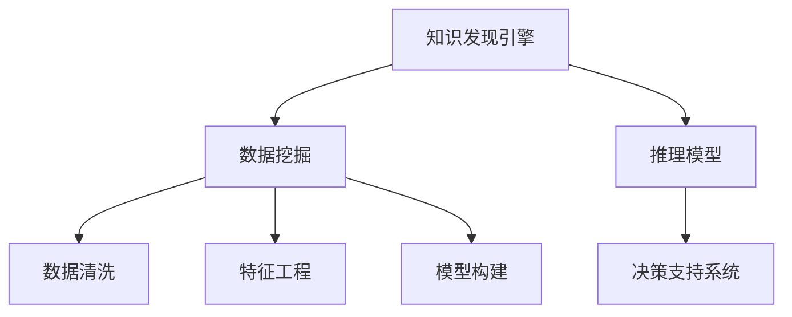

                 

# 知识发现引擎：助力金融行业的风险管理

在金融行业，风险管理是一个至关重要且复杂的任务。传统的风险管理依赖于历史数据和专家经验，但这些方法在面对复杂多变的市场和不断创新的金融产品时，显得力不从心。随着人工智能技术的不断发展，特别是知识发现引擎的应用，正在逐步改变这一局面。本文将深入探讨知识发现引擎的核心概念、算法原理及其在金融行业风险管理中的应用实践，旨在为金融机构的决策支持提供新的思路和工具。

## 1. 背景介绍

### 1.1 问题由来
金融行业的风险管理面临多重挑战：

- **数据复杂性**：金融市场数据庞大且复杂，包括历史价格、市场情绪、政策变化等多种因素。
- **市场动态性**：金融市场变化迅速，新的金融产品和交易策略不断涌现。
- **决策风险**：传统金融决策依赖于专家经验，但专家经验往往带有主观性，难以量化。

这些挑战催生了对自动化、智能化的决策支持系统的需求。知识发现引擎作为一种新型的数据驱动决策工具，正逐渐在金融行业得到广泛应用，通过从海量数据中自动提取有价值的信息，帮助金融机构识别风险并制定更科学的决策策略。

### 1.2 问题核心关键点
知识发现引擎通过从数据中自动学习并提取知识，构建基于事实的推理模型，以辅助决策。其主要特点包括：

- **数据驱动**：自动从数据中学习，无需人工干预。
- **知识提取**：自动发现数据中的隐含关系和模式。
- **辅助决策**：通过推理模型提供决策支持。
- **可扩展性**：适用于处理大规模数据。

在金融风险管理中，知识发现引擎可以用于信用评估、市场预测、投资组合优化等各个环节，提升决策的精准度和效率。

## 2. 核心概念与联系

### 2.1 核心概念概述

为更好地理解知识发现引擎的工作原理和在金融风险管理中的应用，本节将介绍几个关键概念：

- **知识发现(Knowledge Discovery, KD)**：指从数据中自动提取有用知识的过程。包括数据清洗、预处理、特征工程、模型构建和评估等多个环节。
- **数据挖掘(Data Mining)**：是知识发现的重要组成部分，通过统计、机器学习等方法从数据中挖掘出模式和规律。
- **推理模型(Inference Model)**：基于数据挖掘的结果构建推理模型，用于推断未知数据或做出预测。
- **决策支持系统(Decision Support System, DSS)**：通过知识发现引擎生成的知识，为决策者提供辅助决策的信息。

这些核心概念之间的联系和作用可以通过以下Mermaid流程图来展示：



这个流程图展示了一系列从数据到决策支持的关键步骤：

1. 知识发现引擎从数据中学习知识。
2. 数据挖掘负责从数据中提取模式和规律。
3. 数据清洗、特征工程和模型构建等步骤用于提升数据质量和模型性能。
4. 推理模型通过挖掘到的知识对新数据进行推理和预测。
5. 决策支持系统利用推理模型的结果，辅助决策者做出科学决策。

## 3. 核心算法原理 & 具体操作步骤
### 3.1 算法原理概述

知识发现引擎在金融风险管理中的应用，主要依赖于以下算法原理：

- **数据清洗与预处理**：清洗数据中的噪声和异常值，处理缺失值和重复值，构建特征表示。
- **特征工程**：从原始数据中提取特征，并进行组合、归一化、降维等处理。
- **模型选择与训练**：选择合适的模型（如决策树、神经网络、支持向量机等），并使用训练数据进行模型训练。
- **模型评估与调优**：评估模型性能，并根据评估结果进行模型调优，选择最优模型。
- **推理与决策支持**：将训练好的模型应用于新数据，通过推理引擎提供决策支持。

### 3.2 算法步骤详解

以下是知识发现引擎在金融风险管理中具体应用步骤：

1. **数据收集**：收集金融市场的各种数据，包括历史价格、交易量、市场情绪、政策变化等。

2. **数据预处理**：对数据进行清洗，处理缺失值和异常值，构建特征表示。例如，处理缺失价格数据，将其插值或删除；处理异常交易量数据，识别并剔除异常值。

3. **特征工程**：从原始数据中提取有意义的特征，并进行组合、归一化、降维等处理。例如，提取历史价格变化率、市场波动性、政策变化等特征。

4. **模型选择与训练**：选择适合的模型，如决策树、随机森林、神经网络等，并使用历史数据进行模型训练。训练过程中，使用交叉验证等方法评估模型性能，避免过拟合。

5. **模型评估与调优**：使用验证集评估模型性能，并通过网格搜索等方法进行模型调优，选择最优模型。例如，评估模型在预测市场波动性、评估信用风险等任务上的准确率、召回率和F1分数。

6. **推理与决策支持**：将训练好的模型应用于新数据，通过推理引擎提供决策支持。例如，对于新上市的金融产品，使用知识发现引擎评估其风险，辅助决策是否投资。

### 3.3 算法优缺点

知识发现引擎在金融风险管理中具有以下优点：

- **自动化程度高**：自动从数据中学习知识，无需人工干预。
- **泛化能力强**：通过大规模数据训练，模型具有较好的泛化能力，能适应新数据。
- **决策支持精确**：通过推理模型提供决策支持，提升决策的科学性和准确性。
- **灵活性高**：适用于各种金融风险管理任务，如信用评估、市场预测、投资组合优化等。

同时，该方法也存在一些局限性：

- **数据依赖**：依赖于高质量、大规模的数据，数据质量不高或数据量不足可能影响模型效果。
- **模型复杂性**：模型复杂度高，需要较强的计算资源进行训练和推理。
- **可解释性不足**：模型通常作为黑盒使用，决策过程难以解释。
- **对抗攻击风险**：模型可能受到对抗样本攻击，影响推理结果。

尽管存在这些局限性，知识发现引擎在金融风险管理中的应用仍然展现出巨大的潜力和价值。

### 3.4 算法应用领域

知识发现引擎在金融风险管理中的应用领域广泛，包括但不限于：

- **信用评估**：通过分析借款人的历史行为数据，构建信用风险模型，预测其违约概率。
- **市场预测**：利用历史市场数据和政策变化信息，预测股票、债券等金融产品的价格走势。
- **投资组合优化**：根据历史数据和市场情绪，构建投资组合模型，优化资产配置，降低风险。
- **金融欺诈检测**：通过分析交易行为模式，检测异常交易，预防金融欺诈。
- **金融产品定价**：通过市场数据和模型预测，评估新金融产品的风险和价值，制定合理定价策略。

这些应用场景展示了知识发现引擎在金融风险管理中的强大应用潜力，有助于金融机构提升决策水平和市场竞争力。

## 4. 数学模型和公式 & 详细讲解  
### 4.1 数学模型构建

在金融风险管理中，知识发现引擎常用于构建各种推理模型，以下以信用评估模型为例，介绍数学模型的构建过程。

设 $\mathbf{x} \in \mathbb{R}^n$ 为借款人的特征向量，包含年龄、收入、还款记录等信息。目标变量 $y \in \{0,1\}$，表示借款人是否违约。

定义信用评估模型为 $M(\mathbf{x})$，其中 $M$ 可以是决策树、随机森林、神经网络等模型。模型的输出为违约概率 $p$，即：

$$
p = P(y=1 \mid \mathbf{x}) = M(\mathbf{x})
$$

通过最大化似然函数 $\mathcal{L}(\theta) = \prod_{i=1}^N p_i^{y_i} (1-p_i)^{1-y_i}$，可以估计模型参数 $\theta$。其中 $p_i = M(\mathbf{x}_i)$，$\mathbf{x}_i$ 为样本 $i$ 的特征向量。

### 4.2 公式推导过程

以逻辑回归为例，推导信用评估模型的数学推导过程。

对于二分类问题，逻辑回归模型的输出为：

$$
\hat{y} = \frac{1}{1+e^{-z}} \quad \text{where} \quad z = \mathbf{w} \cdot \mathbf{x} + b
$$

其中 $\mathbf{w}$ 和 $b$ 为模型的权重和偏置，$\mathbf{x}$ 为输入特征向量。

通过最大化似然函数，得到模型参数 $\mathbf{w}$ 和 $b$ 的估计值：

$$
\mathbf{w} = \frac{\mathbf{X}^T \mathbf{y}}{\mathbf{X}^T \mathbf{X}} \quad \text{and} \quad b = \bar{y} - \mathbf{w} \cdot \bar{\mathbf{x}}
$$

其中 $\mathbf{X} = [\mathbf{x}_1, \mathbf{x}_2, \ldots, \mathbf{x}_n]$，$\mathbf{y} = [y_1, y_2, \ldots, y_n]$，$\bar{y} = \frac{1}{N} \sum_{i=1}^N y_i$，$\bar{\mathbf{x}} = \frac{1}{N} \sum_{i=1}^N \mathbf{x}_i$。

### 4.3 案例分析与讲解

以下以信用评估模型为例，通过具体案例展示知识发现引擎的应用过程：

**案例背景**：某金融机构希望构建一个信用评估模型，用于预测新贷款申请人的违约概率。

**数据准备**：收集历史贷款申请人的数据，包括年龄、收入、还款记录等信息。对数据进行清洗和预处理，处理缺失值和异常值。

**特征工程**：从原始数据中提取有意义的特征，如年龄、收入、还款记录等，并进行组合、归一化、降维等处理。

**模型选择与训练**：选择逻辑回归模型，使用历史数据进行训练。训练过程中，使用交叉验证评估模型性能，避免过拟合。

**模型评估与调优**：使用验证集评估模型性能，通过网格搜索等方法进行模型调优，选择最优模型。

**推理与决策支持**：将训练好的模型应用于新贷款申请人的数据，通过推理引擎提供决策支持。例如，对于新申请人的数据，使用知识发现引擎评估其违约概率，辅助决策是否批准贷款。

## 5. 项目实践：代码实例和详细解释说明
### 5.1 开发环境搭建

在进行知识发现引擎的实践前，我们需要准备好开发环境。以下是使用Python进行PyTorch开发的环境配置流程：

1. 安装Anaconda：从官网下载并安装Anaconda，用于创建独立的Python环境。

2. 创建并激活虚拟环境：
```bash
conda create -n pytorch-env python=3.8 
conda activate pytorch-env
```

3. 安装PyTorch：根据CUDA版本，从官网获取对应的安装命令。例如：
```bash
conda install pytorch torchvision torchaudio cudatoolkit=11.1 -c pytorch -c conda-forge
```

4. 安装Scikit-learn：
```bash
pip install scikit-learn
```

5. 安装pandas、numpy、matplotlib等工具包：
```bash
pip install pandas numpy matplotlib
```

完成上述步骤后，即可在`pytorch-env`环境中开始项目实践。

### 5.2 源代码详细实现

以下是使用PyTorch实现信用评估模型的完整代码实现：

```python
import torch
import torch.nn as nn
import torch.optim as optim
from sklearn.model_selection import train_test_split
from sklearn.metrics import roc_auc_score
from sklearn.preprocessing import StandardScaler
from sklearn.pipeline import Pipeline

# 加载数据集
data = pd.read_csv('credit_data.csv')

# 数据预处理
X = data.drop('default', axis=1)
y = data['default']

# 特征工程
scaler = StandardScaler()
X = scaler.fit_transform(X)

# 模型选择与训练
class LogisticRegression(nn.Module):
    def __init__(self):
        super(LogisticRegression, self).__init__()
        self.linear = nn.Linear(X.shape[1], 1)
    
    def forward(self, x):
        return self.linear(x)

model = LogisticRegression()
optimizer = optim.SGD(model.parameters(), lr=0.01)
criterion = nn.BCELoss()

# 训练模型
X_train, X_test, y_train, y_test = train_test_split(X, y, test_size=0.2, random_state=42)
X_train = torch.tensor(X_train, dtype=torch.float32)
y_train = torch.tensor(y_train, dtype=torch.float32)
X_test = torch.tensor(X_test, dtype=torch.float32)
y_test = torch.tensor(y_test, dtype=torch.float32)

for epoch in range(100):
    optimizer.zero_grad()
    outputs = model(X_train)
    loss = criterion(outputs, y_train)
    loss.backward()
    optimizer.step()
    
    # 评估模型
    with torch.no_grad():
        y_pred = torch.sigmoid(model(X_test))
        roc_auc = roc_auc_score(y_test.numpy(), y_pred.numpy())
        print(f'Epoch {epoch+1}, AUC: {roc_auc:.4f}')
```

代码中使用了PyTorch框架，包含数据加载、预处理、模型构建、训练和评估等关键步骤。

### 5.3 代码解读与分析

以下是关键代码的详细解读：

**数据加载**：
```python
data = pd.read_csv('credit_data.csv')
```
使用pandas库读取数据集，准备用于信用评估的数据。

**数据预处理**：
```python
X = data.drop('default', axis=1)
y = data['default']
```
将数据分为特征集X和目标变量y，准备用于训练模型。

**特征工程**：
```python
scaler = StandardScaler()
X = scaler.fit_transform(X)
```
使用sklearn的StandardScaler对特征进行归一化处理。

**模型构建**：
```python
class LogisticRegression(nn.Module):
    def __init__(self):
        super(LogisticRegression, self).__init__()
        self.linear = nn.Linear(X.shape[1], 1)
    
    def forward(self, x):
        return self.linear(x)
```
定义一个简单的逻辑回归模型，包含一个线性层，用于预测违约概率。

**模型训练**：
```python
optimizer = optim.SGD(model.parameters(), lr=0.01)
criterion = nn.BCELoss()
```
使用随机梯度下降优化器进行模型训练，并定义二元交叉熵损失函数。

**模型评估**：
```python
with torch.no_grad():
    y_pred = torch.sigmoid(model(X_test))
    roc_auc = roc_auc_score(y_test.numpy(), y_pred.numpy())
    print(f'Epoch {epoch+1}, AUC: {roc_auc:.4f}')
```
在每个epoch结束后，计算模型在测试集上的AUC值，评估模型性能。

## 6. 实际应用场景

### 6.1 智能投顾

智能投顾系统利用知识发现引擎，通过分析历史市场数据和交易行为，构建投资组合模型，提供个性化的投资建议。例如，根据用户的风险偏好和历史交易记录，智能投顾系统可以生成最优的投资组合方案，帮助用户实现资产增值。

**案例背景**：某投资公司希望构建一个智能投顾系统，为用户提供个性化的投资建议。

**数据准备**：收集历史市场数据和用户交易记录。

**模型选择与训练**：选择随机森林等模型，使用历史数据进行训练。

**模型评估与调优**：使用验证集评估模型性能，通过网格搜索等方法进行模型调优，选择最优模型。

**推理与决策支持**：将训练好的模型应用于新市场数据，通过推理引擎提供投资建议。例如，对于新市场数据，使用知识发现引擎评估投资组合的风险和回报，辅助决策最优投资策略。

### 6.2 信用风险管理

信用风险管理是金融行业的核心任务之一，知识发现引擎可以通过分析借款人的历史行为数据，构建信用风险模型，预测其违约概率。

**案例背景**：某银行希望构建一个信用风险管理系统，用于评估新贷款申请人的违约概率。

**数据准备**：收集历史贷款申请人的数据，包括年龄、收入、还款记录等信息。对数据进行清洗和预处理，处理缺失值和异常值。

**模型选择与训练**：选择逻辑回归、随机森林等模型，使用历史数据进行训练。

**模型评估与调优**：使用验证集评估模型性能，通过网格搜索等方法进行模型调优，选择最优模型。

**推理与决策支持**：将训练好的模型应用于新贷款申请人的数据，通过推理引擎提供决策支持。例如，对于新申请人的数据，使用知识发现引擎评估其违约概率，辅助决策是否批准贷款。

### 6.3 金融欺诈检测

金融欺诈检测是金融行业的重要任务，知识发现引擎可以通过分析交易行为模式，检测异常交易，预防金融欺诈。

**案例背景**：某银行希望构建一个金融欺诈检测系统，用于检测信用卡交易中的异常行为。

**数据准备**：收集信用卡交易数据，包括交易金额、时间、地点等信息。

**模型选择与训练**：选择决策树、随机森林等模型，使用历史数据进行训练。

**模型评估与调优**：使用验证集评估模型性能，通过网格搜索等方法进行模型调优，选择最优模型。

**推理与决策支持**：将训练好的模型应用于新交易数据，通过推理引擎提供决策支持。例如，对于新交易数据，使用知识发现引擎检测异常交易行为，预防金融欺诈。

## 7. 工具和资源推荐
### 7.1 学习资源推荐

为了帮助开发者系统掌握知识发现引擎的理论基础和实践技巧，这里推荐一些优质的学习资源：

1. 《机器学习实战》系列书籍：适合初学者快速入门，涵盖机器学习的基本概念和应用场景。

2. 《Python数据科学手册》：深入介绍Python在数据科学中的应用，涵盖数据清洗、特征工程、模型训练等多个环节。

3. 《深度学习》（Ian Goodfellow等著）：深入介绍深度学习的基本原理和应用，适合进一步深入学习的读者。

4. Kaggle：数据科学竞赛平台，提供大量公开数据集和竞赛任务，帮助读者在实践中提升技能。

5. Coursera：在线学习平台，提供机器学习、深度学习等多个领域的课程，涵盖从基础到高级的内容。

通过对这些资源的学习实践，相信你一定能够快速掌握知识发现引擎的精髓，并用于解决实际的金融问题。
### 7.2 开发工具推荐

高效的开发离不开优秀的工具支持。以下是几款用于知识发现引擎开发的常用工具：

1. Python：Python是数据科学和机器学习领域的通用语言，易于学习和使用。

2. PyTorch：基于Python的深度学习框架，支持动态计算图，灵活性高，适合快速迭代研究。

3. Scikit-learn：Python的机器学习库，包含丰富的算法和工具，适合构建各种推理模型。

4. Weights & Biases：模型训练的实验跟踪工具，可以记录和可视化模型训练过程中的各项指标，方便对比和调优。

5. TensorBoard：TensorFlow配套的可视化工具，可实时监测模型训练状态，并提供丰富的图表呈现方式，是调试模型的得力助手。

6. Jupyter Notebook：Python代码的交互式开发环境，支持代码片段的保存和共享，适合进行科研和开发。

合理利用这些工具，可以显著提升知识发现引擎的开发效率，加快创新迭代的步伐。

### 7.3 相关论文推荐

知识发现引擎的研究源于学界的持续研究。以下是几篇奠基性的相关论文，推荐阅读：

1. On the Shoulders of Giants: The History and Importance of Knowledge Discovery（Knowledge Discovery in Databases, KDD）：KDD会议的创立者Jerry Ullman的论文，介绍了知识发现的发展历程和重要性。

2. Machine Learning: A Probabilistic Perspective：Tom Mitchell的经典著作，全面介绍了机器学习的基本原理和应用。

3. Statistical Learning（Bishop）：Christopher Bishop的著作，介绍了统计学习的基本原理和应用。

4. Deep Learning（Goodfellow等）：Ian Goodfellow等人的著作，介绍了深度学习的基本原理和应用。

5. The Elements of Statistical Learning（Hastie等）：机器学习领域的经典教材，全面介绍了统计学习的基本原理和应用。

这些论文代表了大规模数据和模型技术的研究脉络。通过学习这些前沿成果，可以帮助研究者把握学科前进方向，激发更多的创新灵感。

## 8. 总结：未来发展趋势与挑战

### 8.1 研究成果总结

本文对知识发现引擎的核心概念、算法原理及其在金融行业风险管理中的应用进行了全面系统的介绍。首先阐述了知识发现引擎的工作原理和应用场景，明确了知识发现引擎在金融风险管理中的独特价值。其次，从原理到实践，详细讲解了知识发现引擎的数学模型和操作步骤，给出了金融风险管理中信用评估、市场预测、投资组合优化等多个任务的具体实现方法。同时，本文还广泛探讨了知识发现引擎在智能投顾、信用风险管理、金融欺诈检测等多个领域的应用前景，展示了知识发现引擎在金融行业的强大应用潜力。最后，本文精选了知识发现引擎的学习资源、开发工具和相关论文，力求为读者提供全方位的技术指引。

通过本文的系统梳理，可以看到，知识发现引擎正在逐步改变金融行业的决策方式，为金融机构提供了强大的决策支持工具。知识发现引擎通过从海量数据中自动提取有用信息，构建推理模型，帮助决策者制定科学决策，降低了金融风险。未来，知识发现引擎在金融行业的应用将会更加广泛，为金融机构的数字化转型提供新的动力。

### 8.2 未来发展趋势

展望未来，知识发现引擎在金融行业的发展趋势包括：

1. **自动化程度提升**：随着人工智能技术的进步，知识发现引擎的自动化程度将不断提升，可以自动完成数据清洗、特征工程、模型构建等环节。

2. **模型复杂性降低**：通过引入更多的先验知识和优化算法，知识发现引擎的模型复杂度将逐步降低，适应性更强。

3. **多模态融合**：知识发现引擎将逐步融合多模态数据，如文本、图像、声音等，提升对复杂金融产品的理解和预测能力。

4. **模型解释性增强**：知识发现引擎的决策过程将更加透明，模型解释性将逐步增强，为决策者提供更有力的支持。

5. **实时性增强**：知识发现引擎将逐步实现实时推理和预测，提升决策的时效性。

6. **跨领域应用扩展**：知识发现引擎将逐步应用于更多领域，如医疗、教育、能源等，为各行业的决策提供支持。

### 8.3 面临的挑战

尽管知识发现引擎在金融风险管理中的应用取得了显著进展，但在迈向更加智能化、普适化应用的过程中，仍面临诸多挑战：

1. **数据质量问题**：金融数据往往存在噪声和缺失，如何处理这些问题将是关键。

2. **模型鲁棒性**：模型在面对异常数据或对抗攻击时，可能出现偏差或失效，如何提升模型的鲁棒性是重要研究方向。

3. **计算资源**：知识发现引擎通常需要处理大规模数据和复杂模型，如何高效利用计算资源是重要挑战。

4. **模型可解释性**：知识发现引擎的决策过程通常难以解释，如何提高模型的可解释性是重要课题。

5. **隐私保护**：金融数据涉及敏感信息，如何保护数据隐私是重要问题。

### 8.4 研究展望

面对知识发现引擎面临的挑战，未来的研究需要在以下几个方面寻求新的突破：

1. **数据质量提升**：研究高效的数据清洗和预处理技术，提升数据质量。

2. **模型鲁棒性**：研究鲁棒模型构建和训练方法，提升模型对异常数据和对抗攻击的鲁棒性。

3. **计算资源优化**：研究高效计算资源利用技术，如分布式计算、模型压缩等，提升知识发现引擎的效率。

4. **模型可解释性**：研究可解释性模型构建和解释方法，提高模型的可解释性。

5. **隐私保护**：研究隐私保护技术，如差分隐私、联邦学习等，保护金融数据的隐私。

这些研究方向的探索，必将引领知识发现引擎技术迈向更高的台阶，为构建更加智能、透明、可控的金融决策支持系统提供有力支持。

## 9. 附录：常见问题与解答

**Q1：知识发现引擎是否适用于所有金融任务？**

A: 知识发现引擎在大多数金融任务中都能取得不错的效果，特别是对于数据量较大的任务。但对于一些特定领域的任务，如衍生品定价、期权策略等，通常需要专业的金融模型进行深入分析。

**Q2：知识发现引擎的自动化程度如何？**

A: 知识发现引擎的自动化程度相对较高，但仍然需要人工参与进行模型选择、参数调优等环节。未来的发展方向是进一步提升自动化程度，使模型构建和调优过程更加自动化。

**Q3：知识发现引擎在金融欺诈检测中的应用如何？**

A: 知识发现引擎在金融欺诈检测中具有很大的潜力，可以通过分析交易行为模式，检测异常交易，预防金融欺诈。需要注意的是，金融欺诈行为通常具有复杂性和多样性，单一模型难以全面覆盖，需要结合多种技术和手段进行综合检测。

**Q4：知识发现引擎在信用评估中的应用如何？**

A: 知识发现引擎在信用评估中具有很好的效果，可以通过分析借款人的历史行为数据，构建信用风险模型，预测其违约概率。需要注意的是，信用评估模型需要根据具体场景进行优化，如针对小微企业贷款、个人贷款等，模型参数和特征需要进行调整。

**Q5：知识发现引擎在市场预测中的应用如何？**

A: 知识发现引擎在市场预测中具有很好的效果，可以通过分析历史市场数据和政策变化信息，预测股票、债券等金融产品的价格走势。需要注意的是，市场预测通常具有不确定性和高复杂度，模型需要考虑多种因素进行综合预测。

通过本文的系统梳理，可以看到，知识发现引擎在金融风险管理中的应用前景广阔，具有强大的数据处理能力和模型推理能力，能够为金融机构提供科学决策支持。未来，伴随着人工智能技术的不断进步，知识发现引擎将在金融领域发挥更加重要的作用，推动金融行业的数字化转型和智能化升级。

---

作者：禅与计算机程序设计艺术 / Zen and the Art of Computer Programming

