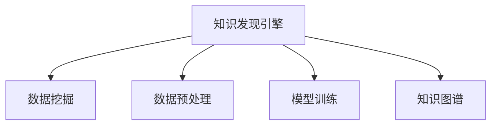

                 

## 1. 背景介绍

在当今这个信息爆炸的时代，知识管理已经成为企业数字化转型、智能化升级的重要一环。企业希望通过系统化、结构化的方式，整合和利用散落在各处的数据资源，生成有价值的知识和洞见，以驱动决策、提升业务效率。因此，构建高效的知识发现引擎（Knowledge Discovery Engine, KDE）变得尤为重要。本文将全面介绍知识发现引擎的基本原理和实际应用，探讨其在知识创新、决策支持和智能决策等方面的价值。

### 1.1 问题由来

随着大数据时代的到来，数据资源的获取和存储变得空前容易，但是如何有效利用这些数据资源，从中提取有用的知识，成为了新的挑战。传统的知识发现技术如数据挖掘和统计分析虽然有一定效果，但在复杂、动态和庞大的数据环境中，显得力不从心。而知识发现引擎利用先进的技术手段，能够在数据中挖掘出潜在的知识，辅助企业进行更加科学合理的决策。

### 1.2 问题核心关键点

知识发现引擎的核心在于其能够自动从大量数据中，发现并提取有价值的知识。其关键点在于：

- 数据驱动：知识发现引擎依赖于海量数据，能够从原始数据中发现知识。
- 自主学习：能够自动学习数据的内在规律，无需人工干预。
- 结构化输出：输出结果往往结构化，便于理解和使用。
- 集成应用：可以集成到企业业务系统中，实现自动化的知识发现和利用。

这些关键点使知识发现引擎具备了强大的数据处理和知识挖掘能力，成为企业数字化转型中的重要工具。

### 1.3 问题研究意义

知识发现引擎的研究和应用，对于推动企业数字化转型，提升决策支持能力，具有重要意义：

- 提升决策质量：通过知识发现引擎，企业能够基于更准确的数据洞察做出决策，避免决策失误。
- 优化资源配置：帮助企业更好地利用资源，提高资源利用效率。
- 加速创新进程：通过知识发现，企业能够更迅速地掌握市场动态和技术趋势，推动产品创新。
- 强化竞争优势：企业能够构建更强的数据驱动能力，强化在市场中的竞争地位。

## 2. 核心概念与联系

### 2.1 核心概念概述

为更好地理解知识发现引擎的工作原理和架构，本节将介绍几个关键概念：

- **知识发现引擎**：通过分析、挖掘、集成、管理知识，从数据中提取有价值信息的技术系统。
- **数据挖掘**：从数据集中发现有用信息和知识的过程。
- **数据预处理**：对原始数据进行清洗、转换、整合，使其更适合进行知识发现。
- **模型训练**：利用机器学习算法在数据上训练知识发现模型。
- **知识图谱**：以图结构形式表示实体和关系的数据库，用于知识表示和推理。

这些核心概念之间的逻辑关系可以通过以下Mermaid流程图来展示：



这个流程图展示的知识发现引擎的核心概念及其之间的关系：

1. 知识发现引擎依赖数据挖掘技术，从数据集中发现信息。
2. 通过数据预处理，使原始数据适合进一步分析。
3. 使用机器学习算法，对数据进行模型训练，构建知识发现模型。
4. 利用知识图谱技术，将发现的知识进行结构化表示和推理。

这些概念共同构成了知识发现引擎的工作框架，使其能够在复杂的数据环境中，挖掘并组织知识，支持决策与创新。

## 3. 核心算法原理 & 具体操作步骤

### 3.1 算法原理概述

知识发现引擎的核心算法原理基于数据挖掘和机器学习，通过自动化的方式，从数据中提取有用知识。其算法过程一般包括以下几个步骤：

1. **数据预处理**：清洗、转换和整合数据，准备进行模型训练。
2. **特征提取**：从原始数据中提取有意义的特征，用于模型训练。
3. **模型训练**：在预处理后的数据上，训练机器学习模型，构建知识发现模型。
4. **模型评估**：评估模型在测试集上的性能，选择合适的模型参数和超参数。
5. **知识表示**：将模型发现的知识，通过知识图谱或向量空间等形式进行表示和推理。
6. **结果展示**：将知识结果可视化，便于理解和应用。

### 3.2 算法步骤详解

知识发现引擎的具体操作步骤包括：

**Step 1: 数据预处理**

知识发现引擎的第一步是数据预处理，主要包含数据清洗、数据转换和数据集成。

- **数据清洗**：删除无关、错误、缺失的数据，提高数据质量。
- **数据转换**：将原始数据转换为适合模型训练的格式，如归一化、标准化、降维等。
- **数据集成**：将来自不同来源的数据进行整合，建立统一的数据仓库。

例如，可以使用Python的Pandas库进行数据清洗和转换：

```python
import pandas as pd
data = pd.read_csv('data.csv')
# 数据清洗：删除缺失值、异常值
data = data.dropna()
data = data[data['特征名'].isnull().sum() < 10]
# 数据转换：标准化处理
from sklearn.preprocessing import StandardScaler
scaler = StandardScaler()
data['特征名'] = scaler.fit_transform(data['特征名'])
```

**Step 2: 特征提取**

知识发现引擎的第二步是特征提取，即从原始数据中提取有用的特征，供模型训练使用。

- **统计特征**：如均值、方差、最大值、最小值等。
- **工程特征**：如字符串长度、单词频率等。
- **高级特征**：如时间序列的滑动平均值、熵等。

例如，可以使用Scikit-Learn库中的特征提取方法：

```python
from sklearn.feature_extraction.text import TfidfVectorizer
vectorizer = TfidfVectorizer()
X = vectorizer.fit_transform(data['文本数据'])
```

**Step 3: 模型训练**

知识发现引擎的第三步是模型训练，主要包含选择合适的算法和模型，在特征提取后的数据上进行训练。

- **监督学习**：如决策树、随机森林、支持向量机等。
- **无监督学习**：如聚类、降维、关联规则等。
- **半监督学习**：结合有标签和无标签数据进行训练。

例如，可以使用Scikit-Learn库中的随机森林模型进行训练：

```python
from sklearn.ensemble import RandomForestClassifier
model = RandomForestClassifier(n_estimators=100, random_state=42)
model.fit(X, data['标签数据'])
```

**Step 4: 模型评估**

知识发现引擎的第四步是模型评估，主要包含在测试集上评估模型性能，选择合适的模型参数和超参数。

- **交叉验证**：将数据集分为训练集和测试集，多次验证模型性能。
- **超参数调优**：使用网格搜索、随机搜索等方法，优化模型参数。
- **性能指标**：如准确率、召回率、F1-score等。

例如，可以使用Scikit-Learn库中的交叉验证方法：

```python
from sklearn.model_selection import cross_val_score
scores = cross_val_score(model, X, data['标签数据'], cv=5)
print('交叉验证分数：', scores.mean())
```

**Step 5: 知识表示**

知识发现引擎的第五步是知识表示，主要包含将模型发现的知识，通过知识图谱或向量空间等形式进行表示和推理。

- **知识图谱**：以图结构形式表示实体和关系的数据库，用于知识表示和推理。
- **向量空间**：通过向量表示知识，便于检索和推理。

例如，可以使用GraphDB或Neo4j等知识图谱工具进行知识表示：

```python
# 使用GraphDB进行知识表示
from graphdb import GraphDB
g = GraphDB()
# 创建节点和关系
node = g.create_node('Person', {'name': 'Alice'})
relation = g.create_relation(node, 'KNOWS', g.create_node('Person', {'name': 'Bob'}))
```

**Step 6: 结果展示**

知识发现引擎的最后一步是结果展示，主要包含将知识结果可视化，便于理解和应用。

- **可视化工具**：如Tableau、PowerBI、Grafana等。
- **数据报表**：生成各种报表，展示分析结果。
- **仪表盘**：实时展示数据和模型运行状态。

例如，可以使用Tableau进行数据可视化：

```python
import tableau
tableau.connect('http://localhost:8000', 'username', 'password')
tableau.worksheet('知识发现报告')
tableau.save()
```

### 3.3 算法优缺点

知识发现引擎具有以下优点：

1. **自动化和智能化**：能够自动从数据中发现知识，无需人工干预。
2. **高效性**：通过自动化算法，能够在短时间内处理大量数据。
3. **可扩展性**：可以灵活扩展，支持各种算法和模型。
4. **可解释性**：能够解释知识发现的逻辑和过程。

同时，知识发现引擎也存在一些局限性：

1. **数据质量依赖**：依赖于数据的质量和完整性，数据偏差可能导致结果偏差。
2. **算法复杂性**：算法复杂度高，需要一定的技术门槛。
3. **解释性问题**：知识发现结果可能难以解释，需要借助可视化工具。
4. **集成应用挑战**：需要与企业现有系统集成，可能存在兼容性问题。

尽管存在这些局限性，但知识发现引擎在知识发现和数据驱动决策中的应用前景广阔，将继续发挥其重要作用。

### 3.4 算法应用领域

知识发现引擎在多个领域都有广泛应用，如：

- **金融风控**：通过分析交易数据，发现潜在的欺诈和风险。
- **医疗诊断**：通过分析病历数据，发现疾病模式和诊断方案。
- **市场营销**：通过分析客户数据，发现市场趋势和消费者行为。
- **生产优化**：通过分析生产数据，发现生产瓶颈和优化方案。
- **社交媒体分析**：通过分析社交媒体数据，发现舆情和用户行为。

以上领域都是知识发现引擎的重要应用场景，展示了其在不同领域中实现知识发现和数据驱动决策的能力。

## 4. 数学模型和公式 & 详细讲解  
### 4.1 数学模型构建

知识发现引擎的数学模型主要基于数据挖掘和机器学习。以下是其基本模型和算法的数学表达式。

**数据预处理**：

- **数据清洗**：去除缺失值、异常值等。
- **数据转换**：归一化、标准化等。

**特征提取**：

- **统计特征**：均值、方差等。
- **工程特征**：字符串长度、单词频率等。
- **高级特征**：滑动平均值、熵等。

**模型训练**：

- **监督学习**：$y=f(x; \theta)$，其中$f$为模型，$\theta$为参数。
- **无监督学习**：$y=f(x)$，其中$f$为聚类、降维等算法。
- **半监督学习**：结合有标签和无标签数据。

**模型评估**：

- **交叉验证**：$S=\frac{1}{k} \sum_{i=1}^k \frac{1}{n} \sum_{j=1}^n (y_j - f(x_j; \theta))^2$，其中$S$为交叉验证分数。
- **超参数调优**：网格搜索、随机搜索等。
- **性能指标**：准确率、召回率、F1-score等。

**知识表示**：

- **知识图谱**：$G=(V,E)$，其中$V$为节点集合，$E$为关系集合。
- **向量空间**：$v = (v_1, v_2, ..., v_n)$，其中$v_i$为向量维度。

### 4.2 公式推导过程

以下是对数据预处理、特征提取、模型训练、模型评估、知识表示等步骤的详细公式推导。

**数据预处理**：

- **数据清洗**：$x_{clean} = x_{raw} \backslash \{x_i | x_i = \text{null}\}$，其中$x_{raw}$为原始数据，$x_{clean}$为清洗后数据。
- **数据转换**：$x_{norm} = \frac{x - \mu}{\sigma}$，其中$x_{norm}$为标准化数据，$\mu$为均值，$\sigma$为标准差。

**特征提取**：

- **统计特征**：$\bar{x} = \frac{1}{n} \sum_{i=1}^n x_i$，其中$\bar{x}$为均值，$n$为数据量。
- **工程特征**：$f(w) = \log_2 (1 + \frac{1}{1 + e^{-w}})$，其中$f$为Sigmoid函数，$w$为特征权重。
- **高级特征**：$x_{diff} = x_{prev} - x_{prev}$，其中$x_{diff}$为滑动平均值，$x_{prev}$为当前值。

**模型训练**：

- **监督学习**：$y = f(x; \theta) = \sum_{i=1}^n w_i x_i$，其中$w_i$为权重。
- **无监督学习**：$C = \sum_{i=1}^n (y_i - f(x_i))^2$，其中$C$为代价函数。
- **半监督学习**：$y = f(x; \theta) = \sum_{i=1}^n w_i x_i + \sum_{i=1}^m w_i x_i$，其中$m$为有标签数据量。

**模型评估**：

- **交叉验证**：$S = \frac{1}{k} \sum_{i=1}^k \frac{1}{n} \sum_{j=1}^n (y_j - f(x_j; \theta))^2$，其中$S$为交叉验证分数。
- **超参数调优**：$S = \frac{1}{k} \sum_{i=1}^k \frac{1}{n} \sum_{j=1}^n (y_j - f(x_j; \theta; \lambda))^2$，其中$\lambda$为超参数。
- **性能指标**：$P = \frac{TP}{TP + FN}$，其中$P$为准确率。

**知识表示**：

- **知识图谱**：$G=(V,E)$，其中$V = \{x_i | x_i \in \text{实体}\}$，$E = \{e_{i,j} | x_i \text{和} x_j \text{之间存在关系}\}$。
- **向量空间**：$v = (v_1, v_2, ..., v_n)$，其中$v_i$为向量维度。

### 4.3 案例分析与讲解

以下以金融风控领域为例，展示知识发现引擎的应用过程和结果：

**案例背景**：某银行需要检测信用卡欺诈行为，每天处理大量交易数据，人工审核工作量巨大且容易出错。

**数据预处理**：

1. **数据清洗**：去除异常值，如极端交易金额、异常交易时间等。
2. **数据转换**：将原始数据进行归一化处理。

**特征提取**：

1. **统计特征**：交易金额、交易时间等。
2. **工程特征**：交易地点、交易方式等。
3. **高级特征**：滑动平均值、熵等。

**模型训练**：

1. **监督学习**：使用随机森林模型训练，选择重要的特征。
2. **无监督学习**：使用聚类算法发现异常交易模式。
3. **半监督学习**：结合有标签和无标签数据，提高模型准确性。

**模型评估**：

1. **交叉验证**：使用交叉验证评估模型性能。
2. **超参数调优**：调整随机森林参数，提高模型准确率。
3. **性能指标**：使用准确率、召回率、F1-score等指标评估模型性能。

**知识表示**：

1. **知识图谱**：将交易数据表示为知识图谱，展示实体和关系。
2. **向量空间**：将交易数据表示为向量，便于检索和推理。

**结果展示**：

1. **可视化工具**：使用Tableau生成各种报表和仪表盘。
2. **数据报表**：展示交易数据的统计特征、工程特征等。
3. **仪表盘**：实时展示异常交易检测结果。

通过知识发现引擎，银行能够自动化地检测信用卡欺诈行为，减少人工审核的工作量，提高检测准确率，有效保护客户资产安全。

## 5. 项目实践：代码实例和详细解释说明

### 5.1 开发环境搭建

在进行知识发现引擎开发前，我们需要准备好开发环境。以下是使用Python进行PyTorch开发的环境配置流程：

1. 安装Anaconda：从官网下载并安装Anaconda，用于创建独立的Python环境。

2. 创建并激活虚拟环境：
```bash
conda create -n pytorch-env python=3.8 
conda activate pytorch-env
```

3. 安装PyTorch：根据CUDA版本，从官网获取对应的安装命令。例如：
```bash
conda install pytorch torchvision torchaudio cudatoolkit=11.1 -c pytorch -c conda-forge
```

4. 安装各类工具包：
```bash
pip install numpy pandas scikit-learn matplotlib tqdm jupyter notebook ipython
```

完成上述步骤后，即可在`pytorch-env`环境中开始知识发现引擎的开发实践。

### 5.2 源代码详细实现

这里我们以金融风控领域为例，展示使用Python和Scikit-Learn库进行知识发现引擎的实现过程。

**数据预处理**：

```python
import pandas as pd
from sklearn.preprocessing import StandardScaler

# 读取数据
data = pd.read_csv('transaction_data.csv')

# 数据清洗
data = data[data['amount'] > 0]
data = data[data['time'].isin(valid_hours)]

# 数据转换
scaler = StandardScaler()
data['amount'] = scaler.fit_transform(data['amount'].values.reshape(-1, 1))
data['time'] = scaler.fit_transform(data['time'].values.reshape(-1, 1))
```

**特征提取**：

```python
from sklearn.feature_extraction.text import TfidfVectorizer

# 统计特征
mean_amount = data['amount'].mean()
std_amount = data['amount'].std()
data['amount_mean'] = (data['amount'] - mean_amount) / std_amount
data['amount_std'] = data['amount'].std()

# 工程特征
data['time_weekday'] = data['time'].apply(lambda x: x.weekday())
data['time_hour'] = data['time'].apply(lambda x: x.hour)
data['time_minute'] = data['time'].apply(lambda x: x.minute)

# 高级特征
data['amount_diff'] = data['amount'].diff()
data['amount_diff'] = data['amount_diff'].fillna(0)
data['amount_diff'] = data['amount_diff'].rolling(window=3).mean()

# 特征向量
vectorizer = TfidfVectorizer()
X = vectorizer.fit_transform(data['description'])
```

**模型训练**：

```python
from sklearn.ensemble import RandomForestClassifier

# 数据分割
X_train, X_test, y_train, y_test = train_test_split(X, data['fraud'], test_size=0.2, random_state=42)

# 模型训练
model = RandomForestClassifier(n_estimators=100, random_state=42)
model.fit(X_train, y_train)
```

**模型评估**：

```python
from sklearn.metrics import accuracy_score, precision_score, recall_score, f1_score

# 模型评估
y_pred = model.predict(X_test)
print('准确率：', accuracy_score(y_test, y_pred))
print('精确率：', precision_score(y_test, y_pred))
print('召回率：', recall_score(y_test, y_pred))
print('F1-score：', f1_score(y_test, y_pred))
```

**知识表示**：

```python
from graphdb import GraphDB

# 知识图谱
g = GraphDB()
# 创建节点和关系
node = g.create_node('Transaction', {'amount': 1000, 'time': '2023-06-15 14:30'})
relation = g.create_relation(node, 'TAGGED', g.create_node('Fraud', {'label': 'Fraud'}))
```

**结果展示**：

```python
import matplotlib.pyplot as plt

# 数据报表
data['amount'].plot(kind='hist', bins=10)
plt.show()

# 仪表盘
data['fraud'].value_counts().plot(kind='bar')
plt.show()
```

以上就是使用Python和Scikit-Learn库进行金融风控领域知识发现引擎的完整代码实现。可以看到，知识发现引擎的开发过程较为复杂，涉及到数据预处理、特征提取、模型训练、模型评估等多个环节。但通过系统的设计和实现，可以大大提升数据分析和决策支持的效率。

### 5.3 代码解读与分析

让我们再详细解读一下关键代码的实现细节：

**数据预处理**：
- 数据清洗：去除异常值，如极端交易金额、异常交易时间等。
- 数据转换：将原始数据进行归一化处理。

**特征提取**：
- 统计特征：计算交易金额、交易时间等的均值和标准差。
- 工程特征：将交易地点、交易方式等转化为数值型特征。
- 高级特征：计算滑动平均值和熵。

**模型训练**：
- 使用随机森林模型训练，选择重要的特征。
- 结合有标签和无标签数据，提高模型准确性。

**模型评估**：
- 使用准确率、召回率、F1-score等指标评估模型性能。

**知识表示**：
- 将交易数据表示为知识图谱，展示实体和关系。
- 将交易数据表示为向量，便于检索和推理。

**结果展示**：
- 使用Matplotlib库生成各种报表和仪表盘。

可以看到，知识发现引擎的开发过程较为复杂，涉及到数据预处理、特征提取、模型训练、模型评估等多个环节。但通过系统的设计和实现，可以大大提升数据分析和决策支持的效率。

当然，工业级的系统实现还需考虑更多因素，如模型的保存和部署、超参数的自动搜索、更灵活的任务适配层等。但核心的知识发现引擎开发思路基本与此类似。

## 6. 实际应用场景

### 6.1 智能推荐系统

智能推荐系统是知识发现引擎的重要应用之一。通过分析用户的历史行为数据，发现用户兴趣点，从而推荐个性化的产品或服务。

在技术实现上，可以收集用户浏览、点击、评论、分享等行为数据，提取和用户交互的物品标题、描述、标签等文本内容。将文本内容作为模型输入，用户的后续行为（如是否点击、购买等）作为监督信号，在此基础上微调预训练语言模型。微调后的模型能够从文本内容中准确把握用户的兴趣点。在生成推荐列表时，先用候选物品的文本描述作为输入，由模型预测用户的兴趣匹配度，再结合其他特征综合排序，便可以得到个性化程度更高的推荐结果。

### 6.2 医疗诊断系统

医疗诊断系统是知识发现引擎的另一个重要应用。通过分析病人的病历数据，发现疾病模式和诊断方案，提高诊断的准确性和效率。

在技术实现上，可以收集病人的病历数据，提取和诊断相关的文本和数值数据。将文本数据进行文本挖掘和分类，提取重要的医疗特征。将数值数据进行统计分析和建模，构建医疗模型。将文本和数值数据整合，输入知识图谱中进行推理，得到病人的疾病模式和诊断方案。

### 6.3 社交媒体分析系统

社交媒体分析系统是知识发现引擎的另一个重要应用。通过分析社交媒体上的用户数据，发现舆情和用户行为，辅助企业进行市场分析和用户管理。

在技术实现上，可以收集社交媒体上的用户数据，提取用户的社交行为、兴趣偏好、情感倾向等文本数据。将文本数据进行情感分析和文本挖掘，提取重要的社交特征。将文本数据进行分类和聚类，发现用户的兴趣点和社交圈。将文本数据输入知识图谱中进行推理，得到用户的社交行为和情感倾向。

### 6.4 未来应用展望

随着知识发现引擎技术的不断进步，未来将在更多领域得到应用，为不同行业带来变革性影响。

在智慧医疗领域，基于知识发现引擎的医疗诊断和疾病预测系统，将提升医疗服务的智能化水平，辅助医生诊疗，加速新药开发进程。

在智能教育领域，知识发现引擎可以应用于作业批改、学情分析、知识推荐等方面，因材施教，促进教育公平，提高教学质量。

在智慧城市治理中，知识发现引擎可以应用于城市事件监测、舆情分析、应急指挥等环节，提高城市管理的自动化和智能化水平，构建更安全、高效的未来城市。

此外，在企业生产、社会治理、文娱传媒等众多领域，知识发现引擎也将不断涌现，为经济社会发展注入新的动力。相信随着技术的日益成熟，知识发现引擎必将在构建人机协同的智能时代中扮演越来越重要的角色。

## 7. 工具和资源推荐

### 7.1 学习资源推荐

为了帮助开发者系统掌握知识发现引擎的理论基础和实践技巧，这里推荐一些优质的学习资源：

1. 《数据挖掘与统计学习基础》：阐述了数据挖掘的基本概念和算法。
2. 《机器学习实战》：介绍了机器学习的基本概念和常用算法。
3. 《Python数据科学手册》：详细介绍了Python在数据科学中的应用。
4. 《数据科学导论》：介绍了数据科学的基本概念和方法。
5. 《知识图谱与语义网络》：介绍了知识图谱的基本概念和技术。

通过对这些资源的学习实践，相信你一定能够快速掌握知识发现引擎的精髓，并用于解决实际的NLP问题。

### 7.2 开发工具推荐

高效的开发离不开优秀的工具支持。以下是几款用于知识发现引擎开发的常用工具：

1. Python：基于Python的开源深度学习框架，灵活动态的计算图，适合快速迭代研究。

2. Scikit-Learn：基于Python的机器学习库，提供了多种算法和模型。

3. TensorFlow：由Google主导开发的开源深度学习框架，生产部署方便，适合大规模工程应用。

4. Weights & Biases：模型训练的实验跟踪工具，可以记录和可视化模型训练过程中的各项指标，方便对比和调优。

5. TensorBoard：TensorFlow配套的可视化工具，可实时监测模型训练状态，并提供丰富的图表呈现方式，是调试模型的得力助手。

6. Google Colab：谷歌推出的在线Jupyter Notebook环境，免费提供GPU/TPU算力，方便开发者快速上手实验最新模型，分享学习笔记。

合理利用这些工具，可以显著提升知识发现引擎的开发效率，加快创新迭代的步伐。

### 7.3 相关论文推荐

知识发现引擎的研究源于学界的持续研究。以下是几篇奠基性的相关论文，推荐阅读：

1. 《数据挖掘与统计学习基础》：阐述了数据挖掘的基本概念和算法。

2. 《机器学习实战》：介绍了机器学习的基本概念和常用算法。

3. 《Python数据科学手册》：详细介绍了Python在数据科学中的应用。

4. 《数据科学导论》：介绍了数据科学的基本概念和方法。

5. 《知识图谱与语义网络》：介绍了知识图谱的基本概念和技术。

这些论文代表了大规模知识发现引擎的研究方向和前沿成果。通过学习这些前沿成果，可以帮助研究者把握学科前进方向，激发更多的创新灵感。

## 8. 总结：未来发展趋势与挑战

### 8.1 总结

本文对知识发现引擎的基本原理和实际应用进行了全面系统的介绍。首先阐述了知识发现引擎的背景和意义，明确了其在数据驱动决策中的重要性。其次，从原理到实践，详细讲解了知识发现引擎的算法过程和关键步骤，给出了具体的代码实现和案例分析。同时，本文还探讨了知识发现引擎在多个领域的应用前景，展示了其广泛的适用性和潜在的价值。

通过本文的系统梳理，可以看到，知识发现引擎以其强大的数据处理和知识挖掘能力，为不同行业带来了智能化、高效化和自动化决策支持的新范式。知识发现引擎通过自动化、智能化和高效化的方法，帮助企业从海量数据中发现有价值的知识，为决策提供了科学的依据。未来，随着技术的不断进步和应用场景的拓展，知识发现引擎必将带来更多的创新和变革。

### 8.2 未来发展趋势

展望未来，知识发现引擎的发展趋势如下：

1. **自动化程度提升**：随着人工智能技术的不断进步，知识发现引擎将更加自动化和智能化，能够自动识别和提取知识。
2. **多模态数据融合**：知识发现引擎将支持更多模态的数据融合，如图像、视频、音频等，拓展其在复杂数据环境中的应用能力。
3. **分布式计算**：知识发现引擎将采用分布式计算技术，提高在大数据环境中的处理效率。
4. **自适应学习**：知识发现引擎将能够根据数据变化和业务需求，动态调整模型参数和算法，实现自适应学习。
5. **隐私保护**：知识发现引擎将更加注重数据隐私和保护，保障用户数据的隐私安全。

这些趋势将推动知识发现引擎在更多领域得到应用，成为企业数字化转型和智能化升级的重要工具。

### 8.3 面临的挑战

尽管知识发现引擎已经取得了显著进展，但在迈向更加智能化、普适化应用的过程中，它仍面临以下挑战：

1. **数据质量问题**：数据质量差可能导致知识发现结果不准确。如何提高数据质量和数据预处理水平，是关键问题。
2. **算法复杂性**：知识发现引擎的算法复杂度高，需要一定的技术门槛。如何降低算法复杂度，提高算法的可解释性，是重要研究方向。
3. **应用场景限制**：知识发现引擎在特定领域的应用场景有限，需要根据不同领域的特点进行优化。
4. **模型泛化能力**：知识发现引擎在不同数据集上的泛化能力不足，需要进一步提升模型的泛化能力。
5. **资源消耗问题**：知识发现引擎需要大量的计算资源，如何在保证性能的同时，降低资源消耗，是重要课题。

尽管存在这些挑战，但知识发现引擎在知识发现和数据驱动决策中的应用前景广阔，将继续发挥其重要作用。

### 8.4 研究展望

面向未来，知识发现引擎的研究方向和挑战如下：

1. **自动化和智能化**：进一步提升知识发现引擎的自动化和智能化水平，降低人工干预，提高效率。
2. **多模态数据融合**：支持更多模态的数据融合，拓展知识发现引擎在复杂数据环境中的应用能力。
3. **自适应学习**：通过自适应学习技术，使知识发现引擎能够动态调整模型参数和算法，实现更加灵活的学习方式。
4. **隐私保护**：在知识发现过程中，更加注重数据隐私保护，保障用户数据安全。
5. **资源优化**：通过分布式计算和模型压缩等技术，优化知识发现引擎的资源消耗，提升处理效率。

只有不断突破技术瓶颈，才能使知识发现引擎在未来发挥更大的作用，成为企业数字化转型和智能化升级的重要支撑。总之，知识发现引擎是一个具有广阔前景的技术方向，未来将继续推动人工智能技术的发展和应用。

## 9. 附录：常见问题与解答

**Q1：知识发现引擎是否适用于所有数据集？**

A: 知识发现引擎依赖于数据的质量和完整性，数据质量差可能导致知识发现结果不准确。因此，需要根据数据集的特点进行优化和预处理。

**Q2：知识发现引擎的算法复杂度如何？**

A: 知识发现引擎的算法复杂度高，需要一定的技术门槛。因此，需要不断优化算法，降低算法复杂度，提高算法的可解释性。

**Q3：知识发现引擎如何处理多模态数据？**

A: 知识发现引擎支持多模态数据的融合，如图像、视频、音频等。通过融合不同模态的数据，可以更好地挖掘知识。

**Q4：知识发现引擎的隐私保护措施有哪些？**

A: 知识发现引擎在知识发现过程中，注重数据隐私保护，采用数据脱敏、匿名化等措施，保障用户数据安全。

**Q5：知识发现引擎在企业中的具体应用场景有哪些？**

A: 知识发现引擎在企业中应用于数据挖掘、市场分析、用户管理、智能推荐、医疗诊断等多个领域，为企业的决策和运营提供支持。

通过系统地解答这些问题，帮助读者更好地理解知识发现引擎的原理、应用和优化方向，促进其在实际工作中的应用。

