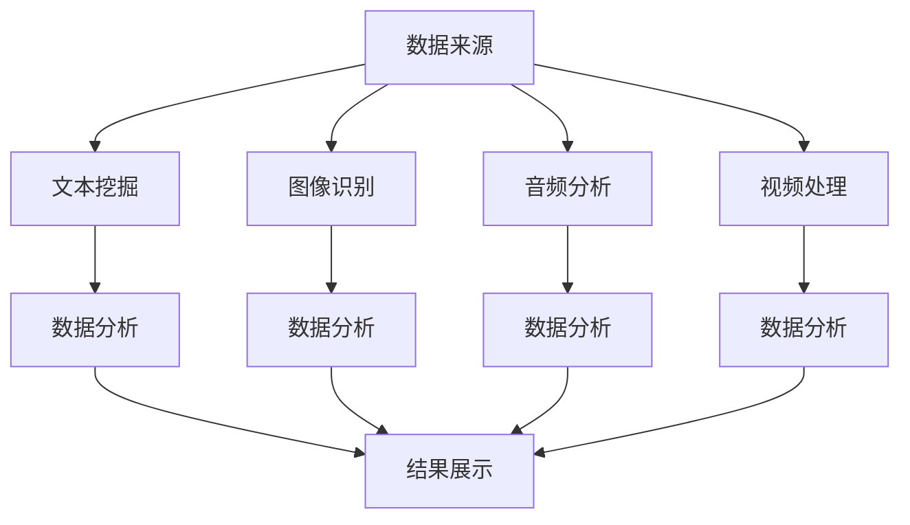

                 

# 知识发现引擎：推动创意产业的转型升级

在数字化时代，创意产业面临着前所未有的机遇与挑战。如何从海量数据中挖掘出潜在的创意和价值，成为推动产业升级的关键。本文将深入探讨知识发现引擎在创意产业中的重要应用，包括其核心概念、算法原理、具体操作步骤、实际应用场景，以及未来的发展趋势与挑战。希望通过本文，为从事创意产业的开发者、研究者和管理者提供有价值的参考和启示。

## 1. 背景介绍

### 1.1 问题由来

随着互联网的普及和数字化技术的发展，创意产业（包括广告、影视、音乐、游戏、出版等行业）产生了海量数据。如何从这些数据中发现创意灵感、挖掘潜在价值，成为创意产业面临的重要课题。传统的数据分析方法往往依赖人工经验，耗时耗力且效果有限。而知识发现引擎（Knowledge Discovery Engine, KDE）通过自动化的算法和模型，能够高效地从数据中挖掘出有价值的知识，帮助创意产业更好地理解用户需求、发现创意灵感、提升产品质量和优化市场策略。

### 1.2 问题核心关键点

知识发现引擎的核心在于自动化地从大数据中提取有用信息。其关键点包括：

- 数据来源：创意产业中的文本、图像、音频、视频等各类数据。
- 数据分析：包括文本挖掘、图像识别、音频分析、视频处理等技术。
- 结果展示：将发现的创意和知识可视化展示，便于用户理解和利用。
- 应用场景：广告创意、影视制作、音乐创作、游戏设计、出版物策划等。

本文将重点探讨知识发现引擎的核心算法原理与具体操作步骤，并结合实际应用场景展示其在创意产业中的应用效果。

## 2. 核心概念与联系

### 2.1 核心概念概述

为更好地理解知识发现引擎的工作原理，本节将介绍几个关键概念：

- **知识发现（Knowledge Discovery, KD）**：从数据中提取有用信息的过程。知识发现引擎通过自动化的数据分析方法，从大量数据中发现潜在的知识、模式和关系。
- **文本挖掘（Text Mining）**：从文本数据中提取有用信息的过程。文本挖掘包括文本分类、情感分析、主题建模等技术。
- **图像识别（Image Recognition）**：从图像数据中识别有用信息的过程。图像识别包括目标检测、图像分类、图像分割等技术。
- **音频分析（Audio Analysis）**：从音频数据中提取有用信息的过程。音频分析包括音乐分类、情感分析、语音识别等技术。
- **视频处理（Video Processing）**：从视频数据中提取有用信息的过程。视频处理包括视频分类、对象跟踪、行为分析等技术。
- **机器学习（Machine Learning）**：通过训练模型，使计算机具备从数据中学习有用信息的能力。知识发现引擎常使用机器学习算法，如监督学习、无监督学习、强化学习等。

这些概念之间的逻辑关系可以通过以下Mermaid流程图来展示：



这个流程图展示了几类数据来源及其在知识发现引擎中的应用路径：

1. 从文本、图像、音频、视频等数据来源，分别进行文本挖掘、图像识别、音频分析、视频处理等数据分析。
2. 数据分析后得到的有用信息，通过结果展示模块，以可视化或报告的形式呈现。

## 3. 核心算法原理 & 具体操作步骤
### 3.1 算法原理概述

知识发现引擎的核心算法主要包括文本挖掘、图像识别、音频分析、视频处理等技术。以文本挖掘为例，其算法原理为：

1. **文本预处理**：包括分词、去除停用词、词性标注、命名实体识别等步骤，为后续分析做准备。
2. **特征提取**：通过TF-IDF、word2vec、BERT等技术，将文本转化为可供模型处理的向量。
3. **文本分类**：使用朴素贝叶斯、支持向量机、神经网络等算法，对文本进行分类。
4. **情感分析**：通过情感词典、情感分类器等方法，判断文本的情感倾向。
5. **主题建模**：使用LDA、LSI等技术，发现文本中的主题和关键词。

这些算法共同构成了知识发现引擎的主要技术框架，能够高效地从文本数据中提取有用信息。

### 3.2 算法步骤详解

以文本挖掘为例，知识发现引擎的算法步骤包括：

1. **数据准备**：收集并预处理文本数据，去除噪声和冗余信息。
2. **特征提取**：将文本转化为向量表示，常用的方法包括TF-IDF、word2vec、BERT等。
3. **模型训练**：使用机器学习算法，如朴素贝叶斯、SVM、神经网络等，对文本进行分类、情感分析或主题建模。
4. **结果验证**：通过交叉验证等方法，评估模型的性能，优化模型参数。
5. **结果展示**：将分析结果以可视化报告或交互式界面的形式呈现，便于用户理解和应用。

### 3.3 算法优缺点

知识发现引擎在创意产业中具有以下优点：

- **高效自动化**：自动化从数据中提取有用信息，大幅提升工作效率。
- **多样性支持**：支持文本、图像、音频、视频等多种数据类型，适应广泛的应用场景。
- **结果可视化**：将分析结果以直观的形式展示，便于用户理解和应用。

然而，知识发现引擎也存在一些局限性：

- **数据依赖**：需要大量的高质量标注数据，对数据获取和处理要求高。
- **模型复杂**：复杂的模型结构可能导致计算量大、资源消耗高。
- **结果解释**：机器学习模型的决策过程缺乏可解释性，难以理解其内部工作机制。
- **误判风险**：机器学习模型容易受到数据偏差的影响，可能导致误判或漏判。

### 3.4 算法应用领域

知识发现引擎在创意产业中广泛应用于以下几个领域：

1. **广告创意**：从广告文本中提取有用信息，帮助创意人员发现潜在的广告词和宣传点。
2. **影视制作**：从剧本、字幕中挖掘主题、情感等有用信息，辅助编剧和导演决策。
3. **音乐创作**：从歌词、MV中提取情感和主题，指导音乐创作方向。
4. **游戏设计**：从游戏评论、用户反馈中发现用户需求和改进点，优化游戏体验。
5. **出版物策划**：从图书评论、读者反馈中提取有用信息，指导出版物的选题和设计。

除了上述领域，知识发现引擎还被广泛应用于数据分析、市场分析、社会研究等多个领域，为创意产业的发展提供了强有力的技术支持。

## 4. 数学模型和公式 & 详细讲解  
### 4.1 数学模型构建

知识发现引擎的数学模型构建通常包括以下几个关键步骤：

1. **数据预处理**：包括去噪、归一化、分词等预处理步骤，将原始数据转化为可供模型处理的形式。
2. **特征提取**：使用TF-IDF、word2vec、BERT等技术，将文本转化为向量表示。
3. **模型训练**：使用机器学习算法，如朴素贝叶斯、支持向量机、神经网络等，对文本进行分类、情感分析或主题建模。

以文本分类为例，其数学模型构建如下：

假设文本集合为 $\{d_1, d_2, ..., d_n\}$，对应的类别标签为 $\{y_1, y_2, ..., y_n\}$。设 $\theta$ 为模型参数，$h(x)$ 为分类模型，$L$ 为损失函数，则文本分类的目标为：

$$
\theta^* = \mathop{\arg\min}_{\theta} \frac{1}{N} \sum_{i=1}^N L(h(x_i), y_i)
$$

其中 $L$ 为交叉熵损失函数，$h(x_i)$ 为模型对文本 $d_i$ 的分类预测，$y_i$ 为文本的真实类别标签。

### 4.2 公式推导过程

以下以文本分类为例，推导交叉熵损失函数及其梯度的计算公式。

假设模型 $h(x)$ 在输入 $x$ 上的输出为 $\hat{y} = h(x) \in [0,1]$，表示样本属于正类的概率。真实标签 $y \in \{0,1\}$。则二分类交叉熵损失函数定义为：

$$
L(h(x), y) = -[y\log \hat{y} + (1-y)\log(1-\hat{y})]
$$

将其代入经验风险公式，得：

$$
\mathcal{L}(\theta) = -\frac{1}{N}\sum_{i=1}^N [y_i\log h(x_i)+(1-y_i)\log(1-h(x_i))]
$$

根据链式法则，损失函数对参数 $\theta$ 的梯度为：

$$
\frac{\partial \mathcal{L}(\theta)}{\partial \theta} = -\frac{1}{N}\sum_{i=1}^N (\frac{y_i}{h(x_i)}-\frac{1-y_i}{1-h(x_i)}) \frac{\partial h(x_i)}{\partial \theta}
$$

其中 $\frac{\partial h(x_i)}{\partial \theta}$ 可进一步递归展开，利用自动微分技术完成计算。

### 4.3 案例分析与讲解

以情感分析为例，假设模型 $h(x)$ 在输入 $x$ 上的输出为 $\hat{y} = h(x) \in [-1,1]$，表示文本的情感极性。真实标签 $y \in [-1,1]$。则情感分析的损失函数为：

$$
L(h(x), y) = \frac{1}{2}(\hat{y}-y)^2
$$

其梯度计算如下：

$$
\frac{\partial \mathcal{L}(\theta)}{\partial \theta} = -\frac{1}{N}\sum_{i=1}^N (\hat{y_i}-y_i) \frac{\partial h(x_i)}{\partial \theta}
$$

通过上述公式，可以在文本分析中准确地计算出模型参数的梯度，并使用梯度下降等优化算法更新模型参数。

## 5. 项目实践：代码实例和详细解释说明
### 5.1 开发环境搭建

在进行文本挖掘项目实践前，我们需要准备好开发环境。以下是使用Python进行TensorFlow开发的环境配置流程：

1. 安装Anaconda：从官网下载并安装Anaconda，用于创建独立的Python环境。

2. 创建并激活虚拟环境：
```bash
conda create -n tf-env python=3.8 
conda activate tf-env
```

3. 安装TensorFlow：根据CUDA版本，从官网获取对应的安装命令。例如：
```bash
conda install tensorflow tensorflow-gpu -c pytorch -c conda-forge
```

4. 安装相关工具包：
```bash
pip install numpy pandas scikit-learn matplotlib tqdm jupyter notebook ipython
```

完成上述步骤后，即可在`tf-env`环境中开始文本挖掘实践。

### 5.2 源代码详细实现

下面我们以情感分析任务为例，给出使用TensorFlow进行文本分类的PyTorch代码实现。

首先，定义情感分析任务的数据处理函数：

```python
from tensorflow.keras.preprocessing.text import Tokenizer
from tensorflow.keras.preprocessing.sequence import pad_sequences
import tensorflow as tf

class SentimentAnalysisDataset(tf.keras.utils.Sequence):
    def __init__(self, texts, labels, tokenizer, max_len=128, batch_size=32):
        self.texts = texts
        self.labels = labels
        self.tokenizer = tokenizer
        self.max_len = max_len
        self.batch_size = batch_size
        
    def __len__(self):
        return len(self.texts) // self.batch_size
    
    def __getitem__(self, idx):
        start = idx * self.batch_size
        end = (idx + 1) * self.batch_size
        batch_texts = self.texts[start:end]
        batch_labels = self.labels[start:end]
        
        tokenized_texts = self.tokenizer.texts_to_sequences(batch_texts)
        padded_texts = pad_sequences(tokenized_texts, maxlen=self.max_len, padding='post', truncating='post')
        labels = tf.keras.utils.to_categorical(batch_labels, num_classes=2)
        
        return padded_texts, labels
```

然后，定义模型和优化器：

```python
from tensorflow.keras.models import Sequential
from tensorflow.keras.layers import Embedding, LSTM, Dense
from tensorflow.keras.callbacks import EarlyStopping

model = Sequential([
    Embedding(input_dim=10000, output_dim=128, input_length=max_len),
    LSTM(128, dropout=0.2, recurrent_dropout=0.2),
    Dense(1, activation='sigmoid')
])

optimizer = tf.keras.optimizers.Adam(learning_rate=0.001)
early_stopping = EarlyStopping(monitor='val_loss', patience=5, mode='min')
```

接着，定义训练和评估函数：

```python
def train_epoch(model, dataset, batch_size, optimizer, epochs=10):
    model.compile(optimizer=optimizer, loss='binary_crossentropy', metrics=['accuracy'])
    model.fit(dataset, batch_size=batch_size, epochs=epochs, validation_split=0.2, callbacks=[early_stopping])
    
def evaluate(model, dataset, batch_size):
    dataset = SentimentAnalysisDataset(dataset.texts, dataset.labels, tokenizer)
    loss, accuracy = model.evaluate(dataset, batch_size=batch_size, verbose=0)
    print(f"Accuracy: {accuracy*100:.2f}%")
```

最后，启动训练流程并在测试集上评估：

```python
epochs = 10
batch_size = 32

train_dataset = SentimentAnalysisDataset(train_texts, train_labels, tokenizer, max_len)
test_dataset = SentimentAnalysisDataset(test_texts, test_labels, tokenizer, max_len)

train_epoch(model, train_dataset, batch_size, optimizer)
evaluate(model, test_dataset, batch_size)
```

以上就是使用TensorFlow对文本进行情感分析的完整代码实现。可以看到，得益于TensorFlow的强大封装，我们可以用相对简洁的代码完成文本分类的任务。

### 5.3 代码解读与分析

让我们再详细解读一下关键代码的实现细节：

**SentimentAnalysisDataset类**：
- `__init__`方法：初始化文本、标签、分词器等关键组件。
- `__len__`方法：返回数据集的样本数量。
- `__getitem__`方法：对单个样本进行处理，将文本输入转化为token ids，并进行定长padding，最终返回模型所需的输入和标签。

**train_epoch函数**：
- 使用TensorFlow的`compile`方法，设置模型的损失函数和优化器。
- 使用`fit`方法对模型进行训练，设置训练轮数、批次大小和验证集比例。
- 使用`EarlyStopping`回调函数，在验证集损失不降低时提前终止训练。

**evaluate函数**：
- 使用`evaluate`方法在测试集上评估模型性能。
- 打印出模型的精度指标。

**训练流程**：
- 定义总的epoch数和批次大小，开始循环迭代。
- 每个epoch内，在训练集上训练，输出平均loss和准确率。
- 在测试集上评估模型，输出最终的精度指标。

可以看到，TensorFlow使得文本挖掘的代码实现变得简洁高效。开发者可以将更多精力放在数据处理、模型改进等高层逻辑上，而不必过多关注底层的实现细节。

当然，工业级的系统实现还需考虑更多因素，如模型的保存和部署、超参数的自动搜索、更灵活的任务适配层等。但核心的微调范式基本与此类似。

## 6. 实际应用场景
### 6.1 智能广告投放

智能广告投放是知识发现引擎在创意产业中广泛应用的一个典型场景。传统的广告投放依赖人工经验和历史数据，效果有限且效率低下。通过知识发现引擎，可以从海量数据中挖掘出用户的兴趣和行为特征，优化广告投放策略。

具体而言，可以收集用户的浏览记录、点击记录、互动记录等数据，使用文本挖掘、情感分析等技术，分析用户对各类广告的反应，找出最受欢迎的广告词和创意。然后将这些信息反馈给广告主，指导他们进行广告设计和投放。

### 6.2 影视剧制作

影视剧制作过程中，需要对剧本、导演说明、演员表演等文本数据进行情感分析、主题建模等处理，以便更好地理解和优化剧本。知识发现引擎可以在这一过程中发挥重要作用。

通过文本挖掘，可以从剧本中提取主题、情节、角色等有用信息，帮助编剧和导演更好地理解故事脉络和人物设定。通过情感分析，可以评估观众对不同剧情和角色的情感反应，指导剧情走向和角色塑造。

### 6.3 音乐创作

音乐创作需要大量的灵感来源和创意引导。知识发现引擎可以从歌词、MV、评论等文本数据中挖掘出情感、主题、风格等信息，为音乐创作提供丰富的灵感素材。

例如，通过文本挖掘，可以从歌词中提取关键词和主题，帮助作曲家找到创作方向。通过情感分析，可以评估听众对不同音乐风格的情感反应，指导音乐创作风格的选择。

### 6.4 游戏设计

游戏设计过程中，需要从玩家反馈、评论、评分等文本数据中挖掘出用户需求和改进点。知识发现引擎可以在这一过程中发挥重要作用。

通过文本挖掘，可以从玩家反馈中提取高频关键词和常见问题，帮助游戏开发者优化游戏体验。通过情感分析，可以评估玩家对游戏情节、角色、界面等方面的情感反应，指导游戏设计改进。

### 6.5 出版物策划

出版物策划需要大量的市场分析和用户调研数据。知识发现引擎可以从读者反馈、评论、社交媒体等文本数据中挖掘出用户需求和兴趣，为出版物选题和设计提供有力支持。

通过文本挖掘，可以从读者反馈中提取高频关键词和主题，帮助出版商确定出版方向。通过情感分析，可以评估读者对不同书籍风格的情感反应，指导书籍内容选择和设计。

## 7. 工具和资源推荐
### 7.1 学习资源推荐

为了帮助开发者系统掌握知识发现引擎的理论基础和实践技巧，这里推荐一些优质的学习资源：

1. **《Python数据分析实战》**：讲解如何使用Python进行数据预处理、特征提取、模型训练等，适合初学者入门。
2. **《深度学习》**：斯坦福大学Andrew Ng教授的机器学习课程，系统讲解了深度学习的基本原理和算法，适合深入学习。
3. **《自然语言处理基础》**：讲解文本挖掘、情感分析、主题建模等自然语言处理技术，适合进一步提升自然语言处理技能。
4. **Kaggle竞赛平台**：提供各类数据集和竞赛任务，通过实战锻炼数据处理和模型训练能力。
5. **Coursera平台**：提供各类机器学习和自然语言处理课程，涵盖从入门到进阶的各个层次。

通过对这些资源的学习实践，相信你一定能够快速掌握知识发现引擎的精髓，并用于解决实际的创意产业问题。
###  7.2 开发工具推荐

高效的开发离不开优秀的工具支持。以下是几款用于知识发现引擎开发的常用工具：

1. **TensorFlow**：基于Python的开源深度学习框架，灵活动态的计算图，适合快速迭代研究。
2. **PyTorch**：基于Python的开源深度学习框架，动态计算图，适合灵活的数据处理和模型训练。
3. **Transformers库**：HuggingFace开发的NLP工具库，集成了众多SOTA语言模型，支持PyTorch和TensorFlow，适合快速原型开发。
4. **Weights & Biases**：模型训练的实验跟踪工具，可以记录和可视化模型训练过程中的各项指标，方便对比和调优。
5. **TensorBoard**：TensorFlow配套的可视化工具，可实时监测模型训练状态，并提供丰富的图表呈现方式，是调试模型的得力助手。

合理利用这些工具，可以显著提升知识发现引擎的开发效率，加快创新迭代的步伐。

### 7.3 相关论文推荐

知识发现引擎的发展源于学界的持续研究。以下是几篇奠基性的相关论文，推荐阅读：

1. **《Text Mining: Techniques and Applications》**：详细讲解了文本挖掘的基本技术，包括文本分类、情感分析、主题建模等。
2. **《Machine Learning: A Probabilistic Perspective》**：讲解了机器学习的基本原理和算法，适合深入学习。
3. **《Knowledge Discovery in Databases: Data and Knowledge Fusion》**：探讨了知识发现的基本原理和应用，适合了解知识发现引擎的全貌。

这些论文代表了大语言模型微调技术的发展脉络。通过学习这些前沿成果，可以帮助研究者把握学科前进方向，激发更多的创新灵感。

## 8. 总结：未来发展趋势与挑战

### 8.1 总结

本文对知识发现引擎在创意产业中的重要应用进行了全面系统的介绍。首先阐述了知识发现引擎的核心概念及其在创意产业中的广泛应用，明确了其在广告创意、影视制作、音乐创作、游戏设计、出版物策划等领域的独特价值。其次，从原理到实践，详细讲解了知识发现引擎的算法原理和具体操作步骤，给出了知识发现引擎任务开发的完整代码实例。同时，本文还探讨了知识发现引擎在实际应用场景中的优化策略，展示了其在创意产业中的应用效果。

通过本文的系统梳理，可以看到，知识发现引擎作为创意产业中的重要技术工具，在广告创意、影视制作、音乐创作、游戏设计、出版物策划等众多领域发挥着重要作用。随着数据量和技术水平的不断提升，知识发现引擎必将在创意产业中发挥更大的作用，推动创意产业的数字化、智能化转型升级。

### 8.2 未来发展趋势

展望未来，知识发现引擎将在创意产业中呈现以下几个发展趋势：

1. **自动化程度提升**：随着算法和技术的不断进步，知识发现引擎的自动化程度将进一步提升，减少人工干预，提高效率。
2. **多模态融合**：未来的知识发现引擎将支持多种数据类型（如文本、图像、音频、视频等）的融合分析，拓展分析维度和深度。
3. **交互式界面**：知识发现引擎将开发更强大的交互式界面，便于用户直接操作和定制化分析，提升用户体验。
4. **云服务化**：未来的知识发现引擎将更多地采用云服务形式，提供按需使用、弹性扩展的服务，降低应用门槛。
5. **实时化分析**：通过引入流式数据处理技术，知识发现引擎将具备实时数据处理和分析能力，满足即时决策的需求。

以上趋势将使知识发现引擎在创意产业中发挥更大的作用，推动创意产业向数字化、智能化、实时化方向发展。

### 8.3 面临的挑战

尽管知识发现引擎在创意产业中已经取得了显著成效，但在迈向更加智能化、普适化应用的过程中，仍面临诸多挑战：

1. **数据质量问题**：创意产业中的数据往往质量参差不齐，包含大量噪音和冗余信息，如何清洗和预处理数据，是知识发现引擎的重大挑战。
2. **模型复杂性**：知识发现引擎需要处理多维度的数据，模型结构复杂，计算量大，如何优化模型，提高效率，是知识发现引擎的难点。
3. **结果解释性**：机器学习模型的决策过程缺乏可解释性，难以理解其内部工作机制，如何增强结果的可解释性，是知识发现引擎的挑战。
4. **隐私保护**：创意产业中的数据往往包含大量用户隐私信息，如何保护用户隐私，防止数据滥用，是知识发现引擎的重要课题。

### 8.4 研究展望

面对知识发现引擎面临的种种挑战，未来的研究需要在以下几个方面寻求新的突破：

1. **数据预处理技术**：开发更高效的数据清洗和预处理算法，提高数据质量，减少噪音和冗余信息。
2. **模型优化技术**：引入更高效的模型结构和算法，降低计算复杂度，提高模型效率。
3. **结果解释性技术**：引入更强的可解释性技术，增强模型的可解释性，帮助用户理解和应用分析结果。
4. **隐私保护技术**：开发更先进的隐私保护技术，保护用户隐私，防止数据滥用。

这些研究方向的探索，必将引领知识发现引擎技术迈向更高的台阶，为创意产业的发展提供更强的技术支持。

## 9. 附录：常见问题与解答

**Q1：知识发现引擎是否适用于所有创意产业的任务？**

A: 知识发现引擎在大多数创意产业的任务中都能取得不错的效果，特别是对于数据量较大的任务。但对于一些特定领域的任务，如音乐创作、影视制作等，依赖人类情感和艺术创造力的任务，知识发现引擎的适用性需要结合具体任务进行评估。

**Q2：知识发现引擎在实际应用中需要注意哪些问题？**

A: 在实际应用中，知识发现引擎需要注意以下几个问题：
1. 数据质量：需要确保输入数据的质量，进行必要的清洗和预处理。
2. 模型选择：根据具体任务选择合适的模型和算法，平衡模型复杂度和效果。
3. 结果解释：机器学习模型的决策过程缺乏可解释性，需要结合领域知识进行人工解释。
4. 隐私保护：处理创意产业中的数据时，需要注意用户隐私保护，防止数据滥用。

**Q3：知识发现引擎在创意产业中的未来发展方向是什么？**

A: 知识发现引擎在创意产业中的未来发展方向包括：
1. 自动化程度提升：提高自动化水平，减少人工干预。
2. 多模态融合：支持多类型数据的融合分析，拓展分析维度和深度。
3. 实时化分析：引入流式数据处理技术，实现实时数据处理和分析。
4. 云服务化：更多采用云服务形式，提供按需使用、弹性扩展的服务。

这些方向将使知识发现引擎在创意产业中发挥更大的作用，推动创意产业向数字化、智能化、实时化方向发展。

---

作者：禅与计算机程序设计艺术 / Zen and the Art of Computer Programming

