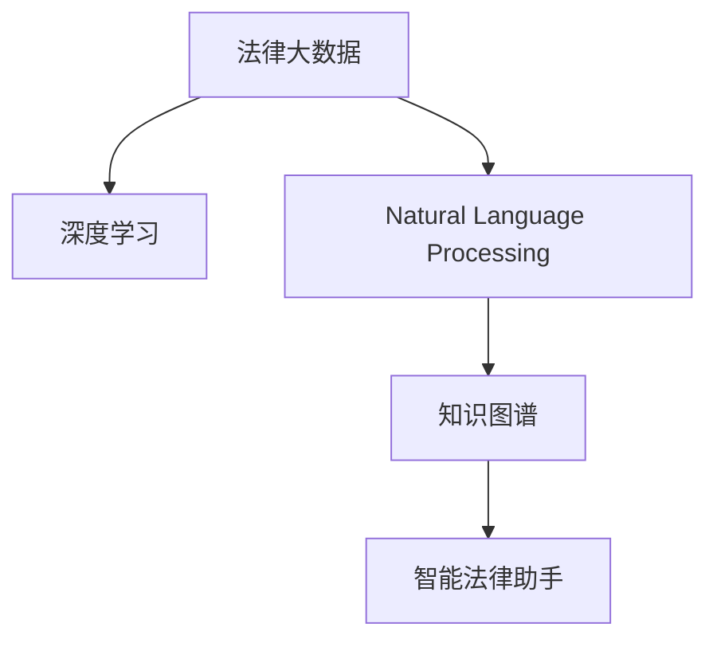

                 

# 知识发现引擎：推动法律行业的智慧革命

> 关键词：知识发现引擎, 智慧法律, 法律行业, 法律大数据, 深度学习, 自然语言处理(NLP), 知识图谱, 智能法律助手

## 1. 背景介绍

### 1.1 问题由来
在数字化时代，法律行业面临着前所未有的挑战与机遇。大数据、人工智能技术的迅速发展，正逐渐改变传统法律服务模式，带来智慧法律（Smart Law）的新生态。智慧法律要求从传统的文书处理、法律咨询、案件管理等业务，走向更智能、更高效的法律服务模式，以适应日益复杂的法律环境。

在智慧法律体系中，知识发现引擎作为核心技术，其作用类似于法律领域的人工智能大脑，通过深度学习、自然语言处理、知识图谱等技术，挖掘海量法律文本、法规文档中的关键信息，辅助律师快速查找、分析、整合各类法律知识，从而提升法律服务效率和质量。

### 1.2 问题核心关键点
本节将深入探讨知识发现引擎在法律行业中的关键点，包括但不限于：

1. **数据处理**：如何高效处理海量法律文档、案例、法规等数据。
2. **模型训练**：如何构建和训练深度学习模型，捕捉和理解法律文本中的关键信息。
3. **知识整合**：如何将分散的法律知识进行结构化整合，形成可检索的知识图谱。
4. **应用实践**：如何将知识发现引擎集成到实际法律服务中，提升法律服务的智能化水平。

## 2. 核心概念与联系

### 2.1 核心概念概述

为更好地理解知识发现引擎在法律行业中的应用，本节将介绍几个核心概念：

- **法律大数据**：指涵盖法律领域各类文档、案例、法规、判例等数据的集合，是构建知识发现引擎的基础数据来源。
- **深度学习**：一种通过多层次神经网络学习数据特征，进而实现复杂任务的技术。
- **自然语言处理（NLP）**：涉及文本预处理、语言模型、文本分类、命名实体识别等技术，是知识发现引擎的重要组成部分。
- **知识图谱**：基于图结构对知识进行组织和管理，可用于高效查询和检索。
- **智能法律助手**：结合法律知识和智能算法，为用户提供法律咨询、案例分析、法规解读等服务的智能系统。

这些核心概念之间的逻辑关系可以通过以下Mermaid流程图来展示：



这个流程图展示了知识发现引擎的核心概念及其之间的关系：

1. 法律大数据作为数据源，提供数据供深度学习和NLP处理。
2. 深度学习通过多层神经网络对法律文本进行特征提取和分类。
3. 自然语言处理技术对文本进行理解和预处理。
4. 知识图谱对法律知识进行结构化整合，形成便于检索的知识体系。
5. 智能法律助手利用知识图谱提供智能化的法律服务。

## 3. 核心算法原理 & 具体操作步骤

### 3.1 算法原理概述

知识发现引擎的核心算法原理主要围绕深度学习、自然语言处理、知识图谱等技术展开，旨在从法律大数据中发现和抽取有价值的信息，辅助法律专业人士提供高效的服务。

具体而言，知识发现引擎的算法流程包括：

1. **数据预处理**：清洗、归一化法律文本数据，准备用于深度学习和NLP处理。
2. **特征提取**：使用词向量、句子向量、段落向量等技术，从法律文本中提取特征。
3. **模型训练**：构建深度神经网络，对特征进行训练，学习法律文本中的知识表示。
4. **知识整合**：将训练得到的知识表示存储在知识图谱中，形成结构化知识库。
5. **智能服务**：将知识图谱集成到智能法律助手中，提供法律咨询、案件分析、法规解读等服务。

### 3.2 算法步骤详解

以下是知识发现引擎的核心算法步骤：

**Step 1: 数据预处理**
- 清洗法律文本数据，去除噪声、无关信息。
- 对文本进行分词、去除停用词、词干提取等预处理操作。
- 将文本数据转换为统一格式，如TF-IDF、Word2Vec等词向量形式。

**Step 2: 特征提取**
- 使用预训练的词向量模型，如Word2Vec、GloVe等，将法律文本转化为向量表示。
- 使用Transformer、LSTM等模型，对句子或段落进行建模，生成句子向量。
- 结合基于统计的方法，如TF-IDF、Doc2Vec等，进一步提取文本特征。

**Step 3: 模型训练**
- 构建深度神经网络模型，如卷积神经网络（CNN）、循环神经网络（RNN）、长短期记忆网络（LSTM）等。
- 使用标注数据训练模型，学习法律文本中的知识表示。
- 使用正则化技术，如L2正则、Dropout等，避免过拟合。
- 应用迁移学习，在少量数据下提高模型泛化能力。

**Step 4: 知识整合**
- 将训练得到的知识表示存储在知识图谱中，构建节点和关系。
- 使用图结构对知识进行组织和管理，形成便于检索的知识体系。
- 使用推理算法，如基于规则的推理、基于模型的推理等，对知识图谱进行查询和检索。

**Step 5: 智能服务**
- 将知识图谱集成到智能法律助手中，提供法律咨询、案件分析、法规解读等服务。
- 使用自然语言处理技术，理解用户输入，调用知识图谱进行智能推理。
- 结合用户交互历史，不断优化知识图谱和智能服务算法，提升服务效果。

### 3.3 算法优缺点

知识发现引擎在法律行业的应用具有以下优点：
1. **提升效率**：通过自动化处理法律文档，显著减少律师和助理的工作量。
2. **增强精度**：深度学习模型能有效捕捉法律文本中的关键信息，提高法律分析的准确性。
3. **知识整合**：将分散的法律知识进行结构化整合，形成可检索的知识图谱。
4. **服务创新**：智能法律助手能提供智能化的法律服务，提升用户体验。

同时，该方法也存在一定的局限性：
1. **数据质量**：法律文本数据的准确性、完整性直接影响知识发现引擎的效果。
2. **模型复杂性**：深度学习模型的训练和维护成本较高，需要专业知识和资源。
3. **知识更新**：法律知识更新速度快，需要定期更新知识图谱，保持信息的及时性。
4. **隐私安全**：法律文本数据往往包含敏感信息，数据隐私和安全保护尤为重要。

尽管存在这些局限性，但就目前而言，知识发现引擎已成为法律行业智慧化的重要技术手段。未来相关研究的重点在于如何进一步降低数据质量要求，提高模型易用性，兼顾隐私保护，同时兼容多种法律领域的复杂需求。

### 3.4 算法应用领域

知识发现引擎已经在法律行业的多个领域得到了应用，例如：

- **法律文书处理**：自动整理法律合同、判决书、起诉书等文档，提取关键信息。
- **法律咨询系统**：通过用户输入的自然语言问题，智能匹配法律知识库中的答案。
- **案件管理系统**：基于知识图谱进行案件关系分析，辅助案件分类和检索。
- **法规解读系统**：通过解析法律文本，生成法规解读报告，提升法规适用性。
- **法律风险预警**：分析法律法规变化趋势，及时预警法律风险。

除了上述这些经典应用外，知识发现引擎还被创新性地应用到更多场景中，如法律案例生成、法律程序自动化、智能合同生成等，为法律服务的智能化和便捷化提供了新的技术路径。

## 4. 数学模型和公式 & 详细讲解  
### 4.1 数学模型构建

本节将使用数学语言对知识发现引擎的核心算法进行更加严格的刻画。

记法律大数据为 $\mathcal{D}=\{x_1, x_2, ..., x_N\}$，其中 $x_i$ 为第 $i$ 条法律文本。设 $f_{\theta}(x_i)$ 为深度学习模型对 $x_i$ 的特征提取函数，$\theta$ 为模型参数。

定义知识发现引擎的损失函数 $\mathcal{L}(\theta)$，用于衡量模型在训练数据集 $\mathcal{D}$ 上的表现：

$$
\mathcal{L}(\theta) = \frac{1}{N} \sum_{i=1}^N \ell(f_{\theta}(x_i), y_i)
$$

其中 $\ell$ 为损失函数，如交叉熵、均方误差等。通过最小化损失函数，可以优化模型参数 $\theta$，使其更准确地提取法律文本中的知识。

### 4.2 公式推导过程

以下我们以法律文书的情感分类为例，推导深度学习模型的损失函数及其梯度的计算公式。

假设法律文本 $x$ 的情感标签为 $y \in \{1, 0\}$，模型 $f_{\theta}(x)$ 输出情感分类结果 $\hat{y} \in [0,1]$，表示文本为正情感的概率。则交叉熵损失函数定义为：

$$
\ell(f_{\theta}(x), y) = -[y\log \hat{y} + (1-y)\log(1-\hat{y})]
$$

将其代入经验风险公式，得：

$$
\mathcal{L}(\theta) = -\frac{1}{N}\sum_{i=1}^N [y_i\log f_{\theta}(x_i)+(1-y_i)\log(1-f_{\theta}(x_i))]
$$

根据链式法则，损失函数对模型参数 $\theta$ 的梯度为：

$$
\frac{\partial \mathcal{L}(\theta)}{\partial \theta} = -\frac{1}{N}\sum_{i=1}^N \frac{\partial \ell(f_{\theta}(x_i), y_i)}{\partial \theta}
$$

其中 $\frac{\partial \ell(f_{\theta}(x_i), y_i)}{\partial \theta}$ 可进一步递归展开，利用反向传播算法完成计算。

在得到损失函数的梯度后，即可带入参数更新公式，完成模型的迭代优化。重复上述过程直至收敛，最终得到适应法律文书情感分类的最优模型参数 $\theta^*$。

## 5. 项目实践：代码实例和详细解释说明
### 5.1 开发环境搭建

在进行知识发现引擎项目实践前，我们需要准备好开发环境。以下是使用Python进行TensorFlow开发的环境配置流程：

1. 安装Anaconda：从官网下载并安装Anaconda，用于创建独立的Python环境。

2. 创建并激活虚拟环境：
```bash
conda create -n tf-env python=3.8 
conda activate tf-env
```

3. 安装TensorFlow：根据CUDA版本，从官网获取对应的安装命令。例如：
```bash
conda install tensorflow==2.7 -c conda-forge
```

4. 安装各类工具包：
```bash
pip install numpy pandas scikit-learn matplotlib tqdm jupyter notebook ipython
```

完成上述步骤后，即可在`tf-env`环境中开始知识发现引擎的实践。

### 5.2 源代码详细实现

下面我以法律文书的情感分类为例，给出使用TensorFlow对深度学习模型进行训练的PyTorch代码实现。

首先，定义情感分类任务的数据处理函数：

```python
import tensorflow as tf
from tensorflow.keras.preprocessing.text import Tokenizer
from tensorflow.keras.preprocessing.sequence import pad_sequences

class LegalDocsDataset(tf.keras.preprocessing.dataset.Dataset):
    def __init__(self, texts, tags):
        self.texts = texts
        self.tags = tags
        self.tokenizer = Tokenizer(num_words=5000)
        self.tokenizer.fit_on_texts(texts)
        self.texts = self.tokenizer.texts_to_sequences(self.texts)
        self.padded_texts = pad_sequences(self.texts, padding='post', maxlen=200)
        self.tags = tf.keras.utils.to_categorical(self.tags)

    def __len__(self):
        return len(self.tags)

    def __getitem__(self, item):
        return self.padded_texts[item], self.tags[item]
```

然后，定义深度学习模型：

```python
from tensorflow.keras.models import Sequential
from tensorflow.keras.layers import Dense, Embedding, LSTM, Dropout

model = Sequential([
    Embedding(5000, 128, input_length=200),
    LSTM(64, dropout=0.2, recurrent_dropout=0.2),
    Dense(1, activation='sigmoid')
])
```

接着，定义训练和评估函数：

```python
from tensorflow.keras.optimizers import Adam
from tensorflow.keras.metrics import Accuracy

def train_epoch(model, dataset, batch_size, optimizer):
    model.compile(optimizer=optimizer, loss='binary_crossentropy', metrics=[Accuracy()])
    model.fit(dataset, epochs=10, batch_size=batch_size, validation_split=0.2)

def evaluate(model, dataset, batch_size):
    model.evaluate(dataset, batch_size=batch_size)
```

最后，启动训练流程并在测试集上评估：

```python
epochs = 5
batch_size = 32

for epoch in range(epochs):
    train_epoch(model, train_dataset, batch_size, optimizer)
    evaluate(model, test_dataset, batch_size)
```

以上就是使用TensorFlow对深度学习模型进行情感分类的完整代码实现。可以看到，TensorFlow提供了强大的API和工具，使深度学习模型的开发和训练变得高效便捷。

### 5.3 代码解读与分析

让我们再详细解读一下关键代码的实现细节：

**LegalDocsDataset类**：
- `__init__`方法：初始化文本、标签、分词器等关键组件，使用TensorFlow的Tokenizer对文本进行分词和序列化，并进行填充。
- `__len__`方法：返回数据集的样本数量。
- `__getitem__`方法：对单个样本进行处理，返回填充后的文本序列和标签。

**模型定义**：
- 使用Sequential模型定义深度神经网络结构，包括嵌入层、LSTM层和输出层。
- 嵌入层将文本序列转换为密集向量表示，LSTM层用于捕捉序列中的时序关系，输出层用于分类输出。
- 使用Dropout层防止过拟合，提高模型泛化能力。

**训练和评估函数**：
- 使用Adam优化器，设置损失函数和评估指标。
- 在训练集上训练模型，并在验证集上评估模型性能。
- 在测试集上评估模型，输出模型精度。

**训练流程**：
- 定义总的epoch数和batch size，开始循环迭代
- 每个epoch内，先在训练集上训练，输出模型精度
- 在测试集上评估，输出模型精度

可以看到，TensorFlow提供了一整套完整的模型开发和训练工具，使得深度学习模型的开发变得高效便捷。开发者可以将更多精力放在数据处理和模型改进等高层逻辑上，而不必过多关注底层的实现细节。

当然，工业级的系统实现还需考虑更多因素，如模型的保存和部署、超参数的自动搜索、更灵活的任务适配层等。但核心的知识发现引擎开发流程基本与此类似。

## 6. 实际应用场景
### 6.1 智能合同生成

在商业活动中，合同是法律事务的核心。合同条款的制定、审核和执行往往耗时耗力，且容易出现错误和遗漏。利用知识发现引擎，可以自动生成符合法律法规要求的智能合同，显著提高合同生成和审核效率。

具体而言，知识发现引擎能够基于已有合同样本，学习合同中的关键要素和结构，自动生成新的合同文本。在生成合同的过程中，系统可以实时检查和验证合同内容，确保合同条款的合法合规性。

### 6.2 法律风险预警

法律法规的频繁更新和变动，使得企业面临的法律风险也随之增加。传统的人工风险预警方式，费时费力且容易遗漏。知识发现引擎可以实时监测法律法规的变化，生成风险预警报告，帮助企业及时规避法律风险。

例如，知识发现引擎可以分析新法规与已有合同、文档的匹配度，自动识别出需要更新的条款。通过生成提示和建议，帮助企业快速响应法律变化。

### 6.3 智能法律顾问

传统的法律咨询往往需要律师的直接介入，成本高且效率低。利用知识发现引擎，可以构建智能法律顾问系统，自动解答法律问题，提升法律服务的覆盖面和响应速度。

智能法律顾问系统基于知识图谱，可以快速定位和查找相关信息，回答用户的常见法律问题。例如，用户输入“我因违反合同需要赔偿，怎么办？”，系统可以自动查询相关法律法规，提供解决建议和案例分析。

### 6.4 未来应用展望

随着知识发现引擎技术的不断成熟，其在法律行业的应用将进一步拓展，带来更深刻的智慧革命。

在智慧法律体系中，知识发现引擎将与人工智能技术深度融合，逐步取代部分律师助理工作，提升法律服务的专业性和准确性。例如，智能法律顾问将与自然语言处理、计算机视觉等技术结合，提供更全面、更个性化的法律服务。

在法律大数据的辅助下，知识发现引擎能够实时监测法律环境和业务动态，提供智能化的法律建议。例如，智能合同生成系统可以实时分析合同内容，预测潜在的法律风险，提升合同的执行效率。

此外，知识发现引擎还将推动法律领域的智能化治理，提升政府和企业的决策能力。例如，通过智能法律顾问系统，政府可以提供便捷的公共法律服务，企业可以提升法律风险管理能力。

总之，知识发现引擎将在大规模法律数据的支持下，进一步提升法律服务的智能化水平，助力法律行业的智慧化发展。

## 7. 工具和资源推荐
### 7.1 学习资源推荐

为了帮助开发者系统掌握知识发现引擎的理论基础和实践技巧，这里推荐一些优质的学习资源：

1. 《深度学习理论与实践》系列博文：由深度学习专家撰写，详细介绍深度学习的基础理论和实践技巧，涵盖各类深度学习模型。
2. CS231n《计算机视觉基础》课程：斯坦福大学开设的计算机视觉经典课程，内容覆盖图像处理、特征提取、目标检测等。
3. 《Python自然语言处理》书籍：详细介绍NLP的基础理论和实现技术，包括分词、词向量、情感分析等。
4. HuggingFace官方文档：提供大量预训练语言模型和NLP工具，支持TensorFlow、PyTorch等多种深度学习框架。
5. CLUE开源项目：涵盖多种中文NLP数据集，提供基准模型和代码实现，助力中文NLP技术发展。

通过对这些资源的学习实践，相信你一定能够快速掌握知识发现引擎的精髓，并用于解决实际的法律问题。
### 7.2 开发工具推荐

高效的开发离不开优秀的工具支持。以下是几款用于知识发现引擎开发的常用工具：

1. TensorFlow：由Google主导开发的开源深度学习框架，生产部署方便，适合大规模工程应用。
2. PyTorch：基于Python的开源深度学习框架，灵活动态的计算图，适合快速迭代研究。
3. TensorBoard：TensorFlow配套的可视化工具，可实时监测模型训练状态，提供丰富的图表呈现方式。
4. Weights & Biases：模型训练的实验跟踪工具，记录和可视化模型训练过程中的各项指标。
5. Keras：高层次的深度学习框架，支持快速原型设计和模型训练。
6. Jupyter Notebook：交互式编程环境，方便模型开发和测试。

合理利用这些工具，可以显著提升知识发现引擎的开发效率，加快创新迭代的步伐。

### 7.3 相关论文推荐

知识发现引擎的发展源于学界的持续研究。以下是几篇奠基性的相关论文，推荐阅读：

1. Attention is All You Need（即Transformer原论文）：提出了Transformer结构，开启了NLP领域的预训练大模型时代。
2. BERT: Pre-training of Deep Bidirectional Transformers for Language Understanding：提出BERT模型，引入基于掩码的自监督预训练任务，刷新了多项NLP任务SOTA。
3. Knowledge Graph Embeddings（KGE）：介绍知识图谱中的向量表示方法，如TransE、DistMult等。
4. Reasoning with Neural-OBJECT Language Models（Reasoning with Transformers）：提出使用Transformer进行逻辑推理，提高知识图谱的推理能力。
5. Revisiting the Knowledge Graph Embedding Literature: What We Know and What We Do Not Know：综述知识图谱嵌入技术，指出未来研究方向和挑战。

这些论文代表了大语言模型和知识图谱的研究脉络。通过学习这些前沿成果，可以帮助研究者把握学科前进方向，激发更多的创新灵感。

## 8. 总结：未来发展趋势与挑战

### 8.1 总结

本文对知识发现引擎在法律行业中的应用进行了全面系统的介绍。首先阐述了知识发现引擎在智慧法律中的关键点，明确了其在法律大数据处理、深度学习模型训练、知识图谱构建、智能服务提供等方面的核心价值。其次，从原理到实践，详细讲解了知识发现引擎的核心算法步骤，给出了深度学习模型的代码实例。同时，本文还探讨了知识发现引擎在智能合同生成、法律风险预警、智能法律顾问等实际应用场景中的前景，展示了知识发现引擎的巨大潜力。

通过本文的系统梳理，可以看到，知识发现引擎作为智慧法律的重要技术手段，其应用前景广阔。受益于大规模法律数据的积累和深度学习技术的不断进步，知识发现引擎必将在未来法律行业中发挥更大的作用，推动智慧法律向纵深发展。

### 8.2 未来发展趋势

展望未来，知识发现引擎在法律行业的应用将呈现以下几个发展趋势：

1. **深度学习模型的演化**：未来深度学习模型将继续向更加复杂、高效的方向发展，模型结构和训练方法将更加灵活。
2. **知识图谱的扩展**：知识图谱将涵盖更广泛的知识领域，形成更加全面、结构化的知识体系。
3. **智能服务的深化**：智能法律顾问、智能合同生成等应用将不断深化，提供更全面、个性化的法律服务。
4. **跨领域融合**：知识发现引擎将与人工智能技术深度融合，形成跨领域的智能法律解决方案。
5. **数据隐私保护**：随着数据隐私保护的重视，知识发现引擎需要更加注重用户隐私保护，确保数据使用的合规性。

以上趋势凸显了知识发现引擎的广阔前景。这些方向的探索发展，必将进一步提升智慧法律系统的性能和应用范围，为法律行业的智慧化进程注入新的动力。

### 8.3 面临的挑战

尽管知识发现引擎技术已经取得了显著进展，但在迈向更加智能化、普适化应用的过程中，它仍面临诸多挑战：

1. **数据质量**：法律文本数据的准确性、完整性直接影响知识发现引擎的效果。
2. **模型复杂性**：深度学习模型的训练和维护成本较高，需要专业知识和资源。
3. **知识更新**：法律知识更新速度快，需要定期更新知识图谱，保持信息的及时性。
4. **隐私安全**：法律文本数据往往包含敏感信息，数据隐私和安全保护尤为重要。

尽管存在这些挑战，但随着学界和产业界的共同努力，相信知识发现引擎必将在未来法律行业中克服这些障碍，实现更广泛的应用。

### 8.4 研究展望

面对知识发现引擎所面临的种种挑战，未来的研究需要在以下几个方面寻求新的突破：

1. **数据增强技术**：通过数据增强技术，生成更多的合成数据，提高模型的泛化能力。
2. **模型压缩和加速**：开发更加轻量级的模型结构和算法，实现模型压缩和推理加速，提高系统的实时性。
3. **跨模态融合**：将法律文本、图像、语音等多模态数据进行融合，提升知识发现引擎的理解能力。
4. **知识图谱推理**：结合逻辑推理技术，提高知识图谱的推理能力和准确性。
5. **隐私保护技术**：开发更加隐私友好的数据处理和存储技术，确保数据使用的合规性和安全性。

这些研究方向的探索，必将引领知识发现引擎技术迈向更高的台阶，为智慧法律提供更强大的技术支持。面向未来，知识发现引擎需要在技术深度和应用广度上进行更深入的挖掘，不断突破瓶颈，实现更广泛的应用。

## 9. 附录：常见问题与解答

**Q1：知识发现引擎在法律行业的应用有哪些？**

A: 知识发现引擎在法律行业的应用主要包括：
1. 法律文书处理：自动整理法律合同、判决书、起诉书等文档，提取关键信息。
2. 法律咨询系统：通过用户输入的自然语言问题，智能匹配法律知识库中的答案。
3. 案件管理系统：基于知识图谱进行案件关系分析，辅助案件分类和检索。
4. 法规解读系统：通过解析法律文本，生成法规解读报告，提升法规适用性。
5. 法律风险预警：分析法律法规的变化，生成风险预警报告。
6. 智能合同生成：基于已有合同样本，学习合同中的关键要素和结构，自动生成新的合同文本。

这些应用场景展示了知识发现引擎在提升法律服务效率、保障法律规范性方面的强大能力。

**Q2：知识发现引擎需要哪些预处理步骤？**

A: 知识发现引擎的预处理步骤包括：
1. 清洗法律文本数据，去除噪声、无关信息。
2. 对文本进行分词、去除停用词、词干提取等预处理操作。
3. 将文本数据转换为统一格式，如TF-IDF、Word2Vec等词向量形式。
4. 使用预训练的词向量模型，如Word2Vec、GloVe等，将法律文本转化为向量表示。
5. 使用Transformer、LSTM等模型，对句子或段落进行建模，生成句子向量。
6. 结合基于统计的方法，如TF-IDF、Doc2Vec等，进一步提取文本特征。

这些预处理步骤是知识发现引擎构建和训练的基础，可以显著提升模型效果。

**Q3：知识发现引擎的训练过程中需要注意哪些问题？**

A: 知识发现引擎的训练过程中需要注意以下问题：
1. 选择合适的深度学习模型和优化器。
2. 设置合适的学习率，避免过拟合。
3. 应用正则化技术，如L2正则、Dropout等，防止过拟合。
4. 应用迁移学习，在少量数据下提高模型泛化能力。
5. 定期在验证集上评估模型性能，及时调整模型参数。
6. 使用数据增强技术，扩充训练集，提高模型泛化能力。

这些问题需要在模型构建和训练过程中认真对待，才能获得理想的模型效果。

**Q4：知识发现引擎在法律行业的应用前景如何？**

A: 知识发现引擎在法律行业的应用前景非常广阔。随着深度学习技术和大规模法律数据的不断积累，知识发现引擎能够提供更智能、更高效的法律服务。例如，智能合同生成系统可以实时分析合同内容，预测潜在的法律风险，提升合同的执行效率。智能法律顾问系统基于知识图谱，可以快速定位和查找相关信息，回答用户的常见法律问题。

总之，知识发现引擎将在大规模法律数据的支持下，进一步提升法律服务的智能化水平，推动智慧法律向纵深发展。

---

作者：禅与计算机程序设计艺术 / Zen and the Art of Computer Programming

