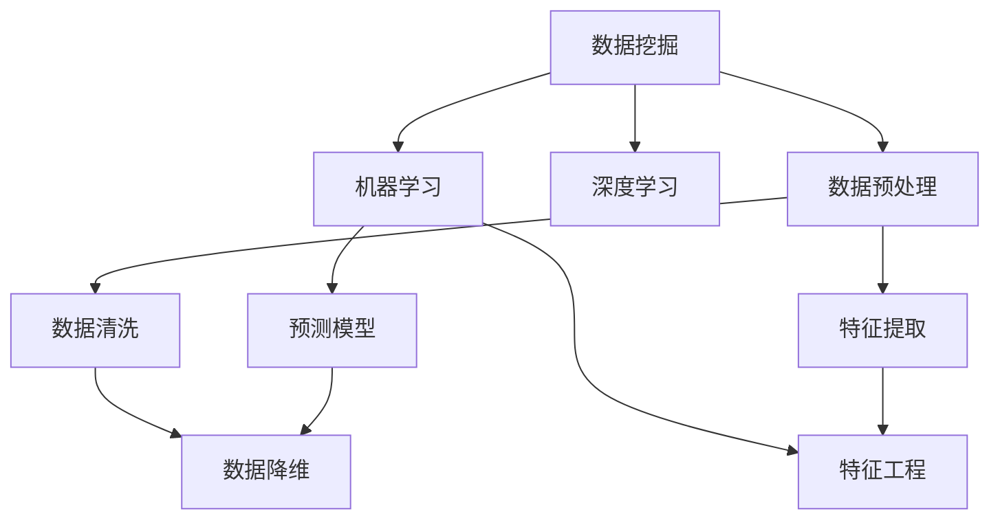

                 

# 知识发现引擎：推动科学研究的创新动力

> 关键词：知识发现引擎, 数据挖掘, 科学发现, 大数据分析, 人工智能, 深度学习, 预测模型

## 1. 背景介绍

### 1.1 问题由来

在信息爆炸的今天，科学研究面临前所未有的数据挑战。各类实验数据、观测数据、模拟数据等海量的数据涌现，如何从中挖掘出有价值的知识和模式，成为了科研人员亟需解决的难题。传统的手动数据筛选、特征提取、统计分析等方法，已经无法满足现代数据量级的处理需求。知识发现引擎(Knowledge Discovery Engine, KDE)应运而生，通过数据挖掘技术，自动从大数据中发现有价值的知识模式，辅助科研人员进行科学发现。

知识发现引擎是人工智能和数据科学的一个重要分支，旨在通过数据分析和挖掘，揭示数据中的潜在知识，为科研人员提供创新性的研究思路和方法。其核心思想是利用人工智能技术和算法，自动从数据中发现有意义的规律和模式，辅助科研人员在浩如烟海的数据中洞察新的研究方向和科学发现。

### 1.2 问题核心关键点

知识发现引擎的关键点包括：
- **数据收集与处理**：收集各类科学研究数据，并进行预处理和清洗，确保数据质量和一致性。
- **特征提取与选择**：从原始数据中提取有意义的特征，并进行筛选和降维，以便于模型训练和分析。
- **算法模型构建**：选择合适的机器学习或深度学习模型，构建预测、分类、聚类等知识发现模型。
- **模型训练与评估**：利用训练数据集训练模型，并根据验证集和测试集进行模型评估，调整模型参数和结构。
- **知识发现与展示**：从训练好的模型中发现和提取知识，通过可视化工具展示数据中的模式和规律。

知识发现引擎将复杂的数据分析任务转化为可执行的算法模型，辅助科研人员自动发现知识模式，加速科学研究的创新过程。

### 1.3 问题研究意义

知识发现引擎的研究意义主要体现在以下几个方面：
- **提高科研效率**：通过自动化数据处理和分析，减轻科研人员的工作负担，提高科研效率。
- **促进科学创新**：帮助科研人员从海量数据中发现新的科学问题和研究方向，激发创新思维。
- **优化决策过程**：通过数据驱动的决策支持，提高科研决策的准确性和科学性。
- **促进跨学科研究**：知识发现引擎可以跨学科整合各类数据，促进不同领域知识的融合和交叉。
- **推动大数据技术发展**：作为大数据分析的关键技术之一，知识发现引擎的进步将推动大数据技术的不断演进。

## 2. 核心概念与联系

### 2.1 核心概念概述

为了更好地理解知识发现引擎的工作原理和优化方向，本节将介绍几个密切相关的核心概念：

- **数据挖掘(Data Mining)**：通过算法自动从数据中提取知识模式和规律，为决策提供支持。数据挖掘是知识发现引擎的核心技术之一。
- **机器学习(Machine Learning)**：利用算法和统计方法，让计算机自动学习和改进，从而做出精确预测和决策。机器学习算法广泛应用于知识发现引擎中。
- **深度学习(Deep Learning)**：一种基于神经网络的机器学习技术，能够自动学习数据中的复杂特征和模式。深度学习在大规模数据挖掘和复杂模式识别中表现出卓越性能。
- **数据预处理(Data Preprocessing)**：包括数据清洗、特征提取、降维等步骤，为模型训练和分析提供高质量的数据集。
- **特征工程(Feature Engineering)**：通过人工干预和优化，提升特征的有效性和可用性，以更好地训练模型。
- **预测模型(Prediction Model)**：利用已知数据构建的预测模型，可以用于未来的数据预测和决策支持。

这些核心概念之间的逻辑关系可以通过以下Mermaid流程图来展示：



这个流程图展示的知识发现引擎的核心概念及其之间的关系：

1. 数据挖掘通过数据预处理和特征工程，将原始数据转化为特征集。
2. 特征集通过机器学习算法，构建预测模型。
3. 预测模型进一步经过特征工程优化，提升预测准确性。
4. 数据降维和数据清洗等预处理步骤，保障数据质量。

这些概念共同构成了知识发现引擎的数据分析流程，使得模型能够自动从数据中发现有意义的规律和模式。

## 3. 核心算法原理 & 具体操作步骤
### 3.1 算法原理概述

知识发现引擎的核心算法原理可以简要概括为以下几个步骤：
1. **数据收集与预处理**：从科学研究中收集各类数据，并进行清洗和预处理，确保数据质量。
2. **特征提取与选择**：从预处理后的数据中提取有意义的特征，并进行筛选和降维。
3. **模型训练与评估**：选择合适的机器学习或深度学习模型，利用训练数据集训练模型，并在验证集和测试集上进行评估和优化。
4. **知识发现与展示**：从训练好的模型中发现和提取知识，通过可视化工具展示数据中的模式和规律。

这些步骤通过算法模型自动实现，大大降低了科研人员的工作量，提高了科研效率。

### 3.2 算法步骤详解

以下是知识发现引擎的主要算法步骤，包括数据预处理、特征工程、模型训练和知识发现。

**Step 1: 数据收集与预处理**
- **数据收集**：从科学研究项目中收集各类数据，包括实验数据、观测数据、模拟数据等。数据格式和内容应尽可能标准化，便于后续处理。
- **数据清洗**：去除缺失值、异常值和重复值，确保数据集的一致性和完整性。
- **数据归一化**：对不同尺度的数据进行归一化处理，便于模型训练。

**Step 2: 特征提取与选择**
- **特征提取**：利用统计学、机器学习等技术，从原始数据中提取有意义的特征，如平均值、标准差、主成分等。
- **特征选择**：通过过滤、包装、嵌入等技术，选择和优化特征集，去除冗余和噪声。
- **特征降维**：采用PCA、LDA、t-SNE等技术，对高维特征进行降维处理，提高模型训练效率。

**Step 3: 模型训练与评估**
- **模型选择**：根据数据类型和任务需求，选择合适的预测模型，如线性回归、支持向量机、决策树、神经网络等。
- **模型训练**：利用训练数据集训练模型，并调整模型参数和结构，使其在训练集上达到最优性能。
- **模型评估**：在验证集上评估模型性能，计算各项指标（如准确率、召回率、F1分数等），并进行调参优化。
- **模型测试**：在测试集上评估模型泛化能力，确保模型在新数据上的预测性能。

**Step 4: 知识发现与展示**
- **知识提取**：利用训练好的模型，从数据中提取和发现知识模式，如异常检测、聚类分析、关联规则等。
- **知识可视化**：通过可视化工具（如散点图、热图、树图等）展示数据中的模式和规律，辅助科研人员理解数据特征和关系。

### 3.3 算法优缺点

知识发现引擎具有以下优点：
1. **自动化处理**：自动完成数据预处理、特征提取、模型训练等复杂任务，减轻科研人员负担。
2. **高效性**：算法模型自动化实现，提高了数据处理和分析的效率。
3. **泛化性强**：模型能够在新的数据集上泛化，发现新的科学规律和模式。
4. **易于集成**：可以与科研软件、实验设备等系统无缝集成，提升研究系统的整体性能。

同时，知识发现引擎也存在以下缺点：
1. **算法复杂度高**：深度学习等算法模型训练复杂，对计算资源和专业知识要求较高。
2. **数据依赖性强**：模型性能依赖于数据的质量和量级，低质量数据会影响模型效果。
3. **解释性不足**：复杂的模型可能难以解释其决策过程，科研人员难以理解模型的内部工作机制。
4. **过度拟合风险**：模型可能过拟合训练数据，在新数据上泛化性能下降。

尽管存在这些局限性，但知识发现引擎在提高科研效率和加速科学创新方面仍具有重要价值，值得进一步研究和优化。

### 3.4 算法应用领域

知识发现引擎已经广泛应用于多个领域，涵盖科学研究、医疗健康、金融经济、工业制造等。以下是几个典型的应用场景：

**科学研究**：通过分析实验数据和观测数据，发现新的科学问题和研究方向。例如，利用知识发现引擎分析天文观测数据，发现新的天体和现象。

**医疗健康**：利用病历数据、基因数据等医疗数据，发现疾病诊断和治疗方法。例如，通过知识发现引擎分析基因组数据，发现新的基因突变和疾病关联。

**金融经济**：通过分析市场数据和财务数据，预测股票价格、评估风险等。例如，利用知识发现引擎分析历史交易数据，发现市场趋势和异常行为。

**工业制造**：通过分析生产数据和设备数据，优化生产流程和设备维护。例如，通过知识发现引擎分析生产设备数据，发现故障预警和维护策略。

**城市管理**：通过分析交通数据、环境数据等，优化城市管理和服务。例如，利用知识发现引擎分析交通流量数据，发现交通拥堵点和管理策略。

## 4. 数学模型和公式 & 详细讲解 & 举例说明
### 4.1 数学模型构建

本节将使用数学语言对知识发现引擎的核心算法进行更加严格的刻画。

记原始数据集为 $D = \{(x_i, y_i)\}_{i=1}^N$，其中 $x_i \in \mathcal{X}$ 表示样本特征，$y_i \in \mathcal{Y}$ 表示样本标签。

假设选择的预测模型为 $f: \mathcal{X} \rightarrow \mathcal{Y}$，模型参数为 $\theta$。知识发现引擎的数学模型构建过程如下：

1. **数据预处理**：通过特征工程将原始数据转化为特征集 $X \in \mathbb{R}^{N \times d}$，其中 $d$ 为特征维度。
2. **模型训练**：利用训练数据集 $D_{train} = \{(x_i, y_i)\}_{i=1}^n$ 训练模型 $f$，得到模型参数 $\hat{\theta} = \mathop{\arg\min}_{\theta} \mathcal{L}(\theta; D_{train})$，其中 $\mathcal{L}$ 为损失函数。
3. **模型评估**：在验证集 $D_{val} = \{(x_i, y_i)\}_{i=1}^m$ 上评估模型性能，得到评估指标 $\mathcal{M}(\hat{\theta}; D_{val})$。
4. **模型测试**：在测试集 $D_{test} = \{(x_i, y_i)\}_{i=1}^t$ 上测试模型泛化能力，得到测试指标 $\mathcal{N}(\hat{\theta}; D_{test})$。

### 4.2 公式推导过程

以下我们以线性回归模型为例，推导预测模型的训练和评估公式。

假设线性回归模型为 $f(x) = \theta_0 + \sum_{i=1}^d \theta_i x_i$，其中 $\theta_0$ 为截距，$\theta_i$ 为特征系数。

在训练数据集 $D_{train} = \{(x_i, y_i)\}_{i=1}^n$ 上，模型训练的损失函数为：

$$
\mathcal{L}(\theta; D_{train}) = \frac{1}{2n} \sum_{i=1}^n (y_i - f(x_i))^2
$$

利用梯度下降算法更新参数 $\theta$：

$$
\theta \leftarrow \theta - \eta \nabla_{\theta} \mathcal{L}(\theta; D_{train})
$$

其中 $\eta$ 为学习率，$\nabla_{\theta} \mathcal{L}(\theta; D_{train})$ 为损失函数对参数 $\theta$ 的梯度，可通过自动微分技术计算得到。

在验证集 $D_{val} = \{(x_i, y_i)\}_{i=1}^m$ 上评估模型性能的指标为：

$$
\mathcal{M}(\hat{\theta}; D_{val}) = \frac{1}{m} \sum_{i=1}^m (y_i - f(x_i))^2
$$

在测试集 $D_{test} = \{(x_i, y_i)\}_{i=1}^t$ 上测试模型泛化能力的指标为：

$$
\mathcal{N}(\hat{\theta}; D_{test}) = \frac{1}{t} \sum_{i=1}^t (y_i - f(x_i))^2
$$

### 4.3 案例分析与讲解

以金融市场数据分析为例，展示知识发现引擎的应用过程。

假设从金融市场获取历史交易数据，包含股票价格、成交量、市场情绪等特征。

1. **数据预处理**：对原始数据进行清洗，去除异常值和缺失值，归一化特征数据。
2. **特征工程**：提取股票价格变化率、成交量、市场情绪等特征，并进行特征选择和降维。
3. **模型训练**：选择线性回归模型，利用历史交易数据训练模型，得到最优模型参数。
4. **模型评估**：在验证集上评估模型性能，如均方误差等指标。
5. **模型测试**：在测试集上测试模型泛化能力，评估模型在新数据上的预测效果。

通过知识发现引擎，可以自动发现市场中的趋势和规律，辅助投资者做出更准确的投资决策。

## 5. 项目实践：代码实例和详细解释说明
### 5.1 开发环境搭建

在进行知识发现引擎的实践前，我们需要准备好开发环境。以下是使用Python进行Scikit-Learn开发的环境配置流程：

1. 安装Anaconda：从官网下载并安装Anaconda，用于创建独立的Python环境。

2. 创建并激活虚拟环境：
```bash
conda create -n sklearn-env python=3.8 
conda activate sklearn-env
```

3. 安装Scikit-Learn：
```bash
conda install scikit-learn
```

4. 安装各类工具包：
```bash
pip install numpy pandas matplotlib seaborn
```

完成上述步骤后，即可在`sklearn-env`环境中开始知识发现引擎的实践。

### 5.2 源代码详细实现

下面我们以线性回归模型为例，给出使用Scikit-Learn进行金融市场数据分析的PyTorch代码实现。

首先，定义数据处理函数：

```python
import pandas as pd
from sklearn.model_selection import train_test_split
from sklearn.preprocessing import StandardScaler
from sklearn.linear_model import LinearRegression

def load_data(file_path):
    data = pd.read_csv(file_path)
    X = data[['price_change_rate', 'volume', 'market_mood']]
    y = data['return']
    return X, y

def preprocess_data(X, y, test_size=0.2, random_state=42):
    X_train, X_test, y_train, y_test = train_test_split(X, y, test_size=test_size, random_state=random_state)
    scaler = StandardScaler()
    X_train = scaler.fit_transform(X_train)
    X_test = scaler.transform(X_test)
    return X_train, y_train, X_test, y_test

def train_model(X_train, y_train, X_test, y_test):
    model = LinearRegression()
    model.fit(X_train, y_train)
    y_pred = model.predict(X_test)
    return model, y_pred
```

然后，定义评估和可视化函数：

```python
import numpy as np
from sklearn.metrics import mean_squared_error

def evaluate_model(model, X_test, y_test):
    y_pred = model.predict(X_test)
    mse = mean_squared_error(y_test, y_pred)
    return mse

def visualize_result(X_train, y_train, X_test, y_test, model):
    import matplotlib.pyplot as plt
    plt.scatter(X_train, y_train, label='Training Data')
    plt.scatter(X_test, y_test, label='Test Data')
    plt.plot(X_test, model.predict(X_test), label='Predicted', color='red')
    plt.legend()
    plt.show()
```

最后，启动训练流程并在测试集上评估：

```python
file_path = 'financial_data.csv'
X, y = load_data(file_path)
X_train, y_train, X_test, y_test = preprocess_data(X, y)

model, y_pred = train_model(X_train, y_train, X_test, y_test)
mse = evaluate_model(model, X_test, y_test)
visualize_result(X_train, y_train, X_test, y_test, model)
print(f'Mean Squared Error: {mse:.3f}')
```

以上就是使用Scikit-Learn进行金融市场数据分析的知识发现引擎的完整代码实现。可以看到，得益于Scikit-Learn的强大封装，我们可以用相对简洁的代码完成线性回归模型的训练和评估。

### 5.3 代码解读与分析

让我们再详细解读一下关键代码的实现细节：

**load_data函数**：
- 读取数据文件，并将价格变化率、成交量、市场情绪等特征与返回率作为目标变量，进行数据初始化。

**preprocess_data函数**：
- 将数据集划分为训练集和测试集，并进行归一化处理。

**train_model函数**：
- 定义线性回归模型，使用训练集数据进行模型训练，并得到测试集的预测结果。

**evaluate_model函数**：
- 计算模型在测试集上的均方误差，评估模型预测性能。

**visualize_result函数**：
- 使用Matplotlib绘制训练集、测试集和模型预测值的关系图，直观展示模型效果。

**训练流程**：
- 首先加载金融市场数据，并进行预处理和归一化。
- 将数据划分为训练集和测试集，使用训练集训练线性回归模型。
- 在测试集上评估模型性能，输出均方误差。
- 绘制数据分布图，展示模型预测结果。

可以看到，Scikit-Learn使得知识发现引擎的开发变得简洁高效。开发者可以将更多精力放在数据处理、模型改进等高层逻辑上，而不必过多关注底层的实现细节。

当然，工业级的系统实现还需考虑更多因素，如模型的保存和部署、超参数的自动搜索、更灵活的任务适配层等。但核心的知识发现引擎算法基本与此类似。

## 6. 实际应用场景
### 6.1 科学研究

在科学研究中，知识发现引擎可以辅助科研人员从海量实验数据和观测数据中发现有意义的规律和模式，加速科学发现。

以天文学为例，观测大量恒星光谱数据，通过知识发现引擎分析，可以发现新的恒星类型、天体现象等。在地球科学研究中，利用地质数据和环境数据，可以发现新的地质构造、气候变化规律等。

### 6.2 医疗健康

在医疗健康领域，知识发现引擎可以辅助医生从病历数据和基因数据中发现有意义的规律和模式，发现新的疾病诊断和治疗方法。

例如，利用知识发现引擎分析基因组数据，发现新的基因突变和疾病关联。在药物研发中，通过分析临床试验数据，发现新的药物效果和副作用。

### 6.3 金融经济

在金融经济领域，知识发现引擎可以辅助投资者从历史交易数据和市场数据中发现有意义的规律和模式，预测市场趋势和风险。

例如，利用知识发现引擎分析股票交易数据，发现新的市场规律和异常行为。在信贷风险评估中，通过分析历史贷款数据，发现新的风险特征和预警策略。

### 6.4 工业制造

在工业制造领域，知识发现引擎可以辅助工厂从生产数据和设备数据中发现有意义的规律和模式，优化生产流程和设备维护。

例如，利用知识发现引擎分析生产设备数据，发现新的故障预警和维护策略。在供应链管理中，通过分析供应链数据，发现新的优化路径和风险预警。

### 6.5 城市管理

在城市管理领域，知识发现引擎可以辅助城市管理者从交通数据、环境数据等中发现有意义的规律和模式，优化城市管理和服务。

例如，利用知识发现引擎分析交通流量数据，发现新的交通拥堵点和管理策略。在公共安全管理中，通过分析安全监控数据，发现新的安全预警和防护策略。

## 7. 工具和资源推荐
### 7.1 学习资源推荐

为了帮助开发者系统掌握知识发现引擎的理论基础和实践技巧，这里推荐一些优质的学习资源：

1. 《机器学习实战》：一本实战性很强的书籍，介绍了机器学习的基本概念和常用算法，适合初学者学习。
2. 《统计学习方法》：清华大学出版社，该书深入浅出地介绍了统计学习的基本理论和常用方法，是统计学习的经典教材。
3. 《Python机器学习》：一本面向Python开发者的机器学习入门书籍，介绍了常用的机器学习库和算法。
4. Coursera的《机器学习》课程：由斯坦福大学开设的机器学习课程，由Andrew Ng教授主讲，内容丰富，适合系统学习。
5. Kaggle平台：一个数据科学竞赛平台，提供大量的数据集和竞赛题目，适合实践训练和数据挖掘竞赛。

通过对这些资源的学习实践，相信你一定能够快速掌握知识发现引擎的精髓，并用于解决实际的科研问题。

### 7.2 开发工具推荐

高效的开发离不开优秀的工具支持。以下是几款用于知识发现引擎开发的常用工具：

1. Python：Python语言简单易学，适合快速原型开发和数据处理。
2. Scikit-Learn：一个基于Python的机器学习库，提供丰富的机器学习算法和工具，适合快速原型开发和实验。
3. TensorFlow：Google开发的深度学习框架，支持大规模深度学习模型训练和部署。
4. Keras：一个基于TensorFlow的高层深度学习API，适合快速原型开发和实验。
5. Jupyter Notebook：一个交互式编程环境，适合数据处理和模型训练。
6. R语言：R语言是数据科学领域的重要工具，提供丰富的统计分析和机器学习库。

合理利用这些工具，可以显著提升知识发现引擎的开发效率，加快创新迭代的步伐。

### 7.3 相关论文推荐

知识发现引擎的研究源于学界的持续研究。以下是几篇奠基性的相关论文，推荐阅读：

1. M. Kearns等人的《Algorithms for Learning》：介绍了机器学习的基本算法和理论，是机器学习的经典教材。
2. T. Mitchell的《Machine Learning》：介绍了机器学习的基本概念和常用算法，是机器学习的经典教材。
3. J. B. Tenenbaum等人的《A Tutorial on Machine Learning》：介绍了机器学习的常用算法和应用，适合初学者学习。
4. G. Hinton等人的《Deep Learning》：介绍了深度学习的基本概念和常用算法，是深度学习的经典教材。
5. I. Goodfellow等人的《Deep Learning》：介绍了深度学习的基本概念和常用算法，是深度学习的经典教材。

这些论文代表了大数据挖掘和知识发现技术的发展脉络。通过学习这些前沿成果，可以帮助研究者把握学科前进方向，激发更多的创新灵感。

## 8. 总结：未来发展趋势与挑战
### 8.1 总结

本文对知识发现引擎的核心算法和实际应用进行了全面系统的介绍。首先阐述了知识发现引擎的研究背景和意义，明确了其在加速科学发现和提高科研效率方面的独特价值。其次，从原理到实践，详细讲解了知识发现引擎的数学模型和算法流程，给出了知识发现引擎的完整代码实例。同时，本文还广泛探讨了知识发现引擎在科学研究、医疗健康、金融经济等多个领域的应用前景，展示了知识发现引擎的广泛潜力。

通过本文的系统梳理，可以看到，知识发现引擎作为数据挖掘和人工智能的重要分支，已经成为科研人员不可缺少的工具。其自动化处理、高效性、泛化性等优点，使其在科研领域发挥了重要的作用。未来，知识发现引擎将在更多的应用场景中大放异彩，为科研人员提供更强大的数据分析和挖掘能力。

### 8.2 未来发展趋势

展望未来，知识发现引擎将呈现以下几个发展趋势：

1. **算法复杂度提升**：深度学习等算法模型将更加复杂，能够处理更加复杂的数据和任务。
2. **跨领域融合**：知识发现引擎将与其他人工智能技术（如自然语言处理、计算机视觉等）进行更多融合，形成多模态知识发现引擎。
3. **实时性增强**：知识发现引擎将实现实时数据处理和分析，提高数据的实时性和时效性。
4. **自动化程度提升**：自动化处理和模型优化将成为知识发现引擎的核心，减少人工干预和调试。
5. **数据源多样化**：知识发现引擎将从单一的数据源拓展到多种数据源，实现跨数据源的知识发现。

以上趋势将进一步提升知识发现引擎的性能和应用范围，为科研人员提供更强大的数据分析和挖掘能力。

### 8.3 面临的挑战

尽管知识发现引擎已经取得了显著进展，但在迈向更加智能化、普适化应用的过程中，仍面临诸多挑战：

1. **数据质量和量级**：数据质量和量级直接影响知识发现引擎的效果，低质量数据会导致模型性能下降。
2. **算法复杂性**：深度学习等算法模型训练复杂，对计算资源和专业知识要求较高。
3. **模型解释性**：复杂的模型难以解释其决策过程，科研人员难以理解模型的内部工作机制。
4. **过度拟合风险**：模型可能过拟合训练数据，在新数据上泛化性能下降。
5. **数据隐私和安全**：知识发现引擎需要处理大量敏感数据，数据隐私和安全问题需引起重视。

尽管存在这些挑战，但随着技术的不断进步和研究的深入，知识发现引擎必将在更多的应用场景中大放异彩，为科研人员提供更强大的数据分析和挖掘能力。相信通过跨学科的协同努力，知识发现引擎将迈向更广阔的应用前景。

### 8.4 研究展望

面向未来，知识发现引擎的研究需要从以下几个方向寻求新的突破：

1. **多模态知识发现**：将不同模态的数据（如文本、图像、视频等）进行融合，提高知识发现引擎的泛化能力。
2. **自适应学习**：利用强化学习等技术，使知识发现引擎能够根据数据分布进行自适应学习，提高模型的稳定性和鲁棒性。
3. **模型压缩和加速**：通过模型压缩和加速技术，减小模型规模，提升推理效率，适应资源受限的科研环境。
4. **数据隐私保护**：研究数据隐私保护技术，确保知识发现引擎在处理敏感数据时的隐私和安全。
5. **知识自动化提取**：开发更加自动化的知识提取技术，减少科研人员的手动干预和调试。

这些研究方向将引领知识发现引擎技术迈向更高的台阶，为科研人员提供更强大的数据分析和挖掘能力。面向未来，知识发现引擎必将在更多的应用场景中大放异彩，为科研人员提供更强大的数据分析和挖掘能力。

## 9. 附录：常见问题与解答

**Q1：知识发现引擎如何选择合适的模型？**

A: 知识发现引擎的模型选择应根据数据类型和任务需求，选择合适的机器学习或深度学习模型。如线性回归、支持向量机、决策树、神经网络等。常见的选择原则包括：
- 数据量级：对于大数据量，通常选择深度学习模型；对于小数据量，通常选择传统机器学习模型。
- 任务类型：分类任务通常选择分类模型，回归任务通常选择回归模型，聚类任务通常选择聚类模型。
- 数据结构：对于结构化数据，通常选择传统机器学习模型；对于非结构化数据，通常选择深度学习模型。

**Q2：如何避免知识发现引擎中的过拟合？**

A: 避免知识发现引擎中的过拟合，可以从以下几个方面进行优化：
- 数据增强：通过数据扩充、合成数据等技术，增加数据多样性，减少过拟合。
- 正则化：使用L1正则、L2正则、Dropout等技术，限制模型复杂度，避免过拟合。
- 早停法(Early Stopping)：在验证集上监控模型性能，当性能不再提升时，停止训练，避免过拟合。
- 模型集成：使用集成学习方法，如Bagging、Boosting等，减少模型方差，提高泛化能力。

**Q3：知识发现引擎在实际应用中如何处理高维度数据？**

A: 高维度数据处理是知识发现引擎中的常见问题。以下是几种常用的处理方式：
- 特征选择：通过特征选择技术，去除冗余和噪声特征，保留重要特征。
- 特征降维：采用主成分分析(PCA)、线性判别分析(LDA)等技术，将高维数据降维到低维空间。
- 数据稀疏化：采用稀疏矩阵等技术，减少数据存储空间，提高计算效率。

**Q4：知识发现引擎在应用过程中需要注意哪些问题？**

A: 知识发现引擎在应用过程中需要注意以下问题：
- 数据质量：确保数据质量和一致性，避免数据噪声和异常值影响模型效果。
- 数据隐私：处理敏感数据时，注意数据隐私和安全问题。
- 模型解释性：复杂的模型难以解释其决策过程，需要提供模型解释和可视化工具，辅助科研人员理解模型。
- 模型可扩展性：确保模型在不同数据规模和结构上具有良好的扩展性，避免过度依赖特定数据。
- 模型可维护性：确保模型易于维护和更新，避免模型复杂性过高难以调试。

**Q5：知识发现引擎如何与其他AI技术进行融合？**

A: 知识发现引擎可以与其他AI技术进行多层次融合，形成多模态知识发现引擎。例如：
- 与自然语言处理技术结合，实现文本数据的挖掘和分析。
- 与计算机视觉技术结合，实现图像数据的挖掘和分析。
- 与强化学习技术结合，实现自适应学习和优化。

通过多模态融合，知识发现引擎可以处理更多类型的数据，提高模型的泛化能力和应用范围。

---

作者：禅与计算机程序设计艺术 / Zen and the Art of Computer Programming

