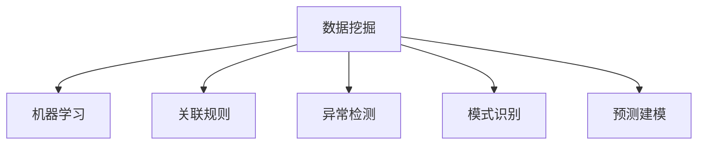

                 

## 1. 背景介绍

### 1.1 问题由来
在数字化时代，企业面临的是一个信息过载、竞争激烈的市场环境。传统的数据分析方式，如报表、统计等，已无法满足企业决策的深度要求。如何从海量数据中挖掘出有价值的信息，驱动业务创新，成为企业决策者面临的重大挑战。

### 1.2 问题核心关键点
知识发现引擎（Knowledge Discovery Engine, KDE）是一种利用人工智能技术，从大量数据中发现潜在的、有价值的知识模式和关系，并转化为可应用的知识体系的工具。它通过数据挖掘、机器学习等技术手段，为决策者提供数据驱动的洞察和策略建议，助力企业快速响应市场变化，提升核心竞争力。

### 1.3 问题研究意义
KDE能够帮助企业发现数据中的潜规则、趋势和模式，快速获取业务洞察，优化决策过程。在市场细分、客户行为分析、产品推荐、风险管理等方面，KDE展现了强大的应用潜力。

## 2. 核心概念与联系

### 2.1 核心概念概述

为更好地理解知识发现引擎的原理和应用，本节将介绍几个关键概念：

- 数据挖掘(Data Mining)：从数据中自动发现模式、规律和知识的过程。KDE是数据挖掘技术的重要组成部分。
- 机器学习(Machine Learning)：通过训练模型，让机器具备预测、分类、聚类等智能能力。KDE常借助机器学习算法进行知识发现。
- 关联规则(Association Rule)：用于描述数据项间的内在关系，如购物篮分析中的商品关联关系。
- 异常检测(Anomaly Detection)：识别出与其他数据点显著不同的异常数据，如欺诈检测中的可疑交易。
- 模式识别(Pattern Recognition)：将数据分为不同的模式或类别，如人脸识别中的面部特征匹配。
- 预测建模(Predictive Modeling)：通过历史数据训练模型，预测未来事件发生的可能性，如信用评分预测。

这些核心概念共同构成了知识发现引擎的知识基础，帮助企业从数据中挖掘出有价值的信息。

### 2.2 核心概念原理和架构的 Mermaid 流程图


这个流程图展示了大数据背景下，知识发现引擎的关键技术架构。

## 3. 核心算法原理 & 具体操作步骤

### 3.1 算法原理概述

KDE的核心思想是通过数据挖掘和机器学习技术，从大量数据中自动发现模式和知识。其工作流程一般包括数据预处理、特征提取、模型训练、知识发现和结果应用五个步骤。

1. **数据预处理**：清洗、转换、归一化原始数据，以便后续分析。
2. **特征提取**：从原始数据中提取有用的特征，如文本的TF-IDF、图像的卷积特征等。
3. **模型训练**：利用已知的特征和标签数据，训练预测模型，如决策树、随机森林、神经网络等。
4. **知识发现**：应用模型对新的数据进行预测或分类，识别出潜在的规律和模式。
5. **结果应用**：将知识转换为可操作的策略或建议，应用于企业决策中。

### 3.2 算法步骤详解

以预测模型为例，具体步骤如下：

1. **数据准备**：收集和整理业务数据，包括历史交易记录、用户行为数据等。
2. **特征工程**：通过统计、分析、降维等方法，提取有用的特征。如用户购买历史、商品评分等。
3. **模型选择**：选择适合问题的预测模型，如线性回归、逻辑回归、决策树等。
4. **模型训练**：使用训练集数据对模型进行训练，优化模型参数。
5. **模型评估**：使用测试集数据对模型进行评估，计算准确率、召回率、F1-score等指标。
6. **模型应用**：将训练好的模型应用于新数据的预测，提取知识。

### 3.3 算法优缺点

#### 优点

- **自动化**：KDE可以自动从数据中发现知识，减轻人工分析的负担。
- **灵活性**：适用于多种类型的数据，包括结构化数据和非结构化数据。
- **可解释性**：利用可解释模型，如决策树、逻辑回归等，可以帮助理解数据背后的逻辑。
- **精度高**：利用机器学习算法，可以发现复杂的关系和模式，提高预测准确性。

#### 缺点

- **数据质量要求高**：KDE对数据质量的要求较高，包含噪声和异常的数据可能导致错误的结果。
- **模型选择困难**：不同问题适合不同的模型，选择不当可能导致性能下降。
- **计算资源消耗大**：KDE涉及大量的数据处理和模型训练，需要较强的计算资源支持。
- **解释性问题**：复杂的机器学习模型可能难以解释其决策过程，缺乏可解释性。

### 3.4 算法应用领域

KDE广泛应用于以下领域：

- **市场细分**：通过分析用户行为，识别出不同用户群体的特征，为精准营销提供数据支持。
- **客户流失预测**：基于历史交易记录和行为数据，预测客户流失风险，制定挽留策略。
- **风险管理**：通过分析交易数据，识别潜在的欺诈行为，降低企业风险。
- **产品推荐**：根据用户的历史行为和偏好，预测其对新产品的接受度，提供个性化推荐。
- **供应链优化**：分析供应链数据，识别瓶颈和优化机会，提升供应链效率。
- **医疗诊断**：利用患者数据，识别出疾病风险，提供个性化的诊疗建议。

## 4. 数学模型和公式 & 详细讲解 & 举例说明

### 4.1 数学模型构建

以分类问题为例，KDE的数学模型可以表示为：

$$
P(Y|X;w,\alpha) = \frac{1}{Z} \exp\left(-\alpha \sum_{i=1}^n w_i f_i(X)\right)
$$

其中：
- $Y$ 表示类别标签，$X$ 表示输入特征。
- $w$ 表示模型参数，$\alpha$ 表示正则化系数。
- $f_i(X)$ 表示第 $i$ 个特征对模型的贡献度，$Z$ 为归一化常数。

### 4.2 公式推导过程

以逻辑回归模型为例，其目标是最小化经验风险：

$$
\mathcal{L}(w) = \frac{1}{N} \sum_{i=1}^N \ell(P(Y|X;w),y_i)
$$

其中 $\ell$ 为损失函数，$y_i$ 为实际标签，$P(Y|X;w)$ 为模型预测的概率。通过反向传播算法，求解模型的最优参数 $w$：

$$
\nabla_{w} \mathcal{L}(w) = \frac{1}{N} \sum_{i=1}^N \nabla_{w} f_i(X)
$$

### 4.3 案例分析与讲解

以电商推荐系统为例，利用KDE进行用户行为分析和商品推荐。具体步骤如下：

1. **数据准备**：收集用户购买记录、浏览行为、商品评分等数据。
2. **特征提取**：提取用户的行为特征，如购买次数、浏览时间、评分等。
3. **模型训练**：使用逻辑回归模型，对用户的行为进行分类，预测其购买意愿。
4. **知识发现**：利用训练好的模型，对新用户进行分类，生成个性化的推荐商品。
5. **结果应用**：将推荐商品推送给用户，提高用户的购买率和满意度。

## 5. 项目实践：代码实例和详细解释说明

### 5.1 开发环境搭建

为了快速启动KDE项目，需要搭建一个包含数据处理、特征提取和模型训练的开发环境。以下是Python环境下常用工具的推荐：

- **Python**：Python是一种高效的语言，支持数据科学和机器学习库。
- **Pandas**：Pandas是Python的数据分析库，用于数据清洗、处理和分析。
- **NumPy**：NumPy是Python的科学计算库，提供高效的数值运算功能。
- **Scikit-Learn**：Scikit-Learn是Python的机器学习库，提供多种常见的机器学习算法。
- **TensorFlow/Keras**：TensorFlow和Keras是Python的深度学习框架，用于构建复杂的神经网络模型。
- **Jupyter Notebook**：Jupyter Notebook是一种交互式开发环境，方便编写、调试和展示代码。

### 5.2 源代码详细实现

以下是一个简单的KDE项目实现示例，使用Pandas和Scikit-Learn库进行数据处理和模型训练：

```python
import pandas as pd
from sklearn.model_selection import train_test_split
from sklearn.linear_model import LogisticRegression
from sklearn.metrics import accuracy_score

# 读取数据
data = pd.read_csv('user_data.csv')

# 数据预处理
features = ['purchase_count', 'browsing_time', 'rating']
X = data[features]
y = data['purchase_intent']

# 划分训练集和测试集
X_train, X_test, y_train, y_test = train_test_split(X, y, test_size=0.2, random_state=42)

# 模型训练
model = LogisticRegression()
model.fit(X_train, y_train)

# 模型评估
y_pred = model.predict(X_test)
accuracy = accuracy_score(y_test, y_pred)
print(f'Accuracy: {accuracy:.2f}')
```

### 5.3 代码解读与分析

在上述代码中，我们首先使用Pandas库读取用户数据，并进行数据清洗和特征提取。然后，使用Scikit-Learn库的train_test_split方法将数据划分为训练集和测试集。接着，使用LogisticRegression模型对用户购买意愿进行分类预测。最后，使用accuracy_score计算模型在测试集上的准确率。

## 6. 实际应用场景

### 6.1 电商推荐

电商推荐系统是KDE的重要应用场景之一。通过分析用户历史行为和商品属性，利用KDE发现用户偏好和商品关联关系，生成个性化的推荐商品，提升用户购买率和满意度。

### 6.2 金融风控

金融领域应用KDE进行风险管理，通过分析交易数据，识别出潜在的欺诈行为和信用风险，保护用户的财产安全。

### 6.3 医疗诊断

在医疗领域，KDE可以帮助医院识别出患者的疾病风险，提供个性化的诊疗建议，提升医疗服务质量。

### 6.4 未来应用展望

未来，KDE将在更多领域得到广泛应用，如智能制造、智慧城市、智能交通等。通过深入挖掘数据中的知识，KDE能够为各行各业提供数据驱动的决策支持，推动产业升级和创新发展。

## 7. 工具和资源推荐

### 7.1 学习资源推荐

为了帮助开发者系统掌握KDE的理论基础和实践技巧，这里推荐一些优质的学习资源：

- **《Python数据科学手册》**：提供了详细的Python数据科学和机器学习教程，涵盖KDE的应用场景和实现细节。
- **Coursera《机器学习》课程**：由斯坦福大学提供，深入浅出地讲解了机器学习的基础理论和实践技巧。
- **Kaggle竞赛**：Kaggle是一个数据科学竞赛平台，提供丰富的数据集和竞赛题目，可以帮助开发者积累实战经验。
- **Scikit-Learn官方文档**：Scikit-Learn库的官方文档，提供了详细的API文档和示例代码，方便开发者快速上手。
- **TensorFlow官方文档**：TensorFlow库的官方文档，涵盖深度学习模型构建和训练的详细说明。

### 7.2 开发工具推荐

KDE的开发需要强大的数据处理和模型训练能力。以下是几款常用的开发工具：

- **Jupyter Notebook**：Jupyter Notebook是一种交互式开发环境，方便编写、调试和展示代码。
- **PyTorch**：PyTorch是Python的深度学习框架，提供了灵活的动态计算图和丰富的模型库。
- **Scikit-Learn**：Scikit-Learn是Python的机器学习库，支持多种常见的机器学习算法。
- **TensorFlow**：TensorFlow是Google的深度学习框架，提供了静态计算图和分布式训练功能。
- **TensorBoard**：TensorFlow配套的可视化工具，可以实时监测模型训练状态，提供丰富的图表呈现方式。

### 7.3 相关论文推荐

KDE的研究始于数据挖掘和机器学习领域。以下是几篇奠基性的相关论文，推荐阅读：

- **《Data Mining: Concepts and Techniques》**：提供了数据挖掘的全面介绍，涵盖各种数据挖掘方法和应用案例。
- **《Pattern Recognition and Machine Learning》**：介绍了机器学习的理论和算法，包括监督学习、非监督学习、半监督学习等。
- **《Association Rules and Mining in Databases》**：介绍了关联规则的基础理论和应用方法，如Apriori算法。
- **《Anomaly Detection: A Survey》**：提供了异常检测的全面综述，涵盖各种异常检测方法和应用场景。
- **《Prediction and Decisive Analysis》**：介绍了预测建模的理论和方法，如回归分析、分类分析、时间序列分析等。

## 8. 总结：未来发展趋势与挑战

### 8.1 总结

本文对知识发现引擎（KDE）的工作原理和实际应用进行了全面系统的介绍。首先阐述了KDE的背景和应用价值，明确了其在驱动企业创新中的重要地位。其次，从原理到实践，详细讲解了KDE的数学模型和操作步骤，给出了具体的应用示例。最后，本文还探讨了KDE在未来应用场景中的发展趋势和面临的挑战，为读者提供了深入的思考和建议。

通过本文的系统梳理，可以看到，KDE作为数据驱动的企业决策工具，已经在多个领域展示了其强大的应用潜力。它能够从海量数据中自动发现有价值的知识，驱动企业快速响应市场变化，提升核心竞争力。未来，伴随数据科学的不断进步，KDE必将在更多领域发挥更大的作用，助力企业实现数字化转型和创新发展。

### 8.2 未来发展趋势

展望未来，KDE的发展趋势如下：

1. **多模态数据融合**：KDE将从单一的数据源扩展到多模态数据源，如文本、图像、视频等，通过融合多模态信息，提升知识发现的能力。
2. **实时数据处理**：KDE将实现实时数据处理和分析，实时监控业务数据，快速响应市场变化。
3. **自动化学习**：KDE将利用自动机器学习（AutoML）技术，自动选择和优化模型，降低人工干预。
4. **可解释性增强**：KDE将开发更多可解释性强的模型，帮助企业理解和应用知识发现结果。
5. **智能决策支持**：KDE将提供智能化的决策支持系统，帮助企业进行实时决策和策略优化。
6. **分布式计算**：KDE将利用分布式计算技术，提升处理大规模数据的能力。

### 8.3 面临的挑战

尽管KDE已经取得了显著成果，但在迈向更加智能化、普适化应用的过程中，仍面临诸多挑战：

1. **数据质量问题**：KDE对数据质量的要求较高，噪声和异常数据会影响结果的准确性。
2. **计算资源消耗**：KDE涉及大量数据处理和模型训练，计算资源消耗较大。
3. **模型选择困难**：不同问题适合不同的模型，模型选择不当可能导致性能下降。
4. **可解释性问题**：复杂模型难以解释其决策过程，缺乏可解释性。
5. **隐私和安全问题**：KDE涉及大量用户数据，如何保护用户隐私和数据安全是一个重大挑战。

### 8.4 研究展望

未来，KDE的研究方向将集中在以下几个方面：

1. **自动化学习**：开发自动化机器学习工具，自动选择和优化模型，降低人工干预。
2. **可解释性增强**：开发更多可解释性强的模型，帮助企业理解和应用知识发现结果。
3. **多模态融合**：实现多模态数据的融合，提升知识发现的能力。
4. **实时数据处理**：实现实时数据处理和分析，快速响应市场变化。
5. **分布式计算**：利用分布式计算技术，提升处理大规模数据的能力。
6. **隐私保护**：研究隐私保护技术，确保数据安全和用户隐私。

## 9. 附录：常见问题与解答

**Q1：KDE适用于哪些类型的数据？**

A: KDE适用于各种类型的数据，包括结构化数据（如表格数据）和非结构化数据（如文本、图像、音频等）。

**Q2：KDE的模型选择有哪些？**

A: KDE常用的模型包括线性回归、逻辑回归、决策树、随机森林、支持向量机、神经网络等。

**Q3：KDE的计算资源消耗如何？**

A: KDE涉及大量数据处理和模型训练，计算资源消耗较大。需要使用高性能计算资源，如GPU/TPU等。

**Q4：KDE如何处理数据中的噪声和异常值？**

A: KDE通常使用数据清洗和预处理技术，如缺失值处理、归一化、去重等，去除噪声和异常值。

**Q5：KDE的可解释性如何？**

A: 复杂模型难以解释其决策过程，但KDE可以通过可解释性强的模型（如决策树、逻辑回归等）增强可解释性。

**Q6：KDE在实际应用中如何保护用户隐私？**

A: KDE在处理用户数据时，需要采用数据脱敏、访问控制等隐私保护技术，确保用户数据安全。

---

作者：禅与计算机程序设计艺术 / Zen and the Art of Computer Programming

