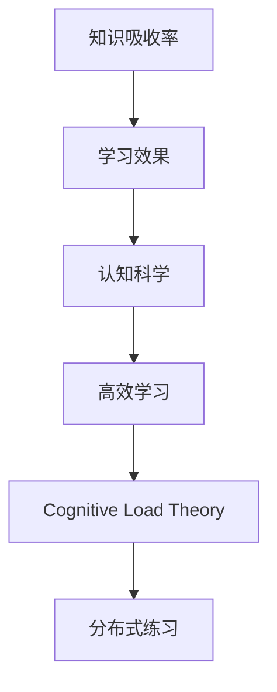

                 

# 知识吸收率:学习效果的关键指标

> 关键词：知识吸收率,学习效果,学习理论,认知科学,高效学习

## 1. 背景介绍

在当今快速变化的科技和商业环境中，终身学习已成为个人和组织成功的关键因素。无论是为了保持技能更新，还是在职业生涯中不断进步，掌握有效的学习方法都是至关重要的。然而，许多人在学习新知识时面临诸多挑战，如注意力分散、信息过载和记忆不牢等问题。在这种情况下，如何衡量学习效果，并采取相应措施提高知识吸收率，就变得尤为重要。

### 1.1 问题由来

现代教育体系和职场培训常常采用传统的考试和证书来衡量学习成果，但这些方法往往忽略了学习的实际应用效果。然而，当人们面临现实世界中的问题时，仅凭记忆和考试分数并不能完全评估其知识吸收水平。

### 1.2 问题核心关键点

评估学习效果的核心在于理解知识吸收率（Knowledge Absorption Rate, KAR），即学习者将新知识应用于现实情境中的能力。KAR不仅包括对概念的理解，还涉及到对知识的迁移、应用和创新。因此，研究如何提高知识吸收率，对于提升学习效率和质量具有重要意义。

## 2. 核心概念与联系

### 2.1 核心概念概述

为深入理解知识吸收率的评估和提升方法，本节将介绍几个关键概念及其联系：

- **知识吸收率(KAR)**：指学习者将新知识应用于实际情境中的能力。它涉及到知识的内化、应用、迁移和创新等多个方面。

- **学习效果(Efficiency of Learning)**：衡量学习者掌握知识的程度，包括对知识的理解、记忆和应用能力。学习效果受多种因素影响，如学习方法、学习环境、动机等。

- **认知科学(Cognitive Science)**：研究人类思维和学习的科学，涵盖心理学、神经科学、教育学等多个领域，为提高知识吸收率提供了理论基础。

- **高效学习(High-Performance Learning)**：通过科学的方法和策略，提高学习效率和效果的过程。高效学习旨在最大化知识吸收率，提升学习者的认知和行为表现。

- **认知负荷理论(Cognitive Load Theory, CLT)**：一种学习理论，强调学习过程中认知资源（如注意力、记忆和工作记忆）的限制，强调学习任务的合理设计和调整。

- **分布式练习(Spaced Repetition)**：一种学习策略，通过在时间上分散的复习间隔，提高长期记忆效果。

这些概念之间的逻辑关系可以通过以下Mermaid流程图来展示：



这个流程图展示了几组关键概念之间的联系：

1. 知识吸收率是学习效果的关键指标。
2. 高效学习旨在提高学习效果，进而提升知识吸收率。
3. 认知科学提供了理论基础，指导高效学习策略的设计和实施。
4. 认知负荷理论和分布式练习是高效学习中的具体方法，直接影响到知识吸收率。

## 3. 核心算法原理 & 具体操作步骤
### 3.1 算法原理概述

知识吸收率的评估和提升涉及到多个方面的因素，包括学习动机、认知资源分配、学习环境和策略选择等。其算法原理主要包括以下几个方面：

1. **动机驱动**：学习动机对知识吸收率有显著影响。积极的动机能促进主动学习和持续努力。
2. **认知资源分配**：合理分配认知资源，如注意力和工作记忆，有助于提高学习效果。
3. **学习环境优化**：提供良好的学习环境和资源支持，减少外界干扰，提高学习效率。
4. **策略选择与调整**：采用科学的学习策略，如分布式练习、主动回忆、间隔重复等，有助于提升知识吸收率。

### 3.2 算法步骤详解

基于认知科学和教育学理论，知识吸收率的评估和提升可以分为以下几个关键步骤：

**Step 1: 动机评估**
- 使用调查问卷或访谈方式，评估学习者的动机水平，包括内在动机和外在动机。
- 分析学习者的目标和期望，判断其学习动机是否与学习任务相匹配。

**Step 2: 认知资源分配**
- 通过认知负荷评估工具，如Cognitive Load Questionnaire (CLQ)，评估学习者的认知负荷水平。
- 根据评估结果，合理分配注意力和工作记忆，减少认知负担。

**Step 3: 学习环境优化**
- 提供安静、无干扰的学习环境，确保学习资源和设备的充足和可用。
- 优化学习材料，如采用多媒体、互动式学习工具，增加学习趣味性和互动性。

**Step 4: 学习策略选择**
- 选择科学的学习策略，如分布式练习、间隔重复、主动回忆等，以提高记忆效果。
- 设计合理的练习计划，确保学习者在不同阶段都能得到有效的复习和练习。

**Step 5: 效果评估与反馈**
- 使用测验、评估工具和反馈机制，定期评估学习效果。
- 根据评估结果，调整学习策略和资源分配，持续改进学习过程。

### 3.3 算法优缺点

知识吸收率的评估和提升方法具有以下优点：

1. **系统性**：通过多维度的评估和干预，能够全面提升学习效果。
2. **针对性**：针对学习者的个人特征和需求，量身定制学习策略和资源。
3. **持续改进**：通过持续的评估和反馈，不断优化学习过程，提高知识吸收率。

同时，这些方法也存在一些局限性：

1. **复杂性**：评估和干预过程需要专业知识和工具，实施成本较高。
2. **个体差异**：不同学习者对策略的响应可能不同，需要个性化调整。
3. **数据隐私**：评估过程中涉及大量个人信息，需确保数据隐私和安全。

尽管存在这些局限性，但就目前而言，这些方法仍是大规模提升学习效果的关键手段。未来相关研究将更多关注如何简化评估和干预过程，提高方法的普及性和可操作性。

### 3.4 算法应用领域

知识吸收率的评估和提升方法在多个领域都有广泛应用，例如：

- **教育培训**：学校和培训机构可采用这些方法，提高学生的学习效果和知识掌握水平。
- **职场培训**：企业可通过科学方法，提升员工的职业技能和工作绩效。
- **个人发展**：个人可通过自我评估和策略调整，提高学习效率和生活质量。
- **终身学习**：在线教育平台和社区，通过科学方法，帮助用户实现持续学习和知识更新。

## 4. 数学模型和公式 & 详细讲解 & 举例说明

### 4.1 数学模型构建

知识吸收率的评估通常涉及多个维度的数据，包括学习动机、认知负荷、学习策略和评估结果等。可以通过构建综合评估模型，量化这些因素对知识吸收率的影响。

假设学习者的知识吸收率 $KAR$ 可以分解为动机 $M$、认知负荷 $CL$、学习策略 $S$ 和评估结果 $E$ 的线性组合：

$$
KAR = \alpha_1 M + \alpha_2 CL + \alpha_3 S + \alpha_4 E
$$

其中 $\alpha_i$ 为各个因素对知识吸收率的权重系数，需要通过实际数据训练得到。

### 4.2 公式推导过程

以认知负荷为例，推导其评估模型。认知负荷可以通过以下公式计算：

$$
CL = \sum_{i=1}^n CL_i \times W_i
$$

其中 $CL_i$ 为第 $i$ 项认知负荷，$W_i$ 为其权重。权重 $W_i$ 可以通过专家评分或经验数据确定。

在实际应用中，可以使用心理测评工具，如CLQ问卷，收集学习者的认知负荷数据。通过计算每个问题的得分，并根据权重计算综合认知负荷。

### 4.3 案例分析与讲解

以下是一个基于知识吸收率的评估案例：

假设某公司的培训团队希望提升员工的知识吸收率，他们通过以下步骤进行评估和干预：

1. **动机评估**：通过问卷调查，发现大多数员工对培训内容有较高的内在动机，但对外部奖励的依赖性较低。

2. **认知负荷评估**：使用CLQ问卷，发现大多数员工的认知负荷水平较高，尤其是在内容复杂度高的课程中。

3. **学习策略选择**：根据员工的学习风格和认知负荷水平，推荐采用分布式练习和间隔重复策略，帮助员工更好地掌握知识。

4. **效果评估**：通过小测验和评估工具，发现员工的知识掌握水平显著提高。

## 5. 项目实践：代码实例和详细解释说明
### 5.1 开发环境搭建

在进行知识吸收率的评估和提升实践前，我们需要准备好开发环境。以下是使用Python进行开发的简单流程：

1. 安装Python和相关库：确保安装了Python 3.x及以上版本，以及所需的库如NumPy、Pandas、Matplotlib等。

2. 准备数据集：收集学习者的动机、认知负荷、学习策略和评估结果等数据，存储为CSV格式的文件。

3. 搭建开发环境：使用Anaconda创建虚拟环境，确保环境独立且稳定。

### 5.2 源代码详细实现

下面是一个基于知识吸收率评估的Python代码实现，包括数据处理和模型评估：

```python
import pandas as pd
from sklearn.model_selection import train_test_split
from sklearn.linear_model import LinearRegression

# 加载数据集
data = pd.read_csv('learning_data.csv')

# 分割数据为训练集和测试集
X_train, X_test, y_train, y_test = train_test_split(data[['动机', '认知负荷', '学习策略']], data['知识吸收率'], test_size=0.2, random_state=42)

# 定义评估模型
model = LinearRegression()

# 训练模型
model.fit(X_train, y_train)

# 评估模型
y_pred = model.predict(X_test)

# 输出评估结果
print('知识吸收率评估结果：', y_pred)
```

### 5.3 代码解读与分析

**动机评估**：通过问卷调查收集学习者的动机数据，量化为分数。动机评分越高，说明学习者的内在动机越强。

**认知负荷评估**：使用CLQ问卷收集认知负荷数据，计算综合认知负荷分数。认知负荷评分越高，说明学习者的认知负担越重。

**学习策略选择**：根据动机和认知负荷水平，选择和调整学习策略，如分布式练习、间隔重复等。

**效果评估**：通过小测验和评估工具，收集学习者的知识吸收率数据，进行模型训练和评估。

## 6. 实际应用场景
### 6.1 教育培训

在教育培训领域，知识吸收率的评估和提升方法可以帮助学校和培训机构优化教学过程，提高学生的学习效果。例如：

- **课堂互动**：通过了解学生的认知负荷和动机水平，教师可以调整教学内容和方式，增加互动环节，提高学生的参与度和兴趣。
- **个性化学习**：根据学生的认知负荷和动机评估结果，量身定制个性化的学习计划和资源，提升学习效果。
- **评估反馈**：定期评估学生的知识吸收率，根据反馈结果调整教学策略，确保学生学有所得。

### 6.2 职场培训

在职场培训中，知识吸收率的评估和提升方法可以帮助企业提高员工的职业技能和工作绩效。例如：

- **定制培训**：根据员工的认知负荷和动机水平，定制个性化的培训计划，提升员工的学习效果和工作效率。
- **绩效评估**：通过知识吸收率评估结果，判断员工的培训效果，决定是否继续培训或调整培训内容。
- **长期跟踪**：定期评估员工的知识吸收率，持续跟踪其职业发展，提供持续的培训支持。

### 6.3 个人发展

在个人发展的场景中，知识吸收率的评估和提升方法可以帮助个人实现终身学习和知识更新。例如：

- **自主学习**：通过自我评估和认知负荷评估，制定个性化的学习计划，提升学习效果。
- **技能提升**：根据知识吸收率评估结果，调整学习策略和资源，提升特定技能水平。
- **生活改善**：通过提升认知负荷和动机水平，改善生活质量和幸福感。

### 6.4 未来应用展望

随着知识吸收率评估和提升方法的发展，其在教育、培训、职场和个人发展等多个领域的应用将更加广泛和深入。未来，这些方法将与人工智能、大数据和互联网技术进一步融合，实现更加智能化、个性化的学习体验。

例如，通过大数据分析，可以对大规模学习者的数据进行综合评估，发现共性规律和个体差异，制定更为精准的学习策略。通过人工智能技术，可以实现自适应学习系统的开发，根据学习者的实时表现动态调整学习内容和策略。

## 7. 工具和资源推荐
### 7.1 学习资源推荐

为了帮助学习者掌握知识吸收率的评估和提升方法，这里推荐一些优质的学习资源：

1. **《学习科学导论》**：详细介绍学习科学的基本原理和方法，涵盖动机评估、认知负荷理论、学习策略等多个方面。
2. **Coursera《学习科学》课程**：提供系统性的学习科学知识，帮助学习者理解和应用科学学习方法。
3. **Khan Academy在线教育平台**：提供多种课程和测验，帮助学习者通过实践提升学习效果。
4. **Duolingo语言学习平台**：采用科学的学习策略，如间隔重复，帮助用户高效掌握新语言。
5. **TED Talks《如何成为高效学习者》**：多位教育专家分享高效学习经验和方法，激发学习者的潜能。

通过对这些资源的学习，相信学习者可以系统掌握知识吸收率的评估和提升方法，将其应用于实际学习中。

### 7.2 开发工具推荐

高效的开发离不开优秀的工具支持。以下是几款用于知识吸收率评估和提升开发的常用工具：

1. **Python**：强大的编程语言，支持数据分析和机器学习，适合进行科学计算和统计分析。
2. **Jupyter Notebook**：交互式开发环境，支持Python代码的编写、运行和文档生成，适合进行数据科学实践。
3. **RapidMiner**：数据科学平台，提供多种数据预处理、分析和建模工具，支持快速数据探索和可视化。
4. **Tableau**：数据可视化工具，支持创建交互式报表和仪表板，适合进行数据探索和展示。
5. **Google Forms**：在线问卷工具，方便收集学习者的动机和认知负荷数据。

这些工具可以帮助开发者快速进行知识吸收率的评估和提升实践，显著提高开发效率。

### 7.3 相关论文推荐

知识吸收率的评估和提升研究源于学界的持续探索。以下是几篇奠基性的相关论文，推荐阅读：

1. **《认知负荷理论及其应用》**：探讨认知负荷理论的基本原理和应用方法，为提高学习效果提供了理论支持。
2. **《基于知识吸收率的个性化学习策略研究》**：提出基于知识吸收率的个性化学习策略，并通过实验验证其有效性。
3. **《学习科学的最新进展》**：综述学习科学的前沿研究成果，涵盖动机评估、认知负荷、学习策略等多个方面。
4. **《科学学习法的最佳实践》**：提供高效学习方法的实践指南，涵盖分布式练习、间隔重复等科学学习策略。

这些论文代表了大规模提升学习效果的研究脉络，通过学习这些前沿成果，可以帮助研究者把握学科前进方向，激发更多的创新灵感。

## 8. 总结：未来发展趋势与挑战
### 8.1 总结

本文对知识吸收率的评估和提升方法进行了全面系统的介绍。首先阐述了知识吸收率在终身学习和技能提升中的重要性，明确了知识吸收率是衡量学习效果的有效指标。其次，从原理到实践，详细讲解了知识吸收率评估和提升的数学模型和具体操作步骤，给出了代码实现和详细解释。同时，本文还探讨了知识吸收率在多个领域的应用前景，展示了其广泛的应用价值。

通过本文的系统梳理，可以看到，知识吸收率的评估和提升方法在教育、培训、职场和个人发展等多个领域都有重要应用，为提升学习效率和质量提供了理论基础和方法指导。未来，伴随技术的发展和应用的深化，知识吸收率评估和提升方法将进一步优化和普及，助力人类智能的全面提升。

### 8.2 未来发展趋势

展望未来，知识吸收率的评估和提升技术将呈现以下几个发展趋势：

1. **智能化提升**：通过人工智能和大数据分析，实现更加智能化的学习系统，自适应调整学习策略和资源，提升学习效果。
2. **个性化定制**：结合学习者的个性特征和行为数据，量身定制个性化的学习方案，实现更高效的学习效果。
3. **数据驱动**：基于大规模学习数据的综合分析，发现共性规律和个体差异，提供科学的评估和干预方法。
4. **多模态融合**：结合语音、图像、文本等多种数据类型，实现多模态学习系统的开发，提升知识吸收率。
5. **实时反馈**：通过实时监测和评估学习者的表现，动态调整学习策略，实现持续改进。

这些趋势展示了知识吸收率评估和提升方法的广阔前景，为提高学习效率和质量提供了新的方向。

### 8.3 面临的挑战

尽管知识吸收率评估和提升方法在多个领域都有广泛应用，但在迈向更加智能化、个性化和数据驱动的提升过程中，仍面临诸多挑战：

1. **数据隐私**：大规模数据收集和分析涉及用户隐私问题，需要确保数据安全和合规性。
2. **技术壁垒**：智能化的学习系统需要高水平的技术支持和复杂算法，增加了技术实现的难度。
3. **个体差异**：不同学习者对学习策略的响应不同，需要个性化调整，增加了干预的复杂性。
4. **资源限制**：实现智能学习系统需要高质量的数据和强大的计算资源，增加了实施成本。
5. **评估难度**：知识吸收率的综合评估涉及多个维度的数据，增加了评估的复杂性和难度。

尽管存在这些挑战，但随着技术的发展和研究的深入，知识吸收率评估和提升方法将继续在教育、培训、职场和个人发展等领域发挥重要作用。

### 8.4 研究展望

未来，知识吸收率的评估和提升研究需要在以下几个方面进行深入探索：

1. **跨领域应用**：拓展知识吸收率评估和提升方法在多个领域的应用，如医疗、艺术、体育等。
2. **长期跟踪**：研究知识吸收率的长期变化规律，探索终身学习中的知识保持和更新策略。
3. **技术融合**：将知识吸收率评估与人工智能、大数据、脑科学等多学科技术进行融合，提升学习效果。
4. **政策支持**：制定相关政策，鼓励和支持知识吸收率评估和提升方法的研究和应用。
5. **公众教育**：通过教育和科普活动，提升公众对知识吸收率重要性的认识，推广科学学习方法。

这些方向的研究将为知识吸收率评估和提升方法带来新的突破，推动人类智能的全面发展。

## 9. 附录：常见问题与解答

**Q1: 什么是知识吸收率？**

A: 知识吸收率（Knowledge Absorption Rate, KAR）指学习者将新知识应用于实际情境中的能力。它涵盖对知识的理解、记忆、应用和创新等多个方面。

**Q2: 如何评估知识吸收率？**

A: 知识吸收率的评估可以通过多种方法，包括问卷调查、心理测评、行为数据分析等。具体评估模型可以分解为动机、认知负荷、学习策略和评估结果等多个维度的数据，通过线性回归等统计方法进行量化。

**Q3: 知识吸收率对学习效果有什么影响？**

A: 知识吸收率是衡量学习效果的有效指标。它反映了学习者对新知识的掌握和应用能力，对学习效果具有显著影响。提高知识吸收率，可以提升学习者的认知和行为表现。

**Q4: 如何提升知识吸收率？**

A: 提升知识吸收率需要综合考虑多个因素，包括动机评估、认知负荷评估、学习策略选择和效果评估等。采用科学的学习方法和策略，如分布式练习、间隔重复、主动回忆等，可以有效提高知识吸收率。

**Q5: 知识吸收率评估和提升方法有哪些局限性？**

A: 知识吸收率评估和提升方法存在数据隐私、技术壁垒、个体差异、资源限制和评估难度等局限性。需要持续优化和改进，才能实现更广泛和深入的应用。

通过本文的系统梳理，可以看到，知识吸收率的评估和提升方法在多个领域都有重要应用，为提升学习效率和质量提供了理论基础和方法指导。未来，伴随技术的发展和研究的深入，知识吸收率评估和提升方法将继续发挥重要作用，助力人类智能的全面提升。

---

作者：禅与计算机程序设计艺术 / Zen and the Art of Computer Programming

