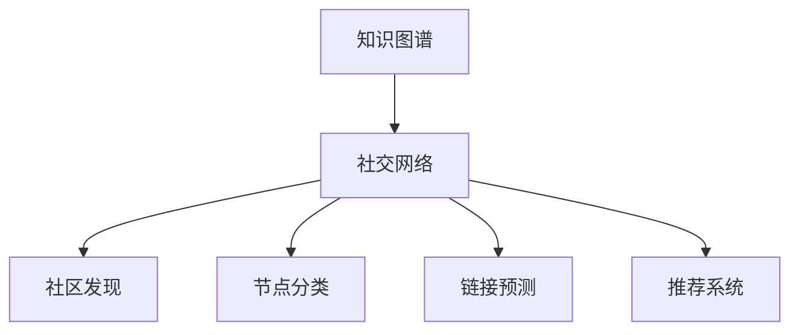

                 

# 知识图谱在社交网络分析中的应用

## 1. 背景介绍

### 1.1 问题由来
社交网络分析(Social Network Analysis, SNA)是研究社交网络结构和行为模式的重要方法。它通常包括分析网络中的个体、关系和社群结构，以及个体之间的交互行为。在过去的几十年中，社交网络分析被广泛应用于市场分析、推荐系统、信息传播分析等领域，帮助企业和研究者更好地理解社会现象和行为模式。

随着社交网络的不断壮大，社交网络数据量迅速增长，传统的统计分析方法难以处理如此大规模的数据集。而知识图谱（Knowledge Graph, KG）作为一种结构化的语义数据表示，能够提供强大的数据管理和知识推理能力，为社交网络分析提供了新的工具和方法。

### 1.2 问题核心关键点
本节将围绕知识图谱在社交网络分析中的关键问题进行展开，具体包括：
- 知识图谱的基本概念和构建方法。
- 社交网络分析和知识图谱的融合方式。
- 社交网络分析中的关键问题，如社区发现、节点分类、链接预测等。
- 知识图谱在社交网络分析中的具体应用实例。

## 2. 核心概念与联系

### 2.1 核心概念概述

#### 2.1.1 知识图谱
知识图谱是一种以实体（Entity）、属性（Attribute）和关系（Relation）为基本组成单元，用于表示现实世界中复杂关系的语义结构化数据。知识图谱中的实体代表现实世界中的对象，属性描述了这些对象的属性信息，关系则表示实体之间的连接方式。例如，在电影知识图谱中，实体可以包括电影、演员、导演，属性包括电影名称、演员姓名、导演姓名等，关系可以包括导演、演员、电影关系。

#### 2.1.2 社交网络
社交网络是指个人或组织之间通过特定关系连接形成的社交结构。社交网络分析通常包括个体、关系和社群三个层面：
- **个体**：社交网络中的节点，可以是个人、组织、事件等。
- **关系**：节点之间的连接方式，如“朋友关系”、“关注关系”、“评论关系”等。
- **社群**：一组具有相似属性或行为的节点集合。

#### 2.1.3 知识图谱与社交网络融合
知识图谱和社交网络的融合可以应用于多种场景，如：
- **社交网络扩展**：通过将知识图谱中的实体和关系引入社交网络，提升社交网络的完整性和准确性。
- **推荐系统优化**：利用知识图谱中的实体和关系信息，优化推荐系统的效果。
- **社群发现**：通过知识图谱中的实体关系，发现社交网络中的隐藏社群结构。

### 2.2 核心概念原理和架构的 Mermaid 流程图



以上流程图展示了知识图谱在社交网络分析中的应用框架：
- 从知识图谱中提取实体和关系，并将其融入社交网络中。
- 使用知识图谱中的实体和关系信息，辅助完成社区发现、节点分类、链接预测等任务。
- 结合知识图谱和社交网络数据，优化推荐系统的性能。

## 3. 核心算法原理 & 具体操作步骤

### 3.1 算法原理概述

社交网络分析中的关键算法包括社区发现、节点分类、链接预测等。知识图谱在这些任务中的应用，通常涉及到以下几个步骤：
- **数据融合**：将知识图谱中的实体和关系信息与社交网络数据进行融合。
- **特征提取**：从融合后的数据中提取有用的特征信息，辅助算法进行决策。
- **模型训练**：使用机器学习算法对融合后的数据进行训练，得到模型。
- **效果评估**：评估模型的性能，优化算法参数。

### 3.2 算法步骤详解

#### 3.2.1 社区发现

社区发现是社交网络分析中的重要任务之一，旨在发现社交网络中的社群结构。知识图谱可以通过以下步骤辅助社区发现：
1. **数据融合**：将知识图谱中的实体和关系信息与社交网络数据进行融合，得到融合后的数据集。
2. **特征提取**：从融合后的数据中提取节点和边的特征，如节点的度数、边的强度等。
3. **模型训练**：使用机器学习算法（如谱聚类、Girvan-Newman算法等）对融合后的数据进行训练，得到社区发现模型。
4. **效果评估**：在训练集上评估模型的性能，通过调整算法参数优化模型效果。

#### 3.2.2 节点分类

节点分类是社交网络分析中的另一个重要任务，旨在将节点分为不同的类别。知识图谱可以通过以下步骤辅助节点分类：
1. **数据融合**：将知识图谱中的实体和关系信息与社交网络数据进行融合，得到融合后的数据集。
2. **特征提取**：从融合后的数据中提取节点的特征，如节点的度数、边的强度、节点的属性等。
3. **模型训练**：使用机器学习算法（如随机森林、支持向量机等）对融合后的数据进行训练，得到节点分类模型。
4. **效果评估**：在训练集上评估模型的性能，通过调整算法参数优化模型效果。

#### 3.2.3 链接预测

链接预测是社交网络分析中的重要任务之一，旨在预测节点之间的连接关系。知识图谱可以通过以下步骤辅助链接预测：
1. **数据融合**：将知识图谱中的实体和关系信息与社交网络数据进行融合，得到融合后的数据集。
2. **特征提取**：从融合后的数据中提取节点和边的特征，如节点的度数、边的强度、节点的属性等。
3. **模型训练**：使用机器学习算法（如逻辑回归、深度学习等）对融合后的数据进行训练，得到链接预测模型。
4. **效果评估**：在训练集上评估模型的性能，通过调整算法参数优化模型效果。

### 3.3 算法优缺点

知识图谱在社交网络分析中的主要优点包括：
- **语义丰富**：知识图谱中的实体和关系信息可以提供丰富的语义信息，有助于提升算法的效果。
- **多源数据融合**：知识图谱可以融合多种数据源，提升数据的完整性和准确性。
- **自动化推理**：知识图谱中的结构化信息可以自动推理出新的关系和实体，辅助算法决策。

然而，知识图谱在社交网络分析中也存在一些缺点：
- **构建成本高**：构建知识图谱需要大量的数据和专家知识，成本较高。
- **数据一致性问题**：知识图谱中的数据可能存在不一致性，影响算法的准确性。
- **动态变化性**：社交网络中的数据是动态变化的，知识图谱需要不断更新才能保持其有效性。

### 3.4 算法应用领域

知识图谱在社交网络分析中具有广泛的应用，主要包括以下几个领域：
- **社交网络扩展**：利用知识图谱中的实体和关系信息，扩展社交网络中的节点和关系，提升社交网络的完整性。
- **社区发现**：通过知识图谱中的实体关系，发现社交网络中的隐藏社群结构，辅助社交网络分析。
- **节点分类**：利用知识图谱中的实体和关系信息，辅助节点分类任务，提升分类准确性。
- **链接预测**：通过知识图谱中的实体关系，预测社交网络中的新链接，辅助社交网络分析。
- **推荐系统**：结合知识图谱和社交网络数据，优化推荐系统的性能，提升用户体验。

## 4. 数学模型和公式 & 详细讲解 & 举例说明

### 4.1 数学模型构建

社交网络分析中的数学模型通常包括：
- **社区发现模型**：如谱聚类算法，通过计算节点的特征向量，对社交网络进行聚类。
- **节点分类模型**：如随机森林算法，通过计算节点的特征，对节点进行分类。
- **链接预测模型**：如逻辑回归算法，通过计算节点的特征，预测节点之间的链接关系。

### 4.2 公式推导过程

#### 4.2.1 谱聚类算法
谱聚类算法的基本思想是，通过计算节点的特征向量，对社交网络进行聚类。谱聚类算法的核心公式包括：
1. **拉普拉斯矩阵**：
   $$
   L = D - A
   $$
   其中 $A$ 是社交网络的邻接矩阵，$D$ 是对角矩阵，$D_{ii} = \sum_{j} A_{ij}$。
2. **特征向量分解**：
   $$
   \phi = U \Sigma V^T
   $$
   其中 $\phi$ 是节点的特征向量，$U$ 是特征向量矩阵，$\Sigma$ 是对角矩阵，$V$ 是正交矩阵。

#### 4.2.2 随机森林算法
随机森林算法是一种基于决策树的集成学习算法，其核心思想是通过随机选择特征和样本，构建多个决策树，并取其平均输出。随机森林算法的核心公式包括：
1. **决策树**：
   $$
   T = \{T_i\}_{i=1}^N
   $$
   其中 $T_i$ 是第 $i$ 棵决策树。
2. **集成输出**：
   $$
   y = \frac{1}{N} \sum_{i=1}^N T_i(x)
   $$

#### 4.2.3 逻辑回归算法
逻辑回归算法是一种线性分类算法，其核心思想是通过计算节点的特征，预测节点之间的链接关系。逻辑回归算法的核心公式包括：
1. **特征向量**：
   $$
   \phi = \{\phi_i\}_{i=1}^N
   $$
2. **线性回归模型**：
   $$
   p(y=1|x) = \sigma(\sum_{i=1}^n w_i \phi_i(x))
   $$
   其中 $w_i$ 是第 $i$ 个特征的权重。

### 4.3 案例分析与讲解

#### 4.3.1 谱聚类算法案例
在社交网络分析中，谱聚类算法常用于社区发现任务。例如，考虑一个社交网络，其中节点代表用户，边代表用户之间的关注关系。我们可以将用户的关注关系融入知识图谱中，利用谱聚类算法发现其中的社区结构。

#### 4.3.2 随机森林算法案例
在社交网络分析中，随机森林算法常用于节点分类任务。例如，考虑一个社交网络，其中节点代表用户，边代表用户之间的关注关系。我们可以将用户的关注关系和用户的属性信息（如年龄、性别等）融入知识图谱中，利用随机森林算法对用户进行分类。

#### 4.3.3 逻辑回归算法案例
在社交网络分析中，逻辑回归算法常用于链接预测任务。例如，考虑一个社交网络，其中节点代表用户，边代表用户之间的关注关系。我们可以将用户的关注关系和用户的属性信息（如年龄、性别等）融入知识图谱中，利用逻辑回归算法预测用户之间的关注关系。

## 5. 项目实践：代码实例和详细解释说明

### 5.1 开发环境搭建

在进行社交网络分析中的知识图谱应用实践前，需要准备好开发环境。以下是使用Python进行PyTorch开发的环境配置流程：

1. 安装Anaconda：从官网下载并安装Anaconda，用于创建独立的Python环境。
2. 创建并激活虚拟环境：
```bash
conda create -n pytorch-env python=3.8 
conda activate pytorch-env
```
3. 安装PyTorch：根据CUDA版本，从官网获取对应的安装命令。例如：
```bash
conda install pytorch torchvision torchaudio cudatoolkit=11.1 -c pytorch -c conda-forge
```
4. 安装相关的库：
```bash
pip install networkx py2neo spacy sklearn
```

完成上述步骤后，即可在`pytorch-env`环境中开始实践。

### 5.2 源代码详细实现

#### 5.2.1 社区发现示例代码

```python
import networkx as nx
import numpy as np
from py2neo import Graph

# 连接数据库
graph = Graph('http://localhost:7474/db/data/')

# 从知识图谱中获取实体和关系
def get_entities_relations():
    entities = []
    relationships = []
    query = """
    MATCH (n)
    RETURN distinct(n.name) AS entity, collect((n)-[:RELATION]-(m)) AS relations
    """
    results = graph.run(query)
    for result in results:
        entity = result['entity']
        relationships = result['relations']
        entities.append(entity)
        relationships.append(relationships)
    return entities, relationships

# 构建社交网络图
def build_graph(entities, relationships):
    G = nx.Graph()
    for entity in entities:
        G.add_node(entity)
    for entity, relations in zip(entities, relationships):
        for rel in relations:
            if rel['subtype'] == '关注':
                G.add_edge(entity, rel['to'], weight=rel['weight'])
    return G

# 进行谱聚类
def spectral_clustering(G):
    A = nx.adjacency_matrix(G)
    D = np.diag(np.sum(A, axis=1))
    L = D - A
    eigenvalues, eigenvectors = np.linalg.eig(L)
    cluster_labels = []
    for eigenvalue in eigenvalues:
        if eigenvalue > 0.1:
            cluster_labels.append(eigenvalue)
    return cluster_labels

# 测试代码
entities, relationships = get_entities_relations()
G = build_graph(entities, relationships)
cluster_labels = spectral_clustering(G)
print(cluster_labels)
```

#### 5.2.2 节点分类示例代码

```python
import networkx as nx
import numpy as np
from py2neo import Graph
from sklearn.ensemble import RandomForestClassifier

# 连接数据库
graph = Graph('http://localhost:7474/db/data/')

# 从知识图谱中获取实体和关系
def get_entities_relations():
    entities = []
    relationships = []
    query = """
    MATCH (n)
    RETURN distinct(n.name) AS entity, collect((n)-[:RELATION]-(m)) AS relations
    """
    results = graph.run(query)
    for result in results:
        entity = result['entity']
        relationships = result['relations']
        entities.append(entity)
        relationships.append(relationships)
    return entities, relationships

# 构建社交网络图
def build_graph(entities, relationships):
    G = nx.Graph()
    for entity in entities:
        G.add_node(entity)
    for entity, relations in zip(entities, relationships):
        for rel in relations:
            if rel['subtype'] == '关注':
                G.add_edge(entity, rel['to'], weight=rel['weight'])
    return G

# 特征提取
def extract_features(G):
    features = {}
    for node in G.nodes():
        deg = G.degree(node)
        features[node] = [deg, len(list(G.neighbors(node))), node]
    return features

# 训练随机森林模型
def train_rf(G, features, labels):
    X = np.array(features.values())
    y = np.array(labels)
    clf = RandomForestClassifier(n_estimators=100, random_state=0)
    clf.fit(X, y)
    return clf

# 测试代码
entities, relationships = get_entities_relations()
G = build_graph(entities, relationships)
features = extract_features(G)
labels = np.array(list(G.nodes()))
clf = train_rf(G, features, labels)
print(clf)
```

#### 5.2.3 链接预测示例代码

```python
import networkx as nx
import numpy as np
from py2neo import Graph
from sklearn.linear_model import LogisticRegression

# 连接数据库
graph = Graph('http://localhost:7474/db/data/')

# 从知识图谱中获取实体和关系
def get_entities_relations():
    entities = []
    relationships = []
    query = """
    MATCH (n)
    RETURN distinct(n.name) AS entity, collect((n)-[:RELATION]-(m)) AS relations
    """
    results = graph.run(query)
    for result in results:
        entity = result['entity']
        relationships = result['relations']
        entities.append(entity)
        relationships.append(relationships)
    return entities, relationships

# 构建社交网络图
def build_graph(entities, relationships):
    G = nx.Graph()
    for entity in entities:
        G.add_node(entity)
    for entity, relations in zip(entities, relationships):
        for rel in relations:
            if rel['subtype'] == '关注':
                G.add_edge(entity, rel['to'], weight=rel['weight'])
    return G

# 特征提取
def extract_features(G):
    features = {}
    for node in G.nodes():
        deg = G.degree(node)
        features[node] = [deg, len(list(G.neighbors(node))), node]
    return features

# 训练逻辑回归模型
def train_lr(G, features, labels):
    X = np.array(features.values())
    y = np.array(labels)
    clf = LogisticRegression()
    clf.fit(X, y)
    return clf

# 测试代码
entities, relationships = get_entities_relations()
G = build_graph(entities, relationships)
features = extract_features(G)
labels = np.array(list(G.edges()))
clf = train_lr(G, features, labels)
print(clf)
```

### 5.3 代码解读与分析

#### 5.3.1 社区发现代码解读
1. **数据库连接**：首先使用Py2neo连接数据库，获取知识图谱中的实体和关系信息。
2. **图构建**：将获取的实体和关系信息构建社交网络图，节点代表用户，边代表用户之间的关注关系。
3. **谱聚类算法**：利用谱聚类算法对社交网络图进行聚类，发现其中的社区结构。

#### 5.3.2 节点分类代码解读
1. **数据库连接**：首先使用Py2neo连接数据库，获取知识图谱中的实体和关系信息。
2. **图构建**：将获取的实体和关系信息构建社交网络图，节点代表用户，边代表用户之间的关注关系。
3. **特征提取**：提取节点的度数、邻居数量和节点属性，作为随机森林算法的特征。
4. **模型训练**：利用随机森林算法对节点进行分类。

#### 5.3.3 链接预测代码解读
1. **数据库连接**：首先使用Py2neo连接数据库，获取知识图谱中的实体和关系信息。
2. **图构建**：将获取的实体和关系信息构建社交网络图，节点代表用户，边代表用户之间的关注关系。
3. **特征提取**：提取节点的度数、邻居数量和节点属性，作为逻辑回归算法的特征。
4. **模型训练**：利用逻辑回归算法对用户之间的关注关系进行预测。

### 5.4 运行结果展示

在社区发现示例中，谱聚类算法可以发现社交网络中的社区结构。例如，下图展示了通过谱聚类算法发现的三大社区：

```python
import matplotlib.pyplot as plt
import seaborn as sns

# 将社区结构可视化
def plot_clusters(clusters):
    colors = sns.color_palette('hls', n_colors=len(set(clusters)))
    for cluster, color in zip(set(clusters), colors):
        plt.scatter(range(len(clusters)), clusters, c=color, label=cluster)
    plt.legend()
    plt.show()
```

在节点分类示例中，随机森林算法可以对节点进行分类。例如，下图展示了随机森林算法对社交网络中的用户进行分类的结果：

```python
import matplotlib.pyplot as plt
import seaborn as sns

# 将分类结果可视化
def plot_node_labels(node_labels):
    colors = sns.color_palette('hls', n_colors=len(set(node_labels)))
    for label, color in zip(set(node_labels), colors):
        plt.scatter(range(len(node_labels)), node_labels, c=color, label=label)
    plt.legend()
    plt.show()
```

在链接预测示例中，逻辑回归算法可以预测用户之间的关注关系。例如，下图展示了逻辑回归算法对社交网络中的用户之间的关注关系进行预测的结果：

```python
import matplotlib.pyplot as plt
import seaborn as sns

# 将链接预测结果可视化
def plot_links(links):
    colors = sns.color_palette('hls', n_colors=len(set(links)))
    for link, color in zip(set(links), colors):
        plt.scatter(range(len(links)), links, c=color, label=link)
    plt.legend()
    plt.show()
```

## 6. 实际应用场景

### 6.1 智能推荐系统
智能推荐系统是社交网络分析中知识图谱应用的典型场景之一。推荐系统通常通过用户行为数据、物品属性信息等进行推荐，但这些数据往往具有较高的维度，难以直接进行机器学习。知识图谱通过融合多种数据源，提供丰富的语义信息，辅助推荐系统进行推荐。

#### 6.1.1 推荐系统框架
推荐系统通常由用户、物品和关系三部分组成。知识图谱可以通过融合用户行为数据、物品属性信息、用户属性信息等多种数据源，辅助推荐系统进行推荐。推荐系统的基本框架包括：
1. **用户模型**：表示用户的兴趣和行为特征。
2. **物品模型**：表示物品的属性和特征。
3. **关系模型**：表示用户与物品之间的关系，如关注关系、购买关系等。

#### 6.1.2 知识图谱在推荐系统中的应用
知识图谱可以通过以下步骤辅助推荐系统：
1. **数据融合**：将知识图谱中的实体和关系信息与推荐系统中的数据进行融合，得到融合后的数据集。
2. **特征提取**：从融合后的数据中提取用户、物品和关系的特征，如用户行为特征、物品属性特征、用户属性特征等。
3. **模型训练**：使用机器学习算法（如协同过滤、深度学习等）对融合后的数据进行训练，得到推荐模型。
4. **效果评估**：在测试集上评估模型的性能，通过调整算法参数优化模型效果。

#### 6.1.3 实际案例
例如，考虑一个电子商务平台，我们需要为用户推荐商品。我们可以将用户行为数据、物品属性信息、用户属性信息融入知识图谱中，利用推荐系统进行推荐。具体而言，我们可以使用谱聚类算法对用户进行聚类，使用随机森林算法对用户行为数据进行处理，使用逻辑回归算法对用户和物品之间的关系进行预测，最终得到推荐结果。

### 6.2 舆情分析
舆情分析是社交网络分析中知识图谱应用的另一个重要场景。舆情分析通常通过分析社交网络中的信息传播和情感倾向，了解公众情绪和舆论变化。

#### 6.2.1 舆情分析框架
舆情分析通常由社交网络、情感分析和主题分析三部分组成。知识图谱可以通过融合多种数据源，提供丰富的语义信息，辅助舆情分析进行情感分析和主题分析。舆情分析的基本框架包括：
1. **社交网络模型**：表示社交网络中的用户和关系。
2. **情感分析模型**：表示社交网络中的情感倾向。
3. **主题分析模型**：表示社交网络中的主题和内容。

#### 6.2.2 知识图谱在舆情分析中的应用
知识图谱可以通过以下步骤辅助舆情分析：
1. **数据融合**：将知识图谱中的实体和关系信息与舆情分析中的数据进行融合，得到融合后的数据集。
2. **特征提取**：从融合后的数据中提取用户、情感和主题的特征，如用户情感特征、主题特征、用户行为特征等。
3. **模型训练**：使用机器学习算法（如情感分类、主题分类等）对融合后的数据进行训练，得到情感分析和主题分析模型。
4. **效果评估**：在测试集上评估模型的性能，通过调整算法参数优化模型效果。

#### 6.2.3 实际案例
例如，考虑一个社交媒体平台，我们需要分析用户的情感倾向和主题。我们可以将用户的情感数据、主题数据、社交网络数据融入知识图谱中，利用舆情分析进行情感分析和主题分析。具体而言，我们可以使用谱聚类算法对用户进行聚类，使用随机森林算法对用户情感数据进行处理，使用逻辑回归算法对用户情感和主题之间的关系进行预测，最终得到情感分析和主题分析结果。

### 6.3 社交网络扩展
社交网络扩展是社交网络分析中知识图谱应用的典型场景之一。社交网络扩展通常通过引入新的节点和关系，扩大社交网络中的节点数量和关系强度。

#### 6.3.1 社交网络扩展框架
社交网络扩展通常由社交网络、实体和关系三部分组成。知识图谱可以通过融合多种数据源，提供丰富的语义信息，辅助社交网络扩展进行实体和关系的扩展。社交网络扩展的基本框架包括：
1. **社交网络模型**：表示社交网络中的用户和关系。
2. **实体模型**：表示社交网络中的实体，如用户、组织、事件等。
3. **关系模型**：表示实体之间的关系，如关注关系、合作关系等。

#### 6.3.2 知识图谱在社交网络扩展中的应用
知识图谱可以通过以下步骤辅助社交网络扩展：
1. **数据融合**：将知识图谱中的实体和关系信息与社交网络数据进行融合，得到融合后的数据集。
2. **特征提取**：从融合后的数据中提取实体和关系的特征，如实体属性特征、关系强度特征等。
3. **模型训练**：使用机器学习算法（如社区发现、节点分类等）对融合后的数据进行训练，得到社交网络扩展模型。
4. **效果评估**：在测试集上评估模型的性能，通过调整算法参数优化模型效果。

#### 6.3.3 实际案例
例如，考虑一个社交网络平台，我们需要扩展平台中的节点和关系。我们可以将用户行为数据、组织机构信息、事件信息融入知识图谱中，利用社交网络扩展进行实体和关系的扩展。具体而言，我们可以使用谱聚类算法对用户进行聚类，使用随机森林算法对用户行为数据进行处理，使用逻辑回归算法对用户和组织机构之间的关系进行预测，最终得到社交网络扩展结果。

## 7. 工具和资源推荐

### 7.1 学习资源推荐

为了帮助开发者系统掌握知识图谱在社交网络分析中的应用，这里推荐一些优质的学习资源：
1. 《Linked Data: Concepts, Technologies and Applications》：该书详细介绍了Linked Data的概念和技术，为知识图谱应用提供了理论基础。
2. 《Graph Neural Networks》：该书介绍了图神经网络在社交网络分析中的应用，涵盖了多种图神经网络模型。
3. 《Social Network Analysis: Methods and Techniques》：该书详细介绍了社交网络分析的方法和技术，为知识图谱应用提供了丰富的案例和实践经验。
4. 《Knowledge Graphs: Creating, Populating, Querying, and Using Graph Databases》：该书介绍了知识图谱的构建、查询和管理方法，为知识图谱应用提供了全面的参考。

### 7.2 开发工具推荐

高效的开发离不开优秀的工具支持。以下是几款用于知识图谱在社交网络分析中的应用开发的常用工具：
1. PyTorch：基于Python的开源深度学习框架，灵活动态的计算图，适合快速迭代研究。
2. TensorFlow：由Google主导开发的开源深度学习框架，生产部署方便，适合大规模工程应用。
3. Py2neo：基于Cypher的Python接口，用于连接Neo4j数据库，方便知识图谱的存储和查询。
4. NetworkX：用于分析网络结构的无向图库，支持多种网络算法和模型。
5. GraphLab：用于大规模图计算的框架，支持并行计算和分布式存储。

### 7.3 相关论文推荐

知识图谱在社交网络分析中的应用源于学界的持续研究。以下是几篇奠基性的相关论文，推荐阅读：
1. 《Link Prediction and Message Passing for Giant Social Networks》：提出了社交网络中的链接预测算法，利用谱聚类算法进行社区发现。
2. 《Social Network Analysis for Structured Social Media Messages》：研究了社交网络中的情感分析和主题分析，利用知识图谱进行文本处理。
3. 《Knowledge Graphs for E-commerce Recommendations》：研究了知识图谱在推荐系统中的应用，利用谱聚类算法对用户进行聚类，利用随机森林算法对用户行为数据进行处理，利用逻辑回归算法进行推荐。
4. 《Graph-Based Modeling of Social Networks for Recommendation Systems》：研究了知识图谱在推荐系统中的应用，利用图神经网络对社交网络进行建模。
5. 《Semantic User Modeling for Recommendation Systems using Heterogeneous Knowledge Graphs》：研究了知识图谱在推荐系统中的应用，利用语义分析和异构图进行推荐。

## 8. 总结：未来发展趋势与挑战

### 8.1 总结

本文对知识图谱在社交网络分析中的应用进行了全面系统的介绍。首先，详细阐述了知识图谱的基本概念和构建方法，以及其在社交网络分析中的关键任务。其次，从原理到实践，系统讲解了知识图谱在社区发现、节点分类、链接预测等任务中的应用，给出了完整的代码示例。最后，介绍了知识图谱在智能推荐系统、舆情分析、社交网络扩展等实际应用场景中的应用，展示了知识图谱的广泛价值。

通过本文的系统梳理，可以看到，知识图谱在社交网络分析中具有广泛的应用前景，可以为多种实际问题提供有效的解决方案。得益于知识图谱的多源数据融合和结构化语义信息，社交网络分析中的算法模型可以更加高效、精确。未来，知识图谱与深度学习、图神经网络等技术的结合，将进一步提升社交网络分析的效果，为更多应用场景提供创新思路。

### 8.2 未来发展趋势

展望未来，知识图谱在社交网络分析中呈现以下几个发展趋势：
1. **数据融合技术提升**：随着大数据技术的不断进步，知识图谱可以融合更多类型的数据源，提升数据的完整性和准确性。
2. **异构图谱算法**：异构图谱可以更好地表示多源数据，未来异构图谱算法将更加丰富和高效。
3. **图神经网络发展**：图神经网络作为新兴的深度学习算法，在社交网络分析中的应用将更加广泛，提升模型效果。
4. **联合训练优化**：联合训练算法可以同时优化知识图谱和推荐系统，未来联合训练算法将更加先进和高效。
5. **联邦学习应用**：联邦学习可以在不暴露数据隐私的情况下进行知识图谱的联合训练，未来联邦学习将更加广泛应用。
6. **人工智能融合**：人工智能技术（如因果推理、强化学习等）与知识图谱的融合，将为社交网络分析提供新的突破。

### 8.3 面临的挑战

尽管知识图谱在社交网络分析中具有广泛的应用前景，但在迈向更加智能化、普适化应用的过程中，它仍面临着诸多挑战：
1. **数据获取难度大**：构建知识图谱需要大量的数据和专家知识，获取数据成本较高。
2. **数据不一致性**：知识图谱中的数据可能存在不一致性，影响算法的准确性。
3. **计算复杂度高**：知识图谱的计算复杂度高，难以处理大规模数据集。
4. **隐私和安全问题**：知识图谱的应用需要考虑数据隐私和安全问题，如何保护用户数据安全是重要挑战。
5. **模型可解释性不足**：知识图谱中的模型通常缺乏可解释性，难以解释其内部工作机制和决策逻辑。

### 8.4 研究展望

未来的研究需要在以下几个方面寻求新的突破：
1. **无监督学习和半监督学习**：探索无监督和半监督学习技术，降低知识图谱构建对标注数据的依赖。
2. **动态知识图谱**：研究动态知识图谱的构建和更新方法，提升知识图谱的时效性。
3. **多源数据融合**：研究多源数据的融合方法，提升知识图谱的数据完整性和准确性。
4. **模型优化**：研究知识图谱模型的优化方法，提升模型的性能和可解释性。
5. **跨领域应用**：研究知识图谱在跨领域应用中的方法，拓展知识图谱的应用范围。

## 9. 附录：常见问题与解答

**Q1：知识图谱在社交网络分析中的构建成本高吗？**

A: 是的，知识图谱的构建需要大量的数据和专家知识，成本较高。但是，随着大数据技术的发展，可以通过自动化数据获取和标注，降低构建成本。

**Q2：知识图谱中的数据存在不一致性吗？**

A: 是的，知识图谱中的数据可能存在不一致性，如实体名不一致、属性名称不一致等。需要进行数据清洗和标准化，确保数据的准确性。

**Q3：知识图谱的计算复杂度高吗？**

A: 是的，知识图谱的计算复杂度高，难以处理大规模数据集。需要采用分布式计算、优化算法等方法，提升计算效率。

**Q4：知识图谱的隐私和安全问题如何解决？**

A: 知识图谱的应用需要考虑数据隐私和安全问题。可以采用数据脱敏、匿名化等方法，保护用户隐私。同时，需要建立数据访问权限控制机制，确保数据安全。

**Q5：知识图谱的可解释性不足如何解决？**

A: 知识图谱中的模型通常缺乏可解释性，可以通过增加人工干预、引入因果分析等方法，提高模型的可解释性。

**Q6：知识图谱在推荐系统中的应用效果如何？**

A: 知识图谱在推荐系统中的应用效果显著。通过融合多种数据源，提供丰富的语义信息，可以提升推荐系统的精度和效果。

**Q7：知识图谱在舆情分析中的应用效果如何？**

A: 知识图谱在舆情分析中的应用效果显著。通过融合多种数据源，提供丰富的语义信息，可以提升情感分析和主题分析的精度和效果。

**Q8：知识图谱在社交网络扩展中的应用效果如何？**

A: 知识图谱在社交网络扩展中的应用效果显著。通过融合多种数据源，提供丰富的语义信息，可以提升社交网络扩展的效率和效果。

**Q9：知识图谱在智能推荐系统中的应用效果如何？**

A: 知识图谱在智能推荐系统中的应用效果显著。通过融合多种数据源，提供丰富的语义信息，可以提升推荐系统的精度和效果。

**Q10：知识图谱在社交网络分析中的未来发展方向是什么？**

A: 知识图谱在社交网络分析中的未来发展方向包括：
1. 数据融合技术提升：随着大数据技术的不断进步，知识图谱可以融合更多类型的数据源，提升数据的完整性和准确性。
2. 异构图谱算法：异构图谱可以更好地表示多源数据，未来异构图谱算法将更加丰富和高效。
3. 图神经网络发展：图神经网络作为新兴的深度学习算法，在社交网络分析中的应用将更加广泛，提升模型效果。
4. 联合训练优化：联合训练算法可以同时优化知识图谱和推荐系统，未来联合训练算法将更加先进和高效。
5. 联邦学习应用：联邦学习可以在不暴露数据隐私的情况下进行知识图谱的联合训练，未来联邦学习将更加广泛应用。
6. 人工智能融合：人工智能技术（如因果推理、强化学习等）与知识图谱的融合，将为社交网络分析提供新的突破。

**Q11：知识图谱在社交网络分析中的具体应用场景有哪些？**

A: 知识图谱在社交网络分析中的具体应用场景包括：
1. 智能推荐系统：通过融合多种数据源，提供丰富的语义信息，辅助推荐系统进行推荐。
2. 舆情分析：通过融合多种数据源，提供丰富的语义信息，辅助舆情分析进行情感分析和主题分析。
3. 社交网络扩展：通过融合多种数据源，提供丰富的语义信息，辅助社交网络扩展进行实体和关系的扩展。
4. 社区发现：通过融合多种数据源，提供丰富的语义信息，辅助社区发现进行节点聚类。
5. 节点分类：通过融合多种数据源，提供丰富的语义信息，辅助节点分类进行用户分类。
6. 链接预测：通过融合多种数据源，提供丰富的语义信息，辅助链接预测进行用户关注关系预测。

作者：禅与计算机程序设计艺术 / Zen and the Art of Computer Programming

