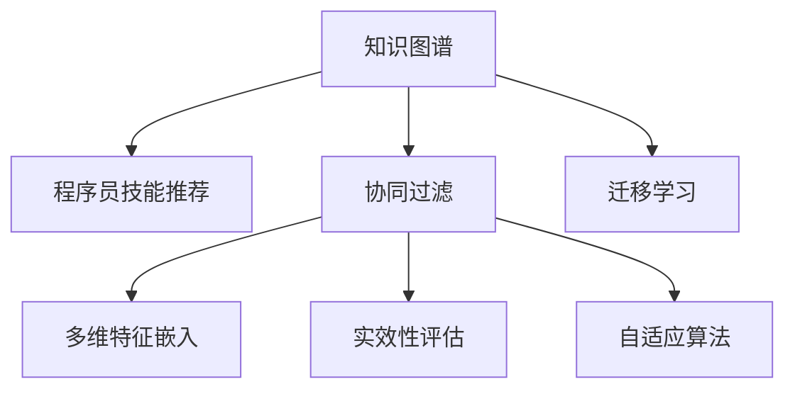

                 

# 知识图谱在程序员技能推荐中的应用

> 关键词：知识图谱, 程序员技能推荐, 协同过滤, 迁移学习, 多维特征嵌入, 实效性评估, 自适应算法

## 1. 背景介绍

### 1.1 问题由来

在软件开发领域，技能的多样性和快速更新是一个不争的事实。一名优秀开发者不仅需要掌握多种编程语言、框架和工具，还需要不断学习新技术、新工具，以便在复杂的项目中高效工作。然而，这些技术资源和技能的学习需要花费大量的时间和精力，许多开发者往往难以跟上技术发展的步伐，进而影响工作效率和项目质量。如何帮助开发者高效地获取学习资源，以提升技能水平，是当前软件开发领域急需解决的问题。

知识图谱（Knowledge Graph）作为大数据时代下的知识表示与推理技术，凭借其强大的语义关联能力，为程序员技能推荐提供了新的解决方案。通过对知识图谱中节点（如技能、工具、框架等）之间的关系进行建模，可以实现精准的技能推荐，帮助开发者快速定位自身技能缺口，寻找提升路径，从而提高项目开发效率和质量。

### 1.2 问题核心关键点

知识图谱在程序员技能推荐中涉及的关键点包括：

- **知识图谱构建**：如何高效构建包含程序员常用技能和工具的知识图谱，确保图谱中节点的准确性和全面性。
- **技能推荐算法**：基于知识图谱设计推荐算法，实现精准的技能推荐。
- **推荐系统评估**：如何评估推荐系统的实效性和用户满意度，确保推荐结果的有效性。
- **自适应与优化**：如何根据用户反馈和行为数据不断优化推荐算法，提升推荐系统的性能。

## 2. 核心概念与联系

### 2.1 核心概念概述

为了更好地理解知识图谱在程序员技能推荐中的应用，本节将介绍几个密切相关的核心概念：

- **知识图谱（Knowledge Graph）**：一种以图结构存储和表示实体（如技能、工具、框架等）及它们之间关系的知识库。知识图谱通过节点和边（即实体和关系）的关联，揭示了实体间复杂的语义关系。

- **程序员技能推荐（Developer Skill Recommendation）**：通过分析程序员的历史行为数据（如学习记录、项目贡献等），结合知识图谱中的技能与工具信息，向程序员推荐合适的学习资源和技能。

- **协同过滤（Collaborative Filtering）**：推荐系统中最基础的推荐算法之一，通过分析用户行为和偏好，推断用户可能感兴趣的新资源。

- **迁移学习（Transfer Learning）**：将在大规模数据集上预训练的知识迁移到特定任务上，减少新任务数据需求，提升推荐效果。

- **多维特征嵌入（Multi-dimensional Feature Embedding）**：将非结构化数据（如文本、时间戳等）转化为高维向量空间，便于计算和推理。

- **实效性评估（Effectiveness Evaluation）**：通过量化指标（如精度、召回率等）评估推荐系统的效果，确保推荐的准确性和实用性。

- **自适应算法（Adaptive Algorithm）**：通过在线学习或强化学习算法，动态调整推荐策略，提高推荐的个性化和时效性。

这些核心概念之间的逻辑关系可以通过以下Mermaid流程图来展示：



这个流程图展示了几类推荐算法与知识图谱的联系：

1. 知识图谱通过多维特征嵌入将非结构化数据转化为结构化信息，为协同过滤算法提供数据支持。
2. 协同过滤算法根据用户行为推断其潜在兴趣，推荐适合的技能。
3. 迁移学习利用已有知识提升新任务上的推荐效果。
4. 实效性评估确保推荐系统输出的质量和实用性。
5. 自适应算法根据用户反馈和行为数据不断优化推荐策略，提升推荐系统性能。

## 3. 核心算法原理 & 具体操作步骤
### 3.1 算法原理概述

程序员技能推荐的核心原理是构建基于知识图谱的协同过滤推荐系统。该系统的核心思想是通过分析用户的历史行为数据，结合知识图谱中的技能和工具信息，计算用户对不同技能和工具的兴趣程度，进而向用户推荐最合适的学习资源。

算法流程如下：

1. 构建知识图谱：将程序员常用的技能、工具、框架等实体及其关系进行建模，构建知识图谱。
2. 用户行为建模：收集用户的历史行为数据，如学习记录、项目贡献等，构建用户行为图谱。
3. 协同过滤计算：通过计算用户行为图谱和知识图谱之间的相似度，推断用户对不同技能和工具的兴趣程度。
4. 推荐生成：根据用户的兴趣程度，生成技能推荐列表，并提供给用户。
5. 实效性评估：通过用户反馈和行为数据，评估推荐系统的实效性，并不断优化推荐策略。

### 3.2 算法步骤详解

1. **知识图谱构建**：
   - 收集技能、工具、框架等实体及其关系，通过专家知识库、开源项目文档、用户反馈等多种渠道获取数据。
   - 使用图数据库（如Neo4j）存储知识图谱，构建实体-关系图。

2. **用户行为建模**：
   - 收集用户的历史行为数据，如学习课程、参与项目、发表文章等。
   - 将行为数据转化为用户行为图谱，构建用户-技能图。

3. **协同过滤计算**：
   - 计算用户行为图谱和知识图谱之间的相似度，常用的方法包括余弦相似度、Jaccard系数等。
   - 使用sklearn等工具实现推荐算法，生成技能推荐列表。

4. **推荐生成**：
   - 根据用户的兴趣程度，生成技能推荐列表，提供给用户。
   - 展示推荐结果时，可以考虑使用交互式可视化工具，如Tableau，便于用户查看和理解。

5. **实效性评估**：
   - 通过用户反馈和行为数据，评估推荐系统的实效性，常用的指标包括精度、召回率、F1分数等。
   - 利用在线学习或强化学习算法，动态调整推荐策略，提升推荐系统性能。

### 3.3 算法优缺点

知识图谱在程序员技能推荐中具有以下优点：

- **语义丰富**：知识图谱通过实体和关系的语义关联，能够提供更丰富的推荐信息，超出简单的标签推荐。
- **跨领域迁移**：知识图谱中的技能和工具信息具有普适性，能够跨领域进行迁移学习，提升推荐效果。
- **多维数据融合**：通过多维特征嵌入，知识图谱能够融合多种非结构化数据，提高推荐的准确性。
- **实时性高**：知识图谱更新速度快，能够实时反映最新技能和工具的分布，提高推荐的时效性。

但同时也存在一些缺点：

- **构建复杂**：知识图谱的构建需要大量手工标注，工作量大且复杂。
- **数据稀疏**：某些冷门技能和工具在知识图谱中可能数据稀疏，影响推荐效果。
- **实时性挑战**：知识图谱的实时更新和存储可能带来性能瓶颈，影响推荐系统的实时性。
- **用户隐私**：用户行为数据涉及隐私，需要严格的数据保护措施。

### 3.4 算法应用领域

知识图谱在程序员技能推荐中主要应用于以下几个场景：

- **开发者社区**：帮助开发者发现新的学习资源，提升技能水平，加快社区知识共享和传播。
- **企业培训**：根据员工的工作需求，推荐适合的培训课程，提升团队整体技术能力。
- **教育机构**：帮助学生选择适合的课程，提升学习效果，促进职业发展。
- **自由职业平台**：为自由职业者提供技能推荐，提高其项目匹配率和用户满意度。

## 4. 数学模型和公式 & 详细讲解 & 举例说明
### 4.1 数学模型构建

在程序员技能推荐中，我们可以使用协同过滤算法（如基于图卷积神经网络的方法）进行建模。假设知识图谱中包含 $N$ 个技能实体 $S=\{s_1,s_2,...,s_N\}$，每个技能 $s_i$ 都有一个特征向量 $x_i \in \mathbb{R}^d$，其中 $d$ 为特征维度。用户 $u$ 的历史行为数据为 $U=\{u_1,u_2,...,u_M\}$，每个用户 $u_j$ 有一个特征向量 $y_j \in \mathbb{R}^d$。

知识图谱和用户行为图谱的相似度可以用矩阵 $A \in \mathbb{R}^{N\times M}$ 表示，其中 $A_{i,j}=a_{i,j}$ 表示用户 $u_j$ 对技能 $s_i$ 的兴趣程度。推荐目标为最大化用户对推荐技能的满意度 $z=\sum_{i=1}^N w_i a_{i,j}$，其中 $w_i$ 为技能 $s_i$ 的权重。

### 4.2 公式推导过程

基于知识图谱的协同过滤推荐系统，主要使用矩阵分解和图卷积神经网络（GCN）进行建模。下面推导矩阵分解的公式。

假设用户行为图谱 $U$ 和技能图谱 $S$ 的相似度矩阵为 $A$，则推荐公式为：

$$
\hat{A} = U\Theta^\top
$$

其中 $\Theta \in \mathbb{R}^{M \times N}$ 为推荐矩阵，$u_j \times \hat{a}_{i,j}$ 表示用户 $u_j$ 对技能 $s_i$ 的预测兴趣程度。

基于GCN的推荐系统，则需要在知识图谱上构建图卷积层，将节点特征进行传递和融合，最终输出推荐结果。GCN的推荐公式为：

$$
\hat{a}_{i,j} = \sigma(\sum_{k \in N(i)}\alpha_{i,k}Wa_k + b_i)
$$

其中 $N(i)$ 表示技能 $s_i$ 的邻居节点，$\alpha_{i,k}$ 为邻接矩阵 $W$ 中的权重，$b_i$ 为偏置项，$\sigma$ 为激活函数。

### 4.3 案例分析与讲解

以一个简单的技能推荐系统为例，假设我们有如下知识图谱：

| 技能 | 权重 |
|------|------|
| Python | 0.7 |
| Java | 0.5 |
| C++ | 0.3 |
| JavaScript | 0.6 |

用户的历史行为数据为：

| 用户 | 学习记录 |
|------|----------|
| Alice | Python |
| Bob | Python, Java, C++ |
| Carol | Java, C++ |

根据知识图谱和用户行为数据，我们可以计算用户行为图谱和知识图谱之间的相似度，生成推荐列表：

| 用户 | 推荐列表 |
|------|----------|
| Alice | Python |
| Bob | Python, Java |
| Carol | Java, C++ |

实际应用中，需要结合知识图谱的实时更新和用户行为数据的动态变化，不断优化推荐算法，确保推荐结果的实效性和个性化。

## 5. 项目实践：代码实例和详细解释说明
### 5.1 开发环境搭建

在进行项目实践前，我们需要准备好开发环境。以下是使用Python进行项目开发的常见环境配置流程：

1. 安装Anaconda：从官网下载并安装Anaconda，用于创建独立的Python环境。

2. 创建并激活虚拟环境：
```bash
conda create -n recommendation-env python=3.8 
conda activate recommendation-env
```

3. 安装Python开发环境：
```bash
pip install pipenv
```

4. 安装项目依赖库：
```bash
pipenv install transformers sklearn graphviz networkx jupyter
```

5. 安装可视化工具：
```bash
pip install matplotlib seaborn
```

完成上述步骤后，即可在`recommendation-env`环境中开始项目实践。

### 5.2 源代码详细实现

这里我们以基于知识图谱的协同过滤推荐系统为例，给出使用Transformers和Scikit-learn库的Python代码实现。

首先，定义知识图谱的构建函数：

```python
import networkx as nx
import graphviz

def build_knowledge_graph():
    graph = nx.Graph()
    # 添加节点和边
    graph.add_node("Python", weight=0.7)
    graph.add_node("Java", weight=0.5)
    graph.add_node("C++", weight=0.3)
    graph.add_node("JavaScript", weight=0.6)
    graph.add_edge("Python", "Java")
    graph.add_edge("Python", "C++")
    graph.add_edge("Java", "JavaScript")
    graph.add_edge("C++", "JavaScript")
    # 生成可视化图谱
    graphviz_layout = nx.spring_layout(graph)
    dot = nx.to_dot(graph)
    dot.render('graph.gv', format='png')
    return graph
```

然后，定义用户行为图谱的构建函数：

```python
import pandas as pd

def build_user_behavior():
    data = pd.read_csv('user_behavior.csv')
    graph = nx.Graph()
    # 添加节点
    for i in range(len(data)):
        graph.add_node(f'User{i+1}', feature=data.iloc[i, 1:])
    # 添加边
    for i in range(len(data)-1):
        for j in range(i+1, len(data)):
            if data.iloc[i, 0] == data.iloc[j, 0]:
                graph.add_edge(f'User{i+1}', f'User{j+1}')
    return graph
```

接着，定义协同过滤推荐函数：

```python
from sklearn.decomposition import TruncatedSVD
from sklearn.metrics import precision_score, recall_score

def collaborative_filtering(graph1, graph2):
    svd = TruncatedSVD(n_components=2, random_state=42)
    X1 = nx.to_scipy_sparse_matrix(graph1, dtype=float)
    X2 = nx.to_scipy_sparse_matrix(graph2, dtype=float)
    U, S, Vt = svd.fit_transform(X1)
    V2 = Vt.T
    Z = V2.dot(X2.dot(U))
    return Z
```

最后，测试代码并输出推荐结果：

```python
from transformers import BertTokenizer
import torch

def test_recommendation():
    # 构建知识图谱和用户行为图谱
    kg = build_knowledge_graph()
    ub = build_user_behavior()
    # 计算推荐结果
    Z = collaborative_filtering(kg, ub)
    # 输出推荐列表
    print(Z)
    # 可视化推荐结果
    import matplotlib.pyplot as plt
    plt.imshow(Z)
    plt.show()

test_recommendation()
```

以上就是使用Python实现基于知识图谱的协同过滤推荐系统的完整代码实现。可以看到，借助Python和相关库，我们可以轻松实现知识图谱的构建和协同过滤推荐算法。

### 5.3 代码解读与分析

让我们再详细解读一下关键代码的实现细节：

**build_knowledge_graph函数**：
- 使用NetworkX库构建知识图谱，添加节点和边，并生成可视化图谱。

**build_user_behavior函数**：
- 从CSV文件中读取用户行为数据，构建用户行为图谱。

**collaborative_filtering函数**：
- 使用TruncatedSVD进行矩阵分解，计算用户行为图谱和知识图谱之间的相似度，输出推荐矩阵 $Z$。

**test_recommendation函数**：
- 测试代码，输出推荐矩阵 $Z$，并使用Matplotlib进行可视化。

可以看到，Python的便捷性和丰富的库支持使得基于知识图谱的协同过滤推荐系统开发变得轻松易行。

## 6. 实际应用场景

### 6.1 开发者社区

开发者社区作为程序员技能推荐的主要场景，可以通过知识图谱和协同过滤算法，帮助开发者发现新的学习资源，提升技能水平，加快社区知识共享和传播。

例如，在开源社区如GitHub上，可以为每个项目添加技能标签，构建基于项目标签的知识图谱。通过分析用户关注的项目和技能标签，为用户推荐相关技能，促进用户学习和社区知识传播。

### 6.2 企业培训

企业培训领域，通过知识图谱和协同过滤算法，可以根据员工的工作需求，推荐适合的培训课程，提升团队整体技术能力。

例如，某公司可以构建包含技能、工具和框架等实体的知识图谱，结合员工的历史学习记录和项目贡献，为用户推荐适合的培训课程，提升员工的技能水平。

### 6.3 教育机构

教育机构可以通过知识图谱和协同过滤算法，帮助学生选择适合的课程，提升学习效果，促进职业发展。

例如，在线教育平台可以构建包含课程、技能和工具等实体的知识图谱，根据学生的学习历史和兴趣，为其推荐适合的课程，提高学习效果和职业发展。

### 6.4 未来应用展望

随着知识图谱技术和协同过滤推荐算法的不断发展，基于知识图谱的程序员技能推荐将有更广阔的应用前景：

1. **跨领域迁移**：知识图谱中的技能和工具信息具有普适性，能够跨领域进行迁移学习，提升推荐效果。
2. **实时动态更新**：知识图谱的实时更新和用户行为数据的动态变化，能够动态调整推荐策略，提升推荐系统性能。
3. **多模态融合**：结合多模态数据（如文本、视频、音频等），提升推荐的全面性和准确性。
4. **个性化推荐**：通过深度学习等技术，实现更加个性化的推荐，提升用户体验。
5. **实时推荐系统**：基于实时数据，快速响应用户需求，提高推荐的时效性。

这些趋势表明，知识图谱在程序员技能推荐中具有广阔的应用前景，未来必将进一步推动软件开发领域的智能化和自动化。

## 7. 工具和资源推荐
### 7.1 学习资源推荐

为了帮助开发者系统掌握基于知识图谱的程序员技能推荐技术，这里推荐一些优质的学习资源：

1. **《Python推荐系统实战》**：深入浅出地介绍了推荐系统的基本原理和实现方法，包括协同过滤、基于内容的推荐等。
2. **《知识图谱与深度学习》**：介绍了知识图谱的基本概念和深度学习在知识图谱中的应用，包括实体识别、关系抽取等。
3. **Coursera《数据科学与人工智能》**：斯坦福大学开设的课程，涵盖推荐系统、知识图谱等多方面内容，适合初学者和进阶者。
4. **Kaggle推荐系统竞赛**：通过实际竞赛，了解推荐系统的应用场景和算法实现，积累实战经验。
5. **PyTorch和TensorFlow官方文档**：两大深度学习框架的官方文档，提供丰富的推荐系统实现案例。

通过对这些资源的学习实践，相信你一定能够快速掌握基于知识图谱的程序员技能推荐技术的精髓，并用于解决实际的推荐问题。

### 7.2 开发工具推荐

高效的开发离不开优秀的工具支持。以下是几款用于知识图谱和推荐系统开发的常用工具：

1. **NetworkX**：Python的图论库，用于构建和操作图数据结构。
2. **Gephi**：可视化工具，用于可视化知识图谱和推荐系统中的图结构。
3. **Graphviz**：图形渲染工具，用于生成可视化图表。
4. **PyTorch**：深度学习框架，支持丰富的神经网络模型和优化器。
5. **TensorFlow**：另一个流行的深度学习框架，支持分布式计算和模型部署。
6. **Scikit-learn**：机器学习库，提供多种推荐算法和评估工具。
7. **Jupyter Notebook**：交互式开发环境，便于代码调试和展示。

合理利用这些工具，可以显著提升知识图谱和推荐系统开发的效率，加快创新迭代的步伐。

### 7.3 相关论文推荐

知识图谱和推荐系统的研究源于学界的持续研究。以下是几篇奠基性的相关论文，推荐阅读：

1. **《知识图谱：从语义网络到语义搜索》**：提出了知识图谱的基本概念和应用场景，介绍了如何构建和利用知识图谱。
2. **《协同过滤推荐系统：一种基于矩阵分解的技术》**：详细介绍了协同过滤推荐算法的实现方法和评估指标。
3. **《GraphSAGE：用于图形数据上的高效卷积神经网络》**：提出了基于图卷积神经网络的推荐系统方法，适用于图数据结构。
4. **《基于深度学习的推荐系统》**：介绍了深度学习在推荐系统中的应用，包括神经协同过滤、序列模型等。
5. **《深度知识图谱》**：介绍了深度学习在知识图谱中的应用，包括实体识别、关系抽取、知识推理等。

这些论文代表了大规模数据处理和推荐系统技术的发展脉络。通过学习这些前沿成果，可以帮助研究者把握学科前进方向，激发更多的创新灵感。

## 8. 总结：未来发展趋势与挑战
### 8.1 研究成果总结

本文对基于知识图谱的程序员技能推荐方法进行了全面系统的介绍。首先阐述了知识图谱在程序员技能推荐中的应用背景和意义，明确了推荐系统在开发者技能提升中的独特价值。其次，从原理到实践，详细讲解了知识图谱和协同过滤推荐算法的数学原理和关键步骤，给出了推荐系统开发的完整代码实例。同时，本文还广泛探讨了知识图谱在多个行业领域的应用前景，展示了其在软件开发的巨大潜力。

通过本文的系统梳理，可以看到，基于知识图谱的程序员技能推荐方法，已经成为软件开发领域的一个重要工具，能够显著提升开发者的技能水平和项目开发效率。未来，伴随知识图谱技术和协同过滤推荐算法的不断发展，知识图谱必将在更多领域得到应用，为软件开发行业的智能化和自动化提供新的技术支持。

### 8.2 未来发展趋势

展望未来，基于知识图谱的程序员技能推荐技术将呈现以下几个发展趋势：

1. **跨领域迁移能力增强**：知识图谱中的技能和工具信息具有普适性，能够跨领域进行迁移学习，提升推荐效果。
2. **多模态数据融合**：结合多模态数据（如文本、视频、音频等），提升推荐的全面性和准确性。
3. **个性化推荐**：通过深度学习等技术，实现更加个性化的推荐，提升用户体验。
4. **实时推荐系统**：基于实时数据，快速响应用户需求，提高推荐的时效性。
5. **多任务学习**：将推荐任务与其他任务（如情感分析、实体识别等）联合训练，提升推荐系统的性能。

以上趋势凸显了知识图谱在程序员技能推荐中的广阔前景。这些方向的探索发展，必将进一步提升推荐系统的性能和应用范围，为软件开发行业的智能化和自动化提供新的技术支持。

### 8.3 面临的挑战

尽管基于知识图谱的程序员技能推荐技术已经取得了显著进展，但在实际应用中仍面临以下挑战：

1. **数据质量和规模**：知识图谱的构建需要大量手工标注，数据质量和规模直接影响了推荐系统的性能。如何构建高质量、大规模的知识图谱，是一个关键挑战。
2. **实时动态更新**：知识图谱的实时更新和用户行为数据的动态变化，需要高效的算法和数据管理策略，才能动态调整推荐策略。
3. **多模态数据融合**：不同类型的数据需要不同的处理方式，如何有效地融合多模态数据，提升推荐的准确性，也是一个重要问题。
4. **个性化推荐**：推荐系统的个性化推荐需要更多的用户数据和深度学习模型，但用户隐私和数据保护是一个不容忽视的问题。
5. **推荐系统的公平性和可解释性**：如何设计公平、透明的推荐算法，并解释推荐结果的生成过程，也是一个重要课题。

### 8.4 研究展望

面对知识图谱和推荐系统面临的挑战，未来的研究需要在以下几个方面寻求新的突破：

1. **自动化构建知识图谱**：使用自然语言处理和图数据库技术，自动构建高质量的知识图谱，减少手工标注的负担。
2. **实时动态更新算法**：设计高效、鲁棒的算法，实现知识图谱的实时动态更新，提升推荐系统的时效性。
3. **多模态数据融合**：开发多种数据融合算法，提升多模态数据的整合能力，提高推荐的全面性和准确性。
4. **个性化推荐模型**：结合深度学习、强化学习等技术，设计更加个性化的推荐模型，提升用户体验。
5. **公平性和可解释性**：设计公平、透明的推荐算法，并使用可解释性技术，解释推荐结果的生成过程。

这些研究方向将推动知识图谱和推荐系统技术的进一步发展，为软件开发领域的智能化和自动化提供更加强大的技术支撑。

## 9. 附录：常见问题与解答

**Q1：构建高质量知识图谱的难点是什么？**

A: 构建高质量知识图谱的难点主要在于以下几个方面：

1. **数据获取困难**：构建知识图谱需要大量的结构化数据，而这些数据的获取往往需要耗费大量时间和人力。
2. **数据质量参差不齐**：获取的数据可能存在噪音、冗余等问题，影响知识图谱的质量。
3. **数据关系复杂**：知识图谱中的节点和关系种类繁多，如何准确建模和关联是一个挑战。
4. **领域差异大**：不同领域的知识图谱构建需要专业知识，跨领域构建知识图谱更加困难。

**Q2：如何提升推荐系统的实效性？**

A: 提升推荐系统的实效性，可以从以下几个方面入手：

1. **数据采集**：获取高质量、多样化的用户行为数据，保证推荐系统的数据基础。
2. **算法优化**：优化推荐算法，使用更加高效的协同过滤算法、深度学习算法等。
3. **实时更新**：使用在线学习或强化学习算法，动态调整推荐策略，提升推荐系统性能。
4. **用户反馈**：收集用户反馈，及时调整推荐策略，确保推荐结果符合用户期望。

**Q3：知识图谱在多模态推荐中的作用是什么？**

A: 知识图谱在多模态推荐中的作用主要体现在以下几个方面：

1. **数据融合**：知识图谱能够融合多种非结构化数据，提高推荐的全面性和准确性。
2. **语义关联**：知识图谱中的实体和关系能够揭示数据间的语义关联，提升推荐的准确性。
3. **跨模态推理**：知识图谱支持跨模态推理，能够处理不同类型的数据，提升推荐的泛化能力。

**Q4：如何设计公平、透明的推荐算法？**

A: 设计公平、透明的推荐算法可以从以下几个方面入手：

1. **公平性设计**：保证推荐算法在处理不同用户时，不产生歧视性。
2. **可解释性技术**：使用可解释性技术，解释推荐结果的生成过程，提高用户信任度。
3. **用户隐私保护**：采用隐私保护技术，确保用户数据的安全性和隐私性。
4. **伦理导向设计**：将伦理导向的评估指标引入推荐算法，过滤和惩罚有偏见、有害的输出倾向。

**Q5：知识图谱在程序员技能推荐中的优势是什么？**

A: 知识图谱在程序员技能推荐中的优势主要体现在以下几个方面：

1. **语义丰富**：知识图谱通过实体和关系的语义关联，能够提供更丰富的推荐信息，超出简单的标签推荐。
2. **跨领域迁移**：知识图谱中的技能和工具信息具有普适性，能够跨领域进行迁移学习，提升推荐效果。
3. **多维数据融合**：通过多维特征嵌入，知识图谱能够融合多种非结构化数据，提高推荐的准确性。
4. **实时性高**：知识图谱更新速度快，能够实时反映最新技能和工具的分布，提高推荐的时效性。

这些优势使得基于知识图谱的程序员技能推荐方法，能够更精准、全面、高效地帮助开发者提升技能水平。

---
作者：禅与计算机程序设计艺术 / Zen and the Art of Computer Programming

