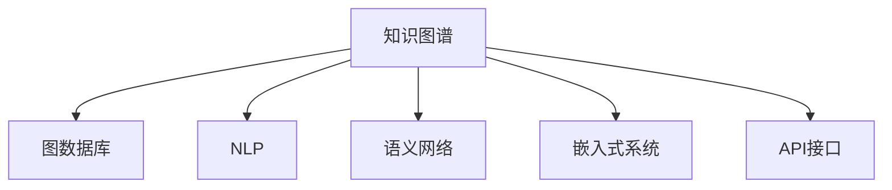

                 

# 知识图谱在程序员技能认证中的应用

## 1. 背景介绍

### 1.1 问题由来
程序员技能认证长期以来都是职业发展的重要参考标准，传统的认证往往基于知识点的单一测试，难以全面衡量一个程序员的综合能力。随着人工智能和大数据技术的发展，知识图谱这一知识表示与处理技术的兴起，为程序员技能认证带来了新的思路。

知识图谱是一种结构化的知识表示方式，它通过图的形式组织实体和关系，提供了更为丰富的知识结构，能够更全面地刻画程序员的能力和知识结构。

### 1.2 问题核心关键点
知识图谱在程序员技能认证中的应用，主要体现在以下几个方面：

- **知识结构化**：知识图谱将知识点组织成网络结构，能够更全面地覆盖程序员所需技能。
- **语义理解**：利用自然语言处理技术，知识图谱能够理解问题背后的语义，提供更精准的匹配。
- **智能推荐**：基于用户当前的技能图谱，知识图谱可以智能推荐进阶课程，加速技能提升。
- **多维度评估**：通过多模态数据的整合，知识图谱可以综合评估程序员的编程能力、代码质量和项目管理经验。

### 1.3 问题研究意义
研究知识图谱在程序员技能认证中的应用，对于提升技能认证的全面性和准确性，推动程序员职业发展具有重要意义：

- **精准认证**：知识图谱能够提供更全面、精确的技能认证，避免单一知识点测试的局限性。
- **能力提升**：通过智能推荐系统，知识图谱能够为程序员提供个性化的学习路径，加速技能提升。
- **行业标准**：知识图谱为行业标准化的技能认证提供了基础，有助于形成更为系统的职业发展路径。

## 2. 核心概念与联系

### 2.1 核心概念概述

为更好地理解知识图谱在程序员技能认证中的应用，本节将介绍几个密切相关的核心概念：

- **知识图谱(Knowledge Graph)**：一种通过图结构组织知识的方式，由节点和边组成，节点表示实体，边表示实体之间的关系。
- **图数据库(Graph Database)**：一种存储和管理知识图谱的数据库，支持高效存储和查询复杂关系数据。
- **自然语言处理(NLP)**：指利用计算机处理、理解、生成人类语言的技术，知识图谱和自然语言处理技术密切相关。
- **语义网络(Semantic Network)**：一种使用逻辑表示的语言，用于描述实体之间的关系，是知识图谱的重要组成部分。
- **嵌入式系统(Embedded System)**：将知识图谱嵌入到应用中，实时获取和更新知识，提供智能推荐和服务。
- **API接口(API)**：应用程序接口，用于连接知识图谱和外部系统的桥梁，支持数据共享和交互。

这些核心概念之间的逻辑关系可以通过以下Mermaid流程图来展示：



这个流程图展示了一些核心概念及其之间的关系：

1. 知识图谱通过图数据库存储和管理，提供高效的数据访问和查询。
2. 自然语言处理技术帮助知识图谱理解问题，提高查询的精准度。
3. 语义网络增强了知识图谱的逻辑表达能力，提升其复杂度。
4. 嵌入式系统将知识图谱嵌入到应用中，实现实时化和个性化。
5. API接口提供连接外部系统的接口，实现数据的共享和交互。

这些概念共同构成了知识图谱的应用框架，使得其在程序员技能认证中能够发挥强大的作用。通过理解这些核心概念，我们可以更好地把握知识图谱在程序员技能认证中的工作原理和优化方向。

## 3. 核心算法原理 & 具体操作步骤
### 3.1 算法原理概述

知识图谱在程序员技能认证中的应用，本质上是一个基于图谱的知识推理过程。其核心思想是：将程序员的技能表示为图谱中的实体和关系，利用图谱的语义理解能力，通过推理匹配，评估和认证程序员的技能水平。

具体来说，知识图谱通过以下步骤实现程序员技能认证：

1. **构建技能图谱**：将程序员所需技能组织成图谱，每个技能对应一个节点，技能间的联系对应边。
2. **用户输入查询**：用户输入编程问题或项目需求，通过NLP技术将其转化为图谱查询。
3. **图谱查询推理**：在图谱中匹配用户输入的问题，通过推理计算，找到满足条件的技能节点和路径。
4. **评估和认证**：根据推理结果，综合评估程序员的技能水平，输出认证结果。

### 3.2 算法步骤详解

基于知识图谱的程序员技能认证一般包括以下几个关键步骤：

**Step 1: 构建技能图谱**
- 确定技能树：梳理程序员所需的核心技能，包括编程语言、开发工具、算法和数据结构等。
- 设计实体和关系：将每个技能表示为图谱中的节点，技能间的联系表示为边。例如，Python技能节点可以与相关的库、框架、编程范式等节点相连。
- 知识图谱存储：将构建的技能图谱存储到图数据库中，以支持高效的查询和推理。

**Step 2: 输入问题解析**
- 用户输入查询：用户输入具体的编程问题或项目需求。
- NLP解析：利用自然语言处理技术，将用户输入的问题转化为图谱查询的表达式。例如，输入“如何优化Python代码性能”，可以通过NLP技术将其转化为“查找优化Python代码性能的策略”。

**Step 3: 图谱查询和推理**
- 图谱查询：在图谱数据库中查询与用户输入问题相关的技能节点和路径。
- 推理匹配：利用图谱中的关系和规则，推理计算满足条件的技能节点，形成路径。
- 结果输出：根据推理结果，输出程序员所需掌握的技能，并给出详细的匹配路径。

**Step 4: 技能评估和认证**
- 综合评估：综合考虑程序员在技能图中的掌握情况，给出综合评估结果。
- 技能认证：根据综合评估结果，提供程序员技能认证的报告，包括已掌握技能和需要提升的技能。
- 个性化推荐：根据认证结果，智能推荐适合程序员的进阶课程和培训内容。

### 3.3 算法优缺点

知识图谱在程序员技能认证中的应用具有以下优点：

1. **全面性**：知识图谱能够全面覆盖程序员所需的技能和知识点，避免单一测试的局限性。
2. **精确性**：基于图谱的推理匹配能够更精确地评估程序员的技能水平。
3. **智能推荐**：智能推荐系统可以根据程序员的当前技能图谱，推荐个性化的学习路径。
4. **可扩展性**：知识图谱能够动态更新，支持新技能的学习和认证。

同时，该方法也存在一定的局限性：

1. **数据质量依赖**：知识图谱的质量和完整性很大程度上取决于数据来源的准确性和全面性。
2. **推理复杂度**：复杂的图谱查询和推理过程可能会增加计算复杂度，影响效率。
3. **成本较高**：构建和维护知识图谱需要一定的技术投入和成本。

尽管存在这些局限性，但就目前而言，知识图谱在程序员技能认证中的应用仍具有显著的优势，特别是在评估全面性和精确性方面。未来相关研究的重点在于如何进一步提升知识图谱的质量和推理效率，同时降低成本和提升用户体验。

### 3.4 算法应用领域

知识图谱在程序员技能认证中的应用，已经取得了一定的进展，并在多个领域得到了应用：

- **职业发展**：为程序员提供技能认证和职业发展规划，帮助其提升职业水平。
- **培训评估**：为培训课程提供精准的技能评估，指导课程内容的设计和优化。
- **项目评审**：在项目评审过程中，利用知识图谱评估代码质量和项目进展，提供改进建议。
- **团队协作**：通过知识图谱，团队成员可以快速了解彼此的技能和项目需求，提高协作效率。
- **自动化测试**：利用知识图谱进行自动化测试用例的生成和评估，提升测试的覆盖率和效率。

## 4. 数学模型和公式 & 详细讲解
### 4.1 数学模型构建

基于知识图谱的程序员技能认证，可以采用以下数学模型进行建模：

假设程序员所需的技能图谱为 $G=(N,E)$，其中 $N$ 表示技能节点集合，$E$ 表示技能间的关系集合。设用户输入的问题为 $Q$，对应的图谱查询表达式为 $q$。则认证过程可以形式化地表示为：

$$
\hat{S}=\mathop{\arg\max}_{S\in N} \sum_{e\in E(S)} \mathcal{F}(S,e,q)
$$

其中 $E(S)$ 表示与技能 $S$ 相关的所有关系，$\mathcal{F}$ 表示推理函数，用于计算技能 $S$ 在图谱中满足用户查询的概率。

### 4.2 公式推导过程

以“优化Python代码性能”为例，进行公式推导：

设技能图谱中的Python相关节点为 $S_P$，优化代码的库节点为 $S_{OPT}$，框架节点为 $S_{FRM}$，编程范式节点为 $S_{PR}$。则用户查询可以转化为图谱查询：

$$
q=\{S_P, S_{OPT}, S_{FRM}, S_{PR}\}
$$

推理函数 $\mathcal{F}$ 可以定义如下：

$$
\mathcal{F}(S,e,q) = 
\begin{cases}
p(S_{OPT}, e) & \text{如果 } e=(O, S_{OPT}, S_{OPT}), \\
p(S_{FRM}, e) & \text{如果 } e=(F, S_{FRM}, S_{FRM}), \\
p(S_{PR}, e) & \text{如果 } e=(P, S_{PR}, S_{PR})
\end{cases}
$$

其中 $p(S,e)$ 表示节点 $S$ 和边 $e$ 的匹配概率，可以通过图数据库查询得到。

最终，认证结果 $\hat{S}$ 为满足查询 $q$ 的技能节点，计算如下：

$$
\hat{S}=\max_{S\in N} \sum_{e\in E(S)} p(S_{OPT}, e) + \sum_{e\in E(S)} p(S_{FRM}, e) + \sum_{e\in E(S)} p(S_{PR}, e)
$$

### 4.3 案例分析与讲解

考虑一个程序员输入的问题：“如何优化Python代码性能”。通过NLP解析，问题可以转化为：“查找优化Python代码性能的策略”。

在技能图谱中，查找与Python代码性能优化相关的节点：

1. 查找Python相关节点：$S_P$
2. 查找优化库节点：$S_{OPT}$
3. 查找优化框架节点：$S_{FRM}$
4. 查找优化编程范式节点：$S_{PR}$

推理函数 $\mathcal{F}$ 计算每个节点的匹配概率，并取最大值作为认证结果。例如，如果优化库节点 $S_{OPT}$ 的匹配概率为 0.8，优化框架节点 $S_{FRM}$ 的匹配概率为 0.6，优化编程范式节点 $S_{PR}$ 的匹配概率为 0.5，则认证结果 $\hat{S}$ 为优化库节点 $S_{OPT}$。

## 5. 项目实践：代码实例和详细解释说明
### 5.1 开发环境搭建

在进行知识图谱实践前，我们需要准备好开发环境。以下是使用Python进行Neo4j开发的环境配置流程：

1. 安装Anaconda：从官网下载并安装Anaconda，用于创建独立的Python环境。

2. 创建并激活虚拟环境：
```bash
conda create -n kg-env python=3.8 
conda activate kg-env
```

3. 安装Neo4j图形数据库：从官网下载并安装Neo4j社区版，完成环境配置后，启动数据库服务。

4. 安装Py2neo库：
```bash
pip install py2neo
```

5. 安装其他依赖包：
```bash
pip install pandas numpy scikit-learn jupyter notebook
```

完成上述步骤后，即可在`kg-env`环境中开始知识图谱实践。

### 5.2 源代码详细实现

下面以构建和查询知识图谱为例，给出使用Py2neo对程序员技能图谱进行构建和查询的Python代码实现。

首先，定义技能图谱类：

```python
from py2neo import Graph, Node, Relationship

class SkillGraph:
    def __init__(self, db_uri):
        self.graph = Graph(db_uri)
        
    def add_node(self, label, name):
        node = Node(label, name=name)
        self.graph.create(node)
        return node
    
    def add_relationship(self, node1, node2, relationship):
        relationship_type = f'{node1.label}_{relationship}_{node2.label}'
        relationship_label = f"{relationship_type}:RELATIONSHIP_TYPE"
        relationship_name = f"{relationship_type}:{relationship}"
        relationship = Relationship(node1, relationship_label, node2, name=relationship_name)
        self.graph.create(relationship)
```

然后，定义构建技能图谱的函数：

```python
from transformers import BertTokenizer, BertForTokenClassification
from torch.utils.data import Dataset
import torch

def build_skill_graph():
    graph = SkillGraph('bolt://localhost:7687')
    
    # 添加技能节点
    graph.add_node('Skill', 'Python')
    graph.add_node('Skill', 'Java')
    graph.add_node('Skill', 'C++')
    graph.add_node('Skill', 'Python_opt')
    graph.add_node('Skill', 'Java_opt')
    graph.add_node('Skill', 'C++_opt')
    
    # 添加关系
    graph.add_relationship(graph.add_node('Skill', 'Python'), graph.add_node('Skill', 'Python_opt'), 'has_opt')
    graph.add_relationship(graph.add_node('Skill', 'Python'), graph.add_node('Skill', 'Java_opt'), 'knows')
    graph.add_relationship(graph.add_node('Skill', 'Java'), graph.add_node('Skill', 'C++_opt'), 'learned')
    graph.add_relationship(graph.add_node('Skill', 'C++'), graph.add_node('Skill', 'Python_opt'), 'similar')
    
    return graph
```

接着，定义查询技能图谱的函数：

```python
from py2neo import cypher

def query_skill_graph(graph, query):
    query = cypher.prepare(query)
    results = graph.run(query)
    return [record['skill'] for record in results]
```

最后，启动技能图谱查询流程：

```python
graph = build_skill_graph()
query = 'MATCH (n:Skill) WHERE n.name="Python_opt" RETURN n'
print(query_skill_graph(graph, query))
```

以上就是使用Py2neo构建和查询知识图谱的完整代码实现。可以看到，Py2neo提供了便捷的接口，能够高效地操作Neo4j数据库。

### 5.3 代码解读与分析

让我们再详细解读一下关键代码的实现细节：

**SkillGraph类**：
- `__init__`方法：初始化Neo4j数据库连接。
- `add_node`方法：向数据库添加节点，并返回节点对象。
- `add_relationship`方法：添加节点间的关系，支持自定义关系类型。

**build_skill_graph函数**：
- 创建SkillGraph对象。
- 添加技能节点和关系，构建简单的技能图谱。

**query_skill_graph函数**：
- 使用Py2neo的cypher查询语言，构建查询语句。
- 执行查询，返回满足条件的技能节点。

**启动查询流程**：
- 构建SkillGraph对象。
- 定义查询语句，查找名为"Python_opt"的节点。
- 执行查询，并打印输出结果。

可以看到，使用Py2neo操作Neo4j数据库，可以方便地构建和管理知识图谱，同时提供高效的查询功能，满足程序员技能认证的需求。

## 6. 实际应用场景
### 6.1 智能推荐系统

基于知识图谱的程序员技能认证，可以应用于智能推荐系统的开发。传统的推荐系统往往只依赖用户的历史行为数据进行推荐，难以理解用户的真实兴趣和偏好。而基于知识图谱的推荐系统，能够更好地挖掘用户的兴趣点，提供更加精准的推荐内容。

在技术实现上，可以构建程序员的技能图谱，将用户当前掌握的技能和需求作为图谱查询的输入，利用知识图谱的推理能力，推荐适合用户的学习路径和进阶课程。例如，用户输入“如何提高Java编程能力”，系统可以根据其当前掌握的技能图谱，推荐相关的Java优化课程、框架学习路径等。

### 6.2 项目评审系统

在项目评审过程中，利用知识图谱进行技能认证，可以有效提升评审的准确性和效率。传统的评审往往依赖人工的代码审查和项目评估，难以全面衡量程序员的能力。而基于知识图谱的技能认证，可以通过综合评估程序员的技能掌握情况，给出精准的评审报告。

具体来说，可以在项目评审时，将程序员的技能图谱输入知识图谱系统中，系统通过图谱推理，生成代码质量和项目进展的评估报告，辅助评审专家进行决策。例如，评审专家可以通过系统获取每个团队成员的技能图谱，快速了解其掌握的技能和短板，提供有针对性的改进建议。

### 6.3 职业发展平台

知识图谱在程序员职业发展平台中的应用，可以提供个性化的职业发展规划和技能认证报告，帮助程序员规划职业发展路径。传统的职业发展规划往往基于单一的技能测试，难以全面反映程序员的综合能力。而基于知识图谱的职业发展规划，能够提供更为全面和精准的评估。

具体而言，平台可以根据程序员的技能图谱，智能推荐适合的培训课程和进阶路径，提供个性化的职业发展规划。例如，用户输入“希望成为高级Java开发工程师”，系统会根据其当前的技能图谱，推荐适合的Java高级课程、框架学习路径等，帮助用户制定职业发展规划。

## 7. 工具和资源推荐
### 7.1 学习资源推荐

为了帮助开发者系统掌握知识图谱在程序员技能认证中的应用，这里推荐一些优质的学习资源：

1. **《知识图谱导论》系列博文**：由知识图谱专家撰写，深入浅出地介绍了知识图谱的基本概念、建模方法和应用场景。

2. **Stanford CS 224N《知识图谱和语义搜索》课程**：斯坦福大学开设的知识图谱和语义搜索课程，涵盖知识图谱的构建、查询和推理技术，适合深度学习从业者学习。

3. **《Graph Neural Networks》书籍**：Graph Neural Networks的作者所著，全面介绍了图神经网络的理论和应用，包括在知识图谱中的使用。

4. **LinkedData.org**：开放数据标准的权威网站，提供大量的开放数据集和API接口，支持知识图谱的构建和查询。

5. **OntoGraph](https://ontograph.freenom.io/)：一个基于Web的应用程序，支持实时构建和查询知识图谱，适合初学者快速上手。

通过学习这些资源，相信你一定能够快速掌握知识图谱在程序员技能认证中的精髓，并用于解决实际的编程问题。

### 7.2 开发工具推荐

高效的开发离不开优秀的工具支持。以下是几款用于知识图谱开发的工具：

1. **Neo4j**：开源的图形数据库，支持大规模知识图谱的存储和管理，适合复杂图谱的构建和查询。
2. **GraphStudio**：一款可视化工具，支持Neo4j数据库的可视化操作，帮助开发者更好地理解和管理知识图谱。
3. **Py2neo**：Python库，提供了Neo4j数据库的高级API，方便知识图谱的构建和查询。
4. **Cypher**：Neo4j的查询语言，用于构建复杂的图谱查询语句。
5. **Gephi**：一款可视化工具，支持大规模图形数据的可视化展示，帮助开发者进行数据分析和可视化。

合理利用这些工具，可以显著提升知识图谱的开发效率，加快创新迭代的步伐。

### 7.3 相关论文推荐

知识图谱在程序员技能认证中的应用，得益于学界的持续研究。以下是几篇奠基性的相关论文，推荐阅读：

1. **《The Open Web as a Semantic Graph》**：提出了构建开放知识图谱的方法，为知识图谱的构建提供了基础。
2. **《LinkedData》**：介绍了Linked Data的概念和应用，为知识图谱的构建和查询提供了指导。
3. **《Knowledge Graphs for NLP》**：探讨了知识图谱在自然语言处理中的应用，为知识图谱的应用提供了新的思路。
4. **《Graph Neural Networks: A Review of Methods and Applications》**：全面综述了图神经网络的理论和应用，包括在知识图谱中的应用。

这些论文代表了大语言模型微调技术的发展脉络。通过学习这些前沿成果，可以帮助研究者把握学科前进方向，激发更多的创新灵感。

## 8. 总结：未来发展趋势与挑战

### 8.1 总结

本文对基于知识图谱的程序员技能认证方法进行了全面系统的介绍。首先阐述了知识图谱在程序员技能认证的研究背景和意义，明确了知识图谱在全面性和精准性方面的独特优势。其次，从原理到实践，详细讲解了知识图谱的构建、查询和推理过程，给出了知识图谱应用开发的完整代码实例。同时，本文还广泛探讨了知识图谱在智能推荐、项目评审、职业发展规划等众多场景中的应用前景，展示了知识图谱技术的广阔前景。最后，本文精选了知识图谱的学习资源，力求为读者提供全方位的技术指引。

通过本文的系统梳理，可以看到，基于知识图谱的程序员技能认证方法已经取得了一定的进展，并在多个领域得到了应用。未来，伴随知识图谱技术的不断进步，基于知识图谱的程序员技能认证必将进一步提升技能认证的全面性和准确性，推动程序员职业发展。

### 8.2 未来发展趋势

展望未来，知识图谱在程序员技能认证领域将呈现以下几个发展趋势：

1. **自动化构建**：利用自动构建工具，如Neo4j GraphStudio，自动构建知识图谱，提高图谱构建的效率和质量。
2. **知识更新**：利用实时数据流和API接口，动态更新知识图谱，保证知识的时效性。
3. **跨模态融合**：将知识图谱与自然语言处理、图像处理等多模态技术结合，提供更加全面和精准的技能认证。
4. **协同学习**：利用协同学习技术，提升知识图谱的智能推荐能力，优化程序员的学习路径。
5. **个性化定制**：根据程序员的兴趣和需求，个性化定制技能图谱，提供更为精准的技能认证和推荐。
6. **跨领域应用**：知识图谱技术将不仅仅应用于程序员技能认证，还将拓展到更广泛的领域，如医生职业发展、教师职业发展等。

以上趋势凸显了知识图谱技术在程序员技能认证中的强大潜力。这些方向的探索发展，必将进一步提升知识图谱系统的性能和应用范围，为程序员职业发展提供更全面的支持。

### 8.3 面临的挑战

尽管知识图谱在程序员技能认证中的应用已经取得了一定的进展，但在迈向更加智能化、普适化应用的过程中，仍面临诸多挑战：

1. **数据质量问题**：知识图谱的质量和完整性很大程度上取决于数据来源的准确性和全面性。构建高质量的知识图谱需要大量的人力投入和资源支持。
2. **推理复杂度**：复杂的图谱查询和推理过程可能会增加计算复杂度，影响效率。需要进一步优化推理算法和数据库性能。
3. **知识泛化能力**：知识图谱的泛化能力需要进一步提升，以应对不同领域和任务的需求。
4. **实时性和扩展性**：知识图谱需要支持实时更新和扩展，以应对不断变化的职业需求和技能标准。
5. **用户隐私保护**：在构建知识图谱时，需要保护用户隐私和数据安全，防止敏感信息泄露。

正视知识图谱面临的这些挑战，积极应对并寻求突破，将使知识图谱技术在程序员技能认证中更好地发挥作用。相信随着学界和产业界的共同努力，这些挑战终将一一被克服，知识图谱技术必将推动程序员职业发展，迈向新的高度。

### 8.4 研究展望

面对知识图谱在程序员技能认证中所面临的种种挑战，未来的研究需要在以下几个方面寻求新的突破：

1. **高效构建技术**：探索高效的自动化知识图谱构建技术，提高图谱构建的效率和质量。
2. **实时更新机制**：研究知识图谱的实时更新和扩展机制，支持图谱的动态更新和扩展。
3. **多模态融合技术**：将知识图谱与多模态数据融合，提升图谱的智能推荐能力和泛化能力。
4. **隐私保护技术**：研究知识图谱的隐私保护技术，保护用户隐私和数据安全。
5. **协同学习算法**：研究协同学习算法，提升知识图谱的智能推荐能力，优化程序员的学习路径。
6. **跨领域应用**：将知识图谱技术拓展到其他领域，如医生职业发展、教师职业发展等。

这些研究方向的探索，必将引领知识图谱技术迈向更高的台阶，为程序员职业发展提供更全面、更精准的支持。面向未来，知识图谱技术还需要与其他人工智能技术进行更深入的融合，如自然语言处理、强化学习等，多路径协同发力，共同推动知识图谱技术的发展。只有勇于创新、敢于突破，才能不断拓展知识图谱技术的边界，让智能技术更好地造福人类社会。

## 9. 附录：常见问题与解答

**Q1：如何构建高质量的知识图谱？**

A: 构建高质量的知识图谱需要综合考虑数据来源、数据质量、图谱结构和推理能力等方面。具体建议如下：

1. 数据来源：选择权威、全面的数据源，如维基百科、开放数据集等，避免数据质量问题。
2. 数据清洗：对数据进行清洗和预处理，去除重复、错误和无关数据，保证数据质量。
3. 图谱设计：合理设计图谱结构和关系，使用标准化表示，避免歧义。
4. 推理算法：选择高效的推理算法，提升图谱查询和推理的效率和准确性。
5. 持续更新：利用实时数据流和API接口，动态更新知识图谱，保证图谱的时效性。

**Q2：知识图谱在智能推荐中的应用场景有哪些？**

A: 知识图谱在智能推荐中的应用场景广泛，主要包括以下几个方面：

1. 个性化学习路径推荐：根据用户当前技能图谱，推荐适合的进阶课程和学习路径。
2. 个性化阅读推荐：根据用户的历史阅读记录和兴趣图谱，推荐适合的书籍和文章。
3. 个性化娱乐推荐：根据用户的娱乐偏好和兴趣图谱，推荐适合的影视作品、音乐等。
4. 个性化产品推荐：根据用户的购买历史和兴趣图谱，推荐适合的产品和服务。
5. 个性化广告推荐：根据用户的浏览行为和兴趣图谱，推荐适合的广告内容和优惠活动。

**Q3：知识图谱在项目评审中的应用场景有哪些？**

A: 知识图谱在项目评审中的应用场景主要包括以下几个方面：

1. 代码质量评估：利用技能图谱，评估代码的质量和结构，提供改进建议。
2. 项目进展评估：利用技能图谱，评估项目的进展和阶段，提供优化建议。
3. 团队协作评估：利用技能图谱，评估团队成员的技能和合作情况，提供改进建议。
4. 任务分配评估：利用技能图谱，评估任务分配的合理性和公平性，提供优化建议。
5. 风险评估：利用技能图谱，评估项目的风险和挑战，提供应对策略。

**Q4：知识图谱在职业发展规划中的应用场景有哪些？**

A: 知识图谱在职业发展规划中的应用场景主要包括以下几个方面：

1. 技能认证报告：利用技能图谱，生成个性化的技能认证报告，帮助用户了解自己的技能水平。
2. 职业发展规划：利用技能图谱，提供个性化的职业发展规划，帮助用户制定职业目标。
3. 学习路径推荐：利用技能图谱，推荐适合的培训课程和学习路径，帮助用户提升技能。
4. 职业路径预测：利用技能图谱，预测用户未来的职业路径和发展趋势，提供指导建议。
5. 职业满意度评估：利用技能图谱，评估用户的职业满意度和工作状态，提供优化建议。

---

作者：禅与计算机程序设计艺术 / Zen and the Art of Computer Programming

