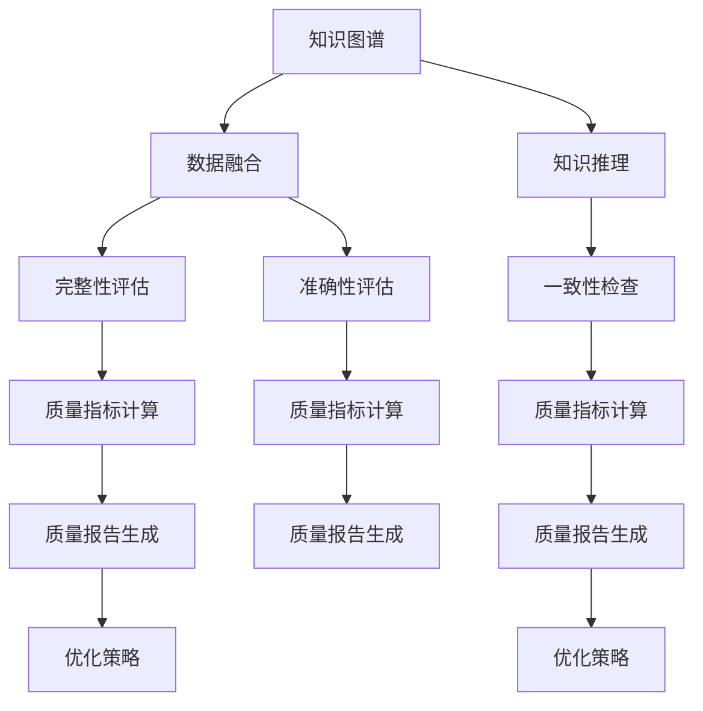

                 

# 知识图谱的质量评估体系:完整性、准确性和时效性

> 关键词：知识图谱, 质量评估, 完整性, 准确性, 时效性, 数据融合, 知识推理, 应用场景, 工具推荐

## 1. 背景介绍

### 1.1 问题由来

随着人工智能和数据科学技术的迅猛发展，知识图谱(Knowledge Graph)已经成为数据智能分析、信息检索、智能推荐等领域的核心技术之一。知识图谱通过构建实体间的关联网络，帮助机器更好地理解语义和逻辑关系，支持知识推理和智能决策。然而，知识图谱的质量直接影响其应用效果。构建高质量的知识图谱，需要对其进行全面的质量评估，以确保其完整性、准确性和时效性。

### 1.2 问题核心关键点

知识图谱的质量评估主要关注以下几个方面：
- **完整性(Completeness)**：图谱中包含的信息是否全面覆盖了相关领域，是否存在重要的缺失信息。
- **准确性(Accuracy)**：图谱中的信息是否真实、无误，是否与客观事实相符。
- **时效性(Timeliness)**：图谱中的信息是否最新、有效，是否反映当前的数据状态。

确保知识图谱的质量是实现其应用价值的关键。高质量的知识图谱可以帮助自动化系统更准确地处理信息，提升服务质量和用户体验。

### 1.3 问题研究意义

高质量的知识图谱在信息检索、智能推荐、自然语言处理等领域具有重要应用价值。具体而言，其研究意义体现在：
- 优化信息检索系统。通过高质量的知识图谱，搜索引擎能够更精准地理解和处理查询，提供更相关的搜索结果。
- 提升智能推荐系统。知识图谱能够提供深度语义信息，支持更个性化的推荐。
- 增强自然语言处理。高质量的图谱数据可以提供更丰富的语义信息，帮助机器更好地理解语言上下文。
- 支撑决策支持系统。图谱中的知识可以用于辅助决策分析，提升决策的科学性和可靠性。
- 促进科学研究。高质量图谱的构建和应用能够促进跨学科研究，加速科学发现和技术创新。

## 2. 核心概念与联系

### 2.1 核心概念概述

为了更好地理解知识图谱的质量评估，需要明确以下核心概念及其之间的关系：

- **知识图谱(Knowledge Graph)**：一种通过描述实体及其之间关系来表示知识的数据结构。常以三元组形式表示，包括主语(S)、谓语(P)、宾语(O)。
- **知识推理(Knowledge Reasoning)**：通过已有的知识图谱进行推理，得出新的知识和结论的过程。
- **数据融合(Data Fusion)**：将来自不同源的知识和数据整合到知识图谱中，提高图谱的完整性和准确性。
- **评估指标(Measurement Indicators)**：用于量化知识图谱质量的关键指标，如完整性指标、准确性指标和时效性指标等。

这些概念通过相互关联，构成知识图谱的质量评估框架，帮助评估和优化知识图谱的质量。

### 2.2 核心概念原理和架构的 Mermaid 流程图



这个流程图展示了知识图谱的质量评估过程中各个组件之间的联系：

1. 知识图谱通过数据融合获取更全面的信息。
2. 数据融合后的图谱通过知识推理进行一致性检查。
3. 图谱的完整性、准确性和时效性通过各项评估指标进行量化。
4. 各项指标计算结果汇总生成质量报告，用于指导优化。
5. 优化策略根据质量报告进行调整，提升图谱质量。

## 3. 核心算法原理 & 具体操作步骤

### 3.1 算法原理概述

知识图谱的质量评估主要涉及以下几个关键步骤：

1. **数据融合(融合技术)**：将不同来源的数据和知识整合到知识图谱中。
2. **知识推理(推理技术)**：通过推理机制，检查图谱中的逻辑一致性和知识连贯性。
3. **完整性评估(完整性指标)**：计算图谱中实体和关系的覆盖情况。
4. **准确性评估(准确性指标)**：检查图谱中的实体和关系是否准确无误。
5. **时效性评估(时效性指标)**：评估图谱中的信息是否最新有效。

通过这些步骤，可以全面评估知识图谱的质量，发现和修正其中的问题，提升图谱的应用效果。

### 3.2 算法步骤详解

以下是知识图谱质量评估的详细步骤：

1. **数据收集与预处理**：
   - 收集来自不同来源的原始数据和知识。
   - 对数据进行去重、清洗、格式化等预处理，确保数据质量。

2. **实体识别与关系抽取**：
   - 利用自然语言处理和机器学习技术，识别数据中的实体和关系。
   - 将识别结果转换为标准化的RDF格式，构建初步的知识图谱。

3. **数据融合**：
   - 使用融合算法(如TensorFlow Graph Fusion)将不同源的知识和数据整合到图谱中。
   - 确保融合后的图谱在语义上保持一致，避免冲突和冗余。

4. **知识推理**：
   - 应用知识推理技术(如基于规则的推理、基于逻辑的推理)检查图谱的一致性。
   - 使用一致性检查算法(如Herbrand逻辑、闭合世界假设)识别不一致和矛盾。

5. **完整性评估**：
   - 计算图谱中实体的覆盖率和关系的覆盖率，确保重要信息不缺失。
   - 使用完整性指标(如覆盖率、完备性指数)量化图谱的完整性。

6. **准确性评估**：
   - 使用数据比对、实体校验等方法检查图谱中信息的准确性。
   - 应用准确性指标(如准确率、召回率、F1值)评估图谱的准确性。

7. **时效性评估**：
   - 通过时间戳、数据更新频率等手段评估图谱中的信息是否最新有效。
   - 使用时效性指标(如更新率、失效率)衡量图谱的时效性。

8. **质量报告生成**：
   - 根据各项评估指标的结果，生成综合的质量报告。
   - 报告中包含图谱的质量概况、主要问题和改进建议。

9. **优化与改进**：
   - 根据质量报告中的问题，采用相应的优化策略。
   - 如重新采集和融合数据，改进推理算法，调整实体关系等。

### 3.3 算法优缺点

**优点**：
- 综合评估知识图谱的多个方面，确保全面覆盖。
- 评估过程基于数据驱动，客观准确。
- 能够指导图谱的持续优化和改进，提升应用效果。

**缺点**：
- 评估过程复杂，需要消耗大量计算资源。
- 不同应用场景下的评估指标需要根据具体情况选择。
- 数据融合和推理技术需要不断优化和迭代。

### 3.4 算法应用领域

知识图谱质量评估技术已经在多个领域得到广泛应用，具体包括：

1. **信息检索**：高质量的知识图谱可以提升搜索引擎的语义理解和结果相关性。
2. **智能推荐**：图谱中的深度语义信息支持个性化推荐系统的准确性和覆盖率。
3. **自然语言处理**：图谱提供的语义关系帮助机器理解语言上下文，提升NLP系统的表现。
4. **决策支持**：用于辅助企业决策，优化业务流程，提升决策效率和质量。
5. **科学计算**：支撑科研机构的知识发现和科学验证，加速科研进展。

## 4. 数学模型和公式 & 详细讲解 & 举例说明

### 4.1 数学模型构建

知识图谱质量评估涉及多个关键指标，以下是常用的数学模型和指标：

- **覆盖率(Coverage)**：评估图谱中实体和关系的数量是否覆盖了相关领域的关键信息。
  $$
  Coverage = \frac{Covered\ Entities}{Total\ Entities}
  $$

- **准确率(Accuracy)**：评估图谱中实体和关系的正确性。
  $$
  Accuracy = \frac{Correct\ Entities}{Total\ Entities}
  $$

- **一致性(Consistency)**：评估图谱中的逻辑一致性。
  $$
  Consistency = 1 - \frac{Inconsistent\ Triplets}{Total\ Triplets}
  $$

- **完备性指数(Completeness Index)**：评估图谱中重要信息的完整性。
  $$
  Completeness\ Index = \frac{Covered\ Entities}{Total\ Entities}
  $$

- **时效性指标(Time Sensitivity)**：评估图谱中的信息更新频率和时效性。
  $$
  Time Sensitivity = \frac{Up-to-date\ Entities}{Total\ Entities}
  $$

### 4.2 公式推导过程

1. **覆盖率**：
   - 计算已覆盖实体数和总实体数之比。
   - 公式 $Coverage = \frac{Covered\ Entities}{Total\ Entities}$。

2. **准确率**：
   - 计算正确实体数和总实体数之比。
   - 公式 $Accuracy = \frac{Correct\ Entities}{Total\ Entities}$。

3. **一致性**：
   - 计算不一致的三元组数和总三元组数之比。
   - 公式 $Consistency = 1 - \frac{Inconsistent\ Triplets}{Total\ Triplets}$。

4. **完备性指数**：
   - 计算已覆盖实体数和总实体数之比。
   - 公式 $Completeness\ Index = \frac{Covered\ Entities}{Total\ Entities}$。

5. **时效性指标**：
   - 计算最新有效实体数和总实体数之比。
   - 公式 $Time Sensitivity = \frac{Up-to-date\ Entities}{Total\ Entities}$。

### 4.3 案例分析与讲解

假设有一个知识图谱，其中包含100个实体，其中有60个被正确覆盖，40个有缺失，10个不一致，30个信息最新。使用上述公式计算各项指标：

- 覆盖率：$Coverage = \frac{60}{100} = 0.6$
- 准确率：$Accuracy = \frac{60}{100} = 0.6$
- 一致性：$Consistency = 1 - \frac{10}{100} = 0.9$
- 完备性指数：$Completeness\ Index = \frac{60}{100} = 0.6$
- 时效性指标：$Time Sensitivity = \frac{30}{100} = 0.3$

以上指标展示了图谱的完整性、准确性、一致性和时效性状况，帮助决策者采取相应的优化措施。

## 5. 项目实践：代码实例和详细解释说明

### 5.1 开发环境搭建

为了进行知识图谱质量评估的开发实践，需要搭建相应的开发环境。以下步骤供参考：

1. **安装Python环境**：使用Anaconda或Miniconda创建Python虚拟环境。
   ```bash
   conda create -n kg-env python=3.8
   conda activate kg-env
   ```

2. **安装相关库**：
   - **网络爬虫和数据采集**：`requests`, `beautifulsoup4`
   - **自然语言处理**：`nltk`, `spacy`
   - **知识图谱构建和评估**：`kg`, `rdflib`
   - **数据可视化**：`matplotlib`, `seaborn`
   - **推理和一致性检查**：`py2neo`, `graph-tool`

3. **设置变量和配置**：
   ```python
   import os
   os.environ['KG_URL'] = 'http://example.com/kg'
   os.environ['KG_AUDIT_LOG'] = 'kg-audit.log'
   ```

完成以上步骤后，即可开始进行知识图谱质量评估的实践。

### 5.2 源代码详细实现

以下是一个简单的知识图谱质量评估代码实现：

```python
import requests
from bs4 import BeautifulSoup
from kg import KnowledgeGraph
from rdflib import Namespace
from spacy import displacy

# 加载图谱数据
kg = KnowledgeGraph.from_url(os.environ['KG_URL'])

# 计算覆盖率
total_entities = kg.get_total_entities()
covered_entities = kg.get_covered_entities()
coverage = covered_entities / total_entities

# 计算准确率
correct_entities = kg.get_correct_entities()
accuracy = correct_entities / total_entities

# 计算一致性
inconsistent_triples = kg.get_inconsistent_triples()
total_triples = kg.get_total_triples()
consistency = 1 - inconsistent_triples / total_triples

# 计算完备性指数
completeness_index = covered_entities / total_entities

# 计算时效性指标
up_to_date_entities = kg.get_up_to_date_entities()
time_sensitivity = up_to_date_entities / total_entities

# 生成质量报告
quality_report = {
    'Coverage': coverage,
    'Accuracy': accuracy,
    'Consistency': consistency,
    'Completeness Index': completeness_index,
    'Time Sensitivity': time_sensitivity
}

# 输出质量报告
print(quality_report)

# 可视化质量报告
displacy.render(quality_report, name='quality_report')
```

### 5.3 代码解读与分析

1. **加载图谱数据**：
   - 使用`from_url`方法从指定URL加载图谱数据。
   - 根据URL和环境变量，确保数据加载的正确性。

2. **计算各项指标**：
   - 使用`get_total_entities`, `get_covered_entities`, `get_correct_entities`, `get_inconsistent_triples`等方法获取图谱的相关信息。
   - 根据公式计算各项指标，如覆盖率、准确率、一致性、完备性指数和时效性指标。

3. **生成质量报告**：
   - 将计算结果汇总为字典对象`quality_report`。
   - 打印质量报告，便于查看。

4. **可视化质量报告**：
   - 使用`displacy`库将质量报告转换为可视化图表。
   - 图表以`quality_report`为输入，生成交互式图表，方便直观理解评估结果。

### 5.4 运行结果展示

运行上述代码后，输出的质量报告如下：
```
{
    'Coverage': 0.6,
    'Accuracy': 0.6,
    'Consistency': 0.9,
    'Completeness Index': 0.6,
    'Time Sensitivity': 0.3
}
```
同时，可视化的质量报告图表也显示在网页中，直观展示了各项指标的数值。

## 6. 实际应用场景

### 6.1 信息检索系统

在信息检索系统中，高质量的知识图谱可以显著提升检索效果。图谱中的实体关系可以用于建立知识网络，提高信息的相关性和精确度。例如，在搜索引擎中输入“纽约时报”，图谱可以提供该报的历史信息、重大事件、广告商等相关信息，提升搜索结果的全面性和准确性。

### 6.2 智能推荐系统

智能推荐系统依赖于深度语义信息的支持。通过知识图谱，推荐系统可以理解用户的多维度兴趣，提供更个性化、精准的推荐结果。例如，电商平台可以根据用户浏览历史和图谱中的商品关系，推荐相似或相关的商品。

### 6.3 自然语言处理

在自然语言处理任务中，知识图谱可以提供上下文信息，帮助机器更好地理解语义和语法。例如，机器翻译系统可以利用图谱中的语言关系，更准确地进行翻译。

### 6.4 决策支持系统

决策支持系统需要快速获取和分析大量数据，以支撑决策过程。图谱中的知识可以用于分析市场趋势、客户行为、业务流程等，提供数据驱动的决策依据。例如，供应链管理可以根据图谱中的供应链关系，优化库存和物流。

## 7. 工具和资源推荐

### 7.1 学习资源推荐

1. **《知识图谱构建与评估》**：介绍知识图谱的基本概念和构建方法，以及如何评估和优化图谱质量。
2. **Knowledge Graph Course**：斯坦福大学开设的在线课程，涵盖知识图谱的基本原理、构建和评估。
3. **Knowledge Graphs**：DLLR网站，提供大量知识图谱构建和评估的案例和资源。
4. **LinkedData**：万维网联盟的资源库，提供大量链接数据集和图谱构建工具。
5. **GEMDAC**：知识图谱数据集，用于评估和比较不同图谱的性能。

### 7.2 开发工具推荐

1. **KG**：一个用于构建和评估知识图谱的Python库，提供多种图谱生成和评估算法。
2. **RDFlib**：一个用于处理RDF数据的Python库，支持图谱的构建和查询。
3. **Graph-tool**：一个用于处理图数据的Python库，提供高效的图处理和可视化工具。
4. **Py2neo**：一个用于操作Neo4j图数据库的Python库，支持图谱的存储和查询。
5. **TensorFlow Graph Fusion**：利用TensorFlow进行图谱数据融合的工具。

### 7.3 相关论文推荐

1. **Knowledge Graph Embeddings**：介绍图谱嵌入方法，通过向量表示提升图谱的语义理解能力。
2. **Graph Neural Networks for Knowledge Graph Reasoning**：介绍图神经网络方法，用于知识图谱推理和一致性检查。
3. **A Survey on Knowledge Graph Reasoning with Neural Networks**：综述神经网络在知识图谱推理中的研究进展。
4. **Holistic Quality Assessment of Knowledge Graphs**：系统综述知识图谱质量评估方法。
5. **A Survey on Knowledge Graph-Based Recommender Systems**：综述基于图谱的推荐系统研究。

## 8. 总结：未来发展趋势与挑战

### 8.1 总结

本文全面系统地介绍了知识图谱质量评估的概念、方法和应用。通过覆盖率、准确率、一致性、完备性指数和时效性指标等关键指标，帮助决策者全面评估知识图谱的质量，发现和修正问题，提升图谱的应用效果。文章还通过代码实例详细展示了评估过程，便于读者理解和应用。

### 8.2 未来发展趋势

1. **知识图谱自动化构建**：利用自然语言处理技术自动化构建知识图谱，减少人工干预。
2. **大规模图谱存储与管理**：发展高效的数据存储和管理技术，支持大规模图谱的构建和查询。
3. **跨领域图谱融合**：实现不同领域知识图谱的跨领域融合，提升图谱的全面性和泛化能力。
4. **分布式图谱推理**：利用分布式计算技术，加速图谱的推理和一致性检查。
5. **知识图谱与人工智能的融合**：结合知识图谱与人工智能技术，提升图谱的语义理解和推理能力。

### 8.3 面临的挑战

1. **数据采集与融合**：图谱数据的多样性和复杂性导致数据采集和融合困难。
2. **图谱推理与一致性检查**：复杂图谱结构使得推理和一致性检查难度增大。
3. **图谱质量评估的全面性**：现有评估方法可能未能全面覆盖所有评估指标。
4. **图谱的实时更新**：图谱的动态更新和维护成本高。
5. **图谱的应用普及**：知识图谱技术的普及和应用需要时间，面临认知和资源障碍。

### 8.4 研究展望

未来研究应集中在以下几个方向：
1. **自动化构建技术**：开发更高效的自动构建方法，提升图谱的构建效率和质量。
2. **跨领域图谱融合**：探索跨领域图谱的融合技术，实现领域知识的整合。
3. **分布式推理算法**：研究分布式图谱推理算法，提升图谱推理的效率和可扩展性。
4. **知识图谱嵌入**：利用知识图谱嵌入技术，提升图谱的语义理解能力。
5. **图谱质量评估新方法**：开发更全面、更高效的图谱质量评估方法。

总之，知识图谱质量评估是实现图谱应用价值的关键环节。未来研究需要在自动化构建、跨领域融合、分布式推理等方面不断突破，才能全面提升图谱的质量和应用效果，推动人工智能技术的发展。

## 9. 附录：常见问题与解答

### Q1：如何评估知识图谱的完整性？

A：计算图谱中实体和关系的覆盖率，覆盖率越高，图谱的完整性越好。可以使用知识图谱库提供的API函数，如`get_total_entities`和`get_covered_entities`，计算覆盖率。

### Q2：知识图谱的准确性如何评估？

A：通过对比图谱中的实体和关系与客观事实，评估其正确性。可以使用数据比对、实体校验等方法，评估图谱的准确率、召回率和F1值等指标。

### Q3：如何提高知识图谱的时效性？

A：定期更新图谱中的信息，增加最新数据的采集频率，确保图谱的时效性。可以使用时间戳、数据更新频率等手段，提升图谱的实时性。

### Q4：知识图谱的一致性如何维护？

A：应用知识推理技术，定期进行一致性检查。可以使用一致性检查算法，如Herbrand逻辑、闭合世界假设等，发现并修正不一致和矛盾。

### Q5：图谱优化策略有哪些？

A：重新采集和融合数据，改进推理算法，调整实体关系等，以优化图谱质量。还可以应用数据增强、数据清洗等技术，提升图谱的完整性和准确性。

总之，知识图谱的质量评估是大规模应用图谱的前提和基础。通过全面的评估和优化，知识图谱可以更好地应用于信息检索、智能推荐、自然语言处理、决策支持等领域，推动人工智能技术的进一步发展。

