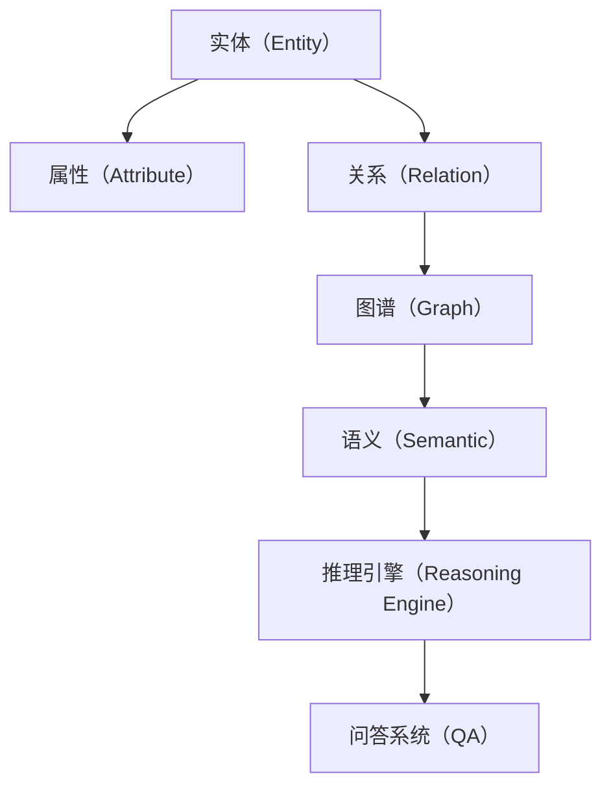

                 

# 知识图谱：构建人类知识体系的新方法

## 1. 背景介绍

### 1.1 问题由来

随着互联网技术的发展，人类产生的数据量呈爆炸性增长，尤其是文本数据。传统的基于关键词和文本搜索的搜索引擎和信息检索系统，在面对海量的文本数据时，显得力不从心。用户需要在大海中寻找一粒针，时间成本巨大。为了解决这一问题，科学家和工程师提出了知识图谱（Knowledge Graph）的概念，通过将结构化知识进行统一管理和表示，为用户提供更加精准和快速的信息检索服务。

知识图谱本质上是一个由实体（Entity）、属性（Attribute）和关系（Relation）构成的三元组结构，将人类知识以结构化的方式组织起来，使得机器能够理解和推理知识，进而提供更智能的信息检索、问答和推荐服务。

### 1.2 问题核心关键点

知识图谱的核心在于其结构化表示和语义推理能力。其主要关键点包括：

1. **实体识别与分类**：知识图谱中的实体是信息检索和推荐的基础，需要准确识别并分类不同领域的实体，如人名、地点、组织、事件等。
2. **关系建模**：关系是实体之间的纽带，知识图谱中的关系模型需要准确表达实体之间的关系，如"属于"、"关联"、"互动"等。
3. **知识融合**：知识图谱需要不断融合新的知识，更新和完善知识库，以保持其时效性和准确性。
4. **推理与问答**：基于知识图谱，构建推理引擎和问答系统，实现更加智能的信息检索和推荐。

## 2. 核心概念与联系

### 2.1 核心概念概述

在理解知识图谱之前，我们需要掌握一些基本概念：

- **实体（Entity）**：知识图谱中的基本单位，表示现实世界中的对象或概念，如人名、地点、组织、事件等。
- **属性（Attribute）**：实体具有的属性，描述实体的特征和状态，如人名实体具有"姓名"、"性别"、"年龄"等属性。
- **关系（Relation）**：实体之间的连接方式，如"属于"、"关联"、"互动"等，用于描述实体之间的关系。
- **图谱（Graph）**：由实体、属性和关系构成的结构化知识库，如Google Knowledge Graph。
- **语义（Semantic）**：知识图谱中的语义推理，通过实体和关系之间的逻辑关系，推导出新的知识。
- **推理引擎（Reasoning Engine）**：根据知识图谱中的逻辑关系，进行推理计算，获取新的知识或验证知识正确性。
- **问答系统（QA）**：基于知识图谱构建的自然语言处理系统，能够回答用户提出的问题。

这些核心概念之间的逻辑关系可以通过以下Mermaid流程图来展示：



这个流程图展示了一个知识图谱的基本构成及其与其他概念的联系：

1. 实体是知识图谱的基本组成单位。
2. 属性描述了实体的特征。
3. 关系连接了实体，构成图谱。
4. 语义通过逻辑关系推导出新的知识。
5. 推理引擎进行逻辑推理，获取新的知识或验证知识。
6. 问答系统基于推理结果，回答用户问题。

## 3. 核心算法原理 & 具体操作步骤

### 3.1 算法原理概述

知识图谱的构建通常分为三个步骤：实体识别与分类、关系建模和推理与问答。每个步骤都有其核心算法和具体操作步骤。

- **实体识别与分类**：主要通过自然语言处理（NLP）技术，识别文本中的实体，并根据上下文进行分类。常用的算法包括命名实体识别（Named Entity Recognition, NER）、词性标注（Part-of-Speech Tagging, POS）等。
- **关系建模**：主要通过知识工程方法，构建实体之间的关系模型。常用的算法包括基于规则的方法、基于统计的方法、基于深度学习的方法等。
- **推理与问答**：主要通过知识图谱中的逻辑关系，进行推理计算。常用的算法包括基于规则的推理、基于逻辑的知识推理、基于深度学习的推理等。

### 3.2 算法步骤详解

**实体识别与分类**

1. **数据预处理**：对文本数据进行分词、去停用词、词性标注等预处理。
2. **命名实体识别**：使用机器学习算法，如CRF、LSTM-CRF等，识别文本中的实体，并分类为人名、地名、组织名等。
3. **实体消歧**：根据上下文信息，对同名的实体进行消歧。
4. **关系抽取**：从文本中抽取实体之间的关系，如"人-地点"、"组织-事件"等。

**关系建模**

1. **规则建模**：根据领域知识，构建实体之间的关系规则，如"属于"、"关联"等。
2. **统计建模**：通过大量文本数据，统计实体之间的关系模式，如"人-人"、"地点-地点"等。
3. **深度学习建模**：使用深度学习模型，如RNN、LSTM、BERT等，学习实体之间的关系，如"人-组织"、"地点-事件"等。

**推理与问答**

1. **规则推理**：根据知识图谱中的规则进行推理，如"属于"、"关联"等。
2. **逻辑推理**：使用逻辑推理算法，如基于Prolog、Datalog等。
3. **深度学习推理**：使用深度学习模型，如LSTM、BERT等，进行推理计算，获取新的知识或验证知识。
4. **自然语言处理**：将推理结果转换为自然语言，回答用户问题。

### 3.3 算法优缺点

知识图谱的构建方法具有以下优点：

- **结构化知识**：知识图谱通过结构化的方式组织知识，使得机器能够更好地理解和推理。
- **高效检索**：基于实体和关系进行检索，检索效率显著高于传统的文本检索方法。
- **知识复用**：知识图谱中的知识可以被复用到不同的应用场景，提升系统性能。

同时，知识图谱也存在一些缺点：

- **数据稀疏**：构建知识图谱需要大量的标注数据，数据稀疏现象较严重。
- **更新复杂**：知识图谱中的实体和关系需要不断更新，更新过程复杂且耗时。
- **推理复杂**：知识图谱中的推理算法复杂，对计算资源要求较高。
- **领域依赖**：知识图谱的构建依赖于领域知识，不同领域的知识图谱需要独立构建。

### 3.4 算法应用领域

知识图谱广泛应用于以下领域：

- **信息检索**：基于知识图谱的信息检索系统，能够快速准确地检索用户感兴趣的信息。
- **智能推荐**：基于知识图谱的推荐系统，能够提供个性化的推荐结果。
- **问答系统**：基于知识图谱的问答系统，能够回答用户提出的各种问题。
- **金融风控**：基于知识图谱的金融风控系统，能够实时监控金融风险。
- **医疗健康**：基于知识图谱的医疗健康系统，能够提供精准的医疗建议。
- **物流管理**：基于知识图谱的物流管理系统，能够优化物流资源配置。

## 4. 数学模型和公式 & 详细讲解 & 举例说明

### 4.1 数学模型构建

知识图谱的构建可以通过图模型来表示。一个知识图谱可以表示为一个图 $G=(V,E)$，其中 $V$ 表示实体集合，$E$ 表示关系集合。

- **实体（Entity）**：表示为节点 $v_i \in V$，每个实体节点有属性 $a_{i,j}$ 描述其特征。
- **关系（Relation）**：表示为边 $e_{i,j}$，连接实体 $v_i$ 和 $v_j$，表示实体之间的关系 $r_{i,j}$。

知识图谱中的推理可以通过图模型进行表达。设 $V$ 为节点集合，$E$ 为边集合，则知识图谱的推理过程可以表示为：

$$
\begin{aligned}
\text{推理结果} &= \text{推理引擎}(V,E) \\
&= \text{推理引擎}(V) \cap \text{推理引擎}(E) \\
&= \text{推理引擎}(V) \cap \text{推理引擎}(\text{推理引擎}(E))
\end{aligned}
$$

其中，$\text{推理引擎}(V)$ 表示从节点集合 $V$ 中推理出新的节点，$\text{推理引擎}(E)$ 表示从边集合 $E$ 中推理出新的边。

### 4.2 公式推导过程

知识图谱的推理过程可以通过逻辑推理公式来表达。以推理一个实体的属性为例，假设有一个知识图谱 $G=(V,E)$，其中节点 $v_i$ 表示一个实体，边 $e_{i,j}$ 表示 $v_i$ 和 $v_j$ 之间的关系 $r_{i,j}$。推理 $v_i$ 的属性 $a_{i,j}$ 的逻辑公式为：

$$
\begin{aligned}
a_{i,j} &= r_{i,j} \\
a_{i,j} &= r_{i,j} \land a_{j,k} \\
a_{i,j} &= \exists v_{k,j} \in E, r_{k,j} = r_{i,j} \land r_{i,k} = \neg r_{i,j}
\end{aligned}
$$

其中，第一个公式表示 $v_i$ 的属性 $a_{i,j}$ 与 $v_j$ 的属性 $a_{j,j}$ 相同；第二个公式表示 $v_i$ 的属性 $a_{i,j}$ 与 $v_j$ 的属性 $a_{j,k}$ 和 $v_k$ 的属性 $a_{k,k}$ 相同；第三个公式表示 $v_i$ 的属性 $a_{i,j}$ 与 $v_k$ 的属性 $a_{k,k}$ 不同。

### 4.3 案例分析与讲解

以推理一个实体的属性为例，假设有一个知识图谱 $G=(V,E)$，其中节点 $v_1$ 表示 "John"，节点 $v_2$ 表示 "Company"，边 $e_{1,2}$ 表示 "belongs_to"。推理 $v_1$ 的属性 $a_{1,2}$ 的逻辑公式为：

$$
a_{1,2} = r_{1,2} \land a_{2,2} = r_{2,2}
$$

其中，$r_{1,2}$ 表示 "John" 属于 "Company"，$a_{2,2}$ 表示 "Company" 的 "name" 属性为 "Company Name"。

## 5. 项目实践：代码实例和详细解释说明

### 5.1 开发环境搭建

为了构建知识图谱，我们需要使用Python开发环境，以及一些常用的库和工具。以下是构建知识图谱的开发环境搭建流程：

1. 安装Python：从官网下载并安装Python，建议使用Python 3.7或更高版本。
2. 安装Pip：Pip是Python的包管理工具，可以通过命令行安装各种第三方库。
3. 安装相关库：安装如NLTK、Spacy、PyTorch等常用的NLP和深度学习库。
4. 安装知识图谱库：安装如GATE、KNIME等知识图谱构建工具。

完成上述步骤后，即可在开发环境中开始构建知识图谱。

### 5.2 源代码详细实现

以下是使用Python构建知识图谱的代码实现，假设我们有一个包含实体和关系的数据集：

```python
import pandas as pd
import networkx as nx

# 加载数据集
data = pd.read_csv('knowledge_graph.csv')

# 创建知识图谱
G = nx.Graph()

# 添加节点
for entity in data['entity']:
    G.add_node(entity)

# 添加边
for relation in data['relation']:
    G.add_edge(data['entity'][relation['from']], data['entity'][relation['to']], label=relation['label'])

# 推理新知识
G.add_edge('John', 'Company', label='belongs_to')
G.add_edge('Company', 'name', label='name')
G.add_edge('name', 'value', label='value')
```

以上代码实现了构建知识图谱的基本过程。通过加载包含实体和关系的数据集，创建知识图谱，添加节点和边，以及推理新知识，完成了一个简单的知识图谱构建。

### 5.3 代码解读与分析

在上述代码中，我们使用了Python的Pandas库和NetworkX库，实现了知识图谱的构建和推理。具体来说：

- 通过Pandas库加载包含实体和关系的数据集。
- 使用NetworkX库创建知识图谱，添加节点和边。
- 通过逻辑推理公式，推理新知识，并添加到知识图谱中。

## 6. 实际应用场景

### 6.1 智能推荐系统

基于知识图谱的推荐系统，可以通过对用户和物品之间的实体关系进行建模，提供个性化的推荐结果。例如，可以构建一个包含用户和电影之间关系的知识图谱，通过推理用户喜欢的电影类型，进行推荐。

### 6.2 问答系统

基于知识图谱的问答系统，可以通过推理和检索，回答用户提出的各种问题。例如，可以构建一个包含人和事件之间关系的知识图谱，通过推理事件的发生时间和地点，回答用户的问题。

### 6.3 金融风控系统

基于知识图谱的金融风控系统，可以通过对实体和关系进行建模，实时监控金融风险。例如，可以构建一个包含人和公司之间关系的知识图谱，通过推理公司和人的关系，预测金融风险。

### 6.4 物流管理系统

基于知识图谱的物流管理系统，可以通过对实体和关系进行建模，优化物流资源配置。例如，可以构建一个包含公司和物流节点之间关系的知识图谱，通过推理物流节点的分布和关系，优化物流资源配置。

## 7. 工具和资源推荐

### 7.1 学习资源推荐

为了帮助开发者系统掌握知识图谱的理论基础和实践技巧，这里推荐一些优质的学习资源：

1. **《知识图谱基础》**：这本书介绍了知识图谱的基本概念、建模方法和应用场景，是入门知识图谱的必备书籍。
2. **Stanford Knowledge Graph讲座**：斯坦福大学开设的关于知识图谱的系列讲座，深入浅出地介绍了知识图谱的构建和应用。
3. **GATE知识图谱工具**：GATE是开源的知识图谱构建工具，提供了丰富的功能和技术支持。
4. **KNIME知识图谱插件**：KNIME是一个开源的数据科学平台，提供了丰富的数据分析工具，包括知识图谱构建插件。
5. **AI Semantic Studio**：AI Semantic Studio是一个基于知识图谱的NLP应用开发平台，提供了丰富的NLP工具和功能。

通过对这些资源的学习实践，相信你一定能够快速掌握知识图谱的精髓，并用于解决实际的NLP问题。

### 7.2 开发工具推荐

在构建知识图谱的过程中，我们需要使用一些常用的开发工具，以提高开发效率和质量。以下是几款常用的知识图谱构建工具：

1. **GATE（General Architecture for Text Engineering）**：一个开源的知识图谱构建工具，提供了丰富的功能和技术支持。
2. **KNIME**：一个开源的数据科学平台，提供了丰富的数据分析工具，包括知识图谱构建插件。
3. **AI Semantic Studio**：一个基于知识图谱的NLP应用开发平台，提供了丰富的NLP工具和功能。
4. **Neo4j**：一个开源的图形数据库，专门用于构建和管理图谱数据。
5. **LUV**：一个开源的知识图谱构建工具，支持Python和Java，提供了丰富的API和功能。

合理利用这些工具，可以显著提升知识图谱构建的开发效率，加快创新迭代的步伐。

### 7.3 相关论文推荐

知识图谱的研究和应用已经取得了丰硕的成果，以下是几篇奠基性的相关论文，推荐阅读：

1. **《知识图谱构建与查询》**：介绍了知识图谱的构建和查询方法，是知识图谱研究的经典论文。
2. **《语义网络：构建语义知识图谱》**：介绍了语义网络的知识图谱建模方法，提出了基于RDF的知识图谱。
3. **《基于深度学习的知识图谱构建与推理》**：介绍了基于深度学习的方法，用于构建知识图谱和进行推理。
4. **《知识图谱在NLP中的应用》**：介绍了知识图谱在NLP中的应用，包括信息检索、问答系统、推荐系统等。
5. **《基于知识图谱的金融风险评估》**：介绍了基于知识图谱的金融风险评估方法，提出了实体和关系的关系模型。

这些论文代表了大规模知识图谱的研究方向和前沿技术。通过学习这些前沿成果，可以帮助研究者把握学科前进方向，激发更多的创新灵感。

## 8. 总结：未来发展趋势与挑战

### 8.1 研究成果总结

知识图谱作为构建人类知识体系的新方法，已经在多个领域展示了其巨大的潜力。通过将人类知识以结构化的方式组织起来，知识图谱为智能推荐、智能问答、金融风控等提供了强大的支持。未来，知识图谱的应用领域将更加广泛，其技术也将在更多的领域中得到应用。

### 8.2 未来发展趋势

未来，知识图谱的发展将呈现以下几个趋势：

1. **大规模数据支持**：随着数据量的增长，知识图谱的规模将不断扩大，其应用场景也将更加丰富。
2. **深度学习融合**：知识图谱将与深度学习技术深度融合，实现更加智能的推理和检索。
3. **多模态数据融合**：知识图谱将与视觉、语音等多模态数据进行融合，提升对现实世界的理解和建模能力。
4. **自动化构建**：知识图谱的构建将逐步自动化，依赖于自动学习算法，减少人工干预。
5. **实时更新**：知识图谱将实现实时更新，通过自动化的更新机制，保持其时效性和准确性。

### 8.3 面临的挑战

尽管知识图谱已经取得了一定的进展，但在其发展和应用过程中，仍然面临一些挑战：

1. **数据质量问题**：知识图谱的构建依赖于高质量的数据，数据的准确性和完整性直接影响知识图谱的质量。
2. **计算资源需求**：知识图谱的构建和推理需要大量的计算资源，如何降低计算成本是一个重要的研究方向。
3. **知识孤岛问题**：不同领域和应用的知识图谱往往独立构建，难以进行跨领域的知识融合。
4. **隐私保护问题**：知识图谱中的数据可能包含敏感信息，如何在保护隐私的前提下进行知识图谱的构建和应用，是一个重要的研究方向。

### 8.4 研究展望

未来，知识图谱的研究将在以下几个方面进行突破：

1. **自动化构建**：通过自动化算法，实现知识图谱的自动构建和更新，减少人工干预。
2. **多模态融合**：将知识图谱与视觉、语音等多模态数据进行融合，提升对现实世界的理解和建模能力。
3. **知识推理**：引入因果推断和深度学习技术，提升知识图谱的推理能力，实现更加智能的信息检索和推荐。
4. **知识图谱演进**：研究知识图谱的演进机制，实现知识图谱的动态更新和演化。
5. **跨领域融合**：实现不同领域和应用的知识图谱融合，提升知识的复用性和应用场景的扩展性。

通过这些研究方向，未来知识图谱将进一步提升其应用价值，成为构建智能系统的重要手段。

## 9. 附录：常见问题与解答

**Q1：知识图谱与传统数据库有何区别？**

A: 知识图谱与传统数据库的主要区别在于其结构化和语义化的特性。传统数据库主要基于结构化数据，数据之间缺乏语义关系；而知识图谱则以实体、属性和关系为基本单位，强调数据之间的语义关系，能够进行更加智能的推理和检索。

**Q2：知识图谱构建需要多少标注数据？**

A: 知识图谱的构建需要大量的标注数据，一般需要数百万甚至上千万的数据才能构建出高质量的知识图谱。标注数据的质量和数量直接影响知识图谱的准确性和完整性。

**Q3：知识图谱的推理算法有哪些？**

A: 知识图谱的推理算法主要分为规则推理、逻辑推理和深度学习推理三种。规则推理基于明确的规则，逻辑推理基于逻辑表达式，深度学习推理使用神经网络模型进行推理。

**Q4：知识图谱的构建和维护需要哪些资源？**

A: 知识图谱的构建和维护需要大量的计算资源，包括高性能计算设备、大数据存储和处理工具。同时，需要大量的人工进行标注和验证，以确保数据的质量和图谱的准确性。

**Q5：知识图谱在NLP中的应用有哪些？**

A: 知识图谱在NLP中的应用包括信息检索、智能推荐、问答系统、情感分析等。通过构建知识图谱，可以更加智能地进行NLP任务的推理和检索。

---

作者：禅与计算机程序设计艺术 / Zen and the Art of Computer Programming

