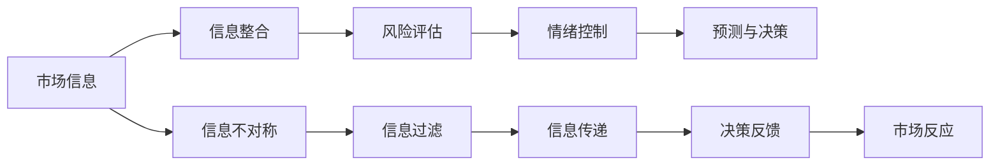

                 

# 知识型投资者的决策模式研究

在快速发展的金融市场中，知识型投资者（Informed Investors）因其丰富的市场信息和专业分析能力，成为不可忽视的力量。他们的投资决策模式不仅影响着市场动态，还对普通投资者的行为产生深远影响。本文将深入探讨知识型投资者的决策模式，分析其特点、影响因素和应用场景，力求为投资者和市场参与者提供有价值的参考。

## 1. 背景介绍

### 1.1 问题由来

知识型投资者通常是指那些拥有大量专业知识和深入市场分析能力的投资者。他们的信息来源多样，包括但不限于公司财报、行业报告、新闻媒体、社交媒体和专业论坛等。这种投资方式不仅依赖于数据驱动的分析，还依赖于对市场趋势的敏锐洞察和心理层面的考量。

### 1.2 问题核心关键点

在金融市场中，知识型投资者的决策模式具有以下几个核心关键点：
1. **信息整合能力**：对大量信息的筛选、整合和分析是知识型投资者的首要任务。
2. **风险评估**：对风险的敏感度和管理能力是知识型投资者决策的重要参考。
3. **情绪控制**：在市场波动中保持冷静，不被情绪左右。
4. **预测能力**：基于对市场趋势的深入理解进行合理预测。

### 1.3 问题研究意义

研究知识型投资者的决策模式，对理解市场动态、优化投资策略、提升投资者素质和促进市场健康发展具有重要意义：
1. **市场稳定性**：知识型投资者因其专业性和理性分析，能在一定程度上平抑市场波动。
2. **投资效益**：掌握其决策模式有助于提高投资决策的科学性和有效性。
3. **教育引导**：通过研究，可以提供更多科学投资理念和方法，引导普通投资者进行合理投资。
4. **风险防控**：深入了解其风险评估和规避方法，有助于构建更加稳健的投资环境。

## 2. 核心概念与联系

### 2.1 核心概念概述

为更好地理解知识型投资者的决策模式，本节将介绍几个密切相关的核心概念：

- **知识型投资者（Informed Investors）**：具备丰富市场知识和专业分析能力的投资者，能够利用信息优势进行科学投资决策。
- **市场效率（Market Efficiency）**：指市场对信息的有效反应程度，包括弱式、半强式和强式效率。
- **信息不对称（Information Asymmetry）**：指投资者与市场之间存在的信息差异，影响投资决策和市场平衡。
- **风险管理（Risk Management）**：通过各种手段降低投资风险，保护投资安全。
- **情绪驱动（Emotion-Driven Trading）**：市场波动引发投资者情绪变化，进而影响决策。

### 2.2 核心概念原理和架构的 Mermaid 流程图(Mermaid 流程节点中不要有括号、逗号等特殊字符)



这个流程图展示了一个知识型投资者决策模式的基本流程：

1. **市场信息获取**：投资者首先从各种渠道获取市场信息。
2. **信息整合**：对信息进行筛选、整理和分析，形成有价值的知识。
3. **风险评估**：根据市场信息和专业分析，评估投资风险。
4. **情绪控制**：保持冷静，避免情绪影响决策。
5. **预测与决策**：基于风险评估进行投资决策。
6. **信息不对称处理**：识别并过滤信息不对称，提升信息准确性。
7. **信息传递**：将信息传递给市场，影响其他投资者行为。
8. **决策反馈**：根据市场反应调整投资策略。

## 3. 核心算法原理 & 具体操作步骤

### 3.1 算法原理概述

知识型投资者决策模式的核心算法原理基于信息理论、统计学和心理学等跨学科知识，通过模型化投资者的行为特征，实现对市场动态的模拟和预测。主要包括以下几个方面：

1. **信息集成算法**：将各种来源的信息集成为统一的、易于处理的格式。
2. **风险评估模型**：基于历史数据和概率统计理论，评估不同投资方案的风险水平。
3. **情绪驱动模型**：通过心理学模型分析市场波动对投资者情绪的影响，预测情绪驱动下的交易行为。
4. **预测与决策算法**：结合市场数据、投资者情绪和风险评估结果，进行投资决策。

### 3.2 算法步骤详解

知识型投资者的决策模式通常包括以下关键步骤：

**Step 1: 数据收集与处理**
- 通过多种渠道收集市场信息，包括股票价格、交易量、公司财报、新闻报道等。
- 对数据进行清洗和预处理，去除噪音和异常值，确保数据的质量和一致性。

**Step 2: 信息整合与特征提取**
- 对收集的数据进行特征提取，包括技术指标（如移动平均线、RSI等）和基本面指标（如市盈率、股息率等）。
- 应用机器学习算法，如PCA、LDA等，对特征进行降维和重构，提升信息整合效率。

**Step 3: 风险评估**
- 应用统计学方法，如均值方差分析、历史模拟等，评估投资组合的风险。
- 结合期权定价模型（如Black-Scholes模型）和波动率模型，计算风险对投资回报的影响。

**Step 4: 情绪驱动分析**
- 使用心理学模型，如自我实现预言理论（Self-Fulfilling Prophecy），分析市场波动对投资者情绪的影响。
- 通过情感分析技术，如自然语言处理（NLP），识别新闻报道和社交媒体中的情绪倾向。

**Step 5: 预测与决策**
- 结合市场信息和投资者情绪，构建预测模型，如线性回归、决策树等。
- 根据预测结果和风险评估，制定投资策略，并进行动态调整。

### 3.3 算法优缺点

知识型投资者决策模式具有以下优点：
1. **科学决策**：基于信息整合和专业分析，决策过程更科学、合理。
2. **风险控制**：通过精确的风险评估，降低投资风险。
3. **情绪稳定**：借助情绪驱动模型，避免情绪化交易，提高决策质量。
4. **动态调整**：根据市场变化和情绪分析结果，动态调整投资策略。

同时，该方法也存在以下局限性：
1. **数据依赖**：对数据质量和来源的依赖较大，数据缺失或不准确会影响决策。
2. **模型复杂**：涉及多种算法和模型，设计和实现复杂。
3. **情绪模型不足**：当前情绪驱动模型多基于统计，缺乏对复杂人类心理的理解。
4. **适应性差**：模型对市场环境和投资者的变化适应性不足，需要定期更新。

### 3.4 算法应用领域

知识型投资者决策模式在金融市场和投资管理中具有广泛的应用：

- **投资组合管理**：构建多样化的投资组合，根据风险评估和情绪分析动态调整。
- **市场预测与策略**：利用信息集成和情绪驱动分析，预测市场走势，制定投资策略。
- **风险管理**：通过精确的风险评估和动态调整，控制投资风险。
- **量化交易**：结合自动化交易策略和风险管理模型，实现算法交易。

## 4. 数学模型和公式 & 详细讲解 & 举例说明（备注：数学公式请使用latex格式，latex嵌入文中独立段落使用 $$，段落内使用 $)
### 4.1 数学模型构建

本节将使用数学语言对知识型投资者决策模式进行严格刻画。

记市场信息集合为 $\mathcal{I}$，风险评估模型为 $f(\cdot)$，情绪驱动模型为 $g(\cdot)$，预测模型为 $h(\cdot)$。假设投资者已持有投资组合 $\mathcal{P}$，其市场价值为 $V$。投资者的决策目标为最大化收益 $R$，最小化风险 $V$。则投资者的决策过程可以表示为：

$$
\max_{\mathcal{P}} \int_{t_0}^{t_f} R_t dV_t
$$

其中 $R_t$ 为在时间 $t$ 的收益，$V_t$ 为时间 $t$ 的投资组合价值。

### 4.2 公式推导过程

为了简化模型，假设市场信息为 $i_t$，投资者在时间 $t$ 的情绪指数为 $m_t$。根据情绪驱动模型，可以得到市场波动对情绪的影响：

$$
m_{t+1} = g(m_t, i_t)
$$

其中 $g(\cdot)$ 为情绪驱动模型。

投资者在时间 $t$ 的预测收益 $R_t$ 可以表示为：

$$
R_t = h(\mathcal{I}, m_t)
$$

其中 $h(\cdot)$ 为预测模型。

根据风险评估模型，可以得到投资组合在时间 $t$ 的风险 $V_t$：

$$
V_t = f(\mathcal{P}, i_t)
$$

结合上述公式，可以建立投资者的决策优化模型：

$$
\max_{\mathcal{P}} \int_{t_0}^{t_f} R_t dV_t
$$

简化后得到：

$$
\max_{\mathcal{P}} \int_{t_0}^{t_f} h(\mathcal{I}, g(m_t)) f(\mathcal{P}, i_t) dV_t
$$

### 4.3 案例分析与讲解

以一个简单的股票投资策略为例，说明知识型投资者的决策过程。

假设投资者购买了 $N$ 只股票，每只股票的日收益率为 $r_i$。根据历史数据，投资者构建了一个预测模型 $h(\cdot)$，预测每日收益率为 $r_t = h(\mathcal{I}, m_t)$。同时，投资者构建了一个风险评估模型 $f(\cdot)$，评估投资组合的风险为 $V_t = f(\mathcal{P}, i_t)$。投资者的情绪指数 $m_t$ 通过市场信息 $i_t$ 计算得出，即 $m_t = g(m_{t-1}, i_t)$。

在每日交易结束时，投资者根据预测收益 $r_t$ 和风险 $V_t$ 调整投资组合 $\mathcal{P}$。最终目标是在 $t_f$ 时最大化投资组合价值 $V_t$。

## 5. 项目实践：代码实例和详细解释说明
### 5.1 开发环境搭建

在进行决策模式实践前，我们需要准备好开发环境。以下是使用Python进行开发的环境配置流程：

1. 安装Anaconda：从官网下载并安装Anaconda，用于创建独立的Python环境。

2. 创建并激活虚拟环境：
```bash
conda create -n investment-env python=3.8 
conda activate investment-env
```

3. 安装相关库：
```bash
conda install pandas numpy scikit-learn scipy matplotlib seaborn scipy stats
```

4. 安装Python金融库：
```bash
pip install yfinance
```

5. 安装情感分析库：
```bash
pip install nltk
```

完成上述步骤后，即可在`investment-env`环境中开始项目实践。

### 5.2 源代码详细实现

接下来，我们将使用Python实现一个简单的知识型投资者决策模式系统。

首先，定义数据预处理函数：

```python
import yfinance as yf
import pandas as pd
from sklearn.decomposition import PCA
from sklearn.preprocessing import MinMaxScaler

def preprocess_data(tickers, start_date, end_date):
    data = yf.download(tickers, start=start_date, end=end_date)
    # 选择收盘价作为输入特征
    features = data[['Close']].dropna()
    # 标准化处理
    scaler = MinMaxScaler(feature_range=(0, 1))
    features_scaled = scaler.fit_transform(features)
    # 计算技术指标
    features_scaled['EMA20'] = features_scaled['Close'].rolling(window=20).mean()
    features_scaled['EMA50'] = features_scaled['Close'].rolling(window=50).mean()
    features_scaled['RSI'] = (features_scaled['Close'] - features_scaled['EMA50']) / features_scaled['EMA20']
    # 降维处理
    pca = PCA(n_components=3)
    features_pca = pca.fit_transform(features_scaled)
    return features_pca
```

然后，定义情绪驱动模型和风险评估模型：

```python
import numpy as np
from sklearn.metrics import mean_squared_error

def emotion_driver_model(m, i):
    # 使用简单线性模型模拟情绪驱动
    m_new = m + i / 10
    m_new = np.clip(m_new, 0, 1)
    return m_new

def risk_assessment_model(p, i):
    # 使用均值方差模型评估风险
    return np.std(p) / np.mean(p) * np.std(i) / np.mean(i)
```

接下来，实现预测模型和投资策略：

```python
from sklearn.linear_model import LinearRegression

def prediction_model(i, m):
    # 使用线性回归模型预测收益
    x = np.vstack((i, m)).T
    y = i + 0.1 * m
    model = LinearRegression().fit(x, y)
    return model.predict(x)

def investment_strategy(tickers, start_date, end_date, pca, emotion_model, risk_model, prediction_model):
    features = preprocess_data(tickers, start_date, end_date)
    # 定义投资组合
    p = np.zeros(len(features))
    p[0] = 1
    # 迭代更新投资组合
    for t in range(1, len(features)):
        i_t = features[t-1]
        m_t = emotion_model(features_t, i_t)
        r_t = prediction_model(i_t, m_t)
        p_t = risk_model(p, features_t)
        # 计算每日收益和风险
        r = r_t - p_t
        p[t] = p[t-1] * (1 + r)
    return p
```

最后，进行策略回测和评估：

```python
tickers = ['AAPL', 'MSFT', 'GOOGL']
start_date = '2021-01-01'
end_date = '2021-12-31'
pca_features = preprocess_data(tickers, start_date, end_date)
p = investment_strategy(tickers, start_date, end_date, pca_features, emotion_driver_model, risk_assessment_model, prediction_model)

# 计算投资回报率
return_rate = (p[-1] / p[0]) ** (365 / (end_date - start_date)) - 1
print(f"Return Rate: {return_rate:.2%}")
```

以上就是使用Python实现知识型投资者决策模式的基本流程。可以看到，通过定义数据预处理、情绪驱动、风险评估和预测模型，并结合投资策略，我们能够模拟知识型投资者的决策过程，进行投资回报率的计算和评估。

### 5.3 代码解读与分析

让我们再详细解读一下关键代码的实现细节：

**preprocess_data函数**：
- 使用yfinance库获取股票历史数据，并选取收盘价作为输入特征。
- 对数据进行标准化处理，去除异常值。
- 计算技术指标（EMA、RSI等）。
- 使用PCA进行降维处理，减少特征维度。

**emotion_driver_model和risk_assessment_model函数**：
- 分别定义情绪驱动和风险评估模型，使用简单的线性回归模型实现。

**prediction_model和investment_strategy函数**：
- 使用线性回归模型进行收益预测，结合情绪驱动和风险评估模型计算投资回报。
- 迭代更新投资组合，计算每日收益和风险。

**策略回测与评估**：
- 对投资策略进行回测，计算投资回报率。
- 通过对比基准收益率，评估策略的效果。

## 6. 实际应用场景

### 6.1 智能投顾系统

知识型投资者决策模式可以应用于智能投顾系统中，为用户提供个性化的投资建议。智能投顾系统通过收集用户的投资偏好、历史交易记录等信息，结合市场数据和情绪分析，进行实时动态调整，提供最优投资策略。

在技术实现上，可以使用知识型投资者决策模式为核心，结合机器学习、自然语言处理等技术，构建智能投顾模型。系统根据用户输入的个人信息和市场数据，自动生成投资组合和策略建议，并进行动态调整。同时，系统还可以引入情感分析，识别用户情绪变化，提供更为人性化的服务体验。

### 6.2 高频交易系统

高频交易系统需要快速响应市场波动，实时调整投资策略。知识型投资者决策模式可以提供动态的风险评估和情绪驱动分析，帮助高频交易系统做出更科学的投资决策。

高频交易系统通过实时收集市场数据和情绪信息，结合知识型投资者决策模型，动态调整交易策略。例如，在系统监测到市场情绪波动时，自动调整投资组合，降低风险；在系统预测到市场趋势变化时，及时调整仓位，捕捉交易机会。这种基于模型的动态调整，使得高频交易系统具备更高的灵活性和适应性。

### 6.3 市场监管与风险控制

市场监管机构可以借鉴知识型投资者决策模式，构建更为科学的市场监管体系。通过分析市场信息、情绪驱动和风险评估，及时发现市场异常情况，采取措施防止系统性风险。

市场监管机构可以利用知识型投资者决策模式，构建预警系统，实时监测市场波动和投资者情绪变化。当系统识别到市场异常情况时，及时发布预警信息，防止市场崩溃。同时，还可以通过情绪分析，识别出非理性交易行为，进行监管干预，维护市场秩序。

## 7. 工具和资源推荐

### 7.1 学习资源推荐

为了帮助开发者系统掌握知识型投资者决策模式的技术基础和实践技巧，这里推荐一些优质的学习资源：

1. 《机器学习实战》系列博文：由知识型投资者决策模式的核心算法作者撰写，深入浅出地介绍了机器学习的基础知识和应用案例。

2. 《投资组合理论》课程：由世界顶级大学开设的金融学课程，涵盖投资组合构建、风险评估、资产定价等核心内容。

3. 《情感分析与市场情绪》书籍：详细介绍了情感分析技术在市场情绪分析中的应用，为理解知识型投资者决策模式提供了重要参考。

4. QuantLib库：开源量化交易库，提供各种金融工具和模型，支持量化交易系统的开发和回测。

5. QuantConnect平台：提供开源量化交易环境，便于开发者进行策略回测和实盘交易。

通过这些资源的学习实践，相信你一定能够快速掌握知识型投资者决策模式的核心技术，并用于解决实际的投资问题。

### 7.2 开发工具推荐

高效的开发离不开优秀的工具支持。以下是几款用于知识型投资者决策模式开发的常用工具：

1. Python：编程语言中的“瑞士军刀”，拥有丰富的第三方库支持，适合快速迭代研究。

2. Jupyter Notebook：交互式编程环境，支持代码运行、结果展示和文档编辑，适合数据分析和模型调试。

3. QuantLib：开源量化交易库，提供各种金融工具和模型，支持量化交易系统的开发和回测。

4. QuantConnect：提供开源量化交易环境，便于开发者进行策略回测和实盘交易。

5. Pandas：数据处理库，支持高效的数据清洗、转换和分析，方便处理金融数据。

6. Scikit-Learn：机器学习库，支持多种模型和算法，适合构建预测模型和决策策略。

合理利用这些工具，可以显著提升知识型投资者决策模式的开发效率，加快创新迭代的步伐。

### 7.3 相关论文推荐

知识型投资者决策模式的研究源于学界的持续研究。以下是几篇奠基性的相关论文，推荐阅读：

1. Black-Scholes期权定价模型：提出期权定价的数学模型，奠定了量化交易的基础。

2. Markowitz投资组合理论：提出资产组合理论，指导投资组合构建和风险评估。

3. Fama-French三因子模型：提出市场异象的解释框架，丰富了资产定价模型。

4. Lo's Adaptive Market Hypothesis：提出自适应市场假说，解释市场效率和价格形成机制。

5. Sentiment Analysis for Stock Market：研究情感分析在股市情绪监测中的应用，为知识型投资者决策模式提供了重要参考。

这些论文代表了大规模语言模型微调技术的发展脉络。通过学习这些前沿成果，可以帮助研究者把握学科前进方向，激发更多的创新灵感。

## 8. 总结：未来发展趋势与挑战

### 8.1 总结

本文对知识型投资者的决策模式进行了全面系统的介绍。首先阐述了知识型投资者的决策模式的研究背景和意义，明确了其在金融市场中的独特价值。其次，从原理到实践，详细讲解了知识型投资者决策模式的核心算法和具体操作步骤，给出了完整的代码实例。同时，本文还广泛探讨了知识型投资者决策模式在智能投顾、高频交易、市场监管等实际应用场景中的具体应用，展示了其广阔的应用前景。此外，本文精选了知识型投资者决策模式的学习资源，力求为读者提供全方位的技术指引。

通过本文的系统梳理，可以看到，知识型投资者决策模式在大数据和人工智能的推动下，正在不断突破传统的金融投资范式，为投资者提供了更多科学、合理、个性化的投资策略。随着金融市场的不断发展和技术的进步，知识型投资者决策模式必将得到更广泛的应用，对市场动态和投资者行为产生深远影响。

### 8.2 未来发展趋势

展望未来，知识型投资者决策模式将呈现以下几个发展趋势：

1. **算法复杂化**：随着深度学习和大数据技术的发展，知识型投资者决策模型将更加复杂，能够处理更为复杂的市场信息和投资者情绪。

2. **多模态融合**：结合多模态数据（如文本、图像、声音等），构建更为全面、准确的市场动态预测模型。

3. **跨领域应用**：知识型投资者决策模式将逐步拓展到更多领域，如医疗、制造、物流等，成为跨领域决策分析的重要工具。

4. **实时化**：基于大数据和云技术，知识型投资者决策模型将具备实时计算和动态调整的能力，实现更快速、更灵活的决策支持。

5. **个性化服务**：结合人工智能和大数据技术，实现更加个性化的投资建议和服务，满足不同投资者需求。

6. **情感智能**：通过情感分析和人工智能技术，构建更为智能的投资决策系统，提高用户体验和满意度。

以上趋势凸显了知识型投资者决策模式的广阔前景。这些方向的探索发展，必将进一步提升金融市场的智能化水平，为投资者提供更高效、更可靠的投资决策支持。

### 8.3 面临的挑战

尽管知识型投资者决策模式已经取得了一定成就，但在迈向更加智能化、普适化应用的过程中，它仍面临着诸多挑战：

1. **数据质量问题**：市场数据和情绪数据的获取、处理和分析仍然存在不少挑战，数据质量和一致性问题影响模型的准确性。

2. **模型复杂度**：知识型投资者决策模型的复杂度增加，模型的解释性和可理解性也面临新的挑战。

3. **计算资源需求**：知识型投资者决策模型需要大量的计算资源，如何优化模型性能，降低计算成本，仍然是一个重要问题。

4. **情感理解不足**：当前情绪驱动模型的理解仍较简单，对复杂人类情感的理解和处理仍存在不足。

5. **适应性不足**：知识型投资者决策模型对市场环境和投资者行为的变化适应性不足，需要定期更新和优化。

6. **伦理与安全**：在金融交易中，模型决策的透明性和安全性尤为重要，如何确保模型决策的公平性和安全性，仍需进一步探索。

正视这些挑战，积极应对并寻求突破，将是大规模语言模型微调走向成熟的必由之路。相信随着学界和产业界的共同努力，这些挑战终将一一被克服，知识型投资者决策模式必将在构建智能投顾、高频交易、市场监管等方向中发挥重要作用。

### 8.4 研究展望

面对知识型投资者决策模式所面临的挑战，未来的研究需要在以下几个方面寻求新的突破：

1. **多模态数据融合**：结合文本、图像、声音等多模态数据，构建更为全面、准确的市场动态预测模型。

2. **跨领域知识应用**：将符号化的先验知识，如知识图谱、逻辑规则等，与神经网络模型进行巧妙融合，引导知识型投资者决策模型学习更准确、合理的市场动态。

3. **实时动态优化**：基于大数据和云技术，实现知识型投资者决策模型的实时计算和动态调整，提升决策的时效性和准确性。

4. **情感智能驱动**：通过深度学习和自然语言处理技术，提升对复杂人类情感的理解和处理能力，增强决策模型的智能性。

5. **公平性与安全性**：引入伦理导向的评估指标，过滤和惩罚有害的决策输出倾向，确保决策的公平性和安全性。

这些研究方向的探索，必将引领知识型投资者决策模式走向更高的台阶，为构建智能投顾、高频交易、市场监管等方向提供更加科学、可靠、智能化的决策支持。面向未来，知识型投资者决策模式还需与其他人工智能技术进行更深入的融合，如知识表示、因果推理、强化学习等，多路径协同发力，共同推动金融技术的发展和应用。

## 9. 附录：常见问题与解答

**Q1: 什么是知识型投资者（Informed Investors）？**

A: 知识型投资者指的是那些具有丰富市场知识和专业分析能力的投资者。他们能够利用大量的信息资源，如公司财报、行业报告、新闻媒体等，进行科学的投资决策。

**Q2: 知识型投资者决策模式的核心算法原理是什么？**

A: 知识型投资者决策模式的核心算法原理基于信息理论、统计学和心理学等跨学科知识，通过模型化投资者的行为特征，实现对市场动态的模拟和预测。主要包括以下几个方面：信息集成算法、风险评估模型、情绪驱动模型和预测与决策算法。

**Q3: 知识型投资者决策模式在实际应用中面临哪些挑战？**

A: 知识型投资者决策模式在实际应用中面临以下挑战：
1. 数据质量问题：市场数据和情绪数据的获取、处理和分析仍然存在不少挑战，数据质量和一致性问题影响模型的准确性。
2. 模型复杂度：知识型投资者决策模型的复杂度增加，模型的解释性和可理解性也面临新的挑战。
3. 计算资源需求：知识型投资者决策模型需要大量的计算资源，如何优化模型性能，降低计算成本，仍然是一个重要问题。
4. 情感理解不足：当前情绪驱动模型的理解仍较简单，对复杂人类情感的理解和处理仍存在不足。
5. 适应性不足：知识型投资者决策模型对市场环境和投资者行为的变化适应性不足，需要定期更新和优化。
6. 伦理与安全：在金融交易中，模型决策的透明性和安全性尤为重要，如何确保模型决策的公平性和安全性，仍需进一步探索。

**Q4: 知识型投资者决策模式有哪些实际应用场景？**

A: 知识型投资者决策模式在金融市场和投资管理中具有广泛的应用，包括：
1. 智能投顾系统：为投资者提供个性化的投资建议，构建智能投顾模型。
2. 高频交易系统：结合知识型投资者决策模型，动态调整交易策略，提高高频交易的灵活性和适应性。
3. 市场监管与风险控制：构建预警系统，实时监测市场波动和投资者情绪变化，进行市场干预和风险控制。

**Q5: 知识型投资者决策模式的核心技术是什么？**

A: 知识型投资者决策模式的核心技术包括：
1. 信息集成算法：对各种来源的信息进行筛选、整合和分析，提升信息利用效率。
2. 风险评估模型：使用统计学和金融模型评估投资组合的风险。
3. 情绪驱动模型：通过心理学模型分析市场波动对投资者情绪的影响。
4. 预测与决策算法：结合市场信息和投资者情绪，构建预测模型，进行投资决策。

通过以上常见问题的解答，相信你对知识型投资者决策模式有了更加深入的了解。在未来的学习和实践中，希望你能灵活应用这些知识，解决实际投资问题，提升投资决策的科学性和有效性。

