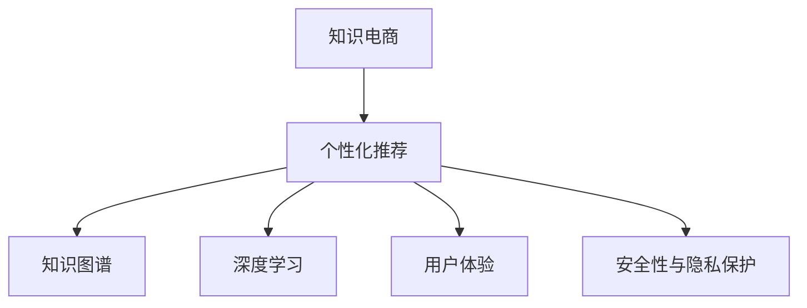

                 

# 知识电商要开发有针对性的实用知识产品

> 关键词：知识电商,产品开发,个性化推荐,知识图谱,深度学习,用户体验

## 1. 背景介绍

### 1.1 问题由来
知识电商是当前互联网领域的一大热门话题，通过将电商与知识服务结合，为用户提供更加有价值的产品和服务。然而，尽管知识电商模式在理论和实践上都有许多探索，但如何在海量知识中挖掘出用户真正需要的信息，依然是一个亟待解决的问题。

面对知识海量的现状，传统的搜索和推荐算法难以全面满足用户需求。用户往往难以在众多搜索结果中找到真正有用的信息，导致信息过载和用户体验下降。为了提升用户对知识的获取和应用效率，开发出有针对性的实用知识产品显得尤为重要。

### 1.2 问题核心关键点
开发有针对性的实用知识产品，需要解决的核心关键点包括：

1. **个性化推荐算法**：通过分析用户行为数据，实现精准的知识推荐。
2. **知识图谱构建**：将知识源结构化，构建以知识图谱为核心的数据模型。
3. **深度学习模型**：利用深度学习技术，提高知识推理和信息匹配的精度。
4. **用户体验优化**：通过改进产品界面和交互方式，提升用户使用体验。
5. **安全性与隐私保护**：确保用户数据和隐私安全，防范数据泄露和滥用风险。

## 2. 核心概念与联系

### 2.1 核心概念概述

为更好地理解有针对性的实用知识产品的开发方法，本节将介绍几个密切相关的核心概念：

- **知识电商**：将电商与知识服务结合，为用户提供知识产品和服务的互联网商业模式。
- **个性化推荐**：通过分析用户行为数据，推荐符合用户兴趣和需求的内容，提升用户体验。
- **知识图谱**：以结构化方式描述知识的语义关系，支持知识推理和信息匹配。
- **深度学习**：基于多层神经网络，通过大量数据学习特征表示，提高模型的预测精度。
- **用户体验**：用户使用产品时的感受和满意度，是产品设计的核心指标。
- **安全性与隐私保护**：确保用户数据和隐私安全，防止数据泄露和滥用。

这些核心概念之间的逻辑关系可以通过以下Mermaid流程图来展示：



这个流程图展示了一款知识电商产品的核心概念及其之间的关系：

1. 知识电商依托于个性化推荐系统，通过精准的知识推荐，提高用户获取知识的效率。
2. 个性化推荐系统建立在知识图谱和深度学习模型的基础上，通过结构化的知识库和强大的算法能力，实现精确的信息匹配。
3. 知识图谱和深度学习模型分别提供了知识表示和信息匹配的底层支持。
4. 用户体验和安全性与隐私保护是产品设计和优化的重要方向，直接影响用户对产品的满意度和信任度。

## 3. 核心算法原理 & 具体操作步骤
### 3.1 算法原理概述

个性化推荐算法的核心目标是通过用户行为数据，预测其对不同知识内容的兴趣和需求，从而实现精准的知识推荐。这一过程通常分为以下几步：

1. **用户行为建模**：收集用户的行为数据，如浏览历史、点击记录、搜索关键词等，构建用户兴趣图谱。
2. **知识内容表示**：将知识内容转换为向量表示，构建知识库。
3. **相似性计算**：基于用户兴趣图谱和知识内容向量，计算它们之间的相似度。
4. **推荐排序**：根据相似度计算结果，对知识内容进行排序，推荐给用户。

这些步骤通常通过深度学习模型来实现。通过深度学习，可以自动提取用户行为和知识内容的特征，并构建更加精确的相似度计算模型，提升推荐精度。

### 3.2 算法步骤详解

以下是典型的个性化推荐算法步骤：

1. **用户行为数据收集**：
    - 通过网站、APP等渠道，收集用户的浏览、点击、搜索等行为数据。
    - 使用爬虫技术，获取用户对相关知识内容的反馈信息，如点赞、评论等。

2. **用户兴趣图谱构建**：
    - 利用协同过滤、内容过滤等算法，构建用户兴趣图谱。
    - 将用户兴趣图谱转换为向量表示，便于后续计算。

3. **知识内容表示**：
    - 将知识内容转换为向量表示，通常使用Word2Vec、GloVe等词向量模型。
    - 对于结构化知识内容，如知识图谱，使用图卷积网络（GCN）等模型进行表示。

4. **相似度计算**：
    - 基于用户兴趣图谱和知识内容向量，计算它们之间的相似度。
    - 常用的相似度计算方法包括余弦相似度、Jaccard相似度等。

5. **推荐排序**：
    - 根据相似度计算结果，对知识内容进行排序，推荐给用户。
    - 通常使用排序算法，如基于梯度的排序算法，提升推荐效果。

### 3.3 算法优缺点

个性化推荐算法具有以下优点：

1. **提升用户体验**：通过精准推荐，减少用户浏览时间，提升学习效率。
2. **增加用户粘性**：个性化的推荐内容，增加用户对产品的依赖和信任。
3. **增加收益**：个性化推荐可以有效提高转化率，增加产品收益。

同时，该算法也存在以下局限性：

1. **冷启动问题**：新用户的兴趣数据不足，难以进行准确推荐。
2. **数据稀疏性**：用户行为数据可能存在大量缺失，导致推荐结果不准确。
3. **泛化能力不足**：个性化推荐主要依赖用户行为数据，对于冷门知识或新知识的推荐效果不佳。
4. **隐私风险**：用户行为数据的收集和使用，存在隐私泄露风险。

尽管存在这些局限性，但个性化推荐算法在知识电商中的应用已经非常广泛，成为提升用户体验和产品收益的重要手段。

### 3.4 算法应用领域

个性化推荐算法在知识电商中的应用非常广泛，以下列举几个典型领域：

1. **在线教育**：通过推荐系统，为学生推荐适合的课程和学习资源，提升学习效率。
2. **图书电商**：根据用户的阅读偏好，推荐相关书籍和作者，提高图书销量。
3. **科技资讯**：根据用户的兴趣和浏览行为，推荐相关的科技新闻和文章，增加用户粘性。
4. **金融服务**：为投资者推荐相关的财经资讯和投资产品，提升用户理财体验。
5. **健康管理**：根据用户健康数据，推荐健康知识和产品，促进健康生活方式。

这些应用领域展示了个性化推荐算法在知识电商中的巨大潜力，通过精准的知识推荐，能够显著提升用户体验和产品价值。

## 4. 数学模型和公式 & 详细讲解 & 举例说明

### 4.1 数学模型构建

个性化推荐算法的数学模型通常包括以下几个部分：

- **用户兴趣图谱**：用向量 $u_i \in \mathbb{R}^n$ 表示用户 $i$ 的兴趣向量，其中 $n$ 为特征维度。
- **知识内容表示**：用向量 $v_j \in \mathbb{R}^m$ 表示知识内容 $j$ 的特征向量，其中 $m$ 为特征维度。
- **相似度矩阵**：用 $S_{ij}$ 表示用户 $i$ 对知识内容 $j$ 的相似度。

用户兴趣图谱和知识内容表示的构建，可以通过以下公式完成：

$$
u_i = \frac{1}{\|u_i\|} \sum_{k \in \mathcal{K}_i} v_k
$$

其中，$\mathcal{K}_i$ 为属于用户 $i$ 的知识内容集合。

### 4.2 公式推导过程

基于余弦相似度计算用户 $i$ 和知识内容 $j$ 之间的相似度：

$$
S_{ij} = \cos \theta (u_i, v_j) = \frac{u_i \cdot v_j}{\|u_i\|\|v_j\|}
$$

其中 $\theta$ 为 $u_i$ 和 $v_j$ 之间的夹角。

通过相似度矩阵，可以对知识内容进行排序，推荐给用户。常用的排序算法包括基于梯度的排序算法，其公式如下：

$$
r_{ij} = \frac{1}{\sum_{k \in \mathcal{K}_j} S_{ik}} \frac{S_{ij}}{\sum_{k \in \mathcal{K}_i} S_{ik}}
$$

其中 $r_{ij}$ 为知识内容 $j$ 推荐给用户 $i$ 的概率。

### 4.3 案例分析与讲解

以在线教育为例，说明个性化推荐算法的应用。

假设一个在线教育平台，收集了用户的历史浏览、点击和搜索记录，构建了用户兴趣图谱 $U$ 和知识内容向量库 $V$。对于用户 $i$，其兴趣图谱可以表示为向量 $u_i$，其中每个元素 $u_{ik}$ 表示用户 $i$ 对知识内容 $k$ 的兴趣程度。

知识内容向量库 $V$ 包含了所有课程和教材的向量表示，如 $v_1, v_2, \dots, v_n$。用户 $i$ 想要学习关于“数据科学”的知识，通过计算相似度矩阵 $S$，找到与其兴趣最相关的知识内容 $j$，推荐给用户。

具体步骤如下：

1. 收集用户 $i$ 的历史浏览记录，构建用户兴趣图谱 $u_i$。
2. 计算用户兴趣图谱 $u_i$ 与所有知识内容向量 $v_j$ 之间的相似度 $S_{ij}$。
3. 根据相似度矩阵 $S$ 进行排序，选择与用户 $i$ 最相关的知识内容 $j$，推荐给用户。

通过个性化推荐算法，在线教育平台可以大幅提升用户的课程推荐准确率，帮助用户快速找到感兴趣的学习资源，提升学习效率和体验。

## 5. 项目实践：代码实例和详细解释说明
### 5.1 开发环境搭建

在进行个性化推荐系统开发前，我们需要准备好开发环境。以下是使用Python进行PyTorch开发的环境配置流程：

1. 安装Anaconda：从官网下载并安装Anaconda，用于创建独立的Python环境。

2. 创建并激活虚拟环境：
```bash
conda create -n pytorch-env python=3.8 
conda activate pytorch-env
```

3. 安装PyTorch：根据CUDA版本，从官网获取对应的安装命令。例如：
```bash
conda install pytorch torchvision torchaudio cudatoolkit=11.1 -c pytorch -c conda-forge
```

4. 安装TensorFlow：
```bash
pip install tensorflow==2.6
```

5. 安装Flask和Flask-SocketIO：用于构建推荐系统的前端界面和实时交互功能。
```bash
pip install flask flask_socketio
```

完成上述步骤后，即可在`pytorch-env`环境中开始开发实践。

### 5.2 源代码详细实现

下面我们以在线教育个性化推荐系统为例，给出使用TensorFlow和Flask构建推荐系统的PyTorch代码实现。

首先，定义用户兴趣图谱和知识内容向量：

```python
import numpy as np
import tensorflow as tf

# 定义用户兴趣图谱
user_interest = np.array([[0.8, 0.7, 0.5, 0.3],
                         [0.5, 0.6, 0.4, 0.9],
                         [0.9, 0.1, 0.2, 0.8]])

# 定义知识内容向量
knowledge_vectors = np.array([[0.3, 0.2, 0.9, 0.1],
                              [0.7, 0.8, 0.1, 0.4],
                              [0.4, 0.6, 0.5, 0.7],
                              [0.9, 0.3, 0.2, 0.6]])
```

然后，计算相似度矩阵并推荐：

```python
# 计算相似度矩阵
similarity_matrix = np.dot(user_interest, knowledge_vectors.T)

# 对相似度矩阵进行排序
sorted_indices = np.argsort(similarity_matrix, axis=1)[::-1]

# 推荐知识内容
recommendations = sorted_indices[:, :3]
print("推荐的知识内容为：", recommendations)
```

以上代码展示了如何使用TensorFlow和Python进行个性化推荐系统的开发。可以看到，通过简单的矩阵乘法和排序操作，就可以实现知识内容的推荐。

### 5.3 代码解读与分析

让我们再详细解读一下关键代码的实现细节：

- **用户兴趣图谱和知识内容向量**：定义了用户兴趣图谱和知识内容向量，分别表示用户对不同知识内容的兴趣程度和知识内容的特征向量。
- **相似度矩阵计算**：通过矩阵乘法，计算用户兴趣图谱和知识内容向量之间的相似度，得到相似度矩阵。
- **推荐排序**：对相似度矩阵进行排序，选择与用户兴趣最相关的知识内容，推荐给用户。

这段代码展示了基于余弦相似度的推荐算法实现，是个性化推荐系统中最基础的部分。

## 6. 实际应用场景
### 6.1 在线教育

在线教育平台通过个性化推荐系统，为学生推荐适合的课程和学习资源，提升学习效率。

具体应用包括：

- **课程推荐**：根据学生的历史学习行为和成绩，推荐适合的课程和教材。
- **学习资源推荐**：根据学生的学习兴趣和需求，推荐相关的视频、文章、习题等学习资源。
- **智能作业批改**：利用深度学习技术，自动批改学生作业，提供个性化反馈。

### 6.2 图书电商

图书电商平台通过个性化推荐系统，为读者推荐相关书籍和作者，提高图书销量。

具体应用包括：

- **书籍推荐**：根据读者的阅读偏好，推荐相关的书籍和作者。
- **书单生成**：根据读者的兴趣和行为数据，生成个性化的阅读书单。
- **新书上架推荐**：根据读者的历史购买和浏览记录，推荐新上架的图书。

### 6.3 科技资讯

科技资讯平台通过个性化推荐系统，为读者推荐相关的科技新闻和文章，增加用户粘性。

具体应用包括：

- **新闻推荐**：根据读者的阅读偏好，推荐相关的科技新闻和文章。
- **专题推送**：根据读者的兴趣和行为数据，推送相关的科技专题文章。
- **专家访谈**：根据读者的阅读记录，推荐相关的专家访谈和评论。

## 7. 工具和资源推荐
### 7.1 学习资源推荐

为了帮助开发者系统掌握个性化推荐技术的理论基础和实践技巧，这里推荐一些优质的学习资源：

1. 《推荐系统基础》系列博文：由推荐系统专家撰写，深入浅出地介绍了推荐系统的基本概念和算法。

2. 《TensorFlow官方文档》：详细介绍了TensorFlow的使用方法和API，是学习和应用TensorFlow的重要资料。

3. 《深度学习推荐系统：原理与实践》书籍：全面介绍了推荐系统的发展历程、算法原理和工程实践。

4. 《Flask官方文档》：介绍了Flask的使用方法和最佳实践，是学习Flask框架的重要资料。

5. 《推荐系统实战》视频课程：系统讲解了推荐系统的理论和实践，包括个性化推荐、协同过滤等经典算法。

通过对这些资源的学习实践，相信你一定能够快速掌握个性化推荐技术的精髓，并用于解决实际的推荐问题。

### 7.2 开发工具推荐

高效的开发离不开优秀的工具支持。以下是几款用于个性化推荐系统开发的常用工具：

1. TensorFlow：基于Google的开源深度学习框架，支持分布式计算，适合大规模工程应用。

2. PyTorch：基于Python的开源深度学习框架，灵活动态的计算图，适合快速迭代研究。

3. Scikit-learn：基于Python的机器学习库，包含多种经典算法，适用于数据预处理和模型评估。

4. Pandas：基于Python的数据处理库，支持大规模数据集的操作和分析。

5. TensorBoard：TensorFlow配套的可视化工具，可实时监测模型训练状态，并提供丰富的图表呈现方式。

6. Flask：Python的Web开发框架，适合快速构建Web应用和API接口。

合理利用这些工具，可以显著提升个性化推荐系统的开发效率，加快创新迭代的步伐。

### 7.3 相关论文推荐

个性化推荐技术的发展源于学界的持续研究。以下是几篇奠基性的相关论文，推荐阅读：

1. The Bellkamp-Peapre Algorithm：提出了一种基于梯度的推荐算法，通过动态调整用户兴趣图谱，提升推荐效果。

2. Probabilistic Matrix Factorization：提出了一种基于矩阵分解的推荐算法，通过分解用户行为矩阵，实现精准推荐。

3. Matrix Factorization Techniques for Recommender Systems：介绍了多种矩阵分解算法的原理和应用。

4. Web-scale Matrix Factorization Techniques at Netflix：介绍了Netflix在个性化推荐系统上的应用实践。

这些论文代表了个性化推荐技术的发展脉络。通过学习这些前沿成果，可以帮助研究者把握学科前进方向，激发更多的创新灵感。

## 8. 总结：未来发展趋势与挑战
### 8.1 总结

本文对个性化推荐算法的开发方法进行了全面系统的介绍。首先阐述了个性化推荐在知识电商中的重要性和应用场景，明确了推荐算法的核心目标和实现路径。其次，从原理到实践，详细讲解了推荐算法的数学模型和具体步骤，给出了推荐系统开发的完整代码实例。同时，本文还广泛探讨了推荐算法在多个行业领域的应用前景，展示了推荐范式的巨大潜力。此外，本文精选了推荐技术的各类学习资源，力求为读者提供全方位的技术指引。

通过本文的系统梳理，可以看到，个性化推荐算法在知识电商中的应用前景广阔，通过精准的知识推荐，能够显著提升用户体验和产品价值。未来，伴随推荐算法的不断演进，知识电商将在更多领域得到应用，为消费者提供更加个性化、智能化的服务体验。

### 8.2 未来发展趋势

展望未来，个性化推荐算法将呈现以下几个发展趋势：

1. **多模态融合**：将文本、图像、音频等多模态信息融合，提升推荐算法的综合能力。
2. **实时推荐**：通过实时计算用户行为数据，实现动态推荐，提高推荐的时效性和准确性。
3. **模型融合**：将多种推荐算法融合，提升推荐系统的泛化能力和鲁棒性。
4. **隐私保护**：加强用户数据隐私保护，防范数据泄露和滥用风险。
5. **个性化增强**：通过更深入的用户行为分析，提升推荐算法的个性化程度。

这些趋势凸显了个性化推荐算法的广阔前景。这些方向的探索发展，必将进一步提升推荐系统的性能和应用范围，为知识电商带来更多的创新和价值。

### 8.3 面临的挑战

尽管个性化推荐算法已经取得了显著进展，但在迈向更加智能化、普适化应用的过程中，仍面临诸多挑战：

1. **数据隐私问题**：用户的隐私保护是推荐系统的重要挑战，如何在保证推荐效果的同时，保护用户数据隐私，是一个复杂的问题。
2. **冷启动问题**：新用户的数据不足，难以进行精准推荐，需要寻找新的方法来解决这一问题。
3. **推荐模型泛化能力不足**：推荐模型主要依赖用户历史数据，对于新知识或冷门内容的推荐效果不佳，需要寻找新的解决方案。
4. **模型复杂度问题**：推荐模型往往需要大量参数，容易过拟合，需要优化模型结构和训练策略。
5. **计算资源限制**：推荐系统需要处理大规模数据和实时计算，对计算资源提出了很高的要求，需要优化计算效率。

这些挑战需要研究和开发者共同努力，寻找新的解决方案，提升推荐系统的性能和用户体验。

### 8.4 研究展望

未来，推荐系统的研究将朝着以下几个方向进行：

1. **多模态推荐**：将文本、图像、音频等多模态信息融合，提升推荐系统的综合能力。
2. **实时推荐系统**：通过实时计算用户行为数据，实现动态推荐，提高推荐的时效性和准确性。
3. **跨领域推荐**：将推荐系统应用于不同领域，提升推荐系统的泛化能力和鲁棒性。
4. **隐私保护技术**：加强用户数据隐私保护，防范数据泄露和滥用风险。
5. **推荐模型优化**：优化推荐模型的结构和训练策略，提高推荐算法的泛化能力和鲁棒性。

这些研究方向将推动推荐系统技术的发展，带来更多的创新和价值。相信随着研究者的不懈努力，推荐系统将能够更好地服务于用户，提升知识电商的智能化水平。

## 9. 附录：常见问题与解答

**Q1：个性化推荐算法是否适用于所有推荐场景？**

A: 个性化推荐算法在大多数推荐场景中都能取得不错的效果，特别是对于数据量较大的场景。但对于一些特定领域的推荐任务，如推荐新知识或冷门物品，个性化推荐的效果可能不佳。此时需要在推荐算法中加入更多先验知识和领域信息，提升推荐效果。

**Q2：如何处理推荐系统中的数据隐私问题？**

A: 推荐系统中的数据隐私问题需要通过多种手段解决，包括：
1. 数据匿名化：对用户数据进行匿名化处理，防止数据泄露。
2. 差分隐私：在推荐算法中加入差分隐私技术，保护用户隐私。
3. 用户控制：让用户自行控制数据的使用范围和权限。

**Q3：推荐系统中的冷启动问题如何解决？**

A: 推荐系统中的冷启动问题可以通过以下方法解决：
1. 利用用户输入信息：通过用户的输入信息，进行初步推荐。
2. 引入推荐榜：推荐系统引入排行榜，通过其他用户的行为数据，进行推荐。
3. 利用兴趣图谱：通过兴趣图谱，进行推荐，即使数据不足也能获得较好的效果。

**Q4：推荐系统的实时推荐如何实现？**

A: 推荐系统的实时推荐可以通过以下方法实现：
1. 实时数据采集：通过实时数据采集，获取用户最新的行为数据。
2. 实时计算：对实时数据进行实时计算，生成推荐结果。
3. 实时推送：将推荐结果实时推送给用户，实现动态推荐。

这些方法需要结合实时计算和流数据处理技术，才能实现高效、准确的实时推荐。

**Q5：推荐系统中的模型复杂度如何优化？**

A: 推荐系统中的模型复杂度可以通过以下方法优化：
1. 模型压缩：通过模型压缩技术，减少模型参数量，提升计算效率。
2. 模型融合：将多种推荐算法融合，提升推荐算法的泛化能力和鲁棒性。
3. 特征选择：通过特征选择技术，去除不相关特征，提升模型性能。

这些方法需要结合具体的推荐场景和数据特点，进行优化和调整。

---

作者：禅与计算机程序设计艺术 / Zen and the Art of Computer Programming

