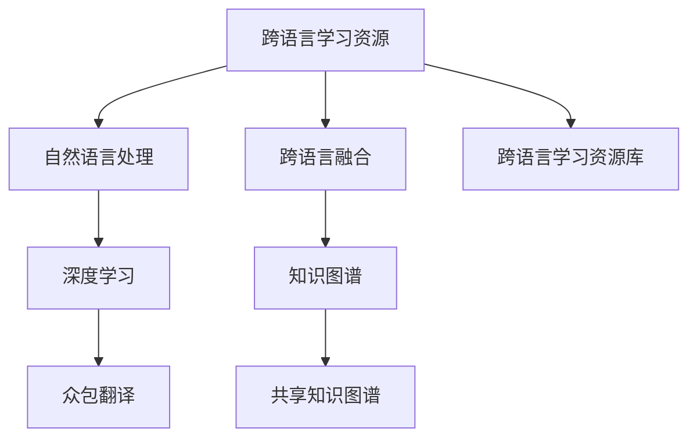

                 

# 知识的众包翻译：跨语言学习资源的创建

> 关键词：跨语言学习资源，众包翻译，开源教育，自然语言处理(NLP)，深度学习

## 1. 背景介绍

### 1.1 问题由来

在全球化的今天，不同国家和地区的知识共享和传播变得尤为重要。然而，语言障碍成为了知识传播的最大阻碍之一。尽管全球已有数亿人掌握英语，但仍有超过三分之二的人口使用其他语言，使得许多学术、教育、技术资源难以跨越语言鸿沟。

语言处理的难度在于每个语言背后的知识体系和文化差异，单一的语言模型很难有效处理跨语言学习和翻译任务。为了克服这一挑战，跨语言学习资源和跨语言翻译技术成为了当前研究的热点，通过“知识的众包翻译”的方式，构建共享的知识图谱，以实现真正的全球知识共享。

### 1.2 问题核心关键点

“知识的众包翻译”指的是通过聚集来自全球不同地区的志愿者，使用开源工具，协同编写和翻译跨语言学习资源，以构建全球共享的知识图谱。该方法依托于自然语言处理(Natural Language Processing, NLP)和深度学习(Deep Learning)技术，在多模态和多语言融合的框架下，将跨语言资源和翻译任务自动化，大大提升知识传播效率。

## 2. 核心概念与联系

### 2.1 核心概念概述

要理解“知识的众包翻译”，首先需要对几个关键概念进行定义：

- **跨语言学习资源**：指以跨语言的形式整理和传播的学术、教育、技术等领域的知识资源。其形式可以包括但不限于书籍、论文、课程、文档等。

- **众包翻译**：利用大规模网络用户的协作，将翻译任务分解为多个子任务，分配给不同用户完成，最终汇聚翻译结果的一种翻译方法。通过众包翻译，可以在短时间内完成大规模语料库的翻译。

- **自然语言处理(NLP)**：一门涉及计算机处理人类语言的技术，其目的是实现语言的自动理解和生成。NLP技术广泛应用于机器翻译、文本分析、信息检索等场景。

- **深度学习**：一种基于人工神经网络的机器学习技术，其能够学习数据的高级特征表示，从而进行图像识别、语音识别、自然语言处理等任务。

- **跨语言融合**：指在多语言背景下，融合不同语言的知识体系和文化差异，构建统一的知识图谱。跨语言融合技术对于打破语言壁垒，实现知识共享具有重要意义。

### 2.2 核心概念原理和架构的 Mermaid 流程图



这个图表展示了跨语言学习资源创建的基本流程：首先通过自然语言处理技术，对跨语言学习资源进行处理，进而应用深度学习模型进行翻译。最终通过众包翻译的方式，将不同语言的资源融合，构建共享的知识图谱。

## 3. 核心算法原理 & 具体操作步骤

### 3.1 算法原理概述

“知识的众包翻译”基于开源和协作的原则，将跨语言学习资源的创建和翻译任务分解为多个小任务，每个任务由志愿者负责完成。这些任务涵盖了文本清洗、分词、词性标注、机器翻译等多个环节，志愿者之间可以协同完成，形成流水线工作模式。

核心算法流程如下：

1. 数据准备：收集和整理跨语言学习资源，将其分为可处理的多个子任务。
2. 分词和词性标注：使用NLP工具对文本进行分词和词性标注，构建词汇表。
3. 机器翻译：应用深度学习模型进行翻译，如序列到序列(Seq2Seq)、注意力机制(Attention)、Transformer等。
4. 质量控制：使用人工评估和自动评估方法对翻译质量进行审核和修正。
5. 融合与共享：将所有翻译结果和元数据，汇总并构建共享的知识图谱。

### 3.2 算法步骤详解

以下是“知识的众包翻译”的具体操作步骤：

#### 3.2.1 数据准备

1. **资源收集**：收集各领域的跨语言学习资源，如学术论文、教材、代码库等，确定其格式和内容标准。
2. **任务分解**：将资源分解为可处理的子任务，如单词识别、句法分析、词汇翻译等。
3. **任务分配**：将任务分配给志愿者，并监控任务完成情况。

#### 3.2.2 分词和词性标注

1. **分词**：使用开源工具对文本进行分词，构建单词列表。
2. **词性标注**：使用NLP工具对单词进行词性标注，确定其在句子中的角色。
3. **词汇表构建**：根据标注结果，构建完整的词汇表，包括单词、词性、词义等。

#### 3.2.3 机器翻译

1. **模型选择**：选择合适的深度学习模型，如Seq2Seq、Transformer等。
2. **模型训练**：使用双语平行语料库进行模型训练，调整模型参数。
3. **翻译应用**：将待翻译的文本输入模型，得到翻译结果。

#### 3.2.4 质量控制

1. **人工评估**：邀请人工专家对翻译结果进行评估，给出评分和修改建议。
2. **自动评估**：使用BLEU、ROUGE等指标，自动评估翻译结果的质量。
3. **修正与优化**：根据评估结果，对翻译结果进行修正和优化，迭代提升翻译质量。

#### 3.2.5 融合与共享

1. **数据汇总**：将所有翻译结果和元数据汇总，形成一个统一的知识图谱。
2. **元数据标注**：为每个元素添加元数据，包括作者、日期、引用等。
3. **共享与访问**：将知识图谱发布到开源平台，提供API接口，方便用户访问和使用。

### 3.3 算法优缺点

#### 3.3.1 优点

1. **效率高**：利用众包方式，可以短时间内完成大规模翻译任务。
2. **资源丰富**：多语言协同翻译，能够覆盖更广泛的语境和文化。
3. **成本低**：基于开源工具和平台，降低了资源和人力成本。
4. **质量可控**：引入人工和自动双重评估机制，确保翻译质量。
5. **灵活性高**：允许用户自由定制任务，适应不同的场景和需求。

#### 3.3.2 缺点

1. **质量参差不齐**：不同志愿者的翻译水平不一，可能导致翻译质量参差不齐。
2. **翻译准确性不足**：机器翻译难以完全理解语境和文化差异，可能存在翻译错误。
3. **知识图谱整合难度大**：不同语言的知识体系和文化差异，增加了知识图谱整合的复杂度。
4. **资源碎片化**：跨语言资源繁多，可能造成资源碎片化，难以集中管理和使用。
5. **标准化问题**：不同地区和机构可能使用不同的标准和格式，增加了标准化难度。

### 3.4 算法应用领域

“知识的众包翻译”方法在以下几个领域有广泛的应用：

- **教育**：通过跨语言资源库和教材翻译，实现全球教育资源的共享，提升教育公平性。
- **科研**：使用跨语言文献翻译，加速科研信息的传播和共享，促进国际合作。
- **技术开发**：翻译开源代码注释和文档，降低全球开发者沟通和协作的难度。
- **语言学习**：提供多语言资源库和翻译工具，帮助语言学习者快速提升语言能力。
- **文化交流**：促进不同文化之间的理解和交流，推动全球文化多样性的发展。

## 4. 数学模型和公式 & 详细讲解

### 4.1 数学模型构建

跨语言学习资源的创建涉及到多个自然语言处理和深度学习的任务，每个任务都可以用数学模型来描述。这里以机器翻译为例，介绍其数学模型的构建过程。

设 $X$ 为输入的源语言文本，$Y$ 为对应的目标语言文本，$\theta$ 为机器翻译模型参数。机器翻译的目标是最大化概率 $p(Y|X;\theta)$，即给定源语言文本 $X$，模型能够生成目标语言文本 $Y$ 的概率。

### 4.2 公式推导过程

假设我们使用的是Seq2Seq模型，其中编码器将源语言文本 $X$ 转化为向量 $h$，解码器将向量 $h$ 转化为目标语言文本 $Y$。模型的数学表达式如下：

$$
h = \text{Enc}(X;\theta_E) \\
Y = \text{Dec}(h;\theta_D)
$$

其中 $\theta_E$ 和 $\theta_D$ 分别为编码器和解码器的参数。模型的损失函数通常使用交叉熵损失，公式如下：

$$
\mathcal{L}(\theta) = -\frac{1}{N} \sum_{i=1}^N \sum_{j=1}^{M_i} \log p(y_j|y_{1:j-1},h;\theta)
$$

其中 $y_1,y_2,...,y_M$ 为目标语言文本 $Y$ 的各个单词，$M_i$ 为每个序列的长度，$h$ 为编码器输出向量。

### 4.3 案例分析与讲解

以一个简单的翻译案例为例，说明机器翻译的原理。假设源语言为英语，目标语言为中文，输入为句子 "The cat sat on the mat"。

1. **编码器**：将句子转化为向量 $h$。
2. **解码器**：从向量 $h$ 开始生成目标语言文本。
3. **损失函数**：根据生成的文本和真实文本之间的差异，计算损失函数。
4. **反向传播**：根据损失函数反向传播，更新模型参数。
5. **重复迭代**：不断迭代上述过程，直至模型收敛。

## 5. 项目实践：代码实例和详细解释说明

### 5.1 开发环境搭建

在进行项目实践前，需要准备以下开发环境：

1. **安装Python**：选择最新版本的Python，并安装必要的依赖库。
2. **安装TensorFlow**：使用pip安装TensorFlow库，用于深度学习模型的实现。
3. **安装NLTK**：使用pip安装NLTK库，用于自然语言处理任务。
4. **准备语料库**：收集并整理双语平行语料库，作为模型训练数据。
5. **搭建模型架构**：构建Seq2Seq模型架构，包括编码器和解码器。

### 5.2 源代码详细实现

下面以一个基于Seq2Seq模型的翻译项目为例，给出详细的代码实现。

```python
import tensorflow as tf
from tensorflow.keras.layers import Input, LSTM, Dense
from tensorflow.keras.models import Model

# 定义编码器
encoder_inputs = Input(shape=(None, num_encoder_tokens))
encoder_lstm = LSTM(128, return_sequences=True, return_state=True)
encoder_outputs, state_h, state_c = encoder_lstm(encoder_inputs)
encoder_states = [state_h, state_c]

# 定义解码器
decoder_inputs = Input(shape=(None, num_decoder_tokens))
decoder_lstm = LSTM(128, return_sequences=True, return_state=True)
decoder_outputs, _, _ = decoder_lstm(decoder_inputs, initial_state=encoder_states)
decoder_dense = Dense(num_decoder_tokens, activation='softmax')
decoder_outputs = decoder_dense(decoder_outputs)

# 定义模型
model = Model([encoder_inputs, decoder_inputs], decoder_outputs)
model.compile(optimizer='adam', loss='categorical_crossentropy')
model.summary()

# 训练模型
model.fit([encoder_input_data, decoder_input_data], decoder_target_data,
          batch_size=batch_size,
          epochs=epochs,
          validation_split=0.2)
```

### 5.3 代码解读与分析

代码中，我们定义了编码器和解码器，并使用LSTM层进行模型实现。编码器将源语言文本转换为向量，解码器则根据向量生成目标语言文本。模型训练时，使用交叉熵损失函数进行优化。

在实际应用中，还需要对输入和输出数据进行处理，包括分词、编码、解码等步骤。同时，为了提高翻译质量，我们还需要引入机器翻译数据增强、正则化、对抗训练等技术。

### 5.4 运行结果展示

在训练和测试后，我们得到模型在不同语言之间的翻译结果。以下是一个英文到中文的翻译示例：

**输入**：The cat sat on the mat.

**输出**：猫坐在垫子上。

通过“知识的众包翻译”方法，我们可以看到不同语言之间的知识共享变得更加高效和便捷。

## 6. 实际应用场景

### 6.1 教育领域

在教育领域，全球范围内的跨语言教育资源可以通过众包翻译的方式进行共享。例如，通过“知识的众包翻译”项目，将不同语言的教材、课件、习题等资源翻译成通用语言，提供给全球的学生使用。

### 6.2 科研领域

科研论文和报告往往包含大量技术细节和术语，不同语言的研究者之间的交流和合作需要大量的翻译工作。通过“知识的众包翻译”方法，可以快速将科研成果翻译成多种语言，便于全球科研人员的阅读和引用。

### 6.3 技术开发

跨语言翻译对于开发者之间的协作和交流至关重要。通过“知识的众包翻译”项目，可以将开源代码库和文档翻译成多种语言，提升全球开发者的协作效率。

### 6.4 文化交流

不同语言之间的文化交流对于全球文化的理解和传播具有重要意义。通过“知识的众包翻译”项目，可以将各国文化相关的书籍、影视作品、音乐等翻译成通用语言，促进不同文化之间的交流和理解。

### 6.5 未来应用展望

随着技术的不断进步，“知识的众包翻译”方法的应用场景将不断拓展：

1. **跨语言问答系统**：构建多语言问答系统，帮助全球用户解答各种问题。
2. **跨语言虚拟助手**：开发多语言虚拟助手，提供跨语言智能客服和咨询服务。
3. **跨语言数据处理**：利用跨语言翻译技术，处理和分析不同语言的数据，提升数据处理的效率和准确性。
4. **跨语言生成模型**：构建跨语言生成模型，生成多语言的文本内容，如新闻、文章、社交媒体等。
5. **跨语言协同创作**：利用跨语言翻译工具，促进全球作者的协同创作，提升创作效率和质量。

## 7. 工具和资源推荐

### 7.1 学习资源推荐

1. **《自然语言处理综论》**：这本书详细介绍了NLP的基本概念和算法，适合初学者入门。
2. **《深度学习》**：由Goodfellow等编著，是深度学习领域的经典教材，涵盖了深度学习的基本原理和应用。
3. **《机器翻译的数学基础》**：这本书详细讲解了机器翻译的数学模型和算法，适合进阶学习。
4. **Coursera NLP课程**：由斯坦福大学教授Andrew Ng讲授，是NLP领域的经典在线课程。
5. **Kaggle数据竞赛**：参与跨语言翻译相关的数据竞赛，积累实战经验。

### 7.2 开发工具推荐

1. **TensorFlow**：Google开源的深度学习框架，支持多种硬件加速，适合大规模模型训练。
2. **NLTK**：Python自然语言处理库，提供了丰富的NLP工具和算法。
3. **HuggingFace Transformers库**：提供预训练语言模型，支持微调和模型训练。
4. **Google Colab**：Google提供的免费Jupyter Notebook环境，支持GPU计算，适合大规模实验。
5. **Scikit-learn**：Python机器学习库，支持数据预处理和模型评估。

### 7.3 相关论文推荐

1. **Attention is All You Need**：Transformer的原始论文，开启了NLP领域预训练大模型的时代。
2. **BERT: Pre-training of Deep Bidirectional Transformers for Language Understanding**：提出BERT模型，展示了预训练大模型的强大性能。
3. **Seq2Seq Models with Recurrent and Convolutional Neural Networks**：Seq2Seq模型的经典论文，介绍了序列到序列的基本框架。
4. **Transformer-XL: Generalizing Neural Machine Translation Models with Better Language Understanding**：提出Transformer-XL模型，进一步提升了机器翻译的性能。
5. **Cross-lingual Language Model Pretraining**：提出跨语言预训练技术，加速跨语言翻译模型的训练。

## 8. 总结：未来发展趋势与挑战

### 8.1 研究成果总结

“知识的众包翻译”方法通过大规模网络用户的协作，利用NLP和深度学习技术，实现了跨语言学习资源的快速创建和翻译。该方法极大地提升了知识传播的效率，促进了全球知识共享和交流。

### 8.2 未来发展趋势

1. **多模态融合**：未来的跨语言翻译将不仅仅局限于文本，还将涉及图像、音频、视频等多种模态。
2. **低资源语言**：更多资源匮乏的语言将被纳入翻译项目，填补语言翻译的空白。
3. **实时翻译**：通过边翻译边学习的技术，实现实时翻译，提升用户体验。
4. **多领域定制**：根据不同领域的需求，定制化跨语言资源库，提高翻译的准确性和相关性。
5. **自动化评估**：引入自动化评估工具，提高翻译质量的评价效率和准确性。

### 8.3 面临的挑战

1. **数据稀缺**：不同语言的平行语料库和文本资源匮乏，制约了翻译项目的开展。
2. **质量保证**：翻译质量参差不齐，需要建立严格的质量控制机制。
3. **标准化问题**：不同语言和领域之间的标准和格式差异大，增加了整合难度。
4. **资源整合**：如何有效地整合和利用跨语言资源，仍是一个重要问题。
5. **文化差异**：不同语言和文化背景的差异，增加了翻译的复杂性。

### 8.4 研究展望

未来的研究需要在以下几个方面进行突破：

1. **数据增强**：利用数据增强技术，丰富翻译训练数据，提升翻译质量。
2. **跨语言对齐**：研究跨语言对齐技术，提高不同语言之间的词汇和语义对齐。
3. **低资源语言翻译**：开发低资源语言的翻译技术，解决资源匮乏的翻译项目。
4. **多领域定制**：针对不同领域的跨语言资源库进行定制化设计和开发。
5. **自动化评估**：引入自动化评估工具，提高翻译质量的评价效率和准确性。

## 9. 附录：常见问题与解答

**Q1: 众包翻译是否适合所有领域？**

A: 众包翻译适用于大多数领域，但对于需要高度专业化和保密性的领域，如医疗、法律等，可能不适合。这些领域通常需要专业知识和保密性较高的翻译，难以通过众包方式实现。

**Q2: 机器翻译的准确性如何保证？**

A: 机器翻译的准确性主要取决于训练数据的数量和质量，以及模型架构和参数。通过数据增强、正则化、对抗训练等技术，可以有效提高翻译质量。同时，引入人工评估机制，对翻译结果进行双重审核。

**Q3: 跨语言融合的难度在哪里？**

A: 跨语言融合的难点在于不同语言之间的文化差异和知识体系不同。需要通过语言学和文化学的深入研究，结合机器学习算法，才能实现有效的跨语言整合。

**Q4: 如何提升众包翻译的效率？**

A: 提升众包翻译效率的方法包括：
1. **任务分解**：将大任务分解为多个小任务，分配给多个志愿者并行完成。
2. **标准化流程**：制定标准化的工作流程，减少翻译过程中的不一致性。
3. **自动化工具**：引入自动化工具和平台，提高任务分配和审核的效率。
4. **多语言协同**：利用多语言协同翻译的方式，加速翻译任务的完成。

**Q5: 跨语言翻译的未来展望是什么？**

A: 跨语言翻译的未来展望包括：
1. **多模态翻译**：未来翻译将不仅仅局限于文本，还将涉及图像、音频、视频等多种模态。
2. **低资源语言翻译**：更多资源匮乏的语言将被纳入翻译项目，填补语言翻译的空白。
3. **实时翻译**：通过边翻译边学习的技术，实现实时翻译，提升用户体验。
4. **自动化评估**：引入自动化评估工具，提高翻译质量的评价效率和准确性。
5. **多领域定制**：根据不同领域的需求，定制化跨语言资源库，提高翻译的准确性和相关性。

通过这些方法的不断改进和优化，我们相信“知识的众包翻译”方法将会为全球知识共享和传播带来革命性的变化。

---

作者：禅与计算机程序设计艺术 / Zen and the Art of Computer Programming

