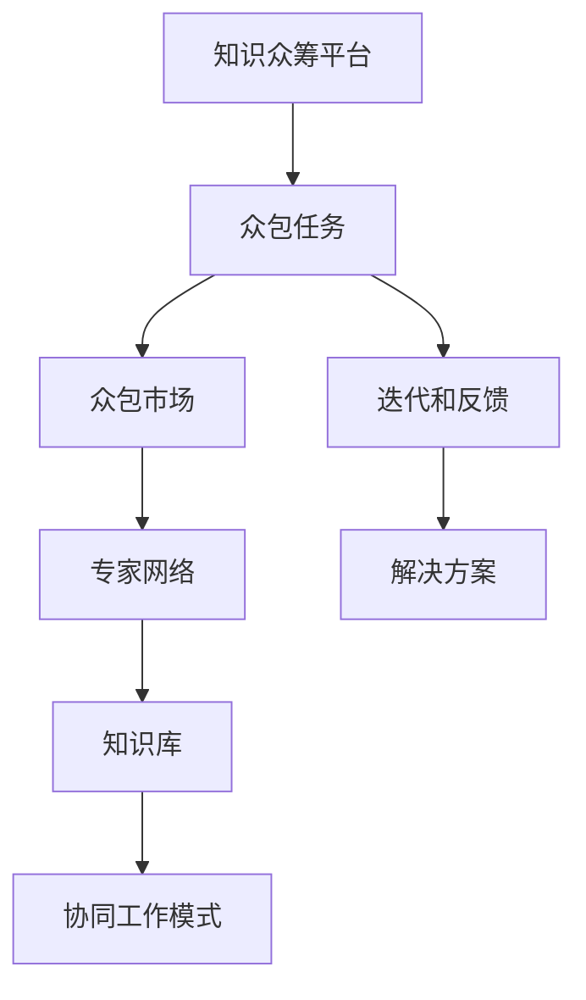

                 

## 1. 背景介绍

在当今数字化和信息爆炸的时代，我们面临着前所未有的复杂问题和挑战。这些问题的解决不再仅仅是个人能力的体现，而是一个群体智慧、协作和众筹的结果。大数据、云计算、人工智能等技术的迅速发展，使得我们能够借助集体的力量，更好地应对各种复杂问题。在复杂的全球挑战和行业难题面前，众筹知识、集合智慧成为了一个必要且高效的方法。本文将详细探讨“知识众筹”的概念及其在解决复杂问题中的应用。

## 2. 核心概念与联系

### 2.1 核心概念概述

知识众筹（Crowdsourced Knowledge）是一种集体智慧的协同过程，指的是通过互联网平台，利用集体的智慧和资源来解决复杂问题。这种众筹知识的方法主要通过以下几个关键概念实现：

1. **知识众筹平台**：一个基于互联网的协作平台，旨在聚集具有不同背景、专业知识和经验的个体，共同解决复杂问题。

2. **众包任务**：由平台发布的具体问题或任务，需要集体智慧解决。

3. **专家网络**：平台中汇聚的各类专家，提供跨领域的知识和专业见解。

4. **众包市场**：通过竞价或积分奖励，激励参与者贡献智慧和解决方案。

5. **知识库**：平台内集中管理的知识集合，供参与者查询和参考。

6. **协同工作模式**：通过协作工具和流程，鼓励参与者之间的沟通和知识分享。

7. **迭代和反馈**：利用快速迭代和即时反馈机制，不断优化解决方案。

### 2.2 核心概念原理和架构的 Mermaid 流程图



在这个流程图中，我们从问题发布（A）开始，到解决方案生成（H）结束。通过众包市场（C）聚集专家网络（D）和知识库（E），在协同工作模式（F）中通过迭代和反馈（G）不断优化最终解决方案。

## 3. 核心算法原理 & 具体操作步骤

### 3.1 算法原理概述

知识众筹的算法原理主要围绕以下几个步骤：

1. **问题建模**：将复杂问题转化为可操作的众包任务。
2. **任务发布**：将任务发布到知识众筹平台，并设定奖励机制。
3. **专家竞标**：专家通过竞标参与任务，平台根据竞价高低或积分排名选择最佳参与者。
4. **集体贡献**：参与者利用各自的专业知识，进行协作解决问题，并将成果提交到平台。
5. **结果评估**：平台对提交的解决方案进行评估，选择最佳方案并给予奖励。
6. **知识库构建**：优秀解决方案被记录进知识库，供未来参考。

### 3.2 算法步骤详解

#### 3.2.1 问题建模

将复杂问题拆分为多个子问题，并转化为可操作的众包任务。每个任务需明确界定输入和输出，并设定具体的评估标准。

#### 3.2.2 任务发布

将任务描述、评估标准和奖励机制发布到知识众筹平台，并通过多种方式宣传，吸引专家参与。

#### 3.2.3 专家竞标

专家根据自身专业知识和经验，提出解决方案的竞标方案，包括所需时间、成本及预期成果等。平台根据竞标方案的合理性、可行性和创新性进行初步筛选。

#### 3.2.4 集体贡献

参与者通过协作工具（如在线文档、视频会议等）进行沟通和知识共享。每个参与者根据自身优势贡献解决方案的某个部分，并在平台上更新进度。

#### 3.2.5 结果评估

平台邀请独立专家对提交的解决方案进行评估，考虑其创新性、可行性和实用性。最终选出最佳方案，并给予奖励。

#### 3.2.6 知识库构建

优秀解决方案被记录进知识库，并为未来类似任务提供参考。同时，平台可以定期对知识库进行更新和维护。

### 3.3 算法优缺点

**优点**：
1. **多样性和广泛性**：众包平台聚集了来自不同背景的专家，能提供多角度的见解和解决方案。
2. **快速响应和迭代**：由于任务拆分，可快速响应问题，并通过迭代不断优化解决方案。
3. **低成本**：利用互联网平台，降低了传统的研发和试验成本。
4. **创新性强**：在开放和竞价机制下，鼓励参与者提出创新的解决方案。

**缺点**：
1. **质量控制**：如何确保提交解决方案的质量和可信度是一大挑战。
2. **协调成本**：协作过程中，可能需要投入大量时间和资源进行协调和沟通。
3. **信息泄露**：平台上的敏感信息可能被泄露，需加强安全防护。
4. **过度依赖专家**：专家数量的多少和质量直接影响了众筹效果。

### 3.4 算法应用领域

知识众筹方法已经广泛应用于以下领域：

1. **科学研究**：如生物学研究、天文学观测等，利用众包平台收集数据、验证假设和优化实验方案。
2. **工程设计**：如产品原型设计、建筑方案优化等，通过众包平台获取创新设计方案。
3. **医疗诊断**：如医学影像分析、诊断方案制定等，利用专家智慧提供专业意见。
4. **社会问题**：如环境保护、灾害预警等，集思广益找到最佳解决方案。
5. **商业决策**：如市场分析、产品推广等，通过集体的市场洞察力优化决策。

## 4. 数学模型和公式 & 详细讲解 & 举例说明

### 4.1 数学模型构建

在知识众筹中，我们通常使用多目标优化模型来衡量解决方案的质量。假设有$n$个参与者，每个参与者贡献的解决方案为$x_i$，目标函数可以表示为：

$$
\min_{x_1, x_2, ..., x_n} f(x_1, x_2, ..., x_n)
$$

其中$f$为综合评估函数，可能包括创新性、可行性、成本等多个因素。

### 4.2 公式推导过程

在众包任务中，假设每个参与者的解决方案为$x_i$，综合评估函数$f$可以表示为：

$$
f(x_1, x_2, ..., x_n) = \sum_{i=1}^n w_i \cdot g_i(x_i)
$$

其中$w_i$为权重，表示不同因素对整体贡献的重要性；$g_i$为单因素评估函数。

对于众包市场，参与者的选择可以通过竞价或积分排名，假设$P$为每个参与者的竞价或积分，则选择最佳参与者的公式为：

$$
k = \arg\max_{k \in \{1, 2, ..., n\}} P_k
$$

### 4.3 案例分析与讲解

以医学影像分析为例，平台发布任务：“寻找某种癌症的影像特征”。专家们竞标参与，并提交各自的解决方案。通过众包平台的数据分析工具，每个参与者的解决方案被综合评估，最终选出最佳方案，并给予奖励。

## 5. 项目实践：代码实例和详细解释说明

### 5.1 开发环境搭建

知识众筹平台的搭建需要以下工具和环境：

1. **服务器**：搭建一个服务器，用于托管众包平台。
2. **数据库**：选择关系型数据库（如MySQL）或非关系型数据库（如MongoDB），存储任务、参与者信息和解决方案等数据。
3. **开发框架**：使用Web框架（如Django、Flask）构建平台的前端和后端。
4. **协作工具**：集成在线文档、视频会议等协作工具，便于专家之间的沟通和知识共享。

### 5.2 源代码详细实现

下面是一个简化的代码框架，展示如何通过Python和Flask搭建知识众筹平台：

```python
from flask import Flask, request, jsonify
from flask_sqlalchemy import SQLAlchemy
from flask_login import LoginManager, UserMixin, login_user

app = Flask(__name__)
app.config['SQLALCHEMY_DATABASE_URI'] = 'sqlite:///platform.db'
db = SQLAlchemy(app)
login_manager = LoginManager()
login_manager.init_app(app)

# 用户模型
class User(db.Model, UserMixin):
    id = db.Column(db.Integer, primary_key=True)
    name = db.Column(db.String(100), nullable=False)
    email = db.Column(db.String(120), unique=True, nullable=False)
    password = db.Column(db.String(60), nullable=False)

# 任务模型
class Task(db.Model):
    id = db.Column(db.Integer, primary_key=True)
    title = db.Column(db.String(200), nullable=False)
    description = db.Column(db.Text, nullable=False)
    reward = db.Column(db.Float, nullable=False)

# 解决方案模型
class Solution(db.Model):
    id = db.Column(db.Integer, primary_key=True)
    task_id = db.Column(db.Integer, db.ForeignKey('task.id'))
    user_id = db.Column(db.Integer, db.ForeignKey('user.id'))
    solution = db.Column(db.Text, nullable=False)

# 用户认证
@login_manager.user_loader
def load_user(user_id):
    return User.query.get(int(user_id))

@app.route('/tasks', methods=['POST'])
def create_task():
    title = request.json.get('title')
    description = request.json.get('description')
    reward = request.json.get('reward')
    task = Task(title=title, description=description, reward=reward)
    db.session.add(task)
    db.session.commit()
    return jsonify({'success': True})

@app.route('/solutions', methods=['POST'])
def create_solution():
    task_id = request.json.get('task_id')
    user_id = request.json.get('user_id')
    solution = request.json.get('solution')
    solution = Solution(task_id=task_id, user_id=user_id, solution=solution)
    db.session.add(solution)
    db.session.commit()
    return jsonify({'success': True})

# 其他路由和API...

if __name__ == '__main__':
    app.run(debug=True)
```

### 5.3 代码解读与分析

在上述代码中，我们主要使用了Flask框架和SQLAlchemy库来搭建一个基本的知识众筹平台。

1. **用户模型**：包含用户的基本信息，如姓名、邮箱和密码。
2. **任务模型**：包含任务标题、描述和奖励信息。
3. **解决方案模型**：记录每个参与者的解决方案和任务ID、用户ID。

平台提供了两个API：

1. `/create_task`：用于创建新任务，并返回任务ID。
2. `/create_solution`：用于提交解决方案，并返回解决方案ID。

### 5.4 运行结果展示

平台上线后，用户可以通过Web界面进行任务发布、竞标、提交解决方案等操作。参与者可以实时查看任务状态，并与其他参与者交流协作。

## 6. 实际应用场景

### 6.1 科学研究

在生物学研究中，科学家可以利用众包平台收集和验证基因数据，优化实验方案。例如，某研究团队需要确定某种基因的表达模式，平台发布任务，邀请遗传学专家参与，并给出科学分析报告。

### 6.2 工程设计

在建筑工程设计中，设计师可以通过众包平台获取创新设计方案，并邀请建筑专家进行评审。例如，某公司需要设计一座高层建筑，平台发布任务，收集不同设计方案，并通过专家评审选出最佳设计方案。

### 6.3 医疗诊断

在医学影像分析中，医生可以利用众包平台验证诊断结果，提供专业意见。例如，某医院需要分析大量医学影像，平台发布任务，邀请放射科医生参与，并通过专家评审选出最佳诊断结果。

### 6.4 社会问题

在环境保护中，专家可以利用众包平台集思广益，提出最佳解决方案。例如，某环保组织需要解决空气污染问题，平台发布任务，邀请环保专家参与，并通过专家评审选出最佳治理方案。

### 6.5 商业决策

在市场分析中，公司可以利用众包平台获取市场洞察，优化决策。例如，某公司需要分析新产品的市场潜力，平台发布任务，邀请市场分析师参与，并通过专家评审选出最佳市场分析报告。

## 7. 工具和资源推荐

### 7.1 学习资源推荐

1. **Coursera《Crowdsourcing and Data Science》课程**：系统讲解了知识众筹的基本概念和应用案例。
2. **Khan Academy《Data Analysis and Interpretation》课程**：介绍了数据收集和分析的基本方法，适用于初学者。
3. **Wikipedia《Crowdsourcing》页面**：详细介绍了知识众筹的定义、流程和实际案例。

### 7.2 开发工具推荐

1. **Django**：一个流行的Python Web框架，支持高效的数据库访问和API开发。
2. **Flask**：一个轻量级的Python Web框架，适合快速搭建小型应用。
3. **Jupyter Notebook**：一个交互式笔记本工具，适合数据处理和分析。
4. **Google Colab**：一个基于Jupyter Notebook的云服务，方便进行在线编程和实验。

### 7.3 相关论文推荐

1. **“Crowdsourcing for Science” by Christopher R. Smith**：介绍了知识众筹在科学研究中的应用。
2. **“Crowdsourced Design: Designing Collaborative Product Development Platforms” by Alec Loftus**：介绍了众包平台在工程设计中的应用。
3. **“Crowdsourcing Data for Clinical Research: Challenges and Solutions” by Mary Jo Thompson**：介绍了知识众筹在医疗诊断中的应用。

## 8. 总结：未来发展趋势与挑战

### 8.1 总结

知识众筹作为一种集体智慧的协同方法，已经在科学研究、工程设计、医疗诊断等多个领域得到应用，并取得了显著的效果。通过互联网平台，将来自不同背景和专业领域的专家聚集起来，共同解决复杂问题，极大地提高了问题解决的效率和质量。

### 8.2 未来发展趋势

未来，知识众筹将继续发展，呈现以下几个趋势：

1. **跨领域融合**：知识众筹将跨学科融合，形成更加复杂、多变的问题解决体系。
2. **智能决策支持**：利用人工智能技术，提高众包平台的数据分析能力和决策效率。
3. **实时反馈和迭代**：通过实时反馈和迭代机制，不断优化解决方案，提高问题解决的实时性。
4. **多模态数据融合**：将文本、图像、视频等多模态数据融合，形成更加全面的问题解决能力。
5. **伦理和社会责任**：平台将更加注重数据隐私保护和社会责任，确保问题解决过程的公正性和透明度。

### 8.3 面临的挑战

尽管知识众筹取得了一定成果，但未来仍然面临诸多挑战：

1. **数据质量控制**：如何确保提交数据的准确性和可信度是一大挑战。
2. **协调和管理成本**：平台需投入大量资源进行协调和管理，以确保高效运行。
3. **技术难题**：利用人工智能和数据挖掘技术优化问题解决过程，需要解决诸多技术难题。
4. **伦理和法律问题**：平台需解决数据隐私保护、知识产权等伦理和法律问题。

### 8.4 研究展望

未来的研究应重点解决上述挑战，推动知识众筹技术的进一步发展。具体方向包括：

1. **数据质量控制**：通过机器学习技术，自动筛选和验证提交数据的质量。
2. **高效协调和管理**：利用智能决策支持系统，优化协调和管理流程。
3. **人工智能融合**：将人工智能技术应用于数据处理和问题解决，提高平台自动化程度。
4. **伦理和法律保护**：制定平台伦理和法律标准，保护参与者的合法权益。

## 9. 附录：常见问题与解答

### 常见问题

**Q1：知识众筹平台如何确保数据的质量和可信度？**

A: 平台可以通过以下方式确保数据的质量和可信度：
1. 设定严格的数据提交标准和审核流程。
2. 利用人工智能技术，自动筛选和验证提交数据。
3. 邀请独立专家进行评审，确保数据的真实性和可靠性。

**Q2：知识众筹平台如何处理数据隐私和安全问题？**

A: 平台可以通过以下方式处理数据隐私和安全问题：
1. 加密存储和传输数据，防止数据泄露。
2. 设定严格的数据访问权限，确保数据安全。
3. 定期进行数据审计和安全评估，及时发现和修复漏洞。

**Q3：知识众筹平台如何提高问题的解决效率？**

A: 平台可以通过以下方式提高问题的解决效率：
1. 利用人工智能技术，自动分析和处理数据。
2. 采用快速迭代和反馈机制，不断优化解决方案。
3. 引入专家网络，提供跨领域的智慧和资源。

**Q4：知识众筹平台如何保证决策的公正性和透明度？**

A: 平台可以通过以下方式保证决策的公正性和透明度：
1. 设定明确的决策标准和流程。
2. 利用智能决策支持系统，提高决策的公正性和透明度。
3. 公开决策过程和结果，接受公众监督。

**Q5：知识众筹平台如何应对参与者的过度竞标行为？**

A: 平台可以通过以下方式应对参与者的过度竞标行为：
1. 设定合理的竞标机制，防止竞标过度竞争。
2. 引入随机化机制，确保竞标公平性。
3. 设定竞标上限，限制竞标价格。

---

作者：禅与计算机程序设计艺术 / Zen and the Art of Computer Programming

