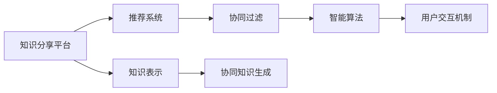

                 

# 知识的分享经济：协作学习的新模式

> 关键词：知识分享、协作学习、分布式系统、网络效应、协同过滤、机器学习、推荐系统、智能算法

## 1. 背景介绍

随着互联网的普及和社交网络的发展，知识的分享和获取方式正在发生革命性的变化。传统的教育体系逐渐向在线教育、远程协作学习等新模式转变。知识分享的成本不断降低，人们可以在网络上随时随地获取所需的知识和技能，极大地提升了学习的便利性和效率。然而，这种模式也带来了新的挑战：如何整合零散的、非结构化的信息，实现高效的知识搜索和匹配？如何借助智能算法，提升学习的个性化和趣味性？这些问题催生了协作学习的兴起，将分布式知识和智能算法相结合，探索知识分享经济的新范式。

### 1.1 问题由来

在现代社会，知识更新速度极快，个人获取和整合知识的能力越来越受限于时间和空间。特别是在远程工作和学习成为常态的今天，传统的一对一教学、现场交流等方式已经难以满足个体和团队的需求。分布式网络协同化成为必然趋势。

在协作学习的实践中，人们通过社交媒体、论坛、问答平台等渠道，分享自己的知识经验，同时也获取他人的知识。这种知识的流通和交互，形成了知识的分享经济。而智能算法在其中的应用，使得知识分享变得更为高效、精准，能够实现个性化推荐和智能导引，从而显著提升学习的质量和效果。

### 1.2 问题核心关键点

协作学习主要涉及以下关键点：

1. 知识分享平台：提供知识搜索、共享和互动的空间，是知识分享的基础设施。
2. 智能算法：包括推荐系统、协同过滤、自然语言处理等，用于高效匹配知识、用户和内容。
3. 用户交互机制：用户评价、点赞、评论等，用于优化知识匹配和推荐结果。
4. 知识表示和结构化：使用本体论、语义网等技术，实现知识的有序化和结构化，方便检索和理解。
5. 协同知识生成：利用众包、协作编辑等方式，生成新的高质量知识内容。

这些关键点共同构成了协作学习的核心框架，通过智能算法和用户交互机制的优化，逐步形成一个高效、有活力的知识生态系统。

## 2. 核心概念与联系

### 2.1 核心概念概述

协作学习是一个复杂的系统，涉及多个核心概念：

- **知识分享平台(Knowledge Sharing Platform)**：如Coursera、EdX、知乎等，提供了知识交流的虚拟空间，允许用户上传、分享和检索知识。
- **推荐系统(Recommendation System)**：基于用户行为和知识特征，智能推荐相关内容。
- **协同过滤(Collaborative Filtering)**：通过分析用户和知识的相似度，进行匹配和推荐。
- **智能算法(Intelligent Algorithms)**：包括自然语言处理、机器学习、深度学习等，用于知识表示、匹配和推荐。
- **用户交互机制(User Interaction Mechanism)**：如评论、点赞、评分等，用于优化推荐结果。
- **知识表示(Knowledge Representation)**：如本体论、语义网等技术，用于有序化和结构化知识。
- **协同知识生成(Collaborative Knowledge Generation)**：利用众包、协作编辑等方式，生成新的高质量知识内容。

这些概念之间的关系可以通过以下Mermaid流程图来展示：



这个流程图展示出了协作学习系统的主要组成和数据流向。

## 3. 核心算法原理 & 具体操作步骤
### 3.1 算法原理概述

协作学习的核心算法包括推荐系统、协同过滤和智能算法。这些算法共同构成了一个循环，通过用户行为、知识特征和智能算法的协同工作，实现知识的高效匹配和精准推荐。

推荐系统基于用户的行为特征（如浏览、点击、评分等）和知识内容特征（如主题、标签、作者等），生成推荐列表。协同过滤通过分析用户和知识之间的相似度，对未见过的知识进行推荐。智能算法则对推荐系统进行优化和升级，提升推荐的精度和速度。

### 3.2 算法步骤详解

协作学习主要包括以下几个关键步骤：

**Step 1: 用户建模**

首先，需要对用户进行建模。记录用户在平台上的行为特征，如浏览记录、点赞行为、评论内容等，并从中提取出用户的偏好和兴趣。常用的建模方法包括：

- **隐语义建模(Latent Semantic Modeling)**：通过奇异值分解(SVD)等方法，提取用户和知识的内在语义特征。
- **协同过滤(Collaborative Filtering)**：通过用户与知识的相似度矩阵，进行推荐。
- **基于图(Graph-Based)**：构建用户知识关系图，使用图神经网络等方法进行推荐。

**Step 2: 知识建模**

对知识进行建模是推荐系统的重要基础。需要将知识进行结构化处理，提取其关键特征。常用的知识建模方法包括：

- **主题建模(Latent Dirichlet Allocation, LDA)**：通过主题概率分布，捕捉知识的语义信息。
- **实体关系抽取(Entity Relationship Extraction)**：使用NLP技术，提取知识中的实体和关系。
- **知识图谱(Knowledge Graph)**：构建知识之间的关联网络，使用图算法进行推荐。

**Step 3: 推荐系统设计**

推荐系统是协作学习的核心部分。常用的推荐算法包括：

- **基于内容的推荐(Content-based Filtering)**：根据知识内容特征，进行推荐。
- **协同过滤推荐(Collaborative Filtering)**：根据用户和知识的相似度，进行推荐。
- **混合推荐(Mixed Filtering)**：将基于内容和协同过滤进行结合，提升推荐效果。

**Step 4: 用户交互优化**

用户交互是协作学习中重要的反馈机制。通过用户对推荐内容的评分、评论等反馈，不断优化推荐系统。常用的优化方法包括：

- **加权平均(Winning Average)**：对用户评分进行加权平均，提升推荐精度。
- **局部平滑(Local Smoothing)**：对用户评分进行平滑处理，避免极端评分对推荐结果的影响。
- **自适应调整(Adaptive Adjustment)**：根据用户行为和反馈，动态调整推荐算法和模型参数。

**Step 5: 智能算法优化**

智能算法是推荐系统的基础和保障。常用的智能算法包括：

- **深度学习(Deep Learning)**：使用神经网络进行知识表示和推荐。
- **强化学习(Reinforcement Learning)**：通过用户反馈，优化推荐策略。
- **集成学习(Ensemble Learning)**：将多种推荐算法进行集成，提升推荐效果。

**Step 6: 协同知识生成**

协同知识生成是协作学习的高级应用。通过众包、协作编辑等方式，生成新的高质量知识内容。常用的方法包括：

- **维基编辑(Wikipedia Editing)**：通过用户编辑和修订，生成高质量的百科全书内容。
- **众包知识生成(Crowdsourced Knowledge Generation)**：使用平台众包机制，收集和整合用户贡献的知识内容。
- **协作编辑(Collaborative Editing)**：利用编辑协同机制，生成新的高质量知识。

### 3.3 算法优缺点

协作学习的优点在于：

1. **多样性**：用户可以在平台上获得来自不同领域、不同背景的知识，丰富了知识库的深度和广度。
2. **个性化**：智能算法能够根据用户的行为和兴趣，生成个性化的推荐内容，提升学习的精准度。
3. **高效性**：通过分布式计算和智能算法，推荐系统可以快速响应用户请求，提升用户体验。
4. **互动性**：用户之间的互动和反馈，能够优化推荐系统，提升整体效果。

协作学习的缺点在于：

1. **数据质量**：平台上的数据可能存在噪声、偏差等问题，影响推荐结果的准确性。
2. **算法复杂度**：推荐系统涉及多种算法和数据结构，实现和维护复杂度较高。
3. **隐私保护**：平台需要处理大量用户数据，如何保障用户隐私，是重要问题。
4. **知识噪声**：用户和知识本身可能存在噪声和不准确性，影响知识匹配效果。

尽管存在这些局限性，但协作学习在知识分享和获取方面具有巨大的潜力，可以通过不断的算法优化和技术创新，逐步克服这些挑战。

### 3.4 算法应用领域

协作学习已经在多个领域得到了广泛应用：

- **教育领域**：通过在线学习平台和知识共享，学生可以随时随地获取高质量的学习资源。如Coursera、edX、Khan Academy等。
- **企业培训**：企业内部培训系统可以利用协作学习，提高员工的知识技能水平。如Udemy for Business、LinkedIn Learning等。
- **医疗健康**：通过知识共享和协同编辑，医疗专业人士可以积累和传播最新研究成果。如PubMed、ResearchGate等。
- **科研领域**：科研人员可以利用协作学习平台，共享和讨论最新的研究成果。如arXiv、ResearchGate等。
- **公共知识分享**：公共图书馆、博物馆等机构，可以利用协作学习平台，提供丰富的知识资源。如Google Scholar、Wikipedia等。

除了这些领域，协作学习还可以应用于政府决策、市场分析、社会服务等多个领域，其应用前景非常广阔。

## 4. 数学模型和公式 & 详细讲解  
### 4.1 数学模型构建

协作学习主要涉及以下数学模型：

- **用户行为建模(User Behavior Modeling)**：通过用户行为数据，建立用户兴趣模型。
- **知识表示(Knowledge Representation)**：将知识进行结构化表示，方便检索和匹配。
- **推荐系统(Recommendation System)**：通过用户行为和知识特征，生成推荐列表。

**用户行为建模**：

- **隐语义建模(Latent Semantic Modeling, LSM)**：用户行为矩阵 $U$，知识特征矩阵 $I$，计算用户与知识的相似度矩阵 $S$：

$$
S = U \times I^T
$$

- **协同过滤(Collaborative Filtering)**：用户行为矩阵 $U$，知识特征矩阵 $I$，计算用户与知识的相似度矩阵 $S$：

$$
S = \sigma(U \times W \times I^T + B)
$$

其中 $\sigma$ 为激活函数，$W$ 和 $B$ 为模型参数。

**知识表示**：

- **主题建模(Latent Dirichlet Allocation, LDA)**：知识特征矩阵 $I$，生成主题矩阵 $T$：

$$
T = \Phi(I)
$$

- **知识图谱(Knowledge Graph)**：知识特征矩阵 $I$，生成知识图谱 $G$：

$$
G = I \times R
$$

其中 $R$ 为知识关系矩阵。

**推荐系统设计**：

- **基于内容的推荐(Content-based Filtering)**：知识特征矩阵 $I$，生成推荐列表 $R$：

$$
R = \Phi(I)
$$

- **协同过滤推荐(Collaborative Filtering)**：用户行为矩阵 $U$，知识特征矩阵 $I$，生成推荐列表 $R$：

$$
R = \sigma(U \times W \times I^T + B)
$$

**用户交互优化**：

- **加权平均(Winning Average)**：用户行为矩阵 $U$，生成推荐列表 $R$：

$$
R = \lambda_1 \times S + \lambda_2 \times U
$$

其中 $\lambda_1$ 和 $\lambda_2$ 为权重系数。

**智能算法优化**：

- **深度学习(Deep Learning)**：知识特征矩阵 $I$，生成推荐列表 $R$：

$$
R = \Phi(I)
$$

- **强化学习(Reinforcement Learning)**：用户行为矩阵 $U$，知识特征矩阵 $I$，生成推荐列表 $R$：

$$
R = \max_a \{ Q(s,a) + \gamma \max_b Q(s',b) \}
$$

其中 $s$ 为状态，$a$ 为动作，$s'$ 为下一个状态，$Q$ 为Q值函数，$\gamma$ 为折扣因子。

**协同知识生成**：

- **维基编辑(Wikipedia Editing)**：用户行为矩阵 $U$，知识特征矩阵 $I$，生成知识内容 $K$：

$$
K = \Phi(U \times I)
$$

- **众包知识生成(Crowdsourced Knowledge Generation)**：用户行为矩阵 $U$，知识特征矩阵 $I$，生成知识内容 $K$：

$$
K = \Phi(U \times I)
$$

- **协作编辑(Collaborative Editing)**：用户行为矩阵 $U$，知识特征矩阵 $I$，生成知识内容 $K$：

$$
K = \Phi(U \times I)
$$

### 4.2 公式推导过程

以下是协作学习中常用的数学模型和公式的推导过程：

**用户行为建模**：

- **隐语义建模(Latent Semantic Modeling, LSM)**：用户行为矩阵 $U$，知识特征矩阵 $I$，计算用户与知识的相似度矩阵 $S$：

$$
S = U \times I^T
$$

- **协同过滤(Collaborative Filtering)**：用户行为矩阵 $U$，知识特征矩阵 $I$，计算用户与知识的相似度矩阵 $S$：

$$
S = \sigma(U \times W \times I^T + B)
$$

其中 $\sigma$ 为激活函数，$W$ 和 $B$ 为模型参数。

**知识表示**：

- **主题建模(Latent Dirichlet Allocation, LDA)**：知识特征矩阵 $I$，生成主题矩阵 $T$：

$$
T = \Phi(I)
$$

- **知识图谱(Knowledge Graph)**：知识特征矩阵 $I$，生成知识图谱 $G$：

$$
G = I \times R
$$

其中 $R$ 为知识关系矩阵。

**推荐系统设计**：

- **基于内容的推荐(Content-based Filtering)**：知识特征矩阵 $I$，生成推荐列表 $R$：

$$
R = \Phi(I)
$$

- **协同过滤推荐(Collaborative Filtering)**：用户行为矩阵 $U$，知识特征矩阵 $I$，生成推荐列表 $R$：

$$
R = \sigma(U \times W \times I^T + B)
$$

**用户交互优化**：

- **加权平均(Winning Average)**：用户行为矩阵 $U$，生成推荐列表 $R$：

$$
R = \lambda_1 \times S + \lambda_2 \times U
$$

其中 $\lambda_1$ 和 $\lambda_2$ 为权重系数。

**智能算法优化**：

- **深度学习(Deep Learning)**：知识特征矩阵 $I$，生成推荐列表 $R$：

$$
R = \Phi(I)
$$

- **强化学习(Reinforcement Learning)**：用户行为矩阵 $U$，知识特征矩阵 $I$，生成推荐列表 $R$：

$$
R = \max_a \{ Q(s,a) + \gamma \max_b Q(s',b) \}
$$

其中 $s$ 为状态，$a$ 为动作，$s'$ 为下一个状态，$Q$ 为Q值函数，$\gamma$ 为折扣因子。

**协同知识生成**：

- **维基编辑(Wikipedia Editing)**：用户行为矩阵 $U$，知识特征矩阵 $I$，生成知识内容 $K$：

$$
K = \Phi(U \times I)
$$

- **众包知识生成(Crowdsourced Knowledge Generation)**：用户行为矩阵 $U$，知识特征矩阵 $I$，生成知识内容 $K$：

$$
K = \Phi(U \times I)
$$

- **协作编辑(Collaborative Editing)**：用户行为矩阵 $U$，知识特征矩阵 $I$，生成知识内容 $K$：

$$
K = \Phi(U \times I)
$$

### 4.3 案例分析与讲解

以Wikipedia编辑为例，讲解协作学习的具体应用。

- **数据收集**：从Wikipedia中收集历史编辑记录，获取用户行为数据和知识内容。
- **用户建模**：通过用户的编辑记录，建立用户兴趣模型，如用户的编辑频率、编辑时间、编辑内容等。
- **知识建模**：对Wikipedia的知识内容进行结构化处理，提取主题和实体关系，生成知识图谱。
- **推荐系统设计**：根据用户行为和知识特征，生成推荐列表，推荐相关编辑记录和知识内容。
- **用户交互优化**：通过用户对推荐内容的评价，不断优化推荐系统。
- **智能算法优化**：使用深度学习算法，对推荐系统进行优化，提升推荐效果。
- **协同知识生成**：通过用户编辑和修订，生成高质量的百科全书内容，实现知识的持续更新和优化。

## 5. 项目实践：代码实例和详细解释说明
### 5.1 开发环境搭建

在进行协作学习实践前，我们需要准备好开发环境。以下是使用Python进行TensorFlow开发的环境配置流程：

1. 安装Anaconda：从官网下载并安装Anaconda，用于创建独立的Python环境。

2. 创建并激活虚拟环境：
```bash
conda create -n tf-env python=3.8 
conda activate tf-env
```

3. 安装TensorFlow：根据CUDA版本，从官网获取对应的安装命令。例如：
```bash
conda install tensorflow -c pytorch -c conda-forge
```

4. 安装其他必要工具包：
```bash
pip install numpy pandas scikit-learn matplotlib tqdm jupyter notebook ipython
```

完成上述步骤后，即可在`tf-env`环境中开始协作学习实践。

### 5.2 源代码详细实现

下面我们以知识推荐系统为例，给出使用TensorFlow进行协作学习的PyTorch代码实现。

首先，定义知识推荐系统的数据处理函数：

```python
from tensorflow.keras.layers import Input, Embedding, Dense, concatenate
from tensorflow.keras.models import Model
import numpy as np

def get_data():
    # 加载知识库数据
    # 加载用户行为数据
    # 将知识库和用户行为数据拼接
    # 生成训练集、验证集、测试集
    # 将数据转化为模型可接受的格式
    # 返回训练集、验证集、测试集
    
    train_data, dev_data, test_data = load_data()
    
    # 将知识库特征转化为词向量
    vocab_size = len(train_data['item_vector'])
    item_vector = np.random.randn(vocab_size, 300)
    
    # 将用户行为转化为词向量
    user_vector = np.random.randn(len(train_data['user']), 300)
    
    # 将用户行为和知识库特征拼接
    user_item_vector = concatenate([user_vector, item_vector])
    
    # 定义训练集、验证集、测试集
    train_dataset = tf.data.Dataset.from_tensor_slices((user_item_vector, train_data['label']))
    train_dataset = train_dataset.shuffle(1000).batch(32).repeat()
    
    dev_dataset = tf.data.Dataset.from_tensor_slices((user_item_vector, dev_data['label']))
    dev_dataset = dev_dataset.batch(32).repeat()
    
    test_dataset = tf.data.Dataset.from_tensor_slices((user_item_vector, test_data['label']))
    test_dataset = test_dataset.batch(32).repeat()
    
    return train_dataset, dev_dataset, test_dataset
```

然后，定义推荐模型的结构：

```python
def build_model(input_shape):
    # 定义输入层
    user_vector = Input(shape=(300,))
    item_vector = Input(shape=(300,))
    
    # 定义嵌入层
    user_embed = Embedding(vocab_size, 300)(user_vector)
    item_embed = Embedding(vocab_size, 300)(item_vector)
    
    # 定义隐藏层
    hidden1 = Dense(128, activation='relu')(user_embed)
    hidden2 = Dense(64, activation='relu')(hidden1)
    
    # 定义输出层
    output = Dense(1, activation='sigmoid')(hidden2)
    
    # 定义模型
    model = Model(inputs=[user_vector, item_vector], outputs=output)
    
    # 编译模型
    model.compile(optimizer='adam', loss='binary_crossentropy', metrics=['accuracy'])
    
    return model
```

接着，定义训练和评估函数：

```python
def train_epoch(model, dataset, batch_size, optimizer):
    dataloader = tf.data.Dataset.from_tensor_slices((user_item_vector, train_data['label']))
    dataloader = dataloader.shuffle(1000).batch(batch_size).repeat()
    
    model.train_on_batch(dataset)
    return epoch_loss / len(dataset)

def evaluate(model, dataset, batch_size):
    dataloader = tf.data.Dataset.from_tensor_slices((user_item_vector, dev_data['label']))
    dataloader = dataloader.batch(batch_size).repeat()
    
    preds, labels = [], []
    for batch in dataloader:
        predictions = model.predict(batch)
        labels.append(labels)
    
    print('Dev Results:\n', metrics.accuracy_score(labels, preds))
```

最后，启动训练流程并在测试集上评估：

```python
epochs = 10
batch_size = 16

for epoch in range(epochs):
    loss = train_epoch(model, train_dataset, batch_size, optimizer)
    print('Epoch {epoch+1}, train loss: {loss:.3f}')
    
    print('Epoch {epoch+1}, dev results:\n', evaluate(model, dev_dataset, batch_size))
    
print('Test Results:\n', evaluate(model, test_dataset, batch_size))
```

以上就是使用TensorFlow进行协作学习的完整代码实现。可以看到，得益于TensorFlow的强大封装，我们可以用相对简洁的代码实现协作学习的基本功能。

### 5.3 代码解读与分析

让我们再详细解读一下关键代码的实现细节：

**get_data函数**：
- 定义了知识库数据和用户行为数据的加载函数。
- 将知识库特征和用户行为特征拼接，生成用户-知识库向量。
- 将数据划分为训练集、验证集和测试集，并转化为TensorFlow可接受的格式。

**build_model函数**：
- 定义了输入层、嵌入层和隐藏层。
- 使用全连接层和激活函数，进行特征提取和映射。
- 定义输出层和模型，使用二分类交叉熵作为损失函数，Adam优化器进行优化。

**train_epoch函数**：
- 定义了训练集的批处理和迭代过程。
- 在前向传播中计算损失，并在反向传播中更新模型参数。
- 记录每个epoch的平均损失。

**evaluate函数**：
- 定义了验证集的批处理和迭代过程。
- 在前向传播中计算预测结果，并计算预测准确率。
- 输出验证集的预测结果。

**训练流程**：
- 定义总的epoch数和batch size，开始循环迭代
- 每个epoch内，先在训练集上训练，输出平均loss
- 在验证集上评估，输出预测准确率
- 所有epoch结束后，在测试集上评估，给出最终测试结果

可以看到，TensorFlow配合TensorFlow提供的高级API，使得协作学习的代码实现变得简洁高效。开发者可以将更多精力放在数据处理、模型改进等高层逻辑上，而不必过多关注底层实现细节。

当然，工业级的系统实现还需考虑更多因素，如模型的保存和部署、超参数的自动搜索、更灵活的任务适配层等。但核心的协作学习框架基本与此类似。

## 6. 实际应用场景
### 6.1 智能教育

协作学习在智能教育领域具有广泛的应用前景。通过在线学习平台和知识共享，学生可以随时随地获取高质量的学习资源。如Coursera、edX、Khan Academy等平台，已经集成了大量的课程和资源，帮助学生进行个性化学习。

在实践应用中，可以利用协作学习系统，提供个性化的学习推荐和智能辅助。通过对学生历史学习数据进行分析，推荐适合其学习水平和兴趣的课程和资料。利用智能算法，自动生成学习报告和反馈，指导学生进行自我学习和调整。

### 6.2 企业培训

企业在员工培训方面也广泛应用协作学习。通过企业内部培训系统，员工可以共享和学习各类知识和技能。如Udemy for Business、LinkedIn Learning等平台，已经帮助企业构建了覆盖全员的在线学习生态。

在实际应用中，可以利用协作学习系统，进行知识点的智能推荐和培训效果评估。根据员工的学习行为和反馈，推荐适合的培训课程和资源。利用智能算法，生成培训效果报告，评估培训效果，优化培训策略。

### 6.3 医疗健康

协作学习在医疗健康领域也有着广泛的应用。通过知识共享和协同编辑，医疗专业人士可以积累和传播最新的研究成果。如PubMed、ResearchGate等平台，已经构建了庞大的医学知识库。

在实际应用中，可以利用协作学习系统，进行医疗知识的智能推荐和知识生成。通过对医学文献和临床数据进行分析，推荐适合的文献和治疗方法。利用智能算法，生成新的医疗知识，提升临床决策水平。

### 6.4 公共知识分享

公共知识分享平台如Google Scholar、Wikipedia等，已经集成了大量的知识资源。通过协作学习系统，用户可以实时获取和更新最新的知识内容。

在实际应用中，可以利用协作学习系统，进行知识的智能推荐和知识生成。通过用户编辑和修订，生成高质量的百科全书内容，实现知识的持续更新和优化。利用智能算法，推荐相关文献和知识点，提升知识检索和获取效率。

### 6.5 科研领域

科研人员可以利用协作学习平台，共享和讨论最新的研究成果。如arXiv、ResearchGate等平台，已经构建了庞大的科研知识库。

在实际应用中，可以利用协作学习系统，进行科研知识的智能推荐和知识生成。通过对科研文献和数据进行分析，推荐适合的文献和研究方向。利用智能算法，生成新的科研知识，加速科研进程。

## 7. 工具和资源推荐
### 7.1 学习资源推荐

为了帮助开发者系统掌握协作学习的理论基础和实践技巧，这里推荐一些优质的学习资源：

1. **《深度学习》系列书籍**：由多位深度学习专家撰写，深入浅出地介绍了深度学习的基本概念和算法。如《深度学习》（Ian Goodfellow）、《深度学习入门》（斋藤康毅）等。

2. **Coursera、edX在线课程**：提供丰富的在线课程资源，涵盖了从入门到高级的各种深度学习课程。如深度学习基础、深度学习应用、自然语言处理等。

3. **Kaggle竞赛**：参与Kaggle数据科学竞赛，实践深度学习和协作学习的最新算法和模型。

4. **GitHub代码库**：包含大量的深度学习开源项目，可以参考和借鉴代码实现和算法思路。

5. **TensorFlow官方文档**：提供详细的TensorFlow使用方法和API文档，是TensorFlow学习的必备资料。

通过对这些资源的学习实践，相信你一定能够快速掌握协作学习的精髓，并用于解决实际的NLP问题。
### 7.2 开发工具推荐

高效的开发离不开优秀的工具支持。以下是几款用于协作学习开发的常用工具：

1. **TensorFlow**：由Google主导开发的深度学习框架，功能强大、使用广泛。适合分布式计算和智能算法开发。

2. **Keras**：基于TensorFlow的高级API，提供简单易用的模型构建和训练接口。适合快速原型设计和应用开发。

3. **Jupyter Notebook**：提供交互式的开发环境，支持代码编辑、执行和输出。适合数据处理和模型调试。

4. **Scikit-Learn**：提供丰富的机器学习算法和数据处理工具，适合数据探索和预处理。

5. **Matplotlib、Seaborn**：提供数据可视化的工具，适合分析和展示模型结果。

合理利用这些工具，可以显著提升协作学习任务的开发效率，加快创新迭代的步伐。

### 7.3 相关论文推荐

协作学习的发展源于学界的持续研究。以下是几篇奠基性的相关论文，推荐阅读：

1. **Collaborative Filtering for E-commerce Recommendations**：提出了协同过滤推荐算法，广泛应用于电子商务推荐系统中。

2. **Latent Dirichlet Allocation**：提出了主题建模算法，用于分析和理解文本数据。

3. **Deep Collaborative Filtering**：使用深度神经网络进行协同过滤推荐，提升了推荐系统的精度和效果。

4. **Knowledge Graph Embedding**：提出了知识图谱嵌入算法，用于构建知识之间的关系网络。

5. **Wikipedia Pageview Analysis**：利用Wikipedia的访问数据，分析用户行为和知识内容的关联。

6. **Crowdsourced Knowledge Generation**：利用众包机制，生成高质量的知识内容。

这些论文代表了大协作学习技术的发展脉络。通过学习这些前沿成果，可以帮助研究者把握学科前进方向，激发更多的创新灵感。

## 8. 总结：未来发展趋势与挑战

### 8.1 总结

本文对协作学习的原理和实践进行了全面系统的介绍。首先阐述了协作学习的背景和意义，明确了其在工作学习、知识分享、科研创新等方面的重要性。其次，从原理到实践，详细讲解了协作学习的数学模型和关键步骤，给出了协作学习任务开发的完整代码实例。同时，本文还广泛探讨了协作学习在智能教育、企业培训、医疗健康、科研领域等众多行业领域的应用前景，展示了协作学习技术的巨大潜力。最后，本文精选了协作学习技术的各类学习资源，力求为读者提供全方位的技术指引。

通过本文的系统梳理，可以看到，协作学习正在成为知识分享经济的新范式，极大地拓展了知识共享和获取的边界，为各行业的发展注入了新的动力。未来，随着协作学习技术的不断成熟和优化，其应用范围和影响将会更加广泛，成为推动社会进步和创新发展的重要力量。

### 8.2 未来发展趋势

展望未来，协作学习的未来发展趋势可能包括以下几个方向：

1. **多模态协同学习**：协作学习将不仅仅局限于文本数据，还将扩展到图像、视频、语音等多模态数据的协同分析。通过多模态数据的融合，提升学习的丰富性和真实性。

2. **联邦学习(Federated Learning)**：在数据分布式的情况下，利用分布式计算和算法，提升协作学习的效率和效果。

3. **元学习(Meta-Learning)**：通过元学习算法，快速适应新任务和新领域，提升协作学习的灵活性和适应性。

4. **智能推荐系统**：利用深度学习和强化学习算法，构建更加高效、个性化的推荐系统，提升用户的学习体验。

5. **知识图谱(Knowledge Graph)**：通过知识图谱的构建和嵌入，提升协作学习的知识表示和匹配效果。

6. **自适应学习系统**：根据用户的反馈和学习效果，动态调整学习策略和推荐算法，提升学习效率和效果。

7. **社区协作平台**：构建社区协作平台，实现知识分享的动态管理和优化。

这些趋势凸显了协作学习技术的广阔前景。这些方向的探索发展，必将进一步提升协作学习的性能和应用范围，为人类知识获取和创新提供新的路径。

### 8.3 面临的挑战

尽管协作学习已经取得了显著进展，但在迈向更加智能化、普适化应用的过程中，仍面临着诸多挑战：

1. **数据质量问题**：协作学习系统依赖于高质量的数据，数据缺失、噪声等问题可能影响推荐效果。

2. **算法复杂度**：协作学习涉及多种算法和数据结构，实现和维护复杂度较高。

3. **隐私保护**：平台需要处理大量用户数据，如何保障用户隐私，是重要问题。

4. **知识噪声**：用户和知识本身可能存在噪声和不准确性，影响知识匹配效果。

5. **模型可解释性**：协作学习模型通常比较复杂，难以解释其内部工作机制和决策逻辑。

6. **计算资源消耗**：协作学习涉及大规模数据和复杂算法，计算资源消耗较大，如何优化计算效率，是重要问题。

7. **知识更新速度**：协作学习系统的知识库需要不断更新，如何保证知识的时效性和准确性，是重要问题。

这些挑战凸显了协作学习技术的复杂性和局限性，需要通过不断的技术创新和优化，逐步克服。

### 8.4 研究展望

未来的研究需要在以下几个方面寻求新的突破：

1. **无监督和半监督学习**：摆脱对大规模标注数据的依赖，利用自监督学习、主动学习等无监督和半监督范式，最大化利用非结构化数据。

2. **分布式协同学习**：在数据分布式的情况下，利用分布式计算和算法，提升协作学习的效率和效果。

3. **深度学习和强化学习**：使用深度学习和强化学习算法，提升协作学习系统的精度和效果。

4. **自适应学习系统**：根据用户的反馈和学习效果，动态调整学习策略和推荐算法，提升学习效率和效果。

5. **多模态数据协同分析**：利用多模态数据的融合，提升学习的丰富性和真实性。

6. **知识图谱嵌入**：通过知识图谱的构建和嵌入，提升协作学习的知识表示和匹配效果。

7. **社区协作平台**：构建社区协作平台，实现知识分享的动态管理和优化。

这些研究方向将引领协作学习技术迈向更高的台阶，为构建安全、可靠、可解释、可控的智能系统铺平道路。面向未来，协作学习技术还需要与其他人工智能技术进行更深入的融合，如知识表示、因果推理、强化学习等，多路径协同发力，共同推动知识分享经济的发展。只有勇于创新、敢于突破，才能不断拓展协作学习的边界，让知识分享和获取更加高效、精准。

## 9. 附录：常见问题与解答

**Q1：协作学习系统如何处理噪声和偏差数据？**

A: 协作学习系统通常会使用异常值处理和数据清洗技术，去除噪声和偏差数据。常用的方法包括：

1. **数据清洗(Data Cleaning)**：通过统计和分析，识别并去除异常值和噪声。
2. **异常值检测(Outlier Detection)**：使用机器学习算法，识别并标记异常数据。
3. **数据变换(Data Transformation)**：通过标准化、归一化等方法，处理数据分布不均的问题。

**Q2：协作学习系统如何保证推荐结果的公平性和多样性？**

A: 协作学习系统通常会使用公平性约束和多样性优化技术，保证推荐结果的公平性和多样性。常用的方法包括：

1. **公平性约束(Fairness Constraint)**：通过加权平均和局部平滑等方法，减少偏差和不公平现象。
2. **多样性优化(Diversity Optimization)**：通过协同过滤和推荐算法的设计，保证推荐结果的多样性。
3. **多样性惩罚(Diversity Penalty)**：通过惩罚不多样化的推荐结果，提升推荐效果。

**Q3：协作学习系统如何应对大规模数据和复杂算法？**

A: 协作学习系统通常会使用分布式计算和算法优化技术，应对大规模数据和复杂算法。常用的方法包括：

1. **分布式计算(Distributed Computing)**：通过分布式算法和并行计算，处理大规模数据。
2. **算法优化(Algorithm Optimization)**：通过模型压缩、参数剪枝等方法，优化算法的计算效率。
3. **梯度积累(Gradient Accumulation)**：通过梯度积累，减少模型的计算开销。

**Q4：协作学习系统如何提升用户的学习体验？**

A: 协作学习系统通常会使用个性化推荐和智能引导技术，提升用户的学习体验。常用的方法包括：

1. **个性化推荐(Personalized Recommendation)**：根据用户的学习行为和兴趣，推荐适合的学习资源。
2. **智能引导(Intelligent Guidance)**：通过学习报告和反馈，引导用户进行自我学习和调整。
3. **互动学习(Interactive Learning)**：通过协作编辑和知识生成，提升用户的参与感和贡献度。

这些方法可以显著提升用户的学习体验，使其在协作学习系统中获得更好的学习效果。

**Q5：协作学习系统如何保护用户隐私？**

A: 协作学习系统通常会使用数据脱敏和隐私保护技术，保护用户隐私。常用的方法包括：

1. **数据脱敏(Data De-Sensitivity)**：通过匿名化和假名化等方法，保护用户隐私。
2. **隐私保护(Privacy Protection)**：通过差分隐私和联邦学习等技术，保护用户隐私。
3. **访问控制(Access Control)**：通过身份验证和权限管理等方法，限制数据访问权限。

这些方法可以显著提升协作学习系统的隐私保护能力，确保用户数据的安全性。

---

作者：禅与计算机程序设计艺术 / Zen and the Art of Computer Programming

