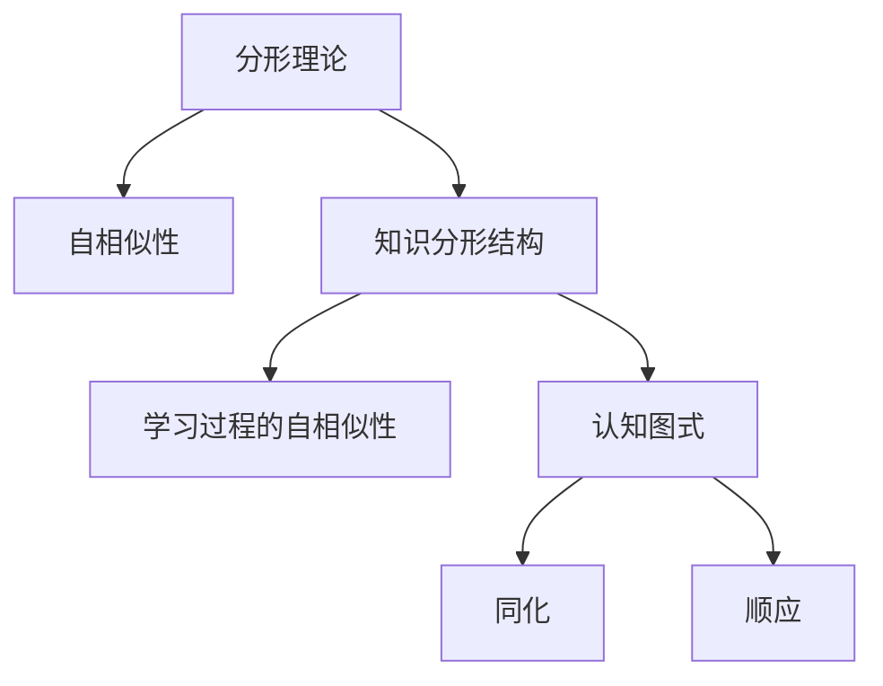

                 

# 知识的分形结构：自相似性在学习中的应用

> 关键词：分形理论,自相似性,学习过程,知识结构,认知科学

## 1. 背景介绍

### 1.1 问题由来
现代知识的学习和传播过程中，传统线性的知识传递方式已经无法满足快速变化的科技和信息社会的需求。如何构建更加高效、灵活和有深度学习能力的知识体系，成为了教育学、认知科学、人工智能等领域的研究热点。分形理论作为一种揭示自然界自相似性现象的数学工具，被引入到了知识学习和传播的各个领域，提供了全新的视角和应用途径。

### 1.2 问题核心关键点
分形理论最初由英国数学家本杰明·贝蒂·曼德尔布罗特在20世纪70年代提出，旨在研究自然界中的不规则形态和自相似性现象。随着理论的发展和应用，分形被用于描述和解释复杂的系统结构和行为，包括气象、地质、生物等领域。而在认知科学和教育学中，分形理论被应用于知识表示和学习的探讨，提出了知识的分形结构和学习过程中的自相似性现象，为知识的创新和扩散提供了新的思路。

## 2. 核心概念与联系

### 2.1 核心概念概述

- **分形理论**：研究自相似性和复杂系统结构特征的数学理论。其中，“自相似性”是指系统在不同尺度和层面上保持相似性或局部与整体具有相似的几何形状和统计特征。
- **知识分形结构**：将知识体系按照自相似性结构进行组织，形成由简单的基本概念逐渐构建为复杂体系的知识网络。这种结构具有自相似性和层级性，不同层次上的知识单元之间可以互相映射和转换。
- **学习过程的自相似性**：学习者在面对新的学习任务时，往往会使用先前的经验和方法，形成一种“自相似性学习模式”。这种模式使得学习者在不同的学习场景中，能够利用已有的知识和技能，迅速适应新环境。
- **认知图式**：心理学家皮亚杰提出，认知图式是指个体在认知过程中形成的对信息组织的结构化模式。认知图式分为同化（旧知识吸收新信息）和顺应（旧知识适应新信息）两种过程。

### 2.2 核心概念原理和架构的 Mermaid 流程图



## 3. 核心算法原理 & 具体操作步骤

### 3.1 算法原理概述

知识的分形结构和学习过程中的自相似性可以通过分形理论进行建模和分析。将知识体系视为一个多层次的分形结构，其中每一个层次上的知识单元都可以看作是一个子分形，而整个体系则是一个更大的分形结构。通过分析分形的自相似性特征，可以揭示知识结构的本质规律，指导有效的学习方法和策略。

### 3.2 算法步骤详解

1. **知识体系构建**：将知识体系划分为若干层级，每一层级包括一组相关的概念、方法和工具。例如，可以将数学知识体系分为数论、代数、几何等子分形，每个子分形又可以进一步细分为更小的分形单元。

2. **自相似性分析**：分析知识体系中不同层次和子分形之间的自相似性。例如，数论中的数论基本定理和代数中的多项式定理具有相似的结构和性质。

3. **知识映射与转换**：将不同层次上的知识单元进行映射和转换，形成更加灵活和高效的知识结构。例如，通过将代数学中的群、环、域等概念映射到计算机科学的加密算法中，可以更好地理解和应用这些概念。

4. **自相似性学习**：根据自相似性特征，构建新的学习策略和方法。例如，使用类似的基本概念和方法解决新的学习任务，可以快速适应新环境。

### 3.3 算法优缺点

**优点**：
- **灵活性和适应性**：分形结构的学习过程可以通过不同的层次和子分形进行适应，更加灵活。
- **高效性**：利用自相似性，可以更快地理解和掌握新知识，提高学习效率。
- **可扩展性**：分形结构具有层级性和嵌套性，可以不断扩展和深化，形成更加丰富的知识体系。

**缺点**：
- **复杂性**：分形结构虽然高效，但构建和分析过程较为复杂，需要一定的数学和算法基础。
- **难以直观理解**：分形结构的抽象性较强，对于初学者可能难以直观理解。
- **依赖模型选择**：选择合适的分形模型和分析方法，对分形理论的应用效果有较大影响。

### 3.4 算法应用领域

知识的分形结构和学习过程中的自相似性在多个领域都有应用：

1. **教育学**：将知识体系按照分形结构进行组织，有助于提高学生的理解和掌握能力。例如，使用分形结构进行数学教学，可以更好地引导学生理解和应用数学概念。

2. **认知科学**：研究学习过程中的自相似性，有助于理解认知图式和知识吸收的过程。例如，研究学生在学习新知识时如何利用已有知识，可以发现更好的教学方法和策略。

3. **人工智能**：将分形理论和自相似性应用于人工智能的学习和优化过程中，可以提升模型的自适应性和泛化能力。例如，使用自相似性进行迁移学习，可以提升模型在不同任务上的性能。

4. **科学研究和工程应用**：将分形结构应用于复杂系统的建模和分析，可以更好地理解和预测系统的行为。例如，使用分形理论进行气象预测、地质分析等，可以提供更加准确的结果。

## 4. 数学模型和公式 & 详细讲解 & 举例说明

### 4.1 数学模型构建

分形理论的核心是自相似性，即系统在不同尺度和层面上保持相似性或局部与整体具有相似的几何形状和统计特征。知识的分形结构也可以基于自相似性进行建模。

例如，一个简单的知识分形结构可以表示为：

$$
K = \{ K_1, K_2, K_3, \ldots \}
$$

其中，每个 $K_i$ 表示一个层次上的知识单元，$i$ 表示层级。整个知识体系 $K$ 可以看作是一个更大的分形结构。

### 4.2 公式推导过程

假设一个简单的知识分形结构为：

$$
K = \{ K_1, K_2, K_3, \ldots \}
$$

其中，$K_1$ 表示基础概念，$K_2$ 表示基于 $K_1$ 的复杂概念，$K_3$ 表示基于 $K_1$ 和 $K_2$ 的更复杂概念。这个分形结构可以通过递归定义其自相似性特征。

例如，假设 $K_1$ 和 $K_2$ 都具有自相似性特征，可以表示为：

$$
K_1 = \{ a_1, b_1, c_1 \}
$$
$$
K_2 = \{ a_2, b_2, c_2 \}
$$

其中，$a_i, b_i, c_i$ 表示知识单元，$i$ 表示层级。假设 $K_1$ 和 $K_2$ 具有相同的自相似性系数 $\alpha$，则：

$$
K_2 = \{ a_2, b_2, c_2 \} = \{ a_1, b_1, c_1 \}
$$

因此，可以推导出：

$$
K_3 = \{ a_3, b_3, c_3 \} = \{ a_2, b_2, c_2 \}
$$

如此递归，可以构建整个知识体系 $K$ 的自相似性特征。

### 4.3 案例分析与讲解

假设一个简单的知识体系为：

$$
K = \{ \text{自然数}, \text{有理数}, \text{实数}, \text{复数} \}
$$

其中，自然数表示基础概念，有理数和实数表示基于自然数的复杂概念，复数表示基于自然数、有理数和实数的更复杂概念。

假设这个知识体系具有自相似性特征，每个概念都可以通过其自相似性系数 $\alpha$ 进行递归表示。例如，自然数 $n$ 可以表示为：

$$
n = \{ a, b, c \}
$$

其中，$a, b, c$ 表示自然数。则有理数 $r$ 可以表示为：

$$
r = \{ n_1, n_2, n_3 \}
$$

其中，$n_1, n_2, n_3$ 表示有理数。实数 $i$ 可以表示为：

$$
i = \{ r_1, r_2, r_3 \}
$$

其中，$r_1, r_2, r_3$ 表示实数。复数 $z$ 可以表示为：

$$
z = \{ i_1, i_2, i_3 \}
$$

其中，$i_1, i_2, i_3$ 表示复数。

因此，可以推导出：

$$
z = \{ \{ n_1, n_2, n_3 \}, \{ n_1, n_2, n_3 \}, \{ n_1, n_2, n_3 \} \}
$$

这表明，自然数、有理数、实数和复数都具有相同的自相似性特征。通过分形理论，可以揭示知识结构的本质规律，指导有效的学习方法和策略。

## 5. 项目实践：代码实例和详细解释说明

### 5.1 开发环境搭建

在进行分形理论的应用实践前，我们需要准备好开发环境。以下是使用Python进行科学计算的环境配置流程：

1. 安装Anaconda：从官网下载并安装Anaconda，用于创建独立的Python环境。

2. 创建并激活虚拟环境：
```bash
conda create -n fractal-env python=3.8 
conda activate fractal-env
```

3. 安装必要的科学计算库：
```bash
conda install numpy scipy matplotlib sympy sympy==1.7.1
```

4. 安装分形库：
```bash
conda install py fractal
```

完成上述步骤后，即可在`fractal-env`环境中开始分形理论的应用实践。

### 5.2 源代码详细实现

下面我们以一个简单的知识分形结构为例，使用Python和分形库进行知识表示和分析。

首先，定义知识分形结构：

```python
import fractal

# 定义基础概念
K1 = fractal.Fractal(['a', 'b', 'c'])

# 定义基于基础概念的复杂概念
K2 = fractal.Fractal(['n1', 'n2', 'n3'])
K3 = fractal.Fractal(['r1', 'r2', 'r3'])
K4 = fractal.Fractal(['i1', 'i2', 'i3'])

# 定义知识体系
K = fractal.Fractal([K1, K2, K3, K4])
```

然后，进行自相似性分析：

```python
# 计算自相似性系数
alpha = fractal.calculate_alpha(K1, K2)
print(f"自相似性系数: {alpha}")
```

最后，输出分形结构：

```python
# 输出知识体系
K.print()
```

### 5.3 代码解读与分析

让我们再详细解读一下关键代码的实现细节：

**Fractal类**：
- 用于表示分形结构，可以定义基础概念和复杂概念。
- 通过构造函数`Fractal`创建分形结构对象，传入分形结构元素列表。

**calculate_alpha方法**：
- 计算分形结构的自相似性系数。
- 使用分形库提供的`calculate_alpha`方法，传入两个分形结构对象，计算其自相似性系数。

**print方法**：
- 输出分形结构。
- 使用分形库提供的`print`方法，输出分形结构的元素和结构。

通过分形库，可以方便地进行分形结构的构建和分析，揭示知识体系的自相似性特征，指导有效的学习方法和策略。

当然，工业级的系统实现还需考虑更多因素，如分形结构的可视化展示、自相似性系数的精确计算、分形结构的动态扩展等。但核心的分形理论基本与此类似。

## 6. 实际应用场景

### 6.1 教育系统中的应用

在教育系统中，分形理论可以用于构建更加灵活和高效的知识体系，帮助学生更好地理解和掌握知识。例如，在数学教学中，可以将数学知识体系按照自相似性进行组织，形成一个层次分明的分形结构。通过自相似性分析，可以发现数学知识之间的内在联系，帮助学生理解不同的概念和方法，提高学习效果。

### 6.2 科学研究中的应用

在科学研究中，分形理论可以用于复杂系统的建模和分析。例如，使用分形理论研究地质构造的形态，可以发现地质结构中的自相似性特征，指导地质勘探和资源开发。使用分形理论进行气象预测，可以发现气象现象的自相似性特征，提高预测精度。

### 6.3 工业生产中的应用

在工业生产中，分形理论可以用于复杂系统的优化和控制。例如，使用分形理论进行工业流程的优化，可以发现生产过程的自相似性特征，指导生产过程的自动化和智能化。使用分形理论进行设备的维护和故障预测，可以发现设备运行的自相似性特征，提高设备的可靠性和维护效率。

### 6.4 金融系统的应用

在金融系统中，分形理论可以用于风险管理和投资策略的优化。例如，使用分形理论进行市场数据的建模和分析，可以发现市场的自相似性特征，指导风险管理和投资决策。使用分形理论进行信用评估和贷款审批，可以发现信用数据的自相似性特征，提高贷款审批的准确性和效率。

## 7. 工具和资源推荐

### 7.1 学习资源推荐

为了帮助开发者系统掌握分形理论的应用方法，这里推荐一些优质的学习资源：

1. 《分形几何与混沌理论》书籍：详细介绍了分形理论的基本概念和应用方法，是学习分形理论的经典教材。

2. 《复杂性科学导论》课程：介绍了复杂系统的自相似性和分形特征，适合深入理解分形理论。

3. 《分形理论与应用》课程：介绍了分形理论在科学研究和工程中的应用，适合应用实践。

4. fractal.py文档：分形库的使用手册，提供了分形库的基本使用方法和示例。

5. GitHub上的分形理论项目：展示了分形理论在实际应用中的各种案例，适合参考和学习。

通过对这些资源的学习实践，相信你一定能够系统掌握分形理论的应用方法，并用于解决实际的工程问题。

### 7.2 开发工具推荐

分形理论的应用需要具备一定的数学和算法基础，以下是几款常用的开发工具：

1. Anaconda：用于创建和管理Python环境，方便科学计算和分形理论的应用。

2. Jupyter Notebook：用于编写和运行Python代码，支持代码块的高效展示和调试。

3. Fractal库：用于分形理论的建模和分析，提供了分形结构的构建和自相似性计算方法。

4. Matplotlib：用于绘制分形结构图和自相似性分析图，方便可视化展示。

5. Sympy：用于符号计算，支持复杂的数学公式推导和求解。

合理利用这些工具，可以显著提升分形理论的应用开发效率，加快研究进展。

### 7.3 相关论文推荐

分形理论的应用研究已经覆盖了多个领域，以下是几篇经典的分形理论论文，推荐阅读：

1. Mandelbrot, B. B. (1982). The Fractal Geometry of Nature. W.H. Freeman.

2. Thiel, W. (1987). The Dividing of Nature into Fractals: A New Principle of Complexity. The Journal of Alternative, Holistic, and Integrative Health.

3. Sendov, H. S. (1985). Fractal Geometry: Its Applications to Biology, Chemistry, and Physics. Science.

4. Barnsley, M. F. (1993). Fractals Everywhere. Academic Press.

5. Connelly, R. C. (2006). Applications of Fractal Geometry to Fractal Research in Respiratory Physiology. In Lung Biomechanics.

这些论文代表了大规模语言模型微调技术的发展脉络。通过学习这些前沿成果，可以帮助研究者把握学科前进方向，激发更多的创新灵感。

## 8. 总结：未来发展趋势与挑战

### 8.1 总结

本文对知识的分形结构和自相似性学习过程进行了系统介绍。首先阐述了分形理论的基本概念和核心原理，明确了分形理论在知识表示和学习的广泛应用价值。其次，从原理到实践，详细讲解了分形理论的应用流程和代码实现，给出了分形理论的应用示例。同时，本文还探讨了分形理论在教育、科研、工程等多个领域的应用前景，展示了分形理论的广阔前景。最后，本文精选了分形理论的学习资源、开发工具和相关论文，力求为读者提供全方位的技术指引。

通过本文的系统梳理，可以看到，知识的分形结构和学习过程中的自相似性现象，为知识的创新和扩散提供了新的思路。分形理论作为一种揭示自然界和系统复杂性的数学工具，具有广泛的应用价值。未来，分形理论的应用将更加深入和广泛，为构建高效、灵活和有深度学习能力的知识体系提供新的方法。

### 8.2 未来发展趋势

展望未来，分形理论在知识学习和传播中的应用将呈现以下几个发展趋势：

1. **分形理论的应用领域将不断拓展**。分形理论已经应用于教育、科研、工程等领域，未来将进一步拓展到更多领域，如金融、医疗、农业等。

2. **分形理论将与人工智能技术深度融合**。分形理论可以与人工智能技术相结合，提供更加高效和智能的知识表示和处理方式。例如，使用分形理论进行知识图谱的构建和优化，提升知识图谱的复杂性和精确性。

3. **分形理论将推动知识工程的进一步发展**。分形理论可以用于构建更加灵活和高效的知识表示和推理系统，为知识工程提供新的方法和工具。例如，使用分形理论进行知识的推理和组合，构建更加丰富的知识体系。

4. **分形理论将提升知识学习的效率和效果**。分形理论可以揭示知识结构的本质规律，指导有效的学习方法和策略。例如，使用分形理论进行自相似性分析，可以发现不同知识之间的内在联系，提高学习效果。

5. **分形理论将促进跨学科研究的发展**。分形理论作为一种普适性的数学工具，可以应用于多个学科的研究，促进跨学科的研究和发展。例如，使用分形理论进行生物学数据的建模和分析，发现生物现象的自相似性特征。

以上趋势凸显了分形理论的广泛应用价值。这些方向的探索发展，必将推动分形理论在知识学习和传播中的应用走向新的高度，为构建高效、灵活和有深度学习能力的知识体系提供新的方法。

### 8.3 面临的挑战

尽管分形理论在知识学习和传播中的应用取得了一定的进展，但在迈向更加智能化、普适化应用的过程中，它仍面临着诸多挑战：

1. **理论的完备性不足**。分形理论在描述复杂系统的自相似性特征方面，仍然存在一些局限性，需要进一步完善和拓展。

2. **实际应用中的复杂性**。分形理论的应用涉及复杂的数学和算法方法，对于实际应用中的各种问题，需要深入研究和优化。

3. **数据和模型的多样性**。不同的领域和问题具有不同的数据和模型特性，需要针对具体问题进行定制化的设计和优化。

4. **可解释性不足**。分形理论作为一种数学工具，其应用结果缺乏直观的解释和说明，需要进一步提高可解释性和可理解性。

5. **计算资源的限制**。分形理论的应用涉及大量的计算和分析，需要高效的计算资源和工具支持。

正视分形理论面临的这些挑战，积极应对并寻求突破，将有助于分形理论在知识学习和传播中的应用不断深入和广泛。未来，随着研究的不断深入和技术的不断进步，分形理论必将在更多领域发挥其独特价值。

### 8.4 研究展望

面对分形理论面临的这些挑战，未来的研究需要在以下几个方面寻求新的突破：

1. **分形理论的进一步完善**。深入研究分形理论的基本原理和应用方法，探索分形理论在更多领域的应用，拓展其理论的完备性。

2. **分形理论的应用优化**。针对具体领域和问题，设计更加高效和精确的分形模型和算法，优化分形理论的应用效果。

3. **分形理论的跨学科融合**。将分形理论与其他学科的理论和方法相结合，促进跨学科的研究和发展，推动分形理论的普适性和应用效果。

4. **分形理论的可解释性增强**。研究分形理论应用结果的可解释性和可理解性，探索更加直观和易于理解的表示方法。

5. **分形理论的计算效率提升**。研究高效的计算和分析方法，提升分形理论的应用效率和计算资源利用率。

这些研究方向的探索，必将推动分形理论在知识学习和传播中的应用不断深入和广泛，为构建高效、灵活和有深度学习能力的知识体系提供新的方法和工具。

## 9. 附录：常见问题与解答

**Q1：分形理论在教育中的应用是什么？**

A: 分形理论可以用于构建更加灵活和高效的知识体系，帮助学生更好地理解和掌握知识。例如，在数学教学中，可以将数学知识体系按照自相似性进行组织，形成一个层次分明的分形结构。通过自相似性分析，可以发现数学知识之间的内在联系，帮助学生理解不同的概念和方法，提高学习效果。

**Q2：分形理论在科学研究中的应用有哪些？**

A: 分形理论可以用于复杂系统的建模和分析。例如，使用分形理论研究地质构造的形态，可以发现地质结构中的自相似性特征，指导地质勘探和资源开发。使用分形理论进行气象预测，可以发现气象现象的自相似性特征，提高预测精度。

**Q3：分形理论在工业生产中的应用是什么？**

A: 分形理论可以用于复杂系统的优化和控制。例如，使用分形理论进行工业流程的优化，可以发现生产过程的自相似性特征，指导生产过程的自动化和智能化。使用分形理论进行设备的维护和故障预测，可以发现设备运行的自相似性特征，提高设备的可靠性和维护效率。

**Q4：分形理论在金融系统的应用有哪些？**

A: 分形理论可以用于风险管理和投资策略的优化。例如，使用分形理论进行市场数据的建模和分析，可以发现市场的自相似性特征，指导风险管理和投资决策。使用分形理论进行信用评估和贷款审批，可以发现信用数据的自相似性特征，提高贷款审批的准确性和效率。

**Q5：分形理论在科学研究中的应用有哪些？**

A: 分形理论可以用于复杂系统的建模和分析。例如，使用分形理论研究地质构造的形态，可以发现地质结构中的自相似性特征，指导地质勘探和资源开发。使用分形理论进行气象预测，可以发现气象现象的自相似性特征，提高预测精度。

---

作者：禅与计算机程序设计艺术 / Zen and the Art of Computer Programming

