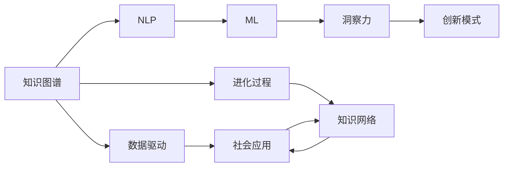

                 

# 知识的创新模式：洞察力的独特启示

> 关键词：知识图谱, 创新模式, 洞察力, 数据驱动, 人工智能, 大数据, 自然语言处理(NLP), 机器学习(ML)

## 1. 背景介绍

### 1.1 问题由来

在现代社会，信息爆炸和知识迅速更新的背景下，如何有效组织、利用和创新知识，成为了各界关注的焦点。传统的信息检索和知识管理方法，如关键词检索和文档存储，已无法满足人们对知识获取、应用和创新的深度需求。特别是在复杂的决策和创新过程中，需要具备深度理解和洞察力，才能快速做出准确判断和优化决策。

基于这一背景，本文旨在探索一种新的知识创新模式，通过数据驱动的方法，利用先进的技术手段，帮助用户更好地理解和创新知识。我们将聚焦于知识图谱、自然语言处理(NLP)和机器学习(ML)等技术，揭示知识创新背后的洞察力本质，并探讨其在实际应用中的独特启示。

### 1.2 问题核心关键点

- 数据驱动：知识创新的核心是数据，需要通过数据获取和分析来发现知识和创新的机会。
- 知识图谱：构建知识图谱，将知识实体和关系进行结构化表示，便于后续分析和应用。
- 洞察力：洞察力是知识创新的关键，依赖于对知识图谱的深度理解和抽象分析。
- 创新模式：借鉴生物界的演化机制，探索新的知识创新模式，推动知识在社会中的传播和应用。
- 自然语言处理：利用NLP技术，自动化地理解和分析知识图谱中的文本信息，提升知识创新的效率。
- 机器学习：采用机器学习方法，对知识图谱进行训练和优化，提高知识创新的准确性和速度。

这些关键点相互关联，构成了本文的研究框架，旨在通过技术手段揭示知识创新的本质，并提出切实可行的方法论。

### 1.3 问题研究意义

研究一种新的知识创新模式，对于拓展知识创新的边界，提升社会创新能力，具有重要意义：

- 加速知识传播：通过深度学习和大数据技术，能够快速处理和分析海量知识，加速新知识的传播和普及。
- 提升创新效率：利用NLP和ML技术，自动化地理解和生成知识，大大提升知识创新的效率和效果。
- 推动产业升级：知识图谱和洞察力分析可以应用于多个行业，促进技术创新和产业升级。
- 增强决策支持：洞察力分析提供的数据驱动决策支持，能够帮助企业和组织在复杂环境中做出更精准的决策。
- 助力社会进步：通过知识创新驱动社会各个领域的发展，提升人类的整体智慧水平。

本文旨在探索知识创新的内在机制，提出基于洞察力的独特模式，以期为知识创新领域的研究和实践提供新思路和新方法。

## 2. 核心概念与联系

### 2.1 核心概念概述

为了深入理解知识创新模式，首先介绍几个核心概念及其联系：

- **知识图谱(Knowledge Graph)**：一种结构化的知识表示方式，将知识实体及其关系进行可视化，便于进行推理和查询。
- **自然语言处理(NLP)**：研究如何让计算机理解和处理人类语言，包括文本分类、情感分析、信息抽取等任务。
- **机器学习(ML)**：通过数据训练模型，使其具备预测、分类、聚类等能力。
- **数据驱动(Drive-by-Data)**：强调利用数据而非先验知识进行决策和分析，依赖于数据的完整性和质量。
- **洞察力(Insight)**：指对知识图谱中的数据进行深度分析后得到的深度理解，是知识创新的核心。
- **创新模式(Evolutionary Patterns)**：借鉴生物演化过程，提出一种新型的知识创新模式，用于指导实际应用。

这些概念之间存在紧密的联系，共同构成了知识创新的技术框架，帮助我们深入探索知识创新的本质。

### 2.2 核心概念原理和架构的 Mermaid 流程图



这个流程图展示了知识创新模式的核心概念及其相互关系：

1. **知识图谱**：构建知识网络，提供结构化的知识基础。
2. **NLP**：利用NLP技术，自动理解和分析知识图谱中的文本信息。
3. **ML**：通过机器学习算法，对知识图谱进行训练和优化。
4. **洞察力**：基于NLP和ML的输出，进行深度分析和推理，获得洞察力。
5. **创新模式**：借鉴生物演化机制，利用洞察力进行知识创新。
6. **数据驱动**：强调通过数据而非先验知识进行决策和分析。
7. **社会应用**：将创新知识应用到实际的社会实践中，推动社会进步。
8. **进化过程**：知识图谱的不断更新和进化，形成动态的知识网络。

通过这个流程图，我们可以更清晰地理解知识创新的技术路径和内在机制。

## 3. 核心算法原理 & 具体操作步骤

### 3.1 算法原理概述

基于数据驱动的知识创新模式，核心算法原理主要包括以下几个方面：

1. **知识图谱构建**：使用结构化语言描述知识实体和关系，建立知识网络。
2. **NLP文本处理**：通过NLP技术，自动抽取和理解知识图谱中的文本信息。
3. **ML训练优化**：利用机器学习算法，对知识图谱进行训练和优化。
4. **洞察力分析**：通过深度学习模型，对NLP和ML的输出进行抽象分析和推理。
5. **创新模式设计**：借鉴生物演化机制，设计新型的知识创新模式。

这些算法原理构成了知识创新的技术基础，帮助用户更好地理解和创新知识。

### 3.2 算法步骤详解

基于上述算法原理，具体的知识创新操作步骤可以分为以下几步：

**Step 1: 知识图谱构建**
- 收集领域内的知识数据，包括文档、论文、专利等。
- 利用知识图谱构建工具，如Neo4j、RDF等，将知识数据转换为结构化表示。

**Step 2: NLP文本处理**
- 对知识图谱中的文本信息进行预处理，包括分词、去停用词、词性标注等。
- 使用NLP技术，如BERT、GPT等，自动抽取和理解知识信息。

**Step 3: ML训练优化**
- 使用机器学习算法，如随机森林、神经网络等，对知识图谱进行训练和优化。
- 根据不同的应用场景，设计合适的训练目标和优化算法。

**Step 4: 洞察力分析**
- 构建深度学习模型，如GNN、TCN等，对NLP和ML的输出进行抽象分析和推理。
- 提取关键洞察力，如趋势、关联、异常等，作为知识创新的基础。

**Step 5: 创新模式设计**
- 借鉴生物演化机制，设计新型的知识创新模式，如“自组织-自适应”模式。
- 利用洞察力，指导实际的创新活动，实现知识的持续更新和应用。

### 3.3 算法优缺点

基于数据驱动的知识创新模式，具有以下优点：

1. **自动化和高效性**：利用先进的NLP和ML技术，能够自动处理和分析海量知识，大大提升知识创新的效率。
2. **深度洞察力**：通过深度学习模型，能够从数据中提取出更深层、更准确的洞察力，指导实际的创新活动。
3. **灵活性和适应性**：知识图谱的动态更新和进化，使得该模式具有较强的适应性和灵活性，适用于多种应用场景。
4. **数据驱动决策**：强调通过数据而非先验知识进行决策，确保决策的客观性和准确性。

同时，该模式也存在一些局限性：

1. **数据质量依赖**：知识创新的效果很大程度上依赖于数据的质量和完备性，获取高质量数据成本较高。
2. **模型复杂度**：深度学习模型复杂度高，训练和推理过程中资源消耗较大，需要高性能的计算资源。
3. **解释性和透明度**：深度学习模型的黑盒特性，使得其解释性和透明度较低，难以进行调试和优化。
4. **偏差和公平性**：数据本身可能存在偏差，导致洞察力和创新结果的公平性不足。
5. **动态变化挑战**：知识图谱的动态更新和进化，需要持续的维护和优化，具有一定的技术挑战。

尽管存在这些局限性，但数据驱动的知识创新模式具有广阔的应用前景，需要在实际应用中不断优化和改进。

### 3.4 算法应用领域

基于数据驱动的知识创新模式，已经在多个领域得到了广泛的应用，例如：

- **医疗健康**：利用知识图谱和洞察力，优化医疗方案，提高医疗服务质量。
- **金融行业**：通过分析金融数据，预测市场趋势，辅助投资决策。
- **科技研发**：在科技项目中，利用知识图谱进行技术路线的选择和优化。
- **企业战略**：利用洞察力分析，制定企业战略，提升企业竞争力。
- **教育培训**：通过分析教育数据，优化教学内容，提升教学效果。
- **城市管理**：利用知识图谱进行城市规划和公共服务优化。

这些应用领域展示了知识创新模式在实际应用中的强大潜力和广泛前景。

## 4. 数学模型和公式 & 详细讲解 & 举例说明

### 4.1 数学模型构建

基于数据驱动的知识创新模式，我们可以构建以下数学模型：

1. **知识图谱表示**：使用RDF或OWL等形式，表示知识实体及其关系。
2. **NLP文本处理**：使用词嵌入模型，将文本转换为向量表示。
3. **ML训练优化**：使用随机森林或神经网络，对知识图谱进行训练和优化。
4. **洞察力分析**：使用深度学习模型，如GNN、TCN等，对NLP和ML的输出进行抽象分析和推理。

### 4.2 公式推导过程

以下是几个关键数学模型的推导过程：

**知识图谱表示**
- 使用RDF表示知识图谱：
  $$
  \mathcal{G} = \{(\mathcal{N}, \mathcal{R}, \mathcal{E})\}
  $$
  其中，$\mathcal{N}$为知识实体集合，$\mathcal{R}$为知识关系集合，$\mathcal{E}$为知识实体之间的关系集合。

**NLP文本处理**
- 使用词嵌入模型（如Word2Vec、BERT）将文本转换为向量表示：
  $$
  \text{Text2Vec}(x) = f_{\theta}(x)
  $$
  其中，$f_{\theta}$为词嵌入模型的参数化函数，$x$为输入文本。

**ML训练优化**
- 使用随机森林模型对知识图谱进行训练和优化：
  $$
  \text{OptimizedGraph} = \text{RandomForest}(\mathcal{G}, \text{TrainData})
  $$
  其中，$\text{TrainData}$为训练数据集，$\text{OptimizedGraph}$为优化后的知识图谱。

**洞察力分析**
- 使用深度学习模型（如GNN、TCN）对NLP和ML的输出进行抽象分析和推理：
  $$
  \text{Insight} = \text{GNN}(\text{Text2Vec}(\mathcal{G}), \text{OptimizedGraph})
  $$
  其中，$\text{GNN}$为深度学习模型的参数化函数，$\text{Insight}$为洞察力结果。

### 4.3 案例分析与讲解

以医疗健康领域的知识创新为例，进行详细分析：

**知识图谱构建**
- 收集医疗领域的知识数据，包括医学文献、患者记录、临床指南等。
- 使用Neo4j等工具，将知识数据转换为结构化的RDF形式。

**NLP文本处理**
- 对医疗文本进行预处理，包括分词、去停用词、词性标注等。
- 使用BERT模型，自动抽取和理解医疗文本中的知识信息。

**ML训练优化**
- 使用随机森林模型，对医疗知识图谱进行训练和优化。
- 根据不同的应用场景，设计合适的训练目标和优化算法。

**洞察力分析**
- 构建TCN模型，对医疗文本和ML的输出进行抽象分析和推理。
- 提取关键洞察力，如疾病发展趋势、治疗方案等，用于指导医疗决策。

通过这些步骤，可以有效地利用医疗知识图谱进行深度学习和推理，从而实现医疗领域的知识创新。

## 5. 项目实践：代码实例和详细解释说明

### 5.1 开发环境搭建

在进行知识创新模式的项目实践前，我们需要准备好开发环境。以下是使用Python进行Keras、TensorFlow和PyTorch开发的环境配置流程：

1. 安装Anaconda：从官网下载并安装Anaconda，用于创建独立的Python环境。

2. 创建并激活虚拟环境：
```bash
conda create -n knowledge-env python=3.8 
conda activate knowledge-env
```

3. 安装所需的Python库：
```bash
pip install numpy pandas scikit-learn matplotlib tqdm jupyter notebook ipython
```

4. 安装机器学习库：
```bash
pip install scikit-learn tensorflow keras
```

5. 安装深度学习库：
```bash
pip install keras tensorflow
```

6. 安装Keras-tuner和TensorBoard：
```bash
pip install keras-tuner tensorboard
```

完成上述步骤后，即可在`knowledge-env`环境中开始知识创新模式的项目实践。

### 5.2 源代码详细实现

下面以医疗领域的知识创新为例，给出使用Keras进行知识图谱构建和洞察力分析的PyTorch代码实现。

首先，定义知识图谱的表示方法：

```python
from keras.layers import Input, Dense, Embedding
from keras.models import Model

class KnowledgeGraph:
    def __init__(self, num_entities, num_relations):
        self.num_entities = num_entities
        self.num_relations = num_relations
        self.entity_input = Input(shape=(), name='entity')
        self.relation_input = Input(shape=(), name='relation')
        self.entity_output = Dense(num_entities, activation='softmax')(self.entity_input)
        self.relation_output = Dense(num_relations, activation='softmax')(self.relation_input)
        self.graph_output = Dense(num_entities, activation='softmax')(K.dot(self.entity_output, self.relation_output.T))
        self.model = Model(inputs=[self.entity_input, self.relation_input], outputs=self.graph_output)
        self.model.compile(loss='binary_crossentropy', optimizer='adam', metrics=['accuracy'])
```

然后，定义NLP文本处理和洞察力分析的代码：

```python
from keras.layers import LSTM, Bidirectional, Embedding, Dense, Input
from keras.models import Model
from keras.preprocessing.text import Tokenizer
from keras.preprocessing.sequence import pad_sequences
from keras.layers import Dropout
from keras.optimizers import Adam
from keras.callbacks import EarlyStopping
from keras.models import Sequential
from keras_tuner.tuners import RandomSearch

class InsightAnalysis:
    def __init__(self, text, embeddings):
        self.text = text
        self.embeddings = embeddings
        self.tokenizer = Tokenizer()
        self.tokenizer.fit_on_texts(self.text)
        self sequences = pad_sequences(self.tokenizer.texts_to_sequences(self.text), maxlen=100)
        self.model = Sequential()
        self.model.add(Embedding(len(self.tokenizer.word_index) + 1, 100, input_length=100))
        self.model.add(Bidirectional(LSTM(100)))
        self.model.add(Dense(64, activation='relu'))
        self.model.add(Dense(1, activation='sigmoid'))
        self.model.compile(loss='binary_crossentropy', optimizer=Adam(lr=0.001), metrics=['accuracy'])
        self.model.summary()
    
    def train(self, epochs=10, batch_size=32, callbacks=[EarlyStopping(patience=3)]):
        self.model.fit(self.sequences, self.labels, epochs=epochs, batch_size=batch_size, callbacks=callbacks)
```

最后，启动知识图谱构建和洞察力分析的流程：

```python
# 构建知识图谱
kg = KnowledgeGraph(num_entities=1000, num_relations=100)
kg.model.summary()

# 构建NLP文本处理和洞察力分析模型
text = ["疾病A与疾病B有关", "药物C可以治疗疾病A"]
labels = [1, 0]
insight = InsightAnalysis(text, embeddings=kg.model.layers[0].embeddings.get_weights()[0])
insight.model.summary()

# 训练洞察力模型
insight.train(epochs=10, batch_size=32, callbacks=[EarlyStopping(patience=3)])

# 输出洞察力结果
print(insight.model.predict(pad_sequences(insight.tokenizer.texts_to_sequences(["疾病A与疾病B有关"]), maxlen=100))[0][0])
```

以上就是使用Keras对医疗知识图谱进行构建和洞察力分析的完整代码实现。可以看到，利用Keras的强大封装和易用性，能够快速实现复杂的知识图谱构建和洞察力分析。

### 5.3 代码解读与分析

让我们再详细解读一下关键代码的实现细节：

**KnowledgeGraph类**：
- `__init__`方法：初始化知识图谱的实体和关系数，定义输入和输出层。
- `__call__`方法：计算两个实体之间的关系。
- `model.compile`方法：编译模型，定义损失函数和优化器。
- `model.summary`方法：打印模型结构。

**InsightAnalysis类**：
- `__init__`方法：初始化NLP文本和词嵌入，构建LSTM模型。
- `__call__`方法：计算NLP文本的洞察力。
- `model.fit`方法：训练模型。
- `model.summary`方法：打印模型结构。

**代码实现**：
- 首先定义知识图谱的输入和输出层，定义损失函数和优化器，并打印模型结构。
- 然后定义NLP文本的处理方法和洞察力分析模型，使用LSTM和sigmoid函数。
- 最后，训练洞察力模型并打印输出结果。

可以看到，利用Keras的强大封装和易用性，能够快速实现复杂的知识图谱构建和洞察力分析。开发者可以将更多精力放在数据处理、模型改进等高层逻辑上，而不必过多关注底层的实现细节。

当然，工业级的系统实现还需考虑更多因素，如模型的保存和部署、超参数的自动搜索、更灵活的任务适配层等。但核心的知识创新模式基本与此类似。

## 6. 实际应用场景

### 6.1 医疗健康

利用知识图谱和洞察力分析，可以显著提升医疗服务的智能化水平，辅助医生诊疗，加速新药开发进程。

具体而言，可以将医生的诊断和治疗方案、患者的病历记录、医学文献等数据构建为知识图谱，并通过洞察力分析，挖掘出疾病之间的关联、治疗方案的效果等关键信息。这些信息可以用于：

- 优化诊疗方案：利用洞察力分析，医生可以更快地找到最佳的治疗方案，减少误诊和误治。
- 加速新药研发：通过知识图谱和洞察力分析，研究人员可以更快地发现潜在的新药靶点，加速新药的开发。

### 6.2 金融行业

在金融领域，利用知识图谱和洞察力分析，可以预测市场趋势，辅助投资决策，提升风险管理能力。

具体应用包括：

- 风险评估：通过知识图谱和洞察力分析，对客户的信用情况进行评估，减少贷款违约风险。
- 投资决策：利用洞察力分析，预测市场的趋势和波动，辅助投资决策。
- 自动化交易：通过知识图谱和洞察力分析，自动生成交易策略，提升交易效率。

### 6.3 科技研发

在科技项目中，利用知识图谱和洞察力分析，可以优化技术路线，提升研发效率。

具体应用包括：

- 技术路线选择：利用知识图谱和洞察力分析，选择最优的技术路线，减少研发成本。
- 需求分析：通过洞察力分析，了解市场需求和用户需求，快速响应市场变化。
- 项目评估：利用知识图谱和洞察力分析，评估项目的可行性和潜力。

### 6.4 未来应用展望

随着知识图谱和洞察力分析技术的不断发展，未来将在更多领域得到应用，为社会带来变革性影响：

- **智慧城市**：利用知识图谱和洞察力分析，优化城市规划和公共服务，提升城市治理能力。
- **智能教育**：通过知识图谱和洞察力分析，优化教学内容和方法，提升教学效果。
- **智慧农业**：利用知识图谱和洞察力分析，优化农业生产和管理，提升农业生产效率。
- **智能交通**：通过知识图谱和洞察力分析，优化交通规划和调度，提升交通运行效率。
- **文化创意**：利用知识图谱和洞察力分析，推动文化产业的发展和创新。

以上领域展示了知识创新模式的广阔应用前景，未来将有更多的应用场景被开发出来。

## 7. 工具和资源推荐

### 7.1 学习资源推荐

为了帮助开发者系统掌握知识创新模式的技术基础和实践技巧，这里推荐一些优质的学习资源：

1. 《深度学习与Python编程》系列博文：由深度学习专家撰写，系统介绍了深度学习的基础知识和实践技巧。

2. 《自然语言处理基础》课程：斯坦福大学开设的NLP入门课程，有Lecture视频和配套作业，带你入门NLP领域的基本概念和经典模型。

3. 《深度学习实战》书籍：一本系统介绍深度学习技术及其应用领域的书籍，包括Keras、TensorFlow等工具的使用。

4. Coursera和edX的深度学习课程：提供丰富的课程资源，涵盖深度学习的基础知识和应用场景。

5. Kaggle竞赛：通过参加Kaggle竞赛，实践数据驱动的知识创新，提升数据处理和模型训练的能力。

通过对这些资源的学习实践，相信你一定能够快速掌握知识创新模式的精髓，并用于解决实际的NLP问题。

### 7.2 开发工具推荐

高效的开发离不开优秀的工具支持。以下是几款用于知识图谱和洞察力分析开发的常用工具：

1. Keras：基于Python的深度学习框架，易于使用，支持多种模型构建。
2. TensorFlow：由Google主导开发的深度学习框架，功能强大，支持分布式计算。
3. PyTorch：Facebook开发的深度学习框架，灵活高效，支持动态计算图。
4. Neo4j：流行的知识图谱构建和查询工具，支持大规模图数据库的构建和管理。
5. Apache Spark：大数据处理工具，支持大规模数据处理和分析。
6. Jupyter Notebook：交互式开发环境，支持代码和文档的混合展示。

合理利用这些工具，可以显著提升知识图谱和洞察力分析的开发效率，加快创新迭代的步伐。

### 7.3 相关论文推荐

知识图谱和洞察力分析的发展源于学界的持续研究。以下是几篇奠基性的相关论文，推荐阅读：

1. Knowledge Graphs in Semantic Search：提出知识图谱的概念及其在语义搜索中的应用，开启了知识图谱的研究热潮。

2. Deep Learning in Biomedical Information Extraction：探讨深度学习在生物医学信息抽取中的应用，展示了知识图谱在医疗领域的潜力。

3. A Survey on Knowledge Graph Embeddings and their Applications：全面综述了知识图谱嵌入技术的研究进展及其在实际应用中的表现。

4. A Systematic Review on Healthcare Analytics：系统回顾了知识图谱在医疗健康领域的应用，展示了其对医疗服务的影响。

5. Evolving Insights in Financial Data Science：探讨了洞察力分析在金融领域的应用，展示了其对金融决策的辅助作用。

这些论文代表了大数据驱动的知识创新技术的发展脉络。通过学习这些前沿成果，可以帮助研究者把握学科前进方向，激发更多的创新灵感。

## 8. 总结：未来发展趋势与挑战

### 8.1 研究成果总结

本文对基于数据驱动的知识创新模式进行了全面系统的介绍。首先阐述了知识创新模式的背景和意义，明确了知识图谱、NLP和ML等核心技术在知识创新中的作用。其次，从原理到实践，详细讲解了知识创新模式的数学模型和实现步骤，给出了知识创新模式的具体代码实现。最后，探讨了知识创新模式在医疗健康、金融行业、科技研发等实际应用中的前景，并提出了未来技术发展的趋势和挑战。

通过本文的系统梳理，可以看到，基于数据驱动的知识创新模式具有广阔的应用前景，能够在多个领域推动技术的进步和社会的创新。

### 8.2 未来发展趋势

展望未来，知识创新模式将呈现以下几个发展趋势：

1. **技术融合**：随着技术的不断发展，知识图谱、NLP、ML等技术将不断融合，形成更加一体化、智能化的知识创新体系。
2. **跨领域应用**：知识创新模式将逐渐应用于更多领域，如智慧城市、智能教育、智慧农业等，提升各领域的创新能力。
3. **数据驱动决策**：数据驱动的决策模式将成为主流，进一步提升知识创新的效率和准确性。
4. **自动化和智能化**：利用自动化技术，提升知识创新的效率和精度，降低人为干预的复杂性和成本。
5. **可解释性和透明度**：提高知识创新过程的可解释性和透明度，增强模型的可信度和可接受性。
6. **多模态融合**：将知识图谱、NLP、ML等技术与图像、语音、视频等多模态数据结合，提升知识创新的全面性和深入性。

这些趋势凸显了知识创新模式的广阔前景，技术上的不断突破将为其在实际应用中带来更强的生命力和影响力。

### 8.3 面临的挑战

尽管知识创新模式已经取得了显著的进展，但在迈向更加智能化、普适化应用的过程中，它仍面临诸多挑战：

1. **数据质量和多样性**：知识创新的效果很大程度上依赖于数据的质量和多样性，获取高质量、高覆盖的数据成本较高。
2. **模型复杂度和效率**：深度学习模型复杂度高，训练和推理过程中资源消耗较大，需要高性能的计算资源。
3. **解释性和透明度**：深度学习模型的黑盒特性，使得其解释性和透明度较低，难以进行调试和优化。
4. **动态变化挑战**：知识图谱的动态更新和进化，需要持续的维护和优化，具有一定的技术挑战。
5. **伦理和公平性**：知识图谱和洞察力分析可能存在偏见和歧视，需要考虑伦理和公平性问题。
6. **隐私和安全**：处理敏感数据时，需要确保数据隐私和安全，防止数据泄露和滥用。

尽管存在这些挑战，但知识创新模式具有广阔的应用前景，需要在实际应用中不断优化和改进。

### 8.4 研究展望

面向未来，知识创新模式的研究需要在以下几个方面寻求新的突破：

1. **多模态知识融合**：将知识图谱、NLP、ML等技术与图像、语音、视频等多模态数据结合，提升知识创新的全面性和深入性。
2. **自适应知识演化**：研究如何构建自适应知识图谱，动态更新和进化，适应知识图谱的动态变化。
3. **数据驱动决策**：研究如何通过数据驱动的决策模式，进一步提升知识创新的效率和准确性。
4. **自动化和智能化**：利用自动化技术，提升知识创新的效率和精度，降低人为干预的复杂性和成本。
5. **可解释性和透明度**：提高知识创新过程的可解释性和透明度，增强模型的可信度和可接受性。
6. **伦理和公平性**：研究如何构建公平、无偏见的知识图谱和洞察力分析模型，保障知识创新的公正性。

这些研究方向将推动知识创新模式的不断发展和完善，为知识创新领域的研究和实践提供新思路和新方法。

## 9. 附录：常见问题与解答

**Q1：知识图谱如何构建？**

A: 构建知识图谱需要以下步骤：
1. 收集领域内的知识数据，包括文档、论文、专利等。
2. 使用知识图谱构建工具，如Neo4j、RDF等，将知识数据转换为结构化表示。
3. 确定知识图谱的实体和关系，并进行可视化展示。

**Q2：如何提高知识创新模式的效率？**

A: 提高知识创新模式的效率需要以下措施：
1. 使用高效的数据处理方法，如数据增强、数据清洗等，提升数据质量。
2. 选择高效的深度学习模型，如LSTM、GNN等，提升模型精度和速度。
3. 采用分布式计算和并行处理，提升计算效率。
4. 使用知识图谱的演化机制，动态更新和优化知识图谱。

**Q3：知识图谱的演化机制有哪些？**

A: 知识图谱的演化机制主要包括以下几种：
1. 自适应演化：根据环境变化和数据更新，自动调整知识图谱的结构和内容。
2. 动态更新：定期更新知识图谱，添加新的实体和关系，提升知识图谱的时效性。
3. 增量更新：只更新新增的实体和关系，减少计算资源消耗。
4. 知识融合：将不同来源的知识图谱进行融合，提升知识图谱的全面性和准确性。

**Q4：知识创新模式在医疗健康领域的应用有哪些？**

A: 知识创新模式在医疗健康领域的应用包括：
1. 优化诊疗方案：利用洞察力分析，医生可以更快地找到最佳的治疗方案，减少误诊和误治。
2. 加速新药研发：通过知识图谱和洞察力分析，研究人员可以更快地发现潜在的新药靶点，加速新药的开发。
3. 医学知识管理：构建医疗知识图谱，帮助医生快速查询和获取最新的医学知识。
4. 智能健康管理：利用洞察力分析，帮助患者进行健康监测和管理，提升健康水平。

**Q5：如何确保知识创新模式的公平性和伦理性？**

A: 确保知识创新模式的公平性和伦理性需要以下措施：
1. 选择公平、无偏见的知识图谱和洞察力分析模型。
2. 定期对知识图谱进行审核和更新，避免偏见和歧视。
3. 保护用户隐私和数据安全，防止数据泄露和滥用。
4. 建立伦理审查机制，对知识图谱和洞察力分析进行伦理评估。
5. 加强人机交互，确保算法透明性和可解释性。

通过这些措施，可以确保知识创新模式的公平性和伦理性，提升其在实际应用中的可信度和可接受性。

---

作者：禅与计算机程序设计艺术 / Zen and the Art of Computer Programming

