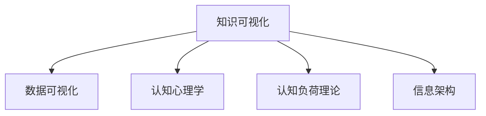

                 

# 知识的可视化：复杂概念的图形表达

> 关键词：知识可视化, 复杂概念, 图形表达, 数据可视化, 认知心理学

## 1. 背景介绍

### 1.1 问题由来
随着信息时代的到来，数据量爆炸式增长，对知识的获取、存储、分析与传递提出了更高的要求。然而，传统的文本、表格、图表等形式往往难以有效传达复杂概念，尤其是在数据密集、变化频繁的领域。

复杂的概念通常包括但不限于以下几类：

- **系统架构**：如云计算、分布式系统、大数据平台等，其组件众多、交互复杂，传统文档难以全面展示。
- **算法原理**：如机器学习、深度学习等，涉及多个步骤、多种模型，原理和应用场景复杂。
- **项目管理**：如敏捷开发、Scrum框架、CI/CD流程等，包含多个角色、活动和工具，文档难以清晰呈现。
- **技术栈选型**：如前后端开发、数据库选型、安全策略等，涉及不同技术栈，决策复杂。

如何有效传达这些复杂概念，成为信息传递中的一大难题。而知识可视化技术，通过图形化的方式，将抽象概念转化为易于理解的视觉表达，可大大提升信息传递的效率和效果。

### 1.2 问题核心关键点
知识可视化旨在将复杂的概念通过图形化的方式表达出来，增强理解、传递、存储和应用能力。具体关键点如下：

- **简化复杂性**：将复杂概念拆解为若干关键部分，减少复杂性，便于理解。
- **增加理解力**：通过视觉化展示，增强空间认知、模式识别、抽象推理等能力，促进知识的获取和应用。
- **促进创新**：可视化可以发现复杂概念间的关联，激发创新思维和解决方案。
- **优化流程**：通过可视化流程，帮助识别瓶颈和优化点，提升效率和质量。
- **跨文化交流**：图形化的表达更容易被全球不同语言、文化背景的人理解和接受。

本文聚焦于知识可视化技术，探索如何用图形表达复杂概念，提升信息传递的效率和效果，使知识传递更加科学、准确、直观。

## 2. 核心概念与联系

### 2.1 核心概念概述

为更好地理解知识可视化技术，本节将介绍几个密切相关的核心概念：

- **知识可视化(Knowledge Visualization, KV)**：指将知识用图形化的方式进行表达和传递，使复杂概念变得易于理解，提升学习、传递和应用能力。
- **数据可视化(Data Visualization, DV)**：指将数据信息用图形化的方式进行表达，帮助发现数据中的规律和趋势，提高决策效率。
- **认知心理学(Cognitive Psychology)**：研究人类认知过程的学科，探讨如何通过视觉刺激增强记忆、理解和应用。
- **认知负荷理论(Cognitive Load Theory, CLT)**：强调在知识传递中，应减少认知负荷，使学习者能够更轻松地理解和应用知识。
- **信息架构(Information Architecture, IA)**：设计和管理信息的结构和方式，以优化信息获取和使用的效率。

这些概念之间的逻辑关系可以通过以下Mermaid流程图来展示：



这个流程图展示的知识可视化核心概念及其之间的关系：

1. 知识可视化利用数据可视化、认知心理学和认知负荷理论，设计出易于理解的图形表达方式。
2. 信息架构指导知识的结构设计和传递方式，以优化信息获取和应用效率。

## 3. 核心算法原理 & 具体操作步骤
### 3.1 算法原理概述

知识可视化技术的核心原理是将复杂概念拆解为若干关键部分，用图形化的方式进行表达。其算法原理主要包括以下几个步骤：

1. **概念分析**：分析复杂概念的组成、结构、关系等关键要素。
2. **图形设计**：根据概念分析结果，设计合适的图形表达方式，如层级图、网络图、流程图等。
3. **信息注入**：将分析出的关键要素注入到图形中，使图形能够直观表达概念。
4. **反馈迭代**：通过观察学习者对图形的理解情况，迭代优化图形设计和信息注入方式，直到达到最优效果。

### 3.2 算法步骤详解

**Step 1: 概念分析**
- **分解**：将复杂概念分解为若干基本部分，如系统组件、算法步骤、角色活动等。
- **关联**：识别各部分之间的联系，如依赖、交互、继承等，构建概念网络。
- **优先级排序**：根据重要性和关联度，对概念进行优先级排序，确定表达的先后顺序。

**Step 2: 图形设计**
- **选择合适的图形类型**：如层级图、网络图、流程图等，根据概念的性质和关系选择合适的图形表达方式。
- **设计图形布局**：确定各部分的展示位置和连接方式，使图形结构清晰、层次分明。
- **添加图形装饰**：如颜色、线条、符号等，增强图形的美观性和可理解性。

**Step 3: 信息注入**
- **选择表示方式**：选择合适的图形符号和颜色，将概念的关键要素表示出来。
- **信息标注**：在图形中添加必要的文字说明、注释，帮助理解复杂概念。
- **动态展示**：利用动态效果，如动画、交互式控件，增强图形的互动性和动态性。

**Step 4: 反馈迭代**
- **用户反馈**：通过观察学习者对图形的理解和应用情况，收集反馈信息。
- **优化设计**：根据反馈信息，优化图形设计和信息注入方式，直至达到最佳效果。
- **迭代更新**：根据概念的变化和需求的变化，不断迭代更新图形表达方式，保持其时效性和适用性。

### 3.3 算法优缺点

知识可视化技术具有以下优点：
1. **直观易懂**：图形化的表达方式，直观性强，易于理解，减少了认知负荷。
2. **结构清晰**：通过图形展示，可清晰呈现复杂概念的结构和关系，便于分析和应用。
3. **促进协作**：可视化图形易于共享和讨论，促进团队协作和知识传递。
4. **发现关联**：通过图形展示，可发现概念间的潜在关联，激发创新思维。
5. **增强记忆**：图形化的信息比文本信息更易记忆，有助于知识的长时记忆和应用。

同时，该技术也存在一定的局限性：
1. **设计复杂**：图形设计和信息注入需要较高的技术水平，耗时耗力。
2. **适用性有限**：对于一些非常复杂的概念，仍可能难以完全可视化表达。
3. **可扩展性差**：图形设计一旦完成，难以动态扩展和更新，灵活性不足。
4. **学习曲线陡峭**：初学者可能需要一定时间掌握图形设计和信息注入技巧。

尽管存在这些局限性，但知识可视化技术已成为复杂概念表达的重要手段，广泛应用于多个领域，如系统架构、算法原理、项目管理、技术栈选型等。

### 3.4 算法应用领域

知识可视化技术在多个领域得到了广泛应用，具体包括：

- **系统架构设计**：如云计算、分布式系统、大数据平台等，将复杂架构拆解为多个组件，用图形展示组件间的关系和依赖，提升设计效率和理解度。
- **算法原理可视化**：如机器学习、深度学习等，将算法步骤、模型结构、数据流等用图形展示，便于理解算法原理和应用场景。
- **项目管理优化**：如敏捷开发、Scrum框架、CI/CD流程等，将项目活动、角色、工具等用图形展示，帮助识别瓶颈和优化点，提升项目执行效率和质量。
- **技术栈选型参考**：如前后端开发、数据库选型、安全策略等，将不同技术栈的优缺点和适用场景用图形展示，辅助技术选型决策。
- **复杂决策辅助**：如市场分析、投资决策、风险管理等，将复杂数据和分析结果用图形展示，辅助决策制定和应用。

除了上述这些经典领域外，知识可视化技术还被创新性地应用到更多场景中，如可视化编程、可视化数据分析、可视化教学等，为复杂概念的表达和传递提供了新的解决方案。

## 4. 数学模型和公式 & 详细讲解 & 举例说明

### 4.1 数学模型构建

本节将使用数学语言对知识可视化技术的核心原理进行更加严格的刻画。

假设有一个复杂概念 $C$，可以拆分为若干基本部分 $P_1, P_2, \ldots, P_n$。其中每个部分 $P_i$ 具有属性 $A_i = (A_{i1}, A_{i2}, \ldots, A_{im})$，属性值 $A_{ik}$ 表示 $P_i$ 的第 $k$ 个特征。

设 $G(V,E)$ 为表示概念 $C$ 的图形模型，其中 $V$ 为节点集合，每个节点 $v_j$ 表示一个基本部分 $P_j$；$E$ 为边集合，每条边 $e_{ij}$ 表示 $P_i$ 和 $P_j$ 之间的关联关系。

定义图形模型的结构函数 $S(G)$，表示概念 $C$ 的结构特征，如层次、网络、流程等。

数学上，知识可视化可以表示为：

$$
C = \bigcup_{j=1}^n P_j, \quad \text{其中 } P_j \in G(V,E)
$$

### 4.2 公式推导过程

以系统架构可视化为例，进行详细推导。

设一个复杂的系统架构 $S$ 包含多个组件 $C_1, C_2, \ldots, C_n$。

**Step 1: 分解**：将系统架构 $S$ 分解为多个组件，如计算节点、存储节点、通信节点等。

**Step 2: 关联**：识别组件间的依赖和交互关系，如数据流、控制流、物理连接等，构建概念网络。

**Step 3: 优先级排序**：根据组件的重要性和关联度，对组件进行优先级排序，确定表达的先后顺序。

**Step 4: 图形设计**：选择合适的图形类型，如层级图、网络图、流程图等，设计图形布局。

**Step 5: 信息注入**：选择合适的图形符号和颜色，将组件的关键要素表示出来，如名称、功能、性能指标等。

**Step 6: 反馈迭代**：观察学习者对图形的理解情况，收集反馈信息，优化图形设计和信息注入方式，直至达到最佳效果。

### 4.3 案例分析与讲解

以机器学习算法可视化为示例，进行详细讲解。

设一个复杂的机器学习算法 $A$ 包含多个步骤 $P_1, P_2, \ldots, P_n$，如数据预处理、特征提取、模型训练等。

**Step 1: 概念分析**：将算法步骤 $P_1, P_2, \ldots, P_n$ 分解为多个子步骤，如数据清洗、特征选择、模型拟合等。

**Step 2: 关联**：识别子步骤间的依赖和交互关系，如数据流、模型调参等，构建概念网络。

**Step 3: 优先级排序**：根据子步骤的重要性和关联度，对子步骤进行优先级排序，确定表达的先后顺序。

**Step 4: 图形设计**：选择合适的图形类型，如流程图、网络图等，设计图形布局。

**Step 5: 信息注入**：选择合适的图形符号和颜色，将子步骤的关键要素表示出来，如名称、功能、参数等。

**Step 6: 反馈迭代**：观察学习者对图形的理解情况，收集反馈信息，优化图形设计和信息注入方式，直至达到最佳效果。

## 5. 项目实践：代码实例和详细解释说明
### 5.1 开发环境搭建

在进行知识可视化实践前，我们需要准备好开发环境。以下是使用Python进行D3.js开发的环境配置流程：

1. 安装Anaconda：从官网下载并安装Anaconda，用于创建独立的Python环境。

2. 创建并激活虚拟环境：
```bash
conda create -n visualization-env python=3.8 
conda activate visualization-env
```

3. 安装D3.js：
```bash
npm install d3
```

4. 安装各类工具包：
```bash
pip install numpy pandas scikit-learn matplotlib tqdm jupyter notebook ipython
```

完成上述步骤后，即可在`visualization-env`环境中开始可视化实践。

### 5.2 源代码详细实现

这里我们以系统架构可视化为例，给出使用D3.js进行知识可视化开发的PyTorch代码实现。

首先，定义系统组件类：

```python
from d3 import *

class Component:
    def __init__(self, name, functions):
        self.name = name
        self.functions = functions
        self.inputs = {}
        self.outputs = {}
        self.requires = []
        self.provides = []
    
    def add_input(self, name, function):
        self.inputs[name] = function
    
    def add_output(self, name, function):
        self.outputs[name] = function
    
    def add_requiring(self, function):
        self.requires.append(function)
    
    def add_providing(self, function):
        self.provides.append(function)
    
    def get_input(self, name):
        return self.inputs[name]
    
    def get_output(self, name):
        return self.outputs[name]
    
    def get_requiring(self):
        return self.requires
    
    def get_providing(self):
        return self.provides
```

然后，定义系统架构类：

```python
class SystemArchitecture:
    def __init__(self):
        self.components = []
    
    def add_component(self, component):
        self.components.append(component)
    
    def get_component(self, name):
        for component in self.components:
            if component.name == name:
                return component
        return None
```

接着，定义系统组件的可视化函数：

```python
def visualize_system_architecture(system, layout='radial'):
    if layout == 'radial':
        diagram = d3.diagram()
        for component in system.components:
            node = diagram.add_node(component.name)
            for function in component.functions:
                node.add_output(function)
            for input in component.inputs:
                node.add_input(input)
            for requirement in component.get_requiring():
                diagram.add_edge(requirement, node)
            for providing in component.get_providing():
                diagram.add_edge(node, providing)
    elif layout == 'tree':
        diagram = d3.tree()
        for component in system.components:
            node = diagram.add_node(component.name)
            for function in component.functions:
                node.add_output(function)
            for input in component.inputs:
                node.add_input(input)
            for requirement in component.get_requiring():
                diagram.add_edge(requirement, node)
            for providing in component.get_providing():
                diagram.add_edge(node, providing)
    else:
        raise ValueError("Invalid layout type")
    
    diagram.render()
```

最后，启动可视化流程：

```python
# 创建一个系统架构实例
system = SystemArchitecture()
component1 = Component('Component 1', ['function1', 'function2'])
component2 = Component('Component 2', ['function3'])
system.add_component(component1)
system.add_component(component2)
system.get_component('Component 1').add_requiring(component2.get_output('output'))
system.get_component('Component 2').add_providing(component1.get_input('input'))
    
# 可视化系统架构
visualize_system_architecture(system, layout='radial')
```

以上就是使用D3.js对系统架构进行可视化的完整代码实现。可以看到，通过定义系统组件类和系统架构类，并对组件间的关系进行定义和连接，可以很方便地构建出复杂的系统架构图形。

### 5.3 代码解读与分析

让我们再详细解读一下关键代码的实现细节：

**Component类**：
- `__init__`方法：初始化组件名称和功能函数。
- `add_input`方法：添加输入，用于从其他组件获取数据。
- `add_output`方法：添加输出，用于向其他组件提供数据。
- `add_requiring`方法：添加依赖，表示该组件需要其他组件提供的输出。
- `add_providing`方法：添加提供，表示该组件向其他组件提供的输入。
- `get_input`方法：获取输入数据。
- `get_output`方法：获取输出数据。
- `get_requiring`方法：获取依赖关系。
- `get_providing`方法：获取提供关系。

**SystemArchitecture类**：
- `__init__`方法：初始化系统架构列表。
- `add_component`方法：添加系统组件。
- `get_component`方法：获取指定名称的系统组件。

**visualize_system_architecture函数**：
- 根据指定的布局方式，使用D3.js绘制系统架构图形。
- 遍历所有系统组件，添加节点和边，构建图形结构。
- 设置布局方式，如径向图或树形图，根据具体需求选择合适的可视化效果。

**可视化流程**：
- 创建一个系统架构实例。
- 定义系统组件的输入、输出、依赖和提供关系。
- 调用可视化函数，将系统架构进行可视化展示。

通过以上代码，可以看到D3.js和Python的结合使用，能够方便地实现复杂概念的可视化表达，提升信息传递的效率和效果。

当然，在实际应用中，还需要根据具体领域的需求，对可视化函数进行进一步优化和扩展，如添加节点样式、颜色、大小等，增强可视化效果。同时，D3.js提供了丰富的API，可以进行更多的交互式操作，进一步提升用户的互动体验。

## 6. 实际应用场景
### 6.1 智能制造系统

智能制造系统的复杂性，使得可视化成为其设计和应用的重要工具。通过可视化，可以清晰展示系统的各个组成部分、数据流和控制流，帮助设计和维护人员更好地理解系统结构，提高生产效率。

在具体应用中，可以将制造系统的组件（如传感器、执行器、控制器等）和流程（如数据采集、处理、决策等）进行可视化表达，使系统设计者和操作人员能够快速掌握系统的关键点和优化点，提升系统设计和运营的效率。

### 6.2 智能医疗系统

智能医疗系统涉及多个部门和环节，包括患者信息、诊断、治疗、药品管理等。通过可视化，可以清晰展示各个环节之间的依赖和交互关系，帮助医疗团队更好地协作和决策。

在具体应用中，可以将患者的诊断结果、治疗方案、药品信息等关键数据进行可视化表达，使医生和患者能够快速获取和理解信息，提升诊断和治疗的效率和准确性。同时，可视化还可以辅助医疗团队进行病例讨论和决策支持，促进医疗水平的提升。

### 6.3 智能交通系统

智能交通系统包括多个子系统，如交通信号灯、监控摄像头、交通管理系统等。通过可视化，可以清晰展示各个子系统之间的数据流和控制流，帮助交通管理部门更好地规划和优化交通网络。

在具体应用中，可以将交通信号灯的配置、监控摄像头的位置、交通管理系统的数据流等进行可视化表达，使交通管理部门能够快速理解和优化交通网络，提升交通管理效率。同时，可视化还可以辅助公众进行交通规划和出行决策，提升城市交通的整体效率。

### 6.4 未来应用展望

随着知识可视化技术的不断演进，其应用场景将不断扩展和深化。未来，知识可视化技术将在更多领域发挥重要作用，具体包括：

- **教育培训**：通过可视化，使学习者更好地理解复杂概念，提升学习效果和效率。
- **商业决策**：通过可视化，帮助企业更好地理解市场和业务数据，制定科学决策。
- **城市规划**：通过可视化，展示城市规划方案和数据流，辅助城市规划和建设。
- **科学研究**：通过可视化，展示科研数据和分析结果，促进科研交流和合作。
- **公共服务**：通过可视化，展示公共服务流程和数据，提升公共服务的效率和质量。

## 7. 工具和资源推荐
### 7.1 学习资源推荐

为了帮助开发者系统掌握知识可视化技术，这里推荐一些优质的学习资源：

1. **《认知负荷理论》（Cognitive Load Theory）**：阐述认知负荷理论的基本概念和应用方法，帮助理解知识可视化的心理学基础。

2. **《信息架构》（Information Architecture）**：介绍信息架构的设计原则和实践方法，帮助设计复杂概念的可视化表达方式。

3. **《知识可视化工具》（Knowledge Visualization Tools）**：介绍多种知识可视化工具，如D3.js、Gephi等，提供实际应用的示例和代码。

4. **《复杂系统可视化》（Complex Systems Visualization）**：介绍复杂系统可视化的基本原理和应用方法，帮助理解系统架构和流程的可视化表达。

5. **《可视化编程》（Visual Programming）**：介绍可视化编程的基本概念和工具，帮助将复杂概念转化为可视化图形。

通过对这些资源的学习实践，相信你一定能够快速掌握知识可视化的精髓，并用于解决实际的复杂概念表达问题。

### 7.2 开发工具推荐

高效的开发离不开优秀的工具支持。以下是几款用于知识可视化开发的常用工具：

1. **D3.js**：一个基于Web的可视化库，提供丰富的图形绘制和交互功能，适合进行复杂概念的可视化展示。

2. **Gephi**：一个社交网络分析和可视化工具，适合进行复杂网络结构的可视化表达。

3. **Tableau**：一个数据可视化工具，适合进行复杂数据的可视化展示和分析。

4. **Microsoft Power BI**：一个商业智能工具，适合进行复杂商业数据的可视化展示和分析。

5. **Google Fusion Tables**：一个数据可视化工具，适合进行复杂地理数据的可视化展示和分析。

合理利用这些工具，可以显著提升知识可视化任务的开发效率，加快创新迭代的步伐。

### 7.3 相关论文推荐

知识可视化技术的发展源于学界的持续研究。以下是几篇奠基性的相关论文，推荐阅读：

1. **《知识可视化：科学、工程和教育中的应用》**：介绍知识可视化技术的基本概念和应用方法，涵盖多个领域。

2. **《复杂系统可视化：原理与方法》**：介绍复杂系统可视化的基本原理和应用方法，强调可视化在复杂系统分析中的应用。

3. **《认知负荷理论：设计多媒体呈现与学习》**：介绍认知负荷理论的基本概念和应用方法，帮助理解知识可视化的心理学基础。

4. **《可视化编程：理论与实践》**：介绍可视化编程的基本概念和工具，强调可视化编程在复杂概念表达中的应用。

这些论文代表了大规模语料模型微调技术的发展脉络。通过学习这些前沿成果，可以帮助研究者把握学科前进方向，激发更多的创新灵感。

## 8. 总结：未来发展趋势与挑战
### 8.1 总结

本文对知识可视化技术进行了全面系统的介绍。首先阐述了知识可视化的研究背景和意义，明确了可视化在复杂概念表达中的重要价值。其次，从原理到实践，详细讲解了知识可视化的数学原理和关键步骤，给出了知识可视化任务开发的完整代码实例。同时，本文还广泛探讨了知识可视化技术在多个领域的应用前景，展示了其广阔的前景和潜力。

通过本文的系统梳理，可以看到，知识可视化技术正在成为复杂概念表达的重要手段，极大地提升信息传递的效率和效果，使知识传递更加科学、准确、直观。未来，随着知识可视化技术的不断演进，其在更多领域的应用将进一步拓展和深化，为复杂概念的表达和传递提供新的解决方案。

### 8.2 未来发展趋势

展望未来，知识可视化技术将呈现以下几个发展趋势：

1. **自动化和智能化**：随着机器学习和自然语言处理技术的发展，知识可视化技术将更加自动化和智能化，自动生成复杂的图形表达方式，提升可视化效率和效果。

2. **互动性和交互性**：未来的知识可视化技术将更加注重互动性和交互性，通过增强用户的互动体验，提升可视化效果和学习效果。

3. **多模态融合**：未来的知识可视化技术将更多地融合视觉、听觉、触觉等多模态信息，实现更加全面、深入的可视化表达。

4. **实时更新和动态展示**：未来的知识可视化技术将实现实时更新和动态展示，保持其时效性和动态性，满足用户的即时需求。

5. **个性化和定制化**：未来的知识可视化技术将更加个性化和定制化，根据用户的偏好和需求，生成符合用户期望的可视化表达方式。

6. **跨平台和跨设备**：未来的知识可视化技术将支持跨平台和跨设备，通过Web、移动设备等多样化平台，实现知识的高效传递和共享。

这些趋势将进一步提升知识可视化技术的灵活性和适用性，使其在更多领域得到广泛应用。

### 8.3 面临的挑战

尽管知识可视化技术已经取得了瞩目成就，但在迈向更加智能化、普适化应用的过程中，它仍面临诸多挑战：

1. **设计复杂性**：复杂概念的可视化设计需要较高的技术水平，耗时耗力，且设计结果往往需要反复迭代和优化。

2. **数据量和质量**：可视化效果的优化需要高质量的数据，但数据量和质量的保证往往存在困难，影响可视化效果。

3. **交互性和动态性**：尽管增强了交互性和动态性，但复杂系统的动态展示仍然存在挑战，需要进一步优化技术手段。

4. **可扩展性**：复杂的可视化图形在实际应用中往往难以扩展和更新，需要进一步优化可视化技术框架。

5. **用户友好性**：知识可视化技术需要符合用户的使用习惯和需求，提供良好的用户体验。

这些挑战需要通过技术创新和实践优化逐步克服，以实现知识可视化技术的可持续发展。

### 8.4 研究展望

面对知识可视化技术所面临的挑战，未来的研究需要在以下几个方面寻求新的突破：

1. **自动化和智能化设计**：探索利用机器学习和自然语言处理技术，自动生成复杂的可视化图形表达方式，提升设计效率和效果。

2. **高质量数据获取和处理**：研究高质量数据的获取和处理技术，保证可视化效果的高质量。

3. **交互性和动态性优化**：优化复杂系统的动态展示技术，增强交互性和动态性，提升用户的互动体验。

4. **可扩展性和更新机制**：设计可扩展和更新的可视化技术框架，支持动态扩展和更新，提升可视化技术的灵活性。

5. **用户友好性设计**：设计符合用户使用习惯和需求的可视化表达方式，提供良好的用户体验。

这些研究方向的探索，必将引领知识可视化技术迈向更高的台阶，为复杂概念的表达和传递提供新的解决方案，为更多领域带来变革性影响。

## 9. 附录：常见问题与解答

**Q1：知识可视化是否适用于所有复杂概念？**

A: 知识可视化技术适用于绝大多数复杂概念的表达，特别是系统架构、算法原理、项目管理等。但对于一些非常复杂的概念，如高级数学、量子物理等，仍可能存在一定的局限性，需要结合其他工具进行表达。

**Q2：如何选择适合的知识可视化工具？**

A: 选择合适的知识可视化工具，需要考虑以下几个方面：
1. 功能：工具是否支持复杂图形的绘制和交互功能。
2. 易用性：工具是否易于上手和操作。
3. 扩展性：工具是否支持自定义组件和扩展。
4. 社区支持：工具是否有活跃的社区支持，便于问题解决和资源共享。
5. 性能：工具的性能是否满足实际应用的需求。

常见的知识可视化工具包括D3.js、Gephi、Tableau等，开发者可以根据具体需求进行选择。

**Q3：如何优化知识可视化效果？**

A: 优化知识可视化效果需要从以下几个方面入手：
1. 数据质量：保证可视化数据的高质量，去除噪声和异常值。
2. 图形设计：根据概念的性质和关系，选择合适的图形类型和布局方式。
3. 信息注入：选择合适的图形符号和颜色，将概念的关键要素表示出来，并添加必要的文字说明和注释。
4. 反馈迭代：通过观察学习者对图形的理解情况，收集反馈信息，迭代优化图形设计和信息注入方式，直至达到最佳效果。
5. 动态展示：利用动态效果，如动画、交互式控件，增强图形的互动性和动态性。

**Q4：知识可视化在实际应用中有哪些注意事项？**

A: 知识可视化在实际应用中需要注意以下几个方面：
1. 用户习惯：根据用户的使用习惯和需求，设计符合用户期望的可视化表达方式。
2. 交互性：设计增强交互性的可视化工具，使用户能够更好地理解和操作。
3. 性能优化：优化可视化工具的性能，提高可视化效果和学习效率。
4. 数据隐私：在可视化过程中，注意保护数据隐私和安全性，避免泄露敏感信息。
5. 可扩展性：设计可扩展和更新的可视化技术框架，支持动态扩展和更新，提升可视化技术的灵活性。

通过合理设计和使用知识可视化技术，可以显著提升复杂概念的表达效果，促进知识传递和应用。

---

作者：禅与计算机程序设计艺术 / Zen and the Art of Computer Programming

