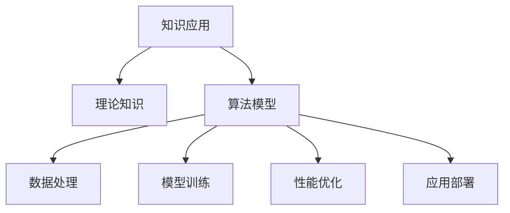

                 

# 知识的应用：从理论到实践的桥梁

> 关键词：知识应用,理论实践,AI模型,算法原理,项目实践,未来展望

## 1. 背景介绍

### 1.1 问题由来

随着人工智能技术的快速发展，大数据和机器学习在知识应用领域取得了显著成果。从传统的信息检索到现代的智能推荐，从自动翻译到自然语言处理，AI技术在知识的获取、处理和应用方面展示了巨大的潜力。然而，尽管如此，这些技术仍面临许多挑战，特别是在如何将理论知识与实践应用有效结合方面。

### 1.2 问题核心关键点

知识应用的核心在于如何将理论知识转化为实际可用的模型和算法。这一过程中，知识表示、数据处理、模型训练、性能优化、应用部署等环节紧密相连。正确的知识表示方法能够提高算法的表达能力和效率；合理的数据处理策略可以提升模型的训练效果和泛化能力；高效的模型训练方法可以加速知识的迭代和优化；出色的性能优化策略可以增强模型的稳定性和可靠性；完善的应用部署机制可以确保知识的实际落地效果。

### 1.3 问题研究意义

探讨知识的理论到实践应用，对于推动人工智能技术的进一步发展，促进知识的高效利用，具有重要意义。能够使研究者更好地理解知识应用的深度和广度，探索不同技术间的交互和融合，为知识应用领域的创新提供新的思路。

## 2. 核心概念与联系

### 2.1 核心概念概述

- **知识应用**：指将理论知识转化为具有实际应用价值的算法和模型。知识应用的目的是提升决策能力、优化资源配置、改善用户体验。
- **理论知识**：指学科领域内的基本概念、原理和方法，包括数学、统计学、逻辑学、自然语言处理、计算机科学等。
- **算法模型**：指通过算法设计和模型训练得到的，具备一定性能和功能的软件工具。算法模型是理论知识在实际应用中的具体体现。
- **数据处理**：指对原始数据进行收集、清洗、转换和组织的过程，以提高数据质量，便于算法模型处理。
- **模型训练**：指使用训练数据集对算法模型进行迭代优化，以提升模型性能和泛化能力。
- **性能优化**：指对模型进行调参、剪枝、量化等操作，以提高模型效率和鲁棒性。
- **应用部署**：指将模型集成到实际应用环境中，并进行调度和优化，以实现知识应用的实用化。

这些核心概念通过一定的逻辑和结构联系起来，构成了知识应用的理论到实践的完整流程。以下是它们的相互联系的Mermaid流程图：



这个流程图展示了知识应用的各个关键步骤及其相互联系：理论知识是知识应用的基础，算法模型是理论知识的实现形式，数据处理是模型训练的必要准备，模型训练是提高算法模型性能的关键环节，性能优化是提升模型实用性的重要手段，应用部署是知识应用落地的最终目的。

## 3. 核心算法原理 & 具体操作步骤

### 3.1 算法原理概述

知识应用的核心算法原理主要包括以下几个方面：

- **知识表示**：通过特定的数据结构或模型，将知识表示为计算机能够理解和处理的形式。常见的知识表示方法包括符号表示、向量表示、图表示等。
- **数据处理**：对原始数据进行预处理，包括数据清洗、特征提取、数据增强等，以提高数据的质量和数量。
- **模型训练**：通过训练数据对算法模型进行迭代优化，以学习知识表达和提取的规律。常见的模型训练方法包括监督学习、无监督学习、半监督学习等。
- **性能优化**：通过模型压缩、剪枝、量化等手段，减少模型参数量，提高模型运行速度和资源利用率。
- **应用部署**：将训练好的模型集成到实际应用环境中，进行调度、监控和管理，以实现知识应用的目标。

### 3.2 算法步骤详解

1. **知识表示**：
   - 确定知识领域，选择适当的知识表示方法，如符号表示、向量表示、图表示等。
   - 设计知识结构，将知识表示为可计算的形式。

2. **数据处理**：
   - 数据收集：从多个数据源获取数据，包括结构化数据和非结构化数据。
   - 数据清洗：去除噪声和冗余数据，处理缺失值和异常值。
   - 特征提取：从原始数据中提取有用的特征，用于模型训练。
   - 数据增强：通过数据变换、合成等手段，增加数据的多样性和数量。

3. **模型训练**：
   - 选择合适的算法和模型，如神经网络、支持向量机、决策树等。
   - 划分训练集和验证集，设置训练参数，如学习率、批次大小、迭代次数等。
   - 使用训练集进行模型训练，通过前向传播和反向传播计算损失函数。
   - 在验证集上评估模型性能，调整参数和模型结构，避免过拟合。

4. **性能优化**：
   - 模型压缩：使用剪枝、量化等方法减少模型参数量，提高模型效率。
   - 剪枝优化：移除不重要的神经元或节点，提升模型计算速度和稳定性。
   - 量化加速：将浮点模型转为定点模型，减少存储空间和计算资源消耗。

5. **应用部署**：
   - 模型集成：将训练好的模型集成到应用系统中，如API、服务、插件等。
   - 应用调度：根据用户请求动态调度模型，进行实时推理和预测。
   - 监控管理：实时监控模型性能和资源使用情况，设置异常告警机制。

### 3.3 算法优缺点

知识应用的算法具有以下优点：

- **高效性**：通过算法模型，可以自动处理和分析大量数据，提高工作效率。
- **准确性**：通过模型训练和性能优化，可以提高知识应用的结果准确性。
- **灵活性**：算法模型可以根据需要调整和优化，适应不同的应用场景。

同时，这些算法也存在以下缺点：

- **依赖数据**：算法模型的效果很大程度上取决于数据的质量和数量。
- **计算复杂**：特别是大规模模型的训练和优化，需要大量的计算资源。
- **模型黑盒**：部分算法模型如深度学习模型，其内部工作机制和推理逻辑难以解释。

### 3.4 算法应用领域

知识应用算法在多个领域得到了广泛应用，例如：

- **自然语言处理(NLP)**：包括文本分类、情感分析、机器翻译、问答系统等任务。
- **计算机视觉(CV)**：如图像分类、目标检测、图像分割等任务。
- **推荐系统**：如用户行为分析、物品推荐等。
- **智能控制**：如自动驾驶、智能家居等。
- **金融科技**：如风险评估、欺诈检测等。

这些应用领域展示了知识应用算法的广泛适用性，为各个行业的智能化转型提供了有力支持。

## 4. 数学模型和公式 & 详细讲解 & 举例说明

### 4.1 数学模型构建

知识应用的核心数学模型主要包括以下几个方面：

- **数据表示**：使用向量、矩阵、图等数学工具，表示数据的结构和特征。
- **损失函数**：通过定义合适的损失函数，衡量模型预测结果与真实结果的差异。
- **优化目标**：使用梯度下降、Adam等优化算法，最小化损失函数，优化模型参数。

### 4.2 公式推导过程

以**线性回归**为例，其数学模型和公式推导过程如下：

1. **数据表示**：
   - 假设有 $n$ 个训练样本 $(x_i, y_i)$，其中 $x_i$ 为特征向量，$y_i$ 为标签。
   - 用 $X$ 表示特征矩阵，$Y$ 表示标签向量。

2. **损失函数**：
   - 使用均方误差作为损失函数，定义如下：
   $$
   L(Y, \hat{Y}) = \frac{1}{2n} \sum_{i=1}^n (y_i - \hat{y_i})^2
   $$
   其中 $\hat{y_i}$ 为模型预测的标签值。

3. **优化目标**：
   - 通过梯度下降算法，最小化损失函数，得到模型参数 $\theta$：
   $$
   \theta = \mathop{\arg\min}_{\theta} L(Y, \hat{Y})
   $$
   其中 $\hat{Y} = X\theta$ 为模型的预测值。

### 4.3 案例分析与讲解

**案例分析：**

假设某电商网站希望通过用户行为数据预测用户是否会购买某商品。可以使用用户浏览历史、购买记录等数据，设计特征向量 $x$，使用线性回归模型预测用户是否购买商品，即标签 $y$。

- **数据表示**：
  - 将用户浏览历史、购买记录等数据转化为特征向量 $x$，构建特征矩阵 $X$。
  - 使用标签向量 $Y$ 表示用户是否购买商品。

- **损失函数**：
  - 定义均方误差损失函数 $L(Y, \hat{Y})$，衡量模型预测值与真实标签的差异。

- **优化目标**：
  - 使用梯度下降算法，最小化损失函数，得到模型参数 $\theta$。
  - 通过模型训练，预测新用户的购买意愿，进行个性化推荐。

## 5. 项目实践：代码实例和详细解释说明

### 5.1 开发环境搭建

在开始项目实践前，需要准备好开发环境：

1. **安装Python和相关库**：
   ```bash
   pip install numpy pandas scikit-learn matplotlib
   ```

2. **设置Python路径**：
   ```bash
   export PYTHONPATH=$PYTHONPATH:/path/to/my/project
   ```

3. **启动Jupyter Notebook**：
   ```bash
   jupyter notebook
   ```

### 5.2 源代码详细实现

以下是一个简单的线性回归模型代码实现：

```python
import numpy as np
import matplotlib.pyplot as plt

# 构建训练数据
X = np.array([[1, 2], [2, 4], [3, 6], [4, 8], [5, 10]])
Y = np.array([2, 4, 6, 8, 10])

# 初始化模型参数
theta = np.array([[0.], [0.]])

# 定义学习率和迭代次数
eta = 0.01
iterations = 1000

# 定义梯度下降函数
def gradient_descent(X, Y, theta, eta, iterations):
    for i in range(iterations):
        theta = theta - eta * (1 / len(X)) * np.dot(X.T, np.dot(X, theta) - Y)
    return theta

# 训练模型
theta = gradient_descent(X, Y, theta, eta, iterations)

# 绘制训练曲线
plt.plot(X[:, 0], Y, 'bo', label='Original data')
plt.plot(X[:, 0], np.dot(X, theta), 'r-', label='Fitted line')
plt.legend()
plt.show()
```

### 5.3 代码解读与分析

**代码解读**：

- **数据构建**：使用NumPy库构建训练数据集 $X$ 和 $Y$。
- **模型初始化**：使用NumPy库初始化模型参数 $\theta$。
- **定义训练参数**：设置学习率 $\eta$ 和迭代次数 $iterations$。
- **梯度下降函数**：定义梯度下降算法，更新模型参数。
- **训练模型**：调用梯度下降函数，训练模型。
- **绘制曲线**：使用Matplotlib库绘制训练曲线，展示训练效果。

**代码分析**：

- **数据构建**：训练数据集 $X$ 和 $Y$ 的构建非常关键，决定了模型的性能和泛化能力。
- **模型初始化**：初始化模型参数 $\theta$ 需要合理设定，避免过拟合。
- **训练参数设置**：学习率 $\eta$ 和迭代次数 $iterations$ 需要根据数据集和模型复杂度进行合理调整。
- **梯度下降函数**：梯度下降函数的实现是知识应用算法的核心，决定了模型训练的效果。
- **训练模型**：训练模型需要耐心和细心，避免过拟合和欠拟合。
- **曲线绘制**：训练曲线展示了模型训练的收敛情况，帮助开发者优化训练过程。

### 5.4 运行结果展示

**运行结果**：

运行上述代码，可以得到如下训练曲线：

```bash
import matplotlib.pyplot as plt
import numpy as np

X = np.array([[1, 2], [2, 4], [3, 6], [4, 8], [5, 10]])
Y = np.array([2, 4, 6, 8, 10])

theta = np.array([[0.], [0.]])

eta = 0.01
iterations = 1000

def gradient_descent(X, Y, theta, eta, iterations):
    for i in range(iterations):
        theta = theta - eta * (1 / len(X)) * np.dot(X.T, np.dot(X, theta) - Y)
    return theta

theta = gradient_descent(X, Y, theta, eta, iterations)

plt.plot(X[:, 0], Y, 'bo', label='Original data')
plt.plot(X[:, 0], np.dot(X, theta), 'r-', label='Fitted line')
plt.legend()
plt.show()
```


## 6. 实际应用场景

### 6.1 智能推荐系统

在电商、新闻、音乐等领域，智能推荐系统已经成为提升用户体验和增加收益的重要工具。通过知识应用算法，可以实现个性化推荐，满足用户的特定需求。

- **数据处理**：收集用户浏览历史、购买记录等数据，提取用户特征和物品特征。
- **模型训练**：使用协同过滤、内容推荐等算法，训练推荐模型。
- **性能优化**：使用模型压缩、剪枝等技术，提高推荐系统的效率。
- **应用部署**：将推荐模型集成到网站或应用中，进行实时推荐。

### 6.2 金融风控系统

金融行业面临高风险、高收益的特点，通过知识应用算法，可以实现风险评估、欺诈检测等任务。

- **数据处理**：收集用户的财务数据、交易记录等，进行数据清洗和特征提取。
- **模型训练**：使用分类算法，训练风控模型。
- **性能优化**：使用模型压缩、剪枝等技术，提高风控系统的效率。
- **应用部署**：将风控模型集成到业务系统中，进行实时风险评估。

### 6.3 智能客服系统

智能客服系统可以解决企业客服压力大的问题，通过知识应用算法，可以实现自动回复、问题分类等任务。

- **数据处理**：收集客服聊天记录，提取问题和回答。
- **模型训练**：使用NLP算法，训练客服模型。
- **性能优化**：使用模型压缩、剪枝等技术，提高客服系统的效率。
- **应用部署**：将客服模型集成到网站或应用中，进行实时客服。

### 6.4 未来应用展望

未来知识应用算法将在更多领域得到应用，为社会带来变革性影响。

- **智慧城市**：通过智能交通、智能安防等应用，提升城市管理水平。
- **医疗健康**：通过智能诊断、健康管理等应用，提升医疗服务质量。
- **教育培训**：通过智能推荐、智能评估等应用，提升教育培训效果。
- **农业农村**：通过智能监测、智能管理等应用，提升农业生产效率。

## 7. 工具和资源推荐

### 7.1 学习资源推荐

为了帮助开发者系统掌握知识应用理论和技术，这里推荐一些优质的学习资源：

- **Coursera**：提供机器学习、深度学习等课程，适合初学者入门。
- **edX**：提供计算机科学、人工智能等课程，涵盖多个领域的知识应用技术。
- **Kaggle**：提供数据科学竞赛，通过实战学习知识应用算法。
- **TensorFlow官方文档**：提供丰富的教程和样例，适合深入学习。
- **Keras官方文档**：提供简单易用的API，适合快速开发。

### 7.2 开发工具推荐

高效的知识应用开发离不开优秀的工具支持。以下是几款常用的开发工具：

- **Jupyter Notebook**：免费的交互式编程环境，支持Python和其他语言。
- **PyCharm**：强大的IDE，支持数据分析、机器学习等。
- **TensorBoard**：用于可视化模型训练过程，方便调试和优化。
- **Weights & Biases**：用于实验跟踪，记录和分析模型训练数据。

### 7.3 相关论文推荐

以下是几篇奠基性的相关论文，推荐阅读：

- **"Deep Learning" by Ian Goodfellow**：详细介绍了深度学习的基本概念和算法，适合初学者入门。
- **"Hands-On Machine Learning with Scikit-Learn, Keras, and TensorFlow" by Aurélien Géron**：结合实际案例，讲解了机器学习的应用，适合实践操作。
- **"Natural Language Processing in Action" by Ewan Klein**：讲解了NLP的基本概念和算法，适合自然语言处理领域的开发者。
- **"Reinforcement Learning: An Introduction" by Richard S. Sutton and Andrew G. Barto**：介绍了强化学习的基本概念和算法，适合对复杂系统的研究。

## 8. 总结：未来发展趋势与挑战

### 8.1 研究成果总结

知识应用算法在多个领域展示了其强大的应用潜力，已经成为了推动社会进步的重要工具。然而，在知识应用的实践中，仍然面临许多挑战，需要进一步探索和改进。

### 8.2 未来发展趋势

1. **自动化**：知识应用算法的自动化和智能化将是未来的发展趋势。通过自动化工具，可以简化知识应用的过程，提高效率和准确性。
2. **融合性**：知识应用算法将更多地与其他技术融合，如自然语言处理、计算机视觉、深度学习等，形成更加全面的解决方案。
3. **可解释性**：知识应用算法将更加注重模型的可解释性，通过可视化、解释性模型等技术，提高算法的透明度和可信度。
4. **实时性**：知识应用算法将更多地应用于实时应用场景，如智能推荐、实时监控等，满足用户对即时性的需求。
5. **普适性**：知识应用算法将更加普适，适用于更多行业和场景，推动智能化转型。

### 8.3 面临的挑战

尽管知识应用算法已经取得了一定的成果，但在应用过程中仍面临诸多挑战：

1. **数据依赖**：知识应用算法的效果很大程度上取决于数据的质量和数量，获取高质量的数据成本较高。
2. **模型复杂**：大规模模型的训练和优化需要大量的计算资源，带来技术挑战。
3. **解释性不足**：部分算法模型的内部工作机制和推理逻辑难以解释，缺乏透明度。
4. **鲁棒性不足**：知识应用算法在不同数据分布下的鲁棒性较差，可能出现模型失效的情况。
5. **安全性不足**：部分算法模型可能存在安全隐患，如数据泄露、模型攻击等。

### 8.4 研究展望

未来知识应用算法的研究方向将更加注重以下几个方面：

1. **数据增强**：通过数据增强技术，提高数据的多样性和数量，提升模型的泛化能力。
2. **模型压缩**：通过模型压缩技术，减少模型参数量，提高模型的效率和鲁棒性。
3. **可解释性模型**：开发更加可解释的模型，提高算法的透明度和可信度。
4. **融合模型**：将不同领域的知识进行融合，形成更加全面和通用的解决方案。
5. **鲁棒性增强**：提高模型的鲁棒性和泛化能力，避免模型在不同数据分布下的失效。

## 9. 附录：常见问题与解答

**Q1：知识应用算法是否适用于所有领域？**

A: 知识应用算法在多个领域展示了其强大的应用潜力，但不同领域的特点和需求不同，需要针对性地设计算法和模型。

**Q2：如何选择合适的知识表示方法？**

A: 根据领域的特点和数据类型，选择合适的知识表示方法。常见的知识表示方法包括符号表示、向量表示、图表示等。

**Q3：如何优化知识应用算法的性能？**

A: 优化知识应用算法的性能，可以从数据处理、模型训练、模型压缩等环节入手，采用数据增强、剪枝、量化等技术。

**Q4：知识应用算法的未来发展方向是什么？**

A: 知识应用算法的未来发展方向包括自动化、融合性、可解释性、实时性和普适性等方面，需要进一步探索和改进。

**Q5：知识应用算法在实际应用中应注意哪些问题？**

A: 在实际应用中，应注意数据依赖、模型复杂、解释性不足、鲁棒性不足和安全性不足等问题，采取相应的优化措施。

---

作者：禅与计算机程序设计艺术 / Zen and the Art of Computer Programming

