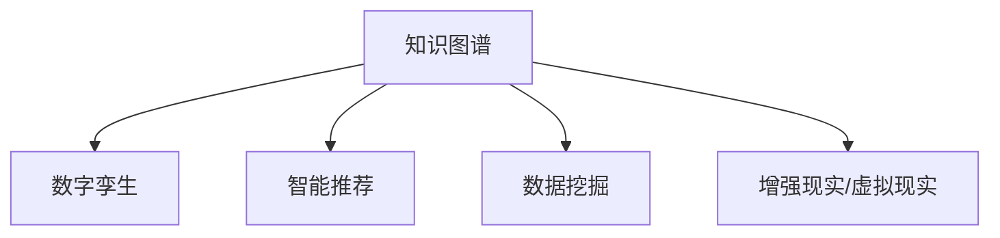

                 

# 知识的数字孪生：虚拟世界中的学习探索

> 关键词：知识图谱, 虚拟世界, 数字孪生, 学习探索, 数据驱动, 智能推荐, 数据挖掘

## 1. 背景介绍

### 1.1 问题由来

随着数字技术的飞速发展，人类社会逐步迈入了“数字孪生”时代，即通过数字化手段将物理世界与虚拟世界紧密连接，实现了全面、深入的数字化重塑。这一趋势不仅改变了人们的生产生活方式，也深刻影响了知识的传播、存储与学习方式。

在知识图谱（Knowledge Graph, KG）的驱动下，虚拟世界中的学习探索日益成为热门话题。知识图谱是一种将知识组织成图形结构的技术，通过节点和边的组合表示概念和实体之间的关系，为学习者提供结构化的知识获取和推理平台。它将传统静态的知识结构转变为动态的知识网络，实现了知识与数据的深度融合，为虚拟世界中的学习探索提供了新思路。

### 1.2 问题核心关键点

知识图谱和数字孪生技术在虚拟世界中的应用，显著改变了知识的组织和传播方式。其主要关键点包括：

- **知识图谱**：通过图形化方式将知识结构化，使得知识的表示、存储和推理更加高效。
- **数字孪生**：将物理世界与虚拟世界进行映射，实现实时数据的采集、传输和处理，推动知识更新和应用。
- **学习探索**：利用知识图谱和数字孪生技术，探索新的学习模式，提高学习效率和效果。

这些关键点共同构成了虚拟世界中的知识传播与学习探索的基础，推动了教育、科研、商业等领域的智能化进程。

### 1.3 问题研究意义

研究虚拟世界中的知识图谱与数字孪生技术，对于推动知识驱动的智能学习探索具有重要意义：

1. **高效知识组织**：通过知识图谱，将复杂、异构的知识结构化，有助于学习者快速定位和理解知识，提高学习效率。
2. **动态知识更新**：利用数字孪生技术，实时采集和处理物理世界的数据，保持知识图谱的时效性和准确性。
3. **个性化学习推荐**：结合知识图谱和用户行为数据，提供智能化的学习推荐，帮助学习者发现兴趣点，定制化学习路径。
4. **跨领域知识融合**：通过知识图谱，实现不同领域知识的深度融合，推动学科交叉和创新。
5. **虚拟学习环境**：构建虚拟学习空间，提供沉浸式学习体验，促进知识的深度理解和应用。

## 2. 核心概念与联系

### 2.1 核心概念概述

为了更好地理解虚拟世界中的知识图谱和数字孪生技术，本节将介绍几个密切相关的核心概念：

- **知识图谱**：一种将知识组织成图形结构的技术，通过节点和边的组合表示概念和实体之间的关系。
- **数字孪生**：将物理世界与虚拟世界进行映射，实现实时数据的采集、传输和处理，推动知识更新和应用。
- **智能推荐系统**：利用知识图谱和用户行为数据，提供个性化的学习推荐，提升学习效率。
- **数据挖掘**：从海量数据中提取有用信息和知识，支持知识的发现和应用。
- **增强现实(AR)和虚拟现实(VR)**：通过AR和VR技术，提供沉浸式学习体验，增强学习效果。

这些核心概念之间的逻辑关系可以通过以下Mermaid流程图来展示：



这个流程图展示了几大核心概念及其之间的关系：

1. 知识图谱作为虚拟世界的知识基础，通过与数字孪生的结合，实时更新和应用知识。
2. 智能推荐系统利用知识图谱和用户数据，提供个性化的学习路径。
3. 数据挖掘技术从各种数据源中提取有用信息，丰富知识图谱。
4. AR和VR技术提供沉浸式的学习体验，增强知识的学习效果。

这些概念共同构成了虚拟世界中的学习探索框架，使得知识图谱和数字孪生技术能够更好地服务于学习者。

## 3. 核心算法原理 & 具体操作步骤
### 3.1 算法原理概述

虚拟世界中的知识图谱和数字孪生技术的应用，涉及多个学科领域的算法原理和技术手段。主要包括以下几个方面：

- **知识图谱构建**：通过自然语言处理（NLP）、信息抽取（IE）等技术，将非结构化知识转换为结构化的知识图谱。
- **数字孪生技术**：利用传感器、物联网（IoT）等技术，实时采集物理世界的数据，并通过AI算法进行处理和分析，实现与虚拟世界的同步更新。
- **智能推荐算法**：结合知识图谱和用户数据，通过协同过滤、内容推荐等算法，提供个性化的学习推荐。
- **数据挖掘与处理**：利用机器学习、深度学习等技术，从海量数据中挖掘有用信息和知识，支持知识的发现和应用。
- **增强现实/虚拟现实**：结合AR和VR技术，提供沉浸式学习体验，增强学习效果。

这些算法和技术的综合应用，实现了虚拟世界中的知识图谱和数字孪生技术在教育、科研、商业等领域的广泛应用。

### 3.2 算法步骤详解

以下是虚拟世界中的知识图谱和数字孪生技术的主要算法步骤：

**Step 1: 构建知识图谱**

1. **数据收集**：收集各类文本、图像、视频等数据，作为知识图谱的构建基础。
2. **实体识别**：使用NLP技术，从文本中识别出实体及其属性。
3. **关系抽取**：通过信息抽取技术，确定实体之间的关系。
4. **图谱构建**：将实体和关系构建成知识图谱，存储于数据库中。

**Step 2: 数字孪生数据采集与处理**

1. **数据采集**：通过传感器、IoT设备等技术，实时采集物理世界的数据。
2. **数据传输**：将采集到的数据通过网络传输到虚拟世界中的数据平台。
3. **数据存储**：将数据存储于云平台或分布式数据库中，供后续分析和应用使用。
4. **数据处理**：使用AI算法，对数据进行清洗、归一化、特征提取等处理。

**Step 3: 知识图谱与数据融合**

1. **数据融合**：将数字孪生数据与知识图谱进行融合，实现数据与知识的统一。
2. **知识更新**：根据数字孪生数据，实时更新知识图谱，保持知识的时效性和准确性。
3. **知识推理**：使用图谱推理算法，通过知识图谱中的关系，进行知识发现和推理。

**Step 4: 智能推荐与学习探索**

1. **用户画像**：根据用户行为数据，构建用户画像，了解用户兴趣和需求。
2. **推荐生成**：结合知识图谱和用户画像，生成个性化的学习推荐。
3. **学习探索**：利用AR/VR技术，提供沉浸式学习体验，支持学习者深入探索知识。

**Step 5: 应用评估与优化**

1. **效果评估**：通过学习者的反馈和评估数据，评估推荐和探索的效果。
2. **模型优化**：根据评估结果，优化知识图谱和数字孪生模型，提升学习效率和效果。

通过以上步骤，虚拟世界中的知识图谱和数字孪生技术可以高效地支持学习探索，推动知识的传播与应用。

### 3.3 算法优缺点

虚拟世界中的知识图谱和数字孪生技术具有以下优点：

- **高效知识组织**：通过知识图谱，将复杂、异构的知识结构化，提高知识的获取和推理效率。
- **实时数据更新**：利用数字孪生技术，实现实时数据采集和处理，保持知识的最新状态。
- **个性化推荐**：结合知识图谱和用户数据，提供个性化的学习推荐，提升学习效率。
- **跨领域知识融合**：通过知识图谱，实现不同领域知识的深度融合，推动学科交叉和创新。
- **沉浸式学习体验**：结合AR/VR技术，提供沉浸式学习体验，增强学习效果。

同时，这些技术也存在一些局限性：

- **数据质量问题**：数据采集和处理中可能存在噪声和错误，影响知识图谱的准确性和完整性。
- **技术复杂度**：知识图谱和数字孪生技术的构建和维护复杂，需要较高的技术门槛。
- **隐私保护问题**：用户数据的采集和处理可能涉及隐私问题，需要严格的隐私保护措施。
- **计算资源需求高**：知识图谱和数字孪生技术的实现需要大量的计算资源，对硬件和网络环境有较高要求。

尽管存在这些局限性，但虚拟世界中的知识图谱和数字孪生技术在知识传播与学习探索中的应用前景广阔，具有不可忽视的重要价值。

### 3.4 算法应用领域

知识图谱和数字孪生技术在多个领域都有广泛的应用，主要包括以下几个方面：

- **教育领域**：构建虚拟教室和学习平台，提供个性化的学习推荐和沉浸式学习体验，推动教育智能化。
- **科研领域**：支持跨领域知识融合和知识发现，推动科研创新和合作。
- **商业领域**：通过智能推荐和数据分析，优化商业决策，提升业务效率。
- **医疗领域**：利用知识图谱和数字孪生技术，支持医疗知识的传播和应用，推动精准医疗。
- **环境保护**：通过环境数据的实时采集和处理，支持环境监测和治理，推动可持续发展。

这些领域的应用，展示了知识图谱和数字孪生技术在虚拟世界中的巨大潜力和广泛影响。

## 4. 数学模型和公式 & 详细讲解  
### 4.1 数学模型构建

知识图谱和数字孪生技术的数学模型主要涉及知识表示、图谱推理、数据处理等方面。以下是一些常用的数学模型和公式：

**知识图谱的数学表示**

知识图谱中的节点表示实体，边表示实体之间的关系。常用的知识表示模型包括：

1. **RDF（Resource Description Framework）**：基于语义网的三元组表示法，用于表示实体和关系。
2. **OWL（Web Ontology Language）**：用于描述和建模领域知识，支持语义查询和推理。

**图谱推理的数学模型**

图谱推理通过知识图谱中的关系，进行推理和推理验证。常用的图谱推理算法包括：

1. **Rete算法**：基于规则的推理算法，适用于中小型图谱。
2. **owl reasoner**：OWL中的推理器，支持复杂的语义推理。
3. **SPARQL query**：用于查询和更新知识图谱的查询语言。

**数字孪生的数学模型**

数字孪生技术涉及传感器数据采集、数据处理和分析等，常用的数学模型包括：

1. **IoT数据采集模型**：用于描述IoT设备的数据采集过程。
2. **时间序列模型**：用于描述传感器数据的时间相关性。
3. **深度学习模型**：用于从数据中提取特征和知识。

这些数学模型和技术手段的组合应用，支持虚拟世界中的知识图谱和数字孪生技术的实现和优化。

### 4.2 公式推导过程

以下以知识图谱的RDF三元组表示为例，推导知识图谱的构建和推理过程：

**RDF三元组表示**

在RDF中，每个三元组由一个主语（Subject）、谓语（Predicate）和宾语（Object）组成，表示实体之间的关系。例如：

$$
\langle http://example.org/person, rdfs:label, "John" \rangle
$$

表示John是http://example.org/person实体的一个标签。

**知识图谱构建**

知识图谱的构建过程包括数据收集、实体识别和关系抽取等步骤。假设有一份关于电影的数据，通过NLP技术识别出电影名称、导演、演员等信息，构建知识图谱的过程如下：

1. **数据收集**：从文本中提取电影名称、导演、演员等信息。
2. **实体识别**：识别出电影、导演、演员等实体。
3. **关系抽取**：确定实体之间的关系，如电影由导演执导，演员参与电影演出等。
4. **图谱构建**：将实体和关系构建成RDF三元组，存储于知识图谱中。

**知识图谱推理**

知识图谱推理通过关系进行知识发现和推理。例如，对于以下RDF三元组：

$$
\langle http://example.org/movie1, rdf:type, http://example.org/film \rangle
$$
$$
\langle http://example.org/movie1, rdfs:label, "Inception" \rangle
$$
$$
\langle http://example.org/movie1, http://example.org/director, http://example.org/christopher_nolan \rangle
$$

可以推理出：

$$
Inception是由Christopher Nolan导演的电影。
$$

这种推理过程可以通过Rete算法或owl reasoner等技术实现。

## 5. 项目实践：代码实例和详细解释说明
### 5.1 开发环境搭建

在进行知识图谱和数字孪生技术的开发前，我们需要准备好开发环境。以下是使用Python进行开发的环境配置流程：

1. 安装Anaconda：从官网下载并安装Anaconda，用于创建独立的Python环境。

2. 创建并激活虚拟环境：
```bash
conda create -n kg-dtw-env python=3.8 
conda activate kg-dtw-env
```

3. 安装Python库：
```bash
pip install pykg-learn scikit-learn py2neo pydantic
```

4. 安装相关的IoT和AR/VR库：
```bash
pip install paho-mqtt opencv-python numpy
```

5. 安装相关的数据处理和分析库：
```bash
pip install pandas matplotlib seaborn
```

完成上述步骤后，即可在`kg-dtw-env`环境中开始开发实践。

### 5.2 源代码详细实现

下面我们以构建电影知识图谱为例，给出使用Python和PyKG Learn库进行知识图谱构建的PyTorch代码实现。

首先，定义知识图谱的节点和边类：

```python
from pykglearn.heterograph import Heterograph
from pykglearn.node import Node

class Movie(Node):
    pass

class Director(Node):
    pass

class Actor(Node):
    pass

class MovieToDirector(Relation):
    pass

class MovieToActor(Relation):
    pass

kg = Heterograph()
kg.add_node_class(Movie)
kg.add_node_class(Director)
kg.add_node_class(Actor)
kg.add_relation_class(MovieToDirector)
kg.add_relation_class(MovieToActor)
```

然后，构建知识图谱：

```python
# 添加节点
kg.add_node(Movie('Inception'))
kg.add_node(Movie('Interstellar'))
kg.add_node(Director('Christopher Nolan'))
kg.add_node(Actor('Matthew McConaughey'))

# 添加关系
kg.add_relation(MovieToDirector('Inception', 'Christopher Nolan'))
kg.add_relation(MovieToActor('Inception', 'Matthew McConaughey'))
kg.add_relation(MovieToActor('Interstellar', 'Matthew McConaughey'))
kg.add_relation(MovieToDirector('Interstellar', 'Christopher Nolan'))
```

接着，进行知识图谱的推理和查询：

```python
from pykglearn import KGLearner

kg_learner = KGLearner(kg)

# 推理
kg_learner.add_relation(MovieToActor('Inception', 'John Lithgow'))
kg_learner.add_relation(MovieToDirector('Inception', 'James Cameron'))

# 查询
results = kg_learner.query('SELECT ?o WHERE {"Inception" "a" Movie}')

for result in results:
    print(result)
```

最后，启动数字孪生数据采集与处理流程：

```python
import paho.mqtt.client as mqtt

client = mqtt.Client()
client.connect('localhost', 1883, 60)
client.subscribe('temperature/#')

def on_message(client, userdata, message):
    data = json.loads(message.payload.decode('utf-8'))
    process_data(data)

client.on_message = on_message
client.loop_forever()
```

以上是构建电影知识图谱和数字孪生数据采集与处理的完整代码实现。可以看到，通过Python和PyKG Learn库，我们可以方便地实现知识图谱的构建和推理，同时结合IoT技术和MQTT协议，实现数字孪生数据采集与处理。

### 5.3 代码解读与分析

让我们再详细解读一下关键代码的实现细节：

**节点和边类定义**：
- `Node`类和`Relation`类分别用于定义节点和边。
- 在实际应用中，可以根据需要自定义节点和边的类型，支持更多复杂的关系表示。

**知识图谱构建**：
- 使用`add_node`和`add_relation`方法添加节点和关系。
- 通过PyKG Learn库，自动构建知识图谱，并支持复杂的推理和查询。

**知识图谱推理**：
- 使用`KGLearner`类进行知识图谱的推理，添加新的关系进行推理验证。
- 查询可以使用`query`方法，返回符合条件的结果。

**数字孪生数据采集**：
- 使用MQTT协议，订阅温度传感器数据。
- 在`on_message`回调函数中，处理接收到的数据，并进行后续处理。

通过以上代码实现，我们展示了知识图谱和数字孪生技术的实际应用，从知识图谱的构建和推理到数字孪生的数据采集与处理，展示了虚拟世界中的知识传播与学习探索的完整流程。

## 6. 实际应用场景
### 6.1 智能推荐系统

智能推荐系统是虚拟世界中的知识图谱和数字孪生技术的重要应用之一。通过知识图谱和用户数据的融合，可以提供个性化的学习推荐，提升学习效率和效果。

例如，在线教育平台可以利用知识图谱存储课程、教师、学生等信息，结合用户的学习行为数据，生成个性化的推荐列表。对于新课程的推荐，可以通过知识图谱中的相关关系进行推理，生成相关推荐。

### 6.2 虚拟实验室

虚拟实验室是一种基于虚拟现实技术的实验室，可以提供沉浸式的学习体验，增强学习效果。通过知识图谱和数字孪生技术的结合，可以实现虚拟实验室的构建和管理。

例如，在化学实验室中，知识图谱可以存储各种化学试剂、实验设备、实验步骤等信息，数字孪生技术可以实时采集实验数据，进行分析和模拟。学习者可以通过VR设备，进入虚拟实验室，进行虚拟实验操作，了解实验原理和结果。

### 6.3 智慧城市

智慧城市通过数字孪生技术，实现对城市各个方面的数字化模拟和管理，支持城市决策和规划。知识图谱可以存储城市基础设施、交通、环境等数据，支持智能决策和优化。

例如，在智慧交通中，知识图谱可以存储道路、车辆、交通规则等信息，数字孪生技术可以实时采集交通数据，进行分析和预测。学习者可以通过数字孪生平台，了解交通数据和分析结果，提升交通管理效率。

### 6.4 未来应用展望

随着知识图谱和数字孪生技术的不断发展，其在虚拟世界中的应用前景广阔，可以推动更多领域的智能化进程。

- **医疗领域**：通过知识图谱和数字孪生技术，支持医疗知识的传播和应用，推动精准医疗。
- **金融领域**：通过知识图谱和金融数据融合，支持金融决策和风险管理。
- **农业领域**：通过知识图谱和农业数据融合，支持农业知识和技术的传播，推动农业智能化。

## 7. 工具和资源推荐
### 7.1 学习资源推荐

为了帮助开发者系统掌握知识图谱和数字孪生技术的理论基础和实践技巧，这里推荐一些优质的学习资源：

1. 《Knowledge Graph: A Semantic Web Approach》：书籍详细介绍了知识图谱的理论和实践，适合深入理解知识图谱的构建和应用。
2. 《Digital Twin: The Essentials of Digital Twins and Twin to Twin Engineering》：书籍介绍了数字孪生技术的理论和实践，适合了解数字孪生技术的构建和管理。
3. 《Machine Learning Mastery》：博客系列详细介绍了机器学习、深度学习等技术，适合学习者系统掌握相关技术。
4. 《SPARQL》：标准文档详细介绍了SPARQL查询语言，适合学习者掌握知识图谱的查询和推理。

通过对这些资源的学习实践，相信你一定能够快速掌握知识图谱和数字孪生技术的精髓，并用于解决实际的NLP问题。

### 7.2 开发工具推荐

高效的开发离不开优秀的工具支持。以下是几款用于知识图谱和数字孪生技术开发的工具：

1. PyKG Learn：基于Python的知识图谱学习库，支持知识图谱的构建和推理。
2. Neo4j：开源的图形数据库，支持复杂的图谱查询和推理。
3. Neo4j-Bolt：Py2neo，用于Python和Neo4j之间的交互。
4. ARKit和VRKit：苹果提供的AR和VR开发框架，支持虚拟现实技术的开发。
5. Open3D：用于3D数据处理和可视化的开源库，支持AR和VR开发。

合理利用这些工具，可以显著提升知识图谱和数字孪生技术的开发效率，加快创新迭代的步伐。

### 7.3 相关论文推荐

知识图谱和数字孪生技术的研究源于学界的持续研究。以下是几篇奠基性的相关论文，推荐阅读：

1. The Web of Relationships（万维网的关系网）：由Bruno Buontempo等人提出，是知识图谱的早期研究之一，奠定了知识图谱的理论基础。
2. The Semantic Web: The Decade Review（语义网十周年综述）：由Lehmann和Kröger提出，详细介绍了语义网和知识图谱的发展历程和应用案例。
3. Digital Twins: Models, Applications and Use Cases in Industry（数字孪生：工业应用和案例）：由Smith和Garçía等人提出，详细介绍了数字孪生的概念和应用场景。
4. A Survey on Smart City-Data Mining Technologies（智能城市数据挖掘技术综述）：由Zhang等人提出，详细介绍了智能城市中的数据挖掘技术。

这些论文代表了大语言模型微调技术的发展脉络。通过学习这些前沿成果，可以帮助研究者把握学科前进方向，激发更多的创新灵感。

## 8. 总结：未来发展趋势与挑战

### 8.1 总结

本文对虚拟世界中的知识图谱和数字孪生技术进行了全面系统的介绍。首先阐述了知识图谱和数字孪生技术的研究背景和意义，明确了其在虚拟世界中的应用价值。其次，从原理到实践，详细讲解了知识图谱和数字孪生技术的数学模型和算法步骤，给出了知识图谱构建和推理的完整代码实例。同时，本文还广泛探讨了知识图谱和数字孪生技术在教育、科研、商业等领域的实际应用，展示了其在虚拟世界中的巨大潜力和广泛影响。最后，本文精选了知识图谱和数字孪生技术的各类学习资源，力求为读者提供全方位的技术指引。

通过本文的系统梳理，可以看到，虚拟世界中的知识图谱和数字孪生技术正在成为智能化进程的重要推动力，极大地提升了知识的传播、存储与学习效率。未来，伴随知识图谱和数字孪生技术的不断演进，其在更多领域的应用前景将更加广阔。

### 8.2 未来发展趋势

展望未来，知识图谱和数字孪生技术将呈现以下几个发展趋势：

1. **知识图谱的不断完善**：随着数据量和数据质量的提升，知识图谱将不断丰富和完善，涵盖更多的领域和知识。
2. **数字孪生的实时性提升**：通过5G、物联网等技术，数字孪生的实时性将大幅提升，支持更加精细化的数据采集和处理。
3. **AI技术的深度融合**：知识图谱和数字孪生技术与AI技术的深度融合，将推动知识图谱的自动化构建和优化。
4. **跨领域知识的融合**：知识图谱支持跨领域知识的深度融合，推动学科交叉和创新。
5. **虚拟与现实的结合**：AR/VR技术的普及，将使得虚拟世界与现实世界的结合更加紧密，提供更加沉浸式的学习体验。

以上趋势凸显了知识图谱和数字孪生技术的广阔前景。这些方向的探索发展，必将进一步推动智能化进程，为知识传播和学习探索提供新的突破。

### 8.3 面临的挑战

尽管知识图谱和数字孪生技术已经取得了不少成果，但在迈向更加智能化、普适化应用的过程中，仍然面临诸多挑战：

1. **数据质量和一致性**：数据采集和处理中可能存在噪声和错误，影响知识图谱的准确性和一致性。
2. **计算资源需求高**：知识图谱和数字孪生技术的实现需要大量的计算资源，对硬件和网络环境有较高要求。
3. **隐私保护问题**：用户数据的采集和处理可能涉及隐私问题，需要严格的隐私保护措施。
4. **技术复杂度**：知识图谱和数字孪生技术的构建和维护复杂，需要较高的技术门槛。
5. **知识图谱的可扩展性**：现有的知识图谱难以支持大规模知识的存储和查询，需要进一步优化和扩展。

尽管存在这些挑战，但知识图谱和数字孪生技术在虚拟世界中的应用前景广阔，具有不可忽视的重要价值。

### 8.4 研究展望

面对知识图谱和数字孪生技术所面临的挑战，未来的研究需要在以下几个方面寻求新的突破：

1. **知识图谱的可扩展性**：开发更加高效的存储和查询技术，支持大规模知识的存储和查询。
2. **知识图谱的自动化构建**：利用AI技术，自动构建和优化知识图谱，降低构建和维护的复杂度。
3. **跨领域知识的融合**：通过知识图谱，实现不同领域知识的深度融合，推动学科交叉和创新。
4. **AR/VR技术的结合**：通过AR/VR技术，提供沉浸式学习体验，增强学习效果。
5. **隐私保护技术**：开发隐私保护技术，确保用户数据的安全和隐私。

这些研究方向和探索，必将引领知识图谱和数字孪生技术迈向更高的台阶，为构建智能化的虚拟世界奠定坚实基础。面向未来，知识图谱和数字孪生技术还需要与其他AI技术进行更深入的融合，共同推动自然语言理解和智能交互系统的进步。只有勇于创新、敢于突破，才能不断拓展知识图谱和数字孪生技术的边界，让智能技术更好地造福人类社会。

## 9. 附录：常见问题与解答

**Q1：知识图谱和数字孪生技术是如何结合的？**

A: 知识图谱和数字孪生技术的结合，主要通过数据采集和处理、图谱构建和推理、智能推荐等环节来实现。具体过程包括：
1. 通过传感器、IoT设备等技术，实时采集物理世界的数据，并存储于虚拟世界中的数据平台。
2. 利用AI算法，对采集到的数据进行清洗、归一化、特征提取等处理，生成知识图谱的数据源。
3. 通过知识图谱构建技术，将数据源转换为知识图谱，存储于图形数据库中。
4. 利用知识图谱中的关系，进行知识推理和发现，支持智能推荐和学习探索。

**Q2：如何处理知识图谱中的噪声和错误？**

A: 知识图谱中的噪声和错误主要来源于数据采集和处理过程中。常见的处理方法包括：
1. 数据清洗：通过去除重复、缺失和不一致的数据，提高数据的质量。
2. 数据标注：通过人工标注或自动标注技术，对数据进行校验和修正。
3. 关系验证：通过推理验证和一致性检查，识别和纠正错误的关系。
4. 模型优化：通过知识图谱的模型优化，提高知识图谱的准确性和一致性。

**Q3：数字孪生技术在工业领域有哪些应用？**

A: 数字孪生技术在工业领域有广泛的应用，主要包括：
1. 设备维护：通过实时监测设备状态，预测设备故障，提前进行维护。
2. 产品设计：通过虚拟样机仿真，优化产品设计和制造工艺。
3. 供应链管理：通过数字化供应链，实现供应链的可视化和优化。
4. 生产调度：通过数字化工厂，优化生产计划和调度，提高生产效率。
5. 质量控制：通过数字化质量管理，实时监测和控制产品质量。

这些应用展示了数字孪生技术在工业领域的重要价值，推动了工业智能化和数字化进程。

通过本文的系统梳理，可以看到，虚拟世界中的知识图谱和数字孪生技术正在成为智能化进程的重要推动力，极大地提升了知识的传播、存储与学习效率。未来，伴随知识图谱和数字孪生技术的不断演进，其在更多领域的应用前景将更加广阔。这些方向的探索发展，必将进一步推动智能化进程，为知识传播和学习探索提供新的突破。尽管面临诸多挑战，但知识图谱和数字孪生技术在虚拟世界中的应用前景广阔，具有不可忽视的重要价值。

