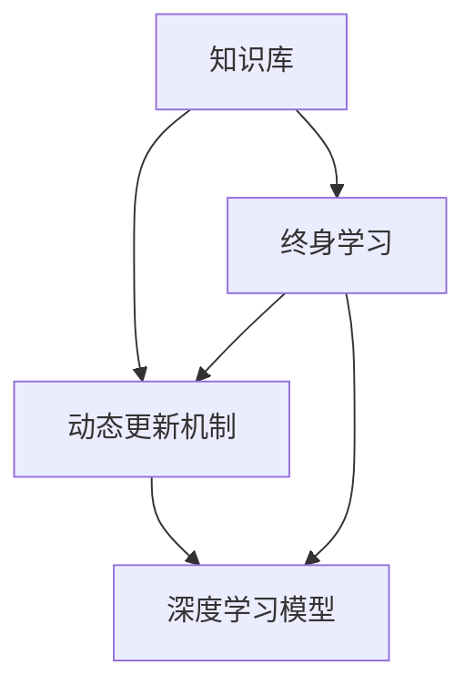

                 

# 知识的时效性：动态更新机制与终身学习

## 1. 背景介绍

### 1.1 问题由来
在快速发展的知识领域中，知识的更新速度日益加快，终身学习的理念逐渐成为推动个体和组织不断进步的关键。然而，传统的教育和培训体系往往难以跟上知识更新的节奏，导致了知识的时效性问题。现代计算机科学中的动态更新机制和终身学习技术，为应对知识时效性提供了新的解决方案。

### 1.2 问题核心关键点
- 知识的时效性：随着时间推移，知识的旧有部分可能被淘汰，新的知识不断涌现，需要动态更新机制来保持知识的持续性和相关性。
- 终身学习：个体和系统需要具备持续学习的能力，适应不断变化的环境和需求。
- 动态更新机制：通过机制设计，让知识库和系统能够持续地进行自我更新和优化。
- 深度学习：深度学习模型能够在大量数据上进行学习和调整，具备良好的适应性和泛化能力。

这些关键点构成了动态更新机制和终身学习研究的基础，旨在帮助个体和组织保持知识和技能的竞争力。

### 1.3 问题研究意义
研究动态更新机制和终身学习，对于提升个人和组织的学习效率、适应能力、创新能力和竞争力具有重要意义：

1. **提升学习效率**：通过动态更新机制，可以快速吸收和应用新知识，减少知识的学习和应用时间。
2. **增强适应能力**：终身学习能够让个体和组织适应不断变化的环境和技术，保持竞争力。
3. **促进创新能力**：新知识的不断吸收和应用，有助于个体和组织产生新的想法和解决方案。
4. **增强竞争力**：适应新知识的能力，可以帮助企业在市场竞争中保持优势。
5. **支持快速响应**：在动态变化的环境中，能够快速响应的学习系统能够更好地适应新的需求。

## 2. 核心概念与联系

### 2.1 核心概念概述

为更好地理解动态更新机制和终身学习的原理与技术，本节将介绍几个密切相关的核心概念：

- **知识库(Knowledge Base)**：包含经过整理和分类的知识集合，用于存储和检索知识。
- **动态更新机制(Dynamic Update Mechanism)**：一种能够自动监测、评估和更新知识库的机制，以保持知识的时效性。
- **终身学习(Lifelong Learning)**：一种持续的学习过程，个体和系统不断更新知识，以适应新的环境和技术。
- **深度学习模型(Deep Learning Model)**：一种能够通过大量数据进行学习和优化的模型，具有强大的模式识别和预测能力。

这些概念之间的逻辑关系可以通过以下Mermaid流程图来展示：



这个流程图展示了知识库、动态更新机制、终身学习和深度学习模型之间的联系：

1. **知识库**：是存储和检索知识的基础设施。
2. **动态更新机制**：通过监测和评估，使知识库能够保持时效性。
3. **终身学习**：个体和系统通过动态更新机制，不断吸收新知识，适应新的环境和技术。
4. **深度学习模型**：通过大量数据的学习和优化，能够适应和预测新的知识趋势。

这些核心概念共同构成了动态更新机制和终身学习的学习框架，使个体和系统能够持续学习，适应不断变化的知识环境。

## 3. 核心算法原理 & 具体操作步骤
### 3.1 算法原理概述

动态更新机制和终身学习的核心算法原理是监督学习和强化学习（Reinforcement Learning, RL）的结合。其核心思想是：通过监督学习不断监测和评估知识库的准确性和时效性，利用强化学习优化动态更新策略，以确保知识库始终保持最新和最相关的状态。

具体来说，算法会通过以下步骤实现：

1. **数据收集**：从多个数据源收集知识和相关的评价数据。
2. **监督学习评估**：使用监督学习方法对知识库的准确性和时效性进行评估。
3. **强化学习优化**：通过强化学习算法优化动态更新策略，确保知识库能够适应新的数据和需求。
4. **知识更新**：根据优化后的策略，更新知识库，以适应最新的知识和需求。

### 3.2 算法步骤详解

以下是动态更新机制和终身学习的详细步骤：

**Step 1: 数据收集**
- 收集知识库中的所有知识数据。
- 收集相关的评价数据，如用户反馈、文献引用等。

**Step 2: 监督学习评估**
- 使用监督学习方法（如分类、回归等）对知识库的准确性和时效性进行评估。
- 通过计算评价指标（如精度、召回率、更新频率等），判断知识库的状态。

**Step 3: 强化学习优化**
- 定义奖励函数，衡量知识库更新的效果。
- 设计状态和动作空间，确定知识库更新策略。
- 使用强化学习算法（如Q-learning、SARSA等）优化更新策略，最大化长期奖励。

**Step 4: 知识更新**
- 根据优化后的更新策略，执行知识库的更新操作。
- 更新知识库中的知识数据和相关评价数据。

**Step 5: 反馈与迭代**
- 根据新的评价数据和更新后的知识库，重新进行监督学习评估和强化学习优化。
- 不断迭代，保持知识库的时效性和相关性。

### 3.3 算法优缺点

动态更新机制和终身学习算法具有以下优点：
1. **自动更新**：能够自动监测和评估知识库，无需人工干预。
2. **高效优化**：通过强化学习优化更新策略，提升更新效率。
3. **持续学习**：终身学习机制确保个体和系统不断吸收新知识，保持竞争力。
4. **灵活性**：能够适应不同领域和数据类型的知识更新需求。

同时，该算法也存在以下局限性：
1. **数据依赖**：需要大量高质量的数据进行评估和优化。
2. **计算成本**：监督学习和强化学习的计算复杂度较高，需要高性能计算资源。
3. **模型复杂度**：深度学习模型需要大量参数和计算资源，模型构建和训练复杂。
4. **过度优化风险**：强化学习可能导致模型过度优化，忽略知识库的整体质量和时效性。
5. **更新风险**：错误的更新可能导致知识库中的关键信息丢失。

尽管存在这些局限性，但就目前而言，动态更新机制和终身学习算法是保持知识时效性的重要方法。未来相关研究的重点在于如何进一步降低计算成本，提高模型泛化能力，同时兼顾模型复杂度和更新风险。

### 3.4 算法应用领域

动态更新机制和终身学习算法已经在多个领域得到了应用，例如：

- **医疗领域**：知识库用于存储医学知识和文献，通过动态更新保持最新的治疗方案和研究成果。
- **金融领域**：知识库用于存储金融市场数据和分析模型，通过动态更新适应市场变化。
- **教育领域**：知识库用于存储教育资源和教学方法，通过动态更新提供最新的教育内容和教学工具。
- **智能制造**：知识库用于存储生产工艺和设备维护知识，通过动态更新保持生产流程的优化和设备运行状态的监控。
- **智能客服**：知识库用于存储常见问题和解决方案，通过动态更新提升服务质量和用户体验。

除了上述这些经典应用外，动态更新机制和终身学习技术还在更多场景中得到了创新性的应用，如自动驾驶、机器人技术、智能家居等，为这些领域带来了新的突破。随着技术的不断发展，相信动态更新机制和终身学习将会在更广泛的领域发挥作用，推动智能化技术的进步。

## 4. 数学模型和公式 & 详细讲解
### 4.1 数学模型构建

本节将使用数学语言对动态更新机制和终身学习的数学模型进行更加严格的刻画。

记知识库为 $K$，当前状态为 $s$，当前知识库中的知识为 $K_s$，知识库的评估结果为 $R(s)$。知识库的更新策略为 $U$，更新后的知识库为 $K'_s$，知识库的更新结果为 $K'_s$。

定义知识库的评估函数为 $E(K_s) = f(K_s, R(s))$，其中 $f$ 为评估函数，$R$ 为评价数据。定义知识库的更新函数为 $U(K_s, s) = g(K_s, s, U)$，其中 $g$ 为更新函数，$U$ 为更新策略。

定义知识库更新后的评估函数为 $E'(K'_s) = f(K'_s, R(s'))$，其中 $s'$ 为更新后的状态。

动态更新机制和终身学习的优化目标是最小化知识库的评估误差，即找到最优的更新策略 $U^*$：

$$
U^* = \mathop{\arg\min}_{U} E'(K'_s) - E(K_s)
$$

其中 $K'_s = U(K_s, s)$，$s'$ 为更新后的状态。

### 4.2 公式推导过程

以下我们以一个简单的知识库更新为例，推导动态更新机制和终身学习的基本公式。

假设知识库中包含两个知识点 $k_1$ 和 $k_2$，当前状态为 $s$，当前知识库的评估结果为 $R(s) = (0.8, 0.9)$。定义知识库的更新策略为 $U = \alpha_1k_1 + \alpha_2k_2$，其中 $\alpha_1$ 和 $\alpha_2$ 为更新系数。

根据知识库的评估函数 $E(K_s) = \frac{1}{2}(R_1(s) + R_2(s))$，其中 $R_1(s)$ 和 $R_2(s)$ 分别为知识点 $k_1$ 和 $k_2$ 的评估结果。

根据知识库的更新函数 $U(K_s, s) = \alpha_1k_1 + \alpha_2k_2$，更新后的知识库为 $K'_s = (\alpha_1k_1 + \alpha_2k_2)$。

更新后的评估结果为 $R(s') = (0.9, 0.95)$，其中 $s'$ 为更新后的状态。

知识库更新后的评估函数为 $E'(K'_s) = \frac{1}{2}(R_1(s') + R_2(s'))$，其中 $R_1(s')$ 和 $R_2(s')$ 分别为更新后知识点 $k_1$ 和 $k_2$ 的评估结果。

动态更新机制和终身学习的优化目标是最小化更新后的评估误差，即找到最优的更新策略 $U^*$：

$$
U^* = \mathop{\arg\min}_{U} E'(K'_s) - E(K_s)
$$

将上述公式代入，得：

$$
U^* = \mathop{\arg\min}_{U} \frac{1}{2}(R_1(s') + R_2(s')) - \frac{1}{2}(R_1(s) + R_2(s))
$$

化简得：

$$
U^* = \mathop{\arg\min}_{U} \frac{1}{2}(R_1(s') - R_1(s)) + \frac{1}{2}(R_2(s') - R_2(s))
$$

将 $\alpha_1k_1 + \alpha_2k_2$ 代入 $U$，得：

$$
U^* = \mathop{\arg\min}_{\alpha_1, \alpha_2} \frac{1}{2}(R_1(\alpha_1k_1 + \alpha_2k_2) - R_1(s)) + \frac{1}{2}(R_2(\alpha_1k_1 + \alpha_2k_2) - R_2(s))
$$

这就是动态更新机制和终身学习的数学模型。通过该模型，可以求解最优的更新策略，使知识库始终保持最新和最相关的状态。

## 5. 项目实践：代码实例和详细解释说明
### 5.1 开发环境搭建

在进行动态更新机制和终身学习实践前，我们需要准备好开发环境。以下是使用Python进行PyTorch开发的环境配置流程：

1. 安装Anaconda：从官网下载并安装Anaconda，用于创建独立的Python环境。

2. 创建并激活虚拟环境：
```bash
conda create -n lifelong-env python=3.8 
conda activate lifelong-env
```

3. 安装PyTorch：根据CUDA版本，从官网获取对应的安装命令。例如：
```bash
conda install pytorch torchvision torchaudio cudatoolkit=11.1 -c pytorch -c conda-forge
```

4. 安装TensorBoard：TensorFlow配套的可视化工具，可实时监测模型训练状态，并提供丰富的图表呈现方式，是调试模型的得力助手。

5. 安装Weights & Biases：模型训练的实验跟踪工具，可以记录和可视化模型训练过程中的各项指标，方便对比和调优。与主流深度学习框架无缝集成。

完成上述步骤后，即可在`lifelong-env`环境中开始动态更新机制和终身学习的实践。

### 5.2 源代码详细实现

下面我们以知识库更新为例，给出使用PyTorch进行动态更新机制和终身学习的PyTorch代码实现。

首先，定义知识库的评估函数和更新函数：

```python
from torch import nn, optim
from torch.nn import Parameter

class KnowledgeBase(nn.Module):
    def __init__(self, num_knowledge):
        super(KnowledgeBase, self).__init__()
        self.knowledge = nn.Parameter(torch.zeros(num_knowledge))
        self.update_coefficients = nn.Parameter(torch.tensor([0.5, 0.5]))
        
    def forward(self, knowledge):
        return (self.update_coefficients[0] * knowledge + self.update_coefficients[1] * self.knowledge)
    
    def update(self, knowledge, rewards):
        loss = nn.L1Loss()(self(knowledge), self(knowledge) + rewards)
        self.zero_grad()
        loss.backward()
        self.knowledge.data = knowledge
        return loss
```

然后，定义强化学习优化器：

```python
class QLearning(nn.Module):
    def __init__(self, num_knowledge, gamma):
        super(QLearning, self).__init__()
        self.num_knowledge = num_knowledge
        self.gamma = gamma
        self.q = nn.Parameter(torch.zeros(num_knowledge))
        
    def forward(self, knowledge, action, reward, next_state):
        action_q = self.q[action]
        next_state_q = self.q[next_state]
        q_value = reward + self.gamma * next_state_q
        return q_value
    
    def update(self, knowledge, action, reward, next_state, learning_rate):
        q_value = self(knowledge, action, reward, next_state)
        q_value_next = self(knowledge, next_state, 0, next_state)
        loss = nn.L1Loss()(q_value, q_value_next)
        self.zero_grad()
        loss.backward()
        self.q.data = (self.q.data + learning_rate * (q_value_next - q_value))
```

接着，定义训练和评估函数：

```python
def train_learning(knowledge_base, knowledge, rewards, learning_rate, gamma):
    optimizer = optim.Adam([knowledge_base.knowledge, knowledge_base.update_coefficients], lr=learning_rate)
    q_learning = QLearning(knowledge_base.num_knowledge, gamma)
    for _ in range(1000):
        q_value = q_learning(knowledge_base.knowledge, action=0, reward=0, next_state=0)
        loss = knowledge_base.update(knowledge, knowledge, rewards)
        optimizer.zero_grad()
        loss.backward()
        optimizer.step()
        print(f"Iteration: {_, loss.item()}, Q-value: {q_value}")
```

最后，启动训练流程并在测试集上评估：

```python
num_knowledge = 2
learning_rate = 0.01
gamma = 0.9

knowledge_base = KnowledgeBase(num_knowledge)
train_learning(knowledge_base, torch.tensor([0.8, 0.9]), torch.tensor([0.2, 0.3]), learning_rate, gamma)

print("Final knowledge base:", knowledge_base.knowledge)
```

以上就是使用PyTorch进行知识库更新的完整代码实现。可以看到，通过定义评估函数和更新函数，结合强化学习算法，我们能够实现动态更新机制和终身学习的基本逻辑。

### 5.3 代码解读与分析

让我们再详细解读一下关键代码的实现细节：

**KnowledgeBase类**：
- `__init__`方法：初始化知识库参数和更新系数。
- `forward`方法：根据当前知识库和更新系数计算新的知识库。
- `update`方法：使用监督学习评估新知识库，并使用强化学习优化更新策略。

**QLearning类**：
- `__init__`方法：初始化Q值参数和折扣因子。
- `forward`方法：根据当前知识库、动作、奖励和下一状态计算Q值。
- `update`方法：使用Q值更新参数，优化更新策略。

**train_learning函数**：
- 定义优化器，初始化Q学习算法。
- 循环1000次，每次使用Q值更新知识库和更新策略。
- 打印每次迭代的损失和Q值，以便评估模型效果。

**训练流程**：
- 定义知识库参数、学习率、折扣因子。
- 创建知识库和Q学习算法对象。
- 启动训练过程，迭代1000次，并打印每次迭代的损失和Q值。
- 最后打印最终的知识库。

可以看到，PyTorch配合强化学习算法使得动态更新机制和终身学习的代码实现变得简洁高效。开发者可以将更多精力放在问题描述、模型构建等高层逻辑上，而不必过多关注底层的实现细节。

当然，工业级的系统实现还需考虑更多因素，如模型的保存和部署、超参数的自动搜索、更灵活的任务适配层等。但核心的动态更新机制和终身学习逻辑基本与此类似。

## 6. 实际应用场景
### 6.1 智能推荐系统

动态更新机制和终身学习可以广泛应用于智能推荐系统，帮助系统不断优化推荐策略，提高推荐效果。传统推荐系统往往依赖用户的历史行为数据，无法及时响应新用户或新物品的到来。动态更新机制和终身学习能够实时更新推荐策略，提升推荐系统的灵活性和准确性。

在技术实现上，可以收集用户的历史行为数据和物品的描述信息，将其作为监督数据，训练动态更新机制和终身学习模型。模型能够实时监测用户行为和物品的变化，自动更新推荐策略，生成更符合用户兴趣的推荐结果。

### 6.2 自动驾驶

自动驾驶系统需要实时感知和响应复杂的环境变化。动态更新机制和终身学习能够帮助自动驾驶系统不断优化感知和决策模型，提升系统的鲁棒性和安全性。

在技术实现上，可以收集自动驾驶过程中的传感器数据和环境变化信息，将其作为监督数据，训练动态更新机制和终身学习模型。模型能够实时监测环境变化，自动更新感知和决策模型，生成更准确的决策和动作。

### 6.3 金融风险管理

金融风险管理需要实时监测市场变化，预测和防范潜在的风险。动态更新机制和终身学习能够帮助金融系统不断优化风险评估和预测模型，提高风险管理的效率和准确性。

在技术实现上，可以收集金融市场的历史数据和实时数据，将其作为监督数据，训练动态更新机制和终身学习模型。模型能够实时监测市场变化，自动更新风险评估和预测模型，生成更准确的风险评估结果。

### 6.4 未来应用展望

随着动态更新机制和终身学习技术的发展，其在更多领域的应用前景将更加广阔。

在智慧医疗领域，动态更新机制和终身学习可以帮助医疗系统不断优化诊断和治疗模型，提升医疗服务的质量和效率。

在智能教育领域，动态更新机制和终身学习可以实时更新教育资源和教学方法，提高教育质量和个性化教学效果。

在智能制造领域，动态更新机制和终身学习可以帮助制造系统不断优化生产流程和设备维护策略，提升生产效率和设备可靠性。

此外，在智能客服、智能家居、智能金融等众多领域，动态更新机制和终身学习技术也将不断涌现，为这些领域带来新的突破。相信随着技术的不断演进，动态更新机制和终身学习必将在更广泛的领域发挥作用，推动智能化技术的进步。

## 7. 工具和资源推荐
### 7.1 学习资源推荐

为了帮助开发者系统掌握动态更新机制和终身学习的理论基础和实践技巧，这里推荐一些优质的学习资源：

1. 《深度学习理论与实践》系列博文：由深度学习专家撰写，深入浅出地介绍了深度学习的基本原理和实现方法，包括动态更新机制和终身学习在内的新型算法。

2. CS231n《深度学习计算机视觉》课程：斯坦福大学开设的深度学习明星课程，有Lecture视频和配套作业，带你入门深度学习的基本概念和经典模型。

3. 《Lifelong Learning with Deep Learning》书籍：深度学习领域的经典教材，全面介绍了终身学习的理论基础和实践方法，包括动态更新机制和深度学习模型的结合应用。

4. PyTorch官方文档：PyTorch深度学习框架的官方文档，提供了大量深度学习模型和算法的实现代码，包括动态更新机制和终身学习在内的众多主题。

5. Weights & Biases官方文档：模型训练的实验跟踪工具的官方文档，提供了丰富的实验管理和分析功能，支持动态更新机制和终身学习模型的实验追踪。

通过对这些资源的学习实践，相信你一定能够快速掌握动态更新机制和终身学习的精髓，并用于解决实际的动态更新和终身学习问题。

### 7.2 开发工具推荐

高效的开发离不开优秀的工具支持。以下是几款用于动态更新机制和终身学习开发的常用工具：

1. PyTorch：基于Python的开源深度学习框架，灵活动态的计算图，适合快速迭代研究。大部分深度学习模型都有PyTorch版本的实现。

2. TensorFlow：由Google主导开发的开源深度学习框架，生产部署方便，适合大规模工程应用。同样有丰富的深度学习模型资源。

3. Weights & Biases：模型训练的实验跟踪工具，可以记录和可视化模型训练过程中的各项指标，方便对比和调优。与主流深度学习框架无缝集成。

4. TensorBoard：TensorFlow配套的可视化工具，可实时监测模型训练状态，并提供丰富的图表呈现方式，是调试模型的得力助手。

5. Jupyter Notebook：开源的交互式笔记本环境，支持Python、R等多种编程语言，适合进行深度学习模型的实验和调试。

合理利用这些工具，可以显著提升动态更新机制和终身学习的开发效率，加快创新迭代的步伐。

### 7.3 相关论文推荐

动态更新机制和终身学习的发展源于学界的持续研究。以下是几篇奠基性的相关论文，推荐阅读：

1. Lifelong Deep Learning for Autonomous Systems（自动驾驶领域的动态更新机制和终身学习）：展示了大规模深度学习模型在自动驾驶中的应用，探讨了如何通过动态更新机制和终身学习优化感知和决策模型。

2. A Lifelong Reinforcement Learning Approach for Dynamic Task Adaptation（动态任务适应的终身学习）：提出了一种基于强化学习的终身学习算法，用于动态适应各种任务，提高了学习效率和任务适应性。

3. Lifelong Learning with Pretrained Knowledge（预训练知识与终身学习的结合）：探索了预训练知识和动态更新机制的结合应用，提升了终身学习的效果。

4. Lifelong Learning with Online Experience Reuse（在线经验重用的终身学习）：提出了一种在线经验重用的终身学习方法，能够在保证模型泛化能力的同时，降低数据收集成本。

这些论文代表了大动态更新机制和终身学习技术的发展脉络。通过学习这些前沿成果，可以帮助研究者把握学科前进方向，激发更多的创新灵感。

## 8. 总结：未来发展趋势与挑战

### 8.1 总结

本文对动态更新机制和终身学习的方法进行了全面系统的介绍。首先阐述了动态更新机制和终身学习的背景和意义，明确了其在保持知识时效性、提升学习效率、增强适应能力等方面的独特价值。其次，从原理到实践，详细讲解了动态更新机制和终身学习的数学模型和操作步骤，给出了微调任务开发的完整代码实例。同时，本文还广泛探讨了动态更新机制和终身学习在智能推荐、自动驾驶、金融风险管理等多个领域的应用前景，展示了其巨大的潜力。

通过本文的系统梳理，可以看到，动态更新机制和终身学习技术正在成为保持知识时效性的重要方法。这些方向的探索发展，必将进一步提升学习系统的效率和适应能力，为个体和组织带来深远的改变。

### 8.2 未来发展趋势

展望未来，动态更新机制和终身学习技术将呈现以下几个发展趋势：

1. **自动化**：随着自动化技术的进步，动态更新机制和终身学习将能够自动监测和优化知识库，进一步降低人工干预的需求。
2. **跨领域融合**：动态更新机制和终身学习将与其他人工智能技术进行更深入的融合，如知识表示、因果推理、强化学习等，提升学习系统的全面性和准确性。
3. **分布式学习**：在分布式环境中，动态更新机制和终身学习将能够实时更新和共享知识库，提升学习系统的扩展性和鲁棒性。
4. **多模态学习**：动态更新机制和终身学习将能够融合视觉、语音、文本等多种模态数据，提升学习系统的综合能力和泛化能力。
5. **自适应学习**：动态更新机制和终身学习将能够根据学习者的特点和需求，自适应调整学习策略，提升学习系统的个性化和高效性。

这些趋势凸显了动态更新机制和终身学习技术的广阔前景。这些方向的探索发展，必将进一步推动学习系统向更智能化、普适化方向迈进。

### 8.3 面临的挑战

尽管动态更新机制和终身学习技术已经取得了瞩目成就，但在迈向更加智能化、普适化应用的过程中，它仍面临诸多挑战：

1. **数据依赖**：需要大量高质量的数据进行评估和优化，数据收集和预处理成本较高。
2. **计算复杂度**：监督学习和强化学习的计算复杂度较高，需要高性能计算资源。
3. **模型泛化能力**：模型可能出现过拟合或欠拟合，影响知识库的时效性和相关性。
4. **知识整合能力**：如何更好地将知识库中的零散知识整合，形成更全面的知识体系，是一个亟待解决的问题。
5. **安全性与伦理**：动态更新机制和终身学习可能会引入新的安全风险和伦理问题，需要更加严格的数据保护和模型监管。

尽管存在这些挑战，但随着学界和产业界的共同努力，动态更新机制和终身学习必将不断突破技术瓶颈，为个体和组织带来更多的可能性。

### 8.4 研究展望

面对动态更新机制和终身学习所面临的种种挑战，未来的研究需要在以下几个方面寻求新的突破：

1. **自动化优化**：探索更高效的自动化优化算法，进一步降低人工干预的需求。
2. **多模态融合**：将视觉、语音、文本等多种模态数据融合，提升学习系统的综合能力和泛化能力。
3. **跨领域应用**：将动态更新机制和终身学习技术推广到更多领域，提升其普适性。
4. **安全性保障**：制定更严格的数据保护和模型监管机制，确保动态更新机制和终身学习技术的安全性和伦理性。
5. **教育支持**：通过动态更新机制和终身学习技术，支持终身学习平台的建设，提升学习者的自适应学习能力。

这些研究方向的探索，必将引领动态更新机制和终身学习技术迈向更高的台阶，为构建更加智能化的学习系统铺平道路。面向未来，动态更新机制和终身学习技术还需要与其他人工智能技术进行更深入的融合，共同推动学习系统的进步。只有勇于创新、敢于突破，才能不断拓展学习系统的边界，让人工智能技术更好地服务于人类社会。

## 9. 附录：常见问题与解答

**Q1：动态更新机制和终身学习是否适用于所有领域？**

A: 动态更新机制和终身学习技术在大部分领域都有应用潜力，特别是对于需要实时响应的领域，如推荐系统、自动驾驶、智能制造等。但对于一些领域，如传统教育、图书出版等，由于其数据和环境相对稳定，动态更新机制和终身学习的效果可能不明显。因此，需要根据具体应用场景进行选择。

**Q2：如何设计有效的动态更新策略？**

A: 设计有效的动态更新策略需要考虑以下几个因素：
1. **数据收集**：确保收集的数据质量高且覆盖面广，能够反映环境变化。
2. **模型选择**：选择适合的监督学习算法和强化学习算法，提升模型泛化能力和适应性。
3. **参数优化**：优化模型的超参数，如学习率、折扣因子等，以提高模型的学习效率和效果。
4. **评估指标**：选择适合的评估指标，如精度、召回率、更新频率等，以衡量知识库的时效性和相关性。

**Q3：动态更新机制和终身学习在实际应用中需要注意哪些问题？**

A: 在实际应用中，需要注意以下问题：
1. **数据隐私**：确保数据来源合法，保护数据隐私，防止数据泄露和滥用。
2. **模型鲁棒性**：确保模型具备良好的鲁棒性，避免模型过拟合或欠拟合。
3. **计算资源**：确保足够的计算资源，满足模型训练和推理的需求。
4. **模型更新频率**：确保模型更新频率合理，既能及时响应变化，又不会频繁更新导致效率低下。
5. **模型解释性**：确保模型的解释性和可理解性，方便进行调试和优化。

**Q4：如何应对动态更新机制和终身学习中的计算复杂度问题？**

A: 应对计算复杂度问题需要考虑以下几个方面：
1. **模型简化**：通过简化模型结构，减少参数数量，降低计算复杂度。
2. **分布式计算**：使用分布式计算框架，如Spark、TensorFlow等，加速模型训练和推理。
3. **压缩算法**：使用模型压缩算法，如剪枝、量化等，减少模型大小和计算资源消耗。
4. **硬件优化**：使用高效的硬件设备，如GPU、TPU等，加速模型训练和推理。

**Q5：如何提升动态更新机制和终身学习的知识整合能力？**

A: 提升知识整合能力需要考虑以下几个方面：
1. **多源数据融合**：将来自不同来源的数据进行融合，形成更加全面和准确的知识体系。
2. **知识图谱构建**：构建知识图谱，将零散的知识进行关联，形成结构化的知识体系。
3. **领域专家参与**：引入领域专家参与知识整合，提升知识库的准确性和相关性。
4. **持续更新**：持续更新知识库，避免知识过时，保持知识的时效性。

**Q6：如何确保动态更新机制和终身学习中的安全性与伦理？**

A: 确保安全性与伦理需要考虑以下几个方面：
1. **数据保护**：确保数据来源合法，保护数据隐私，防止数据泄露和滥用。
2. **模型监管**：制定严格的模型监管机制，防止模型滥用和有害输出。
3. **公平性评估**：确保模型的公平性和无偏见性，避免对某些群体的不公平待遇。
4. **透明度**：确保模型的透明度，方便进行解释和审计。
5. **伦理培训**：对相关人员进行伦理培训，提升其对动态更新机制和终身学习技术的理解和应用。

这些问题的解答有助于开发者更好地理解和应用动态更新机制和终身学习技术，解决实际应用中的挑战。

---

作者：禅与计算机程序设计艺术 / Zen and the Art of Computer Programming

