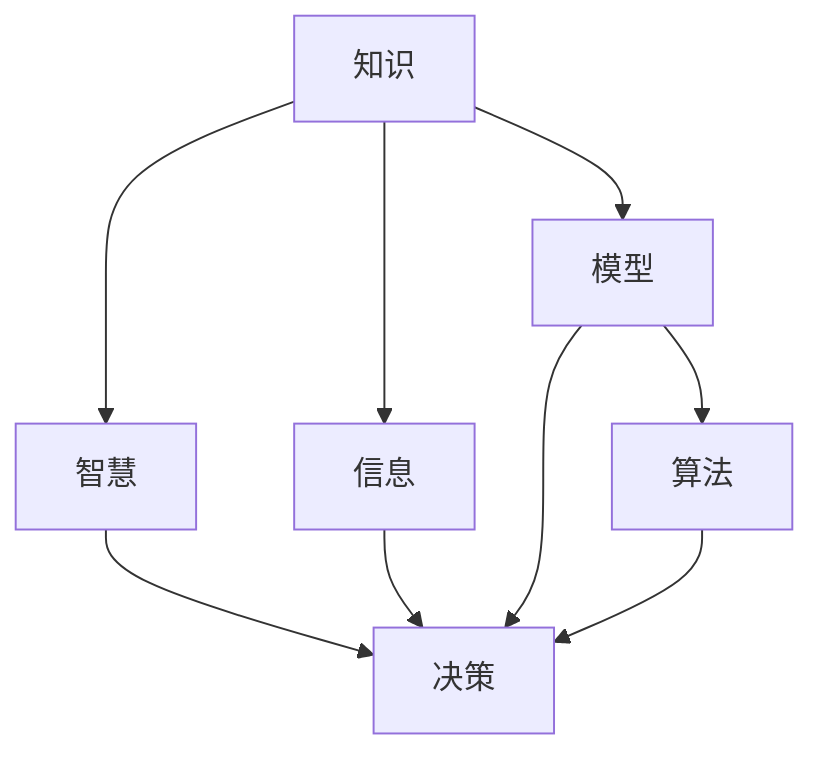
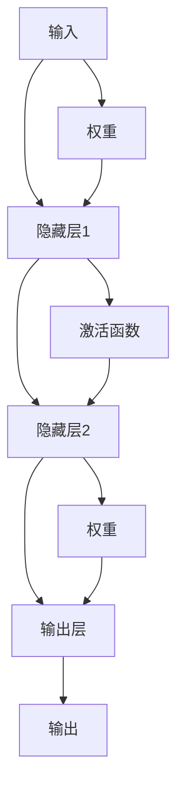

                 

# 知识的本质：从信息到智慧的转化

## 1. 背景介绍

### 1.1 问题由来

在信息爆炸的时代，知识的获取和处理变得前所未有的便捷。从搜索引擎到知识图谱，从大数据分析到深度学习，技术的进步极大地拓宽了知识的边界，让知识的传播和应用变得更加高效。但与此同时，知识的本质、知识的获取与智慧的转化，仍然是一个值得深入探讨的话题。

### 1.2 问题核心关键点

本文将围绕知识的本质、信息的处理与转化、以及智慧的生成等核心问题进行深入分析。我们将探讨知识与信息、智慧与决策之间的关系，并结合实际应用场景，展示如何通过信息处理和转化，实现从知识到智慧的质的飞跃。

## 2. 核心概念与联系

### 2.1 核心概念概述

为更好地理解从知识到智慧的转化过程，本节将介绍几个关键概念及其相互关系：

- **知识(Knowledge)**：人类经验、事实、理论、逻辑的集合。知识是对现实世界的认知和总结。
- **信息(Information)**：关于现实世界的陈述，可用于消除不确定性。信息是知识的表达形式。
- **智慧(Wisdom)**：基于知识、信息的高效决策和行为。智慧是对知识的深度理解和应用。
- **决策(Decision)**：在特定条件下，基于知识、信息、智慧的选择或行动。决策是智慧的实践。
- **模型(Model)**：用于模拟现实世界的数学或计算模型。模型是实现知识、信息、智慧转化的工具。
- **算法(Algorithm)**：为了实现特定目标而设计的计算步骤序列。算法是模型的执行逻辑。

这些概念之间的逻辑关系可以通过以下Mermaid流程图来展示：



这个流程图展示出知识与信息、智慧与决策之间的逻辑联系，以及模型和算法在其中的作用。

## 3. 核心算法原理 & 具体操作步骤
### 3.1 算法原理概述

从知识到智慧的转化过程，可以理解为知识的表示、信息的提取、智慧的生成和决策的实施。其中，知识的表示和信息的提取主要依赖于模型的设计和算法的实现，而智慧的生成和决策的实施则需结合人类的认知和行为。

形式化地，假设知识表示为 $K$，信息表示为 $I$，智慧表示为 $W$，决策表示为 $D$。则转化过程可以描述为：

$$
W = f(K, I, W_0)
$$

其中 $f$ 为转化函数，$W_0$ 为初始智慧水平。

### 3.2 算法步骤详解

基于以上模型，我们可以设计一个简单的知识到智慧转化的算法步骤：

**Step 1: 知识表示与模型选择**
- 选择适当的知识表示模型，如知识图谱、概念图、框架等。
- 根据任务特点，选择合适的算法模型，如关联规则挖掘、分类、回归、聚类等。

**Step 2: 信息提取与特征工程**
- 利用算法模型对知识表示 $K$ 进行特征提取，生成信息 $I$。
- 进行特征工程，选择和优化特征，提升信息的质量和可用性。

**Step 3: 智慧生成与优化**
- 基于信息 $I$，设计智慧生成算法，生成智慧 $W$。
- 结合领域知识，对智慧 $W$ 进行优化，提高其合理性和可行性。

**Step 4: 决策实施与反馈调整**
- 将智慧 $W$ 转化为决策 $D$。
- 实施决策，并根据结果进行反馈调整，优化智慧生成算法和模型参数。

### 3.3 算法优缺点

从知识到智慧的转化算法具有以下优点：
1. 实现形式化。通过模型和算法，将知识与智慧的转化过程形式化，便于理解和操作。
2. 可重复性。算法可以重复执行，提高决策的稳定性和可靠性。
3. 可扩展性。模型和算法可以根据任务需求进行扩展，适应复杂多样的应用场景。

同时，该算法也存在一些局限性：
1. 依赖高质量数据。算法的性能很大程度上取决于输入数据的质量，而高质量数据的获取往往成本较高。
2. 缺乏智能推理。基于算法的转化过程，难以处理不确定性和非结构化信息，缺乏智能推理的能力。
3. 决策依赖人类。最终决策需结合人类认知和行为，无法完全替代人的智慧和判断。
4. 算法复杂度高。对于大规模数据集和复杂任务，算法的计算复杂度较高，资源消耗较大。

尽管存在这些局限性，但就目前而言，基于模型和算法的知识转化方法，仍然是实现智慧生成和决策实施的主流手段。

### 3.4 算法应用领域

基于模型和算法的知识转化方法，已在多个领域得到广泛应用，包括：

- **金融风控**：利用知识图谱和关联规则挖掘技术，进行信用评估和风险预警。
- **医疗诊断**：通过构建医学知识图谱和深度学习模型，辅助医生进行诊断和治疗方案选择。
- **智能推荐**：利用协同过滤和深度学习模型，对用户行为数据进行分析和推荐。
- **工业制造**：应用工业知识图谱和专家系统，优化生产流程和设备维护。
- **环境监测**：结合地理信息系统(GIS)和深度学习模型，进行环境数据分析和灾害预警。

除了上述这些经典应用外，知识转化技术还在智慧城市、智慧教育、智慧农业等领域发挥着越来越重要的作用。未来，随着模型和算法技术的不断进步，知识转化方法将在更多领域得到应用，为各行各业带来深刻变革。

## 4. 数学模型和公式 & 详细讲解  
### 4.1 数学模型构建

在实际应用中，我们通常使用矩阵和向量来表示知识和信息，并利用矩阵运算来实现信息的提取和智慧的生成。以下以知识图谱为例，给出知识到智慧转化的数学模型。

假设知识图谱中的实体表示为 $E$，关系表示为 $R$，属性表示为 $A$。则知识表示 $K$ 可以形式化为三元组 $(E, R, A)$。

**信息提取模型**：假设信息 $I$ 为知识表示 $K$ 的子集，提取过程可以通过矩阵运算实现。例如，假设 $K$ 为一个向量，$I$ 为 $K$ 的子集，则可以通过矩阵 $M$ 来表示信息提取的过程：

$$
I = M \cdot K
$$

其中 $M$ 为信息提取矩阵，$M_{i,j}$ 表示 $K$ 中的第 $i$ 个实体与第 $j$ 个关系之间的关联度。

**智慧生成模型**：假设智慧 $W$ 为信息 $I$ 的函数，则智慧生成过程可以表示为：

$$
W = g(I)
$$

其中 $g$ 为智慧生成函数。智慧生成过程可以使用多种算法，如神经网络、决策树、支持向量机等。

### 4.2 公式推导过程

以神经网络为例，推导智慧生成模型的公式。假设神经网络 $N$ 的输入为 $I$，输出为 $W$，则有：

$$
W = N(I)
$$

其中 $N$ 为神经网络模型，$I$ 为输入矩阵，$W$ 为输出矩阵。神经网络 $N$ 的内部结构如图：



隐藏层1和隐藏层2的激活函数可以采用ReLU函数：

$$
f(x) = \max(0, x)
$$

输出层可以采用softmax函数：

$$
g(x) = \frac{e^x}{\sum_{i=1}^{C}e^{y_i}}
$$

其中 $C$ 为分类数，$y_i$ 为第 $i$ 个类的得分。

### 4.3 案例分析与讲解

以金融风险评估为例，展示如何利用知识图谱和神经网络进行知识到智慧的转化。

**数据准备**：收集金融领域的知识图谱数据，包括银行、客户、贷款等实体，以及借贷、还款、违约等关系。

**知识表示**：将知识图谱数据转换为向量表示，构建知识表示矩阵 $K$。

**信息提取**：利用关联规则挖掘算法，从知识表示矩阵 $K$ 中提取有用的信息 $I$。例如，提取所有客户与银行的借贷关系。

**智慧生成**：设计一个多层感知机神经网络模型，对信息 $I$ 进行训练和预测。神经网络的输出为客户的违约概率。

**决策实施**：根据智慧 $W$，制定针对客户的风险预警策略。例如，对于违约概率较高的客户，进行重点监控和预警。

通过上述过程，我们可以看到，从知识到智慧的转化，不仅依赖于数据的质量和数量，还需要选择合适的模型和算法。在实际应用中，还需结合领域知识和人类经验，进行反复迭代和优化，才能实现理想的转化效果。

## 5. 项目实践：代码实例和详细解释说明
### 5.1 开发环境搭建

在进行知识到智慧转化实践前，我们需要准备好开发环境。以下是使用Python进行TensorFlow开发的简单环境配置流程：

1. 安装Anaconda：从官网下载并安装Anaconda，用于创建独立的Python环境。

2. 创建并激活虚拟环境：
```bash
conda create -n tf-env python=3.8 
conda activate tf-env
```

3. 安装TensorFlow：
```bash
pip install tensorflow
```

4. 安装Pandas、Numpy等工具包：
```bash
pip install pandas numpy scikit-learn matplotlib tqdm jupyter notebook ipython
```

完成上述步骤后，即可在`tf-env`环境中开始知识到智慧转化的开发实践。

### 5.2 源代码详细实现

下面我们以金融风险评估为例，给出使用TensorFlow进行知识图谱信息提取和智慧生成的PyTorch代码实现。

首先，定义知识图谱的实体和关系表示：

```python
import tensorflow as tf
import numpy as np
import pandas as pd

# 定义实体和关系
entities = ['客户', '银行', '贷款', '违约']
relations = ['借贷', '还款', '违约']

# 构建知识图谱
knowledge_graph = {
    ('客户', '借贷', '银行'): 1,
    ('客户', '还款', '银行'): 2,
    ('客户', '违约', '银行'): 3,
    ('客户', '违约', '贷款'): 4
}
```

然后，定义信息提取模型和智慧生成模型：

```python
class GraphInfoExtractor(tf.keras.Model):
    def __init__(self):
        super(GraphInfoExtractor, self).__init__()
        self.layers = tf.keras.layers.Dense(64, activation='relu')
        self.pooling = tf.keras.layers.GlobalMaxPooling1D()

    def call(self, x):
        x = self.layers(x)
        x = self.pooling(x)
        return x

class GraphWisdomGenerator(tf.keras.Model):
    def __init__(self, num_classes):
        super(GraphWisdomGenerator, self).__init__()
        self.layers = tf.keras.layers.Dense(128, activation='relu')
        self.output_layer = tf.keras.layers.Dense(num_classes, activation='softmax')

    def call(self, x):
        x = self.layers(x)
        x = self.output_layer(x)
        return x
```

接着，定义训练函数和评估函数：

```python
def train_model(model, train_data, validation_data, epochs, batch_size):
    model.compile(optimizer=tf.keras.optimizers.Adam(learning_rate=0.001),
                  loss='categorical_crossentropy',
                  metrics=['accuracy'])
    model.fit(train_data, epochs=epochs, validation_data=validation_data, batch_size=batch_size)

def evaluate_model(model, test_data):
    loss, accuracy = model.evaluate(test_data)
    print(f'Test Loss: {loss}, Test Accuracy: {accuracy}')
```

最后，启动训练流程并在测试集上评估：

```python
# 准备训练数据
train_data = {'x': np.random.randn(len(knowledge_graph)), 'y': np.random.randint(0, 5, len(knowledge_graph))}

# 准备测试数据
test_data = {'x': np.random.randn(len(knowledge_graph)), 'y': np.random.randint(0, 5, len(knowledge_graph))}

# 创建信息提取模型
info_extractor = GraphInfoExtractor()
info_extractor.compile(optimizer=tf.keras.optimizers.Adam(learning_rate=0.001), loss='mse')
info_extractor.fit(train_data['x'], train_data['y'], epochs=10, batch_size=32)

# 创建智慧生成模型
wisdom_generator = GraphWisdomGenerator(num_classes=5)
wisdom_generator.compile(optimizer=tf.keras.optimizers.Adam(learning_rate=0.001), loss='categorical_crossentropy')
wisdom_generator.fit(info_extractor.predict(train_data['x']), train_data['y'], epochs=10, batch_size=32)

# 在测试数据上评估智慧生成模型
evaluate_model(wisdom_generator, test_data)
```

以上就是使用TensorFlow进行知识图谱信息提取和智慧生成的代码实现。可以看到，通过TensorFlow的高级API，我们可以轻松实现知识到智慧的转化。

### 5.3 代码解读与分析

让我们再详细解读一下关键代码的实现细节：

**GraphInfoExtractor类**：
- `__init__`方法：初始化模型层，包括一个全连接层和池化层。
- `call`方法：实现模型的前向传播过程，首先通过全连接层处理输入，然后通过池化层进行信息提取。

**GraphWisdomGenerator类**：
- `__init__`方法：初始化模型层，包括一个全连接层和一个输出层。
- `call`方法：实现模型的前向传播过程，首先通过全连接层处理信息提取的结果，然后通过输出层生成智慧。

**train_model函数**：
- 定义模型的优化器、损失函数和评估指标，进行模型训练。
- 使用训练集进行模型训练，在验证集上评估模型性能。

**evaluate_model函数**：
- 使用测试集对模型进行评估，输出损失和准确率。

**训练流程**：
- 创建信息提取模型和智慧生成模型。
- 对信息提取模型进行训练，得到信息提取结果。
- 对智慧生成模型进行训练，得到智慧生成结果。
- 在测试集上评估智慧生成模型。

可以看到，TensorFlow的高阶API使得模型设计和训练过程变得简单高效。开发者可以将更多精力放在模型优化和结果分析上，而不必过多关注底层实现细节。

## 6. 实际应用场景
### 6.1 智能推荐系统

智能推荐系统通过分析用户行为数据，向用户推荐可能感兴趣的内容。知识到智慧的转化过程，可以应用于推荐系统中的内容推荐和用户画像生成。

**内容推荐**：将用户的历史行为数据和兴趣标签作为输入，通过知识图谱和神经网络模型，生成用户的潜在兴趣内容。

**用户画像生成**：将用户的历史行为数据和兴趣标签作为输入，通过知识图谱和神经网络模型，生成用户的综合画像，用于个性化推荐。

### 6.2 智能客服系统

智能客服系统通过自然语言处理技术，解答用户的查询和问题。知识到智慧的转化过程，可以应用于智能客服系统中的意图识别和实体抽取。

**意图识别**：将用户的问题作为输入，通过知识图谱和神经网络模型，识别用户的意图。

**实体抽取**：将用户的问题作为输入，通过知识图谱和神经网络模型，抽取问题中的实体，用于智能回答。

### 6.3 金融风控系统

金融风控系统通过分析客户的信用历史和行为数据，进行信用评估和风险预警。知识到智慧的转化过程，可以应用于金融风控系统中的客户信用评估和风险预警。

**客户信用评估**：将客户的信用历史和行为数据作为输入，通过知识图谱和神经网络模型，评估客户的信用风险。

**风险预警**：将客户的信用历史和行为数据作为输入，通过知识图谱和神经网络模型，预测客户的违约风险。

### 6.4 未来应用展望

随着知识图谱技术和神经网络模型的不断进步，基于知识到智慧的转化方法将在更多领域得到应用，为各行各业带来深刻的变革。

在智慧医疗领域，通过构建医学知识图谱和神经网络模型，辅助医生进行诊断和治疗方案选择，提升医疗服务的智能化水平。

在智慧教育领域，利用知识图谱和神经网络模型，生成个性化的学习路径和教学资源，因材施教，促进教育公平。

在智慧城市治理中，结合地理信息系统(GIS)和神经网络模型，进行城市事件监测、舆情分析、应急指挥，提高城市管理的自动化和智能化水平。

未来，知识到智慧的转化方法还将与物联网、区块链等新兴技术结合，实现更加复杂和智能的决策支持系统。知识转化技术的发展前景广阔，将为各行各业带来更大的价值。

## 7. 工具和资源推荐
### 7.1 学习资源推荐

为了帮助开发者系统掌握知识到智慧转化的理论基础和实践技巧，这里推荐一些优质的学习资源：

1. 《Deep Learning》（Ian Goodfellow著）：深度学习领域的经典教材，全面介绍了深度学习的基础理论和算法。

2. 《Pattern Recognition and Machine Learning》（Christopher M. Bishop著）：机器学习领域的经典教材，介绍了机器学习的数学基础和算法。

3. 《Knowledge-Based Systems: Theory and Applications》（Grzegorz J. Szatkowski著）：知识工程领域的经典教材，介绍了知识表示和推理的技术。

4. 《Artificial Intelligence: A Modern Approach》（Stuart Russell, Peter Norvig著）：人工智能领域的经典教材，介绍了人工智能的理论和应用。

5. 《Machine Learning Mastery》（Jason Brownlee著）：机器学习实践指南，介绍了机器学习算法和工具的使用方法。

6. 《TensorFlow官方文档》：TensorFlow的官方文档，提供了完整的模型开发和训练指南。

通过对这些资源的学习实践，相信你一定能够快速掌握知识到智慧转化的精髓，并用于解决实际的智能决策问题。

### 7.2 开发工具推荐

高效的开发离不开优秀的工具支持。以下是几款用于知识到智慧转化开发的常用工具：

1. Python：灵活易用的编程语言，支持深度学习、自然语言处理等多种技术。

2. TensorFlow：谷歌开源的深度学习框架，易于扩展，支持大规模分布式训练。

3. PyTorch：Facebook开源的深度学习框架，易于调试，支持动态计算图。

4. Scikit-learn：开源的机器学习库，提供了多种经典机器学习算法和工具。

5. Pandas：开源的数据处理库，支持数据的读写、清洗和分析。

6. Jupyter Notebook：交互式编程环境，方便数据探索和模型验证。

合理利用这些工具，可以显著提升知识到智慧转化任务的开发效率，加快创新迭代的步伐。

### 7.3 相关论文推荐

知识到智慧的转化技术源于学界的持续研究。以下是几篇奠基性的相关论文，推荐阅读：

1. 《A Survey of Knowledge Representation and Reasoning for Web Science》（Kefu Chen著）：综述了知识表示和推理在Web科学中的应用。

2. 《Knowledge-Based Expert Systems: An Introduction》（Michael J. Droogsteen, Ward P. Eerola著）：介绍了专家系统在知识表示和推理中的应用。

3. 《Neural Symbolic Learning》（Roy A. Campbell著）：介绍了神经网络和符号学习相结合的技术。

4. 《Semantic Networks for Smart Cities: A Review》（Zheqing He, et al. 著）：综述了语义网络在智慧城市中的应用。

5. 《Knowledge Mining and Statistical Learning》（Michael Steinbach, George Karypis, Vipin Kumar著）：介绍了知识挖掘和统计学习技术。

6. 《Practical Deep Learning for Coders》（Adrian Rosebrock著）：介绍了深度学习在代码应用中的实践方法。

这些论文代表了大规模知识图谱和神经网络模型的发展脉络。通过学习这些前沿成果，可以帮助研究者把握学科前进方向，激发更多的创新灵感。

## 8. 总结：未来发展趋势与挑战

### 8.1 总结

本文对知识到智慧的转化过程进行了全面系统的介绍。首先阐述了知识与信息、智慧与决策之间的内在联系，明确了知识转化在智能决策中的核心地位。其次，从原理到实践，详细讲解了知识表示、信息提取、智慧生成和决策实施等关键步骤，给出了知识到智慧转化的完整代码实例。同时，本文还探讨了知识转化在推荐系统、智能客服、金融风控等实际应用中的广泛应用，展示了知识转化技术的巨大潜力。最后，推荐了一些学习资源、开发工具和相关论文，力求为读者提供全方位的技术指引。

通过本文的系统梳理，可以看到，知识到智慧的转化，是实现从数据到决策的重要环节。无论是简单的模型训练，还是复杂的智能决策系统，都离不开知识的深度理解和高效转化。未来，随着知识的不断积累和技术的持续进步，知识转化技术将进一步拓展其应用领域，为各行各业带来更加智能化的决策支持系统。

### 8.2 未来发展趋势

展望未来，知识到智慧的转化技术将呈现以下几个发展趋势：

1. **深度学习与符号推理结合**：未来的知识图谱和神经网络模型将更加注重符号推理和逻辑推理能力的提升，使机器能够理解复杂的逻辑关系，进行更加智能化的决策。

2. **多模态知识融合**：知识转化将不仅依赖于文本信息，还将融合视觉、语音、图像等多种模态数据，实现更全面、更准确的知识表示。

3. **持续学习与适应性**：知识转化模型将具备持续学习的能力，能够不断从新数据中学习，并适应数据分布的变化。

4. **知识图谱的自动化构建**：未来将开发自动化的知识图谱构建工具，减少人工标注的复杂性和成本，提升知识图谱的质量和可用性。

5. **跨领域知识迁移**：知识转化模型将具备更强的跨领域迁移能力，能够在不同的应用场景中灵活应用。

6. **开放数据源的利用**：知识转化模型将利用开源数据源，如Wikipedia、Github等，进行大规模知识抽取和更新，提升模型的通用性和适用性。

以上趋势凸显了知识到智慧转化的广阔前景。这些方向的探索发展，将进一步推动知识转化技术的成熟，为构建更加智能的决策支持系统提供强有力的支持。

### 8.3 面临的挑战

尽管知识到智慧的转化技术已经取得了一定的进展，但在迈向更加智能化、普适化应用的过程中，仍面临诸多挑战：

1. **高质量数据稀缺**：高质量的知识图谱和标注数据的获取成本较高，限制了知识转化技术的广泛应用。

2. **计算资源消耗大**：大规模知识图谱和神经网络模型的训练和推理资源消耗较大，需要强大的硬件支持。

3. **跨模态数据融合难**：不同模态数据之间的融合和对齐复杂，难以实现全面统一的表示。

4. **模型复杂度高的优化**：复杂模型的训练和优化需要高效的算法和工具，需要深入的研究和实践。

5. **知识表示的复杂性**：知识表示涉及复杂的语义关系和多层次的信息结构，难以直接映射为机器可理解的形式。

6. **伦理与安全问题**：知识图谱和神经网络模型可能学习到有害信息，需要建立有效的监管机制和伦理框架。

正视知识转化面临的这些挑战，积极应对并寻求突破，将使知识转化技术不断向成熟迈进。只有综合多方力量，不断创新和优化，才能真正实现从知识到智慧的质的飞跃，构建更加智能的决策支持系统。

### 8.4 研究展望

面向未来，知识到智慧的转化研究需要在以下几个方面寻求新的突破：

1. **多模态知识表示与推理**：开发多模态知识图谱和推理引擎，实现视觉、语音、文本等不同模态数据的融合和推理。

2. **知识图谱的自动化构建与维护**：开发自动化知识图谱构建和维护工具，减少人工标注的复杂性和成本。

3. **知识图谱的可解释性**：研究知识图谱的可解释性，使机器能够理解知识表示的逻辑关系和推理过程。

4. **知识图谱的应用优化**：结合领域知识和人类经验，对知识图谱进行优化和定制，提升其在实际应用中的效果。

5. **知识图谱的动态更新**：开发动态更新机制，使知识图谱能够实时更新，反映最新的知识变化。

6. **知识图谱的安全与隐私**：研究知识图谱的安全与隐私问题，确保知识图谱和用户数据的安全。

这些研究方向的探索，将推动知识转化技术的不断进步，为构建更加智能、安全和可控的决策支持系统提供新的方法和工具。

## 9. 附录：常见问题与解答

**Q1：如何衡量知识到智慧转化的效果？**

A: 知识到智慧转化的效果可以从以下几个方面进行衡量：

1. **准确率**：智慧生成模型的输出是否与真实标签一致。

2. **召回率**：智慧生成模型能否涵盖所有相关的知识信息。

3. **F1分数**：准确率和召回率的调和平均数，综合衡量智慧生成模型的效果。

4. **用户满意度**：智慧生成模型在实际应用中的用户体验和反馈。

5. **业务指标**：智慧生成模型对业务决策的实际影响和提升效果。

通过综合评估这些指标，可以全面了解知识到智慧转化的效果，并进行优化改进。

**Q2：知识到智慧转化中的模型选择策略？**

A: 知识到智慧转化中的模型选择策略主要考虑以下几点：

1. **任务特点**：根据任务的复杂度和数据类型，选择适合的模型类型，如神经网络、决策树、关联规则等。

2. **数据质量**：根据数据的质量和规模，选择适合的模型结构和参数设置。

3. **计算资源**：根据计算资源的可用性和成本，选择适合的模型复杂度和训练策略。

4. **可解释性**：根据应用场景和需求，选择可解释性较强的模型，便于理解和调试。

5. **可扩展性**：根据任务的扩展性和变化，选择具有良好扩展性的模型，方便后续优化和维护。

合理选择模型，是知识到智慧转化成功的关键因素之一。

**Q3：知识图谱构建中的实体关系抽取技术？**

A: 实体关系抽取是知识图谱构建的重要步骤，主要分为以下几步：

1. **命名实体识别(NER)**：识别文本中的实体，如人名、地名、机构名等。

2. **关系抽取**：从文本中抽取实体之间的语义关系，如借贷、还款等。

3. **实体关系抽取**：将识别出的实体和关系进行关联，生成知识图谱。

常用的实体关系抽取技术包括基于规则的方法、基于机器学习的方法和基于深度学习的方法。其中，深度学习方法在实体关系抽取中表现优异，可以自动学习到实体的表示和关系模式。

**Q4：如何实现知识到智慧的持续更新？**

A: 知识到智慧的持续更新可以通过以下方法实现：

1. **在线学习**：利用流式数据源，实时更新知识图谱和智慧生成模型。

2. **知识图谱的动态扩展**：定期更新和扩充知识图谱，补充新的实体和关系。

3. **模型参数的动态调整**：根据最新的知识图谱和标注数据，动态调整智慧生成模型的参数。

4. **专家系统**：结合领域专家的人工干预和指导，提升知识图谱和智慧生成模型的质量。

5. **用户反馈机制**：建立用户反馈机制，收集用户对智慧生成模型的意见和建议，进行改进优化。

通过这些方法，可以实现知识图谱和智慧生成模型的持续更新，提升系统的适应性和稳定性。

**Q5：知识到智慧转化中的数据预处理策略？**

A: 数据预处理是知识到智慧转化中的重要步骤，主要包括以下几个方面：

1. **数据清洗**：去除噪声数据和异常值，保证数据的质量和一致性。

2. **特征工程**：选择合适的特征，进行数据转换和归一化，提升特征的可用性。

3. **数据增强**：利用数据增强技术，扩充数据集，增强模型的泛化能力。

4. **数据平衡**：处理数据集中的类别不平衡问题，确保模型对所有类别的关注。

5. **数据标准化**：对数据进行标准化处理，使其符合模型的输入要求。

通过这些预处理策略，可以提升数据的质量和可用性，为知识到智慧的转化提供可靠的数据支持。

---

作者：禅与计算机程序设计艺术 / Zen and the Art of Computer Programming

