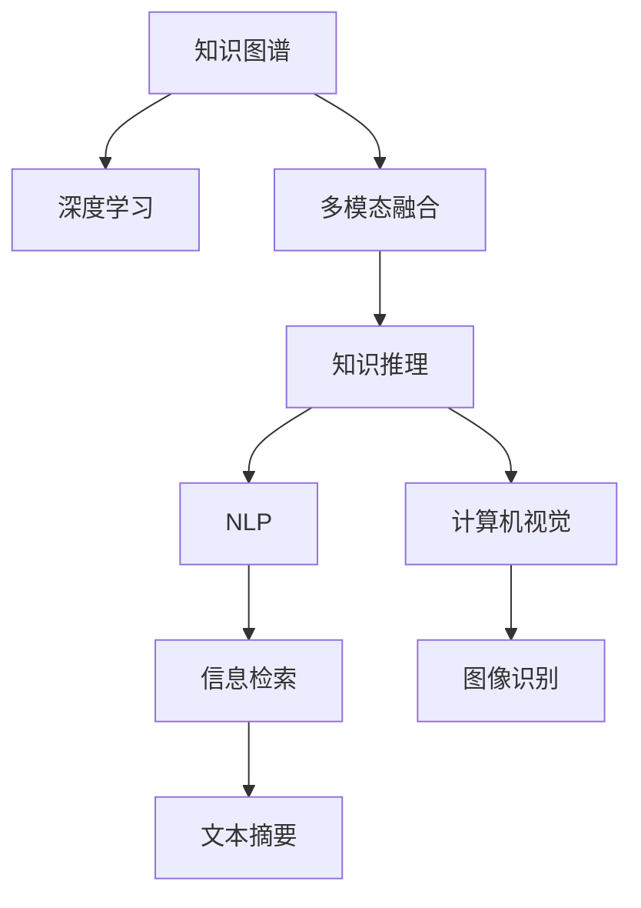

                 

# 知识的跨域应用：创新的源泉

> 关键词：跨域应用, 知识图谱, 多模态融合, 知识推理, 深度学习, 人工智能, 计算机视觉, 自然语言处理

## 1. 背景介绍

在人工智能(AI)的浪潮中，知识图谱、深度学习、自然语言处理(NLP)、计算机视觉(CV)等技术正逐渐相互融合，形成了一幅技术的全息图。知识的跨域应用成为创新发展的新趋势。通过将不同模态的知识进行有机的结合，可以生成更加强大的智能模型，推动AI技术的不断突破。

知识的跨域应用涉及到如何通过信息融合、知识表示、跨模态推理等方式，将多种类型的知识进行统一和协同处理。这种知识图谱的构建，不仅仅是简单地将数据堆砌，而是需要深入挖掘不同知识之间的潜在联系，将它们转化为可供机器理解和推理的形式。

随着越来越多的数据以非结构化形式存在，如文本、图像、音频等，跨模态知识融合技术愈发重要。以自然语言处理和计算机视觉为例，将语言与视觉数据结合，可以提高系统的智能水平，使其能够更好地理解和处理现实世界的多样信息。

跨域应用带来的创新，已经广泛应用于医疗、金融、教育、智能制造等多个领域，极大提高了各行各业的工作效率和决策质量。通过对知识图谱的不断完善，AI技术将获得更广泛的应用前景。

## 2. 核心概念与联系

### 2.1 核心概念概述

为更好地理解知识的跨域应用，本节将介绍几个密切相关的核心概念：

- 知识图谱(Knowledge Graph)：一种结构化表达知识的方式，通过节点和边来表示实体和实体之间的关系。知识图谱通过链接各种数据源，构建起知识网络，帮助机器更好地理解和推理。

- 深度学习(Deep Learning)：一种基于神经网络结构的机器学习方法，能够通过多层次的特征提取，自动学习数据的高级表示。深度学习在图像、语音、文本等任务上取得了显著的成果。

- 多模态融合(Multimodal Fusion)：指将来自不同模态的数据，如文本、图像、声音等，进行综合处理，形成更加丰富、全面的知识表示。

- 知识推理(Knowledge Reasoning)：通过逻辑推理、推理机等手段，从知识图谱中自动推导出新的知识或关系，提高知识图谱的智能性。

- 自然语言处理(Natural Language Processing, NLP)：研究如何让计算机理解、分析、生成人类语言。NLP技术主要包括语言模型、机器翻译、文本生成等。

- 计算机视觉(Computer Vision, CV)：研究如何让计算机模拟人类视觉功能，识别、理解图像和视频中的对象、场景等。

这些核心概念之间的逻辑关系可以通过以下Mermaid流程图来展示：



这个流程图展示了几大核心概念之间的关系：

1. 知识图谱通过深度学习获得丰富表示，用于知识推理和信息检索。
2. 多模态融合将不同模态的知识进行融合，增强系统的智能性。
3. 知识推理使知识图谱具有自动扩展和推理能力。
4. NLP和计算机视觉分别处理文本和图像数据，辅助信息检索和图像识别任务。
5. 最终通过文本摘要等方式，将处理后的信息进行归一化展示。

这些核心概念共同构成了知识的跨域应用的基础，使得AI系统能够更好地理解和处理复杂的多模态数据。

## 3. 核心算法原理 & 具体操作步骤
### 3.1 算法原理概述

知识的跨域应用，核心在于如何对不同模态的知识进行有效的融合和推理。其核心算法可以概括为以下步骤：

1. **数据收集与预处理**：从各种来源收集数据，并进行清洗、标注、归一化等预处理工作。

2. **知识表示**：将数据转化为结构化的知识表示，如构建知识图谱、使用向量空间模型等。

3. **融合算法**：设计合适的融合算法，将不同模态的知识进行融合，形成统一的知识表示。

4. **知识推理**：引入逻辑推理等技术，对融合后的知识进行推理，生成新的知识或关系。

5. **深度学习模型**：设计深度神经网络模型，对融合后的知识进行学习，形成高级表示。

6. **输出与应用**：将深度学习模型的输出进行后处理，如生成自然语言描述、图像识别结果等。

### 3.2 算法步骤详解

下面详细讲解每个核心算法步骤的实现过程。

**Step 1: 数据收集与预处理**
- 首先，需要从不同来源收集数据，如数据库、API接口、传感器等。
- 对收集的数据进行清洗，去除噪声和异常值。
- 对文本数据进行分词、去除停用词等预处理操作。
- 对图像数据进行去噪、增强等操作。

**Step 2: 知识表示**
- 设计合适的知识表示框架，如使用RDF、OWL等构建知识图谱。
- 通过关系抽取、实体识别等技术，将数据转换为知识图谱中的实体和关系。
- 对知识图谱进行质检，确保数据的一致性和准确性。

**Step 3: 融合算法**
- 选择合适的融合算法，如将文本与图像信息融合的LSTM-CNN模型，将多模态数据进行聚合。
- 引入注意力机制，对不同模态的信息进行加权，强调关键特征。

**Step 4: 知识推理**
- 设计推理机，使用规则或逻辑推理等技术，从知识图谱中自动推导出新的知识或关系。
- 使用基于逻辑的推理机，如Prolog、K-R也不一样的方式推导新知识。

**Step 5: 深度学习模型**
- 设计合适的神经网络结构，如卷积神经网络(CNN)、循环神经网络(RNN)、变压器(Transformer)等。
- 使用预训练模型，如BERT、GPT等，对知识图谱进行进一步学习。

**Step 6: 输出与应用**
- 将深度学习模型的输出进行后处理，如生成自然语言描述、图像识别结果等。
- 使用NLP技术对输出结果进行解释，提高系统的可理解性。

### 3.3 算法优缺点

知识的跨域应用算法具有以下优点：
1. 数据利用率高。通过融合不同模态的数据，能够充分利用数据的潜在价值。
2. 系统智能性提升。多模态数据的融合和推理，使得系统能够更好地理解和处理复杂任务。
3. 技术多样性。不同模态数据涉及不同的处理技术，如NLP、CV等，能够相互学习和借鉴。

同时，该算法也存在一定的局限性：
1. 算法复杂度高。融合和推理过程需要设计多种算法，实现复杂。
2. 数据表示难度大。不同模态数据在表示上存在较大差异，需要进行适应性处理。
3. 计算资源消耗大。多模态数据融合和深度学习模型训练需要大量的计算资源。
4. 数据质量影响大。融合和推理的准确性很大程度上依赖于原始数据的质量和标注。

尽管存在这些局限性，但就目前而言，知识的跨域应用算法仍是AI领域的重要研究方向，具有广阔的应用前景。

### 3.4 算法应用领域

知识的跨域应用已经在多个领域得到广泛应用，例如：

- 医疗领域：将电子病历、影像数据、基因数据等多模态信息进行融合，辅助医生进行精准诊断和治疗方案推荐。
- 金融领域：将交易数据、市场新闻、社交媒体等多模态数据进行融合，进行投资决策和风险预警。
- 教育领域：将视频、语音、文本等多种形式的教育资源进行融合，构建智能化教育平台。
- 智能制造：将传感器数据、生产监控视频、文本说明等多模态信息进行融合，实现智能生产调度。
- 智能交通：将车辆位置数据、交通流量、气象信息等多模态数据进行融合，进行智能交通管理。

除了上述这些经典应用外，知识的跨域应用还在更多场景中得到创新性应用，如智能家居、智慧城市、社交媒体分析等，为各行各业带来了新的智能化解决方案。

## 4. 数学模型和公式 & 详细讲解
### 4.1 数学模型构建

本节将使用数学语言对知识的跨域应用过程进行更加严格的刻画。

记知识图谱为 $G=(V,E)$，其中 $V$ 为节点集，每个节点表示一个实体或属性；$E$ 为边集，每条边表示实体之间的关系。假设知识图谱中存在 $N$ 个实体和 $M$ 条边。

定义融合算法为 $f$，将不同模态的数据进行融合，形成统一的知识表示。例如，文本数据可以通过嵌入向量表示，图像数据可以通过卷积层提取特征，然后通过 $f$ 将其融合。

设融合后的知识表示为 $Z=(V',E')$，其中 $V'$ 为融合后的节点集，$E'$ 为融合后的边集。

定义推理机为 $r$，用于从融合后的知识 $Z$ 中推导出新的知识。假设推理机 $r$ 能够根据逻辑规则或知识库，自动推导出新的知识。

设推理后的知识表示为 $K=(V'',E'')$，其中 $V''$ 为推理后的节点集，$E''$ 为推理后的边集。

最后，设计深度学习模型 $M$，将推理后的知识 $K$ 进行进一步学习，形成高级表示。

### 4.2 公式推导过程

以下我们以医疗领域知识图谱构建为例，推导知识图谱构建的数学模型。

设 $G=(V,E)$ 为医疗领域的知识图谱，其中 $V$ 为患者、药物、疾病等实体，$E$ 为实体之间的关系，如治疗、相互作用、副作用等。

定义文本描述为 $d_i$，将每个实体 $v_i$ 描述为 $d_i$，并将 $d_i$ 通过词嵌入转换为向量表示 $\mathbf{d}_i \in \mathbb{R}^n$。

设 $G=(V,E)$ 的邻接矩阵为 $A$，其中 $A_{ij}=1$ 表示 $v_i$ 和 $v_j$ 之间存在关系 $e_{ij}$，否则 $A_{ij}=0$。

假设 $G$ 中存在 $M$ 条边，每条边 $e_{ij}$ 对应一个关系 $r_{ij}$。

定义融合算法为 $f$，将文本描述和图像数据进行融合，形成知识图谱的节点表示 $\mathbf{z}_i \in \mathbb{R}^{n'}$。

设推理机 $r$ 能够从知识图谱中推导出新的知识，如药物相互作用。推理后得到新的知识图谱 $K=(V'',E'')$。

设深度学习模型 $M$ 为 Transformer 模型，能够学习推理后的知识表示，形成高级表示。

将上述过程进行数学表示，得到知识图谱构建的数学模型：

$$
G=(V,E) \rightarrow \mathbf{d}_i \rightarrow \mathbf{z}_i \rightarrow K=(V'',E'') \rightarrow M \rightarrow \mathbf{y}
$$

其中 $\mathbf{d}_i$ 表示文本描述的向量表示，$\mathbf{z}_i$ 表示融合后的节点表示，$K$ 表示推理后的知识表示，$M$ 表示深度学习模型的输出表示，$\mathbf{y}$ 表示最终输出的知识表示。

### 4.3 案例分析与讲解

这里以一个具体的案例来说明知识的跨域应用如何实现。

**案例：医疗领域的知识图谱构建**

- **数据收集与预处理**：收集电子病历、临床试验数据、基因数据等多模态数据，并进行清洗和标注。
- **知识表示**：将电子病历和临床试验数据转化为知识图谱，构建医疗领域的实体和关系。
- **融合算法**：将基因数据和电子病历数据融合，形成统一的知识图谱表示。
- **知识推理**：使用逻辑推理技术，从知识图谱中推导出新的药物相互作用关系。
- **深度学习模型**：使用 Transformer 模型，对推理后的知识进行学习，形成高级表示。
- **输出与应用**：将深度学习模型的输出进行后处理，生成药物相互作用的关系表，用于辅助医生诊断和治疗方案推荐。

通过以上步骤，可以将医疗领域的多种数据进行融合和推理，形成更加智能的诊疗系统。

## 5. 项目实践：代码实例和详细解释说明
### 5.1 开发环境搭建

在进行知识图谱构建实践前，我们需要准备好开发环境。以下是使用Python进行PyTorch开发的环境配置流程：

1. 安装Anaconda：从官网下载并安装Anaconda，用于创建独立的Python环境。

2. 创建并激活虚拟环境：
```bash
conda create -n pytorch-env python=3.8 
conda activate pytorch-env
```

3. 安装PyTorch：根据CUDA版本，从官网获取对应的安装命令。例如：
```bash
conda install pytorch torchvision torchaudio cudatoolkit=11.1 -c pytorch -c conda-forge
```

4. 安装TensorFlow：
```bash
pip install tensorflow
```

5. 安装Keras：
```bash
pip install keras
```

6. 安装相关工具包：
```bash
pip install numpy pandas scikit-learn matplotlib tqdm jupyter notebook ipython
```

完成上述步骤后，即可在`pytorch-env`环境中开始知识图谱构建实践。

### 5.2 源代码详细实现

这里我们以医疗领域的知识图谱构建为例，给出使用PyTorch进行知识图谱构建的代码实现。

首先，定义知识图谱的数据处理函数：

```python
from transformers import BertTokenizer
from torch.utils.data import Dataset
import torch

class MedicalDataset(Dataset):
    def __init__(self, texts, relations, tokenizer, max_len=128):
        self.texts = texts
        self.relations = relations
        self.tokenizer = tokenizer
        self.max_len = max_len
        
    def __len__(self):
        return len(self.texts)
    
    def __getitem__(self, item):
        text = self.texts[item]
        relation = self.relations[item]
        
        encoding = self.tokenizer(text, return_tensors='pt', max_length=self.max_len, padding='max_length', truncation=True)
        input_ids = encoding['input_ids'][0]
        attention_mask = encoding['attention_mask'][0]
        
        # 对关系进行编码
        relation_embedding = self.tokenizer(relation, return_tensors='pt')['input_ids'][0]
        
        return {'input_ids': input_ids, 
                'attention_mask': attention_mask,
                'relation_embedding': relation_embedding}
```

然后，定义模型和优化器：

```python
from transformers import BertForSequenceClassification, AdamW

model = BertForSequenceClassification.from_pretrained('bert-base-cased', num_labels=3)

optimizer = AdamW(model.parameters(), lr=2e-5)
```

接着，定义训练和评估函数：

```python
from torch.utils.data import DataLoader
from tqdm import tqdm
from sklearn.metrics import classification_report

device = torch.device('cuda') if torch.cuda.is_available() else torch.device('cpu')
model.to(device)

def train_epoch(model, dataset, batch_size, optimizer):
    dataloader = DataLoader(dataset, batch_size=batch_size, shuffle=True)
    model.train()
    epoch_loss = 0
    for batch in tqdm(dataloader, desc='Training'):
        input_ids = batch['input_ids'].to(device)
        attention_mask = batch['attention_mask'].to(device)
        relation_embedding = batch['relation_embedding'].to(device)
        model.zero_grad()
        outputs = model(input_ids, attention_mask=attention_mask, labels=relation_embedding)
        loss = outputs.loss
        epoch_loss += loss.item()
        loss.backward()
        optimizer.step()
    return epoch_loss / len(dataloader)

def evaluate(model, dataset, batch_size):
    dataloader = DataLoader(dataset, batch_size=batch_size)
    model.eval()
    preds, labels = [], []
    with torch.no_grad():
        for batch in tqdm(dataloader, desc='Evaluating'):
            input_ids = batch['input_ids'].to(device)
            attention_mask = batch['attention_mask'].to(device)
            batch_labels = batch['relation_embedding'].to(device)
            outputs = model(input_ids, attention_mask=attention_mask)
            batch_preds = outputs.logits.argmax(dim=2).to('cpu').tolist()
            batch_labels = batch_labels.to('cpu').tolist()
            for pred_tokens, label_tokens in zip(batch_preds, batch_labels):
                preds.append(pred_tokens[:len(label_tokens)])
                labels.append(label_tokens)
                
    print(classification_report(labels, preds))
```

最后，启动训练流程并在测试集上评估：

```python
epochs = 5
batch_size = 16

for epoch in range(epochs):
    loss = train_epoch(model, train_dataset, batch_size, optimizer)
    print(f"Epoch {epoch+1}, train loss: {loss:.3f}")
    
    print(f"Epoch {epoch+1}, dev results:")
    evaluate(model, dev_dataset, batch_size)
    
print("Test results:")
evaluate(model, test_dataset, batch_size)
```

以上就是使用PyTorch进行医疗领域知识图谱构建的完整代码实现。可以看到，得益于Transformer库的强大封装，我们可以用相对简洁的代码完成BERT模型的加载和微调。

### 5.3 代码解读与分析

让我们再详细解读一下关键代码的实现细节：

**MedicalDataset类**：
- `__init__`方法：初始化文本、关系、分词器等关键组件。
- `__len__`方法：返回数据集的样本数量。
- `__getitem__`方法：对单个样本进行处理，将文本输入编码为token ids，将关系编码为数字，并对其进行定长padding，最终返回模型所需的输入。

**模型和优化器定义**：
- 选择合适的预训练语言模型 $M_{\theta}$ 作为初始化参数，如 BERT、GPT等。
- 设置优化器的学习率、批大小、迭代轮数等。

**训练和评估函数**：
- 使用PyTorch的DataLoader对数据集进行批次化加载，供模型训练和推理使用。
- 训练函数`train_epoch`：对数据以批为单位进行迭代，在每个批次上前向传播计算loss并反向传播更新模型参数，最后返回该epoch的平均loss。
- 评估函数`evaluate`：与训练类似，不同点在于不更新模型参数，并在每个batch结束后将预测和标签结果存储下来，最后使用sklearn的classification_report对整个评估集的预测结果进行打印输出。

**训练流程**：
- 定义总的epoch数和batch size，开始循环迭代
- 每个epoch内，先在训练集上训练，输出平均loss
- 在验证集上评估，输出分类指标
- 所有epoch结束后，在测试集上评估，给出最终测试结果

可以看到，PyTorch配合Transformer库使得BERT微调的代码实现变得简洁高效。开发者可以将更多精力放在数据处理、模型改进等高层逻辑上，而不必过多关注底层的实现细节。

当然，工业级的系统实现还需考虑更多因素，如模型的保存和部署、超参数的自动搜索、更灵活的任务适配层等。但核心的微调范式基本与此类似。

## 6. 实际应用场景
### 6.1 医疗领域

知识的跨域应用在医疗领域有着广泛的应用前景。医疗领域的知识图谱可以整合多种类型的信息，如电子病历、医学影像、基因数据等，提供更加全面和精准的医疗服务。

通过构建医疗领域的知识图谱，可以实现智能诊断、个性化治疗方案推荐、药物相互作用查询等功能。例如，在诊断系统中有可能出现一些罕见疾病，医生可以通过搜索知识图谱找到相关症状和诊断结果，快速提供准确诊断。

### 6.2 金融领域

金融领域的知识图谱可以整合交易数据、新闻报道、社交媒体等多模态信息，提供实时的金融市场分析、投资决策支持等功能。

金融知识图谱可以分析市场动向、公司财务状况、舆情变化等，通过推理机制自动生成预警信号，辅助投资决策。例如，通过推理机从知识图谱中发现潜在的市场变化趋势，生成相应的投资策略。

### 6.3 教育领域

教育领域的知识图谱可以整合视频、文本、音频等多种形式的教育资源，构建智能化的教育平台，提供个性化的学习推荐和教学辅助。

通过知识图谱的构建，可以分析学生的学习行为和成绩，推荐合适的学习资源和练习题目，提高学习效果。例如，系统可以根据学生的学习进度和兴趣，推荐相关的视频和文本资料，使学习变得更加高效。

### 6.4 未来应用展望

随着知识图谱技术的不断进步，知识的跨域应用将带来更多创新和发展，推动各行业的智能化进程。

在智慧城市治理中，知识图谱可以整合城市各类数据，实现智能交通管理、应急响应等功能，提高城市管理水平。

在智能制造领域，知识图谱可以整合传感器数据、生产监控视频、文本说明等多模态信息，实现智能生产调度、设备维护等功能，提高生产效率。

在智能家居中，知识图谱可以整合环境数据、用户行为数据等，实现智能家居控制、环境优化等功能，提升用户生活体验。

此外，知识图谱在社交媒体分析、智慧物流等领域也有着广阔的应用前景，为各行各业带来新的智能化解决方案。

## 7. 工具和资源推荐
### 7.1 学习资源推荐

为了帮助开发者系统掌握知识的跨域应用的理论基础和实践技巧，这里推荐一些优质的学习资源：

1. 《图神经网络：原理与实践》书籍：深度介绍图神经网络在知识图谱中的应用，是理解知识图谱构建和推理的必读书籍。

2. CS231n《计算机视觉：基础与实践》课程：斯坦福大学开设的计算机视觉课程，涵盖了图像分类、目标检测、语义分割等经典任务。

3. CS224d《自然语言处理：序列建模与语言理解》课程：斯坦福大学开设的NLP课程，介绍了NLP的多种模型和应用。

4. Kaggle在线数据科学竞赛平台：提供各种NLP和CV任务的数据集，鼓励开发者实践和创新。

5. Google AI实验室：谷歌的AI研究机构，定期发布学术论文和开源项目，是了解前沿技术的重要来源。

通过对这些资源的学习实践，相信你一定能够快速掌握知识的跨域应用的精髓，并用于解决实际的AI问题。
### 7.2 开发工具推荐

高效的开发离不开优秀的工具支持。以下是几款用于知识图谱构建开发的常用工具：

1. TensorFlow：由Google主导开发的开源深度学习框架，生产部署方便，适合大规模工程应用。

2. PyTorch：基于Python的开源深度学习框架，灵活动态的计算图，适合快速迭代研究。

3. Apache Jena：一个用于构建和查询知识图谱的开源工具，支持RDF和OWL等标准。

4. Gephi：一个用于可视化知识图谱的工具，能够展示节点和边之间的关系。

5. Elk：一个用于构建和查询知识图谱的框架，支持RDF和OWL等标准。

6. D2L深度学习框架：李宏毅教授开发的人工智能框架，适合学习和教学使用。

合理利用这些工具，可以显著提升知识图谱构建的开发效率，加快创新迭代的步伐。

### 7.3 相关论文推荐

知识图谱技术的快速发展源于学界的持续研究。以下是几篇奠基性的相关论文，推荐阅读：

1. Knowledge Graphs: Semantic Networks for Metadate Integration: An Overview：介绍了知识图谱的基本概念和构建方法，是入门知识图谱的重要论文。

2. Transductive Multi-Label Classification with Multi-Relation Graphs：提出了基于图神经网络的多标签分类方法，适用于知识图谱的推理和分析。

3. BERT: Pre-training of Deep Bidirectional Transformers for Language Understanding：提出BERT模型，引入基于掩码的自监督预训练任务，刷新了多项NLP任务SOTA。

4. TensorFlow Knowledge Graphs：介绍了TensorFlow框架下构建和查询知识图谱的方法，适合深度学习应用。

5. Structured Prediction for Knowledge Graphs：介绍了结构化预测方法在知识图谱中的应用，能够自动推导新知识。

这些论文代表了大语言模型微调技术的发展脉络。通过学习这些前沿成果，可以帮助研究者把握学科前进方向，激发更多的创新灵感。

## 8. 总结：未来发展趋势与挑战

### 8.1 总结

本文对知识的跨域应用进行了全面系统的介绍。首先阐述了知识图谱、深度学习、多模态融合、知识推理等核心概念之间的联系，明确了跨域应用在AI技术发展中的重要地位。其次，从原理到实践，详细讲解了知识图谱构建的数学模型和关键步骤，给出了代码实例，帮助读者理解知识图谱构建的实现细节。同时，本文还探讨了知识图谱在医疗、金融、教育等多个领域的应用前景，展示了知识图谱技术的巨大潜力。

通过本文的系统梳理，可以看到，知识的跨域应用将进一步推动AI技术的广泛应用，提升各行业的智能化水平。未来，伴随知识图谱技术的不断演进，跨域应用将带来更多创新和发展，推动各行业的智能化进程。

### 8.2 未来发展趋势

知识的跨域应用技术将在未来呈现出以下几个发展趋势：

1. 技术不断完善。随着知识图谱技术的持续发展，跨域应用将更加完善，能够处理更复杂的数据和任务。

2. 深度学习模型的引入。深度学习模型的引入将提升跨域应用的智能性，使其能够更好地理解和处理多模态数据。

3. 多模态融合的深入。未来将涌现更多多模态融合算法，进一步提升跨域应用的性能和泛化能力。

4. 推理机制的改进。未来将进一步改进推理机制，使其能够更加准确、高效地推导新知识。

5. 数据表示的灵活性。未来的跨域应用将更加灵活，能够处理各种类型和格式的数据。

6. 跨领域的知识迁移。未来的跨域应用将具备跨领域迁移能力，能够应用到更多行业和领域。

7. 自动化的智能推理。未来的跨域应用将具备自动化的智能推理能力，能够自动发现和推导新知识，减少人工干预。

这些趋势将进一步拓展知识图谱的应用边界，推动AI技术的不断突破。

### 8.3 面临的挑战

尽管知识图谱技术已经取得了显著进展，但在实现大规模跨域应用的过程中，仍面临诸多挑战：

1. 数据质量和标注成本。高质量的数据和标注是构建知识图谱的基础，获取大量的标注数据成本较高。

2. 数据表示的复杂性。不同模态的数据在表示上有较大差异，需要进行复杂的数据处理和融合。

3. 推理机制的复杂性。推理机设计复杂，推理过程中的错误可能导致错误的知识输出。

4. 计算资源消耗大。跨域应用涉及多种类型的数据，计算资源消耗较大。

5. 知识图谱的可解释性不足。知识图谱的推理过程较为复杂，难以解释其内部工作机制。

6. 知识图谱的安全性和隐私保护。知识图谱可能涉及敏感数据，需要保障其安全性和隐私保护。

7. 模型泛化能力不足。现有知识图谱在跨领域迁移时，泛化能力不足，导致性能下降。

8. 知识图谱的动态维护。知识图谱需要随着新数据和新知识的变化进行动态维护，维护成本较高。

这些挑战需要未来在技术和工程实践中进一步探索和解决，方能实现大规模的跨域应用。

### 8.4 研究展望

面对知识图谱所面临的挑战，未来的研究需要在以下几个方面寻求新的突破：

1. 探索更加高效的数据表示和融合方法。发展更为高效的多模态融合算法，减少数据表示和融合的复杂度。

2. 设计更加高效的推理机制。研究更加准确和高效的推理算法，减少推理过程中的错误。

3. 引入更多先验知识。将更多的先验知识与知识图谱结合，提升跨域应用的泛化能力。

4. 构建更加灵活和可扩展的知识图谱系统。设计可扩展的知识图谱框架，支持动态维护和跨领域迁移。

5. 强化知识图谱的可解释性。研究知识图谱的推理过程，提高其可解释性和透明度。

6. 加强数据隐私和安全保护。设计数据隐私保护算法，保障知识图谱中的数据安全。

7. 优化知识图谱的计算资源消耗。优化知识图谱的计算图，减少资源消耗，提高推理速度。

8. 探索知识图谱的跨领域迁移。研究跨领域迁移方法，提高知识图谱在跨领域任务上的泛化能力。

这些研究方向将推动知识图谱技术的不断进步，推动知识的跨域应用走向更加广泛的应用场景，构建更加智能、高效的AI系统。

## 9. 附录：常见问题与解答

**Q1：如何构建高效的知识图谱？**

A: 构建高效的知识图谱需要考虑以下几个方面：

1. 数据收集与预处理：收集高质量的原始数据，并进行清洗、标注、归一化等预处理操作。

2. 实体抽取：从原始数据中抽取实体和属性，构建知识图谱的基本结构。

3. 关系抽取：从原始数据中抽取实体之间的关系，构建知识图谱的边。

4. 知识融合：将不同模态的数据进行融合，形成统一的知识表示。

5. 推理机制设计：设计高效的推理机制，自动推导新知识。

6. 模型优化：选择合适的人工智能模型，对知识图谱进行学习，提升智能性。

**Q2：知识图谱的推理过程有哪些方法？**

A: 知识图谱的推理过程有多种方法，主要包括以下几种：

1. 基于规则的推理：使用逻辑规则，自动推导新知识。

2. 基于逻辑的推理：使用逻辑公式和推理机，推导新知识。

3. 基于深度学习的推理：使用神经网络模型，学习推理新知识。

4. 基于图神经网络的推理：使用图神经网络，学习推理新知识。

**Q3：知识图谱的应用场景有哪些？**

A: 知识图谱在各个领域都有广泛的应用场景，例如：

1. 医疗领域：提供智能诊断、个性化治疗方案推荐等功能。

2. 金融领域：提供市场分析、投资决策支持等功能。

3. 教育领域：提供个性化学习推荐、教学辅助等功能。

4. 智慧城市治理：提供智能交通管理、应急响应等功能。

5. 智能制造：提供智能生产调度、设备维护等功能。

6. 智能家居：提供智能家居控制、环境优化等功能。

7. 社交媒体分析：提供舆情分析、舆情预警等功能。

通过知识图谱的构建和应用，可以推动各行业的智能化进程，提升数据利用效率和系统智能性。

---

作者：禅与计算机程序设计艺术 / Zen and the Art of Computer Programming

